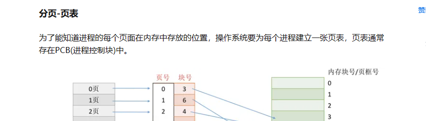

[toc]
## 1. doing
  1. podcast
    * 注意匿名性,注意扣题,注意背景音,
  2. 牙医
    * 10.28天河区中医院补牙
    * 弄医保
  4. vs使用技巧
  6. 内存管理
    https://zhuanlan.zhihu.com/p/359165294
    
  7. 为什么说清空某个vector,可以使用swap而不是其clear方法,这样可以更早的释放vector内部内存?
  8. 条件变量
    条件变量的使用有两大问题:信号丢失和虚假唤醒,相当重要,具体可以看我这篇文章<使用条件变量的坑你知道吗>.
  9. remove的使用
  10. 空指针使用nullptr而不是NULL
  11. enum使用
      尽量使用enum class替代enum,enum class 是带有作用域的枚举类型.

  

--------------------------------------------------------

  1. **refactoring2** 
    codingRepo\notes\6_设计模式\refactoring2\ch1.md
  2. **Cpp-Templates-2ed-master**
    codingRepo\4_source\3_template\Cpp-Templates-2ed-master\docs\01_function_template.md
  3. **js**
    codingRepo\1_notes\0_frontEnd\js\en.javascript.info-master\1-js\04-object-basics\04-object-methods\article.md
  4. modern-cpp
    \codingRepo\2_project\modern-cpp-tutorial-master\book\zh-cn\00-preface.md
  
##  2. todo
  * **project**
    * OS-project
    * network-project
    * 自己做一个vs code插件,可以实现将词汇自动粘贴到某个给定路径,自己用来背单词用.

  * **内存管理**
    * https://zhuanlan.zhihu.com/p/359165294
    * https://blog.csdn.net/zzxiaozhao/article/details/102527023
    * https://zhuanlan.zhihu.com/p/596288935
    * https://www.tutorialspoint.com/operating_system/index.htm

  * **toBeOrganized**
    * wk document:
      * 整理wukong侧的东西,看看有没有用的. 
      * https://confluence.zwcad.com/pages/viewpage.action?pageId=60719484
      * 整理一些笔记给liujun.
    * 卫语句
        https://blog.csdn.net/Holon_/article/details/120556167

## 3. done

## 4. unorganized


std::remove的使用
这个remove其实并没有真正的删除元素,需要和erase配合使用,跑一下这段代码就知道啦.
```c++
bool isOdd(int i) { return i & 1; }

void print(const std::vector<int>& vec) {
    for (const auto& i : vec) {
        std::cout << i << ' ';
    }
    std::cout << std::endl;
}

int main() {
    std::vector<int> v = {0, 1, 2, 3, 4, 5, 6, 7, 8, 9};
    print(v);

    std::remove(v.begin(), v.end(), 5);  // error
    print(v);

    v.erase(std::remove(v.begin(), v.end(), 5), v.end());
    print(v);

    v.erase(std::remove_if(v.begin(), v.end(), isOdd), v.end());
    print(v);
}

```

std::thread的使用
一定要记得join或这detach,否则会crash.

```c++
void func() {}
int main() {
    std::thread t(func);
    if (t.joinable()) {
        t.join(); // 或者t.detach(); 
    }
    return 0;
}
```
