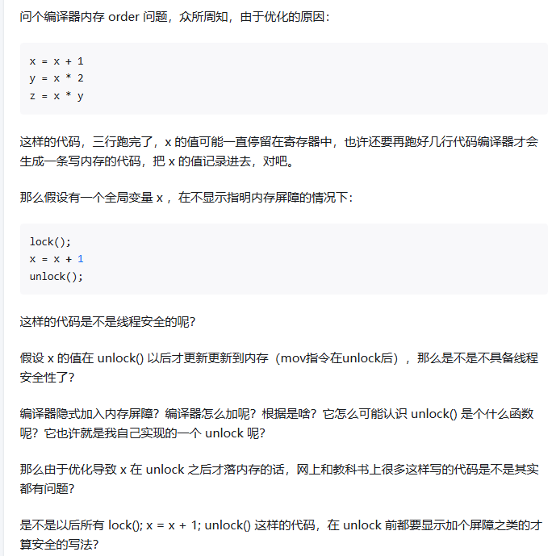

## cpp quiz

### 1. grammar

#### 1.1 c++中NULL和nullptr的区别

* 在C语言中，NULL通常被定义为：#define NULL ((void *)0)

* 所以NULL实际上是一个空指针，如果在C语言中写入以下代码，编译是没有问题的，因为在**C语言中把空指针赋给int和char指针的时候，发生了隐式类型转换，把void指针转换成了相应类型的指针**

  ```c++
  int  *pi = NULL;
  char *pc = NULL;
  ```

* 以上代码如果使用C++编译器来编译则是会出错的，因为C++是强类型语言，void*是不能隐式转换成其他类型的指针的，所以实际上编译器提供的头文件做了相应的处理
  ```c++
  #ifdef __cplusplus
  #define NULL 0
  #else
  #define NULL ((void *)0)
  #endif
  ```

* 但是NULL为0的时候，会出现类型判断错误
    ```c++
    void foo(int);
    void foo(char*);

    foo(NULL);  // 调用哪个函数？
    ```
* **一个new出来的指针,被delete两次会怎么样**
如果一个指针被`delete`两次,会导致未定义行为(Undefined Behavior).这是因为在第一次`delete`后,该指针已经不再指向有效的内存区域,再次尝试`delete`就是对无效内存的操作,这是非法的.

未定义行为可能会导致各种各样的问题,包括但不限于:

- 程序崩溃
- 数据损坏
- 难以预测和解释的行为

为了避免这种情况,你应该确保每个`new`操作都有一个对应的`delete`操作,并且每个`delete`操作都只执行一次.在你的代码中,`UniquePtr`类就是通过封装`new`和`delete`操作来确保资源的正确管理,避免了这种问题.

* ***为什么delete之后,都会设置nullptr***

在C++中,`delete`一个指针后,通常会将其设置为`nullptr`,主要有以下几个原因:

1. **避免悬挂指针**:`delete`一个指针后,该指针就变成了悬挂指针(Dangling Pointer),它不再指向有效的内存区域,但仍然保留了原来的地址值.如果你试图再次使用这个悬挂指针,就会导致未定义行为.将指针设置为`nullptr`可以避免这种情况,因为`nullptr`是一个特殊的指针值,表示该指针不指向任何对象.

2. **安全地重复`delete`**:在C++中,`delete`一个`nullptr`是安全的,不会有任何效果.所以,如果你将一个指针设置为`nullptr`,就可以安全地重复`delete`它,而不会导致未定义行为.

3. **检查指针是否已经被`delete`**:如果你将一个指针设置为`nullptr`,就可以通过检查该指针是否为`nullptr`来判断它是否已经被`delete`.

所以,`delete`一个指针后,通常会将其设置为`nullptr`,以提高程序的安全性和稳定性.


#### 1.2 右值引用


#### 1.3 const T&作为形参的时候，可以输入右值吗？
是的，当函数的形参为 `const T&` 类型时，你可以传入右值。

在 C++ 中，右值引用（`T&&`）主要用于移动语义和完美转发，而 `const T&` 可以绑定到几乎任何类型的表达式，包括临时对象（右值）。

这使得 `const T&` 成为一种非常灵活的形参类型，可以接受各种类型的实参。例如，你可以使用 `const std::string&` 类型的形参来接受字符串字面量、`std::string` 对象，甚至是返回 `std::string` 的函数的结果。

以下是一个例子：

```cpp
void print(const std::string& str) {
    std::cout << str << std::endl;
}

int main() {
    print("Hello, world!");  // 传入字符串字面量（右值）
    std::string s = "Hello, world!";
    print(s);  // 传入 std::string 对象（左值）
    print(std::string("Hello, world!"));  // 传入临时 std::string 对象（右值）
    return 0;
}
```

在这个例子中，`print` 函数的形参为 `const std::string&` 类型，可以接受各种类型的实参。

#### 1.4 为什么std::thread传递引用的时候要用std::ref

#### 1.5 通过指针访问和直接访问的区别是什么？
```c++
    struct Point3d{};
    Point3d origin;
    *pt = &origin;
    origin.x=0.0; // (1)
    pt->x=0.0; // (2) 
```
(1) `origin.x=0.0;` 和 (2) `pt->x=0.0;` 这两种方式都是用来设置`Point3d`对象`origin`的`x`成员的值为`0.0`.它们的区别在于使用的方式不同,从编译器的角度来看:

* (1) `origin.x=0.0;` 这种方式是直接通过对象名和成员名来访问和修改成员的值.编译器在编译时期就能确定`origin`的内存地址,然后通过偏移量找到`x`成员的位置,直接在这个位置写入`0.0`.

* (2) `pt->x=0.0;` 这种方式是通过一个指向对象的指针来访问和修改成员的值.`pt`是一个指向`origin`的指针,`pt->x`表示的是`pt`所指向的对象的`x`成员.在编译时期,编译器并不能确定`pt`所指向的内存地址,它需要在运行时期读取`pt`的值(也就是`origin`的地址),然后通过偏移量找到`x`成员的位置,再在这个位置写入`0.0`.

总的来说,这两种方式的效果是相同的,它们都会设置`origin`的`x`成员的值为`0.0`.但是从编译器的角度来看,直接访问成员的方式更简单,效率也稍微高一些,因为它不需要在运行时期读取指针的值.然而,通过指针访问成员的方式更灵活,它可以动态地访问不同的对象,这在处理数组和动态内存分配时非常有用.

在第二种情况中,`pt->x=0.0;`,`pt`是一个指针,它存储的是`origin`对象的内存地址.编译器在编译时期并不能确定`pt`所指向的具体内存地址,因为这个地址是在运行时期由操作系统分配的.因此,当你通过`pt`来访问`x`成员时,编译器需要在运行时期读取`pt`的值(也就是`origin`的地址),然后通过这个地址和`x`成员的偏移量来找到`x`成员的具体位置.

这就是为什么在运行期需要读取指针的值.这种机制使得指针可以动态地指向不同的对象,这在处理动态内存分配/数组和数据结构(如链表和树)时非常有用.

#### 1.6 一般哪些函数可以使用noexcept?
在C++中,`noexcept`关键字用于指定一个函数不会抛出任何异常.这对于提高代码的性能和可靠性非常有用.以下是一些常见的可以使用`noexcept`的函数:
1. 析构函数:析构函数通常不应抛出任何异常,因为如果在析构函数中抛出异常,可能会导致程序的未定义行为.
2. 移动构造函数和移动赋值操作符:这些函数通常应该被标记为`noexcept`,因为它们通常只涉及指针和基本类型的转移,不应抛出异常.此外,标记为`noexcept`的移动操作可以被标准库容器如`std::vector`更有效地使用.
3. 交换函数:交换函数(如`std::swap`)通常应该被标记为`noexcept`,因为它们通常只涉及指针和基本类型的转移,不应抛出异常.
4. 其他不会抛出异常的函数:如果你知道一个函数不会抛出异常,你应该使用`noexcept`关键字.这可以帮助编译器优化代码,并向其他开发者明确表明该函数不会抛出异常.
在你提供的代码中,移动构造函数和移动赋值操作符被标记为`noexcept`,这是因为它们只涉及指针和基本类型的转移,不应抛出异常.

#### 1.7 c++怎么定义隐式转换规则
在C++中,隐式转换(也称为自动类型转换)是由编译器自动进行的.这些转换规则是由C++语言规定的,例如从int到double的转换,或者从派生类到基类的转换.

然而,你也可以为你的自定义类型定义隐式转换规则.这可以通过定义转换函数来实现.转换函数是一种特殊的成员函数,它可以将一个类的对象转换为其他类型的对象.

例如,假设你有一个名为`MyClass`的类,你想让它可以隐式转换为`int`类型.你可以在`MyClass`中定义一个名为`operator int()`的转换函数:

```cpp
class MyClass {
public:
    operator int() const {
        // 在这里返回一个int值
        return 0;
    }
};
```

然后你就可以这样使用它:

```cpp
MyClass obj;
int i = obj;  // 隐式转换
```

需要注意的是,虽然隐式转换看起来很方便,但它也可能导致一些意想不到的问题,因为它可能在你不知情的情况下发生.因此,一般建议尽量避免使用隐式转换,或者至少要确保你清楚地知道它何时会发生以及它的效果是什么.

#### 1.8 为什么delete之后,都会设置nullptr

在C++中,`delete`一个指针后,通常会将其设置为`nullptr`,主要有以下几个原因:

1. **避免悬挂指针**:`delete`一个指针后,该指针就变成了悬挂指针(Dangling Pointer),它不再指向有效的内存区域,但仍然保留了原来的地址值.如果你试图再次使用这个悬挂指针,就会导致未定义行为.将指针设置为`nullptr`可以避免这种情况,因为`nullptr`是一个特殊的指针值,表示该指针不指向任何对象.

2. **安全地重复`delete`**:在C++中,`delete`一个`nullptr`是安全的,不会有任何效果.所以,如果你将一个指针设置为`nullptr`,就可以安全地重复`delete`它,而不会导致未定义行为.

3. **检查指针是否已经被`delete`**:如果你将一个指针设置为`nullptr`,就可以通过检查该指针是否为`nullptr`来判断它是否已经被`delete`.

所以,`delete`一个指针后,通常会将其设置为`nullptr`,以提高程序的安全性和稳定性.


#### 1.9 既然如此,为什么delete不内置delete完自动设置为nullptr的操作
`delete`操作符在C++中的设计是不会自动将指针设置为`nullptr`的,这主要是由于以下几个原因:

1. **兼容性**:C++是C语言的扩展,为了保持与C语言的兼容性,`delete`操作符的行为与C语言中的`free`函数类似,都不会自动将指针设置为`nullptr`.

2. **灵活性**:在某些情况下,程序员可能不希望`delete`后自动将指针设置为`nullptr`.例如,如果一个指针被多个对象共享,`delete`其中一个对象后,其他对象可能仍需要使用该指针.如果`delete`自动将指针设置为`nullptr`,就会破坏这种共享关系.

3. **性能**:自动将指针设置为`nullptr`需要额外的操作,这可能会对性能产生影响.在性能敏感的程序中,这可能是一个问题.

因此,C++的设计者选择让`delete`操作符的行为更简单/更直接,不自动将指针设置为`nullptr`.这样,程序员可以根据需要自行决定是否将指针设置为`nullptr`.


#### 1.10 c/c++是转成汇编语言的. 那汇编语言是如何处理自定义类型的?
汇编语言本身并没有自定义类型的概念,它只知道字节和地址.当你在C++中定义一个类型(例如,一个结构体或类),编译器会根据你的定义来决定如何在内存中布局数据,以及如何生成对应的汇编代码来访问这些数据.

例如,如果你定义了一个包含两个整数的结构体:

```cpp
struct MyStruct {
    int a;
    int b;
};
```

编译器会知道这个结构体需要8个字节的空间(在大多数现代系统上,一个`int`需要4个字节).当你创建一个`MyStruct`对象并访问它的成员时,编译器会生成对应的汇编代码来读取或写入这些地址.

但是,这个过程是由编译器完成的,汇编语言本身并不知道`MyStruct`这个类型,它只知道如何处理字节和地址.这就是为什么在汇编语言中,你需要手动管理所有的内存布局和数据访问.


#### 1.11 在全局构造函数中，访问其他全局或者静态变量，会发生什么事情？

在C++中，全局构造函数通常指的是全局对象或静态对象的构造函数。这些对象在程序开始执行main函数之前就已经被初始化。

问题在于，C++标准并没有规定全局对象和静态对象的初始化顺序。也就是说，如果一个全局对象或静态对象的构造函数试图访问另一个全局对象或静态对象，那么这个对象可能还没有被初始化，这就会导致不可预知的结果。

例如，假设你有两个全局对象A和B，A的构造函数试图访问B。如果B在A之前被初始化，那么一切都会正常工作。但是，如果A在B之前被初始化，那么A的构造函数就会访问一个未初始化的对象B，这可能会导致程序崩溃或其他错误。

为了避免这种问题，一种常见的解决方案是使用函数内的静态对象，因为这些对象的初始化顺序是确定的：它们在第一次被访问时被初始化。另一种解决方案是避免在全局构造函数中访问其他全局对象或静态对象。

#### 1.12 为什么c++的成员不可以既是template又是virtual的

在C++中，成员函数不能同时是模板（template）和虚函数（virtual）。这是因为这两种特性的工作方式在根本上是冲突的。

1. **模板函数**：模板函数在编译时生成。当你使用一个特定的类型调用模板函数时，编译器会生成一个针对该类型的特化版本。因此，模板函数的所有可能版本必须在编译时已知。

2. **虚函数**：虚函数在运行时解析。当你通过基类指针或引用调用虚函数时，程序会在运行时查找适当的函数版本。因此，虚函数的所有可能版本必须在运行时可用。

如果一个函数既是模板函数又是虚函数，那么它在编译时和运行时都需要解析，这是不可能的。因此，C++不允许函数同时是模板函数和虚函数。


#### 1.13 "vector"（向量）在堆上还是栈上? "vector" 中的数据在堆上还是栈上?

在C++中，`std::vector`对象本身通常在栈上创建，但其管理的数据（即元素）实际上是在堆上分配的。

当你创建一个`std::vector`对象时，它会在栈上分配一小块内存来存储元数据（如元素数量和容量），以及一个指向堆上数据的指针。当你向`std::vector`添加元素时，它会在堆上分配更多的内存来存储这些元素。

因此，可以说`std::vector`的"结构"在栈上，而其"数据"在堆上。

#### 1.14 什么时候需要使用std::move()

在C++中，`std::move()`通常在以下情况下使用：

1. **当你想避免不必要的拷贝时**：如果你有一个大对象，并且你想将它传递给另一个对象，但你不再需要原始对象，那么你可以使用`std::move()`来避免拷贝。这将触发移动构造函数或移动赋值操作符（如果已定义），这通常比拷贝构造函数或拷贝赋值操作符更有效率。

2. **当你想返回局部对象时**：如果你的函数需要返回一个局部对象，并且你想避免返回值优化（RVO）或命名返回值优化（NRVO）未发生时的拷贝，那么你可以使用`std::move()`。

3. **当你需要将左值转换为右值时**：有些函数或方法需要右值引用参数，以便它们可以获取对象的所有权。在这种情况下，你可以使用`std::move()`来将左值转换为右值。

请注意，使用`std::move()`后，原始对象将处于有效但未定义的状态，你不能再使用它，除非你已经重新赋值或重新初始化它。


#### 1.15 c++的cast有几种？分别在什么时候用？

C++提供了四种类型转换操作符，分别用于不同的场景：

1. **`static_cast`**：最常用的类型转换。用于非多态类型的转换。可以用来进行任何隐式转换，比如非const转const，void指针转具体类型指针，以及任何用户定义的类型转换等。
   ```cpp
   int i = 10;
   float f = static_cast<float>(i); // 整型转浮点型
   ```

2. **`dynamic_cast`**：主要用于处理多态性，安全地将基类指针或引用转换为派生类的指针或引用，而且在转换不成功时能够检测到。只能用于包含虚函数的类之间的转换。
   ```cpp
   Base* b = new Derived;
   Derived* d = dynamic_cast<Derived*>(b); // 基类指针转派生类指针
   if (d) { /* 成功转换 */ }
   ```

3. **`const_cast`**：用于修改类型的const或volatile属性。最常见的用途是去除对象的const性质，以允许对const对象的修改。
   ```cpp
   const int ci = 10;
   int* modifiable = const_cast<int*>(&ci);
   *modifiable = 5; // 实际上修改const对象是未定义行为
   ```

4. **`reinterpret_cast`**：提供了低级别的重新解释类型的能力，可以将任何指针转换成任何其他类型的指针（甚至不相关的类型），也可以将指针转换成足够大的整数类型，反之亦然。使用时需要特别小心，因为它可能会导致平台依赖的代码。
   ```cpp
   long p = 0x12345678;
   char* cp = reinterpret_cast<char*>(&p); // 将long型指针转换为char型指针
   ```

但是`dynamic_cast`因为是运行时提供一种检查能力去做指针类型转换的，部分性能敏感的代码，可能不允许使用这个。

每种类型转换操作符都有其特定的用途，选择合适的转换操作符可以使代码更安全、更清晰。

### 2. 编译器

#### 2.1 引用是怎么实现的?
在 C++ 中,当我们说"引用"时,我们通常不会说它被"拷贝",因为引用本身并不占用任何存储空间,它只是一个别名.当你将一个对象作为引用传递给函数时,实际上并没有发生任何拷贝操作.函数接收的是对原始对象的直接引用,而不是任何形式的拷贝.

然而,从底层实现的角度来看,引用在某种程度上可以被视为一个常量指针.当你创建一个引用并将其初始化为一个对象时,编译器会在底层创建一个指向该对象的常量指针.这个指针在初始化后就不能改变,它将一直指向初始化时的那个对象.因此,当你通过引用访问对象时,实际上是通过这个常量指针访问的.

但是,这并不意味着引用是通过拷贝指针来实现的.引用的实现细节可能因编译器和平台的不同而不同,但是从语言的角度来看,引用并不涉及拷贝操作.

#### 2.2 c++的内存空间

1. **代码段(Text Segment)**:也被称为文本区域,这部分空间存储程序的机器代码.

2. **数据段(Data Segment)**:这部分空间存储程序中的全局变量和静态变量.

3. **堆(Heap)**:堆是用于动态内存分配的区域,如C++中的new操作符和C中的malloc函数分配的内存.

4. **栈(Stack)**:栈用于存储局部变量和函数调用的信息.每当一个函数被调用时,一个新的栈帧就会被压入栈中,这个栈帧包含了函数的局部变量和返回地址.

5. **常量段(Constant Segment)**:这部分空间存储程序中的常量值.

6. **BSS段(Block Started by Symbol)**:这部分空间存储程序中未初始化的全局变量和静态变量.

在多线程环境中,每个线程都有自己的栈空间,但所有线程共享同一个堆空间.

需要注意的是,这些内存划分是逻辑上的划分,物理内存的实际布局可能会因操作系统和硬件的不同而有所不同.


##### 2.2.1 c++的对象内存空间
* 一个类的成员函数并不是存储在每个类的实例中的.成员函数只有一份代码,它们存储在内存的代码段中,而不是每个对象的内存空间中.
* 每个对象中存储的是数据成员,而成员函数通过隐式参数this来访问这些数据成员.
* 除了数据成员，还有vptr

##### 2.2.2 常量段和数据段为什么要分开?
常量段和数据段被分开主要是出于以下几个原因:

1. **保护**:常量段中的数据是只读的,不应被修改.将常量段和数据段分开可以让操作系统设置不同的内存保护权限,防止程序错误地修改常量数据.

2. **优化**:编译器和链接器可以对常量数据进行优化.例如,如果一个常量在程序中被多次使用,编译器可以只在常量段中存储一份该常量的副本.

3. **内存管理**:在某些系统中,常量段可能被映射到只读的物理内存或者ROM中,这样可以节省可读写的物理内存.

总的来说,将常量段和数据段分开可以提高程序的安全性和效率,同时也有助于内存管理.

##### 2.2.3 bss段和数据段为什么要分开?
BSS段和数据段被分开主要是出于以下几个原因:

1. **初始化**:数据段中的变量在程序开始运行之前就已经被初始化了,而BSS段中的变量则在程序开始运行时被自动初始化为0.将这两种变量分开可以让操作系统和编译器更有效地处理它们.

2. **存储优化**:在程序的可执行文件中,BSS段的变量不需要占用任何实际的存储空间,只需要记录它们的位置和大小.这是因为BSS段的变量在程序开始运行时都会被初始化为0,所以没有必要在可执行文件中为它们存储实际的数据.这可以减小可执行文件的大小,节省磁盘空间.

3. **内存管理**:将BSS段和数据段分开可以让操作系统更有效地管理内存.例如,操作系统可以将数据段映射到只读的物理内存中,而将BSS段映射到可读写的物理内存中.

总的来说,将BSS段和数据段分开可以提高程序的效率,减小可执行文件的大小,同时也有助于内存管理.


##### 2.2.3. 多线程的内存空间是如何管理的
多线程的内存空间是怎么管理的?
在C++中,每个线程都有自己的栈空间,这个栈空间是在线程创建时由操作系统自动分配的.线程的栈空间通常用于存储线程的局部变量和函数调用的上下文信息.

线程的栈空间通常位于进程的虚拟地址空间中,每个线程的栈空间都是独立的,互不干扰.线程的栈空间大小通常有一个默认值,但是在某些系统和编程环境中,你可以在创建线程时指定栈空间的大小.

需要注意的是,虽然每个线程都有自己的栈空间,但是所有线程共享同一个进程的堆空间.这意味着线程可以通过堆来共享数据,但是需要注意同步和数据一致性的问题.


#### 2.3 C++多态的实现

### 3. new feature

#### 3.1 c++的向量化是什么意思？
向量化在 C++ 中通常指的是一种特殊的编程技术，它可以显著提高处理大量数据时的性能。这种技术利用了现代 CPU 的向量运算指令（如 SIMD 指令），这些指令可以一次处理多个数据。

例如，假设你有两个包含四个元素的数组，你想要将它们相加。在传统的方式中，你可能会写一个循环，依次处理每个元素。但是，如果使用向量化，你可以一次处理所有四个元素。

在 C++ 中，你可以使用特定的库（如 Intel 的 MKL 库或 C++17 的 Parallel STL）来进行向量化操作。此外，许多现代编译器也能自动向量化一些循环。

需要注意的是，虽然向量化可以提高性能，但并不是所有的算法和数据都适合向量化。例如，如果数据量太小，或者算法需要大量的条件判断，那么向量化可能不会带来太大的性能提升。


### 99. Exercise

```c++
int main() {
int a[2][5] = { {1, 2, 3, 4, 5}, {1, 2, 3, 4, 5} };
cout << a << endl;
cout << *a << endl;
cout << *a[0] << endl;
return 0;
}
```

```c++
for (unsigned int i = 10; i >= 0; --i) { ... }
```

```c++
std::vector<int> vec;
vec.push_back(1);
for (auto idx = vec.size(); idx >= 0; idx--) {
    cout << "===== \n";
}
```

```c++
void erase(std::vector<int> &vec, int a) {
    for (auto iter = vec.begin(); iter != vec.end();) { // 这个正确
        if (*iter == a) {
            iter = vec.erase(iter);
        } else {
            ++iter;
        }
    }

    for (auto iter = vec.begin(); iter != vec.end(); ++iter) {  // error
        if (*iter == a) {
            vec.erase(iter); // error
        }
    }
}
```


#### unorganized

#### 10. shared_ptr的引用计数是怎么存储的？

`std::shared_ptr`通过一个控制块来存储引用计数。这个控制块通常包含两个计数器：一个是用于[`shared_ptr`]实例的共享引用计数，另一个是用于`weak_ptr`实例的弱引用计数。当创建一个[`shared_ptr`]或者将其赋值给另一个[`shared_ptr`]时，共享引用计数会增加。当[`shared_ptr`]被销毁或者重新赋值时，共享引用计数会减少。当共享引用计数达到0时，[`shared_ptr`]所管理的对象会被删除。而弱引用计数则用于管理`weak_ptr`的生命周期，不影响对象的生命周期。

#### 12. 怎么在vector变量的有效期内，释放其中元素所占的内存？

在`vector`变量的有效期内释放其中元素所占的内存，可以使用`vector::clear`方法清除所有元素，然后通过`vector::shrink_to_fit`请求释放未使用的内存。但是，`shrink_to_fit`是非强制性的，编译器可能不会释放内存。一个更可靠的方法是使用交换技巧，即创建一个临时空的`vector`并与原`vector`交换。

```cpp
std::vector<int> v = {1, 2, 3, 4, 5};
v.clear(); // 清除所有元素
std::vector<int>().swap(v); // 释放内存
```

#### 14. C++11的thread_local是什么？

`thread_local`是C++11引入的一个存储类说明符，用于声明线程局部存储（Thread-Local Storage, TLS）。每个线程都有一份独立的变量实例，线程局部变量的生命周期从线程开始时创建，到线程结束时销毁。这对于需要保持每个线程独立状态的场景非常有用。

```cpp
thread_local int counter = 0; // 每个线程都有自己的counter副本
```

#### 19. core dump的原因有哪些？


C++基础
vector、list、map这些，复杂度，内部实现，什么场景用什么基本必问，虚函数、内存布局、对象切割，偶尔问问友元模板啥的，还有野指针9、单例、为什么要虚析构、一个对象里几个虚表指针

算法
好几家都是先说说快排的思路，然后其他一些基本排序偶尔也问，但是不多。有家问了个记录栈的最大值没答上来，有家问的两个栈组成一个队列，还有个战力榜实现，这玩意就无脑扯扯堆排序9好吧。

网络
握手挥手基本都问，握手挥手中间有一次丢掉怎么办，处于什么状态，问就是time wait2和重传有家问我套接字Q发送端确认发送出去了然后接收端收不到，我寻思有重传还能收不到，扯扯nagle，后来说他们抓包发现被防火墙挡住了，看我简历里有写抓包啥的问我这个。tcp/udp什么区别，tcp自带心跳和应用层心跳啥的。
数据库

虽然也没啥可问的，但基本都提一嘴，答增删改查授权这些用一用，其他都不怎么用，往这个方向引大概率是想问索引，索引原理，有家电话让我说授权语句，这玩意谁记啊，不都现用现查，说了俩关键字顺序也没整对，后来还是给了个口头

其他
还有些场景题，给一个游戏场景，说说实现思路，用什么结构，然后会在这个基础上问什么情况要怎么处理之类，有家笔试是一道广度的迷宫，还有笔试是序列化9反序列化一个对象到文件。

为什么有的游戏要在udp应用层实现确认和重传，而不用tcp，差距在哪，然后我说我看知乎上有些就是这么说的，具体也没了解过，后来就问我滑动窗口9，张口就来第一个字节收不到，窗口外的都收不到，立马就反应过来不就是问我这个吗，自己笨比没串起来而已


#### 27. 以下四行代码中"123"是否可以修改?
const char*a="123";
char *b="123";
const char c[]="123";
char d[]=“123";
第1，2行，"123"位于常量区，加不加const效果一样，都无法修改，而第三四行，"123"本来在栈上，但是由于const关键字编译器可能将其优化到常量区。总结:只有第四行可以修改。

#### 29. C++如何处理函数返回值？
生成一个临时变量，将它的引用作为函数输入参数。

#### 30. stl分配器的理解？stl的两级分配器的理解？

#### 31. c++的内存池技术

#### 32. 介绍一下C++虚拟内存分区。
主要有六大区域： 
* 代码段(.text)：保存程序二进制机器码，以及文本常量。
* bss段(.bss)：又称全局静态变量区，存储全局变量和静态变量。
* 堆区：动态分配的对象，手动申请和释放。
* 文件映射区：存储动态链接库及mmap函数进行文件映射。
* 栈区：存储临时变量和局部变量，系统自动管理内存。

#### 33. 什么时候会发生段错误

段错误（Segmentation Fault）通常发生在以下情况：

1. **访问非法内存**：尝试访问未分配给程序的内存地址，包括访问空指针解引用、越界访问数组等。

2. **写入只读内存**：尝试修改只读内存区域的内容，如尝试修改字符串常量的值。

3. **栈溢出**：函数调用过深，超出了栈的大小限制，导致栈溢出。

4. **访问已释放的内存**：对已经调用`delete`或`free`释放的内存进行访问或操作。

5. **对齐错误**：在某些平台上，特定类型的数据访问需要满足特定的对齐要求，不满足这些要求也可能导致段错误。

段错误是一种保护机制，操作系统通过它来防止程序执行非法的内存访问，保护程序的内存空间不被破坏。

#### 34. 

extern"C"的作用?

对虚函数机制的理解，单继承、多继承、虚继承条件下虚函数表的结构。
如果虚函数是有效的，那为什么不把所有函数设为虚函数?

如何实现一个线程池?说一下基本思路即可!

---
deque的底层数据结构是什么?它的内部是怎么实现的?
map和unordered map只有什么区别?分别在什么场景下使用?
list的使用场景?std::find可以传入list对应的迭代器吗?

操作系统
操作系统是如何做到进程阻塞的?
线程是如何实现的?
线程之间私有和共享的资源有哪些?
一般应用程序内存空间的堆和栈的区别是什么?
进程虚拟空间是怎么布局的?
虚拟内存只是如何映射到物理内存的?了解分页内存管理吗?
什么是上下文切换，操作系统是怎么做的上下文切换?

---
3.链表。
常见的面试题有写一个链表中删除一个节点的算法、单链表倒转、两个链表找相交的部分。
4.自己实现一些基础的函数，例如strcpy/memcpy/memmov/atoi。这些必须完全无误且高效地写出来，比如你的实现中有动态分配堆内存，那么这道题目就算答错

---
5.哈希表
对哈希表的细节要求很高，比如哈希表的冲突检测、哈希函数常用实现、算法复杂度;比如百度二面就让我写一个哈希表插入元素算法，元素类型是任意类型，
1. AVL 树和 B 树的概念、细节。
例如会问 mysql 数据库的索引的实现原理，基本上就等于问你 B 树了


---
红黑树、b+树

---
1.C/C++ 语言部分
第一类是基础的 C++ 问题，常见的有:
C++的继承体系中 vrtual 关键字的作用(如继承关系中析构函数为什么要声明成 virtual 函数a，如果不声明为 virtual 会有什么影响)
在涉及到父子类时构造与析构函数的执行顺序、多重继承时类的成员列表在地址空间的排列;
(3)虚表的布局，尤其是菱形继承9(B8 和C 继承 A，D 继承 B和 C)时每个对象的空间结构分布例如 问 D 有几份虚表9，D 中 B和C的成员空间排布;

----

3.操作系统原理性的东西
比如上海黄金交易所、喜马拉雅听书问了 Linux 下 elf 文件的节结构，映射到进程地址空间后分别对应哪些段，相关的问题还有，全局变量、静态存储在进程地址空间的哪里;堆和栈的区别，栈的结构，栈的细节一点要搞的特别清楚，因为一些对技术要求比较高的公司会问的比较深入，例如京东的一面是让我先写一个从1加到 100 的求和函数，然后让我写出这个函数的汇编代码，如果你对栈的结构(如函数参数入栈顺序、函数局部变量在栈中的布局、栈帧指针和栈顶指针位置)不熟悉的话，这题目就无法答对了:栈的问题，可能会以常见的函数调用方式来提问，常见的函数调用有如下cdecl/stdcal/ thiscal/ fastcall 的区别，比如像 printf这样具有不定参数的函数为什么不能使用 stdcall;饿了么二面问了操作系统的保护模式实模式9，中断向量表，Linux 下的 CAS,
以上这些问题的答案，《程序员的自我修养9:链接、装载与库》这本程序员必读书只中都有。感谢某位网友的分享:


---
还有就是进程和线程的联系与区别，问的最多的就是线程之间的一些同步技术，如互斥体、信号量、条件变量等(Windows 上还有事件、临界区等)，这些东西你必须熟悉到具体的 API函数使用的层面上来，从另外一个角度来说，这是咱们实际工作中编码最常用的东西，如果你连这个都不能熟练使用，那么你肯定不是一个合格的开发者;这类问题还可以引申为什么是死锁、如何避免死锁;进程之间通信的常用技术也需要掌握，常用的通信方式(Linux 下)有共享内存、匿名和具名管道、socket、消息队列等等，管道和 socket 是两个必须深入掌握的考察点(与上面网络通信有点重复);
Linux 系统下可能还会问什么是 daemon 进程，如何产生 daemo 进程，什么是僵尸进程，僵尸进程如何产生和消除(bilibili 问过)。

---
问的比较多的是 redis;
网络库 libevent;
数据库如 mysql 的一些东西;
这个一般不做硬性要求，但是这里必须强调的就是 Redis，熟练使用 Redis 甚至研究过 Redis 源码，Redis 现在是对做 C++后台开发的技术硬性要求。
基于 Redis 的面试题既可以聊算法与数据结构，也可以聊网络框架等等一类东西


---
1.A机器的进程给B机器的进程发送数据，经历哪些网络层?如何找到目标进程?
基本答出来了。
2.如何解决粘包和半包问题?实际写过这方面的网络通信程序吗?
答得不是很清楚。未写过。
3.对于http协议，如何判断当前的数据是否足够一个完整的http数据包,?面试者答的由TCP层保证，答得不对，读者的实践经历写了实现一个简易Web服务器，未回答出来如何解析http数据包。
4. http GET请求与POST请求的，网页源码的html文件的源码属于http包头还是包体问题?
基本答出来了。
5.select函数的用法基本未答出来，
6.epoll模型的水平模式和边缘模式有什么区别?
说不清楚，与简历中描述的不符合。
7.什么是reactor模型?什么是proactor模型?
基本答出来了。
8.进程与线程的区别?一个线程因内存问题而退出，是否会导致整个进程退出?
一半说的对，一半说的不对。

9.多线程之间同步用过哪些锁?实际写过这个代码?哪些情形会造成死锁?
基本答不出来。

10.Redis常用的数据类型有哪些?
说不完整。
11.设计一个表结构高效地存储一篇帖子下面的评论以及评论的回复,写出来。

---
第四个基础知识是多线程知识。严格来说，这点已经包括在第三点之中了，我之所以将其单独列出来，是因为多线程编程是我们做应用服务最常用的技术之一。

无论是Windows 还是 Linux 操作系统，操作系统提供的线程同步对象就那么几种，Windows 常用的有临界区(关键端)、Event、互斥体、信号量等，Linux 有互斥体、信号量、读写锁9、条件变量，这些知识点学过则会，不学则不会。

这些线程同步原语花上几天就能搞得清楚，大多数同学不是学不会，而是不愿意学，但是偏偏喜欢在简历上写上自己熟悉多线程编程。
面试的时候，被问到条件变量的虚假唤醒机制都说不清楚，非要说自己用过条件变量。这是一些同学犯的很低级的错误，如果真用过条件变量，如果不知道虚假唤醒机制，那一定写的代码是不对的。市场上目前没有任何一本图书对以上知识形成体系的介绍，当然，我的本书填补了这一空缺，你将从本书中获得从进程与线程的关系，再到常用的线程同步原语的区别与使用场景，再到线程池以及基于生产者消费者模型的消息队列，以及对协程思想介绍的相关知识。
掌握了常见的多线程同步原语之后，接下来可以找一些带多线程的项目去学习一下，不管是否带 UI的都行。我推荐的一种方式是，使用 gdb 或者 Visual Studio 调试器将你需要学习的多线程程序中断下来，在多线程面板，看看这个进程一共有多少个正在运行的线程，分析每个线程的作用，然后研究下这些线程在何时何地创建的，为什么需要创建新的线程。尝试爱过几个人，面对爱情你会诚实很多;尝试研究几个多线程项目，面对多线程你会熟练许多，


---
3、std::string能否被继承，为什么(这个是当初面谷歌的一道题目)
4、map<int, int> m;能否通过m[0]判断是否在map中
5、vector list map 等存储1000个对象，哪种耗费内存最多 为什么
6、排序
struct Adltem {std::string ad id;int priority;
int score;
实现一个函数，按照如下规则排序
按照priority升序排列
如果priority一样大，则按照score降序排列
如果priority一样，则随机排序
7、实现一个建议内存池
9、说说内存碎片的原因，怎么解决
10、内存泄漏9产生的原因，如何避免;如果存在内存泄露9 如何定位

---

构造析构顺序
虚函数实现，成员函数指针调整(那几个cast)new和delete与内存管理重载和lambda实现
引用，常引用，左值右值
---

另外一股用C++比较多的公司往往会接触更多的操作系统特性，比如内存映射，调用栈，同步对象等，连同公司本身的业务都需要有一定的了解。
---


---

如何实现cpp的新feature比如协程?
如何用c实现template?

---
1. TCP/IP 的连接和断开过程
2. timewait 是什么
3. I/0 多路复用是什么
4. http 接口的函数用过吗
