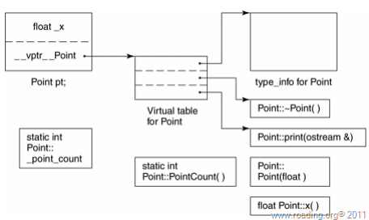

## 深度探索C++对象模型
[toc]
### 1. 关于对象
* C++对象模型的组成:
  * 所有的非静态数据成员存储在对象本身中.
  * 所有的静态数据成员/成员函数(包括静态与非静态)都置于对象之外.
  * 另用一张虚函数表(virtual table) 存储所有指向虚函数的指针,并在表头附加上一个该类的type_info对象,在对象中则保存一个指向虚函数表的指针.
    


C++对象模型
### 2. 构造函数语义
### 3. Data语义
### 4. function语义
### 5. 构造/析构/拷贝语义
### 6. 运行时语义

#### c++继承和虚函数 
#### 虚函数的作用 
虚函数如何实现的,画出内存图

* c++继承和虚函数 

##### 深入了解虚拟继承对象模型
为了解决多份拷贝的问题,引入了虚继承,看如下一个🌰
```cpp
class MyClassA:virtual public MyClass
class MyClassB:virtual public MyClass
class MyClassC:public MyClassA,public MyClassB
```
那么除了秉承这个观点还有什么呢?没错,还有一个虚基类表vbtable.虚继承的引入把对象的模型变得十分复杂,除了每个基类(MA和MB)和公共基类(M)的虚函数表指针需要记录📝外,每个虚拟继承了MyClass的父类还需要记录一个虚基类表vbtable的指针vbptr.<br>
<br>
虚基类表每一项记录📝了被继承的虚基类子对象相对于虚基类表指针的偏移量.参考[虚函数与虚继承寻踪](http://www.cnblogs.com/fanzhidongyzby/archive/2013/01/14/2859064.html)<br>
