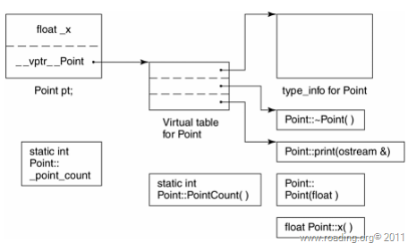

## 深度探索C++对象模型
[toc]
### 1. 关于对象
* C++对象模型的组成:
  * 所有的非静态数据成员存储在对象本身中.
  * 所有的静态数据成员/成员函数(包括静态与非静态)都置于对象之外.
  * 另用一张虚函数表(virtual table) 存储所有指向虚函数的指针,并在表头附加上一个该类的type_info对象,在对象中则保存一个指向虚函数表的指针.
    

C++对象模型
### 2. 构造函数语义
### 3. Data语义
### 4. function语义
### 5. 构造/析构/拷贝语义
### 6. 运行时语义