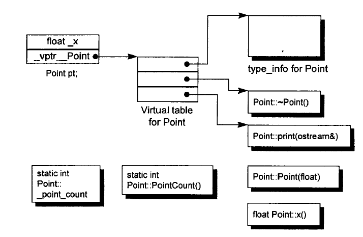

## c++对象

### 1. 类的实现
一个类
```c++
class Example {
public:
    int value;
};

// 由编译器默认提供的实现
Example::Example() : value(0) {}
Example::~Example() {}

// 拷贝构造
Example::Example(const Example& other) : value(other.value) {}

// 拷贝赋值
Example& Example::operator=(const Example& other) {
    if (this != &other) {
        value = other.value;
    }
    return *this;
}

// 移动构造
Example::Example(Example&& other) noexcept : value(other.value) {
    other.value = 0;
}

// 移动赋值
Example& Example::operator=(Example&& other) noexcept {
    if (this != &other) {
        value = other.value;
        other.value = 0;
    }
    return *this;
}
```

#### 1.1 quiz
* 为什么拷贝构造的入参是`const T&`类型的？

* 为什么拷贝赋值、移动复制要判断this指针不相同？

* 为什么移动的构造赋值用noexcept，但是拷贝的没有？

### 2. 构造函数语义学

#### 2.1 什么情况下会掉用拷贝构造函数？

#### 2.1 什么情况下一个类不展现"浅拷贝语意"？
什么情况下一个类不展现"浅拷贝语意":
1. 当类内含有一个成员类而后者的类声明中有一个拷贝构造函数(例如内含有string成员变量)
2. 当类继承自一个基类而基类中存在拷贝构造函数
    这两个编译器都会合成拷贝构造函数并且安插进那个成员和基类的拷贝构造函数
3. 当类声明了一个或多个虚函数
    编译器会显式的设定新类的虚函数表,而不是直接拷贝过来指向同一个
4. 当类派生自一个继承串链,其中有一个或多个虚基类
编译器会合成一个拷贝构造函数,安插一些代码用来设定虚基类指针和偏移的初值,对每个成员执行必要的深拷贝初始化操作,以及执行其他的内存相关工作

### 4. 函数语义学
#### 4.1 成员函数的调用方式
* 对于非静态成员函数：
    1. **非静态成员函数:C++会保证至少和一般的普通的函数有相同的效率,经过三个步骤的转换**
    - 非静态成员函数是指那些需要通过对象实例来调用的成员函数。
    - C++ 保证非静态成员函数的调用效率至少与普通函数相同。为了实现这一点，编译器会对非静态成员函数进行一些转换。

    2. **改写函数,安插一个额外的参数到该函数中,用来提供一个存取管道------即this指针**
    - 编译器会将非静态成员函数改写为一个普通函数，并插入一个额外的参数，这个参数就是 `this` 指针。
    - `this` 指针指向调用该成员函数的对象实例，提供了对对象成员变量和其他成员函数的访问。

    3. **对每一个非静态成员的存取操作改成使用this指针来调用**
    - 在改写后的函数中，所有对非静态成员变量和成员函数的访问都会通过 `this` 指针来进行。
    - 例如，访问成员变量 `x` 会被改写为 `this->x`。

    4. **将成员函数改写成一个外部函数,并且名称改为独一无二的**
    - 编译器会将成员函数改写为一个外部函数，并为其生成一个独一无二的名称，以避免与其他函数冲突。
    - 这个独一无二的名称通常包含类名和成员函数名。

* 对于虚函数成员函数：


### 2. 编译器对类的处理-类的内存模型

* 类成员变量区
  * x
  * vptr（指向虚函数区）
* 虚函数区
  * type_info类型信息
  * 虚函数
---
不在类
* 类的静态成员变量区
  * __point_count
* 类的静态函数区
  * PointCount()

#### 2.99 quiz  
* 一个class object的内存大小由什么组成？
    * 非static的成员变量大小
    * alignment补齐的空间大小
    * 支持virtual带来的负担

### 3. 编译器对类的处理-类的继承模型

### 4. 编译器对类的处理-类的虚继承模型

### 5. 深入类的成员变量

### 6. 深入类的函数


#### 1.8 return this和return *this的区别是什么
`return this` 和 `return *this` 的主要区别在于它们返回的类型:

- `return this` 返回的是一个指向当前对象的指针.这意味着,如果你有一个对象 `obj`,并且你有一个函数 `func` 返回 `this`,那么 `obj.func()` 将返回一个指向 `obj` 的指针.

- `return *this` 返回的是当前对象的一个引用.这意味着,如果你有一个对象 `obj`,并且你有一个函数 `func` 返回 `*this`,那么 `obj.func()` 将返回一个引用到 `obj`.

在某些情况下,你可能希望返回一个指向当前对象的指针,例如,如果你正在实现一个链式调用.在其他情况下,你可能希望返回一个引用,例如,如果你正在实现一个赋值运算符,通常你会希望返回一个引用,以便支持连续赋值(例如 `a = b = c`).


**10. 令operator= 返回一个reference to *this （Have assignment operators return a reference to *this)**

主要是为了支持连读和连写，例如：
    
    class Widget{
    public:
        Widget& operator=(int rhs){return *this;}
    }
    a = b = c;

**11. 在operator= 中处理“自我赋值” （Handle assignment to self in operator=)**

主要是要处理 a[i] = a[j] 或者 *px = *py这样的自我赋值。有可能会出现一场安全性问题，或者在使用之前就销毁了原来的对象


#### 1.10 设计class犹如设计type

如何设计class:
+ 新的class对象应该被如何创建和构造
+ 对象的初始化和赋值应该有什么样的差别(不同的函数调用,构造函数和赋值操作符)
+ 新的class如果被pass by value(以值传递),意味着什么(copy构造函数)
+ 什么是新type的"合法值"(成员变量通常只有某些数值是有效的,这些值决定了class必须维护的约束条件)
+ 新的class需要配合某个继承图系么(会受到继承类的约束)
+ 新的class需要什么样的转换(和其他类型的类型变换)
+ 什么样的操作符和函数对于此type而言是合理的(决定声明哪些函数,哪些是成员函数)
+ 什么样的函数必须为private的 
+ 新的class是否还有相似的其他class,如果是的话就应该定义一个class template
+ 你真的需要一个新type么?如果只是定义新的derived class或者为原来的class添加功能,说不定定义non-member函数或者templates更好


## 类的quiz

### 99. quiz
#### 1. 编译器会为C++的类自动生成什么函数？
编译器会为C++的类自动生成以下六种特殊的成员函数：

1. 默认构造函数（如果没有定义任何构造函数）
2. 析构函数（如果没有定义）
3. 拷贝构造函数（如果没有定义并且某些条件满足）
4. 拷贝赋值运算符（如果没有定义并且某些条件满足）
5. 移动构造函数（如果没有定义并且某些条件满足，C++11及以后）
6. 移动赋值运算符（如果没有定义并且某些条件满足，C++11及以后）

这些函数被称为特殊成员函数。它们是编译器为了支持一些基本操作（如初始化、拷贝、移动、销毁对象）而自动为类生成的。但是，如果你为类定义了自己的版本，编译器就不会再生成这些函数。

#### 2. 什么条件下不会自动生成？

* 拷贝构造函数和拷贝赋值运算符
  * 如果你没有显式定义它们，且类中的所有成员都可以被拷贝，编译器就会为你生成这两个函数。但是，如果类中有不能被拷贝的成员（例如，`std::unique_ptr`或者定义了删除的拷贝构造函数的类型的成员），编译器就不会生成这两个函数。

* 移动构造函数和移动赋值运算符
    从C++11开始，如果你没有显式定义它们，且类中的所有成员都可以被移动，编译器就会为你生成这两个函数。但是，如果类中有不能被移动的成员（例如，定义了删除的移动构造函数的类型的成员），或者你已经定义了拷贝构造函数、拷贝赋值运算符或析构函数，编译器就不会生成这两个函数。

这些规则的目的是为了保证对象的正确拷贝和移动，避免因为编程错误导致的问题，例如内存泄漏或者浅拷贝。

#### 3. 这六种特殊成员函数的函数签名是什么？
这六种特殊成员函数的函数签名如下：

1. 默认构造函数：`T()`
2. 析构函数：`~T()`
3. 拷贝构造函数：`T(const T& other)`
4. 拷贝赋值运算符：`T& operator=(const T& other)`
5. 移动构造函数：`T(T&& other)`
6. 移动赋值运算符：`T& operator=(T&& other)`

其中，`T`是类的名称，`other`是另一个同类型的对象。在拷贝构造函数和拷贝赋值运算符中，`other`是一个对常量的引用，表示这个函数不会修改`other`。在移动构造函数和移动赋值运算符中，`other`是一个右值引用，表示这个函数可能会修改`other`，通常是通过“窃取”其资源。

#### 4. 为什么这六种特殊的成员函数是这样子设定的？

1. 默认构造函数：`T()`。这是最基本的构造函数，如果用户没有定义任何构造函数，编译器会提供一个。它不接受任何参数，用于创建类的一个新实例。

2. 析构函数：`~T()`。这个函数在对象被销毁时调用，用于清理对象可能拥有的资源。如果用户没有定义，编译器会提供一个默认的析构函数。

3. 拷贝构造函数：`T(const T& other)`。这个函数用于创建一个新对象，该对象是一个已存在对象的副本。`const T&`表示这个函数接收一个对已存在对象的引用，且不会修改这个对象。

4. 拷贝赋值运算符：`T& operator=(const T& other)`。这个函数用于将一个已存在对象的状态赋值给另一个对象。`const T&`表示这个函数接收一个对已存在对象的引用，且不会修改这个对象。

5. 移动构造函数：`T(T&& other)`。这个函数用于创建一个新对象，该对象“窃取”了一个已存在对象的资源。`T&&`表示这个函数接收一个对已存在对象的右值引用，这个对象可能会被修改。

6. 移动赋值运算符：`T& operator=(T&& other)`。这个函数用于将一个已存在对象的资源“窃取”给另一个对象。`T&&`表示这个函数接收一个对已存在对象的右值引用，这个对象可能会被修改。

这些函数的设定方式主要是为了支持对象的创建、拷贝、移动和销毁，同时尽可能地避免不必要的对象复制和资源浪费。

简单来说，以拷贝构造函数为例，即使不使用`const T& other`作为形参，而是使用`T& other`也是可以声明拷贝构造函数的。但一般来说，我们需要`override`编译器默认生成的拷贝构造函数，而且`const T& other`会比`T& other`好，因为使用`const T& other`作为参数，可以从任何对象（包括const对象和临时对象）中拷贝。
> 临时对象（也称为右值）是不能绑定到非const的左值引用上的，但可以绑定到const的左值引用上。这是C++语言规则的一部分，主要是为了保护临时对象不被意外修改。

除此，如果不是`&`引用类型的话，也会有问题。

1. **性能**:当参数是值时,会创建该对象的一个新的副本,这涉及到对象的复制操作,可能会消耗大量的时间和内存.特别是当对象较大时,复制的代价会非常高.而当参数是常量引用时,只需要传递引用,不需要复制对象,因此性能更高.

2. **避免无限递归**:如果拷贝构造函数的参数是值,那么在调用拷贝构造函数时,需要先创建一个新的对象,这又需要调用拷贝构造函数,从而形成无限递归,导致程序崩溃.而当参数是常量引用时,不会触发拷贝构造函数,因此可以避免无限递归.

所以,拷贝构造函数的参数通常是常量引用,而不是值.

#### 5. 为什么移动构造函数一般情况下会比拷贝构造函数快？

#### 6. 移动的时候如果不将原来的置空会怎样？
在编程中，"移动"通常指的是移动语义，这是C++11引入的一个新特性。移动语义允许资源（如动态分配的内存）从一个对象转移到另一个对象，这样可以避免不必要的临时对象的复制。

如果在移动操作后不将原对象置空，可能会导致一些问题。例如，如果原对象是一个拥有动态分配内存的对象，那么当原对象和新对象都试图释放同一块内存时，就会发生双重删除，这会导致程序崩溃。

因此，通常在执行移动操作后，我们会将原对象置空或设置为一个安全的状态，以防止这种问题的发生。

#### 7. 一个类B,它有一个A*类型的成员变量.并写出它的拷贝构造函数.

```cpp
class A {
    // A的定义
};

class B {
public:
    B() : ptr(new A()) {}  // 默认构造函数
    B(const B& other) : ptr(new A(*(other.ptr))) {}  // 拷贝构造函数
    ~B() { delete ptr; }  // 析构函数

private:
    A* ptr;  // A*类型的成员变量
};
```

#### 8. 对上面的类B定义一个右值构造函数

```cpp
class B {
public:
    // 其他成员...

    // 右值构造函数
    B(B&& other) noexcept {
        // 窃取other的资源，然后将other置于有效但未定义的状态
    }
};
```

#### 9. 定义一个static成员变量。该怎么写？

在C++中，你可以在类内部声明一个static成员变量，然后在类外部定义和初始化它。以下是一个例子：

```cpp
class B {
public:
    // 静态成员变量的声明
    static int s_value;
};

// 静态成员变量的定义和初始化
int B::s_value = 0;
```

在这个例子中，`s_value`是类B的一个静态成员变量。所有的B对象都共享同一个`s_value`变量。

好的，以下是对这两个问题的逐点解释：

#### 10. 为什么要声明 `virtual`?

1. **实现多态**
   - `virtual` 关键字用于声明虚函数，允许派生类重写基类中的函数，从而实现多态。
   - 通过基类指针或引用调用虚函数时，会根据实际对象的类型调用相应的派生类函数，而不是基类函数。

2. **确保正确的析构**
   - 当基类的析构函数被声明为虚函数时，通过基类指针删除派生类对象时，会正确调用派生类的析构函数，避免资源泄漏。
   - 示例：
     ```cpp
     class Base {
     public:
         virtual ~Base() {}
     };

     class Derived : public Base {
     public:
         ~Derived() {}
     };

     Base* obj = new Derived();
     delete obj; // 正确调用 Derived 和 Base 的析构函数
     ```

3. **动态绑定**
   - `virtual` 关键字使得函数调用在运行时进行动态绑定，而不是在编译时进行静态绑定。
   - 这允许程序在运行时决定调用哪个函数，实现更灵活的设计。

4. **接口设计**
   - 在设计接口或抽象基类时，通常将函数声明为虚函数，以便派生类提供具体实现。
   - 示例：
     ```cpp
     class Shape {
     public:
         virtual void draw() = 0; // 纯虚函数，必须在派生类中实现
     };

     class Circle : public Shape {
     public:
         void draw() override {
             // Circle 的具体实现
         }
     };
     ```

#### 11. 如果父类声明了虚析构，那么拷贝，移动也需要是虚的吗？
不需要。

#### 12. 为什么要声明 `override`?

1. **明确意图**
   - `override` 关键字明确表示派生类中的函数是重写基类中的虚函数。
   - 这有助于代码的可读性和可维护性，使得代码意图更加清晰。
   - `override` 关键字本身不会改变程序的运行时行为，它的主要作用是提升代码的可读性和可维护性，并且提供编译器检查功能。
    以下是详细解释：

2. **编译器检查**
   - 使用 `override` 关键字可以让编译器检查函数签名是否正确匹配基类中的虚函数。
   - 如果函数签名不匹配，编译器会报错，避免潜在的错误。
   - 示例：
     ```cpp
     class Base {
     public:
         virtual void func(int) {}
     };

     class Derived : public Base {
     public:
         void func(int) override { // 正确匹配基类函数
             // Derived 的具体实现
         }
     };
     ```

3. **防止意外重载**
   - 如果派生类中的函数签名与基类中的虚函数不匹配，编译器会将其视为新的函数，而不是重写基类函数。
   - 使用 `override` 可以防止这种意外重载的情况。
   - 示例：
     ```cpp
     class Base {
     public:
         virtual void func(int) {}
     };

     class Derived : public Base {
     public:
         void func(double) override { // 编译错误，签名不匹配
             // Derived 的具体实现
         }
     };
     ```

4. **提高代码质量**
   - 使用 `override` 关键字可以提高代码质量，减少错误，提高代码的健壮性和可维护性。


#### 1.3 成员函数模板可以为虚函数吗？
成员函数模板不能为虚函数，因为虚函数表的大小是固定的，而成员函数模板的实例化个数要编译完成后才能确定

* 虚函数可以是模板的吗？

不，虚函数不能是模板函数。虚函数依赖于虚函数表（vtable）来实现运行时多态，而模板函数在编译时根据模板参数的不同实例化为不同的函数。因为模板实例化发生在编译时，而虚函数的动态绑定发生在运行时，所以二者的机制不兼容。

简而言之，虚函数的多态性是在运行时通过虚函数表解析的，而模板函数的多态性是在编译时通过生成不同的函数实例来实现的。因此，虚函数不能是模板函数。
