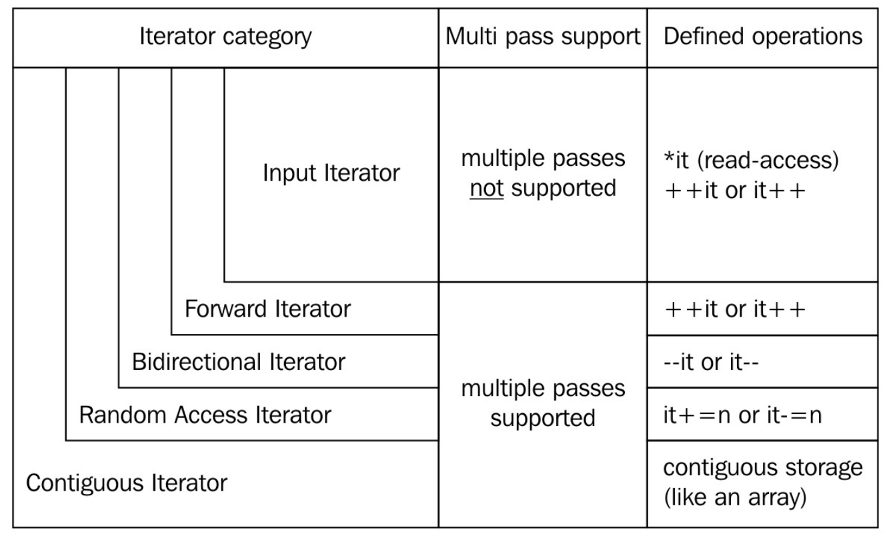

## 迭代器


### 1. 迭代器有哪些
STL(Standard Template Library,标准模板库)中的迭代器主要有五种类型:

1. **输入迭代器(Input Iterators)**:只支持对元素进行一次正向访问,只能进行读取操作.
    需要重载 `operator*`(解引用)和 `operator++`(前置和后置递增).

2. **输出迭代器(Output Iterators)**:只支持对元素进行一次正向访问,只能进行写入操作.
    需要重载 `operator*`(解引用)和 `operator++`(前置和后置递增).

3. **前向迭代器(Forward Iterators)**:支持对元素进行多次正向访问,可以进行读取和写入操作.
    除了输入迭代器的所有运算符外,还需要重载 `operator==` 和 `operator!=` 用于比较两个迭代器是否相等.

4. **双向迭代器(Bidirectional Iterators)**:支持对元素进行多次正向和反向访问,可以进行读取和写入操作.
    除了前向迭代器的所有运算符外,还需要重载 `operator--`(前置和后置递减).

5. **随机访问迭代器(Random Access Iterators)**:支持对元素进行多次任意访问,可以进行读取和写入操作.
    除了双向迭代器的所有运算符外,还需要重载 `operator+`/`operator-`/`operator+=`/`operator-=`/`operator[]` 用于随机访问,以及 `operator<`/`operator>`/`operator<=`/`operator>=` 用于比较两个迭代器的顺序.

每种类型的迭代器都提供了一些特定的操作,例如递增(++)/递减(--)/解引用(*)等.更高级的迭代器类型提供了更多的操作,例如随机访问迭代器还支持随机访问([])和比较(<, >, <=, >=)等操作.


### 2. 什么叫只支持一次正向访问,和支持多次正向访问?
简单来说,支持一次正向访问的就是流式数据,数据读完就没了.
输入迭代器通常用于处理流式数据,例如从输入流(如std::cin或文件输入流)中读取数据.一旦输入迭代器读取了一个元素,你就不能再回到它,这就像是数据被"消费"了一样.这种特性使得输入迭代器特别适合用于一次性读取或处理数据的场景.

```c++
#include <iostream>
#include <iterator>
#include <vector>

int main() {
    std::cout << "请输入一些整数(以空格分隔):";

    // 使用输入迭代器从输入流中读取数据
    std::istream_iterator<int> start(std::cin);
    std::istream_iterator<int> end;

    std::vector<int> numbers(start, end);

    std::cout << "你输入的数字是:";
    for (int num : numbers) {
        std::cout << num << " ";
    }

    return 0;
}
```
在这段代码中,std::istream_iterator<int> start(std::cin);和std::istream_iterator<int> end;定义了一个输入迭代器的范围,这个范围从std::cin的当前位置开始,到std::cin的结束位置(或者到遇到的第一个非整数输入).

然后,std::vector<int> numbers(start, end);使用这个范围来初始化numbers.这个过程会从start开始,一次正向访问每个元素,直到到达end.在这个过程中,每个被访问的元素都会被"消费",也就是说,一旦一个元素被访问,你就不能再通过start迭代器来访问它.
因此,一旦numbers被构造完成,start和end迭代器就没有意义了,因为它们已经"消费"了所有的元素.如果你试图再次使用start迭代器,你将无法访问到任何元素,因为所有的元素都已经被"消费"了.

#### 2.1 如何判断std::cin结束的?
std::istream_iterator在读取到EOF时变成结束迭代器的过程是通过其内部的实现来完成的.当我们尝试从输入流中读取数据时,如果读取失败(例如由于到达EOF),std::istream_iterator会变成一个特殊的状态,我们称之为"结束状态".

这个过程的具体实现可能因库的实现而异,但一般来说,它可能是这样的:
```c++
template <typename T>
class istream_iterator {
public:
    istream_iterator(std::istream& stream) : stream_(stream) {
        ++(*this);  // 读取第一个元素
    }

    istream_iterator() : stream_(nullptr), end_(true) {}  // 结束迭代器

    T operator*() const {
        return value_;
    }

    istream_iterator& operator++() {
        if (!(stream_ >> value_)) {
            end_ = true;  // 如果读取失败,标记为结束状态
        }
        return *this;
    }

    bool operator==(const istream_iterator& other) const {
        return (end_ == other.end_);
    }

    bool operator!=(const istream_iterator& other) const {
        return !(*this == other);
    }

private:
    std::istream* stream_;
    T value_;
    bool end_ = false;
};
```
在这个简化的实现中,当我们尝试从stream_中读取一个T类型的值时,如果读取失败(!(stream_ >> value_)),我们就将end_标记为true,表示这个迭代器已经到达结束状态.然后,我们可以通过比较两个迭代器的end_成员来判断它们是否相等.

需要注意的是,这只是一个简化的实现,真实的std::istream_iterator的实现可能会更复杂,但基本的原理是一样的.

### 3. 如果某一个迭代器的实现是指针,即`CONTAINER.begin()`返回的是指针,那这是什么迭代器?

指针被归类为随机访问迭代器(Random Access Iterator).在C++中,迭代器按照其功能和性能分为不同的类别,其中包括:

输入迭代器(Input Iterator): 只能进行单次顺序遍历,支持解引用操作,但不保证支持递增操作.

输出迭代器(Output Iterator): 只能进行单次顺序遍历,支持递增操作,但不保证支持解引用操作.

前向迭代器(Forward Iterator): 可以进行多次顺序遍历,支持解引用和递增操作.

双向迭代器(Bidirectional Iterator): 可以进行多次双向遍历,支持解引用/递增和递减操作.

随机访问迭代器(Random Access Iterator): 具备双向迭代器的所有功能,并且还支持在常数时间内进行跳跃式的访问(随机访问).

指针在这个分类中属于随机访问迭代器,因为它们具有在常数时间内进行递增/递减和随机访问的能力.指针允许通过指针算术运算(如加法和减法)在内存中直接移动,使得访问数组等数据结构的任意位置都是高效的.

随机访问迭代器是最强大的迭代器类型,支持对序列进行灵活而高效的操作.因此,当你使用指针作为迭代器时,你可以利用随机访问迭代器的特性进行快速而灵活的元素访问和操作.

### 4. 常见stl算法对迭代器有什么要求?
1. `std::for_each`:需要输入迭代器.这个算法会遍历给定的范围,并对每个元素执行给定的函数.

2. `std::find`:需要输入迭代器.这个算法会遍历给定的范围,寻找第一个等于给定值的元素.

3. `std::copy`:需要输入迭代器和输出迭代器.这个算法会将一个范围内的元素复制到另一个范围.

4. `std::sort`:需要随机访问迭代器.这个算法会对给定的范围内的元素进行排序.

5. `std::reverse`:需要双向迭代器.这个算法会反转给定范围内的元素.

6. `std::unique`:需要前向迭代器.这个算法会移除给定范围内的连续重复元素.

7. `std::lower_bound`和`std::upper_bound`:需要前向迭代器.这些算法用于在已排序的范围内查找元素.

8. `std::rotate`:需要前向迭代器.这个算法会将给定范围内的元素向左或向右旋转.

以上只是一部分STL算法,实际上STL中有很多其他的算法,它们对迭代器的要求可能会有所不同.在使用某个算法时,你应该查阅相关的文档,了解它对迭代器的具体要求.
另外,迭代器的类别有层级结构,或者简单来说就是向下兼容,层级高的迭代器就能满足需要层级低的迭代器的要求.
比如说`std::for_each`要求输入迭代器,但是给一个随机访问迭代器也行,因为随机访问迭代器的能力是输入迭代器的超集.


### 99. 习题
```c++
#include <iostream>

class fibit {
  size_t i{0};
  size_t a{0};
  size_t b{1};

public:
  fibit() = default;
  explicit fibit(size_t i_) : i{i_} {}

  size_t operator*() const { return b; }
  fibit &operator++() {
    const size_t old_b{b};
    b += a;
    a = old_b;
    ++i;
    return *this;
  }
  bool operator!=(const fibit &o) const { return i != o.i; }
};

class fib_range {
  size_t end_n;

public:
  fib_range(size_t end_n_) : end_n{end_n_} {}
  fibit begin() const { return fibit{}; }
  fibit end() const { return fibit{end_n}; }
};

int main() {
  for (auto i : fib_range(10)) {
    std::cout << i << ", ";
  }
  std::cout << '\n';
}
```