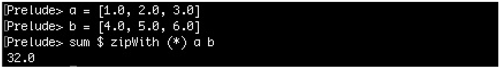
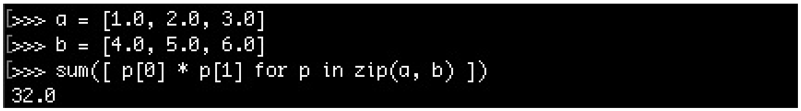

# 构建zip迭代适配器

虽然风格迥异，但是纯函数式编程却能在大多数情况下产生非常优雅地代码。

这里用向量点乘为例，使用函数式方法优雅地实现这个功能。

给定两个向量，然后让对应位置上的两个数字相乘，然后将所有数字加在一起。也就是`(a, b, c) * (d, e, f)`的结果为`(a * e + b * e + c * f) `。

我们在C和C++也能完成这样的操作。代码可能类似如下的方式：

```c++
std::vector<double> a {1.0, 2.0, 3.0};
std::vector<double> b {4.0, 5.0, 6.0};
double sum {0};
for (size_t i {0}; i < a.size(); ++i) {
	sum += a[i] * b[i];
}
// sum = 32.0
```

如何使用其他语言让这段代码更优雅呢？

Haskell是一种纯函数式语言，其使用一行代码就能计算两个向量的点积：



Python虽然不是纯函数式编程语言，但是也会提供类似功能：



STL提供了相应的函数实现`std::inner_product`，也能在一行之内完成向量点积。不过，其他语言中在没有相应的库对某种操作进行支持的情况下，也能做到在一行之内完成。

不需要对两种语言的语法进行详细了解的情况下，大家都应该能看的出，两个例子中最重要的就是zip函数。这个函数做了什么？假设我们有两个向量a和b，变换后将两个向量混合在一起。例如：`[a1, a2, a3]`和`[b1, b2, b3]`，使用zip函数处理的结果为`[(a1, b1), (a2, b2), (a3, b3)]`。让我们仔细观察这个例子，就是将两个向量连接在了一起。

现在，关联的数字可以直接进行加法，然后累加在一起。在Haskell和Python的例子中我们看到，这个过程不需要任何循环或索引变量。[译者注：Python中是有循环的……]

这里没法让C++代码如同Haskell或Python那样优雅和通用，不过本节的内容就是为了实现一个类似的迭代器——zip迭代器——然后使用这个迭代器。向量点积有特定的库支持，至于是哪些库，以及这些库如何使用，并不在本书的描述范围内。不过，本节的内容将尝试展示一种基于迭代器的方式，来帮助你使用通用的模块另外完成编程。

## How to do it...

本节中，我们会实现一个类似Haskell和Python中的zip函数。为了不对迭代器的机制产生影响，`vector`中的变量这里写死为`double`：

1. 包含头文件

   ```c++
   #include <iostream>
   #include <vector>
   #include <numeric>

   class zip_iterator {

   	using it_type = std::vector<double>::iterator;

   	it_type it1;
   	it_type it2;

   public:
       zip_iterator(it_type iterator1, it_type iterator2)
       	: it1{iterator1}, it2{iterator2}
       {}

       zip_iterator& operator++() {
           ++it1;
           ++it2;
           return *this;
       }

   	bool operator!=(const zip_iterator& o) const {
       	return it1 != o.it1 && it2 != o.it2;
       }

       bool operator==(const zip_iterator& o) const {
       	return !operator!=(o);
       }

       std::pair<double, double> operator*() const {
       	return {*it1, *it2};
       }
   };

   namespace std {
   template <>
   struct iterator_traits<zip_iterator> {
       using iterator_category = std::forward_iterator_tag;
       using value_type = std::pair<double, double>;
       using difference_type = long int;
   };
   }

    class zipper {
        using vec_type = std::vector<double>;
        vec_type &vec1;
        vec_type &vec2; 

    public:
        zipper(vec_type &va, vec_type &vb)
        	: vec1{va}, vec2{vb}
        {}

        zip_iterator begin() const {
        	return {std::begin(vec1), std::begin(vec2)};
        }
        zip_iterator end() const {
       		return {std::end(vec1), std::end(vec2)};
        }
    };

    int main()
    {
        using namespace std;
        vector<double> a {1.0, 2.0, 3.0};
        vector<double> b {4.0, 5.0, 6.0};

    	zipper zipped {a, b};

        const auto add_product ([](double sum, const auto &p) {
        	return sum + p.first * p.second;
        });

        const auto dot_product (accumulate(
        	begin(zipped), end(zipped), 0.0, add_product));

    	cout << dot_product << '\n';
    }
    ```

18. 编译运行后，得到正确的结果：

    ```c++
    32
    ```

## There's more...

OK，这里使用了语法糖来完成了大量的工作，不过这和Haskell的例子也相差很远，还不够优雅。我们的设计中有个很大的缺陷，那就是只能处理`double`类型的数据。通过模板代码和特化类，`zipper`类会变得更通用。这样，我们就能将`list`和`vector`或`deque`和`map`这样不相关的容器合并起来。

为了让设计的类更加通用，其中设计的过程是不容忽视的。幸运的是，这样的库已经存在。Boost作为STL库的先锋，已经支持了`zip_iterator`。这个迭代器非常简单、通用。

顺便提一下，如果你想看到了使用C++实现的更优雅的点积，并且不关心`zip`迭代器相关的内容，那么你可以了解一下`std::valarray`。例子如下，自己看下：

```c++
#include <iostream>
#include <valarray>
int main()
{
    std::valarray<double> a {1.0, 2.0, 3.0};
    std::valarray<double> b {4.0, 5.0, 6.0};
    std::cout << (a * b).sum() << '\n';
}
```

**范围库**

这是C++中非常有趣的一个库，其支持`zipper`和所有迭代适配器、滤波器等等。其受到Boost范围库的启发，并且某段时间内里，很有可能进入C++17标准。不幸的是，我们只能在下个标准中期待这个特性的加入。这种性能可以带来更多的便利，能让我们想表达的东西通过C++快速实现，并可以通过将通用和简单的模块进行组合，来表现比较复杂的表达式。

在文档中对其描述中，有个非常简单的例子：

1. 计算从1到10数值的平方：

   ```c++
   const int sum = accumulate(view::ints(1)
                           | view::transform([](int i){return i*i;})
                           | view::take(10), 0); 
   ```

2. 从数值`vector`中过滤出非偶数数字，并且将剩下的数字转换成字符串：

   ```c++
   std::vector<int> v {1,2,3,4,5,6,7,8,9,10};

   auto rng = v | view::remove_if([](int i){return i % 2 == 1;})
   		    | view::transform([](int i){return std::to_string(i);});
   // rng == {"2"s,"4"s,"6"s,"8"s,"10"s};
   ```

如果你等不及想要了解这些有趣的特性，可以看一下范围类的文档，https://ericniebler.github.io/range-v3 。

