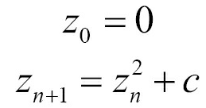

# 使用ASCII字符曼德尔布罗特集合

1975年，数学家贝诺曼德尔布罗特(Benoit Mandelbrot)创造了一个术语——**分形**。分形是一个数学图像或者集合，这个术语中包含了很多有趣的数学特性，不过最后看起来分形更像是艺术品。分形图像看起来是无限重复的缩小。其中最为众人所知的分形是曼德尔布罗特(Mandelbrot)集合，其集合看起来就像下图一样：


曼德尔布罗特集合可以通过迭代下面的等式得到：




`z`和`c`变量都是复数。曼德尔布罗特集合包含等式所覆盖所有让方程收敛的`c`值，也就是海报彩色的部分。有些值收敛的早，有些值收敛的晚，这里用不同的颜色对这些值进行描述，所以我们能在海报中看到各种不同的颜色。对于那些不收敛的值，我们则直接将其所在区域直接涂黑。

使用STL的`std::complex`类，且不使用循环来实现上面的等式。这并不是炫技，只是为了让大家更容易理解STL相关特性的使用方式。

## How to do it...

本节，我们将打印类似墙上海报的图，不过是使用ASCII字符将图像打印在终端上：

1. 包含必要的头文件并声明所使用的命名空间：

   ```c++
   #include <iostream>
   #include <algorithm>
   #include <iterator>
   #include <complex>
   #include <numeric>
   #include <vector>
   
   using namespace std;
      using cmplx = complex<double>;
   static auto scaler(int min_from, int max_from,
   double min_to, double max_to)
   {
       const int w_from {max_from - min_from};
       const double w_to {max_to - min_to};
       const int mid_from {(max_from - min_from) / 2 + min_from};
       const double mid_to {(max_to - min_to) / 2.0 + min_to};
       
       return [=] (int from) {
      		return double(from - mid_from) / w_from * w_to + mid_to;
       };
   }
   template <typename A, typename B>
   static auto scaled_cmplx(A scaler_x, B scaler_y)
   {
       return [=](int x, int y) {
       	return cmplx{scaler_x(x), scaler_y(y)};
       };
   }
   static auto mandelbrot_iterations(cmplx c)
   {
       cmplx z {};
       size_t iterations {0};
       const size_t max_iterations {1000};
       while (abs(z) < 2 && iterations < max_iterations) {
           ++iterations;
           z = pow(z, 2) + c;
       }
       return iterations;
   }
   int main()
   {
       const size_t w {100};
       const size_t h {40};
       
       auto scale (scaled_cmplx(
           scaler(0, w, -2.0, 1.0),
           scaler(0, h, -1.0, 1.0)
       ));
   	auto i_to_xy ([=](int i) { return scale(i % w, i / w); });
   	auto to_iteration_count ([=](int i) {
   		return mandelbrot_iterations(i_to_xy(i));
   	});
       vector<int> v (w * h);
       iota(begin(v), end(v), 0);
       transform(begin(v), end(v), begin(v), to_iteration_count);
        auto binfunc ([w, n{0}] (auto output_it, int x) mutable {
        	*++output_it = (x > 50 ? '*' : ' ');
        	if (++n % w == 0) { ++output_it = '\n'; }
        	return output_it;
        });
    	accumulate(begin(v), end(v), ostream_iterator<char>{cout},
    			  binfunc);
    }
    ```

12. 编译并运行程序，就可以看到如下的输出，其看起来和墙上的海报很像吧！


## How it works...

整个计算过程都使用`std::transform`对一维数组进行处理：

```c++
vector<int> v (w * h);
iota(begin(v), end(v), 0);
transform(begin(v), end(v), begin(v), to_iteration_count);
```

所以，会发生什么呢？我们为什么要这么做？`to_iteration_count`函数是基于从`i_to_xy`开始的调用链，从`scale`到`mandelbrot_iterations`。下面的图像就能展示我们的转换步骤：


这样，我们就可以使用一维数组作为输入，并且获得曼德尔布罗特方程的迭代次数(使用一维坐标表示的二维坐标上的值)。三个互不相关的转换是件好事。这样代码就可以独立的进行测试，这样就不用互相牵制了。同样，这样更容易进行正确性测试，并寻找并修复bug。