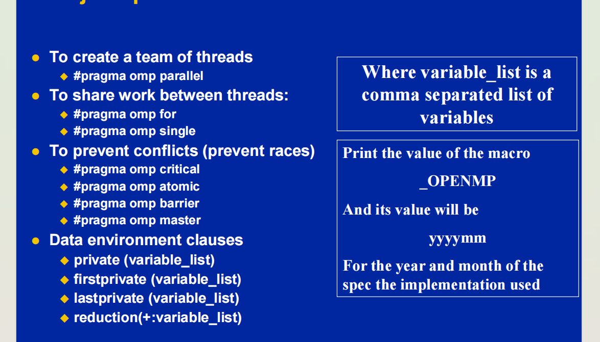
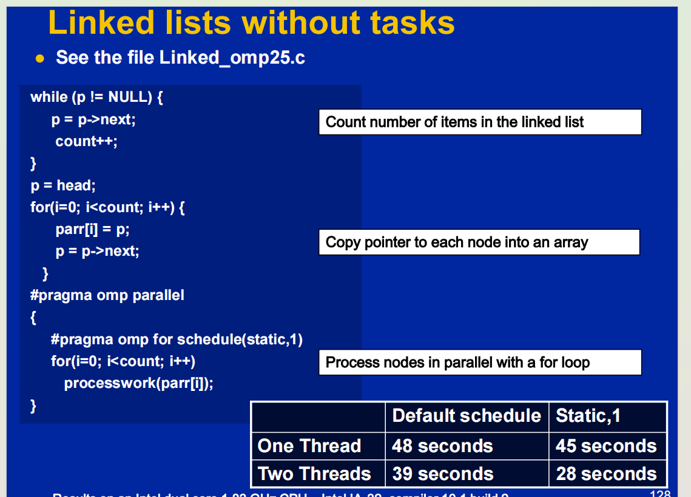
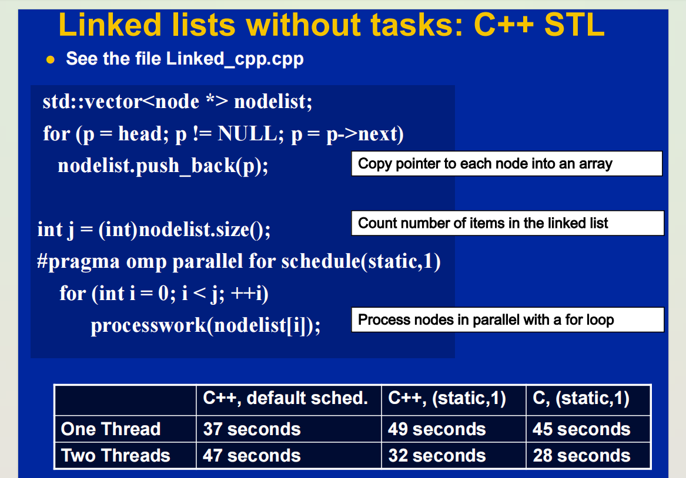

### 2. 语法层面

#### 2.1 基本的库函数

#### 2.2 openMp 指令

##### 2.2.1 同步指令

#### 2.3 openMp 可见性

#### 2. debug







#### openmp 3.0

openmp 4.0

## openmp

### 1. concepts

- **OpenMP 是什么**
  OpenMP（Open Multi-Processing）是一个用于多平台共享内存并行编程的 API，主要用于 C、C++ 和 Fortran 语言。它通过编译器指令、库函数和环境变量来实现并行编程。OpenMP 的核心思想是通过简单的编译器指令（pragma）来标记并行代码块，编译器会自动生成相应的多线程代码。

- **OpenMP 是哪一层次的优化？**
  OpenMP 主要在编译器层面实现多线程，通过编译器指令和库函数，将并行代码转换为多线程代码，最终由操作系统的线程调度器管理线程的执行。编译器会根据 `#pragma omp` 指令生成相应的多线程汇编代码。由于编译器可以进行各种优化，因此在大多数情况下，使用 OpenMP 实现的多线程方法性能会更快一些。

  换句话说，预处理阶段编译器还是会保留 `#pragma omp` 命令。在编译阶段，编译器才会根据 `#pragma omp` 生成相应的多线程汇编代码。

- **OpenMP 会比手动实现的线程池快吗？**
  OpenMP 是否比手动实现的线程池快，取决于具体的应用场景和实现细节。以下是一些考虑因素：

  - 开发效率：OpenMP 提供了高层次的并行编程接口，开发效率通常高于手动实现的线程池。
  - 性能优化：手动实现的线程池可以针对特定应用进行优化，可能在某些场景下性能优于 OpenMP。
  - 负载均衡：OpenMP 内置了负载均衡机制，可以自动将工作分配给不同的线程，而手动实现的线程池需要自行管理负载均衡。
  - 可维护性：OpenMP 代码通常更简洁、易读、易维护，而手动实现的线程池代码可能更复杂。

- **OpenMP 内部有线程池的概念吗？**
  OpenMP 运行时库通常会维护一个线程池，以减少线程创建和销毁的开销。线程池中的线程可以重复使用，以提高性能。OpenMP 线程池的一个强大之处在于更强大的线程调度和负载均衡。

  一般而言，大部分自定义实现的线程池都是静态调度的。而 OpenMP 可以做到动态调度和自适应调度。

  - 静态调度：在静态调度中，迭代空间被均匀地划分给所有线程。每个线程在程序开始时就知道自己要处理的迭代范围。
  - 动态调度：在动态调度中，迭代空间被划分成多个块，线程动态地获取块进行处理。这样可以更好地平衡负载，特别是在迭代时间不均匀的情况下。
  - 自适应调度：OpenMP 还支持自适应调度策略，根据运行时的负载情况动态调整调度策略。

- **怎么启用 OpenMP？**

  - CMake 工程：使用 `find_package(OpenMP REQUIRED)`。
  - VS 工程：项目 -> 属性 -> 配置属性 -> C/C++ 选项 -> 语言 -> OpenMP 支持 -> 设置为“是 (/openmp)”
    如果 VS 工程是由 CMake 工程生成的，则会自动带上 OpenMP。

- **总结**
  常规使用情况下，OpenMP 总能比手动实现的多线程更快，这一方面是因为 OpenMP 是编译器层面的，因此编译器更方便做各种优化。另一方面是大部分手动管理线程的负载均衡做得比较差劲，基本都是开了多个线程均分任务，没有考虑到不同任务的耗时不一样，动态调整的能力。除此之外，OpenMP 通常实现起来，会更简洁。

  但是手动实现的多线程，往往有更丰富的同步原语，如 `std::mutex`、`std::condition_variable` 等等。以及可以处理一些 `std::async` 和 `std::future` 等等异步任务。

  总结，OpenMP 更多用于一些重计算的库上，比如高性能计算，科学计算和工程模拟，深度学习/机器学习，图像处理等场景。在应用层软件中，OpenMP 也会用于多媒体处理（音视频解码）、游戏开发（更多是物理引擎）、图形渲染等等。

  对于其他一般的应用场景上，OpenMP 和多线程的性能差距一般不是瓶颈。而且应用层软件可能需要更灵活的同步原语，需要处理一些异步任务，要有 `future` 或者 `async` 概念。这些都是 OpenMP 做不到的。

### 2. openmp指令

#pragma omp <directive> [clause[,clause]...]
#pragma omp construct [clause [clause]…]
1. The following are some common OpenMP directives:
  
2. clause: The clauses provide additional information to the directives. For example, the “num_threads” clause specifies the number of threads to be used for a parallel section.
   Steps for Parallel Programming
   Steps needed to achieve (openMP) parallelize in your programming:

#### 2.1 并行控制
 “parallel”: create a team of threads that execute the enclosed code block in parallel.
   “for”: splits a loop into smaller iterations that can be executed in parallel by different threads.
   “sections”: split the enclosed code block into different sections that can be executed in parallel.
   “single”: specifies that a code block should be executed by only one thread.
   “critical”: specifies that a code block should be executed by only one thread at a time.
   “atomic”: specifies that a variable should be accessed atomically.

#### 2.2 工作共享
#pragma omp for
#pragma omp single
- #pragma omp single
- #pragma omp sections
- #pragma omp section


#### 2.3 线程同步
High level synchronization:
– critical
– atomic
– barrier
– ordered
- master
Low level synchronization
– flush
– locks (both simple and nested)

```c++
#pragma omp parallel
{
do_many_things();
#pragma omp master
{ exchange_boundaries(); }
#pragma omp barrier
do_many_other_things();
}
```

#### 2.4 数据环境
在 Fortran 的子程序或 C 语言的函数中，从并行区域调用的栈变量是私有的。这意味着每个线程都有自己的栈变量副本，它们之间不会相互影响。
在语句块内的自动变量也是私有的。这意味着在代码块内声明的变量对于每个线程都是独立的。

private
firstprivate
lastprivate
reduction

#### 2.5 环境变量

#### 2.6 库函数
– omp_init_lock(), omp_set_lock(),
  omp_unset_lock(), omp_test_lock(),
  omp_destroy_lock()
- omp_init_nest_lock(), omp_set_nest_lock(),
  omp_unset_nest_lock(), omp_test_nest_lock(),
  omp_destroy_nest_lock()

– omp_set_num_threads(), omp_get_num_threads(),
omp_get_thread_num(), omp_get_max_threads()
– omp_in_parallel()
– omp_set_dynamic, omp_get_dynamic();
– omp_num_procs()

• Set the default number of threads to use.
–OMP_NUM_THREADS int_literal
• OpenMP added an environment variable to control the size of
child threads’ stack
–OMP_STACKSIZE
• Also added an environment variable to hint to runtime how to
treat idle threads
–OMP_WAIT_POLICY
– ACTIVE keep threads alive at barriers/locks
– PASSIVE try to release processor at barriers/locks
• Process binding is enabled if this variable is true … i.e. if true
the runtime will not move threads around between processors.
–OMP_PROC_BIND true | false

  - 运行环境操作函数：
  - 锁函数：
  - 时间函数：

### 99. quiz

存疑
openmp 比手动调用多线程快的地方在于线程调度优化，线程创建切换开销以及简单任务上的缓存行任务，openmp 并不会直接对任务做优化处理。
因此一些 openmp 相较于手动调用多线程的提升是固定的，不会随着任务变复杂而增加。


1. **对称多处理器（SMP）架构**：

   - **特点**：所有处理器共享一个统一的内存地址空间，并且每个处理器对内存的访问时间大致相同。操作系统将所有处理器视为平等。
   - **示例**：大多数现代家用台式机和笔记本电脑都采用 SMP 架构，特别是那些配备多核处理器的系统。
   - **优点**：编程模型简单，适合多任务处理和多线程应用。

2. **非一致性内存访问（NUMA）架构**：
   - **特点**：内存被分成多个区域，每个区域与特定的处理器节点关联。不同内存区域的访问时间不同，通常本地内存访问比远程内存访问更快。
   - **示例**：一些高端家用电脑和工作站可能采用 NUMA 架构，特别是那些配备多个处理器插槽的系统。
   - **优点**：在处理大规模并行计算任务时，NUMA 架构可以提高性能。

这段文字在讨论现代多处理器系统的复杂性，特别是涉及到缓存和内存访问时的行为。尽管在编程模型和操作系统的视角下，许多系统可以被视为对称多处理器（SMP）系统，但实际上，由于缓存的存在，这些系统表现出非一致性内存访问（NUMA）的特性。

### 详细解释

1. **现实更加复杂**：

   - 现代多处理器系统（包括多核处理器）通常具有多级缓存（如 L1、L2 和 L3 缓存），这使得内存访问的复杂性增加。
   - 由于缓存的存在，不同处理器访问不同内存地址的成本可能不同，这种情况下，系统表现出 NUMA 的特性。

2. **任何带有缓存的多处理器 CPU 都是 NUMA 系统**：

   - 由于缓存的存在，处理器访问不同内存地址的成本不同，因此可以认为任何带有缓存的多处理器 CPU 都是 NUMA 系统。

3. **从 SMP 系统开始**：

   - 尽管底层硬件可能表现出 NUMA 的特性，编程模型和操作系统通常将系统视为一个统一的共享内存系统，即 SMP 架构。
   - 开发人员可以从将系统视为 SMP 系统开始编写代码，这样可以简化编程模型。

4. **优化工作**：
   - 在实际优化工作中，开发人员需要接受并处理系统表现出 NUMA 特性的情况。
   - 这意味着在进行性能优化时，需要考虑缓存和内存访问的影响，并针对特定的 NUMA 特性进行优化。

### 总结

- **现实更加复杂**：现代多处理器系统由于缓存的存在，表现出非一致性内存访问（NUMA）的特性。
- **任何带有缓存的多处理器 CPU 都是 NUMA 系统**：由于缓存的存在，处理器访问不同内存地址的成本不同，因此可以认为任何带有缓存的多处理器 CPU 都是 NUMA 系统。
- **从 SMP 系统开始**：尽管底层硬件可能表现出 NUMA 的特性，编程模型和操作系统通常将系统视为一个统一的共享内存系统，即 SMP 架构。开发人员可以从将系统视为 SMP 系统开始编写代码。
- **优化工作**：在实际优化工作中，开发人员需要接受并处理系统表现出 NUMA 特性的情况，并针对特定的 NUMA 特性进行优化。

通过这种方式，开发人员可以简化编程模型，从将系统视为 SMP 系统开始编写代码，并在实际优化工作中处理和优化 NUMA 特性。

openmp 比手动调用多线程快的地方在于线程调度优化，线程创建切换开销以及简单任务上的缓存行任务，openmp 并不会直接对任务做优化处理。
因此一些 openmp 相较于手动调用多线程的提升是固定的，不会随着任务变复杂而增加。


https://github.com/parallel101/course/tree/master
https://github.com/jiayaozhang/OpenVDB_and_TBB
http://www.openmp.org/specifications/
https://computing.llnl.gov/tutorials/openMP/
https://zhuanlan.zhihu.com/p/541408827


为什么我用了 OpenMP 并没有变快多少，甚至反而变慢了？（先看看你的数据量是不是足够大，大于 256 KB，总执行时间是否足够长，大于 0.1 ms，否则就是高射炮打蚊子，并行没有意义，如果是处理网络实时收发包的数据，建议先把数据堆到一定量以后再批量并行处理：先等 256 个蚊子全粘在苍蝇板上，再一次性用高射炮处决，这样才高效，是吧？而不是发现一个就立马打掉）

为什么我用了 OpenMP 并没有变快多少，甚至反而变慢了？我的数据量足够大，远大于 256 KB（我们的个人电脑大多是 SMP 架构，并行的“拷贝”并不会比串行的更快，并行加速的是计算，而不能加速访存，对于接近于 memcpy 的 memory-bound（内存瓶颈型）任务，你应该先考虑的是优化访存，而不是急着并行）BV1gu41117bW
