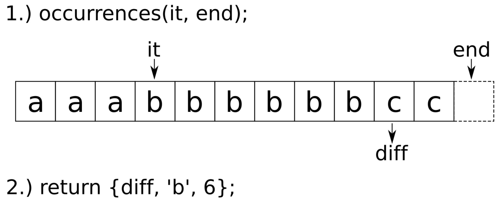

# 压缩和解压缩字符串

压缩问题在编程面试中出现的相对较多。就是使用一个函数将`aaaaabbbbbbbccc`字符串转换成一个短字符串`a5b7c3`。`a5`表示原始字符串中有5个a，`b7`表示原始字符串中有7个b。这就一个相对简单的压缩算法。对于普通的文本，并不需要使用这个算法，因为文本中重复的东西很少，不需要进行压缩。不过，这套算法就算没有计算机，我们也能很容易的对其进行实现。如果代码在一开始没有进行很好的设计，那么就很容易出现bug。虽然，处理字符串并不是一件很困难的事情，但是代码中大量使用C风格的字符串时，很有可能遇到缓冲区溢出的bug。

本节让我们使用STL来对字符压缩和解压进行实现。

## How to do it...

本节，我们将对字符串实现简单的`compress`和`decompress`函数：

1. 包含必要的头文件，并声明所使用的命名空间：

   ```c++
   #include <iostream>
   #include <string>
   #include <algorithm>
   #include <sstream>
   #include <tuple>
   
   using namespace std;
   template <typename It>
   tuple<It, char, size_t> occurrences(It it, It end_it)
   {
       if (it == end_it) { return {it, '?', 0}; }
       
       const char c {*it};
       const auto diff (find_if(it, end_it,
       			    [c](char x) { return c != x; }));
       
       return {diff, c, distance(it, diff)};
   }
   string compress(const string &s)
   {
       const auto end_it (end(s));
       stringstream r;
       
       for (auto it (begin(s)); it != end_it;) {
       	const auto [next_diff, c, n] (occurrences(it, end_it));
       	r << c << n;
       	it = next_diff;
       }
       
       return r.str();
   }
   string decompress(const string &s)
   {
       stringstream ss{s};
       stringstream r;
       
       char c;
       size_t n;
       
       while (ss >> c >> n) { r << string(n, c); }
       return r.str();
   }
   int main()
   {
       string s {"aaaaaaaaabbbbbbbbbccccccccccc"};
       cout << compress(s) << '\n';
       cout << decompress(compress(s)) << '\n';
   }
   ```

6. 编译并运行程序，我们就会得到如下的输出：

   ```c++
   $ ./compress
   a9b9c11
   aaaaaaaaabbbbbbbbbccccccccccc
   ```

## How it works...

这里我们使用两个函数`compress`和`decompress`来解决这个问题。

解压函数这里实现的十分简单，因为其就包含一些变量的声明，其主要工作的代码其实只有一行：

```c++
while (ss >> c >> n) { r << string(n, c); }
```

其能持续将字符读取到`c`当中，并且将数字变量读取到`n`中，然后输出到`r`中。`stringstream`类在这里会隐藏对字符串解析的细节。当成功进行解压后，解压的字符串将输入到字符流中，这也就是`decompress`最后的结果。如果`c = 'a'`并且`n = 5`，那么`string(n, c)`的字符串为`aaaaa`。

压缩函数比较复杂，我们为其编写了一个小的辅助函数。这个辅助函数就是`occurences`。那么我们就先来看一下`occurences`函数。下面的图展示了`occurences`函数工作的方式：



`occurences`函数能够接受两个参数：指向字符序列起始点的迭代器和末尾点的迭代器。使用`find_if`能找到第一个与起始点字符不同的字符的位置，也就是图中的`diff`迭代器的位置。起始位置与`diff`位置之间元素就与起始字符相同，图中相同的字符有6个。在我们计算出这些信息后，`diff`迭代就可以在下次查询时，进行重复利用。因此，我们将`diff`、子序列范围和子序列范围的长度包装在一个元组中进行返回。

根据这些信息，我们就能在子序列之间切换，并且将结果推入到目标字符串中：

```c++
for (auto it (begin(s)); it != end_it;) {
    const auto [next_diff, c, n] (occurrences(it, end_it));
    r << c << n;
    it = next_diff;
}
```

## There's more...

还记得在第4步的时候，我们说过`decompress`不安全吗？这个函数确实容易被利用。

试想我们传入一个字符串：`a00000`。压缩的第一个结果为`a1`因为其只包含了一个字母`a`。然后，对后面5个0进行处理，结果为`05`。然后将两个结果合并，那么结果就为`a105`。不幸的是，外部对这个字符串的解读是“a连续出现了105次”。我们的输入字符串并没有什么错。这里最糟糕的情况就是，我们将这个字符串进行了压缩，然后我们通过输入的六个字符得到了一个长度为105的字符串。试想当用户得到了这样的结果会不会感到愤怒？因为我们的算法并没有准备好应对这样的输入。

为了避免这样的事情发生，我们只能在`compress`函数中禁止数字的输入，或者将数字使用其他的方式进行处理。之后，`decompress`算法需要加入一个条件，就是需要固定输出字符串的最大长度。这个就当做作业，交由读者自行完成。