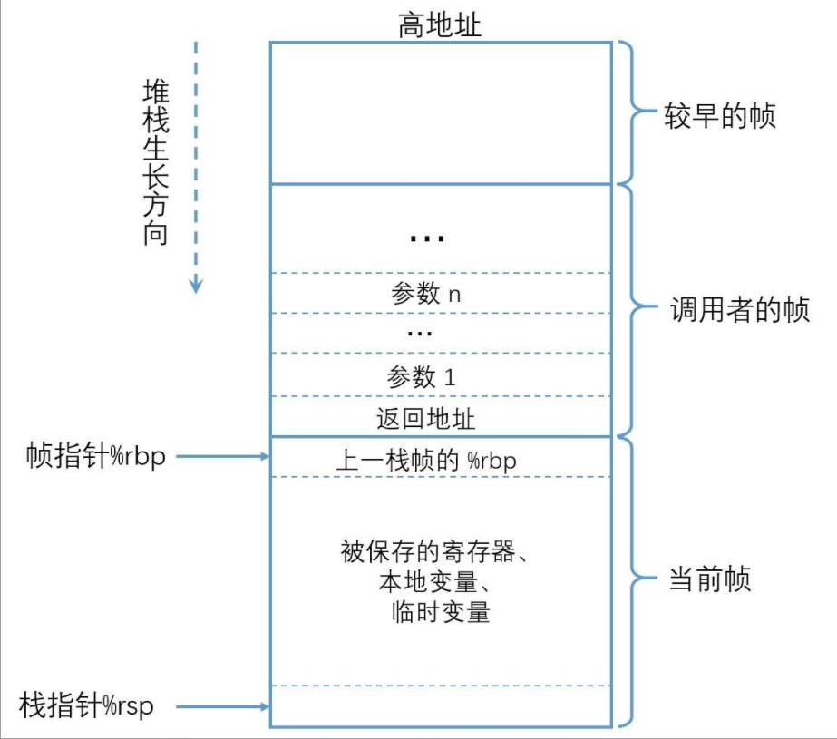

## 协程

### 0. concepts

#### 0.1 什么是协程？什么是纤程？

协程和纤程都是一种比线程更加轻量级的并发单元。两者的调度都不是由操作系统决定，而是由用户决定。两者都允许在一个函数执行过程中暂停执行，并在稍后恢复执行，从而实现非阻塞的并发操作。

两者的实现原理也是相同的，本质上都是以下几点：

1. **记住上下文信息**：无论是纤程还是协程，都需要记住当前的执行上下文，包括寄存器状态、栈指针等。
2. **切换执行位置**：在需要时，切换到另一个执行位置，继续执行其他任务。
3. **还原上下文信息**：在切换回原来的执行位置时，还原之前保存的上下文信息，继续执行。

| 特性       | 纤程（Fiber）    | 协程（Coroutine）        |
| ---------- | ---------------- | ------------------------ |
| 平台依赖   | Windows 特定实现 | 跨平台                   |
| 内存共享   | 共享线程栈       | 共享进程内存空间         |
| 实现复杂度 | 依赖操作系统 API | 可以通过库或语言特性实现 |

#### 0.2 协程的原理是什么？

协程实现的基础：C/C++ 函数调用过程，执行过程，返回过程。

- **记住离开的位置**：一个函数离开时能记住离开的位置。在 Windows 平台下，这意味着要能记住 EIP/RIP 寄存器的值，因为 EIP/RIP 指示了下一条指令要执行的地址。
- **恢复现场**：再次进入时能恢复现场。这要求能够保存当时函数栈内存和寄存器的值，并在恢复时恢复栈内存和寄存器的值。后面我们会详细说明并手动完成这个过程，这要求我们对函数调用有深入的理解。

#### 0.3 导读

本文关注以下问题，了解以下问题即可实现协程：

- 函数怎么提前返回？
- 怎么手动模拟函数调用？
- 函数参数到底怎么传？
- 函数如何能跨调用层次返回？
- 怎么能获取 EIP/RIP？
- 函数怎么跳转到特定地址执行？
- 函数怎么保存上下文？
- 汇编中为什么要保存寄存器？
- 汇编中怎么恢复栈？
- 汇编怎么平衡栈？
- 什么是 `__stdcall` 和 `__cdecl`？

### 1. C++协程实现必用知识讲解

#### 1.1 函数的执行环境

函数的执行环境可以分为四个部分：


1. **可执行的二进制代码**：

   - 二进制代码由编译器生成，编译后固定存储在二进制文件的 `.text` 段，加载到内存的只读代码区。理论上，这些代码不可以修改，但在某些情况下可以通过动态指令进行修改，这超出了我们的讨论范围。对于这部分，我们不需要过多关注。程序编译后，代码段加载到内存中，在 x86 的 CPU 平台下由 **EIP 寄存器** 指向下一条指令的内存地址，在 X64 平台是 **RIP 寄存器**，只是 64 位的，本质不变。对于我们的 **协程** 来说，需要手动记录和切换 EIP/RIP 关联的内存地址，具体方法后面会详细说明。

2. **运行所需寄存器**：

   - 寄存器非常重要，是我们学习和编写汇编代码时常打交道的部分。除了普通寄存器，随着 CPU 的升级，各种专用寄存器和指令也应运而生，比如 SSE 指令集使用的 XMM 寄存器，ARM 的 NEON 加速指令等。对于协程，我们只关心三类寄存器：**ESP 和 EBP（操作和记录堆栈相关的寄存器），EAX、EBX、ECX 等通用寄存器（用于操作指令的具体运算、传参、返回等），以及 EIP（控制执行指令的寄存器）**。在 X64 平台上，实际情况差不多，只是多了几个寄存器。协程在离开函数和恢复函数时，需要正确还原原来寄存器的值，但不一定是所有寄存器，根据 Intel i386 的 ABI 调用约定，有些寄存器的值本来就可以改变。

3. **运行所需栈内存**：
   - 函数运行离不开栈内存。简单来说，栈内存包含函数的参数、返回地址、需要保护的寄存器和局部变量。下图展示了经典的函数栈帧结构，其他资料中也有很多示意图。参数不一定都压栈，这取决于调用约定。对于协程，我们需要记录栈内存，比如函数的局部变量修改后，下次调用时需要是修改后的值。这涉及两大主要模式：**有独立栈协程和无独立栈协程**，其他变种暂不讨论。



4. **运行可能所需堆内存**：
   - 函数执行过程中可能需要动态分配一些堆内存，如通过 `new` 或 `malloc` 分配的内存。对于初步理解协程，这部分暂时不需要过多关注。

#### 1.2 函数的传参

##### 1.2.1 函数传参方式

函数的传参可以通过多种方式进行，具体方式取决于调用约定（calling convention）。常见的调用约定包括 `fastcall`、`stdcall`、`cdecl` 等。以下是对这些调用约定和传参方式的详细解释：

1. **纯栈传参**：

   - 所有参数都通过栈传递。这种方式在参数较多时使用较多，因为栈可以容纳任意数量的参数。

2. **寄存器传参**：

   - 在参数较少的情况下，参数可以直接通过寄存器传递。这种方式效率较高，因为寄存器访问速度比栈快。

3. **寄存器加栈传参**：
   - 当参数较多时，部分参数通过寄存器传递，剩余参数通过栈传递。这种方式结合了寄存器和栈的优点。

##### 1.2.2 函数调用约定

不同的调用约定对传参方式和顺序有不同的规定：

1. **`fastcall`**：

   - 参数优先通过寄存器传递，剩余参数通过栈传递。
   - 具体使用哪些寄存器取决于平台和编译器。

2. **`stdcall`**：

   - 参数从右到左压入栈，由被调用者清理栈。
   - 常用于 Windows API 函数。

3. **`cdecl`**：
   - 参数从右到左压入栈，由调用者清理栈。
   - 常用于 C 语言函数。

##### 1.2.3 平台和架构差异

不同平台和架构对寄存器的使用也有所不同：

1. **Windows 32 位平台**：

   - `eax` 常用于返回值。
   - `ecx` 用作 `this` 指针。
   - `edx` 作为第二个参数。

2. **Linux 32 位平台**：

   - 依次使用 `ebx`、`ecx`、`edx` 传递参数。

3. **64 位平台**：

   - 依次使用 `RDI`、`RSI`、`RDX`、`RCX`、`R8`、`R9` 传递参数。

4. **ARM64 平台**：
   - 依次使用 `x0`、`x1`、`x2`...`x7` 传递参数。

#### 1.3 函数的返回值

函数的返回值**一般来说用 `eax`/`rax`/`x0` 作返回，但这不是绝对的**。一个函数也可以借用其他寄存器返回值，如 `edx`、`xmm0`。如果函数返回值是一个结构体，**一个寄存器大小无法返回，可能会把返回值地址作为隐藏的参数传递**。例如，Boost 的协程切换函数就是这样的情况。

从 C/C++ 层面来说，函数调用与返回没有太多花样。我们从汇编层面来看，一般调用使用 `call functionA` 的形式，返回使用 `ret` 的形式。这里面有一些省略和等价过程，这些等价过程对协程非常重要，还需要使用这些知识点，这里还涉及栈的 `push` 与 `pop`，我们有必要详细说明。

### 2. 汇编基础

#### 2.1 理解 Push ,Pop 指令的等效过程

##### `push` 指令

`push` 指令用于将数据压入栈中。它的等效过程可以分为两步：

```nasm
push eax;
// 等同于两条伪指令
1. sub esp, 4;   // 将 esp 减 4，因为栈向下生长，伪指令，仅供理解
2. mov [esp], eax; // 将 eax 放到 esp 指向的内存中，伪指令，仅供理解
```

解释：

1. `sub esp, 4`：将栈指针 `esp` 减少 4 个字节，因为栈是向下生长的。
2. `mov [esp], eax`：将 `eax` 寄存器的值存储到 `esp` 指向的内存位置。

##### `pop` 指令

`pop` 指令用于从栈中弹出数据。它的等效过程可以分为两步：

```nasm
pop eax;
// 等同于两条伪指令
1. mov eax, [esp]; // 将 esp 指向的内存值放到 eax 中，伪指令，仅供理解
2. add esp, 4;    // 将 esp 加 4，因为栈向下生长，伪指令，仅供理解
```

解释：

1. `mov eax, [esp]`：将 `esp` 指向的内存位置的值加载到 `eax` 寄存器中。
2. `add esp, 4`：将栈指针 `esp` 增加 4 个字节，因为栈是向下生长的。

#### 2.2 深入理解 call,jmp,ret 指令的等效过程

##### `call` 指令

`call` 指令用于调用一个函数。它的等效过程可以分为三步：

```nasm
call 内存/立即数/寄存器;
// 等同于三条伪指令
1. push eip;   // 将当前 EIP（下一条指令的地址）压入栈中
2. mov eip, 目标地址; // 将 EIP 修改为目标地址
3. jmp eip;    // 跳转到新的 EIP 执行
```

解释：

1. 将当前指令的下一条指令地址（EIP）压入栈中，以便函数返回时使用。
2. 将 EIP 修改为目标函数的地址。
3. 跳转到新的 EIP 执行目标函数。

##### `jmp` 指令

`jmp` 指令用于无条件跳转到指定地址。它的等效过程可以分为两步：

```nasm
jmp 内存/立即数/寄存器;
// 等同于两条伪指令
1. mov eip, 目标地址; // 将 EIP 修改为目标地址
2. jmp eip;    // 跳转到新的 EIP 执行
```

解释：

1. 将 EIP 修改为目标地址。
2. 跳转到新的 EIP 执行目标地址的指令。

##### `ret` 指令

`ret` 指令用于从函数返回。它的等效过程可以分为三步：

```nasm
ret;
// 等同于三条伪指令
1. mov eip, [esp]; // 将栈顶数据（返回地址）加载到 EIP 中
2. add esp, 4;    // 将 esp 加 4，恢复栈指针
3. jmp eip;    // 跳转到新的 EIP 执行
```

解释：

1. 将栈顶数据（返回地址）加载到 EIP 中。
2. 将栈指针 `esp` 增加 4 个字节，恢复栈指针。
3. 跳转到新的 EIP 执行返回地址的指令。

通过理解 `push`、`pop`、`call`、`jmp` 和 `ret` 指令的等效过程，可以更深入地理解函数调用和返回的底层机制。我们可以不用 call 指令来调用一个函数，完全来模拟函数调用，只需要手动的将函数要返回的下条指令所对应 EIP 的值压入栈，然后分配栈内存，手动的 jmp 到我们想跳转的函数地址。

#### 2.3 获取 EIP 的值

获取 EIP/RIP 的值对于协程的实现非常重要，因为有了 EIP/RIP 的值，我们就可以知道当前执行的位置，并且可以在需要时跳转到这个位置，从而实现协程的手动切换。以下是几种获取 EIP/RIP 值的方法：

- **使用内置函数获取返回地址**

在 Clang 编译器下，可以使用内置函数 `__builtin_return_address` 来获取返回地址：

```cpp
infoPtr->reRIP = (uint64_t)__builtin_return_address(0);
```

这个函数返回当前函数的返回地址，即 EIP/RIP 的值。类似的函数在 Windows 平台上也存在，但具体名称可能不同。

- **使用汇编获取返回地址**
我们也可以使用汇编代码来获取 EIP/RIP 的值。以下是一个在 Windows 平台上使用 MSVC 编译器的示例：

```cpp
__declspec(naked) int __stdcall CoroutineGetRIP() {
    __asm {
        mov eax, [esp]  // 将栈顶的返回地址（EIP）移动到 eax 寄存器
        ret             // 返回
    }
}
```

在这个示例中，`__declspec(naked)` 关键字表示函数没有标准的函数前序和后序代码，允许我们完全控制函数的入口和出口。`mov eax, [esp]` 指令将栈顶的返回地址（EIP）移动到 `eax` 寄存器，然后 `ret` 指令返回。

- **使用标签获取当前地址**

我们还可以使用汇编中的标签来获取当前地址。这种方法在需要知道机器码长度并强行加指令大小时非常有用：

```nasm
__asm {
    call NEXT  // 调用 NEXT 标签
    NEXT:
    pop eax    // 将返回地址（EIP）弹出到 eax 寄存器
}
```

在这个示例中，`call NEXT` 指令将当前 EIP 压入栈中并跳转到 `NEXT` 标签，`pop eax` 指令将栈顶的返回地址（EIP）弹出到 `eax` 寄存器。

在协程实现中，获取 EIP/RIP 的过程可能比较隐蔽，尤其是在使用 Boost 库的汇编版本时，但核心原理是相同的。通过获取和保存 EIP/RIP 的值，可以在需要时恢复协程的执行位置，从而实现协程的切换。
