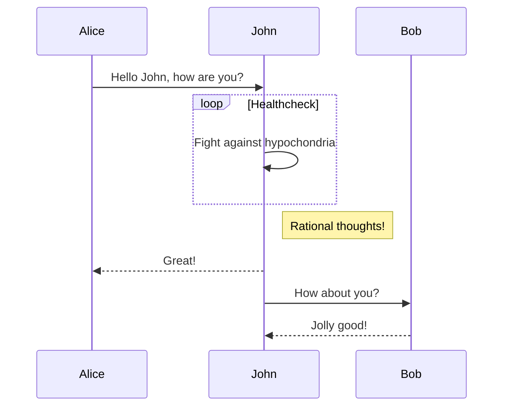
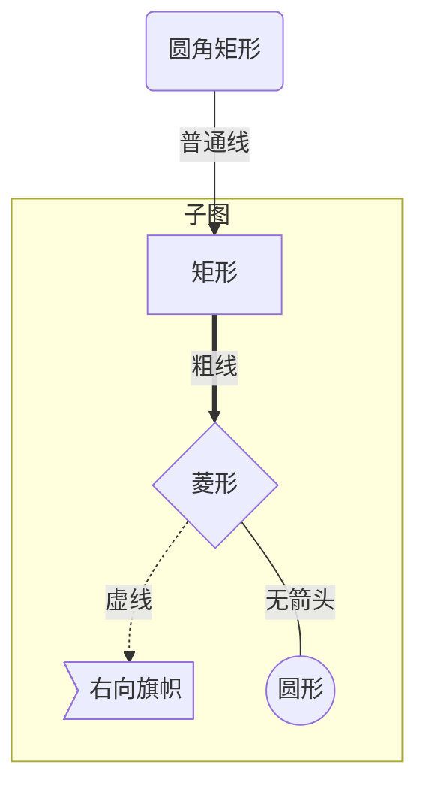
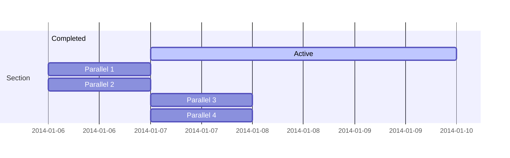
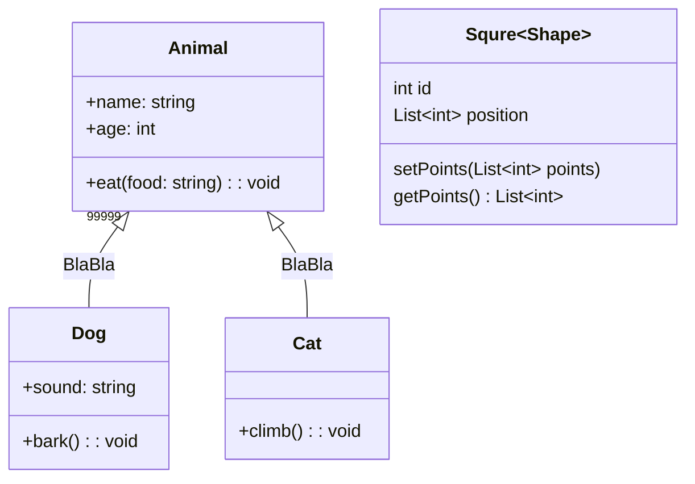

## mermaid

> marco

[toc]

### 1. 时序图

### 2. 流程图

### 3. 甘特图

### 4. 类图

#### 附录

+ **类图属性**

  | 符号 | 意义             |
  | ---- | ---------------- |
  | `+`  | public           |
  | `-`  | private          |
  | `#`  | protected        |
  | `~`  | package/internal |
  | *    | virtual          |
  | $    | static           |

  
* **类图关系**
  | 类型  | 描述              |
  | ----- | ----------------- |
  | `<¦–` | (Inheritance)继承 |
  | `*--` | (Composition)组合 |
  | `o--` | (Aggregation)聚合 |
  | `-->` | (Association)关联 |
  | `--`  | (Link)实线连接    |
  | `..>` | (Dependency)依赖  |
  | `…¦>` | (Realization)实现 |
  | `..`  | (Link)虚线连接    |