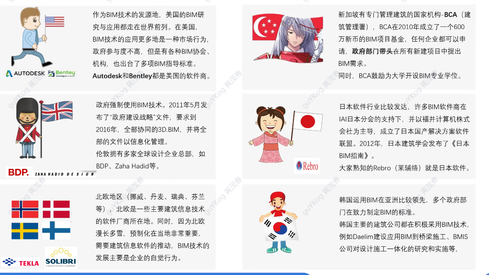

PLM结合电子商务技术与协同技术,将产品开发流程与SCM/CRM/ERP等系

* plm
    项目生命周期管理(Project Lifecycle Management,PLM)是一种综合性的方法和工具,用于管理和控制整个项目的生命周期,从项目的概念阶段到项目的完成和交付阶段.PLM涵盖了项目的规划/执行/监控和收尾等各个阶段,旨在确保项目按时/按质/按成本完成,并满足项目的目标和需求.

    PLM通常涉及以下方面的管理和控制:

    项目规划:确定项目的目标/范围/时间表/资源需求等,并制定详细的项目计划.
    项目执行:根据项目计划,组织和协调项目团队的工作,实施项目活动和任务.
    项目监控:监测项目的进展和绩效,及时发现和解决问题,确保项目按计划进行.
    项目收尾:完成项目的交付和验收,总结项目经验教训,进行项目的闭环管理.
    PLM结合了电子商务技术和协同技术,可以提供更高效/更协同的项目管理和协作环境.通过PLM,可以实现项目信息的集中管理/团队成员之间的协同工作/项目进度和绩效的实时监控等功能,从而提高项目的管理效率和质量.

    在上述代码中,PLM与SCM(供应链管理)/CRM(客户关系管理)和ERP(企业资源规划)等系统进行集成,以实现更全面和综合的企业管理.

* mfg
"MFG" 通常是 "Manufacturing" 的缩写,意为制造业.这一术语涵盖了从原材料到最终产品的整个制造过程,包括生产/加工/装配等.
* aec

"AEC" 通常是 "Architecture, Engineering, and Construction" 的缩写,意为建筑/工程和建设.这一术语涵盖了建筑设计/工程规划和施工等领域,包括建筑/土木工程/结构工程等.

