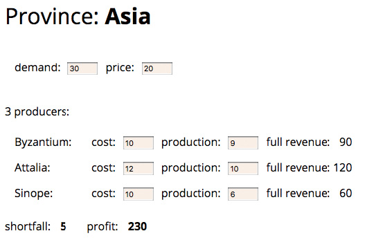

# 第 4 章 构筑测试体系

## 4.2 待测试的示例代码



页面底部展示了该区域的产品缺额（需求量减去总产量）和总利润（profit）。用户可以在界面上修改需求量及采购价格，以及不同生产商的产量（production）和成本价，以观察缺额和总利润的变化。用户在界面上修改任何数值时，其他的数值都会同时得到更新。

这里我展示了一个用户界面，是为了让你了解该应用的使用方式，但我只会聚焦于软件的业务逻辑部分，也就是那些计算利润和缺额的类，而非那些生成 HTML 或监听页面字段更新的代码。本章只是先带你走进自测试代码世界的大门，因而最好是从最简单的例子开始，也就是那些不涉及用户界面、持久化或外部服务交互的代码。这种隔离的思路其实在任何场景下都适用：一旦业务逻辑的部分开始变复杂，我就会把它与 UI 分离开，以便能更好地理解和测试它。

这块业务逻辑代码涉及两个类：一个代表了单个生产商（Producer），另一个用来描述一个行省（Province）。Province 类的构造函数接收一个 JavaScript 对象，这个对象的内容我们可以想象是由一个 JSON 文件提供的。

```js
constructor(doc) {
 this._name = doc.name;
 this._producers = [];
 this._totalProduction = 0;
 this._demand = doc.demand;
 this._price = doc.price;
 doc.producers.forEach(d => this.addProducer(new Producer(this, d)));
}
addProducer(arg) {
 this._producers.push(arg);
 this._totalProduction += arg.production;
}
```

#### 顶层作用域...

```js
function sampleProvinceData() {
  return {
    name: "Asia",
    producers: [
      { name: "Byzantium", cost: 10, production: 9 },
      { name: "Attalia", cost: 12, production: 10 },
      { name: "Sinope", cost: 10, production: 6 },
    ],
    demand: 30,
    price: 20,
  };
}
```

#### class Province...

```js
get name()    {return this._name;}
get producers() {return this._producers.slice();}
get totalProduction()    {return this._totalProduction;}
set totalProduction(arg) {this._totalProduction = arg;}
get demand()    {return this._demand;}
set demand(arg) {this._demand = parseInt(arg);}
get price()    {return this._price;}
set price(arg) {this._price = parseInt(arg);}
```

设值函数会被 UI 端调用，接收一个包含数值的字符串。我需要将它们转换成数值，以便在后续的计算中使用。

代表生产商的 Producer 类则基本只是一个存放数据的容器。

#### class Producer...

```js
constructor(aProvince, data) {
 this._province = aProvince;
 this._cost = data.cost;
 this._name = data.name;
 this._production = data.production || 0;
}
get name() {return this._name;}
get cost() {return this._cost;}
set cost(arg) {this._cost = parseInt(arg);}

get production() {return this._production;}
set production(amountStr) {
 const amount = parseInt(amountStr);
 const newProduction = Number.isNaN(amount) ? 0 : amount;
 this._province.totalProduction += newProduction - this._production;
 this._production = newProduction;
}
```

在设值函数 production 中更新派生数据的方式有点丑陋，每当看到这种代码，我便想通过重构帮它改头换面。但在重构之前，我必须记得先为它添加测试。

缺额的计算逻辑也很简单。

#### class Province...

```js
get shortfall() {
 return this._demand - this.totalProduction;
}
```

计算利润的逻辑则要相对复杂一些。

#### class Province...

```js
get profit() {
 return this.demandValue - this.demandCost;
}
get demandCost() {
 let remainingDemand = this.demand;
 let result = 0;
 this.producers
  .sort((a,b) => a.cost - b.cost)
  .forEach(p => {
   const contribution = Math.min(remainingDemand, p.production);
    remainingDemand -= contribution;
    result += contribution * p.cost;
  });
 return result;
}
get demandValue() {
 return this.satisfiedDemand * this.price;
}
get satisfiedDemand() {
 return Math.min(this._demand, this.totalProduction);
}
```

## 4.3 第一个测试

```js
describe("province", function () {
  it("shortfall", function () {
    const asia = new Province(sampleProvinceData());
    assert.equal(asia.shortfall, 5);
  });
});
```

第一步设置好一些测试夹具（fixture），也就是测试所需要的数据和对象等（就本例而言是一个加载好了的行省对象）；第二步则是验证测试夹具是否具备某些特征（就本例而言则是验证算出的缺额应该是期望的值）。

> **Tip**  

#### class Province...

> **Tip**

## 4.4 再添加一个测试


> **Tip**  

如果未来有一个测试改变了这个共享对象，测试就可能时不时失败，因为测试之间会通过共享夹具产生交互，而测试的结果就会受测试运行次序的影响。测试结果的这种不确定性，往往使你陷入漫长而又艰难的调试，严重时甚至可能令你对测试体系的信心产生动摇。因此，我比较推荐采取下面的做法：

```js
describe("province", function () {
  let asia;
  beforeEach(function () {
    asia = new Province(sampleProvinceData());
  });
  it("shortfall", function () {
    expect(asia.shortfall).equal(5);
  });
  it("profit", function () {
    expect(asia.profit).equal(230);
  });
});
```

beforeEach 子句会在每个测试之前运行一遍，将 asia 变量清空，每次都给它赋一个新的值。这样我就能在每个测试开始前，为它们各自构建一套新的测试夹具，这保证了测试的独立性，避免了可能带来麻烦的不确定性。

对于这样的建议，有人可能会担心，每次创建一个崭新的测试夹具会拖慢测试的运行速度。大多数时候，时间上的差别几乎无法察觉。如果运行速度真的成为问题，我也可以考虑共享测试夹具，但这样我就得非常小心，确保没有测试会去更改它。如果我能够确定测试夹具是百分之百不可变的，那么也可以共享它。但我的本能反应还是要使用独立的测试夹具，可能因为我过去尝过了太多共享测试夹具带来的苦果。

既然我在 beforeEach 里运行的代码会对每个测试生效，那么为何不直接把它挪到每个 it 块里呢？让所有测试共享一段测试夹具代码的原因，是为了使我对公用的夹具代码感到熟悉，从而将眼光聚焦于每个测试的不同之处。beforeEach 块旨在告诉读者，我使用了同一套标准夹具。你可以接着阅读 describe 块里的所有测试，并知道它们都是基于同样的数据展开测试的。

## 4.5 修改测试夹具

这是一个常见的测试模式。我拿到 beforeEach 配置好的初始标准夹具，然后对该夹具进行必要的检查，最后验证它是否表现出我期望的行为。
如果你读过测试相关的资料，就会经常听到各种类似的术语，比如配置-检查-验证（setup-exercise-verify）、given-when-then 或者准备-行为-断言（arrange-act-assert）等。有时你能在一个测试里见到所有的步骤，有时那些早期的公用阶段会被提到一些标准的配置步骤里，诸如 beforeEach 等。

> **Tip**  
（其实还有第四个阶段，只是不那么明显，一般很少提及，那就是拆除阶段。此阶段可将测试夹具移除，以确保不同测试之间不会产生交互。因为我是在 beforeEach 中配置好数据的，所以测试框架会默认在不同的测试间将我的测试夹具移除，相当于我自动享受了拆除阶段带来的便利。多数测试文献的作者对拆除阶段一笔带过，这可以理解，因为多数时候我们可以忽略它。但有时因为创建缓慢等原因，我们会在不同的测试间共享测试夹具，此时，显式地声明一个拆除操作就是很重要的。）


在这个测试中，我在一个 it 语句里验证了两个不同的特性。作为一个基本规则，一个 it 语句中最好只有一个验证语句，否则测试可能在进行第一个验证时就失败，这通常会掩盖一些重要的错误信息，不利于你了解测试失败的原因。不过，在上面的场景中，我觉得两个断言本身关系非常紧密，写在同一个测试中问题不大。如果稍后需要将它们分离到不同的 it 语句中，我可以到时再做。

## 4.6 探测边界条件

到目前为止我的测试都聚焦于正常的行为上，这通常也被称为“正常路径”（happy path），它指的是一切工作正常、用户使用方式也最符合规范的那种场景。同时，把测试推到这些条件的边界处也是不错的实践，这可以检查操作出错时软件的表现。

无论何时，当我拿到一个集合（比如说此例中的生产商集合）时，我总想看看集合为空时会发生什么。

```js
describe('no producers', function() {
 let noProducers;
 beforeEach(function() {
  const data = {
   name: "No proudcers",
   producers: [],
   demand: 30,
   price: 20
  };
  noProducers = new Province(data);
 });
 it('shortfall', function() {
  expect(noProducers.shortfall).equal(30);
 });
 it('profit', function() {
  expect(noProducers.profit).equal(0);
 });
```

如果拿到的是数值类型，0 会是不错的边界条件：

```js
describe('province'...
  it('zero demand', function() {
 asia.demand = 0;
  expect(asia.shortfall).equal(-25);
  expect(asia.profit).equal(0);
 });
```

负值同样值得一试：

```js
describe('province'...
  it('negative demand', function() {
 asia.demand = -1;
 expect(asia.shortfall).equal(-26);
 expect(asia.profit).equal(-10);
});
```

测试到这里，我不禁有一个想法：对于这个业务领域来讲，提供一个负的需求值，并算出一个负的利润值意义何在？最小的需求量不应该是 0 吗？或许，设值方法需要对负值有些不同的行为，比如抛出错误，或总是将值设置为 0。这些问题都很好，编写这样的测试能帮助我思考代码本应如何应对边界场景。

设值函数接收的字符串是从 UI 上的字段读来的，它已经被限制为只能填入数字，但仍然有可能是空字符串，因此同样需要测试来保证代码对空字符串的处理方式符合我的期望。

> **Tip**  
考虑可能出错的边界条件，把测试火力集中在那儿。


```js
describe('province'...
  it('empty string demand', function() {
 asia.demand = "";
 expect(asia.shortfall).NaN;
 expect(asia.profit).NaN;
});
```

可以看到，我在这里扮演“程序公敌”的角色。我积极思考如何破坏代码。我发现这种思维能够提高生产力，并且很有趣——它纵容了我内心中比较促狭的那一部分。

这个测试结果很有意思：

```js
describe('string for producers', function() {
 it('', function() {
  const data = {
   name: "String producers",
   producers: "",
   demand: 30,
   price: 20
  };
  const prov = new Province(data);
  expect(prov.shortfall).equal(0);
 });
```

它并不是抛出一个简单的错误说缺额的值不为 0。控制台的报错输出实际如下：

```js
'''''''''!

9 passing (74ms)
1 failing

1) string for producers :
  TypeError: doc.producers.forEach is not a function
  at new Province (src/main.js:22:19)
  at Context.<anonymous> (src/tester.js:86:18)
```

一种思路是，对错误进行处理并给出更好的出错响应，比如说抛出更有意义的错误信息，或是直接将 producers 字段设置为一个空数组（最好还能再记录一行日志信息）。但维持现状不做处理也说得通，也许该输入对象是由可信的数据源提供的，比如同个代码库的另一部分。在同一代码库的不同模块之间加入太多的检查往往会导致重复的验证代码，它带来的好处通常不抵害处，特别是你添加的验证可能在其他地方早已做过。但如果该输入对象是由一个外部服务所提供，比如一个返回 JSON 数据的请求，那么校验和测试就显得必要了。不论如何，为边界条件添加测试总能引发这样的思考。

如果这样的测试是在重构前写出的，那么我很可能还会删掉它。重构应该保证可观测的行为不发生改变，而类似的错误已经超越可观测的范畴。删掉这条测试，我就不用担心重构过程改变了代码对这个边界条件的处理方式。
