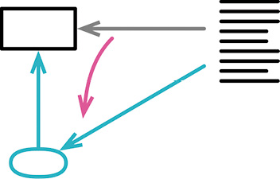
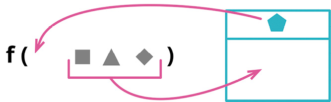
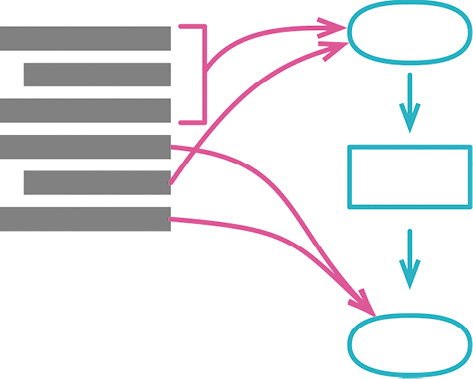

# 第 6 章 第一组重构

我最常用到的重构就是用提炼函数（106）将代码提炼到函数中，或者用提炼变量（119）来提炼变量。我也经常使用这两个重构的反向重构——内联函数（115）和内联变量（123）。

改变函数声明（124）可以用于修改函数的名字，也可以用于添加或删减参数。变量也可以用变量改名（137）来改名，不过需要先做封装变量（132）。在给函数的形式参数改名时，不妨先用引入参数对象（140）把常在一起出没的参数组合成一个对象。

有了函数以后，就需要把它们组合成更高层级的模块。我会使用函数组合成类（144），把函数和它们操作的数据一起组合成类。
另一条路径是用函数组合成变换（149）将函数组合成变换式（transform），这对于处理只读数据尤为便利。再往前一步，常常可以用拆分阶段（154）将这些模块组成界限分明的处理阶段。

## 6.1 提炼函数（Extract Function）
反向重构:内联函数(115)


## 6.2 内联函数（Inline Function）

反向重构：提炼函数（106）

## 6.3 提炼变量（Extract Variable）

反向重构：内联变量（123）

## 6.4 内联变量（Inline Variable）

曾用名：内联临时变量（Inline Temp）

## 6.5 改变函数声明（Change Function Declaration）


## 6.6 封装变量（Encapsulate Variable）

曾用名：自封装字段（Self-Encapsulate Field）

曾用名：封装字段（Encapsulate Field）



```js
let defaultOwner = { firstName: "Martin", lastName: "Fowler" };
```

```js
let defaultOwnerData = { firstName: "Martin", lastName: "Fowler" };
export function defaultOwner() {
  return defaultOwnerData;
}
export function setDefaultOwner(arg) {
  defaultOwnerData = arg;
}
```

### 动机

在改名或搬移函数的过程中，总是可以比较容易地保留旧函数作为转发函数（即旧代码调用旧函数，旧函数再调用新函数）。这样的转发函数通常不会存在太久，但的确能够简化重构过程。

数据就要麻烦得多，因为没办法设计这样的转发机制。如果我把数据搬走，就必须同时修改所有引用该数据的代码，否则程序就不能运行。如果数据的可访问范围很小，比如一个小函数内部的临时变量，那还不成问题。但如果可访问范围变大，重构的难度就会随之增大，这也是说全局数据是大麻烦的原因。

所以，如果想要搬移一处被广泛使用的数据，最好的办法往往是先以函数形式封装所有对该数据的访问。这样，我就能把“重新组织数据”的困难任务转化为“重新组织函数”这个相对简单的任务。

封装数据的价值还不止于此。封装能提供一个清晰的观测点，可以由此监控数据的变化和使用情况；我还可以轻松地添加数据被修改时的验证或后续逻辑。我的习惯是：对于所有可变的数据，只要它的作用域超出单个函数，我就会将其封装起来，只允许通过函数访问。数据的作用域越大，封装就越重要。处理遗留代码时，一旦需要修改或增加使用可变数据的代码，我就会借机把这份数据封装起来，从而避免继续加重耦合一份已经广泛使用的数据。

面向对象方法如此强调对象的数据应该保持私有（private），背后也是同样的原理。每当看见一个公开（public）的字段时，我就会考虑使用封装变量（在这种情况下，这个重构手法常被称为封装字段）来缩小其可见范围。一些更激进的观点认为，即便在类内部，也应该通过访问函数来使用字段——这种做法也称为“自封装”。大体而言，我认为自封装有点儿过度了——如果一个类大到需要将字段自封装起来的程度，那么首先应该考虑把这个类拆小。不过，在分拆类之前，自封装字段倒是一个有用的步骤。

封装数据很重要，不过，不可变数据更重要。如果数据不能修改，就根本不需要数据更新前的验证或者其他逻辑钩子。我可以放心地复制数据，而不用搬移原来的数据——这样就不用修改使用旧数据的代码，也不用担心有些代码获得过时失效的数据。不可变性是强大的代码防腐剂。

### 做法

- 创建封装函数，在其中访问和更新变量值。
- 执行静态检查。
- 逐一修改使用该变量的代码，将其改为调用合适的封装函数。每次替换之后，执行测试。
- 限制变量的可见性。

> **Tip**  
有时没办法阻止直接访问变量。若果真如此，可以试试将变量改名，再执行测试，找出仍在直接使用该变量的代码。


- 测试。
- 如果变量的值是一个记录，考虑使用封装记录（162）。

### 范例

下面这个全局变量中保存了一些有用的数据：

```js
let defaultOwner = { firstName: "Martin", lastName: "Fowler" };
```

使用它的代码平淡无奇：

```js
spaceship.owner = defaultOwner;
```

更新这段数据的代码是这样：

```js
defaultOwner = { firstName: "Rebecca", lastName: "Parsons" };
```

首先我要定义读取和写入这段数据的函数，给它做个基础的封装。

```js
function getDefaultOwner() {
  return defaultOwner;
}
function setDefaultOwner(arg) {
  defaultOwner = arg;
}
```

然后就开始处理使用 defaultOwner 的代码。每看见一处引用该数据的代码，就将其改为调用取值函数。
profiling
```js
spaceship.owner = getDefaultOwner();
```

每看见一处给变量赋值的代码，就将其改为调用设值函数。

```js
setDefaultOwner({ firstName: "Rebecca", lastName: "Parsons" });
```

每次替换之后，执行测试。

处理完所有使用该变量的代码之后，我就可以限制它的可见性。这一步的用意有两个，一来是检查是否遗漏了变量的引用，二来可以保证以后的代码也不会直接访问该变量。在 JavaScript 中，我可以把变量和访问函数搬移到单独一个文件中，并且只导出访问函数，这样就限制了变量的可见性。

#### defaultOwner.js...

```js
let defaultOwner = { firstName: "Martin", lastName: "Fowler" };
export function getDefaultOwner() {
  return defaultOwner;
}
export function setDefaultOwner(arg) {
  defaultOwner = arg;
}
```

如果条件不允许限制对变量的访问，可以将变量改名，然后再次执行测试，检查是否仍有代码在直接使用该变量。这阻止不了未来的代码直接访问变量，不过可以给变量起个有意义又难看的名字（例如`__privateOnly_defaultOwner`），提醒后来的客户端。

我不喜欢给取值函数加上 get 前缀，所以我对这个函数改名。

#### defaultOwner.js...

```js
let defaultOwnerData = { firstName: "Martin", lastName: "Fowler" };
export function getdefaultOwner() {
  return defaultOwnerData;
}
export function setDefaultOwner(arg) {
  defaultOwnerData = arg;
}
```

JavaScript 有一种惯例：给取值函数和设值函数起同样的名字，根据有没有传入参数来区分。我把这种做法称为“重载取值/设值函数”（Overloaded Getter Setter）[mf-orgs]，并且我强烈反对这种做法。所以，虽然我不喜欢 get 前缀，但我会保留 set 前缀。

### 封装值

前面介绍的基本重构手法对数据结构的引用做了封装，使我能控制对该数据结构的访问和重新赋值，但并不能控制对结构内部数据项的修改：

```js
const owner1 = defaultOwner();
assert.equal("Fowler", owner1.lastName, "when set");
const owner2 = defaultOwner();
owner2.lastName = "Parsons";
assert.equal("Parsons", owner1.lastName, "after change owner2"); // is this ok?
```

前面的基本重构手法只封装了对最外层数据的引用。很多时候这已经足够了。但也有很多时候，我需要把封装做得更深入，不仅控制对变量引用的修改，还要控制对变量内容的修改。

这有两个办法可以做到。最简单的办法是禁止对数据结构内部的数值做任何修改。我最喜欢的一种做法是修改取值函数，使其返回该数据的一份副本。

#### defaultOwner.js...

```js
let defaultOwnerData = { firstName: "Martin", lastName: "Fowler" };
export function defaultOwner() {
  return Object.assign({}, defaultOwnerData);
}
export function setDefaultOwner(arg) {
  defaultOwnerData = arg;
}
```

对于列表数据，我尤其常用这一招。如果我在取值函数中返回数据的一份副本，客户端可以随便修改它，但不会影响到共享的这份数据。但在使用副本的做法时，我必须格外小心：有些代码可能希望能修改共享的数据。若果真如此，我就只能依赖测试来发现问题了。另一种做法是阻止对数据的修改，比如通过封装记录（162）就能很好地实现这一效果。

```js
  let defaultOwnerData = {firstName: "Martin", lastName: "Fowler"};
export function defaultOwner()       {return new Person(defaultOwnerData);}
export function setDefaultOwner(arg) {defaultOwnerData = arg;}

class Person {
 constructor(data) {
  this._lastName = data.lastName;
  this._firstName = data.firstName
 }
 get lastName() {return this._lastName;}
 get firstName() {return this._firstName;}
 // and so on for other properties
```

现在，如果客户端调用 defaultOwner 函数获得“默认拥有人”数据、再尝试对其属性（即 lastName 和 firstName）重新赋值，赋值不会产生任何效果。对于侦测或阻止修改数据结构内部的数据项，各种编程语言有不同的方式，所以我会根据当下使用的语言来选择具体的办法。

“侦测和阻止修改数据结构内部的数据项”通常只是个临时处置。随后我可以去除这些修改逻辑，或者提供适当的修改函数。这些都处理完之后，我就可以修改取值函数，使其返回一份数据副本。

到目前为止，我都在讨论“在取数据时返回一份副本”，其实设值函数也可以返回一份副本。这取决于数据从哪儿来，以及我是否需要保留对源数据的连接，以便知悉源数据的变化。如果不需要这样一条连接，那么设值函数返回一份副本就有好处：可以防止因为源数据发生变化而造成的意外事故。很多时候可能没必要复制一份数据，不过多一次复制对性能的影响通常也都可以忽略不计。但是，如果不做复制，风险则是未来可能会陷入漫长而困难的调试排错过程。

请记住，前面提到的数据复制、类封装等措施，都只在数据记录结构中深入了一层。如果想走得更深入，就需要更多层级的复制或是封装。

如你所见，数据封装很有价值，但往往并不简单。到底应该封装什么，以及如何封装，取决于数据被使用的方式，以及我想要修改数据的方式。不过，一言以蔽之，数据被使用得越广，就越是值得花精力给它一个体面的封装。

## 6.8 引入参数对象（Introduce Parameter Object）



```js
function amountInvoiced(startDate, endDate) {...}
function amountReceived(startDate, endDate) {...}
function amountOverdue(startDate, endDate) {...}
```

```js
function amountInvoiced(aDateRange) {...}
function amountReceived(aDateRange) {...}
function amountOverdue(aDateRange) {...}
```

### 动机

我常会看见，一组数据项总是结伴同行，出没于一个又一个函数。这样一组数据就是所谓的数据泥团，我喜欢代之以一个数据结构。

将数据组织成结构是一件有价值的事，因为这让数据项之间的关系变得明晰。使用新的数据结构，参数的参数列表也能缩短。并且经过重构之后，所有使用该数据结构的函数都会通过同样的名字来访问其中的元素，从而提升代码的一致性。

但这项重构真正的意义在于，它会催生代码中更深层次的改变。一旦识别出新的数据结构，我就可以重组程序的行为来使用这些结构。我会创建出函数来捕捉围绕这些数据的共用行为——可能只是一组共用的函数，也可能用一个类把数据结构与使用数据的函数组合起来。这个过程会改变代码的概念图景，将这些数据结构提升为新的抽象概念，可以帮助我更好地理解问题域。果真如此，这个重构过程会产生惊人强大的效用——但如果不用引入参数对象开启这个过程，后面的一切都不会发生。

### 做法

- 如果暂时还没有一个合适的数据结构，就创建一个。

> **Tip**  
我倾向于使用类，因为稍后把行为放进来会比较容易。我通常会尽量确保这些新建的数据结构是值对象[mf-vo]。


- 测试。
- 使用改变函数声明（124）给原来的函数新增一个参数，类型是新建的数据结构。
- 测试。
- 调整所有调用者，传入新数据结构的适当实例。每修改一处，执行测试。
- 用新数据结构中的每项元素，逐一取代参数列表中与之对应的参数项，然后删除原来的参数。测试。

### 范例

下面要展示的代码会查看一组温度读数（reading），检查是否有任何一条读数超出了指定的运作温度范围（range）。温度读数的数据如下：

```js
const station = {
  name: "ZB1",
  readings: [
    { temp: 47, time: "2016-11-10 09:10" },
    { temp: 53, time: "2016-11-10 09:20" },
    { temp: 58, time: "2016-11-10 09:30" },
    { temp: 53, time: "2016-11-10 09:40" },
    { temp: 51, time: "2016-11-10 09:50" },
  ],
};
```

下面的函数负责找到超出指定范围的温度读数：

```js
function readingsOutsideRange(station, min, max) {
 return station.readings
  .filter(r => r.temp < min || r.temp > max);
}
```

调用该函数的代码可能是下面这样的。

调用方

```js
alerts = readingsOutsideRange(
  station,
  operatingPlan.temperatureFloor,
  operatingPlan.temperatureCeiling
);
```

请注意，这里的调用代码从另一个对象中抽出两项数据，转手又把这一对数据传递给 readingsOutsideRange。代表“运作计划”的 operatingPlan 对象用了另外的名字来表示温度范围的下限和上限，与 readingsOutsideRange 中所用的名字不同。像这样用两项各不相干的数据来表示一个范围的情况并不少见，最好是将其组合成一个对象。我会首先为要组合的数据声明一个类：

```js
class NumberRange {
  constructor(min, max) {
    this._data = { min: min, max: max };
  }
  get min() {
    return this._data.min;
  }
  get max() {
    return this._data.max;
  }
}
```

我声明了一个类，而不是基本的 JavaScript 对象，因为这个重构通常只是一系列重构的起点，随后我会把行为搬移到新建的对象中。既然类更适合承载数据与行为的组合，我就直接从声明一个类开始。同时，在这个新类中，我不会提供任何更新数据的函数，因为我有可能将其处理成值对象（Value Object）[mf-vo]。在使用这个重构手法时，大多数情况下我都会创建值对象。

然后我会运用改变函数声明（124），把新的对象作为参数传给 readingsOutsideRange。

```js
function readingsOutsideRange(station, min, max, range) {
 return station.readings
  .filter(r => r.temp < min || r.temp > max);
}
```

在 JavaScript 中，此时我不需要修改调用方代码，但在其他语言中，我必须在调用处为新参数传入 null 值，就像下面这样。

调用方

```js
alerts = readingsOutsideRange(
  station,
  operatingPlan.temperatureFloor,
  operatingPlan.temperatureCeiling,
  null
);
```

到目前为止，我还没有修改任何行为，所以测试应该仍然能通过。随后，我会挨个找到函数的调用处，传入合适的温度范围。

调用方

```js
const range = new NumberRange(
  operatingPlan.temperatureFloor,
  operatingPlan.temperatureCeiling
);
alerts = readingsOutsideRange(
  station,
  operatingPlan.temperatureFloor,
  operatingPlan.temperatureCeiling,
  range
);
```

此时我还是没有修改任何行为，因为新添的参数没有被使用。所有测试应该仍然能通过。

现在我可以开始修改使用参数的代码了。先从“最大值”开始：

```js
function readingsOutsideRange(station, min, max, range) {
 return station.readings
  .filter(r => r.temp < min || r.temp > range.max);
}
```

调用方

```js
const range = new NumberRange(
  operatingPlan.temperatureFloor,
  operatingPlan.temperatureCeiling
);
alerts = readingsOutsideRange(
  station,
  operatingPlan.temperatureFloor,
  operatingPlan.temperatureCeiling,
  range
);
```

此时要执行测试。如果测试通过，我再接着处理另一个参数。

```js
function readingsOutsideRange(station, min, range) {
 return station.readings
  .filter(r => r.temp < range.min || r.temp > range.max);
}
```

调用方

```js
const range = new NumberRange(
  operatingPlan.temperatureFloor,
  operatingPlan.temperatureCeiling
);
alerts = readingsOutsideRange(station, operatingPlan.temperatureFloor, range);
```

这项重构手法到这儿就完成了。不过，将一堆参数替换成一个真正的对象，这只是长征第一步。创建一个类是为了把行为搬移进去。在这里，我可以给“范围”类添加一个函数，用于测试一个值是否落在范围之内。

```js
function readingsOutsideRange(station, range) {
 return station.readings
  .f ilter(r => !range.contains(r.temp));
}
```

#### class NumberRange...

```js
  contains(arg) {return (arg >= this.min &amp;&amp; arg <= this.max);}
```

这样我就迈出了第一步，开始逐渐打造一个真正有用的“范围”[mf-range]类。一旦识别出“范围”这个概念，那么每当我在代码中发现“最大/最小值”这样一对数字时，我就会考虑是否可以将其改为使用“范围”类。（例如，我马上就会考虑把“运作计划”类中的 temperatureFloor 和 temperatureCeiling 替换为 temperatureRange。）在观察这些成对出现的数字如何被使用时，我会发现一些有用的行为，并将其搬移到“范围”类中，简化其使用方法。比如，我可能会先给这个类加上“基于数值判断相等性”的函数，使其成为一个真正的值对象。

## 6.9 函数组合成类（Combine Functions into Class）


测试。现在我可以再次用内联变量（123）把 taxableCharge 变量也去掉。

增强后的读数记录有一个大问题：如果某个客户端修改了一项数据的值，会发生什么？比如说，如果某处代码修改了 quantity 字段的值，就会导致数据不一致。在 JavaScript 中，避免这种情况最好的办法是不要使用本重构手法，改用函数组合成类（144）。如果编程语言支持不可变的数据结构，那么就没有这个问题了，那样的语言中会更常用到变换。但即便编程语言不支持数据结构不可变，如果数据是在只读的上下文中被使用（例如在网页上显示派生数据），还是可以使用变换。

## 6.11 拆分阶段（Split Phase）



```js
const orderData = orderString.split(/\s+/);
const productPrice = priceList[orderData[0].split("-")[1]];
const orderPrice = parseInt(orderData[1]) * productPrice;
```

```js
const orderRecord = parseOrder(order);
const orderPrice = price(orderRecord, priceList);

function parseOrder(aString) {
  const values = aString.split(/\s+/);
  return {
    productID: values[0].split("-")[1],
    quantity: parseInt(values[1]),
  };
}
function price(order, priceList) {
  return order.quantity * priceList[order.productID];
}
```

### 动机

每当看见一段代码在同时处理两件不同的事，我就想把它拆分成各自独立的模块，因为这样到了需要修改的时候，我就可以单独处理每个主题，而不必同时在脑子里考虑两个不同的主题。如果运气够好的话，我可能只需要修改其中一个模块，完全不用回忆起另一个模块的诸般细节。

最简洁的拆分方法之一，就是把一大段行为分成顺序执行的两个阶段。可能你有一段处理逻辑，其输入数据的格式不符合计算逻辑的要求，所以你得先对输入数据做一番调整，使其便于处理。也可能是你把数据处理逻辑分成顺序执行的多个步骤，每个步骤负责的任务全然不同。

编译器是最典型的例子。编译器的任务很直观：接受文本（用某种编程语言编写的代码）作为输入，将其转换成某种可执行的格式（例如针对某种特定硬件的目标码）。随着经验加深，我们发现把这项大任务拆分成一系列阶段会很有帮助：首先对文本做词法分析，然后把 token 解析成语法树，然后再对语法树做几步转换（如优化），最后生成目标码。每一步都有边界明确的范围，我可以聚焦思考其中一步，而不用理解其他步骤的细节。

在大型软件中，类似这样的阶段拆分很常见，例如编译器的每个阶段又包含若干函数和类。即便只有不大的一块代码，只要我发现了有益的将其拆分成多个阶段的机会，同样可以运用拆分阶段重构手法。如果一块代码中出现了上下几段，各自使用不同的一组数据和函数，这就是最明显的线索。将这些代码片段拆分成各自独立的模块，能更明确地标示出它们之间的差异。

### 做法

- 将第二阶段的代码提炼成独立的函数。
- 测试。
- 引入一个中转数据结构，将其作为参数添加到提炼出的新函数的参数列表中。
- 测试。
- 逐一检查提炼出的“第二阶段函数”的每个参数。如果某个参数被第一阶段用到，就将其移入中转数据结构。每次搬移之后都要执行测试。

> **Tip**  
有时第二阶段根本不应该使用某个参数。果真如此，就把使用该参数得到的结果全都提炼成中转数据结构的字段，然后用搬移语句到调用者（217）把使用该参数的代码行搬移到“第二阶段函数”之外。


- 对第一阶段的代码运用提炼函数（106），让提炼出的函数返回中转数据结构。

> **Tip**  
也可以把第一阶段提炼成一个变换（transform）对象。


### 范例

我手上有一段“计算订单价格”的代码，至于订单中的商品是什么，我们从代码中看不出来，也不太关心。

```js
function priceOrder(product, quantity, shippingMethod) {
 const basePrice = product.basePrice * quantity;
 const discount = Math.max(quantity - product.discountThreshold, 0)
     * product.basePrice * product.discountRate;
 const shippingPerCase = (basePrice > shippingMethod.discountThreshold)
     ? shippingMethod.discountedFee : shippingMethod.feePerCase;
 const shippingCost = quantity * shippingPerCase;
 const price = basePrice - discount + shippingCost;
 return price;
}
```

虽然只是个常见的、过于简单的范例，从中还是能看出有两个不同阶段存在的。前两行代码根据商品（product）信息计算订单中与商品相关的价格，随后的两行则根据配送（shipping）信息计算配送成本。后续的修改可能还会使价格和配送的计算逻辑变复杂，但只要这两块逻辑相对独立，将这段代码拆分成两个阶段就是有价值的。

我首先用提炼函数（106）把计算配送成本的逻辑提炼出来。

```js
function priceOrder(product, quantity, shippingMethod) {
 const basePrice = product.basePrice * quantity;
 const discount = Math.max(quantity - product.discountThreshold, 0)
     * product.basePrice * product.discountRate;
 const price = applyShipping(basePrice, shippingMethod, quantity, discount);
 return price;
}
function applyShipping(basePrice, shippingMethod, quantity, discount) {
 const shippingPerCase = (basePrice > shippingMethod.discountThreshold)
     ? shippingMethod.discountedFee : shippingMethod.feePerCase;
 const shippingCost = quantity * shippingPerCase;
 const price = basePrice - discount + shippingCost;
 return price;
}
```

第二阶段需要的数据都以参数形式传入。在真实环境下，参数的数量可能会很多，但我对此并不担心，因为很快就会将这些参数消除掉。

随后我会引入一个中转数据结构，使其在两阶段之间沟通信息。

```js
function priceOrder(product, quantity, shippingMethod) {
 const basePrice = product.basePrice * quantity;
 const discount = Math.max(quantity - product.discountThreshold, 0)
     * product.basePrice * product.discountRate;
 const priceData = {};
 const price = applyShipping(priceData, basePrice, shippingMethod, quantity, discount);
 return price;
}

function applyShipping(priceData, basePrice, shippingMethod, quantity, discount) {
 const shippingPerCase = (basePrice > shippingMethod.discountThreshold)
     ? shippingMethod.discountedFee : shippingMethod.feePerCase;
 const shippingCost = quantity * shippingPerCase;
 const price = basePrice - discount + shippingCost;
 return price;
}
```

现在我会审视 applyShipping 的各个参数。第一个参数 basePrice 是在第一阶段代码中创建的，因此我将其移入中转数据结构，并将其从参数列表中去掉。

```js
function priceOrder(product, quantity, shippingMethod) {
 const basePrice = product.basePrice * quantity;
 const discount = Math.max(quantity - product.discountThreshold, 0)
     * product.basePrice * product.discountRate;
 const priceData = {basePrice: basePrice};
 const price = applyShipping(priceData, basePrice, shippingMethod, quantity, discount);
 return price;
}
function applyShipping(priceData, basePrice, shippingMethod, quantity, discount) {
 const shippingPerCase = (priceData.basePrice > shippingMethod.discountThreshold)
     ? shippingMethod.discountedFee : shippingMethod.feePerCase;
 const shippingCost = quantity * shippingPerCase;
 const price = priceData.basePrice - discount + shippingCost;
 return price;
}
```

下一个参数是 shippingMethod。第一阶段中没有使用这项数据，所以它可以保留原样。

再下一个参数是 quantity。这个参数在第一阶段中用到，但不是在那里创建的，所以其实可以将其留在参数列表中。但我更倾向于把尽可能多的参数搬移到中转数据结构中。

```js
function priceOrder(product, quantity, shippingMethod) {
 const basePrice = product.basePrice * quantity;
 const discount = Math.max(quantity - product.discountThreshold, 0)
     * product.basePrice * product.discountRate;
 const priceData = {basePrice: basePrice, quantity: quantity};
 const price = applyShipping(priceData, shippingMethod, quantity, discount);
 return price;
}
function applyShipping(priceData, shippingMethod, quantity, discount) {
 const shippingPerCase = (priceData.basePrice > shippingMethod.discountThreshold)
     ? shippingMethod.discountedFee : shippingMethod.feePerCase;
 const shippingCost = priceData.quantity * shippingPerCase;
 const price = priceData.basePrice - discount + shippingCost;
 return price;
}
```

对 discount 参数我也如法炮制。

```js
function priceOrder(product, quantity, shippingMethod) {
 const basePrice = product.basePrice * quantity;
 const discount = Math.max(quantity - product.discountThreshold, 0)
     * product.basePrice * product.discountRate;
 const priceData = {basePrice: basePrice, quantity: quantity, discount:discount};
 const price = applyShipping(priceData, shippingMethod, discount);
 return price;
}
function applyShipping(priceData, shippingMethod, discount) {
 const shippingPerCase = (priceData.basePrice > shippingMethod.discountThreshold)
     ? shippingMethod.discountedFee : shippingMethod.feePerCase;
 const shippingCost = priceData.quantity * shippingPerCase;
 const price = priceData.basePrice - priceData.discount + shippingCost;
 return price;
}
```

处理完参数列表后，中转数据结构得到了完整的填充，现在我可以把第一阶段代码提炼成独立的函数，令其返回这份数据。

```js
function priceOrder(product, quantity, shippingMethod) {
 const priceData = calculatePricingData(product, quantity);
 const price = applyShipping(priceData, shippingMethod);
 return price;
}
function calculatePricingData(product, quantity) {
 const basePrice = product.basePrice * quantity;
 const discount = Math.max(quantity - product.discountThreshold, 0)
     * product.basePrice * product.discountRate;
 return {basePrice: basePrice, quantity: quantity, discount:discount};
}
function applyShipping(priceData, shippingMethod) {
 const shippingPerCase = (priceData.basePrice > shippingMethod.discountThreshold)
     ? shippingMethod.discountedFee : shippingMethod.feePerCase;
 const shippingCost = priceData.quantity * shippingPerCase;
 const price = priceData.basePrice - priceData.discount + shippingCost;
 return price;
}
```

两个函数中，最后一个 const 变量都是多余的，我忍不住洁癖，将它们内联消除掉。

```js
function priceOrder(product, quantity, shippingMethod) {
 const priceData = calculatePricingData(product, quantity);
 return applyShipping(priceData, shippingMethod);
}


function calculatePricingData(product, quantity) {
 const basePrice = product.basePrice * quantity;
 const discount = Math.max(quantity - product.discountThreshold, 0)
     * product.basePrice * product.discountRate;
 return {basePrice: basePrice, quantity: quantity, discount:discount};
}
function applyShipping(priceData, shippingMethod) {
 const shippingPerCase = (priceData.basePrice > shippingMethod.discountThreshold)
     ? shippingMethod.discountedFee : shippingMethod.feePerCase;
 const shippingCost = priceData.quantity * shippingPerCase;
 return priceData.basePrice - priceData.discount + shippingCost;
}
```
