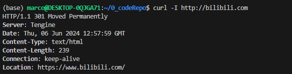

## 从输入URL到页面展示这中间发生了什么

### 1. concepts

从图中可以看出，整个过程需要各个进程之间的配合，所以在开始正式流程之前，我们还是先来快速回顾下浏览器进程、渲染进程和网络进程的主要职责。

- 浏览器进程：
  主要负责用户交互、子进程管理和文件储存等功能。

- 网络进程：
  是面向渲染进程和浏览器进程等提供网络下载功能。

- 渲染进程：
  - 主要职责是把从网络下载的HTML、JavaScript、CSS、图片等资源解析为可以显示和交互的页面。
  - 因为渲染进程所有的内容都是通过网络获取的，会存在一些恶意代码利用浏览器漏洞对系统进行攻击，所以运行在渲染进程里面的代码是不被信任的。
  - 这也是为什么 Chrome 会让渲染进程运行在安全沙箱里，就是为了保证系统的安全。

回顾了浏览器的进程架构后，我们再结合上图来看下这个完整的流程，可以看出，整个流程包含了许多步骤，我把其中几个核心的节点用蓝色背景标记出来了。这个过程可以大致描述为如下：

1. 用户输入：

    用户从浏览器进程里输入请求信息。单纯是输入侧。

2. URL请求：

    网络进程发起URL请求。涉及到数据报文的发送和接受

3. 准备渲染：

    服务器响应URL请求之后，浏览器进程就又要开始准备渲染进程了。

4. 提交文档：

    渲染进程准备好之后，需要先向渲染进程提交页面数据，我们称之为提交文档阶段。


5. 渲染阶段：

    渲染进程接收完文档信息之后，便开始解析页面和加载子资源，完成页面的渲染。

这其中，用户发出URL请求到页面开始解析进入渲染的这个过程，就叫做导航。下面我们来详细分析下这些步骤，同时也就解答了开头所说的那道经典的面试题。

### 2. 用户输入

当用户在地址栏中输入一个查询关键字时，地址栏会判断输入的关键字是搜索内容，还是请求的URL。

- 如果是搜索内容，地址栏会使用浏览器默认的搜索引擎，来合成新的带搜索关键字的URL。

- 如果判断输入内容符合URL规则，比如输入的是 `www.baidu.com`，那么地址栏会根据规则，把这段内容加上协议，合成为完整的URL，如 `https://www.baidu.com`。

因为需要等待提交文档阶段，页面内容才会被替换。

### 3. URL请求过程

这时，浏览器进程会通过进程间通信（IPC）把URL请求发送至网络进程，网络进程接收到URL请求后，会在这里发起真正的URL请求流程。具体流程如下：

1. 网络进程会查找本地缓存是否缓存了该资源。
   * 如果有缓存资源，那么直接返回资源给浏览器进程；
   * 如果在缓存中没有查找到资源，那么直接进入网络请求流程。这请求前的第一步是要进行DNS解析，以获取请求域名的服务器IP地址。
   * 如果请求协议是HTTPS，那么还需要建立 TLS（安全传输层协议） 连接。

2. 接下来就是利用IP地址和服务器建立TCP连接。
   * 连接建立之后，浏览器端会构建请求行、请求头等信息，并把和该域名相关的Cookie等数据附加到请求头中，然后向服务器发送构建的请求信息。

3. 处理响应数据
    * 服务器接收到请求信息后，会根据请求信息生成响应数据（包括响应行、响应头和响应体等信息），并发给网络进程。
    * 等网络进程接收了响应行和响应头之后，就开始解析响应头的内容了。（为了方便讲述，下面我将服务器返回的响应头和响应行统称为响应头）

#### 3.1 重定向

在接收到服务器返回的响应头后，网络进程开始解析响应头. 如果发现返回的状态码是301或者302，那么说明服务器需要浏览器重定向到其他URL。这时网络进程会从响应头的Location字段里面读取重定向的地址，然后再发起新的HTTP或者HTTPS请求，一切又重头开始了。

比如，我们在终端里输入以下命令：

```shell
curl -I http://www.bilibili.com
```

`curl -I + URL` 的命令是接收服务器返回的响应头的信息。执行命令后，我们看到服务器返回的响应头信息如下：



从图中可以看出，服务器会通过重定向的方式把所以HTTP请求转换为HTTPS请求。也就是说你使用HTTP向服务器请求时，服务器会返回一个包含301或者302状态码响应头，并把响应头的Location字段填上HTTPS的地址，这就是告诉了浏览器要重新导航到新的地址上。


#### 3.2 响应数据类型处理

`Content-Type`是HTTP响应头中的一个字段，它告诉浏览器服务器返回的响应体数据是什么类型。浏览器会根据`Content-Type`的值来决定如何处理和显示响应体的内容。

`Content-Type`的值通常是一个MIME类型，它由两部分组成：类型和子类型，两者之间用斜线（/）分隔。例如，`text/html`表示类型是文本，子类型是HTML。

以下是一些常见的`Content-Type`值：

- `text/html`：HTML文档，浏览器会解析并显示HTML页面。
- `application/json`：JSON数据，浏览器会解析JSON数据并提供给JavaScript使用。
- `image/jpeg`：JPEG图片，浏览器会显示图片。
- `application/javascript`：JavaScript代码，浏览器会执行JavaScript代码。

有时，`Content-Type`还会包含一个`charset`参数，用来指定字符编码。例如，`text/html; charset=UTF-8`表示HTML文档使用UTF-8编码。

请注意，`Content-Type`是服务器设置的，浏览器只是根据`Content-Type`的值来处理数据。如果服务器设置了错误的`Content-Type`，可能会导致浏览器无法正确显示数据。


### 4. 准备渲染进程

总结来说，打开一个新页面采用的渲染进程策略是：

- 通常情况下，打开新的页面都会使用单独的渲染进程。

- 如果A页面打开B页面，且A和B都属于同一站点的话，那么B页面复用A页面的渲染进程；如果是其他情况，浏览器进程则会为B创建一个新的渲染进程。

渲染进程准备好之后，还不能立即进入文档解析状态，因为此时的文档数据还在网络进程中，并没有提交给渲染进程，所以下一步就进入了提交文档阶段。

### 5. 提交文档

首先要明确一点，这里的“文档”是指URL请求的响应体数据。

- “提交文档”的消息是由浏览器进程发出的，渲染进程接收到“提交文档”的消息后，会和网络进程建立传输数据的“管道”。

- 等文档数据传输完成之后，渲染进程会返回“确认提交”的消息给浏览器进程。

- 浏览器进程在收到“确认提交”的消息后，会更新浏览器界面状态，包括了安全状态、地址栏的URL、前进后退的历史状态，并更新Web界面。

这也就解释了为什么在浏览器的地址栏里面输入了一个地址后，之前的页面没有立马消失，而是要加载一会儿才会更新页面。

到这里，一个完整的导航流程就“走”完了，这之后就要进入渲染阶段了。

### 6. 渲染阶段

一旦文档被提交，渲染进程便开始页面解析和子资源加载了，一旦页面生成完成，渲染进程会发送一个消息给浏览器进程，浏览器接收到消息后，会停止标签图标上的加载动画。

至此，一个完整的页面就生成了。那文章开头的“从输入URL到页面展示，这中间发生了什么？”这个过程极其“串联”的问题也就解决了。

