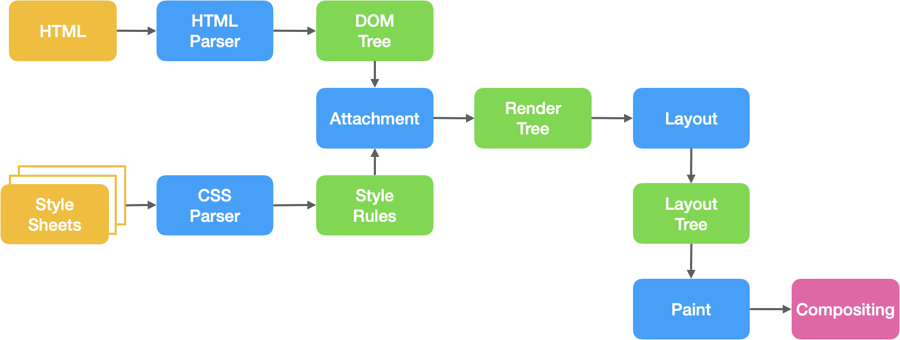
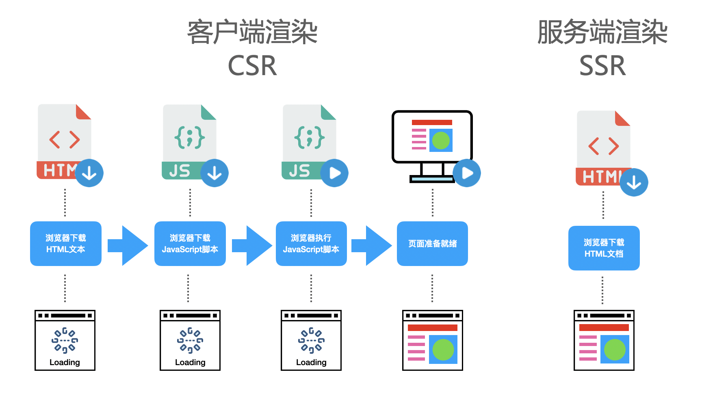
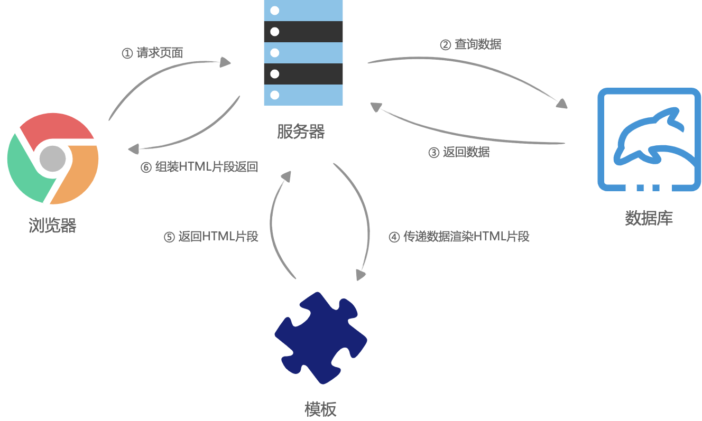
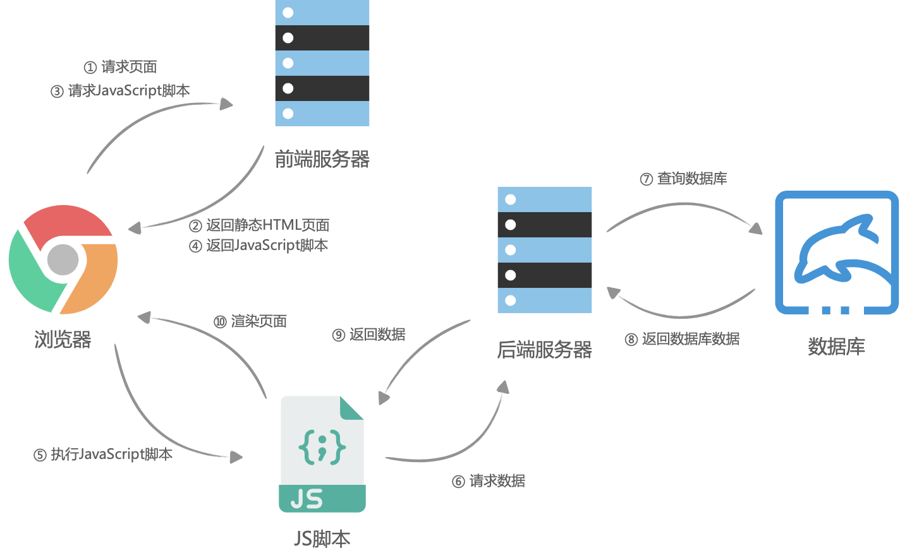
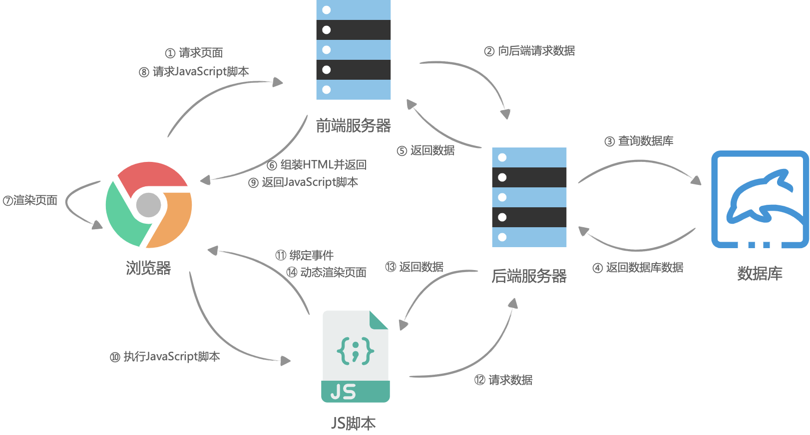

## 页面渲染

### 1. 基本概念
什么是服务端渲染，与客户端渲染的区别是什么？
为什么需要服务端渲染，服务端渲染的利弊是什么？
如何对VUE项目进行同构？

### 2. 渲染
#### 2.1 页面的渲染流程

页面的渲染流程通常包括以下步骤：

1. **请求页面**：
    用户在浏览器中输入URL，或者点击链接，浏览器向服务器发送请求。

2. **服务器处理**：
    服务器接收到请求后，根据请求的URL，找到对应的HTML文件，或者动态生成HTML。

3. **发送响应**：
    服务器将HTML文件作为响应发送回浏览器。

4. **解析HTML**：
    浏览器接收到HTML文件后，开始解析HTML，如果遇到内联样式或者样式脚本，则下载并构建样式规则（stytle rules），若遇到JavaScript脚本，则会下载执行脚本。将其转换为DOM（文档对象模型）。
    DOM树和样式规则构建完成之后，渲染进程将两者合并成渲染树（render tree）

5. **加载资源**：
    在解析HTML的过程中，浏览器会发现一些资源链接，如CSS文件和JavaScript文件，浏览器会发送请求加载这些资源。

6. **渲染页面**：
    浏览器根据DOM和CSS规则，计算出每个元素的位置和样式，然后在屏幕上绘制出页面。这个过程被称为渲染。
    * 渲染进程开始对渲染树进行布局，生成布局树（layout tree）
    * 渲染进程对布局树进行绘制，生成绘制记录
    * 渲染进程的对布局树进行分层，分别栅格化每一层，并得到合成帧
    * 渲染进程将合成帧信息发送给GPU进程显示到页面中

7. **执行JavaScript**：在页面渲染的同时，浏览器也会执行加载的JavaScript代码。JavaScript代码可能会修改DOM和CSS，这可能会导致页面重新渲染。

以上就是一个基本的页面渲染流程。实际的流程可能会更复杂，因为还需要考虑到缓存、网络延迟、错误处理等因素。

可以看到，页面的渲染其实就是浏览器将HTML文本转化为页面帧的过程。而如今我们大部分WEB应用都是使用 JavaScript 框架（Vue、React、Angular）进行页面渲染的，也就是说，在执行 JavaScript 脚本的时候，HTML页面已经开始解析并且构建DOM树了，JavaScript 脚本只是动态的改变 DOM 树的结构，使得页面成为希望成为的样子，这种渲染方式叫动态渲染，也可以叫客户端渲染（client side rende）。

#### 2.2 客户端渲染-CSR
浏览器下载一个最小的 HTML 文件，然后使用 JavaScript 动态生成 HTML 和操作 DOM。这种方式的优点是用户交互快，服务器压力小。但是，首屏加载速度慢，不利于 SEO。

#### 2.3 服务端渲染-SSR
那么什么是服务端渲染（server side render）？顾名思义，服务端渲染就是在浏览器请求页面URL的时候，服务端将我们需要的HTML文本组装好，并返回给浏览器，这个HTML文本被浏览器解析之后，不需要经过 JavaScript 脚本的执行，即可直接构建出希望的 DOM 树并展示到页面中。这个服务端组装HTML的过程，叫做服务端渲染。

在服务器端，所有需要的 HTML 文本都被组装好，并返回给浏览器。浏览器解析这个 HTML 文本后，不需要执行 JavaScript 脚本，就可以直接构建出 DOM 树并展示到页面中。这种方式的优点是首屏加载速度快，对 SEO 友好。但是，服务器压力大，用户交互需要请求服务器。

#### 2.4 服务端渲染的由来
* Web1.0
    在没有AJAX的时候，也就是web1.0时代，几乎所有应用都是服务端渲染（此时服务器渲染非现在的服务器渲染），那个时候的页面渲染大概是这样的，浏览器请求页面URL，然后服务器接收到请求之后，到数据库查询数据，将数据丢到后端的组件模板（php、asp、jsp等）中，并渲染成HTML片段，接着服务器在组装这些HTML片段，组成一个完整的HTML，最后返回给浏览器，这个时候，浏览器已经拿到了一个完整的被服务器动态组装出来的HTML文本，然后将HTML渲染到页面中，过程没有任何JavaScript代码的参与。

    
    
* 客户端渲染
    在WEB1.0时代，服务端渲染看起来是一个当时的最好的渲染方式，但是随着业务的日益复杂和后续AJAX的出现，也渐渐开始暴露出了WEB1.0服务器渲染的缺点。

    * 每次更新页面的一小的模块，都需要重新请求一次页面，重新查一次数据库，重新组装一次HTML
    * 前端JavaScript代码和后端（jsp、php、jsp）代码混杂在一起，使得日益复杂的WEB应用难以维护
    
    而且那个时候，根本就没有前端工程师这一职位，前端js的活一般都由后端同学 jQuery 一把梭。但是随着前端页面渐渐地复杂了之后，后端开始发现js好麻烦，虽然很简单，但是坑太多了，于是让公司招聘了一些专门写js的人，也就是前端，这个时候，前后端的鄙视链就出现了，后端鄙视前端，因为后端觉得js太简单，无非就是写写页面的特效（JS），切切图（CSS），根本算不上是真正的程序员。

    随之 nodejs 的出现，前端看到了翻身的契机，为了摆脱后端的指指点点，前端开启了一场前后端分离的运动，希望可以脱离后端独立发展。前后端分离，表面上看上去是代码分离，实际上是为了前后端人员分离，也就是前后端分家，前端不再归属于后端团队。

    前后端分离之后，网页开始被当成了独立的应用程序（SPA，Single Page Application），前端团队接管了所有页面渲染的事，后端团队只负责提供所有数据查询与处理的API，大体流程是这样的：首先浏览器请求URL，前端服务器直接返回一个空的静态HTML文件（不需要任何查数据库和模板组装），这个HTML文件中加载了很多渲染页面需要的 JavaScript 脚本和 CSS 样式表，浏览器拿到 HTML 文件后开始加载脚本和样式表，并且执行脚本，这个时候脚本请求后端服务提供的API，获取数据，获取完成后将数据通过JavaScript脚本动态的将数据渲染到页面中，完成页面显示。

    

    这一个前后端分离的渲染模式，也就是客户端渲染（CSR）。

* 服务端渲染
    随着单页应用（SPA）的发展，程序员们渐渐发现 SEO（Search Engine Optimazition，即搜索引擎优化）出了问题，而且随着应用的复杂化，JavaScript 脚本也不断的臃肿起来，使得首屏渲染相比于 Web1.0时候的服务端渲染，也慢了不少。

    自己选的路，跪着也要走下去。于是前端团队选择了使用 nodejs 在服务器进行页面的渲染，进而再次出现了服务端渲染。大体流程与客户端渲染有些相似，首先是浏览器请求URL，前端服务器接收到URL请求之后，根据不同的URL，前端服务器向后端服务器请求数据，请求完成后，前端服务器会组装一个携带了具体数据的HTML文本，并且返回给浏览器，浏览器得到HTML之后开始渲染页面，同时，浏览器加载并执行 JavaScript 脚本，给页面上的元素绑定事件，让页面变得可交互，当用户与浏览器页面进行交互，如跳转到下一个页面时，浏览器会执行 JavaScript 脚本，向后端服务器请求数据，获取完数据之后再次执行 JavaScript 代码动态渲染页面。

    

#### 2.5 服务端渲染的利弊
相比于客户端渲染，服务端渲染有什么优势？

* 利于SEO
    有利于SEO，其实就是有利于爬虫来爬你的页面，然后在别人使用搜索引擎搜索相关的内容时，你的网页排行能靠得更前，这样你的流量就有越高。那为什么服务端渲染更利于爬虫爬你的页面呢？其实，爬虫也分低级爬虫和高级爬虫。

    * 低级爬虫：只请求URL，URL返回的HTML是什么内容就爬什么内容。
    * 高级爬虫：请求URL，加载并执行JavaScript脚本渲染页面，爬JavaScript渲染后的内容。
     
    也就是说，低级爬虫对客户端渲染的页面来说，简直无能为力，因为返回的HTML是一个空壳，它需要执行 JavaScript 脚本之后才会渲染真正的页面。而目前像百度、谷歌、微软等公司，有一部分年代老旧的爬虫还属于低级爬虫，使用服务端渲染，对这些低级爬虫更加友好一些。

* 白屏时间更短
    相对于客户端渲染，服务端渲染在浏览器请求URL之后已经得到了一个带有数据的HTML文本，浏览器只需要解析HTML，直接构建DOM树就可以。而客户端渲染，需要先得到一个空的HTML页面，这个时候页面已经进入白屏，之后还需要经过加载并执行 JavaScript、请求后端服务器获取数据、JavaScript 渲染页面几个过程才可以看到最后的页面。特别是在复杂应用中，由于需要加载 JavaScript 脚本，越是复杂的应用，需要加载的 JavaScript 脚本就越多、越大，这会导致应用的首屏加载时间非常长，进而降低了体验感。
    

* 服务端渲染缺点
    并不是所有的WEB应用都必须使用SSR，这需要开发者自己来权衡，因为服务端渲染会带来以下问题：
    * 代码复杂度增加。为了实现服务端渲染，应用代码中需要兼容服务端和客户端两种运行情况，而一部分依赖的外部扩展库却只能在客户端运行，需要对其进行特殊处理，才能在服务器渲染应用程序中运行。
    * 需要更多的服务器负载均衡。由于服务器增加了渲染HTML的需求，使得原本只需要输出静态资源文件的nodejs服务，新增了数据获取的IO和渲染HTML的CPU占用，如果流量突然暴增，有可能导致服务器down机，因此需要使用响应的缓存策略和准备相应的服务器负载。
    * 涉及构建设置和部署的更多要求。与可以部署在任何静态文件服务器上的完全静态单页面应用程序 (SPA) 不同，服务器渲染应用程序，需要处于 Node.js server 运行环境。
    * 所以在使用服务端渲染SSR之前，需要开发者考虑投入产出比，比如大部分应用系统都不需要SEO，而且首屏时间并没有非常的慢，如果使用SSR反而小题大做了。

### quiz
#### 1. 为什么客户端渲染不利于SEO
客户端渲染（Client Side Rendering，CSR）不利于搜索引擎优化（Search Engine Optimization，SEO）的主要原因是许多搜索引擎的爬虫在抓取网页内容时，可能无法正确执行或理解 JavaScript 生成的内容。

在客户端渲染的模式下，服务器返回的是一个基本的 HTML 框架和一堆 JavaScript 代码，真正的内容是由 JavaScript 在浏览器端动态生成的。这意味着，如果搜索引擎的爬虫不能或不执行 JavaScript，它们只能看到基本的 HTML 框架，而无法看到真正的内容。

虽然现代的搜索引擎，如 Google，已经能够执行 JavaScript 并抓取 JavaScript 生成的内容，但是这个过程可能比直接抓取 HTML 内容更慢，更复杂，而且可能存在执行错误或者不完全执行的情况。此外，一些较小的搜索引擎或者特定的爬虫可能还无法执行 JavaScript。

因此，如果你的网站依赖于搜索引擎流量，或者你的目标用户使用的搜索引擎无法很好地处理 JavaScript，那么客户端渲染可能会对你的 SEO 产生负面影响。