## 渲染流水线

### 0. concepts

从服务器得到响应体之后，如果这是一个`content-type`为`text/html`的，那就需要将这些文本处理成我们能看到的页面。这个过程，叫做渲染。

渲染流水线，说白了就是如何将响应体得到的 HTML、CSS 和 JavaScript 变成页面。

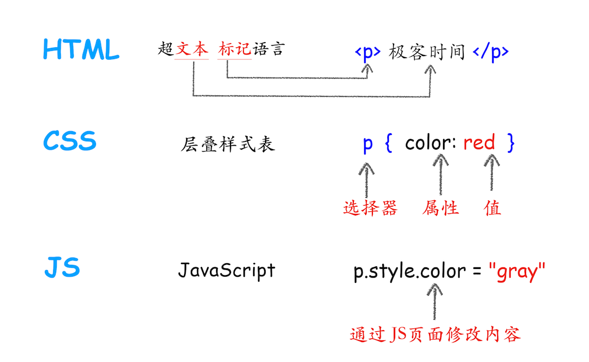

从上图可以看出，HTML 的内容是由标记和文本组成。标记也称为标签，每个标签都有它自己的语意，浏览器会根据标签的语意来正确展示 HTML 内容。比如上面的 `<p>` 标签是告诉浏览器在这里的内容需要创建一个新段落，中间的文本就是段落中需要显示的内容。

如果需要改变 HTML 的字体颜色、大小等信息，就需要用到 CSS。CSS 又称为层叠样式表，是由选择器和属性组成，比如图中的 p 选择器，它会把 HTML 里面 `<p>` 标签的内容选择出来，然后再把选择器的属性值应用到 `<p>` 标签内容上。选择器里面有个 `color` 属性，它的值是 red，这是告诉渲染引擎把 `<p>` 标签的内容显示为红色。

至于 JavaScript（简称 JS），使用它可以使网页的内容“动”起来，比如上图中，可以通过 JavaScript 来修改 CSS 样式值，从而达到修改文本颜色的目的。

由于渲染机制过于复杂，所以渲染模块在执行过程中会被划分为很多子阶段，输入的 HTML 经过这些子阶段，最后输出像素。我们把这样的一个处理流程叫做渲染流水线，其大致流程如下图所示：

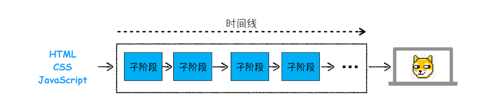

按照渲染的时间顺序，流水线可分为如下几个子阶段：

1. 构建 DOM 树
2. 样式计算
3. 布局阶段
4. 分层
5. 绘制
6. 分块
7. 光栅化
8. 合成。

对于每个阶段，需要关注其输入输出，以及处理过程。

### 1. 构建 DOM 树

#### 1.1 什么是 DOM 树？为什么要构建 DOM 树？

DOM 树（Document Object Model）是一个用于表示 HTML 或 XML 文档的树形结构。在 DOM 树中，每个节点都对应文档中的一个部分，例如元素、属性或文本。

DOM 树的主要用途是让 JavaScript 代码能够查询和修改文档的内容。

构建 DOM 树的主要目的是为了让浏览器能够理解 HTML 文档的结构，并且提供一种方式让 JavaScript 代码能够查询和修改文档的内容。通过 DOM 树，浏览器可以知道如何将 HTML 文档渲染成可视化的网页。同时，JavaScript 代码可以通过 DOM API 来操作 DOM 树，实现对网页的动态修改。

> DOM API 可以查看附录

#### 1.2 DOM 树怎么构建？

DOM 树的构建过程是由浏览器完成的，过程如下：

1. **解析 HTML 文档**：浏览器读取 HTML 文档，然后解析每一个标签、属性和文本，将它们转换为 DOM 节点。

2. **构建树形结构**：浏览器根据 HTML 标签的嵌套关系，将 DOM 节点组织成一棵树。例如，`<body>`标签内的所有标签都是`body`节点的子节点。

3. **处理脚本和样式**：如果 HTML 文档中包含 JavaScript 或 CSS，浏览器会执行 JavaScript 代码或应用 CSS 样式。这可能会改变 DOM 树的结构或节点的属性。

这个过程结束后，DOM 树就构建完成了，浏览器会根据 DOM 树来渲染网页，JavaScript 代码也可以开始操作 DOM 树了。

DOM 树的具体构建过程，你可以参考下图。

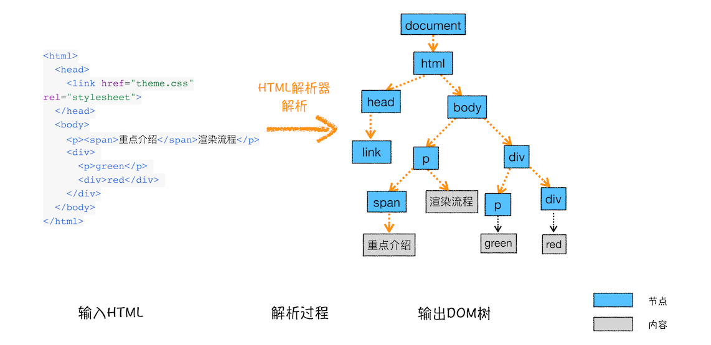

从图中可以看出，构建 DOM 树的输入内容是一个非常简单的 HTML 文件，然后经由 HTML 解析器解析，最终输出树状结构的 DOM。

为了更加直观地理解 DOM 树，你可以打开 Chrome 的“开发者工具”，选择“Console”标签来打开控制台，然后在控制台里面输入“document”后回车，这样你就能看到一个完整的 DOM 树结构，如下图所示：

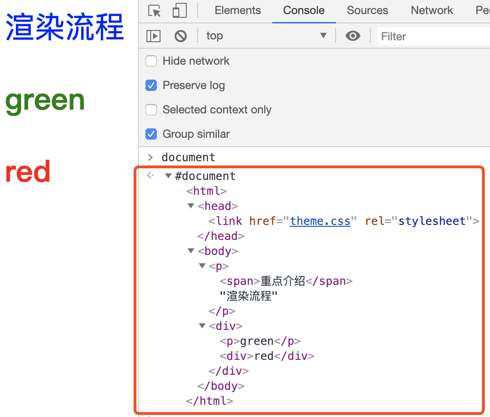

图中的 document 就是 DOM 结构，你可以看到，DOM 和 HTML 内容几乎是一样的，但是和 HTML 不同的是，DOM 是保存在内存中树状结构，可以通过 JavaScript 来查询或修改其内容。

但是 DOM 节点的样式我们依然不知道，要让 DOM 节点拥有正确的样式，这就需要样式计算了。

### 2. 样式计算

样式计算的目的是为了计算出 DOM 节点中每个元素的具体样式，这个阶段大体可分为三步来完成。

#### 2.1 把 CSS 转换为浏览器能够理解的结构

那 CSS 样式的来源主要有哪些呢？你可以先参考下图：

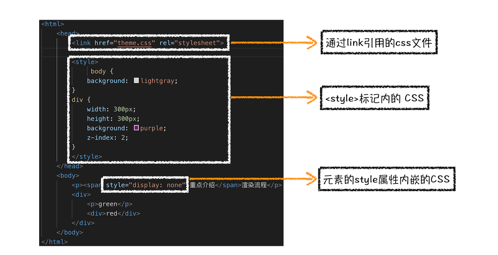

从图中可以看出，CSS 样式来源主要有三种：

- 通过 link 引用的外部 CSS 文件。

- `<style>` 标记内的 CSS。

- 元素的 style 属性内嵌的 CSS。

- 和 HTML 文件一样，浏览器也是无法直接理解这些纯文本的 CSS 样式，所以当渲染引擎接收到 CSS 文本时，会执行一个转换操作，将 CSS 文本装换为浏览器可以理解的结构——styleSheets。

- 为了加深理解，你可以在 Chrome 控制台中查看其结构，只需要再控制台中输入 `document.styleSheets`，然后就看到如下图所示的结构。

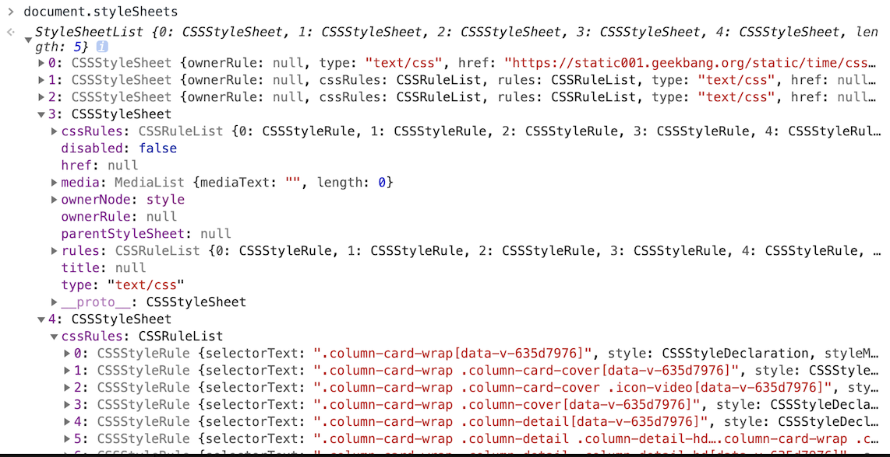

从图中可以看出，这个样式表包含了很多种样式，已经把那三种来源的样式都包含进去了。当然样式的具体结构不是我们今天讨论的重点，你只需要知道渲染引擎会把获取到的 CSS 文本全部转换为 styleSheets 结构中的数据，并且该结构同时具备了查询和修改功能，这会为后面的样式操作提供基础。

#### 2.2 转换样式表中的属性值，使其标准化

现在我们已经把现有的 CSS 文本转化为浏览器可以理解的结构了，那么接下来就要对其进行属性值的标准化操作。

要理解什么是属性值标准化，你可以看下面这样一段 CSS 文本。

```css
body {
  font-size: 2em;
}
p {
  color: blue;
}
span {
  display: none;
}
div {
  font-weight: bold;
}
div p {
  color: green;
}
div {
  color: red;
}
```

可以看到上面的 CSS 文本中有很多属性值，如 2em、blue、bold，这些类型数值不容易被渲染引擎理解，所以需要将所有值转换为渲染引擎容易理解的、标准化的计算值，这个过程就是属性值标准化。

那标准化后的属性值是什么样子的？

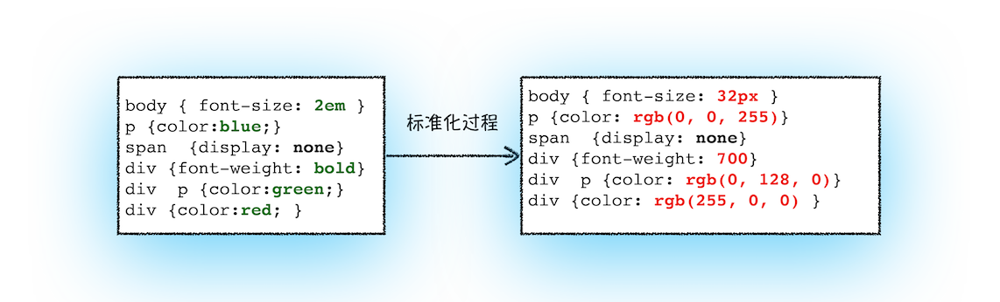

从图中可以看到，2em 被解析成了 32px，red 被解析成了 rgb(255, 0, 0)，bold 被解析成了 700...

#### 2.3 计算出 DOM 树中每个节点的具体样式

现在样式的属性已被标准化了，接下来就需要计算 DOM 树中每个节点的样式属性了，如何计算呢？

**这就涉及到 CSS 的继承规则和层叠规则了。**

首先是 CSS 继承。CSS 继承就是每个 DOM 节点都包含有父节点的样式。这么说可能有点抽象，我们可以结合具体例子，看下面这样一张样式表是如何应用到 DOM 节点上的。

```css
body {
  font-size: 20px;
}
p {
  color: blue;
}
span {
  display: none;
}
div {
  font-weight: bold;
  color: red;
}
div p {
  color: green;
}
```

这张样式表最终应用到 DOM 节点的效果如下图所示：

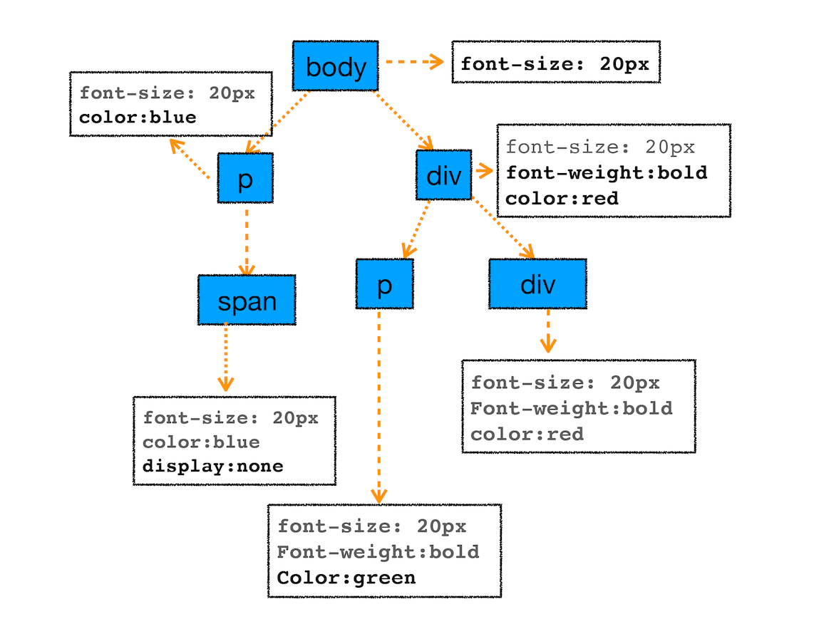

从图中可以看出，所有子节点都继承了父节点样式。比如 body 节点的 font-size 属性是 20，那 body 节点下面的所有节点的 font-size 都等于 20。

为了加深你对 CSS 继承的理解，你可以打开 Chrome 的“开发者工具”，选择第一个“element”标签，在选择“style”子标签，你会看到如下界面：

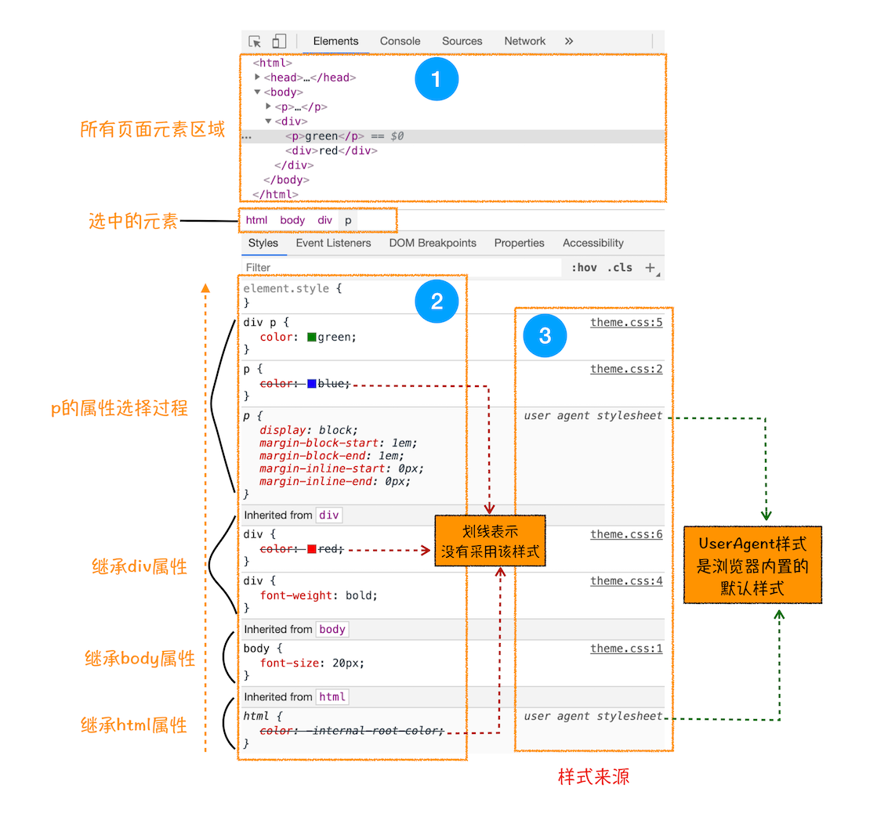

这个界面展示的信息很丰富，大致可描述为如下：

- 首先，可以选择要查看的样式（位于图中的区域 2 中），在图中的第 1 个区域中点击对应的元素，就可以在下面的区域查看该元素的样式了。比如这里我们选择的元素是 `<p>` 标签，位于 `html.body.div` 这个路径下面。

- 其次，可以从样式来源（位于图中的区域 3 中）中查看样式的具体来源信息，看看是来源于样式文件，还是来源于 UserAgent 样式表。这里需要特别提下 UserAgent 样式，它是浏览器提供的一组默认样式，如果你不提供任何样式，默认使用的就是 UserAgent 样式。

- 最后，可以通过区域 2 和区域 3 来查看样式继承的具体过程。

以上就是 CSS 继承的一些特性，样式计算过程中，会根据 DOM 节点的继承关系来合理计算节点样式。

样式计算过程中的第二个规则是样式层叠。**层叠是 CSS 的一个基本特征，它是一个定义了如何合并来自多个源的属性值的算法**。它在 CSS 处于核心地位，CSS 的全称“层叠样式表”正是强调了这一点。关于层叠的具体规则这里就不做过多介绍了，网上资料也非常多，你可以自行搜索学习。

总之，样式计算阶段的目的是为了计算出 DOM 节点中每个元素的具体样式，在计算过程中需要遵守 CSS 的继承和层叠两个规则。这个阶段最终输出的内容是每个 DOM 节点的样式，并被保存在 ComputedStyle 的结构内。

如果你想了解每个 DOM 元素最终的计算样式，可以打开 Chrome 的“开发者工具”，选择第一个“element”标签，然后再选择“Computed”子标签，如下图所示：


上图红色方框中显示了 html.body.div.p 标签的 ComputedStyle 的值。你想要查看哪个元素，点击左边对应的标签就可以了。

### 3. 布局阶段

现在，我们有 DOM 树和 DOM 树中元素的样式，但这还不足以显示页面，因为我们还不知道 DOM 元素的几何位置信息。那么接下来就需要计算出 DOM 树中可见元素的几何信息，我们把这个计算过程叫做布局。

Chrome 在布局阶段需要完成两个任务：创建布局树和布局计算。

#### 3.1 创建布局树

你可能注意到了 DOM 树还含有很多不可见的元素，比如 head 标签，还有使用了 `display: none` 属性的元素。所以在显示之前，我们还要额外地构建一棵只包含可见元素布局树。

我们结合下图来看看布局树的构造过程：

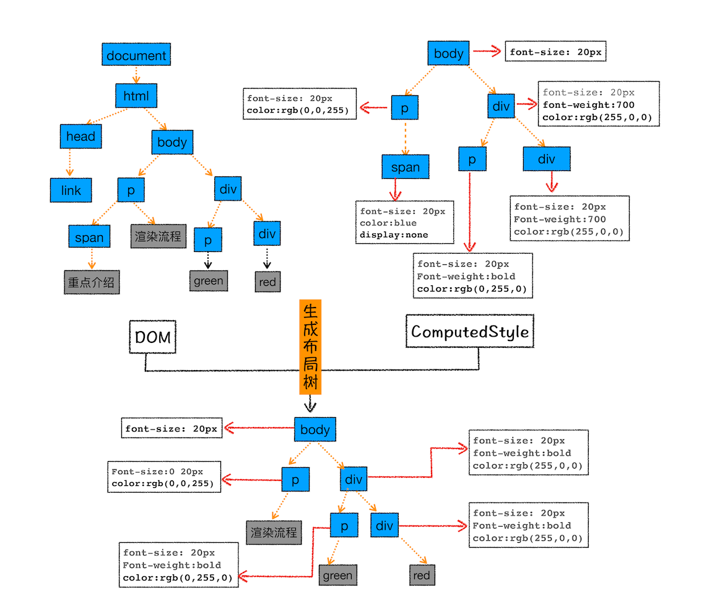

从上图可以看出，DOM 树中所有不可见的节点都没有包含到布局树中。

为了构建布局树，浏览器大体上完成了下面这些工作。

- 遍历 DOM 树中的所有可见节点，并把这些节点加到布局中。

- 而不可见的节点会被布局树忽略掉，如 `head` 标签下面的全部内容，再比如 `body.p.span` 这个元素，因为它的属性包含 `display: none`，所以这个元素也没有被包进布局树。

#### 3.2 布局计算

现在我们有了一棵完整的布局树。那么接下来，就要计算布局树节点的坐标位置了。布局的计算过程非常复杂，我们这里先跳过不讲，等到后面章节中我再做详细的介绍。

在执行布局操作的时候，会把布局运算的结果重新写回布局树中，所以布局树即是输入内容也是输出内容，这是布局阶段一个不合理的地方，因为在布局阶段并没有清晰地将输入内容和输出内容区分开来。针对这个问题，Chrome 团队正在重构布局代码，下一代布局系统叫 LayoutNG，试图更清晰地分离输入和输出，从而让新设计的布局算法更加简单。

### 4. 分层

现在我们有了布局树，而且每个元素的具体位置信息都计算出来了，那么接下来是不是就要开始着手绘制页面了？

答案依然是否定的。

因为页面中有很多复杂的效果，如一些复杂的 3D 变换、页面滚动，或者使用 z-index 做 z 轴排序等，为了更加方便地实现这些效果，渲染引擎还需要为特定的节点生成专用的图层，并生成一棵对应的图层树（LayerTree）。如果你熟悉 PS，相信你会很容易理解图层的概念，正是这些图层叠加在一起构成了最终的页面图像。

要想直观地理解什么是图层，你可以打开 Chrome 的“开发者工具”，选择“Layers”标签，就可以可视化页面的分层情况，如下图所示：


从上图可以看出，渲染引擎给页面分了很多图层，这些图层按照一定顺序叠加在一起，就形成了最终的页面，你可以参考下图：


现在你知道了浏览器的页面实际上被分成了很多图层，这些图层叠加后合成了最终的页面。下面我们再来看看这些图层和布局树节点之间的关系，如文中图所示：


通常情况下，并不是布局树的每个节点都包含一个图层，如果一个节点没有对应的图层，那么这个节点就从属于父节点的图层。如上图的 span 标签没有专属的图层，那么它们就从属于它们的父节点图层。但不管怎样，最终每一个节点都会直接或者间接地从属于一个层。

那么满足什么条件，渲染引擎才会为特定的节点创建新的层呢？通常满足下面两点中任意一点的元素就可以被提升为单独的一个图层。

#### 4.1 拥有层叠上下文属性的元素会被提升为单独的一层

页面是个二维平面，但是层叠上下文能够让 HTML 元素具有三维概念，这些 HTML 元素按照自身属性的优先级分布在垂直于这个二维平面的 z 轴上。你可以结合下图来直观感受下：


从图中可以看出，明确定位属性的元素、定义透明属性的元素、使用 CSS 滤镜的元素等，都拥有层叠上下文属性。

#### 4.2 需要剪裁（clip）的地方也会被创建为图层

不过首先你需要了解什么是剪裁，结合下面的 HTML 代码：

```html
<style>
  div {
    width: 200;
    height: 200;
    overflow: auto;
    background: gray;
  }
</style>
<body>
  <div>
    <p>
      所以元素有了层叠上下文的属性或者需要被剪裁，那么就会被提升成为单独一层，你可以参看下图：
    </p>
    <p>
      从上图我们可以看到，document层上有A和B层，而B层之上又有两个图层。这些图层组织在一起也是一颗树状结构。
    </p>
    <p>
      图层树是基于布局树来创建的，为了找出哪些元素需要在哪些层中，渲染引擎会遍历布局树来创建层树（Update
      LayerTree）。
    </p>
  </div>
</body>
```

在这里我们把 div 的大小限定为 200 * 200 像素，而 div 里面的文字内容比较多，文字所显示的区域肯定会超过 200 *200 的面积，这时候就产生了剪裁，渲染引擎会把裁剪文字内容的一部分用于显示在 div 区域，下图是运行时的执行结果。

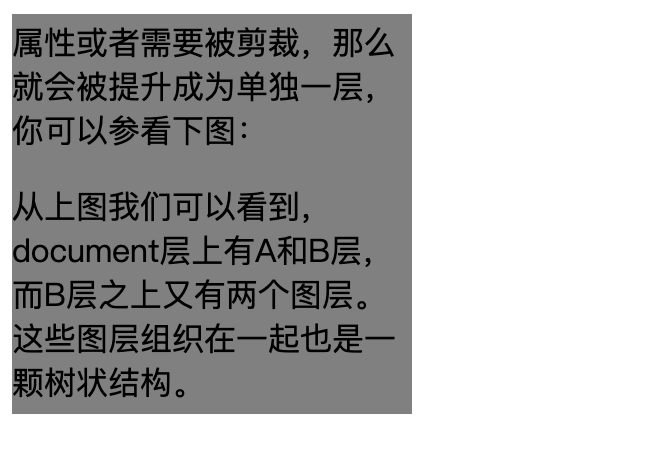

出现这种裁剪情况的时候，渲染引擎会为文字部分单独创建一个层，如果出现滚动条，滚动条也会被提升为单独的层。你可以参考下图：

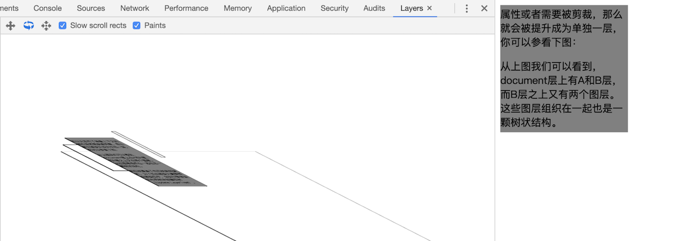

所以说，元素有了层叠上下文的属性或者需要被剪裁，满足这任意一点，就会被提升成为单独一层。

### 5. 图层绘制

在完成图层树的构建之后，渲染引擎会对图层树中的每个图层进行绘制，那么接下来我们看看渲染引擎是怎么实现图层绘制的？

试想一下，如果给你一张纸，让你先把纸的背景涂成蓝色，然后在中间位置画一个红色的圆，最后再在圆上画个绿色三角形。你会怎么操作呢？

**通常，你会把你的绘制操作分解为三步：**

- 制蓝色背景。
- 在中间绘制一个红色的圆。
- 再在圆上绘制绿色三角形。

渲染引擎实现图层的绘制与之类似，会把一个图层的绘制拆分成很多小的绘制指令，然后再把这些指令按照顺序组成一个待绘制列表，如下图所示：

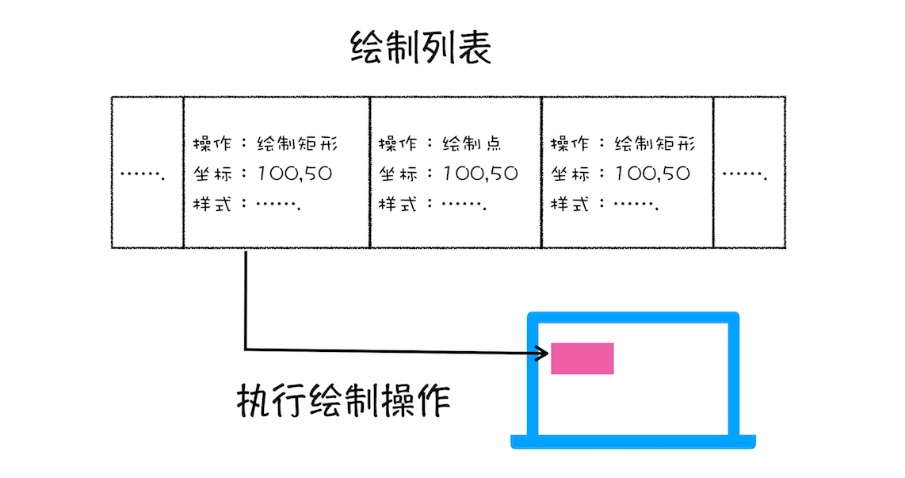

从图中可以看出，绘制列表中的指令其实非常简单，就是让其执行一个简单的绘制操作，比如绘制粉色矩形或者黑色的线等。而绘制一个元素通常需要好几条绘制指令，因为每个元素的背景、前景、边框都需要单独的指令去绘制。所以在图层绘制阶段，输出的内容就是这些待绘制列表。

你也可以打开“开发者工具”的“Layers”标签，选择“document”层，来实际体验下绘制列表，如下图所示：

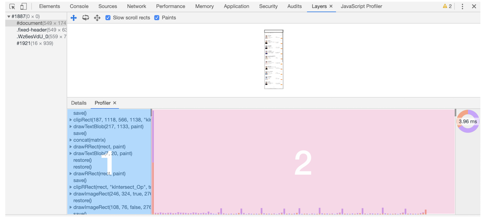

在该图中，区域 1 就是 document 的绘制列表，拖动区域 2 中的进度条可以重现列表的绘制过程。

### 6. 栅格化（raster）操作

绘制列表只是用来记录绘制顺序和绘制指令的列表，而实际上绘制操作是由渲染引擎中的合成线程来完成的。你可以结合下图来看下渲染主线程和合成线程之间的关系：

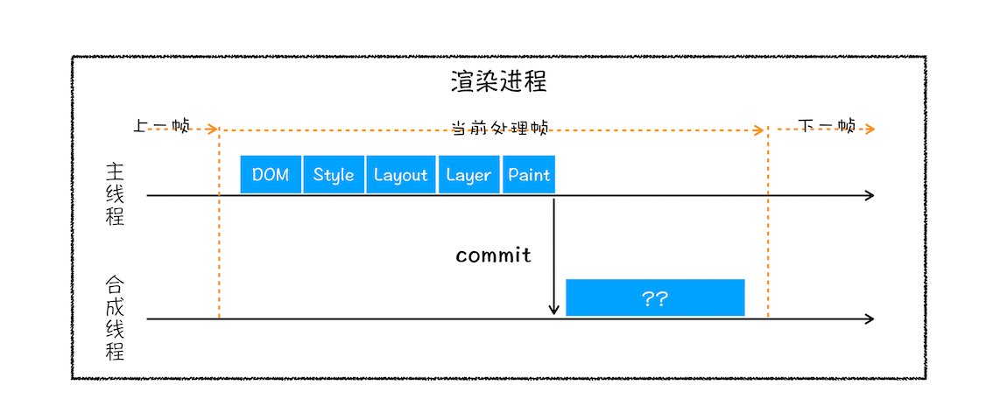

如上图所示，当图层的绘制列表准备好之后，主线程会把该绘制列表提交（commit）给合成线程，那么接下来合成线程是怎么工作的呢？

那我们得先来看看什么是视口，你可以参考下图：


通常一个页面可能很大，但是用户只能看到其中的一部分，我们把用户可以看到的这个部分叫做视口（viewport）。

在有些情况下，有些图层可以很大，比如有的页面你使用滚动条要滚动好久才能滚动到底部，但是通过视口，用户只能看到页面的很小一部分，所以在这种情况下，要绘制出所有图层内容的话，就会产生太大的开销，而且也没有必要。

基于这个原因，合成线程会将图层划分为图块（tile），这些图块的大小通常是 256 * 256 或者 512 *512，如下图所示：


然后合成线程会按照视口附近的图块来优先生成位图，实际生成位图的操作是由栅格化来执行的。所谓栅格化，是指将图块转换为位图。而图块是栅格化执行的最小单位。渲染进程维护了一个栅格化的线程池，所有的图块栅格化都是在线程池内执行的，运行方式如下图所示：

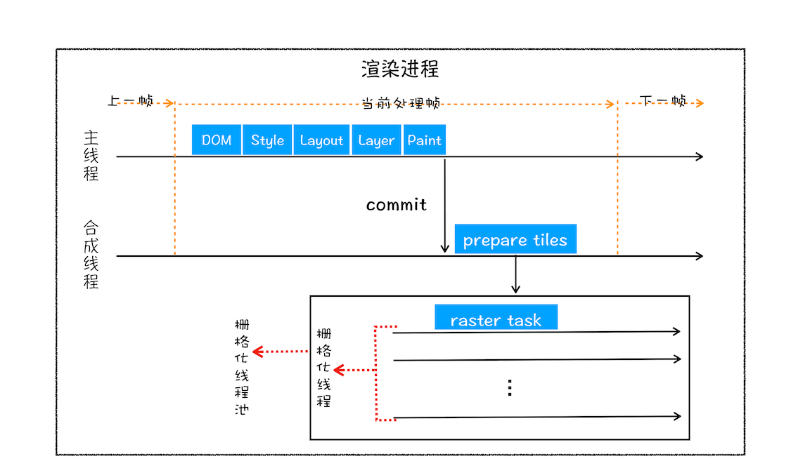

通常，栅格化过程都会使用 GPU 来加速生成，使用 GPU 生成位图的过程叫快速栅格化，或者 GPU 栅格化，生成的位图被保存在 GPU 内存中。

相信你还记得，GPU 操作是运行在 GPU 进程中，如果栅格化操作使用了 GPU，那么最终生成位图的操作是在 GPU 中完成的，这就涉及到了跨进程操作。具体形式你可以参考下图：


从图中可以看出，渲染进程把生成图块的指令发送给 GPU，然后在 GPU 中执行生成图块的位图，并保存在 GPU 的内存中。

### 7. 合成和显示

一旦所有图块都被光栅化，合成线程就会生成一个绘制图块的命令——"DrawQuad"，然后将该命令提交给浏览器进程。

浏览器进程里面有一个叫 `viz` 的组件，用来接收合成线程发过来的 DrawQuad 命令，然后根据 DrawQuad 命令，将其页面内容绘制到内存中，最后再将内存显示在屏幕上。

到这里，经过这一系列的阶段，编写好的 HTML、CSS、JavaScript 等文件，经过浏览器就会显示出漂亮的页面了。

### 8. 渲染流水线大总结

好了，我们现在已经分析完了整个渲染流程，从 HTML 到 DOM、样式计算、布局、图层、绘制、光栅化、合成和显示。下面我用一张图来总结下这整个渲染流程：

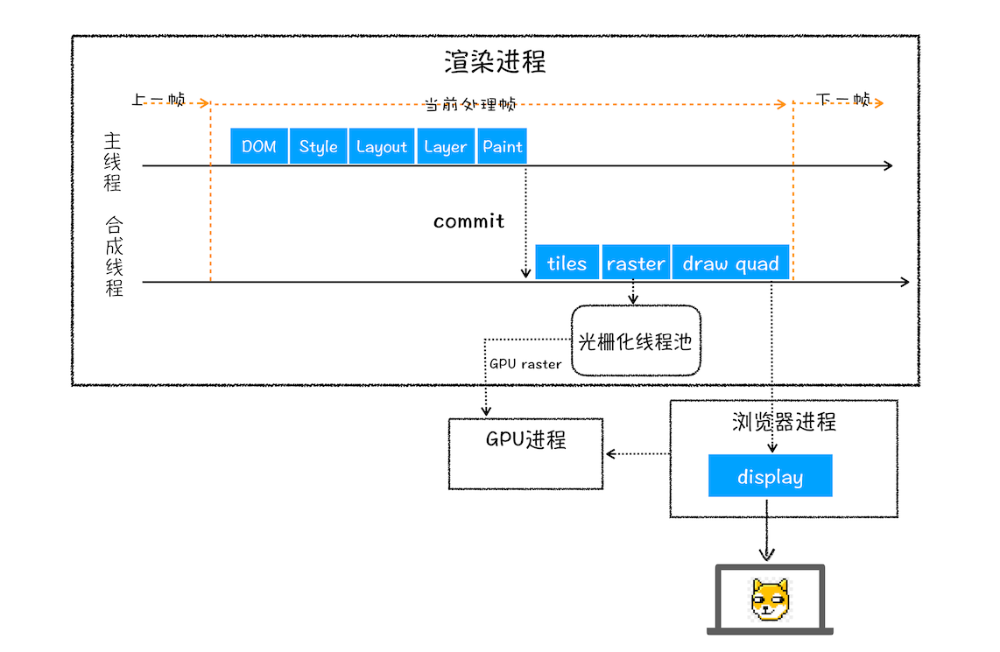

**结合上图，一个完整的渲染流程大致可总结为如下**
- 渲染进程将 HTML 内容转换为能够读懂的 DOM 树结构。
- 渲染引擎将 CSS 样式表转化为浏览器可以理解的 styleSheets，计算出 DOM 节点的样式。
- 创建布局树，并计算出 DOM 节点的样式。
- 对布局树进行分层，并生成分层树。
- 为每个图层生成绘制列表，并将其提交到合成线程。
- 合成线程将图层分成图块，并在光栅化线程池中将图块转换成位图。
- 合成线程发送绘制图块命令 DrawQuad 给浏览器进程。
- 浏览器进程根据 DrawQuad 消息生成页面，并显示到显示器上。

### 99. quiz

#### 1. 一些使用 JavaScript 和 DOM API 操作 DOM 的示例：

```javascript
// 获取元素
let element = document.getElementById("myElement");
// 修改元素文本
element.innerText = "Hello, world!";
// 修改元素属性
element.setAttribute("title", "This is my element");
// 创建新元素
let newElement = document.createElement("div");
newElement.innerText = "I am a new element";
// 添加新元素
element.appendChild(newElement);
// 删除元素
element.removeChild(newElement);
```

在 JavaScript 中，Document 是一个内置的对象类型，它代表一个 HTML 或 XML 文档。每个 Document 对象都代表一个单独的文档，例如一个网页。

### 相关概念

有了上面介绍渲染流水线的基础，我们再来看看三个和渲染流水线相关的概念——“重排”、“重绘”和“合成”。理解了这三个概念对于你后续 Web 的性能优化会有很大帮助。

### 1.更新了元素的几何属性（重排）


从上图可以看出，如果你通过 JavaScript 或者 CSS 修改元素的几何位置属性，例如改变元素的宽度、高度等，那么浏览器会触发重新布局，解析之后的一系列子阶段，这个过程就叫重排。无疑，重排需要更新完整的渲染流水线，所以开销也是最大的。

### 2.更新元素的绘制属性（重绘）

接下来，我们再来看看重绘，比如通过 JavaScript 更改某些元素的背景颜色，渲染流水线会怎样调整呢？你可以参考下图：


从图中可以看出，如果修改了元素的背景颜色，那么布局阶段将不会被执行，因为并没有引起几何位置的变换，所以就直接进入了绘制阶段，然后执行之后的一系列子阶段，这个过程就叫重绘。**相较于重排操作，重绘省去了布局和分层阶段，所以执行效率会比重排操作要高一些**。

### 3.直接合成阶段

那如果你更改一个既不要布局也不要绘制的属性，会发生什么变化呢？渲染引擎将跳过布局和绘制，只执行后续的合成操作，我们把这个过程叫做合成。具体流程参考下图：


在上图中，我们使用了 CSS 的 transform 来实现动画效果，这可以避开重排和重绘阶段，直接在非主线程上执行合成动画操作。这样的效率是最高的，因为是在非主线程上合成，并没有占用主线程的资源，另外也避开了布局和绘制两个子阶段，所以相对于重绘和重排，合成能大大提升绘制效率。

至于如何用这些概念去优化页面，我们会在后面相关章节做详细讲解的，这里你只需要先结合“渲染流水线”弄明白这三个概念及原理就行。
