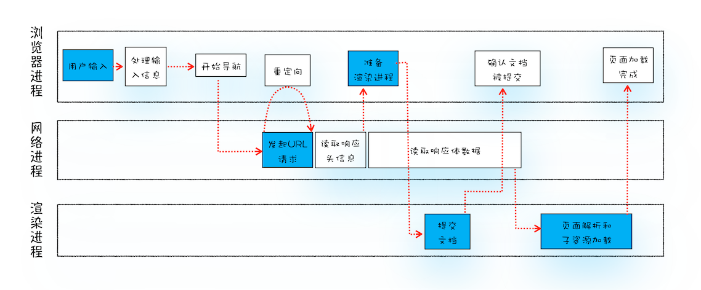
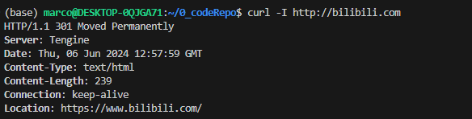

## 从输入URL到页面展示这中间发生了什么

### 1. concepts

从图中可以看出，整个过程需要各个进程之间的配合，所以在开始正式流程之前，我们还是先来快速回顾下浏览器进程、渲染进程和网络进程的主要职责。

- 浏览器进程：
  主要负责用户交互、子进程管理和文件储存等功能。

- 网络进程：
  是面向渲染进程和浏览器进程等提供网络下载功能。

- 渲染进程：
  - 主要职责是把从网络下载的HTML、JavaScript、CSS、图片等资源解析为可以显示和交互的页面。
  - 因为渲染进程所有的内容都是通过网络获取的，会存在一些恶意代码利用浏览器漏洞对系统进行攻击，所以运行在渲染进程里面的代码是不被信任的。
  - 这也是为什么 Chrome 会让渲染进程运行在安全沙箱里，就是为了保证系统的安全。

回顾了浏览器的进程架构后，我们再结合上图来看下这个完整的流程，可以看出，整个流程包含了许多步骤，我把其中几个核心的节点用蓝色背景标记出来了。这个过程可以大致描述为如下：

1. 用户从浏览器进程里输入请求信息。

2. 然后，网络进程发起URL请求。

3. 服务器响应URL请求之后，浏览器进程就又要开始准备渲染进程了。

4. 渲染进程准备好之后，需要先向渲染进程提交页面数据，我们称之为提交文档阶段。

5. 渲染进程接收完文档信息之后，便开始解析页面和加载子资源，完成页面的渲染。

这其中，用户发出URL请求到页面开始解析的这个过程，就叫做导航。下面我们来详细分析下这些步骤，同时也就解答了开头所说的那道经典的面试题。

### 2. 用户输入

当用户在地址栏中输入一个查询关键字时，地址栏会判断输入的关键字是搜索内容，还是请求的URL。

- 如果是搜索内容，地址栏会使用浏览器默认的搜索引擎，来合成新的带搜索关键字的URL。

- 如果判断输入内容符合URL规则，比如输入的是 `www.baidu.com`，那么地址栏会根据规则，把这段内容加上协议，合成为完整的URL，如 `https://www.baidu.com`。

因为需要等待提交文档阶段，页面内容才会被替换。

### 3. URL请求过程

这时，浏览器进程会通过进程间通信（IPC）把URL请求发送至网络进程，网络进程接收到URL请求后，会在这里发起真正的URL请求流程。具体流程如下：

1. 网络进程会查找本地缓存是否缓存了该资源。
  * 如果有缓存资源，那么直接返回资源给浏览器进程；
  * 如果在缓存中没有查找到资源，那么直接进入网络请求流程。这请求前的第一步是要进行DNS解析，以获取请求域名的服务器IP地址。
  * 如果请求协议是HTTPS，那么还需要建立 TLS（安全传输层协议） 连接。

2. 接下来就是利用IP地址和服务器建立TCP连接。
   * 连接建立之后，浏览器端会构建请求行、请求头等信息，并把和该域名相关的Cookie等数据附加到请求头中，然后向服务器发送构建的请求信息。

3. 服务器接收到请求信息后，会根据请求信息生成响应数据（包括响应行、响应头和响应体等信息），并发给网络进程。等网络进程接收了响应行和响应头之后，就开始解析响应
头的内容了。（为了方便讲述，下面我将服务器返回的响应头和响应行统称为响应头）

#### 3.1 重定向

在接收到服务器返回的响应头后，网络进程开始解析响应头. 如果发现返回的状态码是301或者302，那么说明服务器需要浏览器重定向到其他URL。这时网络进程会从响应头的Location字段里面读取重定向的地址，然后再发起新的HTTP或者HTTPS请求，一切又重头开始了。

比如，我们在终端里输入以下命令：

```shell
curl -I http://www.bilibili.com
```

`curl -I + URL` 的命令是接收服务器返回的响应头的信息。执行命令后，我们看到服务器返回的响应头信息如下：



从图中可以看出，服务器会通过重定向的方式把所以HTTP请求转换为HTTPS请求。也就是说你使用HTTP向服务器请求时，服务器会返回一个包含301或者302状态码响应头，并把响应头的Location字段填上HTTPS的地址，这就是告诉了浏览器要重新导航到新的地址上。


#### 3.2 响应数据类型处理

`Content-Type`是HTTP响应头中的一个字段，它告诉浏览器服务器返回的响应体数据是什么类型。浏览器会根据`Content-Type`的值来决定如何处理和显示响应体的内容。

`Content-Type`的值通常是一个MIME类型，它由两部分组成：类型和子类型，两者之间用斜线（/）分隔。例如，`text/html`表示类型是文本，子类型是HTML。

以下是一些常见的`Content-Type`值：

- `text/html`：HTML文档，浏览器会解析并显示HTML页面。
- `application/json`：JSON数据，浏览器会解析JSON数据并提供给JavaScript使用。
- `image/jpeg`：JPEG图片，浏览器会显示图片。
- `application/javascript`：JavaScript代码，浏览器会执行JavaScript代码。

有时，`Content-Type`还会包含一个`charset`参数，用来指定字符编码。例如，`text/html; charset=UTF-8`表示HTML文档使用UTF-8编码。

请注意，`Content-Type`是服务器设置的，浏览器只是根据`Content-Type`的值来处理数据。如果服务器设置了错误的`Content-Type`，可能会导致浏览器无法正确显示数据。


### 4. 准备渲染进程

总结来说，打开一个新页面采用的渲染进程策略是：

- 通常情况下，打开新的页面都会使用单独的渲染进程。

- 如果A页面打开B页面，且A和B都属于同一站点的话，那么B页面复用A页面的渲染进程；如果是其他情况，浏览器进程则会为B创建一个新的渲染进程。

渲染进程准备好之后，还不能立即进入文档解析状态，因为此时的文档数据还在网络进程中，并没有提交给渲染进程，所以下一步就进入了提交文档阶段。

### 5. 提交文档

首先要明确一点，这里的“文档”是指URL请求的响应体数据。

- “提交文档”的消息是由浏览器进程发出的，渲染进程接收到“提交文档”的消息后，会和网络进程建立传输数据的“管道”。

- 等文档数据传输完成之后，渲染进程会返回“确认提交”的消息给浏览器进程。

- 浏览器进程在收到“确认提交”的消息后，会更新浏览器界面状态，包括了安全状态、地址栏的URL、前进后退的历史状态，并更新Web界面。

这也就解释了为什么在浏览器的地址栏里面输入了一个地址后，之前的页面没有立马消失，而是要加载一会儿才会更新页面。

到这里，一个完整的导航流程就“走”完了，这之后就要进入渲染阶段了。

### 6. 渲染阶段

一旦文档被提交，渲染进程便开始页面解析和子资源加载了，关于这个阶段的完整过程，我会在下一篇文章中来专门介绍。这里你只需要先了解一旦页面生成完成，渲染进程会发送一个消息给浏览器进程，浏览器接收到消息后，会停止标签图标上的加载动画。

至此，一个完整的页面就生成了。那文章开头的“从输入URL到页面展示，这中间发生了什么？”这个过程极其“串联”的问题也就解决了。

## 总结：从输入URL到页面展示，这中间发生了什么

- 用户输入URL并回车。

- 浏览器进程检查URL，组装协议，构成完整的URL。

- 浏览器进程通过进程间通信（IPC）把URL请求发送给网络进程。

- 网络进程接收到URL请求后检查本地缓存是否缓存了该请求资源，如果有则将该资源返回给浏览器进程。

- `如果没有，网络进程向web服务器发起http请求（网络请求），请求流程如下：`

  - 进行DNS解析，获取服务器IP地址，端口（端口是通过DNS解析获取的吗？这里有个疑问）。

  - 利用IP地址和服务器建立TCP连接。

  - 构建请求头信息。

  - 发送请求头信息。

  - 服务器响应后，网络进程接收响应头和响应信息，并解析响应内容。

- `网络进程解析响应流程：`

  - 检查状态码，如果是301/302，则需要重定向，从Location字段中读取地址，重新进行第4步（301/302跳转也会读取本地缓存吗？这里有个疑问），如果是200，则继续处理请求。

  - 200响应处理：检查响应类型 Content-Type，如果是字节流类型，则将请求提交给下载管理器，该导航流程结束，不再进行后续的渲染，如果是html则通知浏览器进程准备渲染进程准备进行渲染。

- `准备渲染进程：`

  - 浏览器进程检查当前URL是否和之前打开的渲染进程根域名是否相同，如果相同，则复用原来的进程，如果不同，则开启新的渲染进程。

- `传输数据、更新状态：`

  - 渲染进程准备好后，浏览器向渲染进程发起“提交文档”的消息，渲染进程接收到消息和网络进程建立传输数据的“管道”。

  - 渲染进程接收完数据后，向浏览器发送“确认提交”消息。

  - 浏览器进程接收到确认消息后更新浏览器界面状态：安全、地址栏URL、前进后退的历史状态、更新web页面。

## 总结

好了，今天就到这里，下面我来简单总结下这篇文章的要点：

- 服务器可以根据响应头来控制浏览器的行为，如跳转、网络数据类型判断。

- Chrome默认采用每个标签对应一个渲染进程，但是如果两个页面属于同一站点，那这两个标签会使用同一渲染进程。

- 浏览器的导航过程涵盖了从用户发起请求到提交文档给渲染进程的中间所以阶段。

- 导航流程很重要，它是网络加载流程和渲染流程之间的一座桥梁，如果你理解了导航流程，那么你就能完整串起来整个页面显示流程，这对于你理解浏览器的工作原理起到了点睛的作用。
