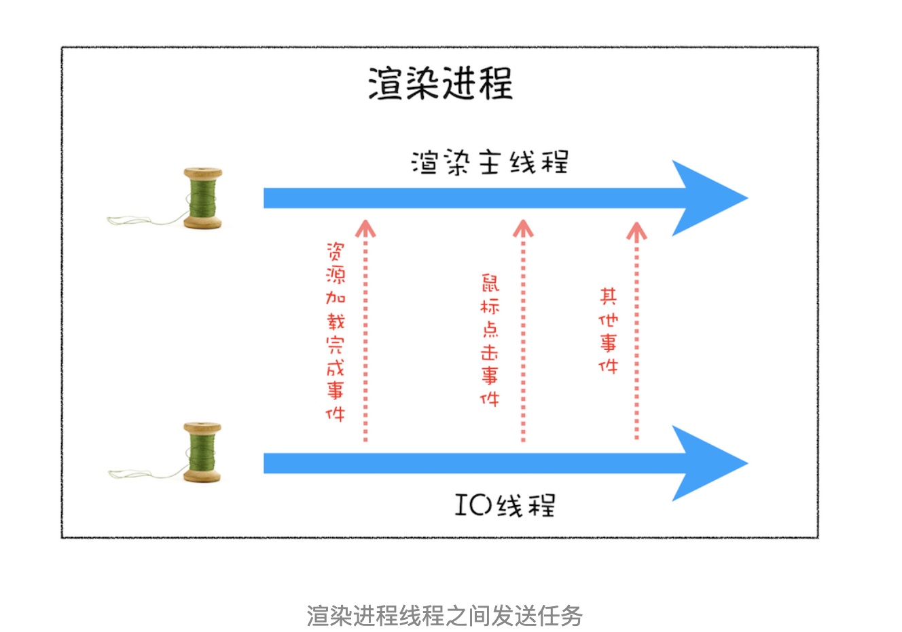
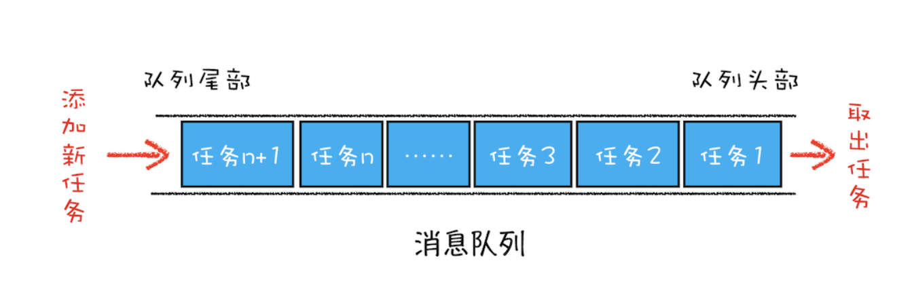
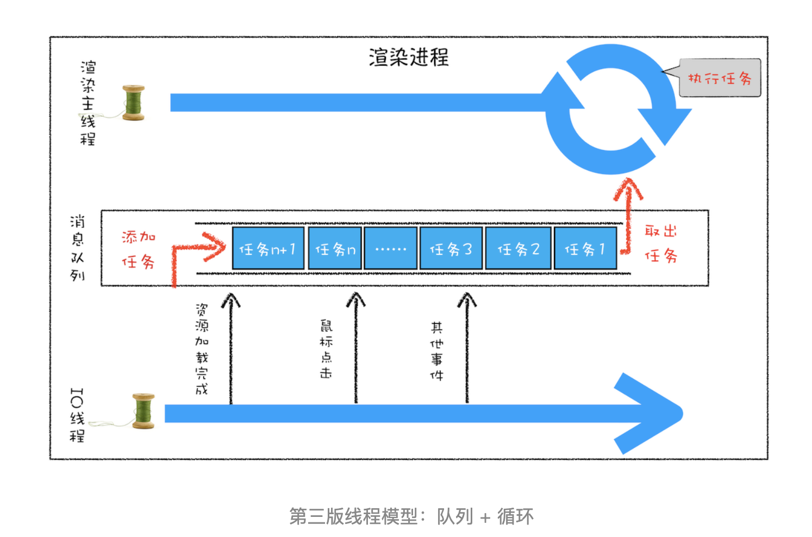
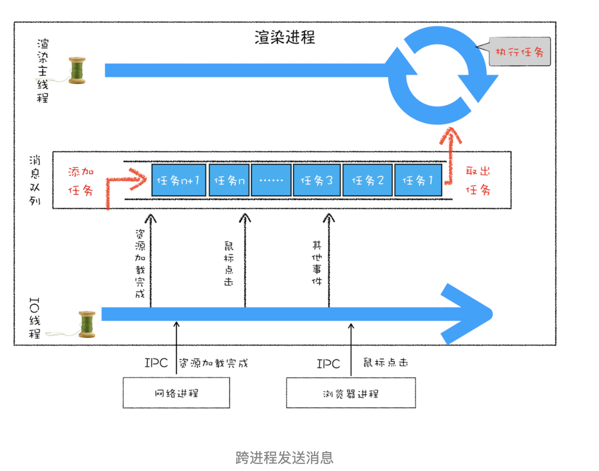
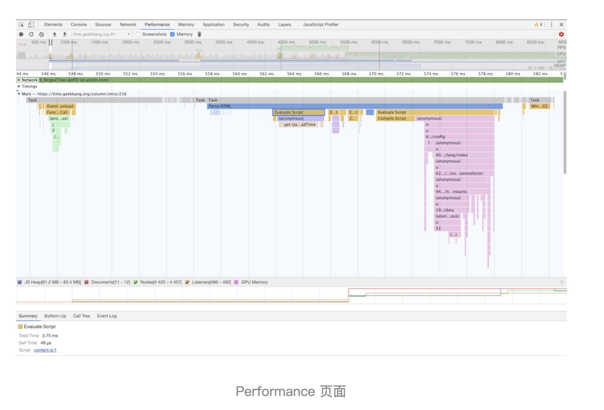

## 消息队列和事件循环：页面是怎么活起来的

前面我们讲到了每个渲染进程都有一个主线程，并且主线程非常繁忙，既要处理 DOM，又要计算样式，还要处理布局，同时还需要处理 JavaScript 任务以及各种输入事件。要让这么多不同类型的任务在主线程中有条不絮地执行，这就需要一个系统来统筹调度这些任务，这个统筹调度系统就是我们今天要讲的消息队列和事件循环系统。

### 1. 消息队列和事件循环系统处理调度多线程任务

从上图可以看出，渲染主线程会频繁接收到来自于 IO 线程的一些任务，接收到这些任务之后，渲染进程就需要着手处理，比如接收到资源加载完成的消息后，渲染进程就要着手进行 DOM 解析了；接收到鼠标点击的消息后，渲染主线程就要开始执行相应的 JavaScript 脚本来处理该点击事件。

那么如何设计好一个线程模型，能让其能够接收其他线程发送的消息呢？

#### 1.1 消息队列

从图中可以看出，消息队列是一种数据结构，可以存放要执行的任务。它符合队列“先进先出”的特点，也就是说要添加任务的话，添加到队列的尾部；要取出任务的话，从队列头部去取。

> 由于是多个线程操作同一个消息队列，所以在添加任务和取出任务时还会加上一个同步锁，这块内容你也要注意下。

#### 1.2 事件循环系统

在上面的代码中，我们添加了一个消息队列的对象，然后在主线程的 for 循环代码块中，从消息队列中读取一个任务，然后执行该任务，主线程就这样一直循环往下执行，因此只要消息队列中有任务，主线程就会去执行。

#### 1.3 总结
- 添加一个消息队列。

- IO 线程中产生的新任务添加进消息队列尾部。

- 渲染主线程会循环地从消息队列头部中读取任务，执行任务。

### 2. 如何处理其他进程发送过来的任务

通过使用消息队列，我们实现了线程之间的消息通信。在 Chrome 中，跨进程之间的任务也是频繁发生的，那么如何处理其他进程发送过来的任务？你可以参考下图：

从图中可以看出，渲染进程专门有一个 IO 线程用来接收其他进程传进来的消息，接收到消息之后，会将这些消息组装成任务发送给渲染主线程，后续的步骤就和前面讲解的“处理其他线程发送的任务”一样，这里就不再重复了。

### 3. 消息队列中的任务类型

现在你知道页面主线程是如何接收外部任务的了，那接下来我们再来看看消息队列中的任务类型有哪些。你可以参考下[Chromium 的官方源码](https://cs.chromium.org/chromium/src/third_party/blink/public/platform/task_type.h)，这里面包含了很多内部消息类型，如输入事件（鼠标滚动、点击、移动）、微任务、文件读写、WebSocket、JavaScript 定时器等等。

除此之外，消息队列中还包含了很多与页面相关的事件，如 JavaScript 执行、解析 DOM、样式计算、布局计算、CSS 动画等。

以上这些事件都是在主线程中执行的，所以在编写 Web 应用时，你还需要衡量这些事件所占用的时长，并想办法解决单个任务占用主线程过久的问题。

### 98. exercise
#### 1. 浏览器页面是如何运行的

你可以打开开发者工具，点击“Performance”标签，选择左上角的“start porfiling and load page”来记录整个页面加载过程中的事件执行情况，如下图所示：

从图中可以看出，我们点击展开了 Main 这个项目，其记录了主线程执行过程中的所有任务。图中灰色的就是一个个任务，每个任务下面还有子任务，其中的 Parse HTML 任务，是把 HTML 解析为 DOM 的任务。值得注意的是，在执行 Parse HTML 的时候，如果遇到 JavaScript 脚本，那么会暂停当前的 HTML 解析而去执行 JavaScript 脚本。

至于 Performance 工具，在后面的章节中我们还会详细介绍，在这里你只需要建立一个直观的印象就可以了。

### 99. quiz

#### 1. 如何处理高优先级的任务

简单来说，这是一个优先任务队列，又可以简单分为宏任务队列和微任务队列，在执行完宏队列任务后，是会优先执行微任务队列，微任务队列为空时，才会去执行下一个宏任务队列的任务。

具体展开的话则是，在浏览器的事件处理机制中，任务被分为宏任务（MacroTask）和微任务（MicroTask）。宏任务通常是一些耗时的、大规模的任务，如整个脚本的执行、setTimeout、setInterval 等。而微任务通常是一些需要快速执行的、小规模的任务，如 Promise、MutationObserver 等。

微任务是一种高优先级的任务，它们会在当前宏任务执行完毕后，下一个宏任务开始前立即执行。这样，我们就可以将 DOM 变化的处理任务作为微任务，添加到微任务队列中。这样，即使 DOM 变化非常频繁，也不会影响到当前宏任务的执行效率，因为微任务的执行不会阻塞宏任务。同时，由于微任务会在下一个宏任务开始前立即执行，所以也保证了监控的实时性。

#### 2. 如何解决单个任务执行时长过久的问题

在编程中，如果一个任务执行时间过长，可能会导致应用的响应速度变慢，影响用户体验。解决这个问题的常见方法有以下几种：

1. **异步处理**：将长时间运行的任务转为异步操作，这样主线程就不会被阻塞，可以继续处理其他任务。在 JavaScript 中，可以使用 Promise、async/await 等技术来实现异步操作。

2. **任务拆分**：将一个大任务拆分为多个小任务，每个小任务的执行时间较短，不会阻塞主线程太久。在 JavaScript 中，可以使用 setTimeout 或者 requestAnimationFrame 来将任务拆分到多个事件循环中。

3. **Web Worker**：在浏览器中，可以使用 Web Worker 来在后台线程执行长时间运行的任务，这样主线程就可以继续处理用户交互等任务，不会被阻塞。

这些方法可以单独使用，也可以结合使用，具体取决于任务的性质和应用的需求。