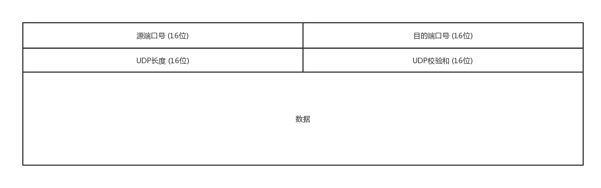
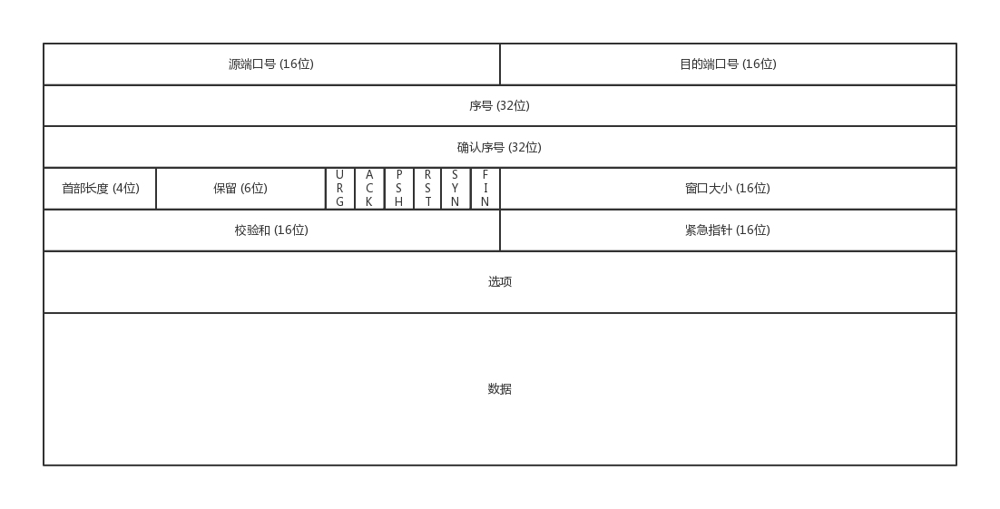
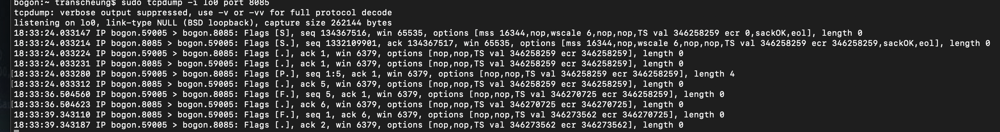
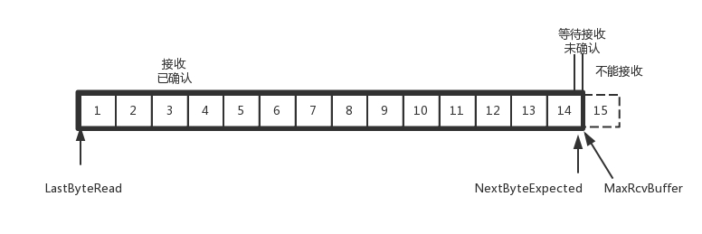

4_1 传输层重要协议_TCP
## 网络的4层结构？TCP协议属于哪一层？TCP四次挥手的过程？最后等待关闭连接要多长时间？超时重传是怎么做的？ACK序号是表示已收到的序号吗？TCP粘包？为什么TCP可靠而UDP不可靠
呼～，我只想说，想写一篇关于网络的博文真的不简单。浏览了很多的文章，其实大概都是差不多，但是有一个新的见解，mark一下，4G时代，无线网时代，原本以为丢包是拥塞造成的，但是现在却是信号太弱造成的，所以快速重传机制用得非常频繁，包收不到就重传。这点与详解中的拥塞控制不一样，拥塞会将速度降下来，降到最低<br>
如果养成一种习惯经常使用tcpdump抓包，将会对网络比较熟悉。有篇博文挺好的
* [抓包工具tcpdump](https://www.cnblogs.com/f-ck-need-u/p/7064286.html)
以后抓包要经常用。<br>
#### TCP详解超级牛❌
而且发现tcp详解得作者就是一直用tcpdump抓包，然后讲述协议的内容。真的耐心至极<br>
### TCP老司机与UDP愣头青
要讲TCP肯定要与UDP一起讲，这两个的区别，报文头以及传输方式，一个是流一个是包，确实很多不一样。那么我们先来看看简单的UDP，先看一下UDP头<br>
<br>
可以看到udp包仅有源端口(16)和目的端口号(16)，UDP长度(16)以及UDP校验码(16)，与可靠的TCP相比，实在是简单得一塌糊涂。<br>
我们来看一下TCP的头<br>
<br>
看到了吧，tcp头的格式，特别复杂，但是作为一名靠谱的老司机🚗，内心是需要复杂一点。<br>
#### 先来解释一下UDP
* UDP其实继承了IP包的属性 **不保证不丢失，不保证按顺序到达**<br>
* UDP继承了IP的特性， **基于数据报的，一个一个地发** 📦📦📦<br>
* UDP 我发，我发，我发发发。 **who cares!**<br>
* UDP是一个 **无状态的服务**。<br>
#### 对比TCp
* TCP提供可靠交付。**无差错、不丢失、不重复、并且按序到达**<br>
* TCP面向 **字节流**。像水一样。(like water)🌊🌊🌊
* TCP可以有 **拥塞控制的**。会意识到包丢弃了或者网络环境不好了，会根据情况调整自己的行为(慢启动)<br>
* TCP是一个 **有状态服务**，清楚记录发送的包，接收的包，累计确认。<br>
#### 我来解释一下
所以说UDP套一个ip头之后，就可以在数据链路层奔跑⛓️。跑到那里呢？跑到ip地址对应的位置，找到端口号，要是在中途遭人打劫，或杀害，也没人管。<br>
如果MAC层定义了本地局域网的传输行为，IP层定义了整个网络端到端的传输行为，传输层叫段，我们笼统地叫包📦。**包单独传输，自行选路，在不同的设备封装解封装，不保证到达**。所以UDP也是这样，愣头青。<br>
#### 8位协议定真身
那么包是发送了，收到的机器怎么知道是UDP呢？还是TCP？要知道，TCP和UDP可以发送数据到同一个端口，而应用程序监听这个端口号，这时候，IP头就起作用了，它会有一个8位的协议，存放，区分TCP还是UDP。<br>
所以基于如此简单的结构，在整个网络中，某些机器的操作系统未形成或者还没获取ip地址的时候，或者广播📢或者多播的时候就是用的UDP协议，例如 **DHCP就是基于UDP包的，VXLAN协议也是要用到组播的，也是基于UDP协议的**。<br>
同时因为时延低，不用重连，往往UDP会被用于流媒体，实时游戏，IOT物联网以及移动通信📱。而且最有意思的是Google推出了QUIC就是基于UDP协议的一种改进的通信协议，降低网络通信时延，提供更好的用户互动体验。而QUIC与HTTP一起在应用层上，后面我还会在应用层讲述<br>
讲完了UDP，我们知道它简单得一塌糊涂，很多人都可以对他进行二次开发，进而降低网络通信时延，提供更好的服务。<br>
#### 建立连接
那么接下来我们看一下这个TCP，提供了可靠的连接，那么到底什么才是建立连接呢？<br>
这里有个官方的解释: **所谓的建立连接，是为了在客户端和服务端维护连接🔗，而建立一定的数据结构来维护双方交互的状态，用这样的数据结构来保证所谓面向连接🔗的特性。**<br>
所以我们知道，建立连接其实就是双方用一定的数据结构来维护双方的交互状态。<br>
我们继续看一下这个TCP包头的格式<br>
<br>
端口号和UDP的一样，我们来看下面
##### TCP如何保证消息有序
* 序号：解决乱序问题。一件一件来😄 淡淡定，有钱剩
* 确认序号：发出去的包，要确认，没收到就重新发，直到对方确认。对方确认会发送ACK，发送端收到ack，就会确认这个包已经被收到了，不需要再发了。因而，tcp是个靠谱的队友，遇到ip这个猪队友，也就没辙了，只能靠自己不断地重试，确认。
* 状态位 SYN(发起连接🔗) ACK(回复确认) RST(重新连接🔗)以及FIN(结束🔚连接)。TCP是面向连接的，因而双方要维护连接的状态，这些带状态位的包的发送会引起双方的状态变更。<br>
* 窗口大小 对于流量控制有很大的作用，通信双方各声明一个窗口，标识自己当前的处理能力。不仅做流量控制还做拥塞控制，控制自己的发送速度<br>
聊完了他的包头，我们聊一下TCP最著名的考点，三次握手
## 为什么握手三次（而不是2次、4次）？为什么挥手四次（而不是三次）？
A: 你好，我是A。<br>
B: 你好A，我是B<br>
A: 你好 B<br>
这里出现了两个A和两个B，也就是说，两端A和B都收到了应答之应答。一收一发。所以为什么不是两次，四次？我们想说说为什么不是两次。<br>
1. 假设通路不可靠，A发起链接，，遇到了丢包或者超时，那么A就会重发，不停滴重发，要是B收到了，这时候，A也没个准信知道，若B想和A连接，就会发起应答包，但是这个应答包也不知道是不是能到达A，所以，两次，一去一回，根本没做到B也知道A已经收到包了。所以三次就不一样了，三次就是说，A收到了应答，而B也收到了应答。<br>
为什么不是四次呢？<br>
不止4次，4000次都可以，但是为什么这样做呢？没有意义啊，大家都有去有回了，为啥还要浪费资源📦在建立连接上。<br>
所以一旦A与B建立连接一般都会马上发数据。<br>
#### TCP如何保证消息有序
建立了连接就要发包📦，发包的过程，两端会商量好序号从哪里开始，而且都是随时间而变化，序号每4ms就会加1，为什么呢？因为有时候丢包了，绕路了或者A断了连接，这时候，又有了新的起始序号，丢弃的包也就丢弃了，就算序号重复，也要经历4个小时，丢弃的包早就死了(TTL)。<br>
#### 三次握手
<br>
* 一开始，客户端和服务端都处于CLOSED状态。
* 先是服务端主动监听某个端口，处于LISTEN状态。
* 然后客户端主动发起连接SYN，之后处于SYN-SENT状态。
* 服务端收到发起的连接，返回SYN，并且ACK客户端的SYN，之后处于SYN-RCVD状态。
* 客户端收到服务段发送的SYN和ACK后，发送ACK的ACK，之后处于ESTABLISHED的状态，因为它一发一收成功了。
* 服务段收到ACK的ACK，就会处于ESTABLISHED状态，因为它也一发一收成功了。
#### 四次挥手
<br>
Linux可设置tcp_fin_timeout来处理当进入FIN_WAIT_2的状态。<br>
**A收到B说知道了，就会进入TIME-WAIT，等待足够长的时间2MSL，Maximum Segment Lifetime报文最大生存时间，他是任何报在网络上生存的最长时间，超过这个时间，报文就会被丢弃一般是2分钟，实际应用是30秒，1分钟和两分钟等。但是我觉得并不会等那么长时间，一般B回答都会比较快。<br>
#### 状态机特别详细
<br>
阿拉伯数字是连接，大写是断开。<br>
我们来看看编程实现
服务端
```c
#include <unistd.h>
#include <sys/types.h>
#include <sys/socket.h>
#include <netdb.h>
#include <stdio.h>
#include <string.h>
#include <ctype.h>
#include <errno.h>
#include <malloc/malloc.h>
#include <netinet/in.h>
#include <arpa/inet.h>
#include <sys/ioctl.h>
#include <stdarg.h>
#include <fcntl.h>

int main(){
    int sockSrv = socket(AF_INET,SOCK_STREAM,0);
    struct sockaddr_in addrSrv;
    addrSrv.sin_family = AF_INET;// ip
    addrSrv.sin_addr.s_addr = INADDR_ANY;//协议
    addrSrv.sin_port = htons(8085);//端口
    bind(sockSrv,(const struct sockaddr*)&addrSrv,sizeof(struct sockaddr_in)); // 绑定监听的端口
    listen(sockSrv,5); // 服务端开始监听端口
    struct sockaddr_in addrClient;
    int len = sizeof(struct sockaddr_in);
    int sockCOnn = accept(sockSrv,(struct sockaddr*)&addrClient,(socklen_t*)&len);
    unsigned int total = 0;
    char szRecvBuf[128] = {0};
    int iRet = recv(sockCOnn,szRecvBuf,sizeof(szRecvBuf)-1,0);
    printf("iRet is %u\n",iRet);

    getchar();
    close(sockCOnn);
    close(sockSrv);
    return 0;
}
```
客户端
```c
#include <unistd.h>
#include <sys/types.h>
#include <sys/socket.h>
#include <netdb.h>
#include <stdio.h>
#include <string.h>
#include <ctype.h>
#include <errno.h>
#include <malloc/malloc.h>
#include <netinet/in.h>
#include <arpa/inet.h>
#include <sys/ioctl.h>
#include <stdarg.h>
#include <fcntl.h>

// 客户端会比较简单一点 只有connect
int main(){
    int sockClient = socket(AF_INET,SOCK_STREAM,0);
    struct sockaddr_in addrSrv;
    addrSrv.sin_addr.s_addr = inet_addr("10.7.1.104");
    addrSrv.sin_family = AF_INET;
    addrSrv.sin_port = htons(8085);
    connect(sockClient,(const struct sockaddr*)&addrSrv,sizeof(struct sockaddr_in));
    char szSendBuf[] = "fuck";
    int iRet = send(sockClient,szSendBuf,strlen(szSendBuf),0);
    printf("send size is %d,iRet is %d\n",strlen(szSendBuf),iRet);
    getchar();
    close(sockClient);
    return 0;
}
```
#### 实现抓包 tcpdump -i lo port 8085
<br>
讲完了连接🔗，挥手🙋告别，我们来看看重点，重传策略<br>
### 窗口滑动和拥塞控制 超时重传是怎么做到的？
#### 流量控制 窗口滑动rwnd
先看一下窗口滑动<br>
**流量控制，把握分寸。**<br>
发送端<br>
<br>
在TCP，接收端会给发送端报一个窗口大小，就叫Advertised window。这个窗口的大小就等于黑框的那部分。<br>
接收端<br>
<br>
NextByteExpected和LastByteRead的差其实是没有被应用层读取的部分占用掉的MaxRcvBuffer，就是总共的就是黑色框的大小，但是就是应用层没来读取。<br>
AdvertisedWindow = MaxRcvBuffer-((NextByteExpected-1)-LastByteRead)<br>
其中，第二部分，虚线有标好，就是收到的包不顺序，就要等着。<br>
即使8，9到了，67，没到，也不能ACK。所以只能缓存着。<br>
#### 超时重试
出现丢包，两种方法，超时重试，但是超时⌚️不能过短，一般都要大于往返时间RTT，否则会引起不必要的重传。但是不能过长，过长，访问就慢了。<br>
那怎么办？估计往返时间，需要TCP通过采样RTT时间，进行加权平均，算出一个值，而这个值是不段变化的，因为网络状态是不断地变化的。除了采样RTT，也要采样RTT的波动范围，计算一个估计的超时时间。由于重传时间不断变化，我们也称为自适应重传算法。<br>
要是超时超过两次，TCP的策略就是超时间隔加倍。每当遇到一次超时重传，下一次就会将超时时间将额设为先前值的两倍。<br>
#### 快速重传
还有一种 **快速重传机制**，也是现在这个时代用得最多的。就是发送三个冗余的ACK，例如丢了7，就发三个6，666。<br>
#### SACK
还有一种 **SACK**，就是可以在TCP头加一个SACK，例如可以发送ACK6，ACK8，ACK9，那发送方就知道7丢了。<br>
有了窗口大小，重传机制，那么我们可以继续看一下流量的控制了。<br>
在对于包的确认中，同时会携带一个窗口的大小。<br>
接到4的ACK，右移<br>
<br>
发送过猛，停止发送，窗口为0<br>
<br>
5确认，窗口才滑动，才可以有包可以发送<br>
<br>
极端情况，接收端不读缓存，那么窗口就会变小，同时发送端收到确认也会窗口缩小
<br>
发送端也是
<br>
随着应用层不读缓存，窗口就会越来越小，包确认越来越多<br>
<br>
发送端亦然<br>
<br>
到最后的情况，发送端会发送窗口探测包，看有没有机会调整，还想发送，但是接收端比较聪明，不会一直更新，而是达到一定大小，才会更新窗口。<br>
##### 拥塞控制 cwnd
cwnd就是怕把网络塞满了。<br>
拥塞窗口和滑动窗口共同控制发送的速度🛹<br>
`LastByteSent-LastByteAcked<=min{cwnd,rwnd}`两者取最小的值，作为发送的速度。<br>
通道的容量=带宽*往返延迟，像这样<br>
<br>
拥塞控制主要用来避免两个现象，**包丢失和超时重传**<br>
一旦出现包丢失或超时，就是速度太快了，放慢脚步。就像通过漏斗往瓶子里灌水，不能一桶水一下子倒进去，肯定会溅出来，一开始慢慢倒，就是一开始慢慢发的意思，如果发现总能倒进去，就会越倒越快。这就是慢启动。如图<br>
<br>
一条TCP连接开始，cwnd就设置发一个报文段，一次只能发送一个，收到确认就发两个，cwnd加1，两个确认就发四个，四个确认就发8个，如此指数增长。<br>
sshresh是65535个字节，如果超过这个值就会降下来，每次降多少呢？降1/cwnd，每次增加1/cwnd，成线性了。但是要是出现了拥塞，就会一下子回到解放前，shhresh就会设为swnd/2，就是一半，然后由每次增加1。这时候看到网络就一卡一卡的<br>
但是现在就是快速重传占主导，直接发三个ACK，前一个包的ACK，然后不必等超时，直接重传，这样，swnd就会减半，然后sshresh=cwnd，也就是减半，这时候cwnd = sshresh+3,没有回到解放前，而是➕了3。<br>
快速重传就是橙色那条线<br>
好了，重传说完了，这时候，我们再来看一下粘包的问题。
### TCP粘包
说到什么是粘包，这里有一个很特别的比喻，TCP协议本上将一块数据看成一连串的字节流，就是没有界限的一串数据，就像河流的流水一样，连绵不断，没有分界，要是没有看清数据里面是什么，根本不知道这数据还参杂着其他数据。这就形成了粘在一起的数据流，这就是粘包<br>
❓那么造成这种粘包的情况到底原因是什么呢？<br>
这里我解释一下粘包，粘包其实表述是不准确的，其实TCP是基于字节流传输的，所以根本不存在包的概念，字节流贯穿整个TCP协议，所有的错误重传、窗口大小、以及拥塞控制...等等，都是以字节为单位传输的。🚢<br>
上面我们只讲了他们的传输方式，但是基于数据的完整性我们也就称为包了。<br>
那么造成的原因是什么呢？要分析这个原因，我们先了解一下，TCP在传输的过程中建立的连接。连接分为两种，一种是长连接一种是短连接<br>
**长链接🔗** ：Client和Server建立连接，不断开，一直进行报文的发送和接收<br>
**短连接🔗** ：Client和Server进行一次报文的发送就建立连接，发送完就关闭。断开。这种方式常用于一对多通信，比如多个client💻对一个server💻<br>
那么在这两种连接中，那种会更容易发生粘包的问题呢？没错，就是长链接。<br>
#### 那为什么长连接🔗会容易发生粘包现象呢？<br>
在TCP连接，发送报文的时候，我们知道，到了ip层就会套上IP头，到了MAC层又会套上mac头，这样真正的数据都要套上大概20(TCP头)+20(IP头)+8(MAC头)字节，如果数据只有一个字节，那么伴随他发送的有48个字节，这样，去到接收端又要解封装，最后只取到了一个字节的数据，这不就是成本大于利润嘛！😱那么在这个问题上，如果是一个商人，为了减少成本的情况下，肯定只能让数据多一点，至少不至于那么少就发送数据，不仅是成本问题，如果不停滴发送只有一个字节或者几个字节的数据包，很可能因为不停滴发送数据包，造成网络拥塞。这时候， **Nagle算法应运而生**，将多次间隔较小，数据量小的数据，合并成一个大的数据块，然后进行封包。然后发送，这就解决了成本大于利润的问题。但是也是因为这样，产生了现在的粘包和拆包问题❕<br>
看了太多字，给你看个图片就明白了。<br>
* 情况A，很和谐，接收端正常接收两个包，每个包都完成充满了整个缓冲区，这样没有发生拆包和粘包的情况。<br>
<br>
* 情况B，不和谐，每一段数据都很小，不充满发送端缓冲区，缓冲区等待充满才发送，这时候就会导致，发送端一次性将多段数据同时包装发送或者接收方不及时接收缓冲区的包，造成多个包接收就会导致粘包，我们看到图后头的包紧接着前一个包的数据的尾部<br>
<br>
* 情况C，发送端等待缓冲区满就已发送，但是有些数据不完整，这时候会导致某些数据段被查分，就相当于一个包被拆分。<br>
<br>
其实我们应该看到，这个区别于UDP，UDP将数据当作是一条独立的消息在网络中发送，接受端只接收独立的信息，一次一个包，一次接收一次，所以这就是我们所说的UDP具有消息的保护边界。但是TCP确实不一样，他不把一个信息当成独立的包，而是把信息当成一串数据流🌊，当然在流传输后，分析流就成为了一个主要的工作。<br>
当然，TCP将信息当成流的传输，其实是为了可靠的传输，减少额外的开销，减少包的发送。<br>
那怎么让TCP也有消息边界保护呢？<br>
##### 很简单，只需要抄UDP的处理方式就可以了。
* 固定信息的长度。UDP数据包就是一个📦一个📦的，TCP固定也相当于一个一个的了
* 把消息尺寸和消息块一起发 和UDP数据包一样，一个一个发
* 使用特殊标记区分消息间隔 这个就更简单了，知道发什么数据，使用特殊标记标记一下就好了。
那怎么样分析流呢？怎样分析粘包呢？<br>
当然，不是所有的包📦都需要处理，若传输的数据就是不带结构的连续流数据(如，文件)，则不必把粘连的包分开。但是要是有结构的，就需要分包处理了。若是处理定长结构数据的粘包情况，就比较简单了，固定长度读取就行了，但是要是不定长就需要很复杂的处理。<br>
而现实工程中，应该避免粘包的现象。根据发生的情况避免就行了<br>
#### 避免粘包
* 不是要等缓冲满吗？不等就行了，每个数据设置达到相应的缓冲，立即push发送，但是恐怕会网络速度降低
* 接收方不及时接收吗？我优化你的接收机制就好了，来多少，及时接收，但是不能完全避免，网络突然特别好，发的也超快，那也是接收方收不到
* 接收方控制接收一定结构的字段，到了固定的结构就停止，然后合并，但是效率低了，处理多了<br>
还有一种处理方式，就是开一个线程，只处理数据包，粘连就分开。<br>
所以这就是粘包的情况，和分包以及处理的情况。好了，今天就到这里，后面继续补充编程实现，线程实现。
#### 未完待续
## 聊聊socket编程实现


# TCP 的三次握手

<div align="center">  </div><br>

假设 A 为客户端,B 为服务器端.

- 首先 B 处于 LISTEN(监听)状态,等待客户的连接请求.

- A 向 B 发送连接请求报文,SYN=1,ACK=0,选择一个初始的序号 x.

- B 收到连接请求报文,如果同意建立连接,则向 A 发送连接确认报文,SYN=1,ACK=1,确认号为 x+1,同时也选择一个初始的序号 y.

- A 收到 B 的连接确认报文后,还要向 B 发出确认,确认号为 y+1,序号为 x+1.

- B 收到 A 的确认后,连接建立.

**三次握手的原因**  

第三次握手是为了防止失效的连接请求到达服务器,让服务器错误打开连接.

客户端发送的连接请求如果在网络中滞留,那么就会隔很长一段时间才能收到服务器端发回的连接确认.客户端等待一个超时重传时间之后,就会重新请求连接.但是这个滞留的连接请求最后还是会到达服务器,如果不进行三次握手,那么服务器就会打开两个连接.如果有第三次握手,客户端会忽略服务器之后发送的对滞留连接请求的连接确认,不进行第三次握手,因此就不会再次打开连接.

# TCP 的四次挥手

<div align="center">  </div><br>

以下描述不讨论序号和确认号,因为序号和确认号的规则比较简单.并且不讨论 ACK,因为 ACK 在连接建立之后都为 1.

- A 发送连接释放报文,FIN=1.

- B 收到之后发出确认,此时 TCP 属于半关闭状态,B 能向 A 发送数据但是 A 不能向 B 发送数据.

- 当 B 不再需要连接时,发送连接释放报文,FIN=1.

- A 收到后发出确认,进入 TIME-WAIT 状态,等待 2 MSL(最大报文存活时间)后释放连接.

- B 收到 A 的确认后释放连接.

**四次挥手的原因**  

客户端发送了 FIN 连接释放报文之后,服务器收到了这个报文,就进入了 CLOSE-WAIT 状态.这个状态是为了让服务器端发送还未传送完毕的数据,传送完毕之后,服务器会发送 FIN 连接释放报文.

**TIME_WAIT**  

客户端接收到服务器端的 FIN 报文后进入此状态,此时并不是直接进入 CLOSED 状态,还需要等待一个时间计时器设置的时间 2MSL.这么做有两个理由:

- 确保最后一个确认报文能够到达.如果 B 没收到 A 发送来的确认报文,那么就会重新发送连接释放请求报文,A 等待一段时间就是为了处理这种情况的发生.

- 等待一段时间是为了让本连接持续时间内所产生的所有报文都从网络中消失,使得下一个新的连接不会出现旧的连接请求报文.

# TCP 可靠传输

TCP 使用超时重传来实现可靠传输:如果一个已经发送的报文段在超时时间内没有收到确认,那么就重传这个报文段.

一个报文段从发送再到接收到确认所经过的时间称为往返时间 RTT,加权平均往返时间 RTTs 计算如下:

<div align="center"></div> <br>
其中,0 ≤ a ＜ 1,RTTs 随着 a 的增加更容易受到 RTT 的影响.

超时时间 RTO 应该略大于 RTTs,TCP 使用的超时时间计算如下:

<div align="center"></div> <br>
其中 RTT<sub>d</sub> 为偏差的加权平均值.

# TCP 滑动窗口

窗口是缓存的一部分,用来暂时存放字节流.发送方和接收方各有一个窗口,接收方通过 TCP 报文段中的窗口字段告诉发送方自己的窗口大小,发送方根据这个值和其它信息设置自己的窗口大小.

发送窗口内的字节都允许被发送,接收窗口内的字节都允许被接收.如果发送窗口左部的字节已经发送并且收到了确认,那么就将发送窗口向右滑动一定距离,直到左部第一个字节不是已发送并且已确认的状态;接收窗口的滑动类似,接收窗口左部字节已经发送确认并交付主机,就向右滑动接收窗口.

接收窗口只会对窗口内最后一个按序到达的字节进行确认,例如接收窗口已经收到的字节为 {31, 34, 35},其中 {31} 按序到达,而 {34, 35} 就不是,因此只对字节 31 进行确认.发送方得到一个字节的确认之后,就知道这个字节之前的所有字节都已经被接收.

<div align="center">  </div><br>

# TCP 流量控制

流量控制是为了控制发送方发送速率,保证接收方来得及接收.

接收方发送的确认报文中的窗口字段可以用来控制发送方窗口大小,从而影响发送方的发送速率.将窗口字段设置为 0,则发送方不能发送数据.

# TCP 拥塞控制

如果网络出现拥塞,分组将会丢失,此时发送方会继续重传,从而导致网络拥塞程度更高.因此当出现拥塞时,应当控制发送方的速率.这一点和流量控制很像,但是出发点不同.流量控制是为了让接收方能来得及接收,而拥塞控制是为了降低整个网络的拥塞程度.

<div align="center">  </div><br>

TCP 主要通过四个算法来进行拥塞控制:慢开始/拥塞避免/快重传/快恢复.

发送方需要维护一个叫做拥塞窗口(cwnd)的状态变量,注意拥塞窗口与发送方窗口的区别:拥塞窗口只是一个状态变量,实际决定发送方能发送多少数据的是发送方窗口.

为了便于讨论,做如下假设:

- 接收方有足够大的接收缓存,因此不会发生流量控制;
- 虽然 TCP 的窗口基于字节,但是这里设窗口的大小单位为报文段.

<div align="center">  </div><br>

## 1. 慢开始与拥塞避免

发送的最初执行慢开始,令 cwnd = 1,发送方只能发送 1 个报文段;当收到确认后,将 cwnd 加倍,因此之后发送方能够发送的报文段数量为:2/4/8 ...

注意到慢开始每个轮次都将 cwnd 加倍,这样会让 cwnd 增长速度非常快,从而使得发送方发送的速度增长速度过快,网络拥塞的可能性也就更高.设置一个慢开始门限 ssthresh,当 cwnd >= ssthresh 时,进入拥塞避免,每个轮次只将 cwnd 加 1.

如果出现了超时,则令 ssthresh = cwnd / 2,然后重新执行慢开始.

## 2. 快重传与快恢复

在接收方,要求每次接收到报文段都应该对最后一个已收到的有序报文段进行确认.例如已经接收到 M<sub>1</sub> 和 M<sub>2</sub>,此时收到 M<sub>4</sub>,应当发送对 M<sub>2</sub> 的确认.

在发送方,如果收到三个重复确认,那么可以知道下一个报文段丢失,此时执行快重传,立即重传下一个报文段.例如收到三个 M<sub>2</sub>,则 M<sub>3</sub> 丢失,立即重传 M<sub>3</sub>.

在这种情况下,只是丢失个别报文段,而不是网络拥塞.因此执行快恢复,令 ssthresh = cwnd / 2 ,cwnd = ssthresh,注意到此时直接进入拥塞避免.

慢开始和快恢复的快慢指的是 cwnd 的设定值,而不是 cwnd 的增长速率.慢开始 cwnd 设定为 1,而快恢复 cwnd 设定为 ssthresh.
