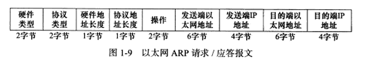
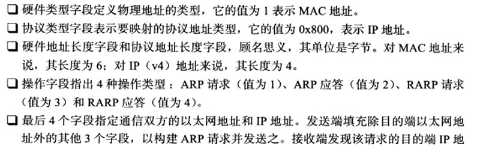

## 计算机网络

### 1. 基本概念

    链路层(Link Layer)是计算机网络的四层模型中的第二层,它负责在网络节点之间传输数据.以下是一些关于链路层的基本知识:
    对于开发者来说,以下是一些在链路层需要了解的关键概念:

    1. **MAC地址**:这是链路层用来标识网络设备的唯一地址.在某些应用中,如MAC地址过滤,你可能需要处理MAC地址.

    以太网,源MAC地址和目标的MAC地址在一个数据包里传输.MAC的网卡发现数据包,是自己的,就会把包收进来,打开ip包,发现ip地址是自己的就打开tcp包(不然就将继续查目标mac地址,然后打包转发出去),然后打开tcp包,发现端口也是自己的(这里也说明了,整个tcp是通过端口传输数据的)80,就会提交给一个监听这个端口的应用程序,然后应用程序就会把请求的返回数据返给源mac地址的设备,这是源mac地址就改成目标mac,原目标mac就改成源mac地址. 

    2. **帧**:链路层的数据单位是帧.理解帧的结构,包括头部/数据负载和尾部,对于理解网络数据的传输和处理很重要.

    3. **错误检测和纠错**:链路层使用各种技术,如奇偶校验/循环冗余检查(CRC)来检测和纠正数据传输中的错误.在开发网络应用或硬件时,可能需要实现或使用这些技术.
        在以太网,CRC(Cyclic Redundancy Check)是用来做 **循环冗余检测**的.通过XOR异或的算法,来计算整个包是否在发送发的过程中出错.它只能检测数据是否出错,不提供纠正功能.出错了怎么办?丢弃吗? 

    4. **流量控制和可靠传输**:链路层可以使用流量控制技术来防止发送方过快地发送数据,导致接收方无法处理.此外,一些链路层协议还提供了可靠传输功能,如自动重传请求(ARQ).

    5. **链路层交换**:理解链路层交换和链路层交换设备(如交换机)的工作原理,对于理解网络数据的路由和转发很重要.

    6. **链路层协议**:了解常见的链路层协议,如以太网(Ethernet)/Wi-Fi和点对点协议(PPP),可以帮助你理解网络数据的封装和传输.

    以上这些概念对于开发网络应用或进行网络编程都是非常重要的.

### 2. ARP协议

#### 2.1 什么是ARP协议?

ARP协议是地址解析协议(Address Resolution Protocol)的缩写.它是一种用于将IP地址解析为对应的MAC地址的协议,也可以说是一种用于在网络中获取目标设备的物理地址的协议.
ARP协议通过广播的方式发送请求,询问某个IP地址对应的MAC地址,然后将获取到的MAC地址缓存起来,以便后续的通信中直接使用.ARP协议在局域网中起到了非常重要的作用,它使得不同设备之间可以通过IP地址进行通信,而无需关心物理地址.

#### 2.2 ARP的工作原理是什么?

    1. 当一个设备需要发送数据到目标设备时,它首先检查自己的ARP缓存表(ARP Cache)中是否有目标设备的MAC地址.如果有,设备就可以直接使用该MAC地址发送数据.

    2. 如果ARP缓存表中没有目标设备的MAC地址,设备就会发送一个ARP请求广播消息到局域网上的所有设备.该ARP请求消息包含了设备的IP地址和MAC地址为广播地址(FF:FF:FF:FF:FF:FF).

    3. 其他设备收到ARP请求消息后,会检查自己的IP地址是否与请求中的目标IP地址匹配.如果匹配,设备会将自己的MAC地址作为ARP响应消息发送回去.

    4. 发起ARP请求的设备收到ARP响应消息后,会将目标设备的IP地址和MAC地址存储到ARP缓存表中,以便后续的通信中直接使用.

    5. 如果在一定时间内没有收到ARP响应消息,设备会认为目标设备不可达或不存在.

    通过这种方式,ARP协议实现了将IP地址解析为对应的MAC地址,从而使设备能够通过IP地址进行通信.同时,设备也会定期更新ARP缓存表中的条目,以确保缓存的MAC地址是最新的.

#### 2.3 那如果ARP缓存的条目没有达到生命周期的末尾,但是目标设备的IP地址又发生了变换,会怎么样呢?
GitHub Copilot: 如果ARP缓存的条目没有达到生命周期的末尾,但是目标设备的IP地址又发生了变换,那么在ARP缓存过期之前,设备可能会继续使用旧的IP地址和MAC地址对应关系进行通信,这可能导致通信失败.

在实际的网络环境中,这种情况很少发生,因为IP地址通常是静态的,或者在动态分配时,其生命周期通常远大于ARP缓存的生命周期.

如果确实出现了这种情况,可以通过手动清除ARP缓存来解决.大多数操作系统都提供了清除ARP缓存的命令,例如在Windows中可以使用`arp -d`命令,在Linux中可以使用`ip -s -s neigh flush all`命令.这样可以强制设备发送新的ARP请求,获取最新的IP地址和MAC地址对应关系.

#### 2.4 IP不是可以动态的吗?如果是动态IP那不就ARP缓存会出现频繁过期吗
GitHub Copilot: 是的,IP地址可以是动态的,这通常在DHCP(动态主机配置协议)环境中发生.在这种情况下,设备的IP地址可能会在一段时间后改变.

然而,ARP缓存的生命周期通常比较短,通常在几分钟到几个小时之间.这意味着即使IP地址改变,ARP缓存也会在短时间内过期并更新.因此,即使在动态IP环境中,ARP缓存也能有效地维护IP地址和MAC地址之间的映射.

另外,当设备的IP地址改变时,设备通常会发送一个ARP通告(ARP Announcement),这是一个特殊的ARP响应,用于更新其他设备的ARP缓存.这样,即使ARP缓存还没有过期,其他设备也能立即知道新的IP地址和MAC地址的对应关系.

- ***mac地址?***

### 3. MAC层

第二层,数据链路层. 
Hub采取的是广播的模式,所以每一台电脑发出去的包,每个电脑都收到. 
数据链路层,也就是MAC层,全称Medium Access Control,媒体访问控制.控制什么?
* 控制在往媒体上发数据的时候,谁先发/谁后发的问题.
物理地址(链路层地址).因第二层主要解决媒体接入控制问题,所以常被称为MAC地址. 
* 解决 **多路访问** 这样,多路访问不同的mac地址就可以解决,不用到处广播
1. 多个车道,信道划分
2. 轮流协议 单双号分着出行
3. 随机接入协议 错过高峰出行

### 4. RARP
### 5. 交换机
#### 5.1 什么是交换机,交换机的作用是什么?
    根据策略转发的设备.通过学习,得知每个口的mac,然后形成一张转发表,根据这个转发表就知道在那个口发出去数据. 

#### 5.2 使用多台交换机会有什么问题?为什么要使用多台交换机?
    **环路问题** 拓扑结构复杂的形成. 
    破除环路->stp最小生成树(Spanning Tree Protocol). 
    Root Bridge->Designated Bridges->BPDU(Bridge Protocol Data Units)->Priority Vector(Root Bridge Id,Root Path Cost,Bridge Id and Port Id) 
    [最小生成树](https://www.cnblogs.com/biyeymyhjob/archive/2012/07/30/2615542.html) 
    VLAN ID在二层的头加上一个TAG,划分4096个VLAN.根据VLAN ID这个转发. 

### 99.quiz
#### 1. arp协议有什么用?不是只能解决在局域网的通信吗?如果两台通信设备不在同一个局域网,怎么办?
ARP协议的主要作用是在同一局域网内,将设备的IP地址解析为对应的MAC地址,从而使设备能够通过IP地址进行通信.这是因为在局域网中,设备之间的通信实际上是通过MAC地址进行的,而IP地址只是用于寻址的.

如果两台通信设备不在同一个局域网内,那么它们之间的通信就需要通过路由器进行.在这种情况下,发送设备会将数据发送到其默认网关(通常是路由器),然后由路由器根据目标IP地址将数据转发到正确的网络.在这个过程中,ARP协议仍然起到了重要的作用,因为发送设备需要知道其默认网关的MAC地址,而这就是通过ARP协议来获取的.

因此,虽然ARP协议只能在局域网内解析IP地址和MAC地址,但它在整个网络通信过程中仍然起到了关键的作用.

#### 2. 对于一个新加入设备,怎么知道谁是网关?
新加入的设备通常通过DHCP(动态主机配置协议)来获取网络配置信息,包括默认网关的IP地址.当设备连接到网络时,它会发送一个DHCP发现(DHCP Discover)消息,然后DHCP服务器会回应一个DHCP提供(DHCP Offer)消息,其中包含了网络配置信息.设备接收到这个消息后,就可以知道默认网关的IP地址了.

如果网络中没有DHCP服务器,或者设备是静态配置的,那么默认网关的IP地址就需要手动设置.

一旦设备知道了默认网关的IP地址,它就可以使用ARP协议来获取网关的MAC地址.设备会发送一个ARP请求,询问网关的IP地址对应的MAC地址,然后网关会回应一个ARP响应,其中包含了它的MAC地址.设备接收到这个响应后,就可以知道网关的MAC地址了.

这样,设备就可以通过网关与其他网络进行通信了.

#### 3. 