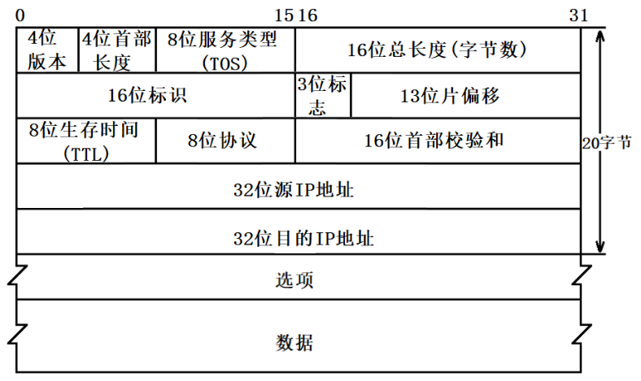

## （3）网络层

### 1. 基本概念

1. **IP协议(Internet Protocol)**:IP协议是网络层的核心协议,它定义了IP地址和数据包的格式,并负责将数据包从源主机发送到目标主机.IP协议包括IPv4和IPv6两个版本.

2. **ICMP协议(Internet Control Message Protocol)**:ICMP协议用于发送和接收网络控制消息,如错误报告/路由更改通知等.例如,当你使用ping命令测试网络连通性时,就是使用的ICMP协议.

3. **路由协议**:路由协议用于在路由器之间交换路由信息,以建立路由表.常见的路由协议包括RIP/OSPF/BGP等.

4. **ARP协议(Address Resolution Protocol)**:ARP协议用于将IP地址映射为MAC地址.当一个主机需要将数据包发送到同一网络中的另一个主机时,它会使用ARP协议查找目标主机的MAC地址.

5. **IGMP协议(Internet Group Management Protocol)**:IGMP协议用于管理多播组,它允许主机加入或离开一个多播组,以接收或停止接收多播数据.

以上就是网络层的主要协议.需要注意的是,这些协议都是为了实现网络层的主要功能:将数据包从源主机发送到目标主机,无论它们是否在同一网络中.

### 2. IP协议
IP协议是一个无连接的、不可靠的协议，它不保证数据包一定能被成功地发送到目标主机，也不保证数据包的顺序。这些功能需要由更高层的协议（如TCP协议）来提供。
#### 2.1 什么是IP地址？
IP地址（Internet Protocol Address）是用于标识网络上每个设备的唯一数字标签。它是IP协议的核心部分，用于在网络中定位和识别设备。

#### 2.2 IP数据包的结构是怎么样的？

* 4位版本号(version)：
    指定IP协议的版本，对于IPv4来说就是4。
* 4位头部长度(header length)：
    4bit表示最大的数字是15, 因此IP头部最大长度是60字节。
* 8位服务类型(Type Of Service)：
    3位优先权字段(已经弃用)，4位TOS字段，和1位保留字段(必须置为0)。
    4位TOS分别表示: 最小延时，最大吞吐量，最高可靠性，最小成本。
    这四者相互冲突，只能选择一个。
    对于ssh/telnet这样的应用程序，最小延时比较重要。
    对于ftp这样的程序，最大吞吐量比较重要。
* 16位总长度(total length)：
    IP数据报整体占多少个字节。
* **8位生存时间(Time To Live, TTL)**：
    数据报到达目的地的最大报文跳数。一般是64，每次经过一个路由TTL -= 1，一直减到0还没到达，那么就丢弃了。这个字段主要是用来防止出现路由循环。
* 8位协议: 
    表示上层协议的类型。
* 16位头部校验和: 
    使用CRC进行校验, 来鉴别头部是否损坏。
* 32位源地址和32位目标地址: 
    表示发送端和接收端。

#### 2.3 有了mac地址，为什么还要有IP地址？
MAC地址和IP地址虽然都用于标识网络中的设备，但它们在网络通信中扮演的角色是不同的，因此两者都是必要的。

1. **全局唯一性**：MAC地址是全球唯一的，它在生产时被硬编码到网络接口卡上。然而，MAC地址只在本地网络中有意义，不能用于在全球范围内定位设备。相反，IP地址是在全球范围内唯一的，可以用于在互联网上定位设备。

2. **路由**：IP地址不仅标识了设备，还提供了设备的网络位置信息。IP地址由网络部分和主机部分组成，这使得路由器可以根据IP地址的网络部分将数据包转发到正确的网络。而MAC地址没有这种网络位置信息，不能用于路由。

3. **灵活性**：IP地址可以动态分配和更改，这使得设备可以移动到不同的网络而不需要更改硬件。而MAC地址是固定的，不能更改。

4. **抽象层次**：MAC地址和IP地址存在于不同的网络模型层次。MAC地址存在于数据链路层，直接与物理硬件相关。而IP地址存在于网络层，提供了一个从物理硬件抽象出来的地址系统，使得上层应用可以不关心底层的物理连接细节。

因此，虽然有了MAC地址，但我们仍然需要IP地址来进行全球范围的网络通信。

#### 2.4 接入网络的时候，IP地址是怎么分配的？
接入网络时，IP地址的分配通常通过动态主机配置协议（DHCP）进行。以下是基本的步骤：

1. **DHCP发现（DHCP Discover）**：当设备连接到网络并需要IP地址时，它会发送一个DHCP发现消息。这个消息是一个广播消息，会被网络中的所有设备接收到。

2. **DHCP提供（DHCP Offer）**：网络中的DHCP服务器会接收到DHCP发现消息，然后从它的地址池中选择一个可用的IP地址。然后，DHCP服务器会将这个IP地址以及其他网络配置（如子网掩码、默认网关、DNS服务器等）封装在DHCP提供消息中，然后发送给请求的设备。

3. **DHCP请求（DHCP Request）**：设备接收到DHCP提供消息后，会从中选择一个DHCP服务器（如果有多个的话），然后向这个服务器发送DHCP请求消息，请求使用提供的IP地址。

4. **DHCP应答（DHCP Acknowledgement）**：DHCP服务器接收到DHCP请求消息后，会发送一个DHCP应答消息，确认设备可以使用提供的IP地址。

以上就是接入网络时IP地址的分配过程。需要注意的是，分配的IP地址通常有一个租期，当租期到期后，设备需要重新请求IP地址。

##### 2.5.1 dhcp服务器在哪里？
DHCP服务器通常位于网络的核心位置，例如在企业网络中，它可能是一台专门的服务器或者是一台运行DHCP服务的路由器。在家庭网络中，DHCP服务器通常是无线路由器。

DHCP服务器的主要任务是管理和分配IP地址。当一个设备连接到网络并请求IP地址时，DHCP服务器会从其地址池中选择一个可用的IP地址，并将其分配给请求的设备。

需要注意的是，虽然DHCP服务器通常位于网络的核心位置，但它并不一定需要与请求IP地址的设备在同一子网中。通过使用DHCP中继代理，DHCP服务器可以为位于不同子网的设备分配IP地址。

#### 2.4 IP地址不会被用完吗？
原始的IPv4地址空间包含约43亿个地址，由于互联网的快速发展，这些地址已经基本上被分配完了。这就是为什么我们需要IPv6的一个重要原因。IPv6地址空间包含约340多万亿万亿万亿个地址，这个数量远远超过了地球上每个人、每个设备需要的地址数量，因此在可预见的未来，IPv6地址不会被用完。

同时，还有一些技术被用来节省和复用IPv4地址，例如NAT（网络地址转换）和CIDR（无类别域间路由）。NAT允许多个设备共享一个公网IP地址，而CIDR则通过更灵活的地址分配方式，减少了IP地址的浪费。

##### 2.5.1 什么是NAT
NAT，全称为网络地址转换（Network Address Translation），是一种在网络通信过程中转换IP地址的技术。它主要用于IPv4网络，以解决IPv4地址短缺的问题。

NAT的工作原理是在私有网络（如家庭或企业网络）和公共网络（如互联网）之间设置一个NAT设备（通常是路由器）。私有网络中的设备使用私有IP地址，这些地址只在私有网络中有效，不能用于互联网。当私有网络中的设备需要与互联网上的设备通信时，NAT设备会将私有IP地址转换为公网IP地址。

NAT有几种不同的类型，包括静态NAT、动态NAT和端口地址转换（PAT）。静态NAT为每个私有IP地址提供一个固定的公网IP地址，动态NAT为每个私有IP地址提供一个从公网IP地址池中动态分配的公网IP地址，而PAT（也称为NAT Overload）则允许多个私有IP地址共享一个公网IP地址，通过使用不同的端口号来区分不同的设备。

NAT不仅可以解决IP地址短缺的问题，还可以提供一定的安全性，因为私有网络中的设备的IP地址在互联网上是不可见的。

##### 2.5.2 什么是CIDR
CIDR，全称为无类别域间路由（Classless Inter-Domain Routing），是一种用于IP地址分配和路由的方法。它的主要目标是优化IPv4地址的使用，以延缓IPv4地址空间的耗尽，并简化路由表。

在CIDR之前，IP地址被分为A、B、C三类，每类地址有固定的网络部分和主机部分，这种方式在地址分配上非常浪费。例如，一个类B地址可以提供65534个主机地址，如果一个组织只有1000台设备，那么剩下的大部分地址就会被浪费。

CIDR通过引入可变长度的子网掩码来解决这个问题。在CIDR中，IP地址被写成“IP地址/前缀长度”的形式，例如192.0.2.0/24。这里的“/24”表示前24位是网络部分，后8位是主机部分。这样，我们就可以根据实际需要来划分网络和主机部分，从而更灵活地分配IP地址。

CIDR还有助于简化路由表。在CIDR中，可以使用一个路由表项来表示一组连续的IP地址，这被称为路由聚合或前缀聚合。这大大减少了路由表的大小，从而提高了路由效率。

例如，如果我们有以下四个网络：

- 192.0.2.0/24
- 192.0.3.0/24
- 192.0.4.0/24
- 192.0.5.0/24

在没有CIDR的情况下，我们需要在路由表中为每个网络创建一个条目。但在CIDR中，我们可以将这四个网络聚合为一个单一的192.0.2.0/22网络，这样只需要一个路由表条目。

总的来说，CIDR通过灵活的地址分配和路由聚合，有效地解决了IPv4地址短缺和路由表过大的问题。

#### 2.1 同一个子网下的IP地址为什么一般都是192.168开始的?
192.168.x.x是一个专门为私有网络(如家庭和企业内部网络)预留的IP地址范围,由RFC 1918定义.这个地址范围在全球范围内可以重复使用,但在同一个网络内必须是唯一的.

除了192.168.x.x,RFC 1918还定义了两个其他的私有IP地址范围:10.x.x.x和172.16.x.x到172.31.x.x.然而,由于192.168.x.x的地址范围较小,足够大多数家庭和小型企业使用,因此它被广泛用作默认的私有IP地址范围.

当你设置一个网络设备(如路由器)为DHCP服务器时,它通常会默认使用192.168.x.x的地址范围为网络内的设备分配IP地址.这就是为什么同一个子网下的IP地址通常都是以192.168开始的.

### 3. ARP协议
ARP协议是地址解析协议(Address Resolution Protocol)的缩写.它是一种用于将IP地址解析为对应的MAC地址的协议,也可以说是一种用于在网络中获取目标设备的物理地址的协议.
ARP协议通过广播的方式发送请求,询问某个IP地址对应的MAC地址,然后将获取到的MAC地址缓存起来,以便后续的通信中直接使用.ARP协议在局域网中起到了非常重要的作用,它使得不同设备之间可以通过IP地址进行通信,而无需关心物理地址.

1. 设备A需要向设备B发送数据,但只知道设备B的IP地址,不知道其MAC地址.

2. 设备A在网络上广播一个ARP请求消息,询问谁拥有设备B的IP地址.

3. 所有收到ARP请求的设备都会检查自己的IP地址,如果IP地址匹配,则设备B会向设备A发送一个ARP响应消息,包含其MAC地址.

4. 设备A收到ARP响应后,就可以将数据包发送到设备B的MAC地址了.

通过这个过程,ARP协议可以将IP地址解析为MAC地址,使得设备可以在网络中进行通信.

#### 3.1 ARP协议用在什么场景？
ARP协议（地址解析协议）主要用于在网络通信中将IP地址映射为MAC地址。它在以下场景中非常重要：

1. **局域网通信**：当两台在同一局域网（例如，同一WiFi网络）中的设备需要进行通信时，发送设备需要知道接收设备的MAC地址。但在网络层，设备通常只知道接收设备的IP地址。这时，发送设备就会使用ARP协议，通过广播一个ARP请求消息，询问谁拥有接收设备的IP地址。接收设备收到ARP请求后，如果发现IP地址匹配，就会回复一个ARP响应消息，包含其MAC地址。这样，发送设备就可以知道接收设备的MAC地址，从而进行通信。

2. **路由器转发**：当一个数据包需要从一个网络传输到另一个网络时，路由器需要知道下一跳的MAC地址。这时，路由器就会使用ARP协议来获取下一跳的MAC地址。

3. **虚拟私有网络（VPN）和网络地址转换（NAT）**：在这些场景中，IP地址可能会被改变。因此，需要使用ARP协议来获取新的IP地址对应的MAC地址。

总的来说，ARP协议在任何需要将IP地址映射为MAC地址的场景中都会被使用。

#### 3.2 ARP协议的工作原理
1. 当一个设备需要发送数据到目标设备时,它首先检查自己的ARP缓存表(ARP Cache)中是否有目标设备的MAC地址.如果有,设备就可以直接使用该MAC地址发送数据.

2. 如果ARP缓存表中没有目标设备的MAC地址,设备就会发送一个ARP请求广播消息到局域网上的所有设备.该ARP请求消息包含了设备的IP地址和MAC地址为广播地址(FF:FF:FF:FF:FF:FF).

3. 其他设备收到ARP请求消息后,会检查自己的IP地址是否与请求中的目标IP地址匹配.如果匹配,设备会将自己的MAC地址作为ARP响应消息发送回去.

4. 发起ARP请求的设备收到ARP响应消息后,会将目标设备的IP地址和MAC地址存储到ARP缓存表中,以便后续的通信中直接使用.

5. 如果在一定时间内没有收到ARP响应消息,设备会认为目标设备不可达或不存在.

通过这种方式,ARP协议实现了将IP地址解析为对应的MAC地址,从而使设备能够通过IP地址进行通信.同时,设备也会定期更新ARP缓存表中的条目,以确保缓存的MAC地址是最新的.

### 3. 路由协议

#### 3. 1 路由器干什么的
路由器是网络中的关键设备,它在网络层(OSI模型的第三层)上工作,主要有以下几个作用:

1. **数据包转发**:路由器的主要功能是接收来自一个网络的数据包,并将其转发到另一个网络.路由器根据数据包的目标IP地址和自己的路由表来决定如何转发数据包.

2. **路由选择**:路由器使用路由协议(如RIP/OSPF/BGP等)来与其他路由器交换路由信息,并根据这些信息来建立和更新自己的路由表.路由表中的每一条路由都指示了如何到达一个特定的网络.

3. **网络连接**:路由器可以连接不同类型(如以太网/Wi-Fi/光纤等)和不同协议(如IPv4/IPv6等)的网络.这使得不同网络中的设备可以互相通信.

4. **网络分割**:路由器可以将一个大网络分割为多个小网络(或子网),每个小网络都有自己的网络地址.这可以提高网络的管理效率和数据传输效率,同时也可以提高网络的安全性.

5. **网络服务**:一些路由器还提供了DHCP/NAT/防火墙等网络服务.

总的来说,路由器是实现网络互联的关键设备,它使得不同网络中的设备可以互相通信.

#### 3.2 静态路由是什么?
静态路由就是在路由器上,配置一条一条规则.下一跳是谁就配置下一跳. 
MAC头和IP头变与不变.分为欧洲十国游和玄奘西行型 
IP头不变,mac变,不换护照欧洲十国游,ip变,换护照玄奘西行. 

#### 3.3 对路由协议的了解与介绍.内部网关协议IGP包括RIP,OSPF,和外部网关协议EGP和BGP.
* RIP"路由信息协议(Route Information Protocol)"的简写,主要传递路由信息,通过每隔30秒广播一次路由表,维护相邻路由器的位置关系,同时根据收到的路由表信息使用动态规划的方式计算自己的路由表信息.RIP是一个距离矢量路由协议,最大跳数为16跳,16跳以及超过16跳的网络则认为目标网络不可达.

* OSPF:详见:https://zhuanlan.zhihu.com/p/41341540

### 4. ICMP
#### 4.1 什么是ICMP协议
    ICMP(Internet Control Message Protocol,互联网控制报文协议)是网络层的一个协议.它用于在IP主机/路由器之间传递控制消息,这些控制消息通常被用于IP操作的诊断以及提供有关异常情况的反馈,例如,目标主机不可达/网络拥塞等.

#### 4.2 ICMP工作原理
ICMP(Internet Control Message Protocol,互联网控制报文协议)的工作原理主要涉及发送和接收ICMP报文.ICMP报文通常被用于IP操作的诊断以及提供有关异常情况的反馈.

以下是ICMP的基本工作流程:

1. 当一个设备需要发送一个ICMP报文时(例如,使用ping命令测试网络连通性),它会创建一个ICMP报文,包含一个类型字段(指示报文的类型)和一个代码字段(提供关于报文类型的更多信息),以及其他必要的信息.

2. ICMP报文被封装在IP数据包中,然后发送到目标设备.这个过程中可能会经过多个路由器.

3. 当目标设备收到ICMP报文时,它会根据报文的类型和代码字段来处理报文.例如,如果报文是一个ping请求(ICMP echo request),目标设备会发送一个ping响应(ICMP echo reply).

4. 如果在发送ICMP报文的过程中发生了错误(例如,目标设备不可达),则会发送一个ICMP错误报文到源设备.

通过这个过程,ICMP协议可以帮助我们诊断网络问题,例如,测试网络连通性(使用ping命令),确定数据包的传输路径(使用traceroute命令),等等.

#### 4.3 ping
详见:[Ping原理与ICMP协议](https://www.cnblogs.com/Akagi201/archive/2012/03/26/2418475.html)

ping是使用ICMP协议来进行工作的. ICMP:网络控制报文协议

* 首先,ping命令会构建一个ICMP请求数据包,然后由ICMP协议将这个数据包连同目的IP地址源IP地址一起交给IP协议.
* 然后IP协议就会构建一个IP数据报,并且在映射表中查找目的IP对应的mac地址,将其交给数据链路层.
* 然后数据链路层就会构建一个数据帧,附上源mac地址和目的mac地址发送出去.

目的主机接收到数据帧后,就会检查包上的mac地址与本机mac是否相符,如果相符,就接收并把其中的信息提取出来交给IP协议,IP协议就会将其中的信息提取出来交给ICMP协议.然后构建一个ICMP应答包,用相同的过程发送回去.

### 99. quiz
#### 1. 为什么本地地址是127.0.0.1?
127.0.0.1是一个特殊的IP地址，被称为本地回环地址或localhost。这个地址用于在计算机网络中表示当前设备，也就是说，当一个程序需要与运行在同一设备上的另一个程序通信时，可以使用这个地址。

这个地址之所以被选择为本地回环地址，是因为在IPv4地址空间中，127.0.0.0/8（也就是从127.0.0.0到127.255.255.255的所有地址）都被保留为本地回环地址。这是由互联网工程任务组（IETF）在RFC 3330中规定的。

其中，127.0.0.1是最常用的本地回环地址，但实际上，任何从127.0.0.0到127.255.255.255的地址都可以作为本地回环地址使用。

使用本地回环地址的好处是，可以在没有网络连接的情况下测试网络应用，因为所有发送到本地回环地址的数据包都会被操作系统立即返回，不会真正发送到网络上。

#### 2. 那如果ARP缓存的条目没有达到生命周期的末尾,但是目标设备的IP地址又发生了变换,会怎么样呢?
如果ARP缓存的条目没有达到生命周期的末尾,但是目标设备的IP地址又发生了变换,那么在ARP缓存过期之前,设备可能会继续使用旧的IP地址和MAC地址对应关系进行通信,这可能导致通信失败.

在实际的网络环境中,这种情况很少发生,因为IP地址通常是静态的,或者在动态分配时,其生命周期通常远大于ARP缓存的生命周期.

如果确实出现了这种情况,可以通过手动清除ARP缓存来解决.大多数操作系统都提供了清除ARP缓存的命令,例如在Windows中可以使用`arp -d`命令,在Linux中可以使用`ip -s -s neigh flush all`命令.这样可以强制设备发送新的ARP请求,获取最新的IP地址和MAC地址对应关系.

#### 3. IP不是可以动态的吗?如果是动态IP那不就ARP缓存会出现频繁过期吗
是的,IP地址可以是动态的,这通常在DHCP(动态主机配置协议)环境中发生.在这种情况下,设备的IP地址可能会在一段时间后改变.

然而,ARP缓存的生命周期通常比较短,通常在几分钟到几个小时之间.这意味着即使IP地址改变,ARP缓存也会在短时间内过期并更新.因此,即使在动态IP环境中,ARP缓存也能有效地维护IP地址和MAC地址之间的映射.

另外,当设备的IP地址改变时,设备通常会发送一个ARP通告(ARP Announcement),这是一个特殊的ARP响应,用于更新其他设备的ARP缓存.这样,即使ARP缓存还没有过期,其他设备也能立即知道新的IP地址和MAC地址的对应关系.

#### 4. arp协议有什么用?不是只能解决在局域网的通信吗?如果两台通信设备不在同一个局域网,怎么办?
ARP协议的主要作用是在同一局域网内,将设备的IP地址解析为对应的MAC地址,从而使设备能够通过IP地址进行通信.这是因为在局域网中,设备之间的通信实际上是通过MAC地址进行的,而IP地址只是用于寻址的.

如果两台通信设备不在同一个局域网内,那么它们之间的通信就需要通过路由器进行.在这种情况下,发送设备会将数据发送到其默认网关(通常是路由器),然后由路由器根据目标IP地址将数据转发到正确的网络.在这个过程中,ARP协议仍然起到了重要的作用,因为发送设备需要知道其默认网关的MAC地址,而这就是通过ARP协议来获取的.

因此,虽然ARP协议只能在局域网内解析IP地址和MAC地址,但它在整个网络通信过程中仍然起到了关键的作用.

#### 5. 对于一个新加入设备,怎么知道谁是网关?
新加入的设备通常通过DHCP(动态主机配置协议)来获取网络配置信息,包括默认网关的IP地址.当设备连接到网络时,它会发送一个DHCP发现(DHCP Discover)消息,然后DHCP服务器会回应一个DHCP提供(DHCP Offer)消息,其中包含了网络配置信息.设备接收到这个消息后,就可以知道默认网关的IP地址了.

如果网络中没有DHCP服务器,或者设备是静态配置的,那么默认网关的IP地址就需要手动设置.

一旦设备知道了默认网关的IP地址,它就可以使用ARP协议来获取网关的MAC地址.设备会发送一个ARP请求,询问网关的IP地址对应的MAC地址,然后网关会回应一个ARP响应,其中包含了它的MAC地址.设备接收到这个响应后,就可以知道网关的MAC地址了.

这样,设备就可以通过网关与其他网络进行通信了.

#### 6. 什么是网络层分片？原因与具体实现又是什么？
网络层分片是由IP协议(Internet Protocol)决定的.在IPv4中,如果一个数据包的大小超过了链路层的最大传输单元(MTU),那么IP协议会在网络层进行分片,将大的数据包划分为多个小的数据包,每个小的数据包的大小都不超过MTU.

需要注意的是,在IPv6中,网络层不再进行分片,而是由发送端的传输层进行分片.如果一个数据包的大小超过了MTU,那么发送端需要在传输层将数据包划分为多个小的数据包,然后再发送.这是因为网络层分片会增加网络的复杂性和开销,因此IPv6设计者决定将分片的责任交给发送端.

网络层分片是指在网络层将大的数据包划分为多个小的数据包的过程.这个过程通常发生在数据包的大小超过链路层的最大传输单元(MTU)时.

为什么要进行分片呢?这是因为在链路层中,每种类型的物理介质都有一个最大传输单元(MTU),这是由物理介质的特性决定的.例如,在以太网中,MTU的大小通常是1500字节.如果一个数据包的大小超过了MTU,那么就需要在网络层进行分片,将大的数据包划分为多个小的数据包,每个小的数据包的大小都不超过MTU.
分片的过程是在发送端进行的,接收端收到分片后,会根据分片中的信息将它们重新组装成原来的数据包.这个过程是透明的,也就是说,应用层并不知道数据包被分片和重新组装的过程.

需要注意的是,分片会增加网络的复杂性和开销,因此在设计网络应用时,应尽量避免发送过大的数据包,以减少分片的需要.

**ARP**
ARP协议能实现任意网络层地址到任意物理地址的转换

#　IP

* IP协议在MAC帧中的协议号为`0x0800`

* IP首部

  

* **什么是IP分片**

  * IP协议在传输数据包时会将数据报文分成若干片进行传输,并在目标系统中进行重组.这以过程就成为分片

* **为什么要进行IP分片**

  * 如果IP数据报加上数据帧头部后大于MTU,数据报文就会分成若干片进行传输.那么什么是MTU呢?每一种物理网络都会规定链路层数据帧的最大长度,称为链路层MTU.**在以太网的环境中可传输的最大IP报文为1500字节**.如果要传输的数据帧的大小超过1500字节,即IP数据报的长度大于1472(1500-20-8=1472,UDP)字节,需要分片之后进行传输

* IP分片如何组装

  * 在IP头里面有16bit的**识别号唯一记录了一个IP包的ID**,以确定这几个分片是否属于同一个包,具有同一个ID的IP分片将会从新组装.**13bit的片偏移记录了一个IP分片相对于整个包的位置**.**3bit的标志位记录了该分片后面是否还有新的分片**.这三个分片组成了IP分片的所有的信息

# ICMP

* ICMP 全称是 Internet Control Message Protocol,也就是互联网控制报文协议,**其协议号为**`1`

* ICMP 主要的功能包括:

  * **确认 IP 包是否成功送达目标地址**
  * **报告发送过程中 IP 包被废弃的原因**和**改善网络设置**等

* 在 IP 通信中如果某个 IP 包因为某种原因未能达到目标地址,那么这个具体的原因将由 ICMP 负责通知

* ICMP 大致可以分为两大类:

  * 一类是**用于诊断**的查询消息,也就是'**查询报文类型**'
  * 另一类是**通知出错原因**的错误消息,也就是'**差错报文类型**'

  

* 查询报文类型

  * 回送消息 __ 类型 `0` 和` 8`

  * 回送消息用于进行通信的主机或路由器之间,**判断所发送的数据包是否已经成功到达对端的一种消息**,` ping` 命令就是利用这个消息实现的

  * 可以向对端主机**发送回送请求的消息**( `ICMP Echo Request Message` ,类型` 8 `),也可以接收对端主机发回来的回送应答消息( `ICMP Echo Reply Message` ,类型` 0` )

    

* 差错报文类型

  * 目标不可达消息 __ 类型 为` 3`

    * IP 路由器无法将 IP 数据包发送给目标地址时,会给发送端主机返回一个目标不可达的 ICMP 消息,并在这个消息中显示不可达的具体原因,原因记录在 ICMP 包头的代码字段.由此,根据 ICMP 不可达的具体消息,发送端主机也就可以了解此次发送不可达的具体原因

    * 举例 6 种常见的目标不可达类型的代码:

      

    * 网络不可达

      * IP 地址是分为网络号和主机号的,所以当路由器中的路由器表匹配不到接收方 IP 的网络号,就通过ICMP 协议以网络不可达( `Network Unreachable `)的原因告知主机

    * 主机不可达

      * 当路由表中没有该主机的信息,或者该主机没有连接到网络,那么会通过 ICMP 协议以主机不可达( `Host Unreachable `)的原因告知主机

    * 协议不可达

      * 当主机使用 TCP 协议访问对端主机时,能找到对端的主机了,可是**对端主机的防火墙已经禁止 TCP 协议访问**,那么会通过 ICMP 协议以协议不可达的原因告知主机

    * 需要进行分片但设置了不分片位

      * 发送端主机发送 IP 数据报时,**将 IP 首部的分片禁止标志位设置为1** .**根据这个标志位,途中的路由器遇到超过 MTU 大小的数据包时,不会进行分片,而是直接抛弃**

    * 端口不可达

      * 当主机访问对端主机 8080 端口时,这次能找到对端主机了,防火墙也没有限制,可是发现**对端主机没有进程监听 8080 端口**,那么会通过 ICMP 协议以端口不可达的原因告知主机

  * 原点抑制消息 __ 类型 `4`

    * 在使用低速广域线路的情况下,**连接 WAN 的路由器可能会遇到网络拥堵的问题**,`ICMP` 原点抑制消息的目的就是为了缓和这种拥堵情况
    * 当路由器向低速线路发送数据时,其发送队列的缓存变为零而无法发送出去时,可以向 IP 包的源地址发送一个 ICMP 原点抑制消息
    * 收到这个消息的主机借此了解在整个线路的某一处发生了拥堵的情况,从而**增大 IP 包的传输间隔,减少网络拥堵的情况**
    * 然而,**由于这种 ICMP 可能会引起不公平的网络通信,一般不被使用**

  * 重定向消息 __ 类型 `5`

    * 如果**路由器发现发送端主机使用了'不是最优'的路径发送数据,那么它会返回一个 ICMP 重定向消息给这个主机**
    * 在这个消息中包含了**最合适的路由信息和源数据**.这主要发生在路由器持有更好的路由信息的情况下
    * **路由器会通过这样的 ICMP 消息告知发送端,让它下次发给另外一个路由器**

  * 超时消息 __ 类型 `11`

    * IP 包中有一个字段叫做 `TTL` ( `Time To Live `,生存周期),它的值随着**每经过一次路由器就会减1,直到减到 0 时该 IP 包会被丢弃**
    * 此时,**路由器将会发送一个 ICMP 超时消息给发送端主机,并通知该包已被丢弃**
    * 设置 IP 包生存周期的主要目的,是为了在**路由控制遇到问题发生循环状况时,避免 IP 包无休止地在网络上被转发**

# ARP

## ARP欺骗

* **ARP欺骗**(英语:**ARP spoofing**),又称**ARP毒化**(**ARP poisoning**,网络上多译为**ARP病毒**)或**ARP攻击**,是针对以太网地址解析协议(ARP)的一种攻击技术.此种攻击可让攻击者获取局域网上的数据包甚至可篡改数据包,且可让网络上特定计算机或所有计算机无法正常连线
* 运作机制
  * ARP欺骗的运作原理是由攻击者发送假的ARP数据包到网上,尤其是送到网关上.其目的是要让送至特定的IP地址的流量被错误送到攻击者所取代的地方.因此攻击者可将这些流量另行转送到真正的网关(被动式数据包嗅探,passive sniffing)或是篡改后再转送([中间人攻击](https://baike.baidu.com/item/中间人攻击/1739730),man-in-the-middle attack).攻击者亦可将ARP数据包导到不存在的MAC地址以达到阻断服务攻击的效果,例如netcut软件
  * 例如某一的IP地址是192.168.0.254,其MAC地址为00-11-22-33-44-55,网络上的计算机内ARP表会有这一笔ARP记录.攻击者发动攻击时,会大量发出已将192.168.0.254的MAC地址篡改为00-55-44-33-22-11的ARP数据包.那么网络上的计算机若将此伪造的ARP写入自身的ARP表后,计算机若要透过网上网关连到其他计算机时,数据包将被导到00-55-44-33-22-11这个MAC地址,因此攻击者可从此MAC地址截收到数据包,可篡改后再送回真正的网关,或是什么也不做,让网上无法连线.
* **简单案例分析**:这里用一个最简单的案例来说明ARP欺骗的核心步骤.假设在一个LAN里,只有三台主机A/B/C,且C是攻击者
  1. 攻击者聆听局域网上的MAC地址.它只要收到两台主机洪泛的ARP Request,就可以进行欺骗活动.
  2. 主机A/B都洪泛了ARP Request.攻击者现在有了两台主机的IP/MAC地址,开始攻击.
  3. 攻击者发送一个ARP Reply给主机B,把此包protocol header里的sender IP设为A的IP地址,sender mac设为攻击者自己的MAC地址.
  4. 主机B收到ARP Reply后,更新它的ARP表,把主机A的MAC地址(IP_A, MAC_A)改为(IP_A, MAC_C).
  5. 当主机B要发送数据包给主机A时,它根据ARP表来封装数据包的Link报头,把目的MAC地址设为MAC_C,而非MAC_A.
  6. 当交换机收到B发送给A的数据包时,根据此包的目的MAC地址(MAC_C)而把数据包转发给攻击者C.
  7. 攻击者收到数据包后,可以把它存起来后再发送给A,达到偷听效果.攻击者也可以篡改数据后才发送数据包给A,造成伤害
* 防制方法
  * 最理想的防制方法是网上内的每台计算机的ARP一律改用静态的方式,不过这在大型的网上是不可行的,因为需要经常更新每台计算机的ARP表
  * 另外一种方法,例如[DHCP snooping](https://baike.baidu.com/item/DHCP snooping),网上设备可借由[DHCP](https://baike.baidu.com/item/DHCP)保留网络上各计算机的MAC地址,在伪造的ARP数据包发出时即可侦测到.此方式已在一些厂牌的网上设备产品所支持
  * 有一些软件可监听网络上的ARP回应,若侦测出有不正常变动时可发送邮箱通知管理者.例如UNIX平台的[Arpwatch](https://baike.baidu.com/item/Arpwatch)以及Windows上的XArp v2或一些网上设备的Dynamic ARP inspection功能

