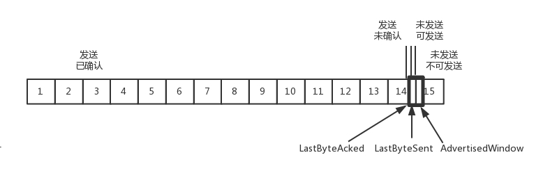

## TCP

### 1. concepts


#### 1.1 三次握手四次挥手
  - **三次握手建立连接**(标志位):通信前确认通信实体存在,并且双方可以正确发送和接收对方的信息
​	[TCP三次握手和四次挥手](https://snailclimb.gitee.io/javaguide/#/./docs/cs-basics/network/other-network-questions?id=tcp-%e4%b8%89%e6%ac%a1%e6%8f%a1%e6%89%8b%e5%92%8c%e5%9b%9b%e6%ac%a1%e6%8c%a5%e6%89%8b%e9%9d%a2%e8%af%95%e5%b8%b8%e5%ae%a2)

##### 1.1.1 三次握手
* 一开始,客户端和服务端都处于CLOSED状态.
* 先是服务端主动监听某个端口,处于LISTEN状态.
* 然后客户端主动发起连接SYN,之后处于SYN-SENT状态.
* 服务端收到发起的连接,返回SYN,并且ACK客户端的SYN,之后处于SYN-RCVD状态.
* 客户端收到服务段发送的SYN和ACK后,发送ACK的ACK,之后处于ESTABLISHED的状态,因为它一发一收成功了.
* 服务段收到ACK的ACK,就会处于ESTABLISHED状态,因为它也一发一收成功了.

满足双方一发一收请求和响应.
客户端发送seq=x,ACK=0,SYN给接收端
接收端接收到了,就发送SYN=1,ACK=1,ack=x+1,seq=y.
然后客户端收到了接收端的包就发送SYN,ACK,seq=x+1,ack=y+1给接收端,然后建立了链接.
就开始发送数据.

假设 A 为客户端,B 为服务器端.

- 首先 B 处于 LISTEN(监听)状态,等待客户的连接请求.

- A 向 B 发送连接请求报文,SYN=1,ACK=0,选择一个初始的序号 x.

- B 收到连接请求报文,如果同意建立连接,则向 A 发送连接确认报文,SYN=1,ACK=1,确认号为 x+1,同时也选择一个初始的序号 y.

- A 收到 B 的连接确认报文后,还要向 B 发出确认,确认号为 y+1,序号为 x+1.

- B 收到 A 的确认后,连接建立.

**三次握手的原因**  

第三次握手是为了防止失效的连接请求到达服务器,让服务器错误打开连接.

客户端发送的连接请求如果在网络中滞留,那么就会隔很长一段时间才能收到服务器端发回的连接确认.客户端等待一个超时重传时间之后,就会重新请求连接.但是这个滞留的连接请求最后还是会到达服务器,如果不进行三次握手,那么服务器就会打开两个连接.如果有第三次握手,客户端会忽略服务器之后发送的对滞留连接请求的连接确认,不进行第三次握手,因此就不会再次打开连接.


* 三次握手

第一次握手:首先client给server发送连接请求报文,在这个报文中,包含了SYN=1,client_seq=任意值i,发送之后处于SYN-SENT状态,这是第一次握手

第二次握手:server端接收到了这个请求,并分配资源,同时给client返回一个ACK报文,这个报文中呢包含了这些字段,标志位SYN和ACK都为1,而小ack为i+1,此时位于SYN-RCVD状态,这是第二次握手

第三次握手:client收到server发来的ACK信息后呢,他会看到server发过来的小ack是i+1,这时他知道了server收到了消息,也给server回一个ACK报文,报文中同样包含了ACK=1这样的消息,同时呢,还包括了client_ack=k+1这样的字段,这样呢三次握手之后,连接就建立了,client进入established(已建立连接)状态


##### 1.1.2 四次握手
* 四次挥手断开连接:

TCP断开连接通常是由一方主动,一方被动的,这里我们假设client主动,server被动
第一次挥手:当client没有数据要发送给server了,他会给server发送一个FIN报文,告诉server:"我已经没有数据要发给你了,但是你要是还想给我发数据的话,你就接着发,但是你得告诉我你收到我的关闭信息了",这是第一次挥手,挥手之后client进入FIN_WAIT_1的第一阶段

第二次挥手:当server收到client发来的FIN报文后,告诉client:"我收到你的FIN消息了,但是你等我发完的"此时给client返回一个ACK信息,并且呢ack=seq+1,这是第二次挥手,挥手之后呢server进入CLOSE_WAIT阶段,而client收到之后处于FIN_WAIT_2第二阶段

第三次挥手:当server发完所有数据时,他会给client发送一个FIN报文,告诉client说"我传完数据了,现在要关闭连接了",然后呢server变成LAST_ACK状态,等着client最后的ACK信息,这是第三次挥手

第四次挥手:当client收到这个FIN报文时,他会对这个消息进行确认,即给server发ACK信息,但是它不相信网络,怕server收不到信息,它会进入TIME_WAIT状态,万一server没收到ACK消息它可以可以重传,而当server收到这个ACK信息后,就正式关闭了tcp连接,处于CLOSED状态,而client等待了2MSL这样长时间后还没等到消息,它知道server已经关闭连接了,于是乎他自己也断开了,这是第四次挥手,这样tcp连接就断开了


time_wait一般用于挥手的时候,实现等待接收端跟客户端挥手时候,客户端响应挥手的等待时间FIN_WAIT,那么按理说到这里,A就可以结束了,但是TCP协议要求A等待TIME_WAIT时间,足够长,等待B收不到包,B就会重发,这样A就有足够的时间到达B.这就是TIME_WAIT的原理,是TCP为了保证可靠.

Linux可设置tcp_fin_timeout来处理当进入FIN_WAIT_2的状态.<br>
**A收到B说知道了,就会进入TIME-WAIT,等待足够长的时间2MSL,Maximum Segment Lifetime报文最大生存时间,他是任何报在网络上生存的最长时间,超过这个时间,报文就会被丢弃一般是2分钟,实际应用是30秒,1分钟和两分钟等.但是我觉得并不会等那么长时间,一般B回答都会比较快.<br>

<div align="center">  </div><br>

以下描述不讨论序号和确认号,因为序号和确认号的规则比较简单.并且不讨论 ACK,因为 ACK 在连接建立之后都为 1.

- A 发送连接释放报文,FIN=1.

- B 收到之后发出确认,此时 TCP 属于半关闭状态,B 能向 A 发送数据但是 A 不能向 B 发送数据.

- 当 B 不再需要连接时,发送连接释放报文,FIN=1.

- A 收到后发出确认,进入 TIME-WAIT 状态,等待 2 MSL(最大报文存活时间)后释放连接.

- B 收到 A 的确认后释放连接.

**四次挥手的原因**  

客户端发送了 FIN 连接释放报文之后,服务器收到了这个报文,就进入了 CLOSE-WAIT 状态.这个状态是为了让服务器端发送还未传送完毕的数据,传送完毕之后,服务器会发送 FIN 连接释放报文.

**TIME_WAIT**  

客户端接收到服务器端的 FIN 报文后进入此状态,此时并不是直接进入 CLOSED 状态,还需要等待一个时间计时器设置的时间 2MSL.这么做有两个理由:

- 确保最后一个确认报文能够到达.如果 B 没收到 A 发送来的确认报文,那么就会重新发送连接释放请求报文,A 等待一段时间就是为了处理这种情况的发生.

- 等待一段时间是为了让本连接持续时间内所产生的所有报文都从网络中消失,使得下一个新的连接不会出现旧的连接请求报文.


#### 1.2 序号机制(可靠机制)
  - **序号机制**(序号/确认号):确保了数据是按序/完整到达
TCP给发送的每一个包进行编号,接收方对数据包进行排序,把有序数据传送给应用层. 

- TCP如何保证消息有序
建立了连接就要发包📦,发包的过程,两端会商量好序号从哪里开始,而且都是随时间而变化,序号每4ms就会加1,为什么呢?因为有时候丢包了,绕路了或者A断了连接,这时候,又有了新的起始序号,丢弃的包也就丢弃了,就算序号重复,也要经历4个小时,丢弃的包早就死了(TTL).<br>

#### 1.3 校验机制(可靠机制)
  - **数据校验**(校验和):**CRC校验全部数据,保证数据完整性和正确性**
发送的数据包的二进制相加然后取反,目的是检测数据在传输过程中的任何变化.如果收到段的检验和有差错,TCP将丢弃这个报文段和不确认收到此报文段. 


#### 1.4 窗口滑动(流量控制)
  - **窗口机制**(窗口):提供**流量控制**,避免过量发送
[滑动窗口和流量控制](https://snailclimb.gitee.io/javaguide/#/./docs/cs-basics/network/other-network-questions?id=%e6%bb%91%e5%8a%a8%e7%aa%97%e5%8f%a3%e5%92%8c%e6%b5%81%e9%87%8f%e6%8e%a7%e5%88%b6)
TCP的流量控制是一种防止发送方发送过多数据,从而导致接收方处理不过来的机制.它是通过TCP的滑动窗口机制来实现的.

滑动窗口机制中,接收方会告诉发送方它的接收窗口的大小,这个大小是基于接收方当前缓冲区的空闲空间来确定的.发送方在发送数据时,不能发送超过接收窗口大小的数据.

当接收方处理完一部分数据并释放了缓冲区空间后,它会更新窗口大小并通知发送方.发送方会根据新的窗口大小来调整发送数据的速率.

这样,接收方就可以根据自己的处理能力来控制发送方的发送速率,从而实现流量控制.

以下是这个过程的简化版的伪代码:

```python
# 发送方
while True:
    while window_size > 0:
        send_data()
        window_size -= 1

# 接收方
while True:
    data = receive_data()
    process_data(data)
    window_size += 1
    send_window_size_to_sender()
```

在这个伪代码中,发送方会持续发送数据,直到窗口大小为0.接收方在接收并处理数据后,会增加窗口大小,并将新的窗口大小发送给发送方.

TCP的滑动窗口大小的变化主要取决于两个因素:流量控制和拥塞控制.

1. 流量控制:接收方通过ACK报文告诉发送方自己的接收窗口大小,这个大小是基于接收方当前缓冲区的空闲空间来确定的.发送方在发送数据时,不能发送超过接收窗口大小的数据.当接收方处理完一部分数据并释放了缓冲区空间后,它会更新窗口大小并通知发送方.发送方会根据新的窗口大小来调整发送数据的速率.

2. 拥塞控制:当网络出现拥塞时,发送方会减小其发送窗口的大小,以减少发送到网络中的数据量,从而缓解网络拥塞.当网络拥塞消失后,发送方会逐渐增大其发送窗口的大小,以提高数据传输的效率.

滑动窗口的大小会根据网络的状态和接收方的处理能力动态调整,以实现高效且可靠的数据传输.

窗口是缓存的一部分,用来暂时存放字节流.发送方和接收方各有一个窗口,接收方通过 TCP 报文段中的窗口字段告诉发送方自己的窗口大小,发送方根据这个值和其它信息设置自己的窗口大小.

发送窗口内的字节都允许被发送,接收窗口内的字节都允许被接收.如果发送窗口左部的字节已经发送并且收到了确认,那么就将发送窗口向右滑动一定距离,直到左部第一个字节不是已发送并且已确认的状态;接收窗口的滑动类似,接收窗口左部字节已经发送确认并交付主机,就向右滑动接收窗口.

接收窗口只会对窗口内最后一个按序到达的字节进行确认,例如接收窗口已经收到的字节为 {31, 34, 35},其中 {31} 按序到达,而 {34, 35} 就不是,因此只对字节 31 进行确认.发送方得到一个字节的确认之后,就知道这个字节之前的所有字节都已经被接收.

<div align="center">  </div><br>


详见 [TCP-IP详解:滑动窗口SlidingWindow](https://blog.csdn.net/wdscq1234/article/details/52444277)和[TCP滑动窗口](https://www.cnblogs.com/alifpga/p/7675850.html)

TCP的滑动窗口用来控制接收方和发送方的发送速率,避免拥塞的发生.滑动窗口其实就是接收端的缓冲区大小,用来告诉发送方对它发送的数据有多大的缓冲空间.在接收方的滑动窗口已知的情况下,当接收方确认了连续的数据序列之后,发送方的滑动窗口向后滑动,发送下一个数据序列.

接收方会在每个ACK数据包中附带自己当前的接受窗口(滑动窗口)的大小,方便发送方进行控制.

发送端<br>
<br>
在TCP,接收端会给发送端报一个窗口大小,就叫Advertised window.这个窗口的大小就等于黑框的那部分.<br>
接收端<br>
<br>
NextByteExpected和LastByteRead的差其实是没有被应用层读取的部分占用掉的MaxRcvBuffer,就是总共的就是黑色框的大小,但是就是应用层没来读取.<br>
AdvertisedWindow = MaxRcvBuffer-((NextByteExpected-1)-LastByteRead)<br>
其中,第二部分,虚线有标好,就是收到的包不顺序,就要等着.<br>
即使8,9到了,67,没到,也不能ACK.所以只能缓存着.<br>

- SACK
还有一种 **SACK**,就是可以在TCP头加一个SACK,例如可以发送ACK6,ACK8,ACK9,那发送方就知道7丢了.<br>
有了窗口大小,重传机制,那么我们可以继续看一下流量的控制了.<br>
在对于包的确认中,同时会携带一个窗口的大小.<br>
接到4的ACK,右移<br>
<br>
发送过猛,停止发送,窗口为0<br>
<br>
5确认,窗口才滑动,才可以有包可以发送<br>
<br>
极端情况,接收端不读缓存,那么窗口就会变小,同时发送端收到确认也会窗口缩小
<br>
发送端也是
<br>
随着应用层不读缓存,窗口就会越来越小,包确认越来越多<br>
<br>
发送端亦然<br>
<br>
到最后的情况,发送端会发送窗口探测包,看有没有机会调整,还想发送,但是接收端比较聪明,不会一直更新,而是达到一定大小,才会更新窗口.<br>

#### 1.5 拥塞控制
  - **拥塞控制**:使用拥塞窗口机制,控制发送窗口大小,减少网络拥塞,避免因网络拥塞导致频繁丢包
  * tcp拥塞4个控制算法
防止过多的数据注入到网络中,这样可以使网络中的路由器或链路不致过载,拥塞控制自然也是控制发送者的流量,拥塞控制有四种算法,**慢启动/拥塞避免,快速重传和快速恢复**

发送方维持一个拥塞窗口 cwnd \( congestion window \)的状态变量.拥塞窗口的大小取决于网络的拥塞程度,并且动态地在变化.发送方让自己的发送窗口等于拥塞窗口和接受窗口的较小值.

(1)**慢启动**.慢启动算法的思路是当主机开始发送数据时,先以比较小的拥塞窗口进行发送,然后每次翻倍,也就是说,由小到大逐渐增加拥塞窗口的大小,而这个大小是指数增长的,即1/2/4/8/16
*为了防止拥塞窗口cwnd增长过大引起网络拥塞,还要另外设置一个慢启动阈值ssthresh状态变量,当拥塞窗口的大小超过慢启动阈值的时候( cwnd > ssthresh 时),停止使用慢开始算法而改用拥塞避免算法

(2)**拥塞避免**.拥塞避免算法的思路是让拥塞窗口cwnd缓慢地增大,即每经过一个往返时间RTT就把发送方的拥塞窗口cwnd加1,而不是加倍.

(3)**快速重传**.当发送端连续收到三个重复的ack时,表示该数据段已经丢失,需要重发.此时慢启动阈值ssth变为原来一半,拥塞窗口cwnd变为ssth+3,然后+1+1的发(每一轮rtt+1)

(4)**快速恢复**.当超过设定的时间没有收到某个报文段的ack时,表示网络拥塞,慢启动阈值ssth变为原来一半,拥塞窗口cwnd=1,进入慢启动阶段

<div align="center">  </div><br>

TCP 主要通过四个算法来进行拥塞控制:慢开始/拥塞避免/快重传/快恢复.

发送方需要维护一个叫做拥塞窗口(cwnd)的状态变量,注意拥塞窗口与发送方窗口的区别:拥塞窗口只是一个状态变量,实际决定发送方能发送多少数据的是发送方窗口.

为了便于讨论,做如下假设:

- 接收方有足够大的接收缓存,因此不会发生流量控制;
- 虽然 TCP 的窗口基于字节,但是这里设窗口的大小单位为报文段.

<div align="center">  </div><br>

cwnd就是怕把网络塞满了.<br>
拥塞窗口和滑动窗口共同控制发送的速度🛹<br>
`LastByteSent-LastByteAcked<=min{cwnd,rwnd}`两者取最小的值,作为发送的速度.<br>
通道的容量=带宽*往返延迟,像这样<br>
<br>
拥塞控制主要用来避免两个现象,**包丢失和超时重传**<br>
一旦出现包丢失或超时,就是速度太快了,放慢脚步.就像通过漏斗往瓶子里灌水,不能一桶水一下子倒进去,肯定会溅出来,一开始慢慢倒,就是一开始慢慢发的意思,如果发现总能倒进去,就会越倒越快.这就是慢启动.如图<br>
<br>
一条TCP连接开始,cwnd就设置发一个报文段,一次只能发送一个,收到确认就发两个,cwnd加1,两个确认就发四个,四个确认就发8个,如此指数增长.<br>
sshresh是65535个字节,如果超过这个值就会降下来,每次降多少呢?降1/cwnd,每次增加1/cwnd,成线性了.但是要是出现了拥塞,就会一下子回到解放前,shhresh就会设为swnd/2,就是一半,然后由每次增加1.这时候看到网络就一卡一卡的<br>
但是现在就是快速重传占主导,直接发三个ACK,前一个包的ACK,然后不必等超时,直接重传,这样,swnd就会减半,然后sshresh=cwnd,也就是减半,这时候cwnd = sshresh+3,没有回到解放前,而是➕了3.<br>
快速重传就是橙色那条线<br>
好了,重传说完了,这时候,我们再来看一下粘包的问题.

发送的最初执行慢开始,令 cwnd = 1,发送方只能发送 1 个报文段;当收到确认后,将 cwnd 加倍,因此之后发送方能够发送的报文段数量为:2/4/8 ...

注意到慢开始每个轮次都将 cwnd 加倍,这样会让 cwnd 增长速度非常快,从而使得发送方发送的速度增长速度过快,网络拥塞的可能性也就更高.设置一个慢开始门限 ssthresh,当 cwnd >= ssthresh 时,进入拥塞避免,每个轮次只将 cwnd 加 1.

如果出现了超时,则令 ssthresh = cwnd / 2,然后重新执行慢开始.


#### 1.6 流量控制

拥塞控制是防止过多的数据注入到网络中,导致网络发生拥塞;而流量控制是防止发送方一下子发送过多的数据到接收方,导致接收方缓存放不下.两种算法都是对发送方的行为进行控制的.

所谓流量控制就是让发送方发送速率不要过快,让接收方来得及接收.利用TCP报文段中的窗口大小字段来控制发送方的发送窗口不大于接收方发回的窗口大小就可以实施流量控制.

考虑一种特殊的情况,就是接收方若没有缓存足够使用,就会发送零窗口大小的报文,此时发送放将发送窗口设置为0,停止发送数据.之后接收方有足够的缓存,发送了非零窗口大小的报文,但是这个报文在中途丢失的,那么发送方的发送窗口就一直为零导致死锁.

解决这个问题,TCP为每一个连接设置一个持续计时器(persistence timer).只要TCP的一方收到对方的零窗口通知,就启动该计时器,周期性的发送一个零窗口探测报文段.对方就在确认这个报文的时候给出现在的窗口大小(注意:TCP规定,即使设置为零窗口,也必须接收以下几种报文段:零窗口探测报文段/确认报文段和携带紧急数据的报文段).

TCP连接的每一方都有固定大小的缓冲空间,TCP的接收端只允许发送端发送接收端缓冲区能接纳的数据.当接收方来不及处理发送方的数据,能提示发送方降低发送的速率,防止包丢失.TCP使用的流量控制协议是可变大小的滑动窗口协议.
接收方有即时窗口(滑动窗口),随ACK报文发送

流量控制是为了控制发送方发送速率,保证接收方来得及接收.

接收方发送的确认报文中的窗口字段可以用来控制发送方窗口大小,从而影响发送方的发送速率.将窗口字段设置为 0,则发送方不能发送数据.

如果网络出现拥塞,分组将会丢失,此时发送方会继续重传,从而导致网络拥塞程度更高.因此当出现拥塞时,应当控制发送方的速率.这一点和流量控制很像,但是出发点不同.流量控制是为了让接收方能来得及接收,而拥塞控制是为了降低整个网络的拥塞程度.


#### 1.7 超时重传
  - **超时重传**(定时器):保证因链路故障未能到达数据能够被多次重发
[ARQ协议](https://snailclimb.gitee.io/javaguide/#/./docs/cs-basics/network/other-network-questions?id=arq-%e5%8d%8f%e8%ae%ae)
* 超时重传
当TCP发出一个段后,它启动一个定时器,等待目的端确认收到这个报文段.如果不能及时收到一个确认,将重发这个报文段. 


4G时代,无线网时代,原本以为丢包是拥塞造成的,但是现在却是信号太弱造成的,所以快速重传机制用得非常频繁,包收不到就重传.这点与详解中的拥塞控制不一样,拥塞会将速度降下来,降到最低

TCP 使用超时重传来实现可靠传输:如果一个已经发送的报文段在超时时间内没有收到确认,那么就重传这个报文段.

一个报文段从发送再到接收到确认所经过的时间称为往返时间 RTT,加权平均往返时间 RTTs 计算如下:

<div align="center"></div> <br>
其中,0 ≤ a ＜ 1,RTTs 随着 a 的增加更容易受到 RTT 的影响.

超时时间 RTO 应该略大于 RTTs,TCP 使用的超时时间计算如下:

<div align="center"></div> <br>
其中 RTT<sub>d</sub> 为偏差的加权平均值.

在接收方,要求每次接收到报文段都应该对最后一个已收到的有序报文段进行确认.例如已经接收到 M<sub>1</sub> 和 M<sub>2</sub>,此时收到 M<sub>4</sub>,应当发送对 M<sub>2</sub> 的确认.

在发送方,如果收到三个重复确认,那么可以知道下一个报文段丢失,此时执行快重传,立即重传下一个报文段.例如收到三个 M<sub>2</sub>,则 M<sub>3</sub> 丢失,立即重传 M<sub>3</sub>.

在这种情况下,只是丢失个别报文段,而不是网络拥塞.因此执行快恢复,令 ssthresh = cwnd / 2 ,cwnd = ssthresh,注意到此时直接进入拥塞避免.

慢开始和快恢复的快慢指的是 cwnd 的设定值,而不是 cwnd 的增长速率.慢开始 cwnd 设定为 1,而快恢复 cwnd 设定为 ssthresh.

- 快速重传
还有一种 **快速重传机制**,也是现在这个时代用得最多的.就是发送三个冗余的ACK,例如丢了7,就发三个6,666.<br>

- 超时重试
出现丢包,两种方法,超时重试,但是超时⌚️不能过短,一般都要大于往返时间RTT,否则会引起不必要的重传.但是不能过长,过长,访问就慢了.<br>
那怎么办?估计往返时间,需要TCP通过采样RTT时间,进行加权平均,算出一个值,而这个值是不段变化的,因为网络状态是不断地变化的.除了采样RTT,也要采样RTT的波动范围,计算一个估计的超时时间.由于重传时间不断变化,我们也称为自适应重传算法.<br>
要是超时超过两次,TCP的策略就是超时间隔加倍.每当遇到一次超时重传,下一次就会将超时时间将额设为先前值的两倍.<br>


#### 1.8 粘包/封包/拆包
  - 导致粘包原因的三个方面
    - 发送端等待缓冲区满之后才发送
    - TCP在发送小的数据包的时候,会合并

- 避免粘包
  * 不是要等缓冲满吗?不等就行了,每个数据设置达到相应的缓冲,立即push发送,但是恐怕会网络速度降低
  * 接收方不及时接收吗?我优化你的接收机制就好了,来多少,及时接收,但是不能完全避免,网络突然特别好,发的也超快,那也是接收方收不到
  * 接收方控制接收一定结构的字段,到了固定的结构就停止,然后合并,但是效率低了,处理多了<br>
  还有一种处理方式,就是开一个线程,只处理数据包,粘连就分开.<br>
  所以这就是粘包的情况,和分包以及处理的情况.好了,今天就到这里,后面继续补充编程实现,线程实现.

说到什么是粘包,这里有一个很特别的比喻,TCP协议本上将一块数据看成一连串的字节流,就是没有界限的一串数据,就像河流的流水一样,连绵不断,没有分界,要是没有看清数据里面是什么,根本不知道这数据还参杂着其他数据.这就形成了粘在一起的数据流,这就是粘包<br>
❓那么造成这种粘包的情况到底原因是什么呢?<br>
这里我解释一下粘包,粘包其实表述是不准确的,其实TCP是基于字节流传输的,所以根本不存在包的概念,字节流贯穿整个TCP协议,所有的错误重传/窗口大小/以及拥塞控制...等等,都是以字节为单位传输的.🚢<br>
上面我们只讲了他们的传输方式,但是基于数据的完整性我们也就称为包了.<br>
那么造成的原因是什么呢?要分析这个原因,我们先了解一下,TCP在传输的过程中建立的连接.连接分为两种,一种是长连接一种是短连接<br>
**长链接🔗** :Client和Server建立连接,不断开,一直进行报文的发送和接收<br>
**短连接🔗** :Client和Server进行一次报文的发送就建立连接,发送完就关闭.断开.这种方式常用于一对多通信,比如多个client💻对一个server💻<br>
那么在这两种连接中,那种会更容易发生粘包的问题呢?没错,就是长链接.<br>

- TCP/IP的粘包与避免介绍一下
因为TCP为了减少额外开销,采取的是流式传输,所以接收端在一次接收的时候有可能一次接收多个包.而TCP粘包就是发送方的若干个数据包到达接收方的时候粘成了一个包.多个包首尾相接,无法区分.

导致TCP粘包的原因有三方面:
* 发送端等待缓冲区满才进行发送,造成粘包
* 接收方来不及接收缓冲区内的数据,造成粘包
* 由于TCP协议在发送较小的数据包的时候,会将几个包合成一个包后发送

避免粘包的措施:
* 通过编程,强制使TCP发生数据传送,不必等到缓冲区满
* 优化接收方接收数据的过程,使其来得及接收数据包,包括提高接收进程优先级等
* 设置固定长度的报文或者设置报文头部指示报文的长度.

- 说一下TCP的封包和拆包
因为TCP是无边界的流传输,所以需要对TCP进行封包和拆包,确保发送和接收的数据不粘连.
* 封包:封包就是在发送数据报的时候为每个TCP数据包加上一个包头,将数据报分为包头和包体两个部分.包头是一个固定长度的结构体,里面包含该数据包的总长度.
* 拆包:接收方在接收到报文后提取包头中的长度信息进行截取.

- 那为什么长连接🔗会容易发生粘包现象呢?<br>
在TCP连接,发送报文的时候,我们知道,到了ip层就会套上IP头,到了MAC层又会套上mac头,这样真正的数据都要套上大概20(TCP头)+20(IP头)+8(MAC头)字节,如果数据只有一个字节,那么伴随他发送的有48个字节,这样,去到接收端又要解封装,最后只取到了一个字节的数据,这不就是成本大于利润嘛!😱那么在这个问题上,如果是一个商人,为了减少成本的情况下,肯定只能让数据多一点,至少不至于那么少就发送数据,不仅是成本问题,如果不停滴发送只有一个字节或者几个字节的数据包,很可能因为不停滴发送数据包,造成网络拥塞.这时候, **Nagle算法应运而生**,将多次间隔较小,数据量小的数据,合并成一个大的数据块,然后进行封包.然后发送,这就解决了成本大于利润的问题.但是也是因为这样,产生了现在的粘包和拆包问题❕<br>
看了太多字,给你看个图片就明白了.<br>
* 情况A,很和谐,接收端正常接收两个包,每个包都完成充满了整个缓冲区,这样没有发生拆包和粘包的情况.<br>
<br>
* 情况B,不和谐,每一段数据都很小,不充满发送端缓冲区,缓冲区等待充满才发送,这时候就会导致,发送端一次性将多段数据同时包装发送或者接收方不及时接收缓冲区的包,造成多个包接收就会导致粘包,我们看到图后头的包紧接着前一个包的数据的尾部<br>
<br>
* 情况C,发送端等待缓冲区满就已发送,但是有些数据不完整,这时候会导致某些数据段被查分,就相当于一个包被拆分.<br>
<br>
其实我们应该看到,这个区别于UDP,UDP将数据当作是一条独立的消息在网络中发送,接受端只接收独立的信息,一次一个包,一次接收一次,所以这就是我们所说的UDP具有消息的保护边界.但是TCP确实不一样,他不把一个信息当成独立的包,而是把信息当成一串数据流🌊,当然在流传输后,分析流就成为了一个主要的工作.<br>
当然,TCP将信息当成流的传输,其实是为了可靠的传输,减少额外的开销,减少包的发送.<br>
那怎么让TCP也有消息边界保护呢?<br>

- 很简单,只需要抄UDP的处理方式就可以了.
* 固定信息的长度.UDP数据包就是一个📦一个📦的,TCP固定也相当于一个一个的了
* 把消息尺寸和消息块一起发 和UDP数据包一样,一个一个发
* 使用特殊标记区分消息间隔 这个就更简单了,知道发什么数据,使用特殊标记标记一下就好了.
那怎么样分析流呢?怎样分析粘包呢?<br>
当然,不是所有的包📦都需要处理,若传输的数据就是不带结构的连续流数据(如,文件),则不必把粘连的包分开.但是要是有结构的,就需要分包处理了.若是处理定长结构数据的粘包情况,就比较简单了,固定长度读取就行了,但是要是不定长就需要很复杂的处理.<br>
而现实工程中,应该避免粘包的现象.根据发生的情况避免就行了<br>

### 2. quiz

#### 2.1 TCP协议如何保证可靠传输?

  >  [TCP协议如何保证可靠传输](https://snailclimb.gitee.io/javaguide/#/./docs/cs-basics/network/other-network-questions?id=tcp-%e5%8d%8f%e8%ae%ae%e5%a6%82%e4%bd%95%e4%bf%9d%e8%af%81%e5%8f%af%e9%9d%a0%e4%bc%a0%e8%be%93)

 
#### 2.2 为什么要等待2MSL?

  - **保证客户端发送的最后一个ACK报文能够到达服务器**,因为这个ACK报文可能丢失,服务器已经发送了FIN+ACK报文,请求断开,客户端却没有回应,于是服务器又会重新发送一次,而客户端就能在这个2MSL时间段内收到这个重传的报文,接着给出回应报文,并且会重启2MSL计时器
  - 防止类似与"三次握手"中提到了的"已经失效的连接请求报文段"出现在本连接中.客户端发送完最后一个确认报文后,在这个2MSL时间中,就可以**使本连接持续的时间内所产生的所有报文段(被动关闭方延时到来的FIN报文)都从网络中消失(指的是在路由器的缓存失效),这样新的连接中不会出现旧连接的请求报文**


#### 2.3 time_waitd和close_wait的影响,以及如何避免?
  [time_wait和close_wait](https://www.cnblogs.com/kevingrace/p/9988354.html)
  
#### 2.4 TCP最后一次ack如果客户端没有收到怎么办
s

#### 2.5 服务器出现大量close_wait的连接的原因以及解决方法
close_wait状态是在TCP四次挥手的时候收到FIN但是没有发送自己的FIN时出现的,服务器出现大量close_wait状态的原因有两种:
* 服务器内部业务处理占用了过多时间,都没能处理完业务;或者还有数据需要发送;或者服务器的业务逻辑有问题,没有执行close()方法
* 服务器的父进程派生出子进程,子进程继承了socket,收到FIN的时候子进程处理但父进程没有处理该信号,导致socket的引用不为0无法回收

处理方法:
* 停止应用程序
* 修改程序里的bug


#### 2.6 tcpdump
* [抓包工具tcpdump](https://www.cnblogs.com/f-ck-need-u/p/7064286.html)
以后抓包要经常用。<br>

#### 2.7 为什么使用三次握手,两次握手可不可以?
如果使用两次握手的话,三次握手中的最后一次缺失,服务器不能确认客户端的接收能力.

举两个例子,第一种是黑客会伪造大量SYN请求发送给服务器,服务器立即确认并建立连接,分配资源,但是这一系列连接并不是真实存在的,这大大浪费了服务器的资源并且阻塞了正常用户的连接,这种也叫SYN洪泛攻击.第二种是服务器返回给客户端的ACK数据包可能会在传输的过程中丢失,而客户端没有收到该ACK数据包而拒绝接收服务器接下来发送的数据,于是服务器一直在发送,客户端一直在拒绝,形成死锁.

#### 2.8 TIME_WAIT的意义(为什么要等于2MSL)
TIME_WAIT是指四次挥手中客户端接收了服务端的FIN报文并发送ACK报文给服务器后,仍然需要等待2MSL时间的过程.虽然按道理,四个报文都发送完毕,我们可以直接进入CLOSE状态了,但是我们必须假象网络是不可靠的,有可以最后一个ACK丢失.如果客户端发送的ACK发生丢失,服务器会再次发送FIN报文给客户端,所以TIME_WAIT状态就是用来重发可能丢失的ACK报文.
