## http
### 1. concepts
#### 1.1 请求方法
HTTP的请求方法包括GET,POST,PUT,DELETE四种基本方法.(四种方法中只有POST不是操作幂等性的)

get和post的区别:
1. get方法不会修改服务器上的资源,它的查询是没有副作用的,而post有可能会修改服务器上的资源
2. get可以保存为书签,可以用缓存来优化,而post不可以
3. get把请求附在url上,而post把参数附在http包的包体中
4. 浏览器和服务器一般对get方法所提交的url长度有限制,一般是1k或者2k,而对post方法所传输的参数大小限制为80k到4M不等
5. post可以传输二进制编码的信息,get的参数一般只支持ASCII

#### 1.2 URL
#### 1.3 请求头
#### 1.4 请求体
#### 1.5 响应状态码
- ***HTTP返回状态码有哪些?***

  - `200` 客户端请求成功
  - `30x` 重定向
  - `40x` 客户端有问题,404表示客户端提交url不存在,403表示服务器拒绝客户端访问
  通常服务器会返回401(未授权)或403(禁止)错误,而不是405错误.401错误表示需要身份验证,客户端应该重新发送请求,提供正确的认证信息.403错误表示服务器理解了请求,但是拒绝执行,这通常表示账号密码错误或者账号没有权限访问请求的资源.
  - `50x` 服务器有问题,服务器当前不能够响应请求.
#### 1.6 响应头
#### 1.7 响应体
#### 1.8 cookies
#### 1.9 session
#### 1.10 cache

### 2. quiz
#### 2.1 网页解析的过程与实现方法
这里仅展示浏览器解析服务器响应的过程,URL解析和交互的完整过程在(9)
* 首先是html文档解析,浏览器会将html文档生成解析树,也就是DOM树,它由dom元素以及属性节点组成.
* 然后浏览器加载过程中如果遇到了外部css文件或者图片资源,还会另外发送请求来获取css文件和资源,这个请求通常是异步的,不会影响html文档的加载.
* 不过如果浏览器在加载时遇到了js文件,则会挂起渲染的线程,等待js文件加载解析完毕才恢复html的渲染线程.
* 然后是css解析,将css文件解析为样式表对象来渲染DOM树.
* 
#### 2.2 在浏览器中输入URL后执行的全部过程(如www.baidu.com)
1. 首先是域名解析,客户端使用DNS协议将URL解析为对应的IP地址;
2. 然后建立TCP连接,客户端与服务器通过三次握手建立TCP连接;
3. 接着是http连接,客户端向服务器发送http连接请求; (http连接无需额外连接,直接通过已经建立的TCP连接发送)
4. 服务器对客户端发来的http请求进行处理,并返回响应;
5. 客户端接收到http响应,将结果渲染展示给用户.

#### 2.3 http/1.0和http/1.1的区别
HTTP 协议老的标准是 HTTP/1.0 ,目前最通用的标准是 HTTP/1.1 .
HTTP1.0 只保持短暂的连接,浏览器的每次请求都需要与服务器建立一个 TCP 连接,但是最新的http/1.0加入了长连接,只需要在客户端给服务器发送的http报文头部加入Connection:keep-alive
HTTP 1.1 支持持久连接,默认进行持久连接,在一个 TCP 连接上可以传送多个 HTTP 请求和响应,减少了建立和关闭连接的消耗和延迟.


#### 2.4 谈谈GET和POST的区别?
um...何必呢?其实我们都知道,HTTP是基于TCP🔗链接的,所以所有的方法,都是可以自己写的,只不过基于标准我们一起定义了上述几种请求方法.所以对于GET和POST请求,上面的说法是正确的,都是从服务器上拿资源.看似GET只能某种获取资源,但是同样他也能告知服务器参数,已经需要的资源处理结果.POST同样,只不过,在万维网的世界里,GET请求做事要做出面在url上填参数,而POST就不会,而是把东西都放在肚子里,到了服务器端,再跟服务器说.当然,也可以在POST上的url填参数,不过这样做有点,暴露信息,何必呢?<br>

当然HTTP对GET和POST参数的传递渠道提出了要求(url或者request body).GET请求比较苦逼,URL,也就是浏览器会限制🚫长度在2K个字节,而(大多数)服务器最多处理64K字节大小的url.超过部分,恕不处理(臣妾做不到啊!).所以,要是在GET请求URL大量写入参数,服务器,处理不了...就GG,而且,URL也填不了那么多啊.如果使用request body,有些服务器会处理,但是有些服务器就直接忽略,根据get请求,服务器处理的方法也不同.<br>

所以我说,基于TCP连接的GET和POST其实没什么差别,只是HTTP标准让他们出现了差别.<br>
所以面试官错了吗?因为HTTP标准就这点区别?并不是,其实基于TCP连接, **GET会产生一个TCP数据包,POST会产生两个TCP数据包**<br>
* 对于GET方式的请求,浏览器会把http header和data一并发送出去,服务器响应200 OK返回数据.
* 对于POST方式请求,浏览器会先发送header,服务器响应100 continue,表示,来!我们可以发送数据了.浏览器再去亲吻服务器,服务器就响应200

因为POST需要两步,所以时间上会消耗一点,但是资源就不会被浪费.<br>
所以,这时候面试官会说什么,真棒👍<br>

## https
### 1. concepts
- ***什么是HTTPS?***
  [http vs https](https://snailclimb.gitee.io/javaguide/#/./docs/cs-basics/network/http&https)

#### 1.1 数字证书
- 数字证书的了解

  - 权威CA使用私钥将网站A的信息和消息摘要(签名S)进行加密打包形成数字证书.公钥给客户端.

    网站A将自己的信息和数字证书发给客户端,客户端用CA的公钥对数字证书进行解密,得到签名S,与手动将网站的信息进行消息摘要得到的结果S*进行对比,如果签名一致就证明网站A可以信任.


- 数字证书的了解(高频)


权威CA使用私钥将网站A的信息和消息摘要(签名S)进行加密打包形成数字证书.公钥给客户端.

网站A将自己的信息和数字证书发给客户端,客户端用CA的公钥对数字证书进行解密,得到签名S,与手动将网站的信息进行消息摘要得到的结果S\*进行对比,如果签名一致就证明网站A可以信任.

- HTTPS 为了安全🔐,我愿意带上套


好了,这次渣男要带上🔐安全套了,妈妈再也不用担心我的安全了.<br>
[https加密流程传送门](https://github.com/HXWfromDJTU/blog/blob/master/network/http/https.md)

具体的加密🔐通过以上来了解,加密套路,三个随机数生成一样的密钥,一对密钥一样,解密双方加密的数据,那么这里要讲一下重放和篡改

### 2. concepts


- ***HTTP请求组成?***

  状态行/请求头/消息主体.

  > ```h
  > <method> <request-URL> <version>
  > <headers>
  > 
  > <entity-body>
  > ```

- ***HTTP的持久链接是什么?***

  - HTTP Keep-Alive 简单说就是保持当前的TCP连接,避免了重新建立连接.
  - HTTP 长连接不可能一直保持,例如 `Keep-Alive: timeout=5, max=100`,表示这个TCP通道可以保持5秒,max=100,表示这个长连接最多接收100次请求就断开.

#### (23) http的请求方法有哪些?get和post的区别.
#### (24) http的状态码 403 201等等是什么意思
详见 [HTTP状态码的含义](https://blog.csdn.net/u011630575/article/details/46636535)

常见的状态码有:
>* 200 - 请求成功
>* 301 - 资源(网页等)被永久转移到其它URL
>* 404 - 请求的资源(网页等)不存在
>* 500 - 内部服务器错误
>* 400 - 请求无效 
>* 403 - 禁止访问 
#### (25) http和https的区别,由http升级为https需要做哪些操作
http 是超文本传输协议,信息是明文传输, https 则是具有安全性的 ssl 加密传输协议
http 和 https 使用的是完全不同的连接方式,用的端口也不一样,前者是 80 ,后者是 443
http 的连接很简单,是无状态的; HTTPS 协议是由 SSL+HTTP 协议构建的可进行加密传输/身份认证的网络协议,比http 协议安全.
https 协议需要到 ca 申请证书,一般免费证书较少,因而需要一定费用
https://www.cnblogs.com/wqhwe/p/5407468.html

#### (26) https的具体实现,怎么确保安全性
**SSL是传输层的协议**

https包括非对称加密和对称加密两个阶段,在客户端与服务器建立连接的时候使用非对称加密,连接建立以后使用的是对称加密.

1. 客户使用https的URL访问Web服务器,要求与Web服务器建立SSL连接
2. Web服务器收到客户端请求后,会将网站的公钥传送一份给客户端,私钥自己保存.
3. 客户端的浏览器根据双方同意的安全等级,生成对称加密使用的密钥,称为会话密钥,然后利用网站的公钥将会话密钥加密,并传送给网站
4. Web服务器利用自己的私钥解密出会话密钥.
5. Web服务器利用会话密钥加密与客户端之间的通信,这个过程是对称加密的过程.

服务器第一次传给客户端的公钥其实是CA对网站信息进行加密的数字证书

客户端的对称加密密钥其实是三个随机数的哈希(1. 客户端第一次给服务端发送请求时附带的随机数 2. 服务器返回时的随机数 3. 客户端收到返回时的随机数)
#### (27) TCP三次握手时的第一次的seq序号是怎样产生的
第一次的序号是随机序号,但也不是完全随机,它是使用一个ISN算法得到的.

seq = C + H (源IP地址,目的IP地址,源端口,目的端口).其中,C是一个计时器,每隔一段时间值就会变大,H是消息摘要算法,输入是一个四元组(源IP地址,目的IP地址,源端口,目的端口).

#### 重放与篡改
重放即黑客通过截取的包，用来发送N次，达到攻击服务端，令服务端崩溃的策略。而这个即通过唯一的timestamp和Nonce随机数联合起来，做一个不可逆的签名来保证，timestamp设定在60秒后过期。要是这个请求被截取，需要在60秒内重放，过期失效，但是要是加上nonce，随机数，就足够难重放了。因为在短时间内，连续生成连个相同的nonce的情况几乎为0。<br>
还有就是服务器也可以将多余的请求去掉，使黑客根本没办法重放攻击。<br>
例如下面这个请求`http://a.com?uid=123&timestamp=1480556543&nonce=43f34f33&sign=80b886d71449cb33355d017893720666`
服务端工作:<br>
1. 先验证签名sign是不是合理的，证明请求参数没有被中途篡改
2. 验证timestamp是否过期，证明请求是在最近60s被发出的
3. 最后验证nonce是不是已经有了，证明这个请求不是60s内的重放请求


## HTTP->HTTPS HTTP协议是一个渣男👦-主动，不负责，不拒绝
从链路层⛓️到IP层再到TCP/UDP层，再到应用层。HTTP是我们经常使用的协议，一个小白，刚开始接触的就是HTTP协议。同时这个协议很容易被人忽略。做前端必须要熟悉HTTP协议，做后端就要知道HTTP协议到底怎么来的。怎么工作的，工作原理是什么。总结了一下，HTTP要讲的东西蛮多的，基本上环环相扣，从简单的HTTP到安全HTTPS，HTTP状态码，基于流的HTTP2.0，缓存技术等等。简单吗？不简单！复杂吗？超复杂。应用层协议一窝蜂，天天有不同，google开发了QUIC，文章最后，一起探讨QUIC。<br>
文章思路:HTTP首部请求与响应报文➡️HTTP状态码➡️GET与POST方法，PUT、DELETE➡️HTTP缓存机制➡️HTTP2.0➡️HTTPS➡️QUIC🔚
### HTTP随想
##### URL与URI 统一资源定位符©️与统一资源标识符©️
URI，用字符串标识某一互联网资源，而URL表示资源的地点(互联网上所处的位置)。<br>
#### HTTP 协议用于客户端和服务器端之间的通信
HTTP协议和TCP/IP协议族内的其他众多的协议相同，用于客户端和服务器之间的通信。怎么通信呢？HTTP先请求，发出请求报文，服务器响应这个请求并返回，这是个怎么样的过程呢？例如，在浏览器输入`"https://www.baidu.com"`，浏览器将这个域名发送给DNS服务器，DNS解析IP地址(后面会，另开一篇文章讲述DNS)，接下来，就是解析了IP地址，就到传输层TCP链接，剩下就是TCP的事情了。
#### HTTP是不保存状态的协议 不负责(从来都不做持久化处理) 渣男行为一
HTTP是一个无状态协议，它自身不对请求和响应之间的通信状态进行保存。使用HTTP协议，每当有新的请求发送时，就会有对应的新响应产生，协议本身并不保留之前一切或响应报文的信息。这是为了处理大量的事务，确保协议的可伸缩性，故意把HTTP协议设计得如此简单，明了。<br>
而且每次请求响应之后，TCP就断开了链接🔗，为了做这一点小事，TCP三次握手🤝四次挥手🙋，有点付出和收获不成正比。那怎么着？
##### keep-alive保持持久链接🔗 HTTP1.1 旨在建立1⃣️次TCP链接后，进行多次请求和响应的交互
任意一端没有明确提出断开链接，则保持TCP链接状态。从慢启动到快速🔜发送，再到拥塞重启，再到快速重传策略，TCP就这样按部就班为客户端和服务端一直服务着。那么持久链接有什么好处呢？<br>
* 管线化: 多数请求发送，不一定要等待响应再发送请求(这个在HTTP2.0，稍后会重点讲一讲)

keep-Alive:timeout=15,max=100 表示15ms内无请求则断开，100ms后，一定断开<br>
前面讲得有点，emmm，笼统？接下来，要真正理解HTTP，要从HTTP的报文说起<br>
### HTTP请求 我请求做某事的时候，还是很有交代的
HTTP协议是基于TCP协议的，所以它使用面向连接的方式发送请求，通过stream二进制流的方式传给对方。当然了，到了TCP层，它会把二进制流变成一个报文段发送给服务器。<br>
HTTP报文大概分为三大部分。第一部分是请求行，第二部分是请求的首部，第三部分是请求的正文实体。先来看看请求的格式。<br>


HTTP协议的请求和响应报文中必定包含HTTP首部。首部内容为客户端和服务器分别处理请求和响应提供所需要的信息。
##### HTTP请求报文 方法、URL、HTTP版本、HTTP字段等部分构成
在讲解报文之前，先来看一下浏览器抓取的报文<br>

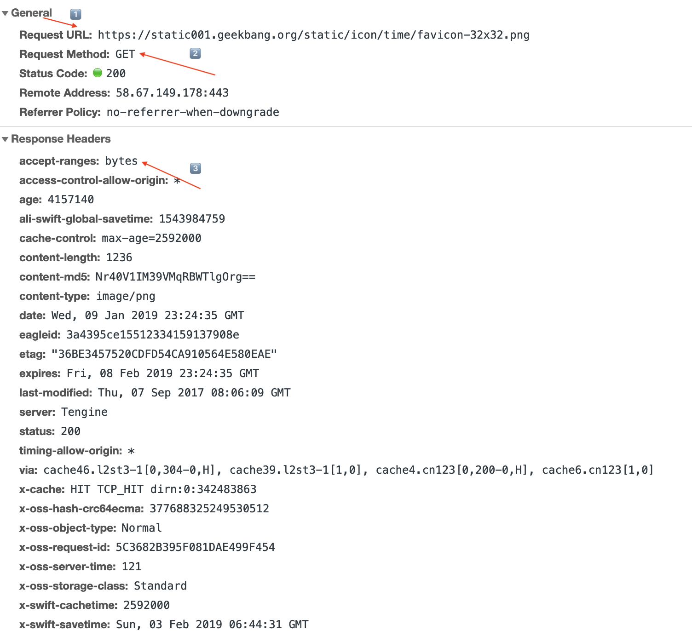

请求报文头

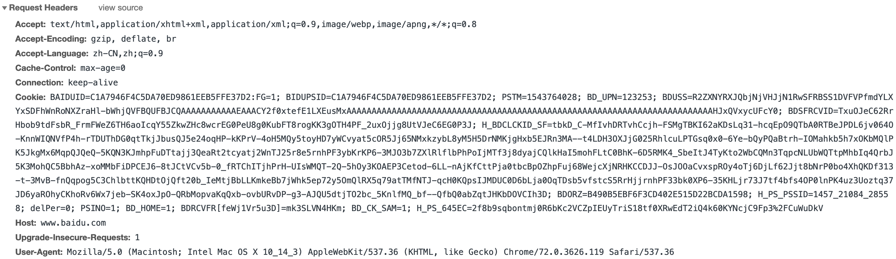

从上图来看，在浏览器抓取的报文中，包括3⃣️种首部字段，但是这里有4⃣️种介绍<br>
* 通用首部字段(General): 请求报文和响应报文两方都会使用的首部 但是上图并没有体现
* 响应首部字段(Response Headers): 从服务端向客户端返回🔙响应报文时使用的首部。补充了相应的附加内容，也会要求客户端附加额外的内容信息
* 请求首部字段(Request Headers): 从客户端向服务器端发送请求报文时使用的首部。补充了请求的附加内容、客户端信息、响应内容相关优先级
* 实体首部字段(Entity Header Fields): 针对请求报文和响应报文的实体部分使用的首部。补充了资源内容的更新时间等与实体相关的信息

介绍HTTP/1.1 首部字段:<br>
1⃣️首部通用字段解读<br>

| 首部字段名        | 说明                                                          |
| ----------------- | ------------------------------------------------------------- |
| Cache-Control     | 控制缓存行为⚠️(这是客户端和服务器协商缓存处理，下面会持续说明) |
| Connection        | 逐跳首部、连接🔗管理                                           |
| Date              | 创建报文的日期时间                                            |
| Pragma            | 报文指令                                                      |
| Trailer           | 报文末端的首部一览                                            |
| Transfer-Encoding | 指定报文主体的传输方式                                        |
| Upgrade           | 升级为其他协议                                                |
| Via               | 代理服务器的相关信息                                          |
| Warning           | 错误通知❌                                                     |

2⃣️请求首部字段解读<br>

| 首部字段            | 说明                                     |
| ------------------- | ---------------------------------------- |
| Accept              | 用户代理可处理的媒体类型                 |
| Accept-Charset      | 优先字符集                               |
| Accept-Encoding     | 优先内容编码                             |
| Accept-Language     | 优先语言                                 |
| Authorization       | Web认证信息                              |
| Expect              | 期待服务器的特定行为                     |
| From                | 用户的电子邮箱📮地址                      |
| Host                | 请求资源所在服务器                       |
| If-Match            | 比较实体标记(Etag)(Etag是一个重点的内容) |
| If-Modified-Since   | 比较资源的更新时间                       |
| If-None-Match       | 比较实体标记(与If-Match相反)             |
| If-Range            | 资源未更新时发送实体Byte的范围请求       |
| If-Unmodified-Since | 比较资源的更新时间                       |
| Max-Forwards        | 最大传输逐跳数                           |
| Proxy-Authorization | 代理服务器要求客户端的认证信息           |
| Range               | 实体的字节范围请求                       |
| Referer             | 对请求中的URI的原始获取方(原始)          |
| TE                  | 传输编码的优先级                         |
| User-Agent          | HTTP客户端信息(这里搞一下伪造)           |

3⃣️响应首部字段解读<br>

| 首部字段          | 说明                         |
| ----------------- | ---------------------------- |
| Accept-Ranges     | 是否接受字节范围请求         |
| Age               | 推算资源创建经过时间         |
| ETag              | 资源匹配信息                 |
| Location          | 令客户端重定向至指定URI      |
| Proxy-Authenicate | 代理服务器对客户端的认证信息 |
| Retry-After       | 对再次发起请求的时机要求     |
| Server            | HTTP服务器的安装信息         |
| Vary              | 代理服务器缓存的管理信息     |
| WWW-Authenticate  | 服务器对客户端的认证信息     |

4⃣️实体首部字段

| 首部字段         | 说明                   |
| ---------------- | ---------------------- |
| Allow            | 资源可支持的HTTP方法   |
| Content-Encoding | 实体主体适用的编码方式 |
| Content-Language | 实体主体的自然语言     |
| Content-Length   | 实体主体的大小         |
| Content-Location | 替代对应资源的URI      |
| Content-MD5      | 实体主体的报文摘要     |
| Content-Range    | 实体主体的位置范围     |
| Content-Type     | 实体主体的媒体📺类型    |
| Expires          | 实体主体过期的日期时间 |
| Last-Modified    | 资源的最后修改日期时间 |

首部的字段一定有存在的意义的，不会无端端就会存在的。<br>
好了，首部的字段都简介完了，接下来讲讲 POST、GET、PUT与DELETE
##### HTTP请求方法 POST、GET、PUT与DELETE 满足增删查改
这几个方法，其实一个熟悉前端的，再熟悉不过。<br>
* GET: 去服务器获取一些资源。
```
request Header:
GET /index.html HTTP/1.1
Host:www.baidu.com

response Headers:
index.html
```

对于网页访问来讲，要获取的资源往往是一个页面📃。其实也有很多其他的格式，比如说返回一个JSON字符串，要返回什么，由服务器端决定。

* POST: 主动告诉服务端一些信息，而非获取。要告诉服务端什么呢？一般方法会有参数写明。一般会放在正文中。正文可以有各种各样的格式，常见JSON

```
request Header:
POST /index.html HTTP/1.1
Host:www.baidu.com
Content-Type:text/html
Content-Length:1880

response Headers:
返回index.html接受数据后的处理结果
```

* PUT: 向指定资源的位置上传最新内容。但是HTTP服务器往往是不允许上传文件的，所以PUT和POST就都变成了要传给服务器东西的方法
```
request Header:
PUT /index.html HTTP/1.1
Host:www.baidu.com
Content-Type:text/html
Content-Length:1880

response Headers:
HTTP/1.1 204 No Content 表示该html已经存在服务器上了
```

POST往往用来创建一个资源，而PUT往往是用来修改一个资源的<br>
举个🌰: ☁️云主机已经创建了，想打一个标签，说明这个☁️云主机是生产环境的，另外一个云主机是测试环境的。那怎么修改这个标签呢？往往用PUT。

* DELETE: 删除资源，要删除一个云主机，就用DELETE 返回状态码204 No Content

* OPTIONS: 针对URI指定的资源支持的方法
```
request Header:
OPTIONS * HTTP/1.1
Host:www.baidu.com

response Headers:
HTTP/1.1 200 OK
Allow: GET,POST,HEAD,OPTIONS...
```

* CONNECT: 要求用隧道协议连接代理。在与代理服务器通信时建立隧道，实现用隧道协议进行TCP通信。主要使用SSL(Secure Sockets Layer)和TLS(Transport Layer Security)协议把通信内通加密🔐后经网络隧道传输

```
CONNECT 代理服务器名: 端口号 HTTP版本

request header:
CONNECT proxy.ibm.com:8080 HTTP/1.1
Host:proxy.ibm.com

response header:
HTTP/1.1 200 OK
```


##### HTTP响应返回的构建
HTTP返回的报文有一定的格式

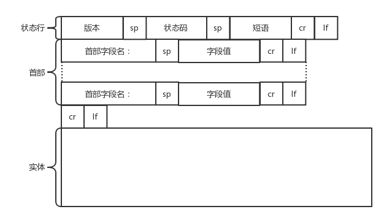

状态码会说明请求的结果，原因。在服务器构建好HTTP报文后，接下来就会将这个报文交给Socket去发送，交给TCP层，让TCP层将返回的HTML也分成一个个小的段，并且保证每个段都可达。就是将请求的流程反着走一遍，走的路径不一定相同，毕竟路由也有路由策略。到了客户端，就会根据TCP头中的端口号，发给相应的进程。<br>

##### HTTP状态码

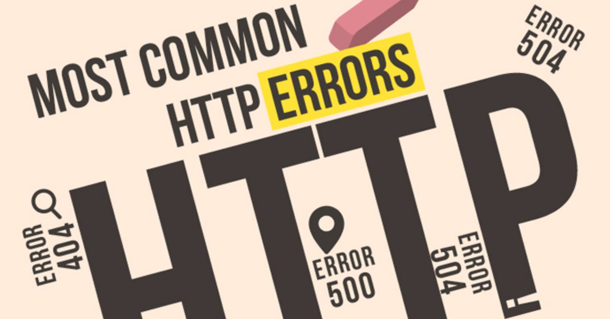

从报文头，我们都能看到这个 status 200 ok，那究竟还有什么其他的状态码吗？多到你怀疑人生...🤨<br>

#### 1XX Informational 接收的请求正在处理(在忙呢在忙呢)
**100 Continue**<br>
* 行为: HTTP/1.1 协议里设计100状态码目的是，在客户端发送Request Message之前，HTTP/1.1协议允许客户端先判定服务器是否愿意接受客户端发来的消息主体(基于Request Headers)
* 含义: 即Client和Server在POST较大数据之前，允许双方”握手🤝“，如果匹配上了，Client才开始发送(较大)数据。这样降低资源开销。因为如果客户端直接发送请求数据，但是服务器又将该请求拒绝，这样，数据就浪费了。
* 操作: 如果预期等待100-continue的应答，那么它发的请求必须包含一个"Expect:100-continue"的头域

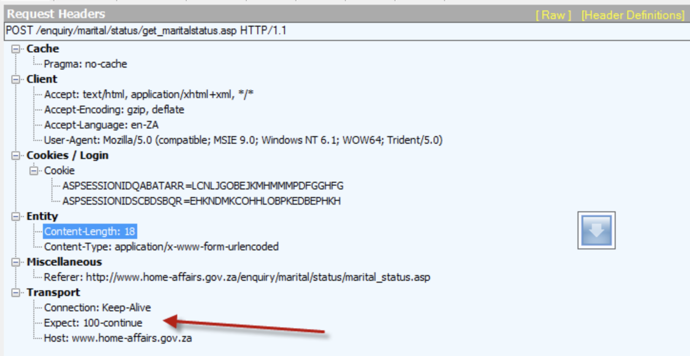

所以，客户端一般要发送较大的POST请求时，会先发一个100-continue的请求，就像上面说的那样。<br>

**101 Switching Protocols**<br>
表示访问当前资源需要更换协议进行数据传输<br>
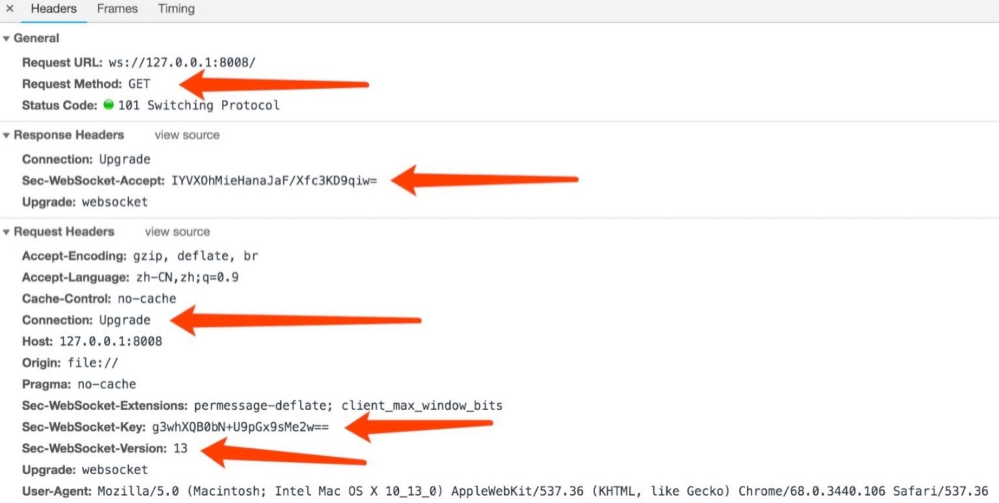

#### 2XX 你的请求已经被服务器正确处理✅ (没问题🆗)
**200 🆗**<br>
请求被服务器成功处理，服务器会根据不同的请求方式返回结果<br>

**201 Created**<br>
请求已经被实现了，而且有一个新的资源已经依据请求的需求建立了，且其URI已经随Location头信息返回。<br>
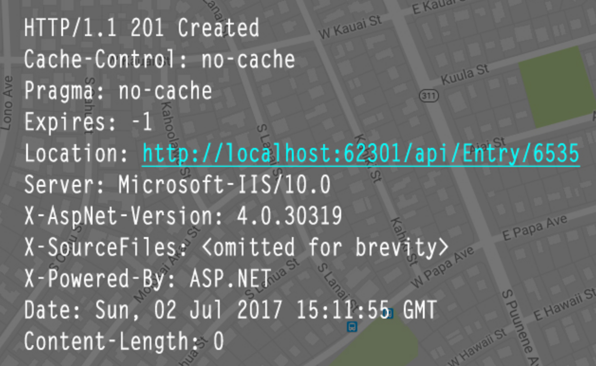

**204 No Content**<br>
1⃣️服务器已经完成了处理，但是不需要返回响应体(no content)<br>
2⃣️与200状态，没有实体返回的区别在于，浏览器处理204的状态码，只是回去读取报文头的更新信息，若UA是一个浏览器，请求的时候 `<a href="xxx">`标签形式，204是不会发生页面跳转的。相对应的200会。<br>
RFC原文描述

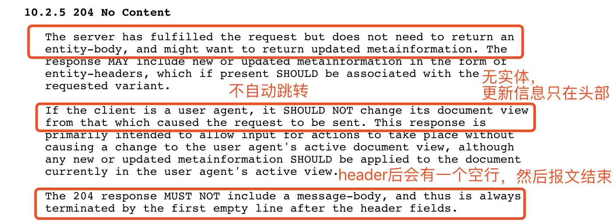

**206 Partial Content**<br>
1⃣️表示客户端发起了范围请求，而服务器只对其中一部分的请求成功处理了<br>
2⃣️此时客户端请求，必须包含有range字段，而服务端报文中，必须包含有Content-Range指定的实体内容(entity)<br>

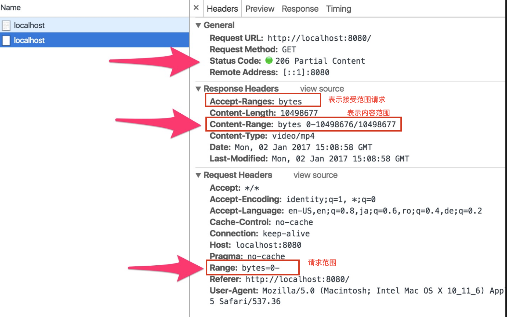

客户端发请求时对应的Range，服务器端响应时对应的是Content-Range<br>

Range字段含义:<br>
* bytes=SSS-RRR 有头有尾，表示S-R字节范围的内容 下载
* -RRR，表示最后RRR字节的内容 下载
* SSS-，表示从SSS字节开始到文件结束部分的内容 下载
* 0-0，-1，表示第一个和最后一个字节
* SSS1-RRR1,SSS2-RRR2同时指定几个范围 下载

Content-Range:<br>
用于响应头，在发出带Range的请求后，服务器会在Content-Range头部返回当前接受的范围和文件的总大小

```
Content-Range:bytes(unit first byte pos) - [last byte pos]/[entity length]

Content-Range:bytes 0-499/244242
```
0-499是指响应当前的请求数据范围，244242表示文件的总大小。响应完成后，返回的响应头内容也不同

```
HTTP/1.1 200 OK (不使用断点续传方式)
HTTP/1.1 206 Partial Content (使用断点续传方式)
```
会出现错误吗？传文件最容易出错！<br>
##### 增强校验
举个🌰 终端💻发起续传请求时，URL对应的文件内容服务端已经发生了变化，此时续传的数据肯定是错误的。如何解决这个问题呢？显然此时需要有一个标识文件唯一性的方法。<br>
在 RFC2616 中也有相应的定义，比如实现 Last-Modified 来标识文件的最后修改时间，这样即可判断出续传文件时是否已经发生过改动。同时 FC2616 中还定义有一个 ETag 的头，可以使用 ETag 头来放置文件的唯一标识。<br>
我们来看看文件发生变化之后会触动什么首部字段改变。要知道，首部字段就是告知两端信息的变化的。<br>

* Last-Modified: 与If-Modified-Since一样都是用于记录📝页面最后修改时间的HTTP头信息的。而Last-Modified是由服务器往客户端发送的HTTP头，而If-Modified-Since则是由客户端往服务器发送的头部信息。

可以看到，再次请求本地存在的缓存页面时， **客户端会通过If-Modified-Since头将先前服务器端发过来的Last-Modified最后修改时间戳发送回去** 这是为了让服务器端进行验证，通过这个时间戳判断客户端的页面是否最新，如果不是最新的，则返回新的内容，如果是最新的，则返回304 Not Modified，告诉客户端本地cache的页面是最新的。这样，客户端就可以直接从本地加载页面了，这样在网路上传输的数据就会大大减少，同时也减轻了服务器的负担。<br>

* Etag(Entity Tags): 主要为了解决Last-Modified无法解决的一些问题(什么问题？)

1. 一些文件也许会周期性更改，但是内容不变(仅仅修改了时间)，这时候，并不希望客户端会认为这个文件被改变了，而重新GET
2. 某些文件修改频繁，例如在秒以下的单位时间内修改了N次，而，If-Modified-Since能检查到的粒度是s级的，这种修改无法判断
3. 某些服务器不能精确得到文件的最后修改时间

`etag: "36BE3457520CDFD54CA910564E580EAE"` http/1.1引入Etag，唯一的标识，表示文件的版本。<br>

* If-Range: 判断实体是否发生改变，如果未改变，服务器发送客户端丢失的一部分，否则发送整个实体。一般格式

```
If-Range:Rtag|HTTP-Date

If-Range: "36BE3457520CDFD54CA910564E580EAE"
If-Range: Fri, 22 Feb 2019 03:45:02 GMT
```
也就是说，If-Range可以使用Etag或者Last-Modified返回的值。当没有Etag却有Last-Modified时，可以把Last-Modified作为If-Range字段的值<br>

If-Range必须与Range配套使用。如果请求报文中没有Range，那么If-Range就会被忽略。如果服务器不支持If-Range，那么Range就会被忽略掉。<br>

如果请求报文中的Etag与服务器目标内容的Etag相等，即没有发生变化，那么应答就是206。如果发生了变化，应答报文的状态码为200。<br>

其他用于增强校验的HTTP头信息: If-Match/If-None-Match、If-Modified-Since/If-Unmodified-Since

工作:Etag由服务器端生成，客户端通过If-Range条件判断请求来验证资源是否修改。<br>
➡️第一次请求:发起get，服务器处理请求，返回文件内容以及相应的header，其中包括Etag，状态码200
➡️第二次请求: 发起get，同时发送If-Range，服务端判断Etag和计算出来的Etag是否匹配，匹配206，不匹配200

为了保证资源可靠，首部字段也很给力。<br>

#### 3XX 服务器端已经接受到了请求，客户端必须对请求进行一些特殊的处理之后，才能顺利完成此处请求
**301 Move Permaneltly 永久重定向**<br>
301出现，表示请求的URL资源已经被分配了新的定位符，
* HEAD请求下，必须在头部Location字段中明确指出新的URI
* 除了有Location字段外，还需要在响应体中，附上永久性的URI的连接文本
* 若是客户使用POST请求，服务端若是使用重定向，则需要经过客户同意
* 对于301来说，资源除非额外指定，否则默认都是可缓存的

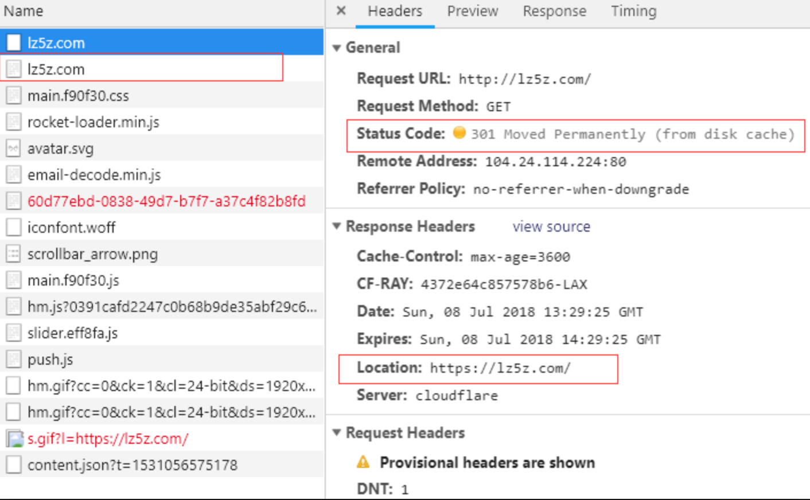

⭕️实际场景，使用http访问一些https资源的时候，浏览器设置了自动重定向https，那么首次访问就会返回301状态码<br>

**302 Found 临时重定向**<br>

* 302临时重定向，只对本次的请求进行重定向
* 若用户将本URI收藏起来，不去修改书签🔖中的指向(只是暂时的)
* 重定向的时候，RFC规范规定，不会去改变请求的方式。但实际上，很多现存的浏览器都直接将302响应视为303响应，并且在重定向的时候，使用GET方式返回报文中Location字段指明的URL
* 对于资源缓存，只有Cache-Control或Expires中进行了指定的情况下，这个响应才是可缓存的

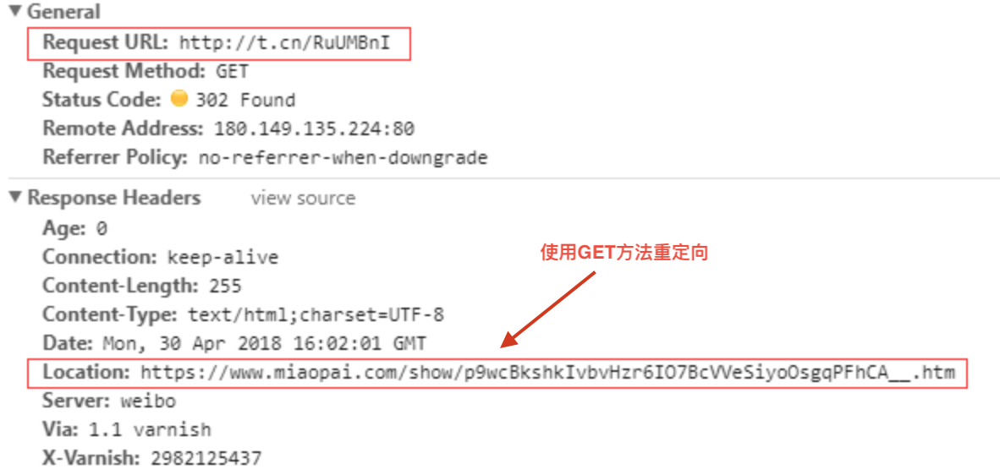

⭕️实际场景:使用网站端地址，访问的时候就会临时重定向到我们压缩前地址指向的页面<br>

**303 See Other存在着另一个资源URI(重定向)**<br>
* 表明用户请求的资源，还存在着另一个URI，其实也是重定向的含义

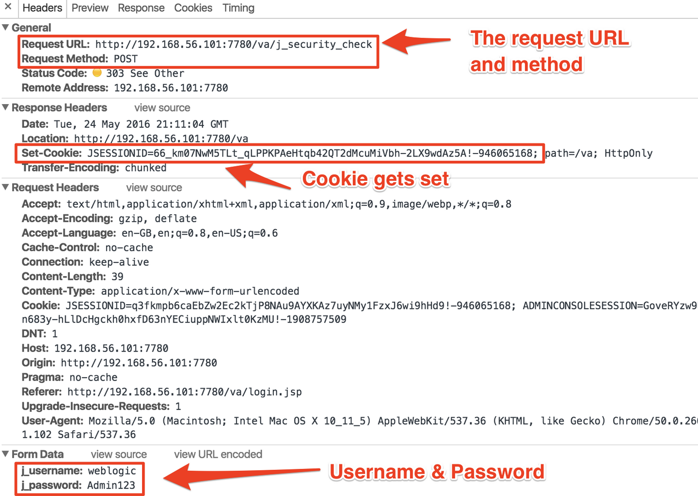

**304 Not Modified**<br>
这个乱入的状态码，硬生生成了HTTP界的一股清流。他与重定向无关。表示1⃣️本次请求命中了缓存策略，客户端可以直接从本地缓存中取出内容2⃣️304状态码返回时，不包含任何响应的主体部分<br>

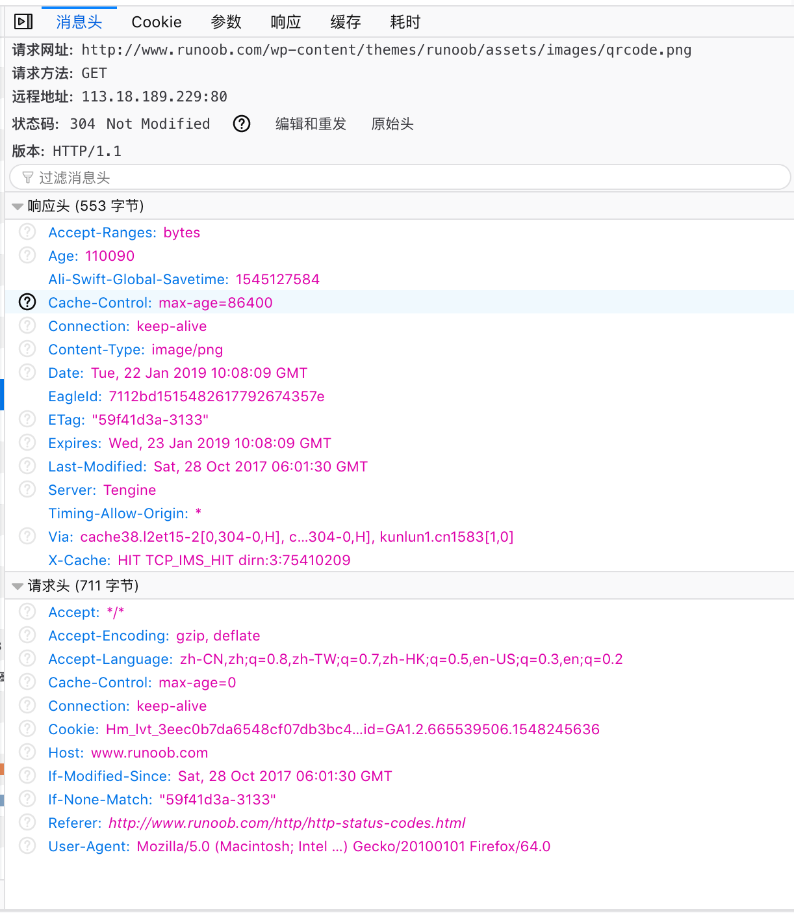

**307 Temporary Redirect**<br>
* HTTP/1.1文档中307状态码相当于HTTP1.0文档中的302状态码
* 当客户端的POST受到服务端的307响应时，需要跟用户询问是否应该在新的URI发起POST方法。307遵循浏览器标准，不会将POST改为GET。(听话的好孩子👦)

http1.0和http1.1都规定，若客户端发送的是非GET或者HEAD请求，响应头中携带301或302的时候，浏览器不会自动进行重定向，而是需要询问用户，因此此时请求的情况已经发生了变化<br>

301,RFC文档说明:

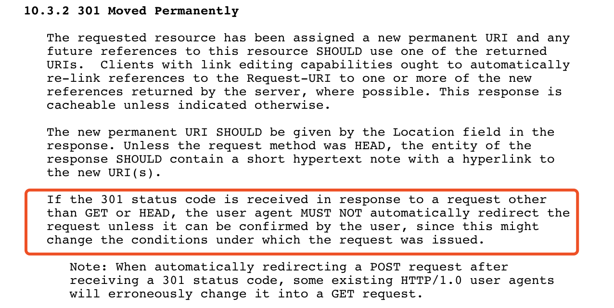

302,RFC http1.0文档说明

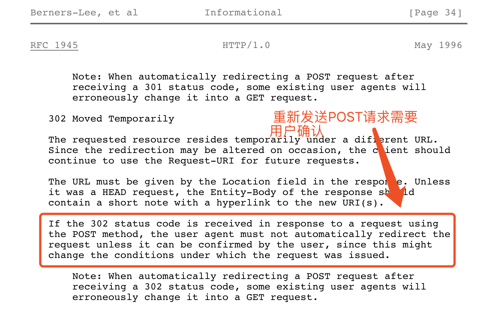

302,RFC http1.1文档说明

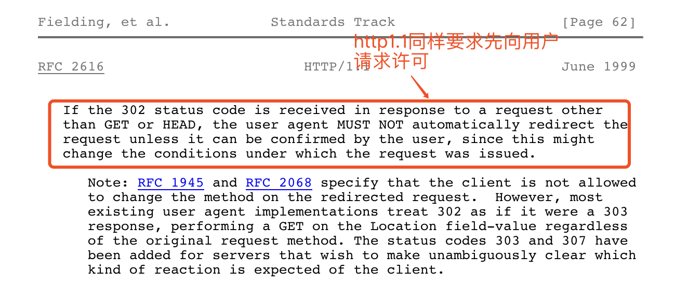

但是⭕️实际场景，所有的浏览器都会默认把POST请求直接改为GET请求<br>
301会将旧网址替换后重定向的网址，而302则会保留就有的网页内容(毕竟是暂时的，说不好什么时候又改回来，还是自己留一份比较好)<br>

#### 4XX 表明客户端是发生错误的原因所在(❌)
**400 BAD REQUEST**<br>
1⃣️表示该请求报文中`存在语法错误`，导致服务器无法理解该请求。客户端需要修改请求的内容后再次发送请求<br>
2⃣️一般也可以用于用户提交的表单内容不完全正确，服务端也可以用400响应客户(你TM错了❌)

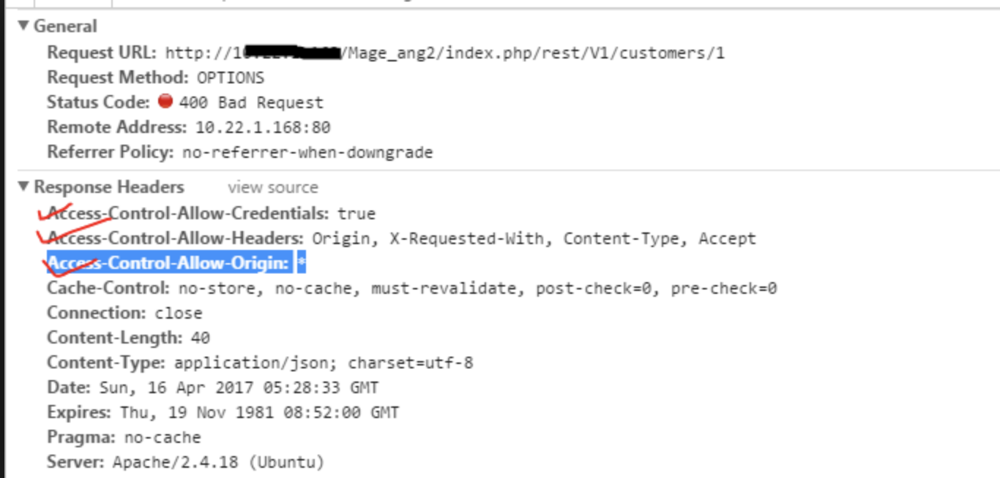

**401 UNAUTHORIZED未授权**<br>
1⃣️该状态码表示发送的请求需要有通过HTTP认证<br>
2⃣️当客户端再次请求该资源的时候，需要在请求头中的Authorization包含认证信息<br>

验证失败返回401

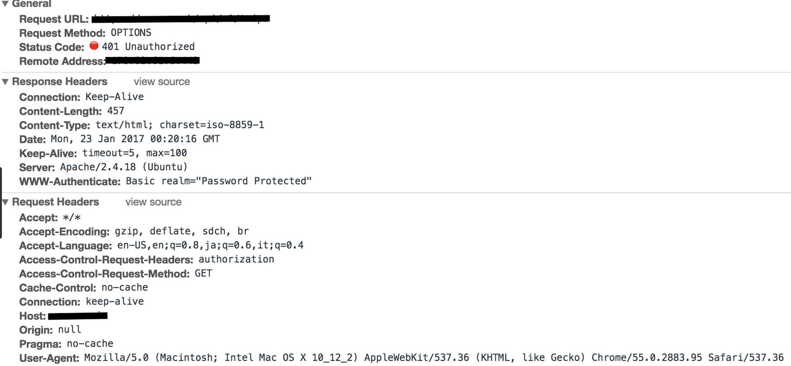

客户端主动提供Authorization信息

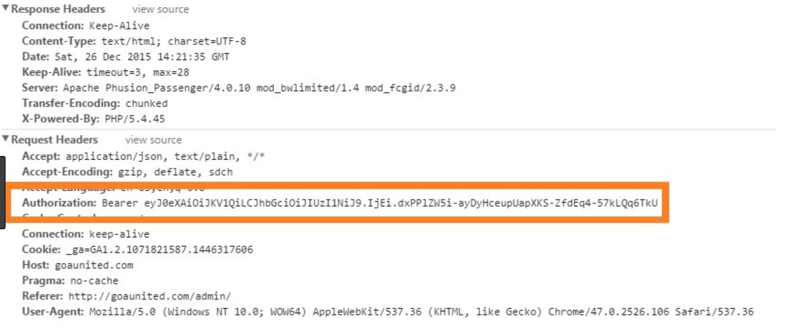

3⃣️www-authenticate:Basic表示一种简单的，有效的用户身份认证技术<br>

##### Basic 验证过程简述
1⃣️客户端访问一个受http基本认证保护的资源<br>
2⃣️服务器返回401状态码，要求客户端提供用户名和密码进行认证(验证失败的时候，响应头会加上WWW-Authenticate Basic realm="请求域")

```
401 Unauthorized
WWW-Authenticate:Basic realm="wallyworld"
```
3⃣️客户端将输入的用户名密码用Base64进行编码后，采用非加密的明文方式传送给服务器

```
Authorization:Basic xxxxxxxxx
```
4⃣️服务器将Authorization头中的用户名密码并取出，进行验证，如果验证成功，则返回相应的资源。如果认证失败，则仍返回401状态，要求重新进行认证<br>

**403 FORBIDDEN**<br>
1⃣️该状态码明显被服务器拒绝了❌<br>
2⃣️服务器没有必要给出拒绝的详细理由，但如果想做说明的话，可以在实体的主体部分原因进行描述<br>
3⃣️未获得文件系统的访问权限，访问权限出现某些问题，从未授权的发送源IP地址试图访问等情况都有可能发生403响应<br>

**404 Not Found**<br>
无法找到指定资源，通常也被服务端用户表示不想透露请求失败原因<br>

**405 Method Not Allowed**<br>
表示该资源不支持该形式的请求方式，在Response Header中返回Allow字段，携带支持的请求方式<br>

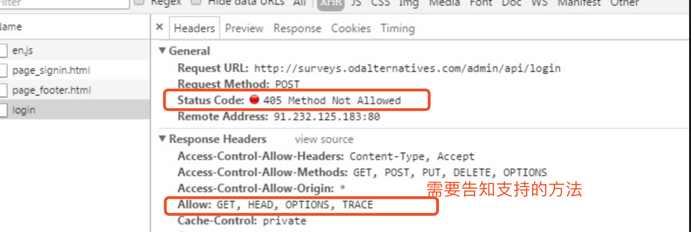

**412 Precondition Failed**<br>
在请求报文中的If-xxx字段发送到服务端后，服务端发现没有匹配上。比如 If-Match:asfdfasfsd，希望匹配ETag值<br>

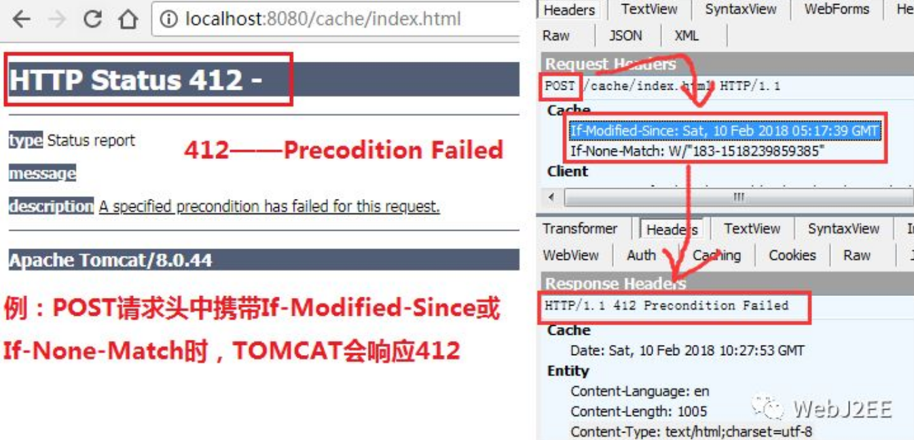

#### 5XX表示服务器本身发生错误
**500 Internal Server Error**<br>
表示服务器端在处理客户端请求的时候，服务器内部发生了错误(以前遇到这个问题都是代码出错了)

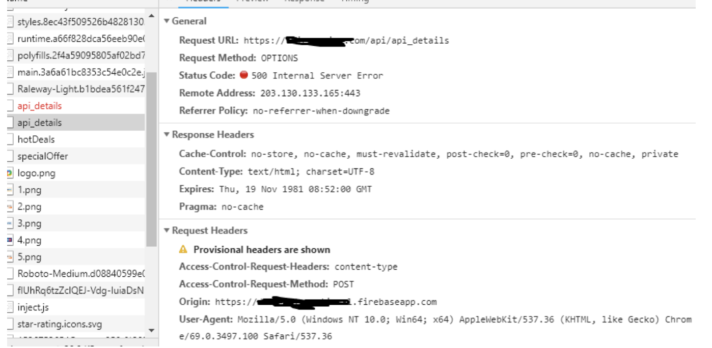

**502 Bad GateWay**<br>
1⃣️表示连接服务器的边界路由器出问题，导致不能到达(就网关路由出错)<br>

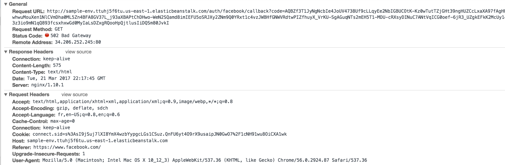

**503 Service Unavaliable**<br>
1⃣️该状态码表示服务器已经处于一个超负荷的一个状态，或者所提供的服务暂时不能够正常使用<br>
2⃣️若服务器端能够事先得知服务恢复时间，可以在返回503状态码的同时，把恢复时间写入Retry-After字段中<br>
3⃣️要是没有Retry-After，那么客户端会把这个状态码处理成500<br>

好了，讲了POST，GET等请求和状态码以及首部字段，接下来该讲缓存机制了。篇幅有限，下文继续讲。<br>


---------------------------------------------------
## HTTP2.0 基于流的传输 忍受够了等待
HTTP1.1是一个渣男，那HTTP2.0是不是呢？是的，也一样，同一个家族的怎么就不是了呢？那HTTP2.0怎样，更渣，同时撩好几个。<br>
HTTP协议在不断滴进化，演化到现在就有了HTTP2.0，HTTP1.1在应用层上以纯文本的形式进行通信。每次通信都要带完整的HTTP头，而且不考虑pipeline模式的话，每次一去一回，这样实时性、并发性都会存在问题。<br>
HTTP2.0进化级别渣男！在二进制帧、多路复用、请求优先级、流量控制、服务器端推送以及首部压缩🗜️等新改进。比HTTP1.1更快，秒男！为了吸引注意力，也是够牛掰滴<br>
HTTP协议站在(巨人的肩膀上)TCP协议之上，TCP作为传输层其实离应用层不愿。HTTP协议的瓶颈及其优化技巧都是基于TCP协议本身的特性。比如， **TCP建立连接时三次握手会有1.5个RTT(round-trip time)延迟**，为了避免每次都经历握手🤝带来的延迟，长链接(keep Alive)是一种方案。HTTP1.0被抱怨最多的就是 **连接无法复用**和 **head of line blocking**，产生两个问题的前提是客户端依据域名来向服务器建立连接，一般PC端浏览器会针对单个域名的server同时建立6～8个连接(考虑服务器的端口数量和线程切换开销的考虑，8个以内最适合[参考文章](https://blog.csdn.net/yishouwangnian/article/details/52788626?utm_source=blogxgwz8))，手机端的连接数则一般控制在4～6个。显然连接数并不是越多越好，因为资源的开销和整体延迟都会随之增大。<br>
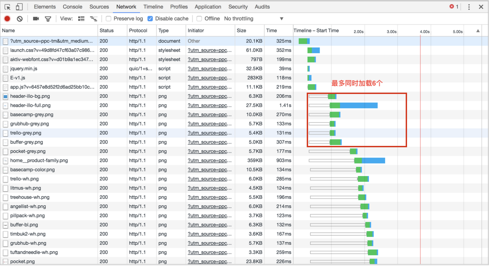

**连接无法复用**会导致每次请求都经历三次握手和慢启动。三次握手在高延迟的场景下影响较明显，慢启动则对文件类大请求影响较大。<br>
**head of line blocking** 会导致带宽无法被充分利用，以及后续请求被阻塞。假设有5个请求同时发出，如下图：<br>
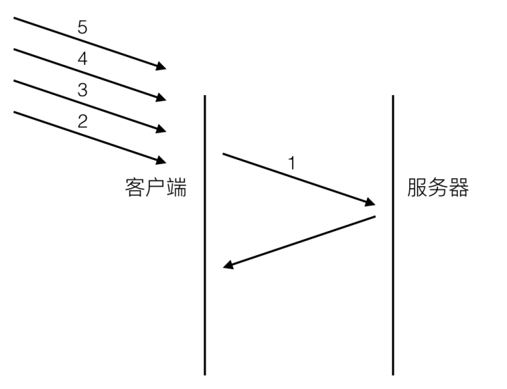

对于HTTP1.0的实现，在第一个请求没有受到回复之前，后续从应用层发出的请求只能排队，只有等1 response回来之后，才能逐个发出。网络畅通的时候性能影响不大，一旦请求1的request因为丢包或者超时等问题没有抵达服务器，或者response因为网络阻塞没回来，影响的就是所有后续请求了。<br>
* 解决连接无法复用有几种方案，分别是基于TCP长连接，http long-polling，http-streaming，web socket。但是这几种方案也有各自的缺陷<br>

* 解决head of line blocking的方案是http pipelining多路并行，但这种方案只适用于http1.1，而且只有幂等请求(GET、HEAD)能使用，非幂等POST就不行，因为请求关系可能会有先后依赖，response还要依次返回，遵循FIFO原则，[pipeling问题描述](https://www.chromium.org/developers/design-documents/network-stack/http-pipelining)<br>

#### SPDY开拓者，但只是google的玩具
HTTP2.0是以SPDY为原型进行讨论和标准化的。SPDY的目标就瞄准了HTTP1.x的痛点，延迟和安全性🔐。安全性是因为http是明文协议，安全性一直被业界诟病。

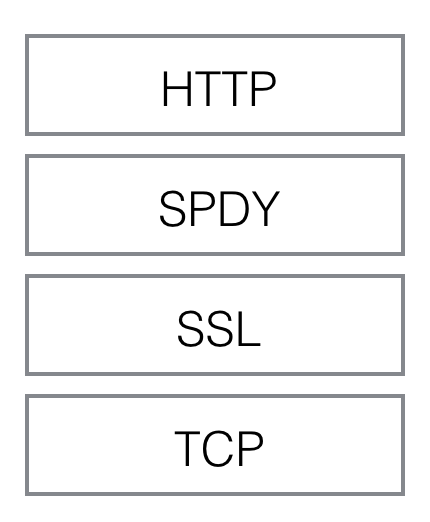

SPDY位于HTTP之下，TCP和SSL之上，这样可以兼容老版本的HTTP协议，同时使用已有的SSL功能。SPDY功能可以分为基础功能和高级功能，基础功能默认启动，高级功能手动启动<br>

**SPDY基础功能**<br>
* 多路复用（multiplexing）。多路复用通过多个请求stream共享一个tcp连接的方式，解决了http1.x holb（head of line blocking）的问题，降低了延迟同时提高了带宽的利用率。
* 请求优先级（request prioritization）。多路复用带来一个新的问题是，在连接共享的基础之上有可能会导致关键请求被阻塞。SPDY允许给每个request设置优先级，这样重要的请求就会优先得到响应。比如浏览器加载首页，首页的html内容应该优先展示，之后才是各种静态资源文件，脚本文件等加载，这样可以保证用户能第一时间看到网页内容。
* header压缩。前面提到过几次http1.x的header很多时候都是重复多余的。选择合适的压缩算法可以减小包的大小和数量。SPDY对header的压缩率可以达到80%以上，低带宽环境下效果很大。

**SPDY高级功能**<br>
* server推送（server push）。http1.x只能由客户端发起请求，然后服务器被动的发送response。开启server push之后，server通过X-Associated-Content header（X-开头的header都属于非标准的，自定义header）告知客户端会有新的内容推送过来。在用户第一次打开网站首页的时候，server将资源主动推送过来可以极大的提升用户体验。
* server暗示（server hint）。和server push不同的是，server hint并不会主动推送内容，只是告诉有新的内容产生，内容的下载还是需要客户端主动发起请求。server hint通过X-Subresources header来通知，一般应用场景是客户端需要先查询server状态，然后再下载资源，可以节约一次查询请求。

SPDY从2012年诞生到2016年就停止维护了，时间跨度对于网络协议来说非常短。但是取得的成绩非常好。对于页面加载同比http1，x减少64%，丢包率也降低了(由于对header压缩有80%以上，整体包能减少大概40%，包少，丢的也少)，带宽延迟减小(一般RTT越大，延迟越大，在高RTT的场景下，由于SPDY的request是并发进行的，对包的利用率高，反而能更明显减小总体延迟)，这都足以让他称霸一时。<br>

讲了那么多历史，接下来开始讲讲HTTP2.0<br>
### HTTP2.0 业界的焦点
HTTP2.0协议到底提高了哪些方面。首先要清楚一点，HTTP2.0较于SPDY并没有SSL层和TLS层，HTTP2.0并没有做安全的套件。为什么？其实加上也是可以的啊，所以如果只是担心一个多余的RTT延迟，就不用SSL，请求的成功率就不高，所以如果HTTP2.0加上SSL，被封装的request就不会被监听和修改，请求的成功率自然上升🔝<br>
那么HTTP2.0到底提高了哪些方面？新的二进制格式(Binary Format)，连接共享，header压缩🗜️，压缩算法的选择，重置连接表现更好，Server Push，流量控制，Nagle Algorithm与TCP Delayed Ack，更安全的SSL。<br>
#### 新的二进制格式 帧让一切变得简洁
HTTP2.0性能增强的核心在于新增的二进制分帧层，定义了如何封装HTTP消息并在客户端与服务器之间传输。


那么每个帧又是怎么定义呢？

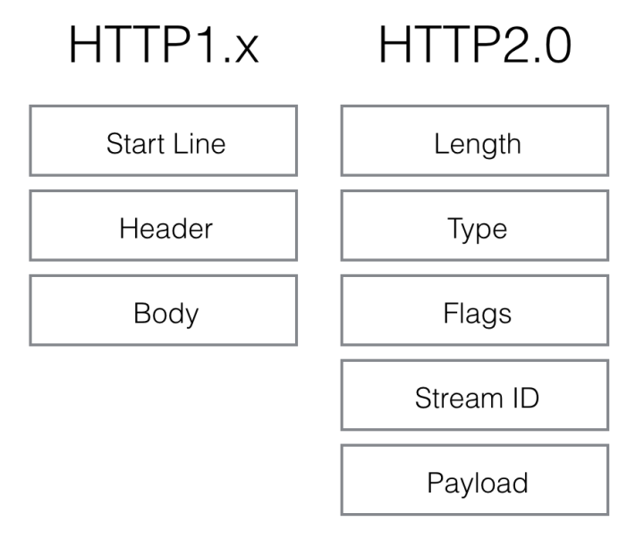

上图对比了HTTP1.x以文本格式为基础和http2.0类似tcp/ip这种二进制帧为基础的不同。

帧的格式

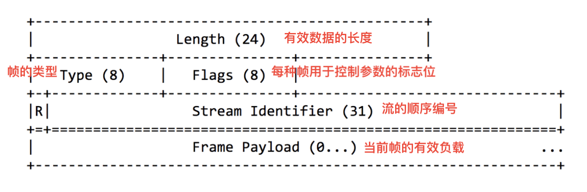

http2.0的格式定义更接近于TCP层的方式。length定义了整个frame的长度，type定义了frame的类型(一共10种)，flags用bit位定义一些重要的参数，stream id用作流的控制，payload就是request的正文部分。<br>

| 名称 类型     | 帧代码 | 作用                                                                                                                         |
| ------------- | ------ | ---------------------------------------------------------------------------------------------------------------------------- |
| DATA          | 0x0    | 一个或多个DATA帧作为请求、响应内容载体                                                                                       |
| HEADERS       | 0x1    | 报头主要载体，请求头或响应头，同时呢也用于打开一个流，在流处于打开"open"或者远程半关闭"half closed (remote)"状态都可以发送。 |
| PRIORITY      | 0x2    | 表达了发送方对流优先级权重的建议值，在流的任何状态下都可以发送，包括空闲或关闭的流。                                         |
| RST_STREAM    | 0x3    | 表达了发送方对流优先级权重的建议值，任何时间任何流都可以发送，包括空闲或关闭的流。                                           |
| SETTINGS      | 0x4    | 设置帧，接收者向发送者通告己方设定，服务器端在连接成功后必须第一个发送的帧。                                                 |
| PUSH_PROMISE  | 0x5    | 服务器端通知对端初始化一个新的推送流准备稍后推送数据                                                                         |
| PING          | 0x6    | 优先级帧，发送者测量最小往返时间，心跳机制用于检测空闲连接是否有效。                                                         |
| GOAWAY        | 0x7    | 一端通知对端较为优雅的方式停止创建流，同时还要完成之前已建立流的任务。                                                       |
| WINDOW_UPDATE | 0x8    | 流量控制帧，作用于单个流以及整个连接，但只能影响两个端点之间传输的DATA数据帧。但需注意，中介不转发此帧。                     |
| CONTINUATION  | 0x9    | 用于协助HEADERS/PUSH_PROMISE等单帧无法包含完整的报头剩余部分数据                                                             |

针对不同类型的资源，HTTP2进行了不同程度的优先传输。例如页面传输中，script和link会被优先传输，类似图片这种大文件。优先级降低<br>

实际上http2.0并没有改变http1.x的语义，只是把原来http1.x的header和body部分用frame重新封装了一层而已。调试的时候浏览器甚至会把http2.0的frame自动还原成1.x的格式。所以不需要担心调试。<br>

#### 连接共享 HTTP2.0所有通信都在一个连接上完成，这个连接可以承载任意数量的双向数据流
http2.0要解决的一大难题就是多路复用(MultiPlexing)。stream id就是用作连接共享机制的。一个request对应一个stream并分配一个id，这样一个联机上可以有多个stream，每个stream的frame可以随机的混杂在一起，接收方可以根据stream id将frame再归属到各自不同的request里面。<br>
前面提到过连接共享之后，需要优先级和请求依赖的机制配合才能解决关键请求被阻塞的问题。HTTP2.0里的每个stream都可以设置有优先级和依赖。优先级高的stream会被server优先处理和返回给客户端，stream还可以依赖其他的sub streams。优先级和依赖都是可以动态调整的。动态调整在有些场景下很有用，假想用户在用你的app浏览商品的时候，快速的滑动到了商品列表的底部，但前面的请求先发出，如果不把后面的请求优先级设高，用户当前浏览的图片要到最后才能下载完成，显然体验没有设置优先级好。同理依赖在有些场景下也有妙用。<br>

再详细到流，消息和帧<br>
* 流，已经建立再连接上的双向字节流
* 消息，与逻辑消息对应的完整的一系列数据帧
* 帧，HTTP2.0通信的最小单位，每个帧包含帧首部， **至少也会标识出当前帧所属的流**

每个数据流以消息的形式发送，而消息由一或多个帧组成，这些帧可以乱序发送，然后根据每个帧首部的流标识符重新组装。<br>


HTTP2.0把HTTP协议通信的基本单位缩小为一个一个帧，这些帧对应着逻辑流中的消息，相应地，很多流可以并行地在同一个TCP连接上交换消息。<br>

#### header压缩 压缩首部元数据
两端既然都知道首部的值，就不用重复发送了，也压缩🗜️成一个简单的帧发送。<br>


请求的第一个流已经有了header帧，在连接的时候已经有了首部的信息帧，所以可以针对之前的首部数据只编码发送差异的数据帧。<br>
如图的请求1，path:/resource与请求2，path:/new_resource，在不同的流，只编码有差异的数据。<br>
那，为什么一定要压缩呢？为了性能的提高，可以，但是还有其他解释吗？我们知道TCP的MTU最大传输但愿是1500个字节一个segment，当发送的包超过2个segment或者4k大小，就会导致网络节点阻塞，延迟，丢包率就高了，而http的header有可能会膨胀到这个超过这个大小，所以压缩。<br>

##### 压缩算法的选择 HPACK
[HPACK](https://http2.github.io/http2-spec/compression.html)点击参考header压缩算法选择<br>
具体将报文头中常见的一些字段变成一个索引值index，维护一张静态索引表(key:value)，例如把method:POST,user-agent,协议版本等，对应一个index值。<br>
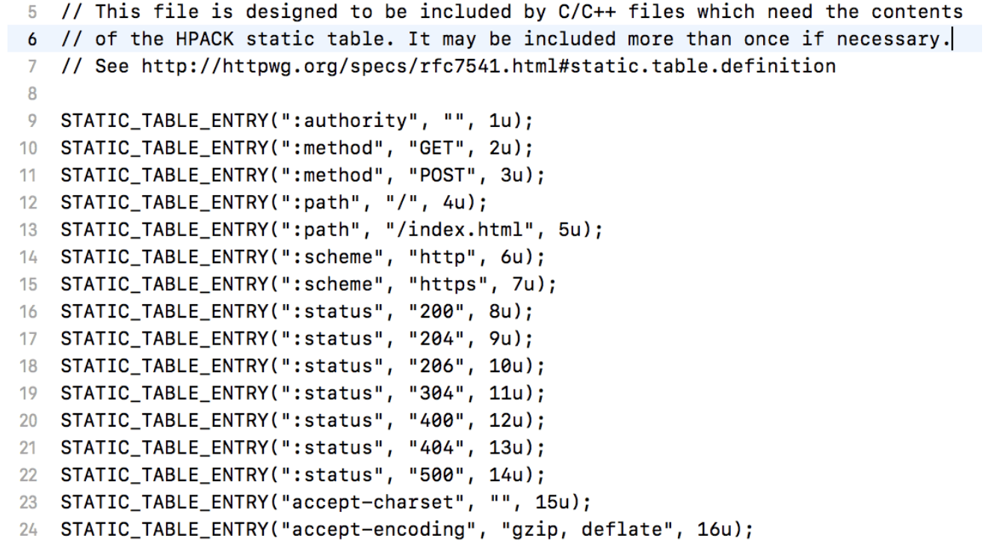

静态表格一共有61个常用字段搭配。<br>
##### 动态索引表
动态索引表功能类似于静态索引表，动态索引表的索引存放在静态索引表中。请求发现了新内容，则在动态索引表中建立新的索引，而就旧的索引表依然可以用于查询。<br>
动态索引表格，从62开始计算，有新的字段增加，就用最小的索引去记录它，而不是使用大的索引
```
table_.push_front(entry);
```
##### huffman压缩 贪心策略
对于经常变化的内容，类似于"资源路径"，HPACK压缩则使用Huffman编码进行压缩。因为请求的文件过大，查结果一个TCP报文时，会被分成几个TCP报文进行传输，压缩能够有效的减少TCP传输的数目。<br>
#### 重置连接会表现🉐️更好
很多客户端都有取消图片下载的功能，这个对于http1.x来说怎么做到呢？通过设置tcp segment里的reset flag来通知对端关闭连接的。这种方式会直接断开连接，reset嘛，在tcp就是重置，断开。下次再发请求就必须重新建立连接。 **而HTTP2.0引入RST_STREAM类型的frame，可以不断开链接的前提下取消某个request的stream。**<br>

#### Server Push 服务器可以对一个客户端请求发送多个响应
Server Push，SPDY的产物，HTTP1.x都是客户端请求才有的响应，而HTTP2.0通过push的方式将客户端需要的内容预先推送过去，所以也叫"cache push”。另外，⚠️客户端如果推出某个业务场景，处于流量的控制或者其他因素就取消server push，也可以通过发送RST_STREAM类型的frame来做到。<br>
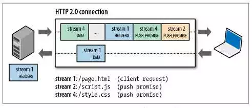

就像上面👆，服务端根据客户端的请求，提前返回多个响应，推送额外的资源给客户端。客户端请求stream1(/page.html)。服务端同时推送stream2，stream3<br>

##### 服务器推送如何工作？
* PUSH_PROMISE帧是服务端向客户端有意推送资源的信号
* PUSH_PROMISE帧只包含预推送资源的首部。如果客户端已经缓存了该资源，不需要推送，可以拒绝PUSH_PROMISE帧(客户端发送RST_STREAM帧)
* PUSH_PROMISE必须遵循请求-响应原则，只能借着请求的响应推送资源
* PUSH_PROMISE帧必须在返回响应之前发送，以免客户端出现竞态条件
* HTTP2.0连接后，客户端与服务端交换SETTINGS帧，借此限定双向并发的最大数量。因此，客户端可以限定推送流的数量，或者通过把这个只设置为0来完全禁止服务器推送
* 所有推送的资源都必须遵守同源策略。换句话说，服务器不能随便将第三方资源推动给客户端，而必须是经过双方确认才行
🌰
在客户端请求想服务端请求过一个资源"A"后，而服务端"预先"知道，客户端很有可能也会需要另一个资源"B"。 那么服务端就会在客户端请求“B”之前，主动将资源“B”推送给客户端

```
## nginx 配置文件
location = /html/baidu/index.html {   ## 表示在访问这个地址的时候
    # 主动向客户端推送以下资源   
    http2_push /html/baidu/main.js?ver=1;
    http2_push /html/baidu/main.css;
    http2_push /html/baidu/image/0.png;  
    http2_push /html/baidu/image/1.png;  
    http2_push /html/baidu/image/2.png;
    http2_push /html/baidu/image/3.png;
    http2_push /html/baidu/image/4.png;
    http2_push /html/baidu/image/5.png;
    http2_push /html/baidu/image/6.png;
}
```
根据上图的配置，客户端请求/html/baidu/index.html页面的时候，服务器不会马上返回页面的信息，而是首先将所配置资源以数据帧的形式，与客户端建立多条stream。这样可以有效减少资源所需的响应时间，而浏览器收到服务器的主动推送，就可以直接进行下载阶段。<br>
#### 更安全的SSL
HTTP2.0使用了tls的拓展ALPN来做协议升级，除此之外加密这块还有一个改动，HTTP2.0对tls的安全性做了近一步加强，通过黑名单机制禁用了几百种不再安全的加密算法，一些加密算法可能还在被继续使用。如果在ssl协商过程当中，客户端和server的cipher suite没有交集，直接就会导致协商失败，从而请求失败。在server端部署http2.0的时候要特别注意这一点。<br>

##### 一个对比 HTTP1.1🆚HTTP2.0
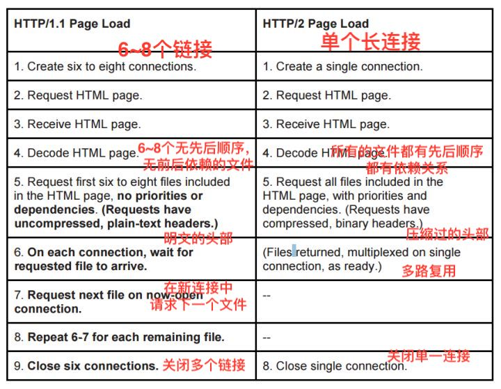
##### 说在最后
为什么说HTTP协议家族就是一个渣男？是因为他没有负上责任。HTTP1.1性能上比HTTP1.0更好，因为他用长连接解决了原始问题，但是只能单路使用，容易造成head line of blocking，而HTTP2.0比HTTP1.1还更好，他解决了多路复用的问题。这都是因为HTTP无状态的设计，带来的问题解决。HTTP也只有无状态设计才能处理大量事务。

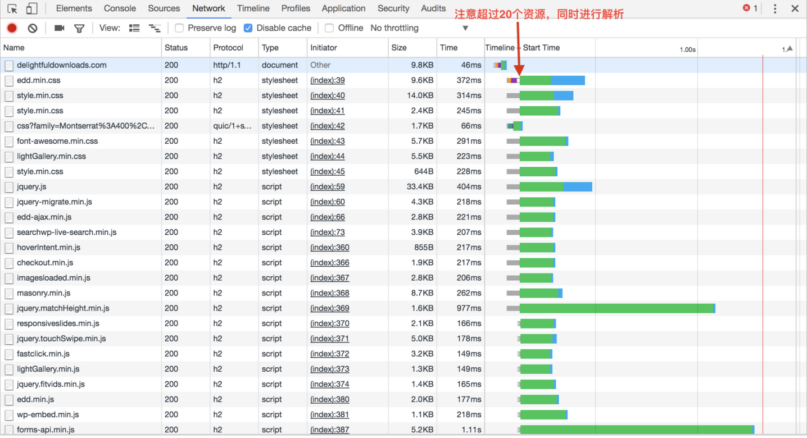

下一篇，将了解HTTPS，http+ssl+tls<br>

**参考连接**<br>
* [http2.0](https://www.cnblogs.com/Leo_wl/p/5763001.html)
* [HTTP/2.0 相比1.0有哪些重大改进？](https://www.zhihu.com/question/34074946/answer/108588042)
* [HTTP---HTTP2.0新特性](https://juejin.im/post/5a4dfb2ef265da43305ee2d0)
* [览器允许的并发请求资源数是有限制的-分析](https://blog.csdn.net/yishouwangnian/article/details/52788626?utm_source=blogxgwz8)

-------------------------------------------------------------------

## QUIC协议"城会玩" UDP也是我的主场
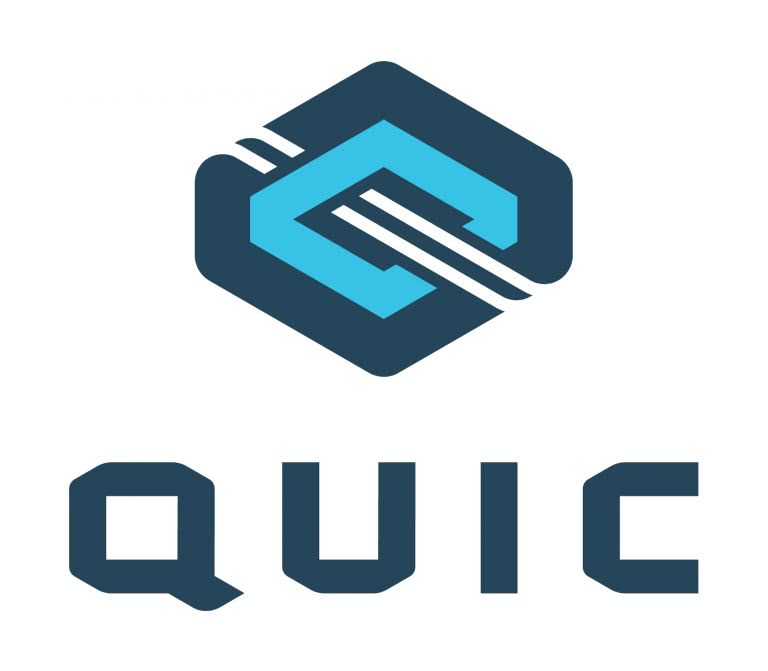

HTTP2.0虽然大大增加了并发性，但是还有问题。为什么呢？我们从底层TCP继续看，因为HTTP2.0也是基于TCP协议的，TCP协议在处理包时是有严格的顺序的。其中一个包遇到问题，TCP连接需要等待这个包完成重传之后才能继续进行。虽然，HTTP2.0通过多个stream，使得逻辑上一个TCP连接上的并行内容，并行多路数据的传输，然而中间并没有关联的数据。一前一后，前面stream2的帧没有收到，后面的stream1的帧也会因此阻塞。所以，HTTP2.0基于TCP实现还是要看TCP的可靠工作。贴近TCP报文设计，但还是得遵循TCP的传输规则，丢包还是要重传，响应还是按顺序来响应。<br>
这就给UDP表现的机会了。
#### 自定义连接机制 UDP报文简单，自定义成为可能
一条TCP连接是由四元组标识(源IP、源端口、目的IP、目的端口)，这个在网络通信是socket的参数。一旦一个元素发生变化时，就需要断开重连，重新连接。在移动互联网的情况下，当手机信号不稳定或者在WIFI和移动网络切换时，都会导致重连，从而进行再次的三次握手🤝，导致一定的时延。<br>
TCP也没有办法啊，TCP要可靠呀，断了就重连呀。但是基于UDP就不同，QUIC自己的逻辑里面维护连接的机制，不再以四元组标识，而是 **以一个64位的随机数作为ID来标识(聪明)**，而且UDP是无链接的，所以当IP或者端口变化的时候，只要ID不变，就不需要重新建立连接。<br>
所以UDP接收包，只需要检测ID匹配就行，匹配了就交给自己的应用，不匹配就继续放回数据链路继续吓一跳。<br>
#### 自定义重传机制 我用UDP，爱咋地就咋地
TCP为了保证可靠性，通过使用序号和应答机制，来解决顺序问题和丢包问题。<br>
任何一个序号的包发过去，都要在一定的时间内得到应答，否则一旦超时，就会重发这个序号的包。那怎么样才算超时？UDP怎样超时？TCP有 **自适应重传算法**，通过采样往返时间RTT不断调整。但是这个超时的采样存在不准确，例如，发一个包，序号100，发现没有返回，再发一个包100，过一阵返回ACK101。这个时候客户端知道这个包肯定收到了，但是往返时间怎么算？ACK到达时间减去后一个100发送的时间吗？时间算断了，减去前一个100发送的时间呢？时间算长了。<br>


QUIC也有序列号，递增，比TCP的序列号高级。任何一个序列号的包只发送一次，下次要是在发送就➕1。例如，发一个包100，没返回，再发送就101，如果返回ACK100，就是对第一个包的响应，如果返回ACK101，就是对第二个包的响应，RTT计算就相对准确。<br>
但是这里就有一个问题了，怎么知道包100和包101发送的是同样的内容呢？QUIC定义了一个offset概念。QUIC既然是面向连接的，就像TCP一样，是一个数据流，发送的数据在这个数据流里面有个偏移量offset，可以通过offset查看数据发送到哪里，这样只要这个offset包没有来，就要重发，如果来了，按照offset拼接，还是能够拼成一个流<br>

#### 无阻塞的多路复用
有了自定义的连接和重传机制，就可以解决多路复用问题。为什么？和HTTP2.0一样，同一条QUIC连接上可以创建多个stream，来发送多个HTTP请求。但是QUIC是基于UDP的，一个连接上的多个stream之间没有依赖。这样，加入stream2丢了一个UDP包，后面跟着stream3的一个UDP包，虽然stream2的那个包需要重传，但是stream3的包不需要等待，也可以直接发给用户(通过stream2应答，告诉对端需要重传)<br>
#### 自定义流量控制
TCP流量控制是通过滑动窗口协议。 **QUIC的流量控制也是通过window_update**，来告诉对端他可以接受的字节数。但是QUIC的窗口是适应自己的多路复用机制的，不但在一个连接上控制窗口，还在一个连接中的每个stream控制窗口。<br>
还记得吗？在TCP协议中，接收端的窗口的起始点是下一个要接收并且ACK的包。即便后来的包都到了，放在缓存里面，窗口也不能右移，因为TCP的ACK机制是基于序列号的累计应答，一旦ACK了一个系列号，就说明前面的都到了，所以只要前面的没到，后面的到了也不能ACK，就会导致后面的到了，也有可能超时重传，浪费带宽。<br>
而QUIC的ACK是基于offset的，每个offset的包来了，进了缓存，就可以应答，应答后就不会重发，中间的空挡会等待到来或者重发即可，而窗口的起始位置为当前收到的最大的offset，从这个offset到当前的stream所能容纳的最大缓存，是真正的窗口大小。


另外还有整个连接的窗口，需要对于所有的stream的窗口做一个统计。<br>