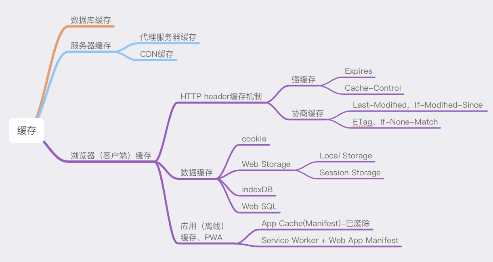

## （5.1）http

### 1. concepts
HTTP协议是一种应用层协议,主要用于在Web浏览器和Web服务器之间传输数据.在你的文件中,HTTP协议的内容主要包括以下几个部分:

1. **请求方法**:HTTP的请求方法包括GET, POST, PUT, DELETE等.这些方法定义了客户端可以对服务器上的资源执行的操作.

2. **URL**:URL是统一资源定位符,用于指定网络上的资源的位置.

3. **请求头**:请求头包含了关于请求的元数据,如客户端类型/接受的内容类型等.

4. **请求体**:请求体包含了发送给服务器的数据.

5. **响应状态码**:响应状态码表示了请求的处理结果.例如,200表示请求成功,404表示请求的资源未找到.

6. **响应头**:响应头包含了关于响应的元数据,如内容类型/内容长度等.

7. **响应体**:响应体包含了服务器返回的数据.

8. **Cookies**:Cookies是服务器发送到用户浏览器并保存在浏览器上的一种数据,它可以让服务器记住用户的信息.

9. **Session**:Session是服务器端用来保存用户状态的一种机制.

10. **Cache**:缓存是一种优化机制,可以让浏览器保存服务器返回的资源,以便在下次请求时直接使用,而不必再次向服务器请求.

以上就是HTTP协议的主要内容.

#### 1.1 请求方法
HTTP的请求方法包括GET,POST,PUT,DELETE四种基本方法.(四种方法中只有POST不是操作幂等性的)

get和post的区别:
1. get方法不会修改服务器上的资源,它的查询是没有副作用的,而post有可能会修改服务器上的资源
2. get可以保存为书签,可以用缓存来优化,而post不可以
3. get把请求附在url上,而post把参数附在http包的包体中
4. 浏览器和服务器一般对get方法所提交的url长度有限制,一般是1k或者2k,而对post方法所传输的参数大小限制为80k到4M不等
5. post可以传输二进制编码的信息,get的参数一般只支持ASCII

#### 1.2 URL

#### 1.3 请求头
#### 1.4 请求体
#### 1.5 响应状态码
- ***HTTP返回状态码有哪些?***

  - `200` 客户端请求成功
  - `30x` 重定向
  - `40x` 客户端有问题,404表示客户端提交url不存在,403表示服务器拒绝客户端访问
  通常服务器会返回401(未授权)或403(禁止)错误,而不是405错误.401错误表示需要身份验证,客户端应该重新发送请求,提供正确的认证信息.403错误表示服务器理解了请求,但是拒绝执行,这通常表示账号密码错误或者账号没有权限访问请求的资源.
  - `50x` 服务器有问题,服务器当前不能够响应请求.
#### 1.6 响应头
#### 1.7 响应体
#### 1.8 cookies
#### 1.9 session
#### 1.10 cache

### 2. quiz
#### 2.1 网页解析的过程与实现方法
这里仅展示浏览器解析服务器响应的过程,URL解析和交互的完整过程在(9)
* 首先是html文档解析,浏览器会将html文档生成解析树,也就是DOM树,它由dom元素以及属性节点组成.
* 然后浏览器加载过程中如果遇到了外部css文件或者图片资源,还会另外发送请求来获取css文件和资源,这个请求通常是异步的,不会影响html文档的加载.
* 不过如果浏览器在加载时遇到了js文件,则会挂起渲染的线程,等待js文件加载解析完毕才恢复html的渲染线程.
* 然后是css解析,将css文件解析为样式表对象来渲染DOM树.
* 
#### 2.2 在浏览器中输入URL后执行的全部过程(如www.baidu.com)
1. 首先是域名解析,客户端使用DNS协议将URL解析为对应的IP地址;
2. 然后建立TCP连接,客户端与服务器通过三次握手建立TCP连接;
3. 接着是http连接,客户端向服务器发送http连接请求; (http连接无需额外连接,直接通过已经建立的TCP连接发送)
4. 服务器对客户端发来的http请求进行处理,并返回响应;
5. 客户端接收到http响应,将结果渲染展示给用户.

#### 2.3 http/1.0和http/1.1的区别
HTTP 协议老的标准是 HTTP/1.0 ,目前最通用的标准是 HTTP/1.1 .
HTTP1.0 只保持短暂的连接,浏览器的每次请求都需要与服务器建立一个 TCP 连接,但是最新的http/1.0加入了长连接,只需要在客户端给服务器发送的http报文头部加入Connection:keep-alive
HTTP 1.1 支持持久连接,默认进行持久连接,在一个 TCP 连接上可以传送多个 HTTP 请求和响应,减少了建立和关闭连接的消耗和延迟.


#### 2.4 谈谈GET和POST的区别?
um...何必呢?其实我们都知道,HTTP是基于TCP🔗链接的,所以所有的方法,都是可以自己写的,只不过基于标准我们一起定义了上述几种请求方法.所以对于GET和POST请求,上面的说法是正确的,都是从服务器上拿资源.看似GET只能某种获取资源,但是同样他也能告知服务器参数,已经需要的资源处理结果.POST同样,只不过,在万维网的世界里,GET请求做事要做出面在url上填参数,而POST就不会,而是把东西都放在肚子里,到了服务器端,再跟服务器说.当然,也可以在POST上的url填参数,不过这样做有点,暴露信息,何必呢?<br>

当然HTTP对GET和POST参数的传递渠道提出了要求(url或者request body).GET请求比较苦逼,URL,也就是浏览器会限制🚫长度在2K个字节,而(大多数)服务器最多处理64K字节大小的url.超过部分,恕不处理(臣妾做不到啊!).所以,要是在GET请求URL大量写入参数,服务器,处理不了...就GG,而且,URL也填不了那么多啊.如果使用request body,有些服务器会处理,但是有些服务器就直接忽略,根据get请求,服务器处理的方法也不同.<br>

所以我说,基于TCP连接的GET和POST其实没什么差别,只是HTTP标准让他们出现了差别.<br>
所以面试官错了吗?因为HTTP标准就这点区别?并不是,其实基于TCP连接, **GET会产生一个TCP数据包,POST会产生两个TCP数据包**<br>
* 对于GET方式的请求,浏览器会把http header和data一并发送出去,服务器响应200 OK返回数据.
* 对于POST方式请求,浏览器会先发送header,服务器响应100 continue,表示,来!我们可以发送数据了.浏览器再去亲吻服务器,服务器就响应200

因为POST需要两步,所以时间上会消耗一点,但是资源就不会被浪费.<br>
所以,这时候面试官会说什么,真棒👍<br>


## 缓存总览:从性能优化的角度看缓存 Cache-Control


前面的状态码304说可以直接从本地获取资源，因为返回304代表资源未曾改变，浏览器直接使用本地缓存。我们知道HTTP是渣男，从来不负责任，不保存什么状态，也不会负责记录之前的请求和响应内容。<br>
那浏览器就不能依赖HTTP这个请求来做，浏览器就自己来做缓存。根据响应回来的信息，做记录📝，就是缓存，没错了，接下来就要讲讲这个缓存机制<br>
#### 缓存的作用 重用已获取的资源，减少延迟与网络阻塞，进而减少显示某个资源所用的时间
借助HTTP缓存，Web站点变得具有响应性<br>
其实我们对于页面静态资源的要求就两点
* 静态资源的加载速度
* 页面渲染速度

页面渲染速度建立在资源加载速度之上，但不同类型的加载顺序和实际也会对其产生影响，所以缓存的可操作空间非常大。<br>
缓存的作用很明显，但是对于浏览器缓存机制，是不是也会有区分呢？也就是说，对于缓存机制也会有不同，进而提升性能呢？对，没错。路由器有路由器的策略，让转发的速度可以根据路由策略而控制，性能提高。贪心算法有贪心策略，让性能不至于降低特别多。当然浏览器也会有自己的缓存策略，让自己的性能也不会至于降低。但凡涉及优化性能都会有一个策略。<br>
### 浏览器缓存机制:强缓存、协商缓存
良好的缓存策略可以降低资源的重复加载提高网页的整体加载速度，通常浏览器缓存策略分为两种:一种是强缓存，一种是协商缓存<br>
##### 基本原理
* 浏览器在加载资源的时候，根据请求头的expires和cache-control判断是否命中强缓存，则直接从缓存读取资源，不会发请求到服务器(什么是强缓存？为什么不用发请求？)
* 如果 **没有命中强缓存，浏览器一定会发送一个请求到服务器**，通过last-modified和etag验证资源是否命中协商缓存，如果命中，服务器会将这个请求返回，但是不会返回这个资源的额数据，依然是从缓存中读取资源(304)(协商发送了请求，返回304)
* 如果前面两者都没有命中，直接从服务器加载资源

为什么强缓存没有发送请求呢？
#### 强缓存 Expires与Cache-Control
Expires是http1.0提出的一个表示资源过期时间的header，描述的是一个绝对时间，由服务器返回。这个在前面谈到的实体报文首部字段有论述。Expires受限于本地时间，如果修改了本地时间，可能会造成缓存失效。<br>

```
expires: Tue, 18 Feb 2020 01:18:41 GMT
```
这就是服务器返回正文报文首部字段的expires。是服务器的预计失效时间<br>

Cache-Control出现于HTTP/1.1，优先级高于Expires，表示相对时间

```
cache-control: must-revalidate, max-age=31536000
```
咦？must-revalidate，什么鬼？这时候我们不如先了解一下cache-control整个指令的意义。<br>

##### 通过指定cache-control指令，就能操作缓存的工作机制
指令的参数是可选的，多个指令之间通过","分隔。首部字段Cache-Control指令可用于请求以及响应时。(是个通用首部字段)<br>
```
cache-control: private,must-revalidate, max-age=31536000
```

cache-control指令一览表<br>

缓存请求指令<br>

指令|参数|说明
|--|--|--|
no-cache|无|强制向源服务器再验证
no-store|无|不缓存请求或响应的任何内容
max-age=s|必须|响应的最大Age值
max-stale=s|可省略|接收已过期的响应
min-fresh=s|必须|期望在指定时间内的响应仍有效
no-transform|无|代理不可更改媒体类型
only-if-cached|无|从缓存获取资源
cache-extension|-|新指令标记(token)

缓存响应指令<br>

指令|参数|说明
|--|--|--|
public|无|可向任意方提供响应的缓存
private|可省略|仅向特定用户返回响应
no-cache|可省略|缓存前必须先确认其有效性
no-store|无|不缓存请求或响应式的任何内容
no-transform|无|代理不可更改媒体类型
must-revalidate|无|可缓存但必须再向源服务器进行确认
proxy-revalidate|无|要求中间缓存服务器对缓存的响应有效性再进行确认
max-age=s|必须|响应的最大Age值
s-maxage=s|必须|公共缓存服务器响应的最大Age值
cache-extension|-|新指令标记(token)

* 对于no-cache我有话说，no-cache，emmm，并不是说不会缓存到数据到本地，而是可以存储在本地缓存区中。只是与原始服务器进行新鲜度再验证之前，缓存不能将其提供给客户端使用。因此上面的表单中也说到，强制向源服务器再验证。<br>
* public，可以被多用户共享，包括终端，CDN等中间代理服务器。<br>
* private，只能被终端浏览器缓存，私有的，不允许中继缓存服务器进行缓存<br>

以上就是强缓存，其实就是通过cache-control的缓存指令，设立缓存策略，这个强缓存就是将缓存保存再本地，强制计算时间是否过期，要是没有就在本地取资源。<br>

#### 协商缓存 Last-Modified,If-Modified-Since和Etag,If-None-Match管理
前面提高过增强校验，在返回206的状态下，验证文件是否过期。其实这也是协商缓存的一部分。当浏览器对某个资源没有命中强缓存，也就是，时间过期，就会发送一个请求到服务器，验证协商的缓存是否命中，如果命中，返回304，Not Modified。所以协商缓存，重点在协商。<br>

##### Last-Modified、If-Modified-Since
Last-Modified表示本地文件最后修改日期，浏览器会在request header加上If-Modified-Since(上次返回Last-Modified的值)，询问服务器在该日期后资源是否有更新，有更新就将新的资源发送回来，没有，就继续用本地缓存文件。但是， **如果在本地打开缓存文件，就会造成Last-Modified被修改，所以为了避免这种情况，HTTP/1.1出现Etag**<br>
##### ETag、If-None-Match
ETag就是资源的唯一标识，就像个指纹，资源变化就会导致ETag变化，跟最后修改时间没有关系，ETag可以保证每一个资源唯一。但是如果你打开了资源，修改了，也会导致ETag改变。<br>
If-None-Match的header会将上次返回的Etag发送给服务器，询问该资源的Etag是否有更新，有变动就会发送新的资源回来<br>
那么手动更改缓存文件，导致Last-Modified修改，就会让客户端认为这个文件已经被修改了看，就重新GET。<br> TODO:


ETag的优先级比Last-Modified更高<br>

具体为什么要用ETag
* 一方面，一些文件可能会周期性修改，而他的内容并不改变，这时候我们不希望ETag认为这个文件被修改了，而重新GET
* 修改频繁，而If-Modified-Since只能检查到的粒度是s级，这种修改没有办法判断啦
* 某些服务器不能精确得到文件的最后修改时间


##### 状态码200与304
200 表示强缓存Expires/Cache-Control失效，返回新的资源文件<br>
200(from cache):强缓存Expires/Cache-Control两者都有，为国企，Cache-Control
优先Expires时，浏览器获取本地资源<br>
304(Not Modified):协商缓存Last-Modified/Etag未过期，服务端返回状态码304<br>

但是现在改成这样，磁盘(from disk cache)和内存(memory cache)两种<br>


两种缓存策略要配合使用，如果不用强缓存，协商缓存没有什么意义，大部分web服务器都默认开启协商缓存同时启用【Last-Modified，If-Modified-Since】和【ETag、If-None-Match】<br>

* 分布式系统里的多台机器的文件的Last-Modified必须保持一直，以免负载均衡到不同机器导致比对失效
* 分布式系统尽量关掉ETag(没太机器生成的Etag都会不太一样)

ok👌，缓存我们了解了，那么缓存，缓存，缓存在哪里呢？拿东西也要找个地方拿撒<br>
### 浏览器的数据库
存储的数据可能是从服务端获取到的数据，也可能是在多个页面中需要频繁使用到的数据<br>
* cookie: 一个cookie不超过4k，每个网站不超过20个cookie，所有网站cookie总和不超过300个
* localStorage:5M，除非手动清除，否则一直存在
* sessionStorage:5M，不可以跨标签访问，页面关闭就清理
* indexedDB:浏览器端数据库，无限容量，除非手动清除，否则一直存在

#### 聊聊cookie


> Cooke通过客户端记录信息确定用户身份
> Session通过在服务器端记录信息来确定用户身份

cookie存储在客户端的Cookies文件夹内📁(物理位置)<br>
cookie存储的类型限制是字符串(类型限制🚫)<br>
当前请求上下文，上下文都能访问Cookie，Cookie对每个用户来说都是独立的(状态使用范围)<br>
每个cookie都有自己的过期时间，超过过期时间就会失效(生命周期)<br>
存储在客户端，安全性差，对于敏感数据建议加密🔐后存储(安全与性能)<br>
可以方便地管理网站和用户，长久保存用户设置<br>
以上是cookie的总结点，那么cookie存储的结构是什么呢？Key-Value结构，多个key用"&"连接。<br>
要好好了解一下cookie，我们带着一个问题去看。 **浏览器禁止cookie时，服务器与客户端浏览器能否保持session连接❓**<br>
鉴于这个问题，我们来看看这两对报文<br>
第一次请求
```
Http request:

GET /cluster/index.jsp HTTP/1.1

Accept: image/gif, image/jpeg, image/pjpeg, image/pjpeg, application/x-shockwave-flash, application/vnd.ms-excel, application/vnd.ms-powerpoint, application/msword, application/x-ms-application, application/x-ms-xbap, application/vnd.ms-xpsdocument, application/xaml+xml, */*

Accept-Language: zh-cn

User-Agent: Mozilla/4.0 (compatible; MSIE 8.0; Windows NT 5.1; Trident/4.0; InfoPath.2; CIBA; .NET CLR 2.0.50727; .NET CLR 3.0.04506.648; .NET CLR 3.5.21022)

Accept-Encoding: gzip, deflate

Host: localhost:8080

Connection: Keep-Alive
```
第一次响应返回
```
Http response:

HTTP/1.1 200 OK

Server: Apache-Coyote/1.1

Set-Cookie: JSESSIONID=4918D6ED22B81B587E7AF7517CE24E25.server1; Path=/cluster

Content-Type: text/html;charset=ISO-8859-1

Content-Length: 377

Date: Tue, 02 Mar 2010 02:58:32 GMT
```
当第一次请求一个网址时的请求和响应消息，客户端没有该网址的cookie，首先看response消息，我们看到一个Set-cookie，这行其实就是在告诉客户端浏览器，把这一段cookie保存下来，根据cookie的存活时间，这段cookie信息有可能只存在在内存中，也可能保存在文件中。<br>

在这里我插一段set-cookie的属性值的说明

属性|说明
|--|--|
NAME=VALUE|赋予Cookie的名称和其值(必须项)
expires|Cookie的有效期(若不明确指明，则默认浏览器关闭前为止)
path=PATH|将服务器上的文件目录作为Cookie得到适用对象(若不能指定则默认为文档的所在文件目录)
domain=域名|作为Cookie适用对象的域名(若不指定则默认为创建cookie的服务器域名)
secure|仅在HTTPS安全通信时才会发送Cookie
HttpOnly|加以限制，使Cookie不能被JS脚本访问 安全🔐防止跨站攻击
Max-Age|在cookie失效之前需要经过的秒数


下面👇进行第二次请求和响应

```
Http request:

GET /cluster/user_details.jsp HTTP/1.1

Accept: image/gif, image/jpeg, image/pjpeg, image/pjpeg, application/x-shockwave-flash, application/vnd.ms-excel, application/vnd.ms-powerpoint, application/msword, application/x-ms-application, application/x-ms-xbap, application/vnd.ms-xpsdocument, application/xaml+xml, */*

Accept-Language: zh-cn

User-Agent: Mozilla/4.0 (compatible; MSIE 8.0; Windows NT 5.1; Trident/4.0; InfoPath.2; CIBA; .NET CLR 2.0.50727; .NET CLR 3.0.04506.648; .NET CLR 3.5.21022)

Accept-Encoding: gzip, deflate

Host: localhost:8080

Connection: Keep-Alive

Cookie: JSESSIONID=4918D6ED22B81B587E7AF7517CE24E25.server1
```
客户端包含了Cookie的值，放在HTTP请求报文中发送给服务器

```
Http response

HTTP/1.1 200 OK

Server: Apache-Coyote/1.1

Set-Cookie: JSESSIONID=4918D6ED22B81B587E7AF7517CE24E25.server1; Expires=Tue, 02-Mar-2010 22:15:38 GMT

Content-Type: text/html

Content-Length: 252

Date: Tue, 02 Mar 2010 05:35:38 GMT
```
服务器响应同样的内容。那么这两个报文告诉我们什么呢？一个用户的所有请求操作都应该属于同一个会话，而另一个用户的所有请求操作都属于另一个会话。我们知道HTTP是一个渣男，无状态的协议，一旦数据交换完毕，客户端和服务器端的连接就会关闭，再次交换新的数据就需要建立新的连接🔗。这就意味着服务器端无法从连接上跟踪会话，那怎么着？只能靠cookie。客户端请求服务器，如果需要记录该用户状态，就是用response向客户端颁发一个Cookie。客户端浏览器会把Cookie保存起来。当浏览器再请求该网站时，就会把请求的网址和Cookie一同提交给服务端。这时候，服务端检查Cookie，辨别用户的状态，服务器还可以根据需要修改Cookie的内容。<br>
cookie的内容主要包括:名字，值，过期时间，路径和域名<br>

##### session机制
session是另一种记录客户状态的机制，与不同的是Cookie保存在客户端浏览器中，而Session保存在服务器上。他也是为了无状态的协议实现状态记录📝，客户端浏览器在访问服务器的时候，服务器把客户端信息以某种形式记录在服务器上，什么形式呢？也是键值对的形式，但是可能还需要计算，也有过期时间。客户端浏览器再次访问时只需要从该Session中查找该客户的状态即可。<br>
所以JSESSIONID和真实的session对象之间的关联关系，而这个JSESSIONID字符串就是通过http协议的cookie功能实现的。<br>

那么，在浏览器禁用cookie时，会发生什么呢？无非就是cookie没有了呗，第二次请求就不会发送cookie的信息了呗。那么服务器就会认为这个请求是一个新的请求，又创建一个服务器session...如此循环♻️往复。<br>
那么，能保持session连接吗？如果按上面的来说，就是不能保持，但是有方法实现吗？很多种形式，只要服务器认你这个token即可，例如可以通过URL传，可以通过indexdb传，可以通过request body传，只要服务器可以认得，就能保证你的客户端的状态。<br>
这样就能保持session状态连接。<br>

#### Storage:localStorage、sessionStorage
* 大小:官方建议5M存储空间
* 类型:只能操作字符串，在存储之前应该使用JSON.stringfy()方法先进行一步安全转换字符串，取值时在用JSON.parse()方法再转换一次
* 存储的内通:数字，图片，json，样式，脚本...
* ⚠️数据时明文存储，毫无隐私性可言，绝对不能用于存储敏感信息
* 区别:sessionStorage临时存储在sesssion中，浏览器关闭，数据随之小事，localStorage将数据存储在本地，理论上一直有
*
另，不同浏览器无法共享localStorage和sessionStorage中的信息。同一浏览器的相同域名和端口的不同页面📃间可以共享相同localStorage，但是不同页面间无法共享sessionStorage的信息<br>

```js
// 保存数据
localStorage.setItem( key, value );
sessionStorage.setItem( key, value );
// 读取数据
localStorage.getItem( key );
sessionStorage.getItem( key );
// 删除单个数据
localStorage.removeItem( key ); 
sessionStorage.removeItem( key );
// 删除全部数据
localStorage.clear( ); 
sessionStorage.clear( );
// 获取索引的key
localStorage.key( index ); 
sessionStorage.key( index );
```
##### 监听Storage事件
可以通过监听window对象的storage事件并指定其事件处理函数，当页面中对localStorage或sessionStorage进行修改时，会触发对应的处理函数
```js
window.addEventListener('storage',function(e){
   console.log('key='+e.key+',oldValue='+e.oldValue+',newValue='+e.newValue);
})
/***
* 触发事件的时间对象（e 参数值）有几个属性：
* key : 键值。
* oldValue : 被修改前的值。
* newValue : 被修改后的值。
* url : 页面url。
* storageArea : 被修改的 storage 对象。
***/
```
#### indexedDB
[张鑫旭博客indexedDB可以了解了解](https://www.zhangxinxu.com/wordpress/2017/07/html5-indexeddb-js-example/)

**1⃣️打开数据库**<br>
```js
var DBOpenRequest = window.indexedDB.open(dbName,version);
```
打开数据库的结果是，有可能触发4种事件<br>
* success，error，upgradeneeded第一次打开该数据库，或者数据库版本发生变化，blocked上一次数据库连接还未关闭

第一次打开数据库时，会先触发upgradeneeded事件，然后触发success事件
```js
var openRequest = indexedDB.open("test",1);
var db;
// open返回一个对象，回调函数会定义在这个对象之上

openRequest.onupgradeneeded = function(e) {
    console.log("Upgrading...");
}
// 回调函数接受一个事件对象event作为参数
 
openRequest.onsuccess = function(e) {
    console.log("Success!");
    db = e.target.result; // target.result属性就指向打开的indexedDB数据库
}
 
openRequest.onerror = function(e) {
    console.log("Error");
    console.dir(e);
}
```
**2⃣️创建一个数据库存储对象**<br>
```js
var objectStore = db.createObjectStore(dbName, { 
        keyPath: 'id',
        autoIncrement: true
    });
    // objectStore是一个重要对象，可以理解为存储的对象
    // objectStore.add()可以向数据库添加数据，objectStore.delete()删除数据，objectStore.clear()可以为空，objectStore.put()可以替换数据

    objectStore.createIndex('id', 'id', {
        unique: true    
    });
    // objectStore创建数据库的主键和普通字段
    objectStore.createIndex('name', 'name');
    objectStore.createIndex('begin', 'begin');
    objectStore.createIndex('end', 'end');
    objectStore.createIndex('person', 'person');
    objectStore.createIndex('remark', 'remark');
```
**3⃣向indexedDB添加数据**<br>
数据库的操作都是基于事务(transaction)来进行，无论是添加编辑还是删除数据库，都要先建立一个事务(transaction)，才能继续下面的操作<br>

```js
// 新建一个事务
var transaction = db.transaction('project', "readwrite");
// 打开存储对象
var objectStore = transaction.objectStore('project');
// 添加到数据对象中
objectStore.add(newItem);
newItem={
  "name": "第一个项目",
  "begin": "2017-07-16",
  "end": "2057-07-16",
  "person": "张鑫旭",
  "remark": "测试测试"
}
```
**4⃣️indexedDB数据库的获取**<br>
indexedDB数据库的获取使用Cursor APIs和Key Range APIs。也就是使用“游标API”和“范围API”，具体使用可以去看文档<br>
游标🌰

```js
var objectStore = db.transaction(dbName).objectStore(dbName);
objectStore.openCursor().onsuccess = function(event) {
    var cursor = event.target.result;
    if (cursor) {
        // cursor.value就是数据对象
        // 游标没有遍历完，继续
        cursor.continue();
    } else {
        // 如果全部遍历完毕...
    }
}
```
例如查询范围
```js
// 确定打开的游标的主键范围
var keyRangeValue = IDBKeyRange.bound(4, 10);
// 打开对应范围的游标
var objectStore = db.transaction(dbName).objectStore(dbName);
objectStore.openCursor(keyRangeValue).onsuccess = function(event) {
    var cursor = event.target.result;
    // ...
}
```
其中，有bound(), only(), lowerBound()和upperBound()这几个方法，意思就是方法名字面意思，“范围内”，“仅仅是”，“小于某值”和“大于某值”。<br>

方法最后还支持两个布尔值参数，例如：
```js
IDBKeyRange.bound(4, 10, true, true)
```
取范围3-9，也就是true的时候，不能与边界相等<br>

好了，到这里，localStorage是键值永久保存在本地，sessionStorage是键值临时保存存储在session，关掉浏览器就没了，indexedDB能永久存储支持数据结构比较复杂的存储。

#### localStorage，sessionStorage和cookie的区别
共同点：都是保存在浏览器端、且同源的<br>
区别：
* cookie数据始终在同源的http请求中携带（即使不需要），即cookie在浏览器和服务器间来回传递，而sessionStorage和localStorage不会自动把数据发送给服务器，仅在本地保存。cookie数据还有路径（path）的概念，可以限制cookie只属于某个路径下

* 存储大小限制也不同，cookie数据不能超过4K，同时因为每次http请求都会携带cookie、所以cookie只适合保存很小的数据，如会话标识。sessionStorage和localStorage虽然也有存储大小的限制，但比cookie大得多，可以达到5M或更大

* 数据有效期不同，sessionStorage：仅在当前浏览器窗口关闭之前有效；localStorage：始终有效，窗口或浏览器关闭也一直保存，因此用作持久数据；cookie：只在设置的cookie过期时间之前有效，即使窗口关闭或浏览器关闭

* 作用域不同，sessionStorage不在不同的浏览器窗口中共享，即使是同一个页面；localstorage在所有同源窗口中都是共享的；cookie也是在所有同源窗口中都是共享的

* web Storage支持事件通知机制，可以将数据更新的通知发送给监听者

* web Storage的api接口使用更方便

通过缓存机制，实现离线开发，也是可能的。通过缓存机制，实现负载均衡也是可能的。后面会持续讲到CDN的，这节只是讲了静态资源的缓存，后面会持续讲解。<br>


------------------------------------------------------------------------------------------
# [HTTP/HTTPS]

## 什么是HTTP

* **TPC/IP协议是传输层协议**,主要解决**数据如何在网络中传输**,而**HTTP是应用层协议**,主要解决**如何包装数据**
* HTTP 是一种 超文本传输协议(Hypertext Transfer Protocol)

## Http 协议的内容

* HTTP报文大致分为报文首部 + 报文主体**,**首部和报文主体由CRLF(一行空格)来区分
* HTTP报文有**请求报文**和**响应报文**两种,HTTP的这两种报文都由三部分组成:开始行/首部行/实体主体
  - **开始行可用于区分两种报文** 
  - **首部行**都是由**首部字段名 和 值**组成,每个首部行在结束地方都有 CRLF 
  - 首部行和实体主体间有 CRLF 
* **HTTP请求**由三部分组成,分别是:**请求行/消息报头/请求正文**
* **HTTP响应**也是由三个部分组成,分别是:**状态行/消息报头/响应正文**
* **Request Body 请求体**:**根据应用场景的不同,HTTP请求的请求体有三种不同的形式**.
  * 请求体是任意类型的,服务器不会解析请求体,请求体的处理需要自己解析**,如 POST JSON 的时候就是这类.例如:**application/json,text/xml
  * 表单提交**:这里的格式要求就是 URL 中 Query String 的格式要求:多个键值对之间用&连接,键与值之间用=连接.**表单的请求头中 `Content-type `默认"application/x-www-form-urlencoded " 对表单数据进行编码,数据以键值对在http请求体重发送给服务器;如果enctype 属性为"multipart/form-data",则以消息的形式发送给服务器
  * 文件分割**:第三种请求体被分成多个部分,**文件上传时会被使用,这种格式最先是被用于邮件传输中,每个字段/文件都被 boundary(Content-Type中指定的)分成单独的段,每段以--加 boundary 开头,然后是该段的描述头,描述头之后空一行接内容,请求结束的标识为 boundary 后面加--;

## HTTP常见方法


* GET

  * 获取资源:当前网络请求中,绝大部分使用的是 GET 方法

* HEAD

  * 获取报文首部:和 GET 方法类似,但是**不返回报文实体主体部分**,主要**用于确认 URL 的有效性以及资源更新的日期时间**等

* POST

  * 传输实体主体:POST 主要用来传输数据,而 GET 主要用来获取资源

* PUT

  * 上传文件:由于自身不带验证机制,任何人都可以上传文件,因此存在安全性问题,一般不使用该方法

    ```http
    PUT /new.html HTTP/1.1
    Host: example.com
    Content-type: text/html
    Content-length: 16
    
    <p>New File</p>
    ```

* PATCH

  * 对资源进行部分修改:**PUT 也可以用于修改资源,但是只能完全替代原始资源**,**PATCH 允许部分修改**

    ```http
    PATCH /file.txt HTTP/1.1
    Host: www.example.com
    Content-Type: application/example
    If-Match: "e0023aa4e"
    Content-Length: 100
    
    [description of changes]
    ```

* DELETE

  * 删除文件:与 PUT 功能相反,并且同样不带验证机制

* OPTIONS

  * 查询支持的方法:查询指定的 URL 能够支持的方法.会返回 `Allow: GET, POST, HEAD, OPTIONS` 这样的内容

* CONNECT

  * 要求在与代理服务器通信时建立隧道:使用 SSL(Secure Sockets Layer,安全套接层)和 TLS(Transport Layer Security,传输层安全)协议把通信内容加密后经网络隧道传输

    ```http
    CONNECT www.example.com:443 HTTP/1.1
    ```

    

* TRACE

  * 追踪路径:服务器会将通信路径返回给客户端.发送请求时,在 Max-Forwards 首部字段中填入数值,每经过一个服务器就会减 1,当数值为 0 时就停止传输.通常不会使用 TRACE,并且它容易受到 XST 攻击(Cross-Site Tracing,跨站追踪)

## GET和POST区别

* GET 请求只能 URL 编码,而 POST 支持多种编码方式
* GET 请求只接受 ASCII 字符的参数,而 POST 则没有限制
* GET 请求的参数通过 URL 传送,而 POST 放在 Request Body 中
* GET 相对于 POST 更不安全,因为参数直接暴露在 URL 中
* GET 请求会被浏览器主动缓存,而 POST 不会(除非自己手动设置)
* GET 请求在 URL 传参有长度限制,而 POST 则没有限制
* GET 产生的 URL 地址可以被收藏,而 POST 不可以
* GET 请求的参数会被完整的保留在浏览器的历史记录里,而 POST 的参数则不会
* GET 在浏览器回退时是无害的,而 POST 会再次提交请求

## HTTP常见状态码

* 1XX 信息

  
* 2XX 成功

  
* 3XX 重定向

  
* 4XX 客户端错误

  
* 5XX 服务器错误

  

## HTTP首部字段

* HTTP通用首部字段

  

* HTTP请求首部字段

  

  * **If-Modified-Since**

    HTTP 的 If-Modified-Since 使其成为`条件请求`:

    - 返回200,只有在给定日期的最后一次修改资源后,服务器才会以200状态发送回请求的资源.

    - 如果请求从开始以来没有被修改过,响应会返回304并且没有任何响应体

    - If-Modified-Since 通常会与 If-None-Match 搭配使用,If-Modified-Since 用于确认代理或客户端拥有的本地资源的有效性.获取资源的更新日期时间,可通过确认首部字段 `Last-Modified` 来确定

    - 大白话说就是如果在 `Last-Modified` 之后更新了服务器资源,那么服务器会响应200,如果在 `Last-Modified` 之后没有更新过资源,则返回 304

      ```
      If-Modified-Since: Mon, 18 Jul 2016 02:36:04 GMT
      ```

  * **If-None-Match**

    If-None-Match HTTP请求标头使请求成为条件请求.对于 GET 和 HEAD 方法,仅当服务器没有与给定资源匹配的 `ETag` 时,服务器才会以200状态发送回请求的资源.对于其他方法,仅当最终现有资源的`ETag`与列出的任何值都不匹配时,才会处理请求.

    ```
    If-None-Match: "c561c68d0ba92bbeb8b0fff2a9199f722e3a621a"
    ```

  * **Referer**

    HTTP Referer 属性是请求标头的一部分,当浏览器向 web 服务器发送请求的时候,一般会带上 Referer,告诉服务器该网页是从哪个页面链接过来的,服务器因此可以获得一些信息用于处理.

    ```
    Referer: https://developer.mozilla.org/testpage.html
    ```

* HTTP响应首部字段

  

  * **Access-Control-Allow-Origin**

    一个返回的 HTTP 标头可能会具有 Access-Control-Allow-Origin ,`Access-Control-Allow-Origin` 指定一个来源,它告诉浏览器允许该来源进行资源访问.否则-对于没有凭据的请求 `*`通配符,告诉浏览器允许任何源访问资源.例如,要允许源 `https://mozilla.org` 的代码访问资源,可以指定:

    ```
    Access-Control-Allow-Origin: https://mozilla.org
    Vary: Origin
    ```

    如果服务器指定单个来源而不是 `*`通配符的话 ,则服务器还应在 Vary 响应标头中包含 `Origin` ,以向客户端指示 服务器响应将根据原始请求标头的值而有所不同.

  * **Keep-Alive**

    上面我们提到,HTTP 报文标头会分为四种,这其实是按着`上下文`来分类的

    还有一种分类是根据`代理`进行分类,根据代理会分为`端到端头` 和 `逐跳标头`

    而 Keep-Alive 表示的是 Connection 非持续连接的存活时间,如下

    ```
    Connection: Keep-Alive
    Keep-Alive: timeout=5, max=997
    ```

    Keep-Alive 有两个参数,它们是以逗号分隔的参数列表,每个参数由一个标识符和一个由等号 = 分隔的值组成.

    `timeout`:指示空闲连接必须保持打开状态的最短时间(以秒为单位).

    `max`:指示在关闭连接之前可以在此连接上发送的最大请求数.

    上述 HTTP 代码的意思就是限制最大的超时时间是 5s 和 最大的连接请求是 997 个

  * **Transfer-Encoding**

    首部字段 Transfer-Encoding 规定了传输报文主体时采用的编码方式.

    ```
    Transfer-Encoding: chunked
    ```

    HTTP /1.1 的传输编码方式仅对分块传输编码有效

*  HTTP实体首部字段

  
  
* End-to-end 首部和 Hop-by-hop 首部

  HTTP 首部字段将定义成缓存代理和非缓存代理的行为,分成 2 种类型.

  一种是 `End-to-end` 首部 和 `Hop-by-hop` 首部

  * End-to-end(端到端) 首部
    * **这些标头必须发送给消息的最终接收者** : 请求的服务器,或响应的客户端.中间代理必须重新传输未经修改的标头,并且缓存必须存储这些信息

  * Hop-by-hop(逐跳) 首部
    * 分在此类别中的首部**只对单次转发有效**,会因通过缓存或代理而不再转发
    * 下面列举了 HTTP/1.1 中的逐跳首部字段.除这 8 个首部字段之外,其他所有字段都属于端到端首部
    * Connection/Keep-Alive/Proxy-Authenticate/Proxy-Authorization/Trailer/TE/Transfer-Encoding/Upgrade

## Cookie

* 概念

  * HTTP 协议是无状态的,主要是为了让 HTTP 协议尽可能简单,使得它能够处理大量事务.**HTTP/1.1 引入 Cookie 来保存状态信息**
  * **Cookie 是服务器发送到用户浏览器并保存在本地的一小块数据**,**它会在浏览器之后向同一服务器再次发起请求时被携带上,用于告知服务端两个请求是否来自同一浏览器.由于之后每次请求都会需要携带 Cookie 数据,因此会带来额外的性能开销**(尤其是在移动环境下)
  * Cookie 曾一度用于客户端数据的存储,因为当时并没有其它合适的存储办法而作为唯一的存储手段,但现在随着现代浏览器开始支持各种各样的存储方式,**Cookie 渐渐被淘汰**.新的浏览器 API 已经允许开发者直接将数据存储到本地,如使用 Web storage API(本地存储和会话存储)或 IndexedDB

* 用途

  * 会话状态管理(如**用户登录状态/购物车/游戏分数或其它需要记录的信息**)
  * 个性化设置(如用户自定义设置/主题等)
  * 浏览器行为跟踪(如跟踪分析用户行为等)

* 创建过程

  * **服务器发送的响应报文包含 Set-Cookie 首部字段,客户端得到响应报文后把 Cookie 内容保存到浏览器中**

    ```http
    HTTP/1.0 200 OK
    Content-type: text/html
    Set-Cookie: yummy_cookie=choco
    Set-Cookie: tasty_cookie=strawberry
    
    [page content]
    ```

  * 客户端之后对同一个服务器发送请求时,会从浏览器中取出 Cookie 信息并通过 Cookie 请求首部字段发送给服务器

    ```http
    GET /sample_page.html HTTP/1.1
    Host: www.example.org
    Cookie: yummy_cookie=choco; tasty_cookie=strawberry
    ```

* 分类

  * **会话期 Cookie:浏览器关闭之后它会被自动删除,也就是说它仅在会话期内有效**

  * **持久性 Cookie:指定过期时间(Expires)或有效期(max-age)之后就成为了持久性的 Cookie**

    ```http
    Set-Cookie: id=a3fWa; Expires=Wed, 21 Oct 2015 07:28:00 GMT;
    ```

* Secure

  * 标记为 Secure 的 Cookie **只能通过被 HTTPS 协议加密过的请求**发送给服务端.**但即便设置了 Secure 标记,敏感信息也不应该通过 Cookie 传输,因为 Cookie 有其固有的不安全性,Secure 标记也无法提供确实的安全保障**

## Session

* 除了可以将用户信息通过 Cookie 存储在用户浏览器中,**也可以利用 Session 存储在服务器端,存储在服务器端的信息更加安全**
* Session 可以存储在服务器上的文件/数据库或者内存中.**也可以将 Session 存储在 Redis 这种内存型数据库中**,效率会更高
* 使用 Session **维护用户登录状态**的过程如下
  * 用户进行登录时,**用户提交包含用户名和密码的表单,放入 HTTP 请求报文中**
  * **服务器验证该用户名和密码,如果正确则把用户信息存储到 Redis 中,它在 Redis 中的 Key 称为 Session ID**
  * **服务器返回的响应报文的 Set-Cookie 首部字段包含了这个 Session ID,客户端收到响应报文之后将该 Cookie 值存入浏览器中**
  * **客户端之后对同一个服务器进行请求时会包含该 Cookie 值,服务器收到之后提取出 Session ID,从 Redis 中取出用户信息,继续之前的业务操作**
* 应该注意 Session ID 的安全性问题,不能让它被恶意攻击者轻易获取,那么就不能产生一个容易被猜到的 Session ID 值.此外,还需要**经常重新生成 Session ID**.在对安全性要求极高的场景下,例如转账等操作,**除了使用 Session 管理用户状态之外,还需要对用户进行重新验证,比如重新输入密码,或者使用短信验证码等方式**

* **session和cookie的关系**

  * cookie只是实现session的其中一种方案.虽然是最常用的,但并不是唯一的方法.禁用cookie后还有其他方法存储,比如放在url中
  * 现在大多都是Session + Cookie,但是只用session不用cookie,或是只用cookie,不用session在理论上都可以保持会话状态.可是实际中因为多种原因,一般不会单独使用
  * 用session只需要在客户端保存一个id,**实际上大量数据都是保存在服务端**.如果全部用cookie,数据量大的时候客户端是没有那么多空间的.
  * 如果只用cookie不用session,**那么账户信息全部保存在客户端**,一旦被劫持,全部信息都会泄露.并且客户端数据量变大,网络传输的数据量也会变大
