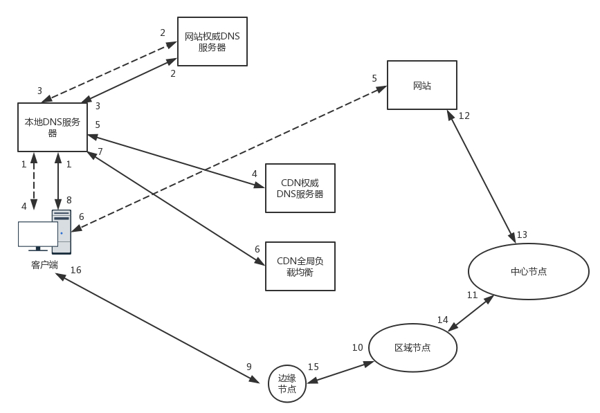

# 内容分发网络 (CDN)

内容分发网络 (CDN) 是一组地理上分布的服务器，它们协同工作以提供快速的互联网内容传输。通常，静态文件如 HTML/CSS/JS、照片和视频是从 CDN 提供的。

## 为什么使用 CDN？

内容分发网络 (CDN) 增加了内容的可用性和冗余性，同时降低了带宽成本并提高了安全性。从 CDN 提供内容可以显著提高性能，因为用户从离他们最近的数据中心接收内容，而我们的服务器不必处理 CDN 满足的请求。

## CDN 如何工作？

在 CDN 中，源服务器包含内容的原始版本，而边缘服务器则数量众多，分布在世界各地的不同位置。

为了最小化访问者与网站服务器之间的距离，CDN 在多个地理位置（称为边缘位置）存储其内容的缓存版本。每个边缘位置包含多个缓存服务器，负责向其附近的访问者提供内容。

一旦静态资源在特定位置的所有 CDN 服务器上被缓存，所有后续网站访问者对静态资源的请求将从这些边缘服务器提供，而不是从源服务器提供，从而减少源服务器的负载并提高可扩展性。

例如，当英国的某人请求我们可能托管在美国的网站时，他们将从最近的边缘位置（如伦敦边缘位置）获取内容。这比让访问者向源服务器发出完整请求要快得多，从而减少了延迟。

## 类型

CDN 通常分为两种类型：

### 推送 CDN

推送 CDN 在服务器上发生更改时接收新内容。我们完全负责提供内容，直接上传到 CDN，并重写 URL 以指向 CDN。我们可以配置内容的过期时间和更新时间。内容仅在新内容或更改时上传，从而最小化流量，但最大化存储。

流量较小或内容不经常更新的网站适合使用推送 CDN。内容只需放置在 CDN 上一次，而不是定期重新拉取。

### 拉取 CDN

在拉取 CDN 情况下，缓存基于请求进行更新。当客户端发送请求需要从 CDN 获取静态资源时，如果 CDN 没有该资源，它将从源服务器获取新更新的资源并将其填充到缓存中，然后将这个新缓存的资源发送给用户。

与推送 CDN 相反，这种方式需要较少的维护，因为 CDN 节点上的缓存更新是基于客户端对源服务器的请求进行的。流量较大的网站适合使用拉取 CDN，因为流量分布更均匀，只有最近请求的内容保留在 CDN 上。

## 缺点

众所周知，好东西往往伴随着额外的成本，所以让我们讨论一下 CDN 的一些缺点：

- **额外费用**：使用 CDN 可能很昂贵，特别是对于高流量服务。
- **限制**：一些组织和国家已经屏蔽了流行 CDN 的域名或 IP 地址。
- **位置**：如果我们的大部分受众位于 CDN 没有服务器的国家，网站上的数据可能需要比不使用 CDN 时传输更远的距离。

## 示例

以下是一些广泛使用的 CDN：

- [Amazon CloudFront](https://aws.amazon.com/cloudfront)
- [Google Cloud CDN](https://cloud.google.com/cdn)
- [Cloudflare CDN](https://www.cloudflare.com/cdn)
- [Fastly](https://www.fastly.com/products/cdn)

## （5.2）负载均衡和CDN

### 1. 基本概念

- ***什么是负载均衡？***

  ​	**负载均衡**是由多台服务器以对称的方式组成一个服务器集合，每台服务器都具有等价的地位，都可以单独对外提供服务而无须其他服务器的辅助。
  ​	通过某种负载分担技术，将外部发送来的请求均匀分配到对称结构中的某一台服务器上，而接收到请求的服务器独立地回应客户的请求。

  > 跟打饭是一个道理，靠近门口的打饭窗口可能有100个人，边上的可能只有10个人。因为人可能会不知道，或者喜欢近等某种因素等更偏向一个窗口，负载均衡就是一个机制，使得所有窗口排队人数尽可能相等，达到总体的效率最优。

- ***什么是CDN？***

  ​	引用百度百科的解释就是，CDN 是构建在数据网络上的一种分布式的内容分发网。 [CDN](https://baike.baidu.com/item/CDN) 的作用是采用[流媒体服务器](https://baike.baidu.com/item/流媒体服务器/9711212)集群技术，克服单机系统输出带宽及并发能力不足的缺点，可极大提升[系统](https://baike.baidu.com/item/系统/479832)支持的[并发流](https://baike.baidu.com/item/并发流/7395601)数目，减少或避免单点失效带来的不良影响。

  ​	CDN的全称是**Content Delivery Network**，即内容分发网络。CDN是构建在网络之上的内容分发网络，依靠部署在各地的边缘服务器，通过中心平台的负载均衡、内容分发、调度等功能模块，使用户就近获取所需内容，降低网络拥塞，提高用户访问响应速度和命中率。CDN的关键技术主要有**内容存储**和**分发技术**。

  > [其他出处的解释](https://juejin.cn/post/6844903807206473735)

- ***CDN的目的是什么？***

  ​	CDN应该说是负载均衡技术的一种，CDN是通过设置边缘镜像服务器，使得用户可以就近访问服务器，而不是一窝蜂访问源服务器。因为有可能源服务器离你所在的网络区很远，省内快递永远是要把海外快递要快。

### 2. 负载均衡

- 基于DNS的链路负载均衡
  - 是什么：即DNS解析为不同IP，用户通过IP访问不同服务器，负载均衡由DNS解析控制
  - 优点：用户会直接访问目标服务器，不经过代理服务器，访问速度会更快
  - 缺点：DNS在用户本地和LDNS均有缓存，一旦某台Web Server挂掉，将很难及时更新用户域名解析结构，导致用户无法访问域名（配置修改后，生效不及时）

- 基于IP的负载均衡
  - 在传输层的时候，对数据包中的IP地址和端口进行修改，从而达到转发的目的，称为四层负载均衡。NAT服务器（前端服务器）必须作为实际服务器（后端服务器）的网关，否则数据包被转发后将一去不返。
- 基于硬件的负载均衡
  - 在一个集群内，在硬件层次方面实现负载均衡，自动转发到不繁忙的服务器

- 基于软件的负载均衡
  - 在第七层，通过nginx，使用轮询等其他查看服务器繁忙程度的方法，实现负载均衡

### 3. CDN

> [CDN是什么](https://www.zhihu.com/question/36514327/answer/1604554133)

假设通过CDN加速的域名为`www.a.com`，接入CDN网络，开始使用加速服务后，当终端用户（北京）发起HTTP请求时，处理流程如下：

1. 当终端用户（北京）向`www.a.com`下的指定资源发起请求时，首先向LDNS（本地DNS）发起域名解析请求。
2. LDNS检查缓存中是否有`www.a.com`的IP地址记录。如果有，则直接返回给终端用户；如果没有，则向授权DNS查询。
3. 当授权DNS解析`www.a.com`时，返回域名CNAME `www.a.tbcdn.com`对应IP地址。
4. 域名解析请求发送至阿里云DNS调度系统，并为请求分配最佳节点IP地址。
5. LDNS获取DNS返回的解析IP地址。
6. 用户获取解析IP地址。
7. 用户向获取的IP地址发起对该资源的访问请求。

- 如果该IP地址对应的节点已缓存该资源，则会将数据直接返回给用户，例如，图中步骤7和8，请求结束。
- 如果该IP地址对应的节点未缓存该资源，则节点向源站发起对该资源的请求。获取资源后，结合用户自定义配置的缓存策略，将资源缓存至节点，例如，图中的北京节点，并返回给用户，请求结束。
  
------------------------------

### CDN 京东建仓策略，就近配送
上一次讲到DNS服务器负责负载均衡以及IP定位，HTTPDNS服务器，各家自扫门前雪，自己搞自己的DNS策略，不用根的DNS服务器。但是每次访问可以找到最近的地方访问吗？要是HTTPDNS服务器也是指向很远的IP，那么也是让网络延迟很久呀。所以，这时候就需要CDN策略。什么意思呢？全球很多数据中心，无论在什么地方上网，临近不远的地方基本上都有数据中心。数据中心部署几台机器，形成一个缓存的集群来缓存部分数据，用户访问数据的时候，就可以就近访问。而这些数据中心，统称 **边缘节点** 
而边缘节点数目较多，但是每个集群规模较小，不可能缓存下来所有东西，因而可能无法命中，这样就会在边缘节点之上，有区域节点，规模更大，缓存数据更多，命中的概率也就更大。区域节点之上就是中心节点，规模更大，缓存数据更多，命中概率更大。如果还不命中，就只好回源网站访问了。 

**CDN的分布系统架构**。CDN系统的缓存，一层一层的，能不访问后段真正的源节点，就不访问。 
所以， **客户端如何找到相应的边缘节点进行访问呢？**
#### 基于DNS的全局负载均衡
选择一个就近的同样的运营商服务器进行访问。CDN分发网络也是一个分布在多个区域、多个运营商的分布式系统，可以用相同的思路选择最适合的边缘节点。 

与DNS访问不同，有了CDN之后，在访问一个域名，在访问权威DNS服务器上，会设置一个CNAME别名，指向另一个域名cdn.com，返回给本地的DNS服务器。
* ➡️当本地DNS服务器拿到新的域名，继续解析这个新的域名。再访问cdn.com这个权威的DNS服务器，这是CDN自己的权威DNS服务器。在这个服务器上，还会设置一个CNAME，指向另一个域名，也就是CDN网络的全局负载均衡器。
* ➡️本地DNS服务器去请求CDN的负载均衡器解析域名，全局负载均衡器会为用户选择一台合适的缓存服务器提供服务

1. 根据用户IP地址，判断那一台服务器最近
2. 用户所处运营商
3. 根据用户所请求的URL中携带的额内容名称判断哪一台服务器上有用户所需要的内通
4. 查询各个服务器当前的负载情况，判断哪一台服务器有服务能力

综合分析以上条件，全局负载均衡器会返回一台缓存服务器的IP地址。 
本地DDNS服务器缓存这个IP地址，返回给客户端，客户端访问这个边缘节点下载⏬资源。缓存服务器响应用户请求，将用户所需要的内容传送到用户终端。如果这台缓存服务器上并没有用户想要的内容，那么这台服务器就要向它的上一级缓存服务器请求内通，直至追溯到网站的源服务器将内容拉回本地。 

#### CDN可以进行多种内容缓存

CDN将静态资源缓存到离用户最近的数据中心外。越接近客户，访问性能越好，时延越低。 
CDN支持流媒体协议，拉流在边缘节点，推流也在边缘节点。 
静态页面，内容的分发往往采取拉取的方式，未命中🎯就再去上一级继续拉。流媒体则主动推流到边缘节点。 
流媒体，CDN提供预处理服务，也即文件在分发之前，经过一定的处理，例如将视频转换为不同的码流，以适应不同的网络带宽的用户需求；再如对视频进行分片，降低存储压力，也使得客户端可以选择使用不同的码率加载不同的分片。(这就是高清，标清，流畅的区别) 
流媒体需要 **防盗链**(常用http头的refer字段) 

##### 动态CDN 对应动态数据
* 生鲜超市模式(边缘计算的模式)，数据动态生成，数据的逻辑计算和存储，放在相应的边缘节点。定时从源数据同步存储数据，然后在边缘进行计算得到结果。
* 冷链运输模式(路径优化模式)。数据不在边缘计算生成，而是源站生成，但是数据的下发可通过CDN网络进行路径优化。图的最短路径规划。

