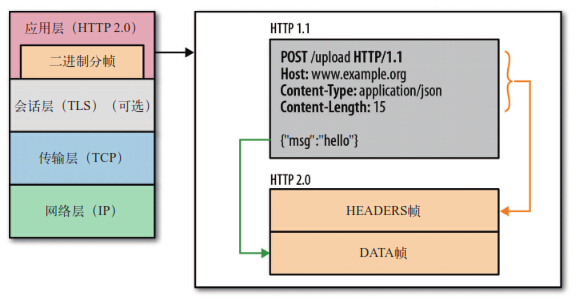

## HTTP/2.0

### 1. 概述

HTTP/2.0 是 HTTP 协议的最新版本，相比 HTTP/1.1，HTTP/2.0 引入了许多新特性，如二进制帧、多路复用、请求优先级、流量控制、服务器推送和首部压缩等。这些改进使得 HTTP/2.0 在性能和效率上有了显著提升。

### 2. HTTP/1.1 的局限性

HTTP/1.1 在应用层上以纯文本的形式进行通信，每次通信都要带完整的 HTTP 头部，并且不考虑管道模式（pipeline），每次请求和响应都需要单独的连接。这导致了以下问题：

1. **连接无法复用**：每次请求都需要经历三次握手和慢启动，增加了延迟。
2. **队头阻塞（Head-of-Line Blocking）**：在第一个请求没有收到回复之前，后续请求只能排队等待，导致带宽无法被充分利用。

### 3. HTTP/2.0 的新特性

#### 3.1 二进制分帧

HTTP/2.0 引入了二进制分帧层，将 HTTP 消息封装为二进制帧进行传输。每个帧包含帧首部和数据部分，帧首部包含帧的类型、长度、标志和流标识符。

#### 3.2 多路复用

HTTP/2.0 通过多路复用技术，在一个连接上同时传输多个请求和响应。每个请求和响应被分割成多个帧，这些帧可以乱序发送，然后根据帧首部的流标识符重新组装。

#### 3.3 请求优先级

HTTP/2.0 允许为每个请求设置优先级，确保重要的请求优先得到处理。例如，浏览器加载网页时，可以优先加载 HTML 内容，然后再加载静态资源文件。

#### 3.4 首部压缩

HTTP/2.0 使用 HPACK 算法对 HTTP 头部进行压缩，减少了头部的大小和数量，提高了传输效率。

#### 3.5 服务器推送

HTTP/2.0 支持服务器推送（Server Push），服务器可以在客户端请求之前主动推送资源，提高页面加载速度。

### 4. HTTP/2.0 的实现与安全性

#### 4.1 HTTPS 加密流程

HTTP/2.0 通常与 HTTPS 一起使用，通过 SSL/TLS 协议对数据进行加密传输。以下是 HTTPS 加密流程：

1. 客户端使用 HTTPS 的 URL 访问 Web 服务器，要求与 Web 服务器建立 SSL 连接。
2. Web 服务器收到客户端请求后，将网站的公钥传送给客户端，私钥自己保存。
3. 客户端的浏览器根据双方同意的安全等级，生成对称加密使用的密钥（会话密钥），然后利用网站的公钥将会话密钥加密，并传送给网站。
4. Web 服务器利用自己的私钥解密出会话密钥。
5. Web 服务器利用会话密钥加密与客户端之间的通信，这个过程是对称加密的过程。

#### 4.2 重放与篡改

- **重放攻击**：黑客通过截取的包，重复发送多次，达到攻击服务端的目的。防御措施包括使用唯一的时间戳和随机数，做一个不可逆的签名来保证请求的唯一性。
- **篡改攻击**：黑客在数据传输过程中对数据进行修改。防御措施包括使用消息摘要（如 SHA-256）和数字签名技术，确保数据的完整性和真实性。

### 5. HTTP/1.1 与 HTTP/2.0 的区别

1. **安全性**：HTTP/1.1 是明文传输，HTTP/2.0 通过 SSL/TLS 加密传输，提供更高的安全性。
2. **连接复用**：HTTP/1.1 每次请求都需要单独的连接，HTTP/2.0 通过多路复用在一个连接上同时传输多个请求和响应。
3. **队头阻塞**：HTTP/1.1 存在队头阻塞问题，HTTP/2.0 通过多路复用解决了这个问题。
4. **首部压缩**：HTTP/1.1 的头部信息冗余较多，HTTP/2.0 使用 HPACK 算法对头部进行压缩，减少了头部的大小和数量。
5. **服务器推送**：HTTP/1.1 只能由客户端发起请求，HTTP/2.0 支持服务器推送，服务器可以在客户端请求之前主动推送资源。

### 6. 由 HTTP/1.1 升级为 HTTP/2.0 的操作步骤

1. **检查服务器支持**：确保服务器支持 HTTP/2.0 协议。
2. **申请数字证书**：从权威 CA 申请数字证书。
3. **配置服务器**：在服务器上安装和配置数字证书，并启用 HTTP/2.0 支持。
4. **修改网站链接**：将网站的所有 HTTP 链接修改为 HTTPS 链接。
5. **重定向**：设置 HTTP 到 HTTPS 的重定向，确保所有访问都使用 HTTPS。
6. **测试**：测试网站的 HTTP/2.0 连接，确保没有安全漏洞。

### 7. 参考链接

- [HTTP vs HTTPS](https://snailclimb.gitee.io/javaguide/#/./docs/cs-basics/network/http&https)
- [HTTP/2.0 相比1.0有哪些重大改进？](https://www.zhihu.com/question/34074946/answer/108588042)
- [HTTP---HTTP2.0新特性](https://juejin.im/post/5a4dfb2ef265da43305ee2d0)
- [浏览器允许的并发请求资源数是有限制的-分析](https://blog.csdn.net/yishouwangnian/article/details/52788626?utm_source=blogxgwz8)

通过理解 HTTP/2.0 的基本概念、实现过程和安全性措施，可以更好地设计和管理高效、安全的网络通信。