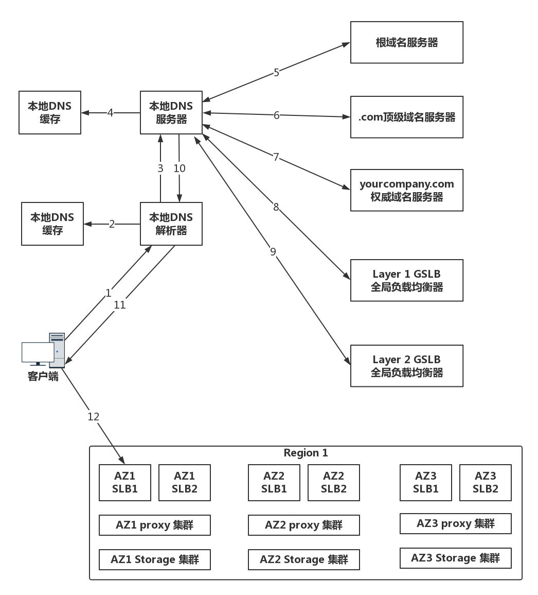

## （5.3）DNS

到HTTPDNS 一步一步优化
DNS到HTTPDNS，从静态的缓存策略，到动态缓存策略。<br>

DNS解析有两种方式:递归查询和迭代查询
* 递归查询 用户先向本地域名服务器查询,如果本地域名服务器的缓存没有IP地址映射记录,就向根域名服务器查询,根域名服务器就会向顶级域名服务器查询,顶级域名服务器向权限域名服务器查询,查到结果后依次返回.
* 迭代查询 用户向本地域名服务器查询,如果没有缓存,本地域名服务器会向根域名服务器查询,根域名服务器返回顶级域名服务器的地址,本地域名服务器再向顶级域名服务器查询,得到权限域名服务器的地址,本地域名服务器再向权限域名服务器查询得到结果


### DNS 网络世界的地址薄 它是一个黄页
DNS(Domain Name System)，使用dig命令，重现DNS查询的过程
```
transCheungdeMacBook-Pro:Desktop transcheung$ dig baidu.com

; <<>> DiG 9.10.6 <<>> baidu.com
;; global options: +cmd
;; Got answer:
;; ->>HEADER<<- opcode: QUERY, status: NOERROR, id: 8291
;; flags: qr rd ra; QUERY: 1, ANSWER: 2, AUTHORITY: 5, ADDITIONAL: 5

;; QUESTION SECTION:
;baidu.com.			IN	A

;; ANSWER SECTION:
baidu.com.		193	IN	A	123.125.115.110
baidu.com.		193	IN	A	220.181.57.216

;; AUTHORITY SECTION:
baidu.com.		6764	IN	NS	ns3.baidu.com.
baidu.com.		6764	IN	NS	ns7.baidu.com.
baidu.com.		6764	IN	NS	ns4.baidu.com.
baidu.com.		6764	IN	NS	ns2.baidu.com.
baidu.com.		6764	IN	NS	dns.baidu.com.

;; ADDITIONAL SECTION:
dns.baidu.com.		45730	IN	A	202.108.22.220
ns2.baidu.com.		45574	IN	A	220.181.37.10
ns3.baidu.com.		45810	IN	A	112.80.248.64
ns4.baidu.com.		46217	IN	A	14.215.178.80
ns7.baidu.com.		46309	IN	A	180.76.76.92

;; Query time: 15 msec
;; SERVER: 211.162.66.66#53(211.162.66.66)
;; WHEN: Fri Mar 01 23:16:44 CST 2019
;; MSG SIZE  rcvd: 229
```

使用`+short`参数能够省略过程，直接检索出结果
```
dig +short baidu.com
220.181.57.216
123.125.115.110
```
#### DNS服务器 对应的IP地址->对应域名
DNS在日常的生活中，每个人上网都要访问，但是同时，它出了故障，整个互联网都将瘫痪。另外，上网的人分布在世界各地，如果大家都去同一个地方访问同一台服务器，时延就会非常大。因而 **DNS服务器，一定要设置成高可用、高并发和分布式的**<br>
于是就有了这样的树状层次结构<br>


* 根DNS服务器(.root): 返回顶级域DNS服务器的IP地址
* 顶级域DNS服务器(.com,.net,.cn,.edu):返回权威DNS服务器的IP地址
* 权威DNS服务器(.baidu,.alibaba,.taobao,.163.com,.google.cn,.csdn.net):返回相应主机的IP地址
* 主机名一般为子域名称，例如https://map.baidu.com中的map,https://image.baidu.com中的image


#### DNS解析流程
为了提高DNS的解析性能，很多网络都会就近部署DNS缓存服务器。<br>


查找过程:本地DNS服务器➡️根域名服务器➡️顶级域名服务器➡️权威DNS服务器(我的域名我做主)➡️权威DNS服务器将对应的IP告诉本地DNS➡️本地DNS将IP返回客户端🔙<br>

#### 负载均衡
**DNS递归查询过程**。DNS除了可以通过名称映射为IP地址，还可以做 **负载均衡**。为什么呢？以找🚾为例，他可能有很多地址，因为在全世界都有，如果一个人要去🚾，可以就近找一家，如果大家都就近找一家🚾，那么这就是负载均衡，如果都去同一家，就爆满🚽<br>
DNS可以做 **内部负载均衡**，通过解析策略，如果一个应用访问一数据库，数据库部署多份，通过配置DNS解析，每次返回的IP不同，对应不同的数据库，就可以做到负载均衡。<br>
DNS可以做 **外部负载均衡**，为了保证高可用，往往部署多个机房，每个机房都有自己的IP地址，当用户访问某个域名的时候，IP地址可以轮询访问多个数据中心，如果一个数据中心挂了，就删掉这个IP地址。
#### 🌰 DNS访问数据中心中对象存储上的静态资源


假设全国有多个数据中心，托管多个运营商，每个数据中心三个可用区(Available Zone)。对象存储通过跨可用区部署，实现高可用性。在每个数据中心中，都至少部署两个内部负载均衡器，内部负载均衡器后面对接多个对象存储的前置服务器(Proxy-server)。<br>

客户端访问一网址➡️访问本地DNS解析器➡️访问本地缓存(有就直接用)➡️(没有)请求本地DNS服务器➡️本地DNS缓存(有就返回，没有就访问根DNS服务器)➡️查找过程继续(上述)<br>

对于不需要做全局负载均衡的简单应用来讲，权威DNS服务器可以直接将域名解析为一个或多个IP地址，客户端通过简单的轮询，实现简单的负载均衡。<br>

而对于复杂的应用，尤其是跨地域跨运营商的大型应用，就需要更加复杂的 **全局负载均衡机制**，因而需要专门的设备或者服务器来做，这就是 **全局负载均衡器(GSLB,Global Server Load Balance)**<br>

例如在acompany.com的DNS服务器中，一般是 **通过配置CNAME的方式**，给object.acompany.com起一个别名，例如object.vip.acompany.com，然后告诉本地DNS服务器，让她请求GSLB解析域名，GSLB就可以在解析这个域名的过程中，通过自己的策略实现负载均衡。<br>

图中有两层GSLB，是因为分运营商和地域。希望不同的运营商的客户，可以访问相同运营商机房中的资源， **这样不跨运营商访问，有利于提高吞吐量，减少时延**<br>

第一层GSLB，通过查看请求它的本地DNS服务器所在的运营商，就知道用户所在的运营商。假设是移动，通过CNAME的方式，通过另一个别名object.yd.acompany.com，告诉本地DNS服务器去请求第二层GSLB。<br>

第二层GSLB，通过查看请求它本地DNS服务器所在地址，就知道用户所在的地理位置，然后将距离用户位置比较近的Region里面，六个 **内部负载均衡(SLB Server Load Balancer)**的地址，返回给本地DNS服务器。<br>

本地DNS服务器将结果返回给本地DNS解析器➡️本地解析器将结果缓存后，返回给客户端➡️客户端开始访问属于相同运营商的距离较近的Region1中的对象存储。(客户端得到6个IP地址，可以通过负载均衡的方式，随机或者轮询选择一个可用区进行访问。)对象存储一般会有三个备份，从而可以实现对存储读写的负载均衡。<br>

### 问题question 域名越多越好吗？
并不是，域名多不一定能缓存方便，域名解析器更多才能让你的缓存散播更广。什么意思？缓存不一定是缓存在本地，要是在域名解析器中，解析出来的主机里的缓存，这样的缓存就更广，访问就更方便。<br>

### HTTPDNS 更新DNS，通过HTTP协议
DNS有两个功能，1⃣️根据名称查到具体地址2⃣️针对多个地址做负载均衡<br>
* **DNS存在域名缓存问题**，每一次缓存都把结果缓存到自己本地，有人访问，直接返回缓存数据，这样陈年的缓存数据一直存放，要是IP地址变了，还是返回这个地址，缓存的数据不一样，这样用户就尴尬了。同时造成全局负载均衡失败，为啥，全局负载均衡是访问最近的地址，但是，因为本地缓存，可能绕远了路呀。
* **域名转发问题**，DNS服务器转发给别的营运商，访问速度慢
* **出口NAT问题**，很多机房都会配置NAT，网络地址转换，使得从这个网关出去的包，都换成新的IP地址，当然这个网关再将IP地址转换回去，对于访问🆗，但是一旦做了地址转换，权威DNS服务器就没法通过这个地址，来判断客户到底是来自哪个运营商，而且极有可能因为转换过后的地址，误判运营商，导致跨运营商访问。
* **域名更新问题**，本地DNS服务器是由不同地区、不同运营商独立部署的。对域名解析缓存的处理上，实现策略也有区别，有的会偷懒， **忽略域名解析结果的TTL时间限制**，在权威DNS服务器解析变更的时候，解析结果在全网生效的周期非常漫长。但是有时候，在DNS的切换中，场景对生效时间要求比较高。例如双机房部署的时候，跨机房的负载均衡和容灾多使用DNS来做。当一个机房出问题之后，需要修改权威DNS，将域名指向新的IP地址，但是如果更新太慢，那很多用户都会出现访问异常。
* **解析延迟问题**，递归遍历耗时多

**HTTPDNS，不走传统路线(DNS解析)，而是自己搭建基于HTTP协议的DNS服务器集群，** 分布在多个地点和多个运营商。当客户端需要DNS解析的时候， **直接通过HTTP协议进行请求这个服务器集群，得到就近的地址。**<br>

这就相当于每家基于HTTP协议，自己实现自己的域名解析，自己做一个自己的地址薄，而不使用统一的地址薄。但是默认的域名解析都是走DNS的， **因而使用HTTPDNS需要绕过默认的DNS路径。** 就不能使用默认的客户端。使用HTTPDNS。往往是手机应用，需要手机端嵌入支持HTTPDNS的客户端SDk。<br>

#### HTTPDNS工作模式
在客户端SDK里动态请求服务端➡️获取HTTPDNS服务器的IP列表➡️缓存到本地。<br>
随着不断地解析域名，SDK也会在本地缓存DNS域名解析的结果。<br>

当手机应用访问一个地址➡️本地缓存➡️HTTPDNS服务器。
请求方式
```
curl http://106.2.xxx.xxx/d?dn=c.m.163.com

{"dns":[{"host":"c.m.163.com","ips":["223.252.199.12"],"ttl":300,"http2":0}],"client":{"ip":"106.2.81.50","line":269692944}}
```
手机📱客户端自然之道手机是哪个运营商、哪个地址。由于是直接的HTTP通信，HTTPDNS服务器能够准确知道这些信息，因而可以做精准的全局负载均衡<br>


##### HTTPDNS 解析速度和更新速度的平衡(缓存设计) 只能调度(调度设计)
1⃣️HTTPDNS缓存设计<br>
解析过程通过HTTP请求。为了提高解析速度，本地也有缓存，缓存是在客户端SDK维护，过期时间以及更新时间，自己控制。<br>
HTTPDNS缓存设计策略，常用缓存设计模式(客户端，缓存，数据源)<br>
* 对于应用架构，应用->Tomcat，缓存->Redis，数据库->MySQL
* 对于HTTPDNS，手机客户端、DNS缓存、HTTPDNS服务器

对于缓存的更新、过期、不一致，根据缓存模式来解决。<br>
例如DNS缓存在内存中，也可以持久化到存储上，从而APP重启之后，能够尽快从存储中加载上次累计的经常访问的网站解析结果，就不需要每次都全部解析一边，再变成缓存。这就像Redis是基于内存的缓存，但是同样提供持久化的能力，使得重启或者主备切换的时候，数据不会完全丢失。<br>

SDK中的缓存会严格按照缓存过期时间，如果缓存没命中，或者已经过期，而且客户端不允许使用过期的记录，则会发起一次解析，保障记录是更新的。<br>

解析可以同步进行，也就是直接调用HTTPDNS的接口，返回最新的记录，更新缓存；也可以异步进行，添加一个解析任务到后台，由后台任务调用HTTPDNS的接口。<br>

**同步更新的优点是实时性好**，缺点是如果有多个请求都发现过期的时候，同时会请求HTTPDNS多次，浪费时间。<br>

Cache-Aside机制


**异步更新的优点是合并一次请求，减少HTTPDNS压力**，同时可以在即将过期的时候，创建一个任务预加载，防止过期之后再刷新，称为 **预加载**。<br>
缺点是，还没请求，客户端开始用了。没有及时更新。<br>


2⃣️HTTPDNS调度设计<br>
由于客户端嵌入了SDK，因为就不会因为本地DNS的各种缓存、转发、NAT，让权威DNS服务器误会客户端所在的位置和运营商，而可以拿到第一手资料💾。<br>
客户端SDK需要收集网络请求数据如错误率、请求时间等网络请求质量数据，并发送给统计后台，进行分析、聚合，以此查看不同的IP的服务质量。<br>
服务端，应用可以通过调用HTTPDNS的管理接口，配置不同服务质量的优先级、权重。HTTPDNS会根据这些策略综合地理位置和路线状况算出一个排序，优先访问当前那些优质的、时延低的IP地址。<br>


HTTPDNS 通过智能调度之后返回的结果，也会缓存在客户端。为了不让缓存使得调度失真，客户端可以根据不同的移动网络运营商WIFI的SSID来分维度缓存，不同的运营商或者WIFI解析出来的结果不同。<br>

# DNS

* **DNS占用53号端口,同时使用TCP和UDP协议**.那么DNS在什么情况下使用这两种协议?
  * 在两种情况下会使用 TCP 进行传输:
    - 如果返回的响应超过的 512 字节(UDP 最大只支持 512 字节的数据)
    - 区域传送(区域传送是主域名服务器向辅助域名服务器传送变化的那部分数据)
  * 其他时候使用UDP协议.大多数情况下 DNS 使用 UDP 进行传输,这就**要求域名解析器和域名服务器都必须自己处理超时和重传从而保证可靠性**
* **DNS区域传输的时候使用TCP协议**
  * 辅域名服务器会定时(一般3小时)向主域名服务器进行查询以便了解数据是否有变动.如有变动,会执行一次区域传送,进行数据同步.**区域传送使用TCP而不是UDP,因为数据同步传送的数据量比一个请求应答的数据量要多得多**
  * TCP是一种可靠连接,保证了数据的准确性
* **域名解析时使用UDP协议:**
  * 客户端向DNS服务器查询域名,一般返回的内容都不超过512字节,用UDP传输即可.**不用经过三次握手,这样DNS服务器负载更低,响应更快**.理论上说,客户端也可以指定向DNS服务器查询时用TCP,但事实上,很多DNS服务器进行配置的时候,仅支持UDP查询包

* **DNS劫持**
  * 域名劫持是互联网攻击的一种方式,通过**攻击域名解析服务器**,或**伪造域名解析服务器**的方法,**把目标网站域名解析到错误的IP地址**从而实现用户无法访问目标网站的目的或者蓄意或恶意要求用户访问指定IP地址(网站)的目的
  * 常见三种情况
    * **错误域名解析到纠错导航页面**,导航页面存在广告.判断方法:访问的域名是错误的,而且跳转的导航页面也是官方的,如电信的114,联通移网域名纠错导航页面
    * **错误域名解析到非正常页面**,对错误的域名解析到导航页的基础上,有一定几率解析到一些恶意站点,这些恶意站点通过判断你访问的目标HOST/URI/ referrer等来确定是否跳转广告页面,这种情况就有可能导致跳转广告页面(域名输错)或者访问页面被加广告(页面加载时有些元素的域名错误而触发)这种劫持会对用户访问的目标HOST/URI/ referrer等会进行判定来确定是否解析恶意站点地址,不易被发现
    * **直接将特点站点解析到恶意或者广告页面**,这种情况比较恶劣,而且出现这种情况未必就是运营商所为,家里路由器被黑,或者系统被入侵,甚至运营商的某些节点被第三方恶意控制都有可能
