## https
### 1. concepts
- ***什么是HTTPS?***
  [http vs https](https://snailclimb.gitee.io/javaguide/#/./docs/cs-basics/network/http&https)

#### 1.1 数字证书
- 数字证书的了解

  - 权威CA使用私钥将网站A的信息和消息摘要(签名S)进行加密打包形成数字证书.公钥给客户端.

    网站A将自己的信息和数字证书发给客户端,客户端用CA的公钥对数字证书进行解密,得到签名S,与手动将网站的信息进行消息摘要得到的结果S*进行对比,如果签名一致就证明网站A可以信任.


- 数字证书的了解(高频)


权威CA使用私钥将网站A的信息和消息摘要(签名S)进行加密打包形成数字证书.公钥给客户端.

网站A将自己的信息和数字证书发给客户端,客户端用CA的公钥对数字证书进行解密,得到签名S,与手动将网站的信息进行消息摘要得到的结果S\*进行对比,如果签名一致就证明网站A可以信任.

- HTTPS 为了安全🔐,我愿意带上套


好了,这次渣男要带上🔐安全套了,妈妈再也不用担心我的安全了.<br>
[https加密流程传送门](https://github.com/HXWfromDJTU/blog/blob/master/network/http/https.md)

具体的加密🔐通过以上来了解,加密套路,三个随机数生成一样的密钥,一对密钥一样,解密双方加密的数据,那么这里要讲一下重放和篡改

### 2. concepts


- ***HTTP请求组成?***

  状态行/请求头/消息主体.

  > ```h
  > <method> <request-URL> <version>
  > <headers>
  > 
  > <entity-body>
  > ```

- ***HTTP的持久链接是什么?***

  - HTTP Keep-Alive 简单说就是保持当前的TCP连接,避免了重新建立连接.
  - HTTP 长连接不可能一直保持,例如 `Keep-Alive: timeout=5, max=100`,表示这个TCP通道可以保持5秒,max=100,表示这个长连接最多接收100次请求就断开.

#### (23) http的请求方法有哪些?get和post的区别.
#### (24) http的状态码 403 201等等是什么意思
详见 [HTTP状态码的含义](https://blog.csdn.net/u011630575/article/details/46636535)

常见的状态码有:
>* 200 - 请求成功
>* 301 - 资源(网页等)被永久转移到其它URL
>* 404 - 请求的资源(网页等)不存在
>* 500 - 内部服务器错误
>* 400 - 请求无效 
>* 403 - 禁止访问 
#### (25) http和https的区别,由http升级为https需要做哪些操作
http 是超文本传输协议,信息是明文传输, https 则是具有安全性的 ssl 加密传输协议
http 和 https 使用的是完全不同的连接方式,用的端口也不一样,前者是 80 ,后者是 443
http 的连接很简单,是无状态的; HTTPS 协议是由 SSL+HTTP 协议构建的可进行加密传输/身份认证的网络协议,比http 协议安全.
https 协议需要到 ca 申请证书,一般免费证书较少,因而需要一定费用
https://www.cnblogs.com/wqhwe/p/5407468.html

#### (26) https的具体实现,怎么确保安全性
**SSL是传输层的协议**

https包括非对称加密和对称加密两个阶段,在客户端与服务器建立连接的时候使用非对称加密,连接建立以后使用的是对称加密.

1. 客户使用https的URL访问Web服务器,要求与Web服务器建立SSL连接
2. Web服务器收到客户端请求后,会将网站的公钥传送一份给客户端,私钥自己保存.
3. 客户端的浏览器根据双方同意的安全等级,生成对称加密使用的密钥,称为会话密钥,然后利用网站的公钥将会话密钥加密,并传送给网站
4. Web服务器利用自己的私钥解密出会话密钥.
5. Web服务器利用会话密钥加密与客户端之间的通信,这个过程是对称加密的过程.

服务器第一次传给客户端的公钥其实是CA对网站信息进行加密的数字证书

客户端的对称加密密钥其实是三个随机数的哈希(1. 客户端第一次给服务端发送请求时附带的随机数 2. 服务器返回时的随机数 3. 客户端收到返回时的随机数)
#### (27) TCP三次握手时的第一次的seq序号是怎样产生的
第一次的序号是随机序号,但也不是完全随机,它是使用一个ISN算法得到的.

seq = C + H (源IP地址,目的IP地址,源端口,目的端口).其中,C是一个计时器,每隔一段时间值就会变大,H是消息摘要算法,输入是一个四元组(源IP地址,目的IP地址,源端口,目的端口).

#### 重放与篡改
重放即黑客通过截取的包，用来发送N次，达到攻击服务端，令服务端崩溃的策略。而这个即通过唯一的timestamp和Nonce随机数联合起来，做一个不可逆的签名来保证，timestamp设定在60秒后过期。要是这个请求被截取，需要在60秒内重放，过期失效，但是要是加上nonce，随机数，就足够难重放了。因为在短时间内，连续生成连个相同的nonce的情况几乎为0。<br>
还有就是服务器也可以将多余的请求去掉，使黑客根本没办法重放攻击。<br>
例如下面这个请求`http://a.com?uid=123&timestamp=1480556543&nonce=43f34f33&sign=80b886d71449cb33355d017893720666`
服务端工作:<br>
1. 先验证签名sign是不是合理的，证明请求参数没有被中途篡改
2. 验证timestamp是否过期，证明请求是在最近60s被发出的
3. 最后验证nonce是不是已经有了，证明这个请求不是60s内的重放请求


## HTTP->HTTPS HTTP协议是一个渣男👦-主动，不负责，不拒绝
从链路层⛓️到IP层再到TCP/UDP层，再到应用层。HTTP是我们经常使用的协议，一个小白，刚开始接触的就是HTTP协议。同时这个协议很容易被人忽略。做前端必须要熟悉HTTP协议，做后端就要知道HTTP协议到底怎么来的。怎么工作的，工作原理是什么。总结了一下，HTTP要讲的东西蛮多的，基本上环环相扣，从简单的HTTP到安全HTTPS，HTTP状态码，基于流的HTTP2.0，缓存技术等等。简单吗？不简单！复杂吗？超复杂。应用层协议一窝蜂，天天有不同，google开发了QUIC，文章最后，一起探讨QUIC。<br>
文章思路:HTTP首部请求与响应报文➡️HTTP状态码➡️GET与POST方法，PUT、DELETE➡️HTTP缓存机制➡️HTTP2.0➡️HTTPS➡️QUIC🔚
### HTTP随想
##### URL与URI 统一资源定位符©️与统一资源标识符©️
URI，用字符串标识某一互联网资源，而URL表示资源的地点(互联网上所处的位置)。<br>
#### HTTP 协议用于客户端和服务器端之间的通信
HTTP协议和TCP/IP协议族内的其他众多的协议相同，用于客户端和服务器之间的通信。怎么通信呢？HTTP先请求，发出请求报文，服务器响应这个请求并返回，这是个怎么样的过程呢？例如，在浏览器输入`"https://www.baidu.com"`，浏览器将这个域名发送给DNS服务器，DNS解析IP地址(后面会，另开一篇文章讲述DNS)，接下来，就是解析了IP地址，就到传输层TCP链接，剩下就是TCP的事情了。
#### HTTP是不保存状态的协议 不负责(从来都不做持久化处理) 渣男行为一
HTTP是一个无状态协议，它自身不对请求和响应之间的通信状态进行保存。使用HTTP协议，每当有新的请求发送时，就会有对应的新响应产生，协议本身并不保留之前一切或响应报文的信息。这是为了处理大量的事务，确保协议的可伸缩性，故意把HTTP协议设计得如此简单，明了。<br>
而且每次请求响应之后，TCP就断开了链接🔗，为了做这一点小事，TCP三次握手🤝四次挥手🙋，有点付出和收获不成正比。那怎么着？
##### keep-alive保持持久链接🔗 HTTP1.1 旨在建立1⃣️次TCP链接后，进行多次请求和响应的交互
任意一端没有明确提出断开链接，则保持TCP链接状态。从慢启动到快速🔜发送，再到拥塞重启，再到快速重传策略，TCP就这样按部就班为客户端和服务端一直服务着。那么持久链接有什么好处呢？<br>
* 管线化: 多数请求发送，不一定要等待响应再发送请求(这个在HTTP2.0，稍后会重点讲一讲)

keep-Alive:timeout=15,max=100 表示15ms内无请求则断开，100ms后，一定断开<br>
前面讲得有点，emmm，笼统？接下来，要真正理解HTTP，要从HTTP的报文说起<br>
### HTTP请求 我请求做某事的时候，还是很有交代的
HTTP协议是基于TCP协议的，所以它使用面向连接的方式发送请求，通过stream二进制流的方式传给对方。当然了，到了TCP层，它会把二进制流变成一个报文段发送给服务器。<br>
HTTP报文大概分为三大部分。第一部分是请求行，第二部分是请求的首部，第三部分是请求的正文实体。先来看看请求的格式。<br>

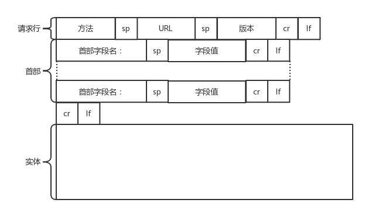

HTTP协议的请求和响应报文中必定包含HTTP首部。首部内容为客户端和服务器分别处理请求和响应提供所需要的信息。
##### HTTP请求报文 方法、URL、HTTP版本、HTTP字段等部分构成
在讲解报文之前，先来看一下浏览器抓取的报文<br>

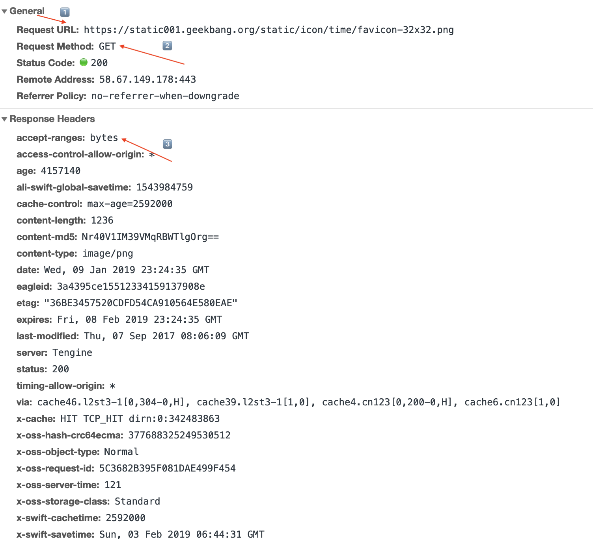

请求报文头

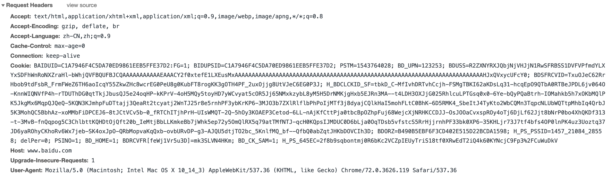

从上图来看，在浏览器抓取的报文中，包括3⃣️种首部字段，但是这里有4⃣️种介绍<br>
* 通用首部字段(General): 请求报文和响应报文两方都会使用的首部 但是上图并没有体现
* 响应首部字段(Response Headers): 从服务端向客户端返回🔙响应报文时使用的首部。补充了相应的附加内容，也会要求客户端附加额外的内容信息
* 请求首部字段(Request Headers): 从客户端向服务器端发送请求报文时使用的首部。补充了请求的附加内容、客户端信息、响应内容相关优先级
* 实体首部字段(Entity Header Fields): 针对请求报文和响应报文的实体部分使用的首部。补充了资源内容的更新时间等与实体相关的信息

介绍HTTP/1.1 首部字段:<br>
1⃣️首部通用字段解读<br>

| 首部字段名        | 说明                                                          |
| ----------------- | ------------------------------------------------------------- |
| Cache-Control     | 控制缓存行为⚠️(这是客户端和服务器协商缓存处理，下面会持续说明) |
| Connection        | 逐跳首部、连接🔗管理                                           |
| Date              | 创建报文的日期时间                                            |
| Pragma            | 报文指令                                                      |
| Trailer           | 报文末端的首部一览                                            |
| Transfer-Encoding | 指定报文主体的传输方式                                        |
| Upgrade           | 升级为其他协议                                                |
| Via               | 代理服务器的相关信息                                          |
| Warning           | 错误通知❌                                                     |

2⃣️请求首部字段解读<br>

| 首部字段            | 说明                                     |
| ------------------- | ---------------------------------------- |
| Accept              | 用户代理可处理的媒体类型                 |
| Accept-Charset      | 优先字符集                               |
| Accept-Encoding     | 优先内容编码                             |
| Accept-Language     | 优先语言                                 |
| Authorization       | Web认证信息                              |
| Expect              | 期待服务器的特定行为                     |
| From                | 用户的电子邮箱📮地址                      |
| Host                | 请求资源所在服务器                       |
| If-Match            | 比较实体标记(Etag)(Etag是一个重点的内容) |
| If-Modified-Since   | 比较资源的更新时间                       |
| If-None-Match       | 比较实体标记(与If-Match相反)             |
| If-Range            | 资源未更新时发送实体Byte的范围请求       |
| If-Unmodified-Since | 比较资源的更新时间                       |
| Max-Forwards        | 最大传输逐跳数                           |
| Proxy-Authorization | 代理服务器要求客户端的认证信息           |
| Range               | 实体的字节范围请求                       |
| Referer             | 对请求中的URI的原始获取方(原始)          |
| TE                  | 传输编码的优先级                         |
| User-Agent          | HTTP客户端信息(这里搞一下伪造)           |

3⃣️响应首部字段解读<br>

| 首部字段          | 说明                         |
| ----------------- | ---------------------------- |
| Accept-Ranges     | 是否接受字节范围请求         |
| Age               | 推算资源创建经过时间         |
| ETag              | 资源匹配信息                 |
| Location          | 令客户端重定向至指定URI      |
| Proxy-Authenicate | 代理服务器对客户端的认证信息 |
| Retry-After       | 对再次发起请求的时机要求     |
| Server            | HTTP服务器的安装信息         |
| Vary              | 代理服务器缓存的管理信息     |
| WWW-Authenticate  | 服务器对客户端的认证信息     |

4⃣️实体首部字段

| 首部字段         | 说明                   |
| ---------------- | ---------------------- |
| Allow            | 资源可支持的HTTP方法   |
| Content-Encoding | 实体主体适用的编码方式 |
| Content-Language | 实体主体的自然语言     |
| Content-Length   | 实体主体的大小         |
| Content-Location | 替代对应资源的URI      |
| Content-MD5      | 实体主体的报文摘要     |
| Content-Range    | 实体主体的位置范围     |
| Content-Type     | 实体主体的媒体📺类型    |
| Expires          | 实体主体过期的日期时间 |
| Last-Modified    | 资源的最后修改日期时间 |

首部的字段一定有存在的意义的，不会无端端就会存在的。<br>
好了，首部的字段都简介完了，接下来讲讲 POST、GET、PUT与DELETE
##### HTTP请求方法 POST、GET、PUT与DELETE 满足增删查改
这几个方法，其实一个熟悉前端的，再熟悉不过。<br>
* GET: 去服务器获取一些资源。
```
request Header:
GET /index.html HTTP/1.1
Host:www.baidu.com

response Headers:
index.html
```

对于网页访问来讲，要获取的资源往往是一个页面📃。其实也有很多其他的格式，比如说返回一个JSON字符串，要返回什么，由服务器端决定。

* POST: 主动告诉服务端一些信息，而非获取。要告诉服务端什么呢？一般方法会有参数写明。一般会放在正文中。正文可以有各种各样的格式，常见JSON

```
request Header:
POST /index.html HTTP/1.1
Host:www.baidu.com
Content-Type:text/html
Content-Length:1880

response Headers:
返回index.html接受数据后的处理结果
```

* PUT: 向指定资源的位置上传最新内容。但是HTTP服务器往往是不允许上传文件的，所以PUT和POST就都变成了要传给服务器东西的方法
```
request Header:
PUT /index.html HTTP/1.1
Host:www.baidu.com
Content-Type:text/html
Content-Length:1880

response Headers:
HTTP/1.1 204 No Content 表示该html已经存在服务器上了
```

POST往往用来创建一个资源，而PUT往往是用来修改一个资源的<br>
举个🌰: ☁️云主机已经创建了，想打一个标签，说明这个☁️云主机是生产环境的，另外一个云主机是测试环境的。那怎么修改这个标签呢？往往用PUT。

* DELETE: 删除资源，要删除一个云主机，就用DELETE 返回状态码204 No Content

* OPTIONS: 针对URI指定的资源支持的方法
```
request Header:
OPTIONS * HTTP/1.1
Host:www.baidu.com

response Headers:
HTTP/1.1 200 OK
Allow: GET,POST,HEAD,OPTIONS...
```

* CONNECT: 要求用隧道协议连接代理。在与代理服务器通信时建立隧道，实现用隧道协议进行TCP通信。主要使用SSL(Secure Sockets Layer)和TLS(Transport Layer Security)协议把通信内通加密🔐后经网络隧道传输

```
CONNECT 代理服务器名: 端口号 HTTP版本

request header:
CONNECT proxy.ibm.com:8080 HTTP/1.1
Host:proxy.ibm.com

response header:
HTTP/1.1 200 OK
```


##### HTTP响应返回的构建
HTTP返回的报文有一定的格式


状态码会说明请求的结果，原因。在服务器构建好HTTP报文后，接下来就会将这个报文交给Socket去发送，交给TCP层，让TCP层将返回的HTML也分成一个个小的段，并且保证每个段都可达。就是将请求的流程反着走一遍，走的路径不一定相同，毕竟路由也有路由策略。到了客户端，就会根据TCP头中的端口号，发给相应的进程。<br>

##### HTTP状态码

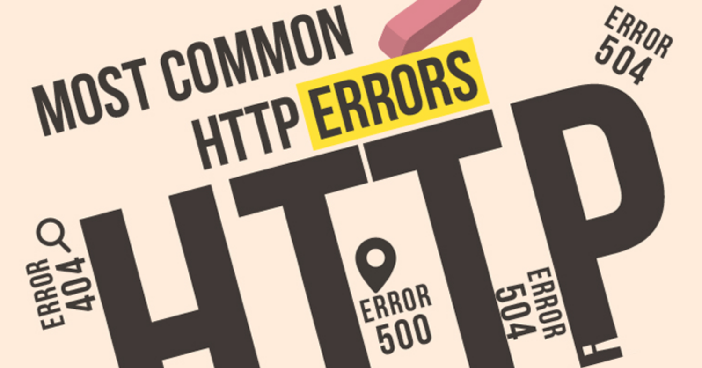

从报文头，我们都能看到这个 status 200 ok，那究竟还有什么其他的状态码吗？多到你怀疑人生...🤨<br>

#### 1XX Informational 接收的请求正在处理(在忙呢在忙呢)
**100 Continue**<br>
* 行为: HTTP/1.1 协议里设计100状态码目的是，在客户端发送Request Message之前，HTTP/1.1协议允许客户端先判定服务器是否愿意接受客户端发来的消息主体(基于Request Headers)
* 含义: 即Client和Server在POST较大数据之前，允许双方”握手🤝“，如果匹配上了，Client才开始发送(较大)数据。这样降低资源开销。因为如果客户端直接发送请求数据，但是服务器又将该请求拒绝，这样，数据就浪费了。
* 操作: 如果预期等待100-continue的应答，那么它发的请求必须包含一个"Expect:100-continue"的头域

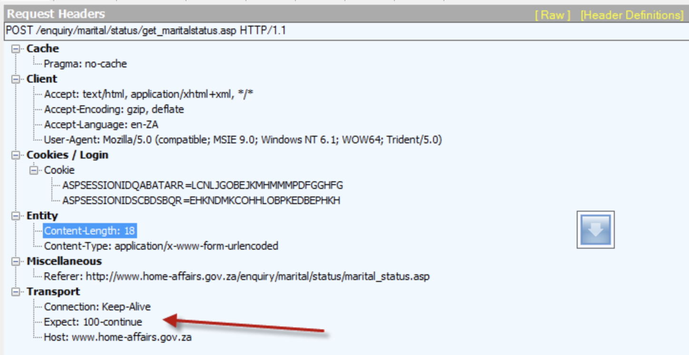

所以，客户端一般要发送较大的POST请求时，会先发一个100-continue的请求，就像上面说的那样。<br>

**101 Switching Protocols**<br>
表示访问当前资源需要更换协议进行数据传输<br>
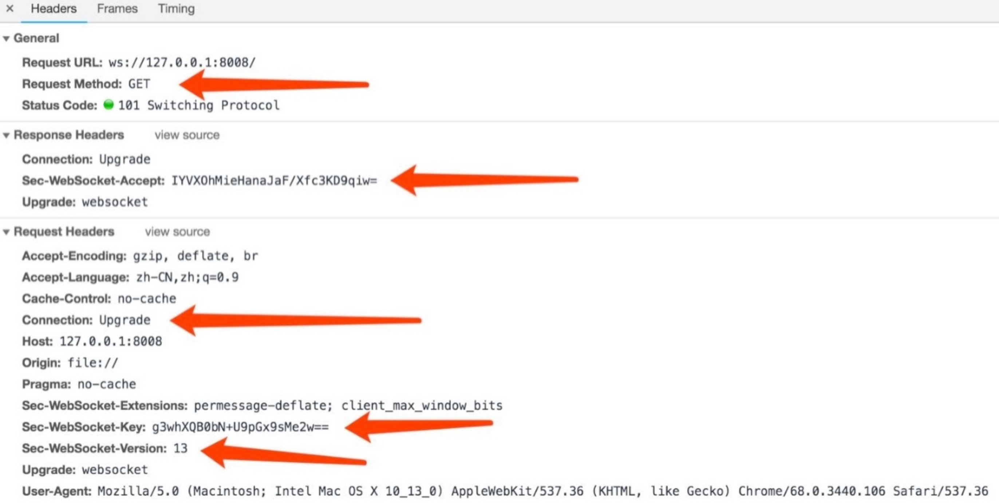

#### 2XX 你的请求已经被服务器正确处理✅ (没问题🆗)
**200 🆗**<br>
请求被服务器成功处理，服务器会根据不同的请求方式返回结果<br>

**201 Created**<br>
请求已经被实现了，而且有一个新的资源已经依据请求的需求建立了，且其URI已经随Location头信息返回。<br>
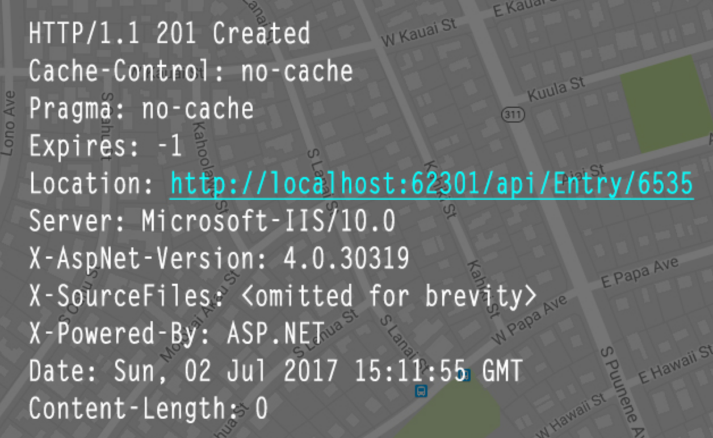

**204 No Content**<br>
1⃣️服务器已经完成了处理，但是不需要返回响应体(no content)<br>
2⃣️与200状态，没有实体返回的区别在于，浏览器处理204的状态码，只是回去读取报文头的更新信息，若UA是一个浏览器，请求的时候 `<a href="xxx">`标签形式，204是不会发生页面跳转的。相对应的200会。<br>
RFC原文描述

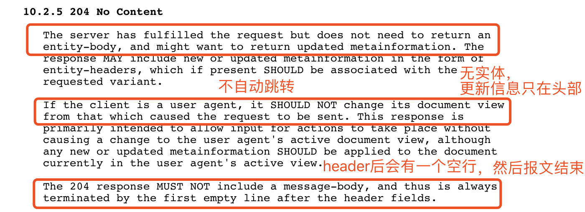

**206 Partial Content**<br>
1⃣️表示客户端发起了范围请求，而服务器只对其中一部分的请求成功处理了<br>
2⃣️此时客户端请求，必须包含有range字段，而服务端报文中，必须包含有Content-Range指定的实体内容(entity)<br>

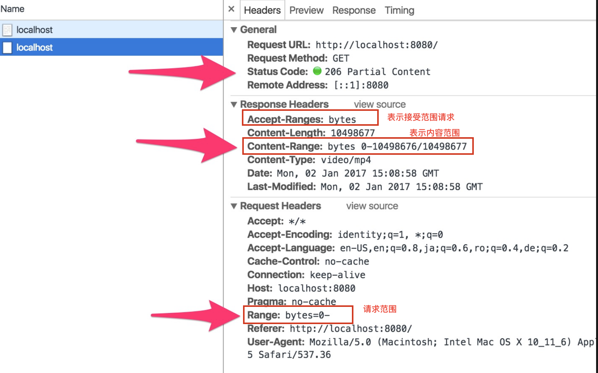

客户端发请求时对应的Range，服务器端响应时对应的是Content-Range<br>

Range字段含义:<br>
* bytes=SSS-RRR 有头有尾，表示S-R字节范围的内容 下载
* -RRR，表示最后RRR字节的内容 下载
* SSS-，表示从SSS字节开始到文件结束部分的内容 下载
* 0-0，-1，表示第一个和最后一个字节
* SSS1-RRR1,SSS2-RRR2同时指定几个范围 下载

Content-Range:<br>
用于响应头，在发出带Range的请求后，服务器会在Content-Range头部返回当前接受的范围和文件的总大小

```
Content-Range:bytes(unit first byte pos) - [last byte pos]/[entity length]

Content-Range:bytes 0-499/244242
```
0-499是指响应当前的请求数据范围，244242表示文件的总大小。响应完成后，返回的响应头内容也不同

```
HTTP/1.1 200 OK (不使用断点续传方式)
HTTP/1.1 206 Partial Content (使用断点续传方式)
```
会出现错误吗？传文件最容易出错！<br>
##### 增强校验
举个🌰 终端💻发起续传请求时，URL对应的文件内容服务端已经发生了变化，此时续传的数据肯定是错误的。如何解决这个问题呢？显然此时需要有一个标识文件唯一性的方法。<br>
在 RFC2616 中也有相应的定义，比如实现 Last-Modified 来标识文件的最后修改时间，这样即可判断出续传文件时是否已经发生过改动。同时 FC2616 中还定义有一个 ETag 的头，可以使用 ETag 头来放置文件的唯一标识。<br>
我们来看看文件发生变化之后会触动什么首部字段改变。要知道，首部字段就是告知两端信息的变化的。<br>

* Last-Modified: 与If-Modified-Since一样都是用于记录📝页面最后修改时间的HTTP头信息的。而Last-Modified是由服务器往客户端发送的HTTP头，而If-Modified-Since则是由客户端往服务器发送的头部信息。

可以看到，再次请求本地存在的缓存页面时， **客户端会通过If-Modified-Since头将先前服务器端发过来的Last-Modified最后修改时间戳发送回去** 这是为了让服务器端进行验证，通过这个时间戳判断客户端的页面是否最新，如果不是最新的，则返回新的内容，如果是最新的，则返回304 Not Modified，告诉客户端本地cache的页面是最新的。这样，客户端就可以直接从本地加载页面了，这样在网路上传输的数据就会大大减少，同时也减轻了服务器的负担。<br>

* Etag(Entity Tags): 主要为了解决Last-Modified无法解决的一些问题(什么问题？)

1. 一些文件也许会周期性更改，但是内容不变(仅仅修改了时间)，这时候，并不希望客户端会认为这个文件被改变了，而重新GET
2. 某些文件修改频繁，例如在秒以下的单位时间内修改了N次，而，If-Modified-Since能检查到的粒度是s级的，这种修改无法判断
3. 某些服务器不能精确得到文件的最后修改时间

`etag: "36BE3457520CDFD54CA910564E580EAE"` http/1.1引入Etag，唯一的标识，表示文件的版本。<br>

* If-Range: 判断实体是否发生改变，如果未改变，服务器发送客户端丢失的一部分，否则发送整个实体。一般格式

```
If-Range:Rtag|HTTP-Date

If-Range: "36BE3457520CDFD54CA910564E580EAE"
If-Range: Fri, 22 Feb 2019 03:45:02 GMT
```
也就是说，If-Range可以使用Etag或者Last-Modified返回的值。当没有Etag却有Last-Modified时，可以把Last-Modified作为If-Range字段的值<br>

If-Range必须与Range配套使用。如果请求报文中没有Range，那么If-Range就会被忽略。如果服务器不支持If-Range，那么Range就会被忽略掉。<br>

如果请求报文中的Etag与服务器目标内容的Etag相等，即没有发生变化，那么应答就是206。如果发生了变化，应答报文的状态码为200。<br>

其他用于增强校验的HTTP头信息: If-Match/If-None-Match、If-Modified-Since/If-Unmodified-Since

工作:Etag由服务器端生成，客户端通过If-Range条件判断请求来验证资源是否修改。<br>
➡️第一次请求:发起get，服务器处理请求，返回文件内容以及相应的header，其中包括Etag，状态码200
➡️第二次请求: 发起get，同时发送If-Range，服务端判断Etag和计算出来的Etag是否匹配，匹配206，不匹配200

为了保证资源可靠，首部字段也很给力。<br>

#### 3XX 服务器端已经接受到了请求，客户端必须对请求进行一些特殊的处理之后，才能顺利完成此处请求
**301 Move Permaneltly 永久重定向**<br>
301出现，表示请求的URL资源已经被分配了新的定位符，
* HEAD请求下，必须在头部Location字段中明确指出新的URI
* 除了有Location字段外，还需要在响应体中，附上永久性的URI的连接文本
* 若是客户使用POST请求，服务端若是使用重定向，则需要经过客户同意
* 对于301来说，资源除非额外指定，否则默认都是可缓存的

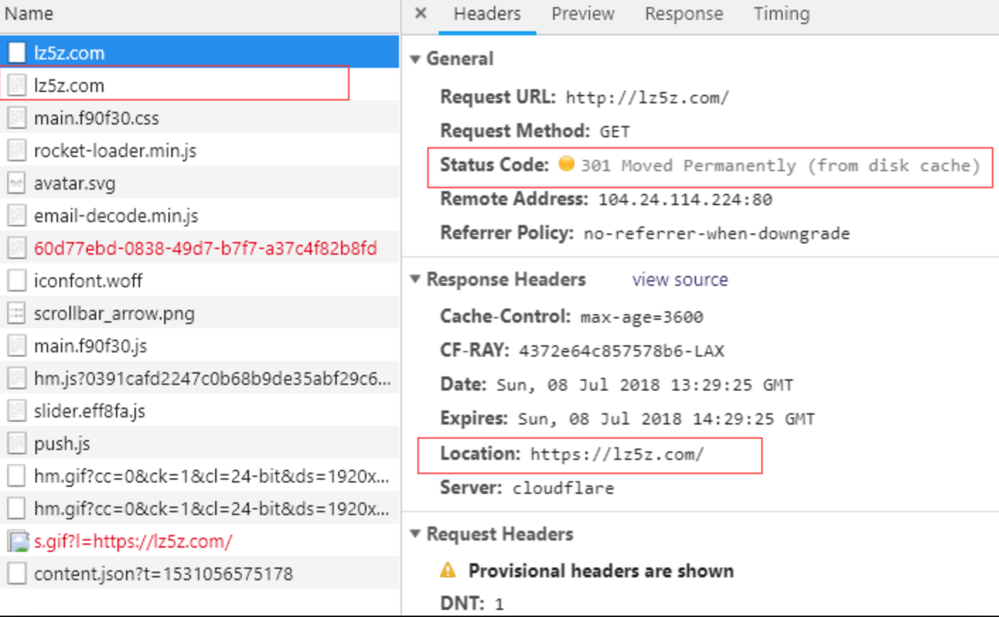

⭕️实际场景，使用http访问一些https资源的时候，浏览器设置了自动重定向https，那么首次访问就会返回301状态码<br>

**302 Found 临时重定向**<br>

* 302临时重定向，只对本次的请求进行重定向
* 若用户将本URI收藏起来，不去修改书签🔖中的指向(只是暂时的)
* 重定向的时候，RFC规范规定，不会去改变请求的方式。但实际上，很多现存的浏览器都直接将302响应视为303响应，并且在重定向的时候，使用GET方式返回报文中Location字段指明的URL
* 对于资源缓存，只有Cache-Control或Expires中进行了指定的情况下，这个响应才是可缓存的

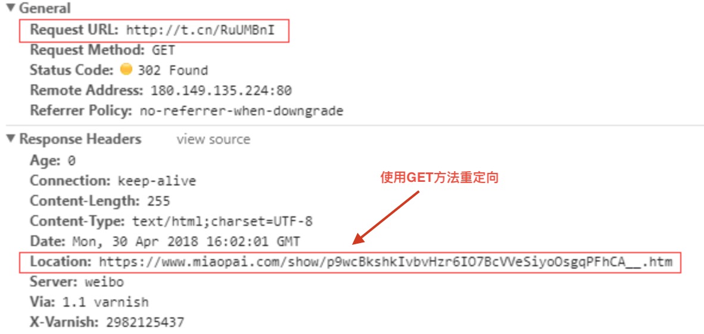

⭕️实际场景:使用网站端地址，访问的时候就会临时重定向到我们压缩前地址指向的页面<br>

**303 See Other存在着另一个资源URI(重定向)**<br>
* 表明用户请求的资源，还存在着另一个URI，其实也是重定向的含义

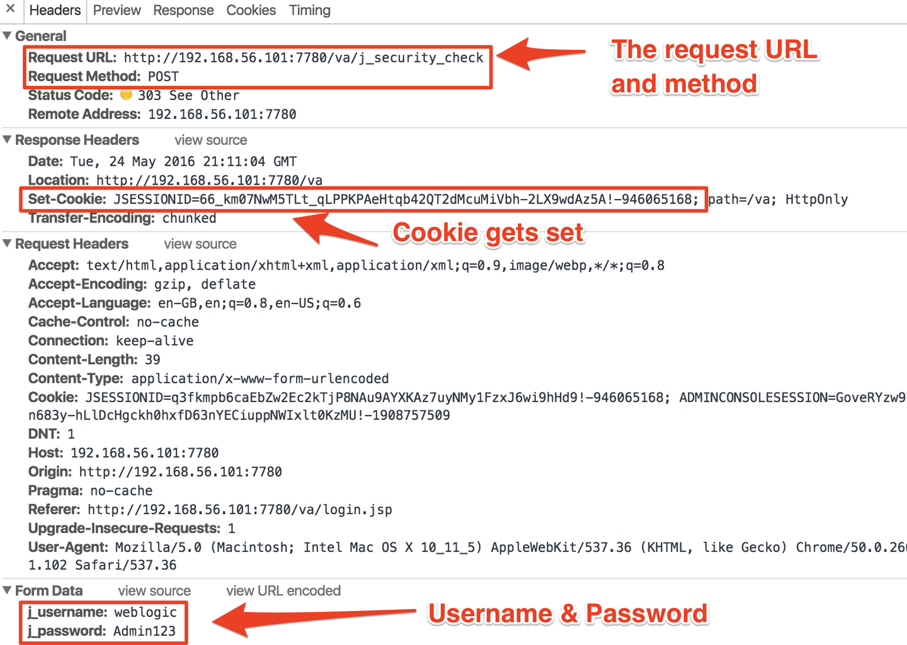

**304 Not Modified**<br>
这个乱入的状态码，硬生生成了HTTP界的一股清流。他与重定向无关。表示1⃣️本次请求命中了缓存策略，客户端可以直接从本地缓存中取出内容2⃣️304状态码返回时，不包含任何响应的主体部分<br>

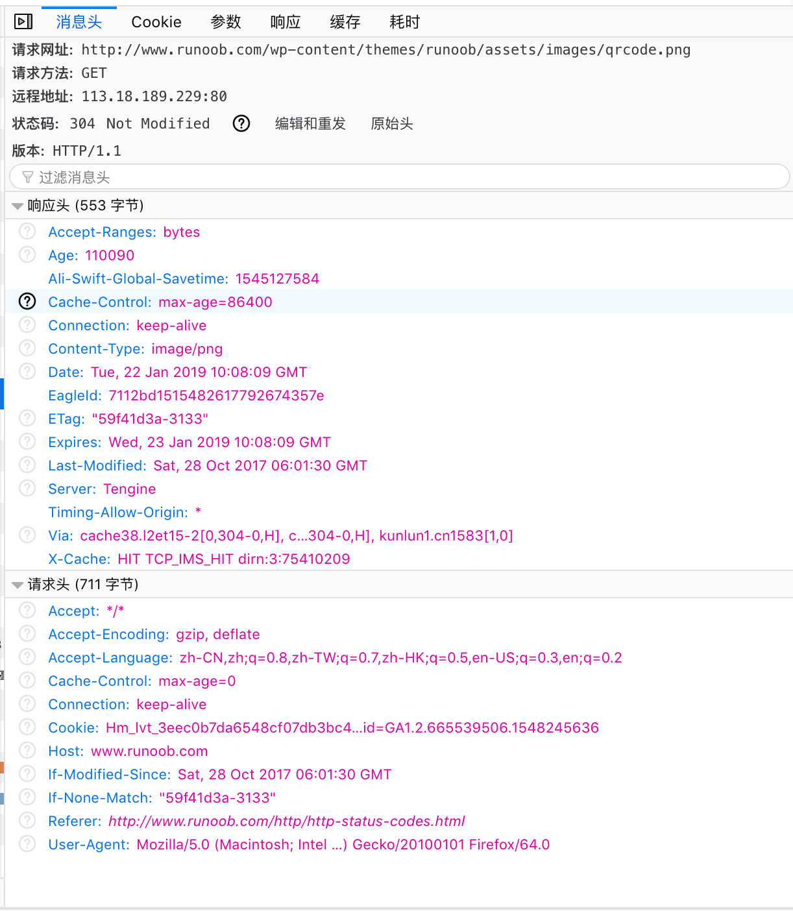

**307 Temporary Redirect**<br>
* HTTP/1.1文档中307状态码相当于HTTP1.0文档中的302状态码
* 当客户端的POST受到服务端的307响应时，需要跟用户询问是否应该在新的URI发起POST方法。307遵循浏览器标准，不会将POST改为GET。(听话的好孩子👦)

http1.0和http1.1都规定，若客户端发送的是非GET或者HEAD请求，响应头中携带301或302的时候，浏览器不会自动进行重定向，而是需要询问用户，因此此时请求的情况已经发生了变化<br>

301,RFC文档说明:

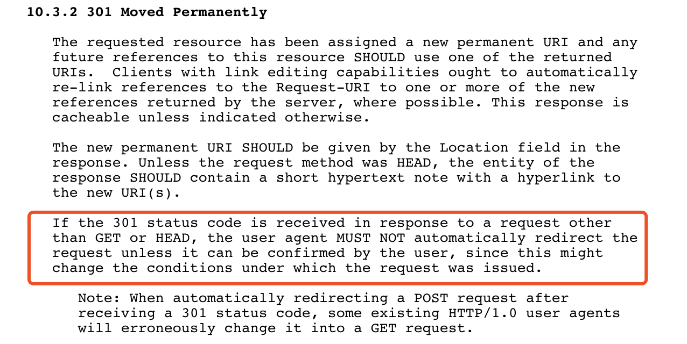

302,RFC http1.0文档说明

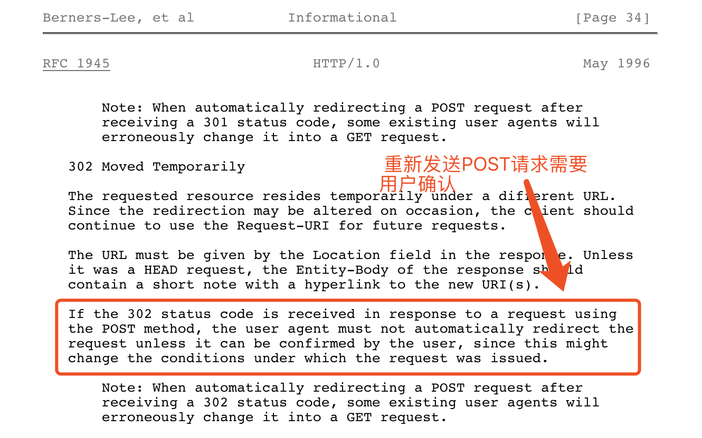

302,RFC http1.1文档说明

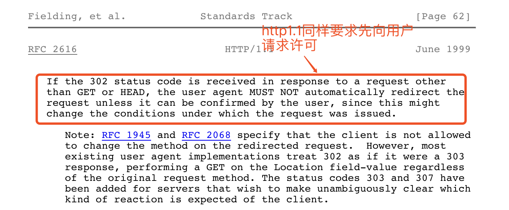

但是⭕️实际场景，所有的浏览器都会默认把POST请求直接改为GET请求<br>
301会将旧网址替换后重定向的网址，而302则会保留就有的网页内容(毕竟是暂时的，说不好什么时候又改回来，还是自己留一份比较好)<br>

#### 4XX 表明客户端是发生错误的原因所在(❌)
**400 BAD REQUEST**<br>
1⃣️表示该请求报文中`存在语法错误`，导致服务器无法理解该请求。客户端需要修改请求的内容后再次发送请求<br>
2⃣️一般也可以用于用户提交的表单内容不完全正确，服务端也可以用400响应客户(你TM错了❌)

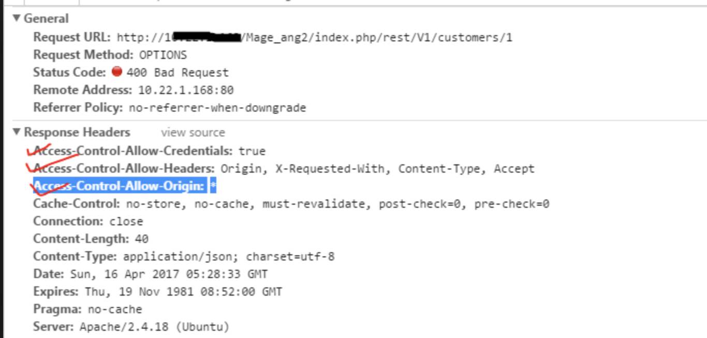

**401 UNAUTHORIZED未授权**<br>
1⃣️该状态码表示发送的请求需要有通过HTTP认证<br>
2⃣️当客户端再次请求该资源的时候，需要在请求头中的Authorization包含认证信息<br>

验证失败返回401

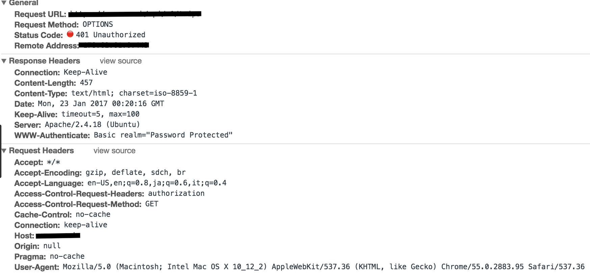

客户端主动提供Authorization信息

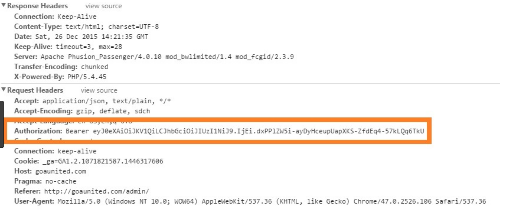

3⃣️www-authenticate:Basic表示一种简单的，有效的用户身份认证技术<br>

##### Basic 验证过程简述
1⃣️客户端访问一个受http基本认证保护的资源<br>
2⃣️服务器返回401状态码，要求客户端提供用户名和密码进行认证(验证失败的时候，响应头会加上WWW-Authenticate Basic realm="请求域")

```
401 Unauthorized
WWW-Authenticate:Basic realm="wallyworld"
```
3⃣️客户端将输入的用户名密码用Base64进行编码后，采用非加密的明文方式传送给服务器

```
Authorization:Basic xxxxxxxxx
```
4⃣️服务器将Authorization头中的用户名密码并取出，进行验证，如果验证成功，则返回相应的资源。如果认证失败，则仍返回401状态，要求重新进行认证<br>

**403 FORBIDDEN**<br>
1⃣️该状态码明显被服务器拒绝了❌<br>
2⃣️服务器没有必要给出拒绝的详细理由，但如果想做说明的话，可以在实体的主体部分原因进行描述<br>
3⃣️未获得文件系统的访问权限，访问权限出现某些问题，从未授权的发送源IP地址试图访问等情况都有可能发生403响应<br>

**404 Not Found**<br>
无法找到指定资源，通常也被服务端用户表示不想透露请求失败原因<br>

**405 Method Not Allowed**<br>
表示该资源不支持该形式的请求方式，在Response Header中返回Allow字段，携带支持的请求方式<br>

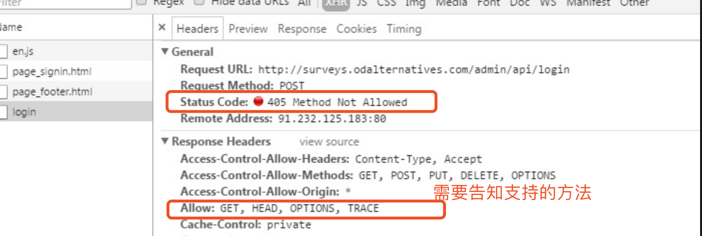

**412 Precondition Failed**<br>
在请求报文中的If-xxx字段发送到服务端后，服务端发现没有匹配上。比如 If-Match:asfdfasfsd，希望匹配ETag值<br>

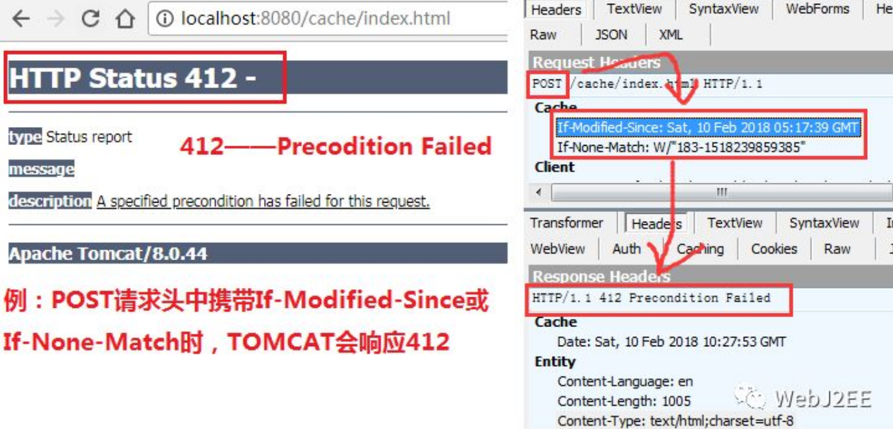

#### 5XX表示服务器本身发生错误
**500 Internal Server Error**<br>
表示服务器端在处理客户端请求的时候，服务器内部发生了错误(以前遇到这个问题都是代码出错了)

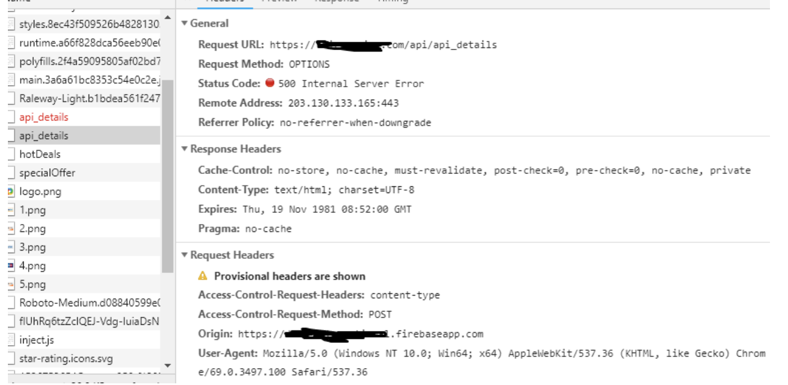

**502 Bad GateWay**<br>
1⃣️表示连接服务器的边界路由器出问题，导致不能到达(就网关路由出错)<br>

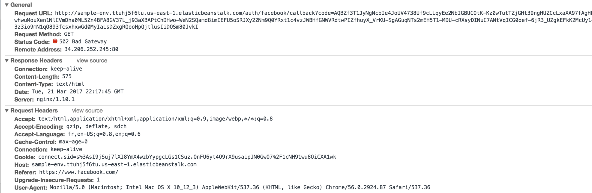

**503 Service Unavaliable**<br>
1⃣️该状态码表示服务器已经处于一个超负荷的一个状态，或者所提供的服务暂时不能够正常使用<br>
2⃣️若服务器端能够事先得知服务恢复时间，可以在返回503状态码的同时，把恢复时间写入Retry-After字段中<br>
3⃣️要是没有Retry-After，那么客户端会把这个状态码处理成500<br>

好了，讲了POST，GET等请求和状态码以及首部字段，接下来该讲缓存机制了。篇幅有限，下文继续讲。<br>


---------------------------------------------------
## HTTP2.0 基于流的传输 忍受够了等待
HTTP1.1是一个渣男，那HTTP2.0是不是呢？是的，也一样，同一个家族的怎么就不是了呢？那HTTP2.0怎样，更渣，同时撩好几个。<br>
HTTP协议在不断滴进化，演化到现在就有了HTTP2.0，HTTP1.1在应用层上以纯文本的形式进行通信。每次通信都要带完整的HTTP头，而且不考虑pipeline模式的话，每次一去一回，这样实时性、并发性都会存在问题。<br>
HTTP2.0进化级别渣男！在二进制帧、多路复用、请求优先级、流量控制、服务器端推送以及首部压缩🗜️等新改进。比HTTP1.1更快，秒男！为了吸引注意力，也是够牛掰滴<br>
HTTP协议站在(巨人的肩膀上)TCP协议之上，TCP作为传输层其实离应用层不愿。HTTP协议的瓶颈及其优化技巧都是基于TCP协议本身的特性。比如， **TCP建立连接时三次握手会有1.5个RTT(round-trip time)延迟**，为了避免每次都经历握手🤝带来的延迟，长链接(keep Alive)是一种方案。HTTP1.0被抱怨最多的就是 **连接无法复用**和 **head of line blocking**，产生两个问题的前提是客户端依据域名来向服务器建立连接，一般PC端浏览器会针对单个域名的server同时建立6～8个连接(考虑服务器的端口数量和线程切换开销的考虑，8个以内最适合[参考文章](https://blog.csdn.net/yishouwangnian/article/details/52788626?utm_source=blogxgwz8))，手机端的连接数则一般控制在4～6个。显然连接数并不是越多越好，因为资源的开销和整体延迟都会随之增大。<br>
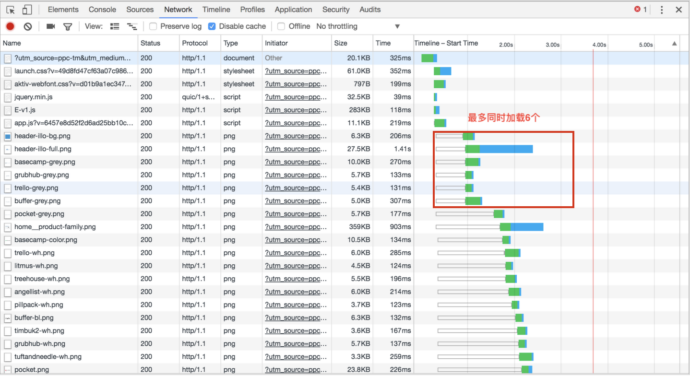

**连接无法复用**会导致每次请求都经历三次握手和慢启动。三次握手在高延迟的场景下影响较明显，慢启动则对文件类大请求影响较大。<br>
**head of line blocking** 会导致带宽无法被充分利用，以及后续请求被阻塞。假设有5个请求同时发出，如下图：<br>
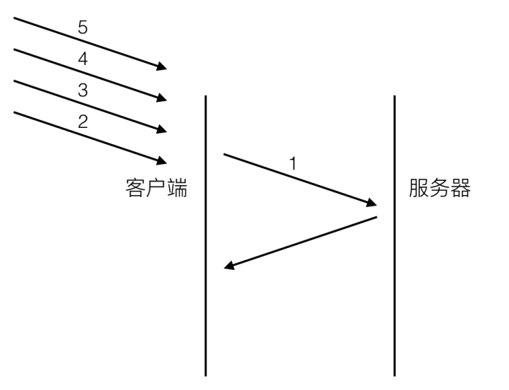

对于HTTP1.0的实现，在第一个请求没有受到回复之前，后续从应用层发出的请求只能排队，只有等1 response回来之后，才能逐个发出。网络畅通的时候性能影响不大，一旦请求1的request因为丢包或者超时等问题没有抵达服务器，或者response因为网络阻塞没回来，影响的就是所有后续请求了。<br>
* 解决连接无法复用有几种方案，分别是基于TCP长连接，http long-polling，http-streaming，web socket。但是这几种方案也有各自的缺陷<br>

* 解决head of line blocking的方案是http pipelining多路并行，但这种方案只适用于http1.1，而且只有幂等请求(GET、HEAD)能使用，非幂等POST就不行，因为请求关系可能会有先后依赖，response还要依次返回，遵循FIFO原则，[pipeling问题描述](https://www.chromium.org/developers/design-documents/network-stack/http-pipelining)<br>

#### SPDY开拓者，但只是google的玩具
HTTP2.0是以SPDY为原型进行讨论和标准化的。SPDY的目标就瞄准了HTTP1.x的痛点，延迟和安全性🔐。安全性是因为http是明文协议，安全性一直被业界诟病。

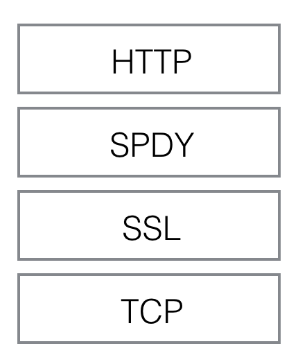

SPDY位于HTTP之下，TCP和SSL之上，这样可以兼容老版本的HTTP协议，同时使用已有的SSL功能。SPDY功能可以分为基础功能和高级功能，基础功能默认启动，高级功能手动启动<br>

**SPDY基础功能**<br>
* 多路复用（multiplexing）。多路复用通过多个请求stream共享一个tcp连接的方式，解决了http1.x holb（head of line blocking）的问题，降低了延迟同时提高了带宽的利用率。
* 请求优先级（request prioritization）。多路复用带来一个新的问题是，在连接共享的基础之上有可能会导致关键请求被阻塞。SPDY允许给每个request设置优先级，这样重要的请求就会优先得到响应。比如浏览器加载首页，首页的html内容应该优先展示，之后才是各种静态资源文件，脚本文件等加载，这样可以保证用户能第一时间看到网页内容。
* header压缩。前面提到过几次http1.x的header很多时候都是重复多余的。选择合适的压缩算法可以减小包的大小和数量。SPDY对header的压缩率可以达到80%以上，低带宽环境下效果很大。

**SPDY高级功能**<br>
* server推送（server push）。http1.x只能由客户端发起请求，然后服务器被动的发送response。开启server push之后，server通过X-Associated-Content header（X-开头的header都属于非标准的，自定义header）告知客户端会有新的内容推送过来。在用户第一次打开网站首页的时候，server将资源主动推送过来可以极大的提升用户体验。
* server暗示（server hint）。和server push不同的是，server hint并不会主动推送内容，只是告诉有新的内容产生，内容的下载还是需要客户端主动发起请求。server hint通过X-Subresources header来通知，一般应用场景是客户端需要先查询server状态，然后再下载资源，可以节约一次查询请求。

SPDY从2012年诞生到2016年就停止维护了，时间跨度对于网络协议来说非常短。但是取得的成绩非常好。对于页面加载同比http1，x减少64%，丢包率也降低了(由于对header压缩有80%以上，整体包能减少大概40%，包少，丢的也少)，带宽延迟减小(一般RTT越大，延迟越大，在高RTT的场景下，由于SPDY的request是并发进行的，对包的利用率高，反而能更明显减小总体延迟)，这都足以让他称霸一时。<br>

讲了那么多历史，接下来开始讲讲HTTP2.0<br>
### HTTP2.0 业界的焦点
HTTP2.0协议到底提高了哪些方面。首先要清楚一点，HTTP2.0较于SPDY并没有SSL层和TLS层，HTTP2.0并没有做安全的套件。为什么？其实加上也是可以的啊，所以如果只是担心一个多余的RTT延迟，就不用SSL，请求的成功率就不高，所以如果HTTP2.0加上SSL，被封装的request就不会被监听和修改，请求的成功率自然上升🔝<br>
那么HTTP2.0到底提高了哪些方面？新的二进制格式(Binary Format)，连接共享，header压缩🗜️，压缩算法的选择，重置连接表现更好，Server Push，流量控制，Nagle Algorithm与TCP Delayed Ack，更安全的SSL。<br>
#### 新的二进制格式 帧让一切变得简洁
HTTP2.0性能增强的核心在于新增的二进制分帧层，定义了如何封装HTTP消息并在客户端与服务器之间传输。


那么每个帧又是怎么定义呢？

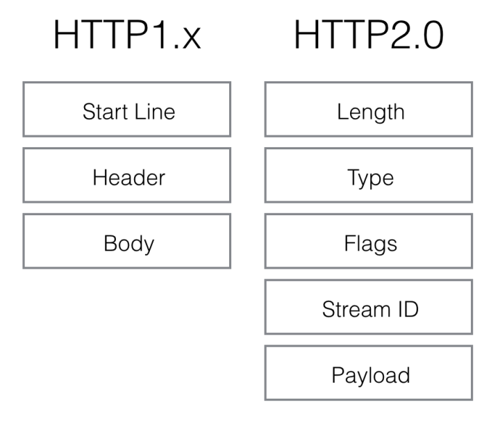

上图对比了HTTP1.x以文本格式为基础和http2.0类似tcp/ip这种二进制帧为基础的不同。

帧的格式

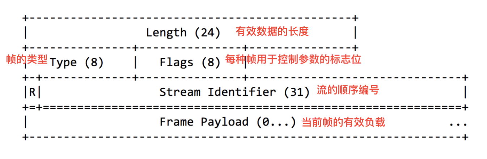

http2.0的格式定义更接近于TCP层的方式。length定义了整个frame的长度，type定义了frame的类型(一共10种)，flags用bit位定义一些重要的参数，stream id用作流的控制，payload就是request的正文部分。<br>

| 名称 类型     | 帧代码 | 作用                                                                                                                         |
| ------------- | ------ | ---------------------------------------------------------------------------------------------------------------------------- |
| DATA          | 0x0    | 一个或多个DATA帧作为请求、响应内容载体                                                                                       |
| HEADERS       | 0x1    | 报头主要载体，请求头或响应头，同时呢也用于打开一个流，在流处于打开"open"或者远程半关闭"half closed (remote)"状态都可以发送。 |
| PRIORITY      | 0x2    | 表达了发送方对流优先级权重的建议值，在流的任何状态下都可以发送，包括空闲或关闭的流。                                         |
| RST_STREAM    | 0x3    | 表达了发送方对流优先级权重的建议值，任何时间任何流都可以发送，包括空闲或关闭的流。                                           |
| SETTINGS      | 0x4    | 设置帧，接收者向发送者通告己方设定，服务器端在连接成功后必须第一个发送的帧。                                                 |
| PUSH_PROMISE  | 0x5    | 服务器端通知对端初始化一个新的推送流准备稍后推送数据                                                                         |
| PING          | 0x6    | 优先级帧，发送者测量最小往返时间，心跳机制用于检测空闲连接是否有效。                                                         |
| GOAWAY        | 0x7    | 一端通知对端较为优雅的方式停止创建流，同时还要完成之前已建立流的任务。                                                       |
| WINDOW_UPDATE | 0x8    | 流量控制帧，作用于单个流以及整个连接，但只能影响两个端点之间传输的DATA数据帧。但需注意，中介不转发此帧。                     |
| CONTINUATION  | 0x9    | 用于协助HEADERS/PUSH_PROMISE等单帧无法包含完整的报头剩余部分数据                                                             |

针对不同类型的资源，HTTP2进行了不同程度的优先传输。例如页面传输中，script和link会被优先传输，类似图片这种大文件。优先级降低<br>

实际上http2.0并没有改变http1.x的语义，只是把原来http1.x的header和body部分用frame重新封装了一层而已。调试的时候浏览器甚至会把http2.0的frame自动还原成1.x的格式。所以不需要担心调试。<br>

#### 连接共享 HTTP2.0所有通信都在一个连接上完成，这个连接可以承载任意数量的双向数据流
http2.0要解决的一大难题就是多路复用(MultiPlexing)。stream id就是用作连接共享机制的。一个request对应一个stream并分配一个id，这样一个联机上可以有多个stream，每个stream的frame可以随机的混杂在一起，接收方可以根据stream id将frame再归属到各自不同的request里面。<br>
前面提到过连接共享之后，需要优先级和请求依赖的机制配合才能解决关键请求被阻塞的问题。HTTP2.0里的每个stream都可以设置有优先级和依赖。优先级高的stream会被server优先处理和返回给客户端，stream还可以依赖其他的sub streams。优先级和依赖都是可以动态调整的。动态调整在有些场景下很有用，假想用户在用你的app浏览商品的时候，快速的滑动到了商品列表的底部，但前面的请求先发出，如果不把后面的请求优先级设高，用户当前浏览的图片要到最后才能下载完成，显然体验没有设置优先级好。同理依赖在有些场景下也有妙用。<br>

再详细到流，消息和帧<br>
* 流，已经建立再连接上的双向字节流
* 消息，与逻辑消息对应的完整的一系列数据帧
* 帧，HTTP2.0通信的最小单位，每个帧包含帧首部， **至少也会标识出当前帧所属的流**

每个数据流以消息的形式发送，而消息由一或多个帧组成，这些帧可以乱序发送，然后根据每个帧首部的流标识符重新组装。<br>
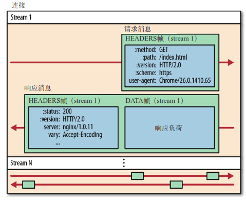

HTTP2.0把HTTP协议通信的基本单位缩小为一个一个帧，这些帧对应着逻辑流中的消息，相应地，很多流可以并行地在同一个TCP连接上交换消息。<br>

#### header压缩 压缩首部元数据
两端既然都知道首部的值，就不用重复发送了，也压缩🗜️成一个简单的帧发送。<br>


请求的第一个流已经有了header帧，在连接的时候已经有了首部的信息帧，所以可以针对之前的首部数据只编码发送差异的数据帧。<br>
如图的请求1，path:/resource与请求2，path:/new_resource，在不同的流，只编码有差异的数据。<br>
那，为什么一定要压缩呢？为了性能的提高，可以，但是还有其他解释吗？我们知道TCP的MTU最大传输但愿是1500个字节一个segment，当发送的包超过2个segment或者4k大小，就会导致网络节点阻塞，延迟，丢包率就高了，而http的header有可能会膨胀到这个超过这个大小，所以压缩。<br>

##### 压缩算法的选择 HPACK
[HPACK](https://http2.github.io/http2-spec/compression.html)点击参考header压缩算法选择<br>
具体将报文头中常见的一些字段变成一个索引值index，维护一张静态索引表(key:value)，例如把method:POST,user-agent,协议版本等，对应一个index值。<br>
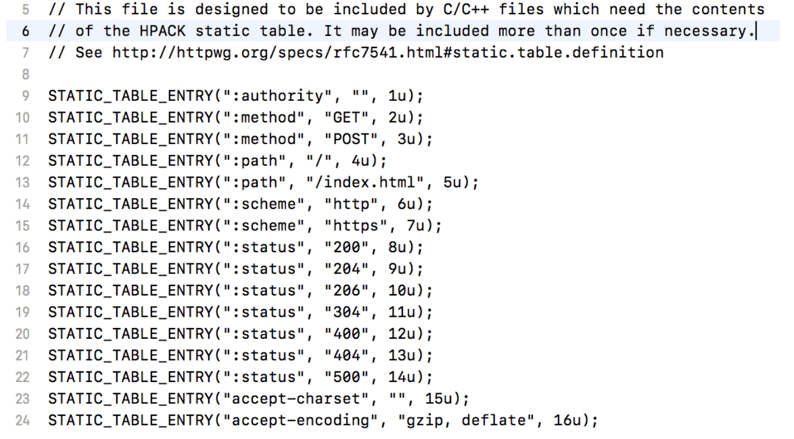

静态表格一共有61个常用字段搭配。<br>
##### 动态索引表
动态索引表功能类似于静态索引表，动态索引表的索引存放在静态索引表中。请求发现了新内容，则在动态索引表中建立新的索引，而就旧的索引表依然可以用于查询。<br>
动态索引表格，从62开始计算，有新的字段增加，就用最小的索引去记录它，而不是使用大的索引
```
table_.push_front(entry);
```
##### huffman压缩 贪心策略
对于经常变化的内容，类似于"资源路径"，HPACK压缩则使用Huffman编码进行压缩。因为请求的文件过大，查结果一个TCP报文时，会被分成几个TCP报文进行传输，压缩能够有效的减少TCP传输的数目。<br>
#### 重置连接会表现🉐️更好
很多客户端都有取消图片下载的功能，这个对于http1.x来说怎么做到呢？通过设置tcp segment里的reset flag来通知对端关闭连接的。这种方式会直接断开连接，reset嘛，在tcp就是重置，断开。下次再发请求就必须重新建立连接。 **而HTTP2.0引入RST_STREAM类型的frame，可以不断开链接的前提下取消某个request的stream。**<br>

#### Server Push 服务器可以对一个客户端请求发送多个响应
Server Push，SPDY的产物，HTTP1.x都是客户端请求才有的响应，而HTTP2.0通过push的方式将客户端需要的内容预先推送过去，所以也叫"cache push”。另外，⚠️客户端如果推出某个业务场景，处于流量的控制或者其他因素就取消server push，也可以通过发送RST_STREAM类型的frame来做到。<br>
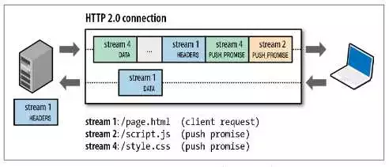

就像上面👆，服务端根据客户端的请求，提前返回多个响应，推送额外的资源给客户端。客户端请求stream1(/page.html)。服务端同时推送stream2，stream3<br>

##### 服务器推送如何工作？
* PUSH_PROMISE帧是服务端向客户端有意推送资源的信号
* PUSH_PROMISE帧只包含预推送资源的首部。如果客户端已经缓存了该资源，不需要推送，可以拒绝PUSH_PROMISE帧(客户端发送RST_STREAM帧)
* PUSH_PROMISE必须遵循请求-响应原则，只能借着请求的响应推送资源
* PUSH_PROMISE帧必须在返回响应之前发送，以免客户端出现竞态条件
* HTTP2.0连接后，客户端与服务端交换SETTINGS帧，借此限定双向并发的最大数量。因此，客户端可以限定推送流的数量，或者通过把这个只设置为0来完全禁止服务器推送
* 所有推送的资源都必须遵守同源策略。换句话说，服务器不能随便将第三方资源推动给客户端，而必须是经过双方确认才行
🌰
在客户端请求想服务端请求过一个资源"A"后，而服务端"预先"知道，客户端很有可能也会需要另一个资源"B"。 那么服务端就会在客户端请求“B”之前，主动将资源“B”推送给客户端

```
## nginx 配置文件
location = /html/baidu/index.html {   ## 表示在访问这个地址的时候
    # 主动向客户端推送以下资源   
    http2_push /html/baidu/main.js?ver=1;
    http2_push /html/baidu/main.css;
    http2_push /html/baidu/image/0.png;  
    http2_push /html/baidu/image/1.png;  
    http2_push /html/baidu/image/2.png;
    http2_push /html/baidu/image/3.png;
    http2_push /html/baidu/image/4.png;
    http2_push /html/baidu/image/5.png;
    http2_push /html/baidu/image/6.png;
}
```
根据上图的配置，客户端请求/html/baidu/index.html页面的时候，服务器不会马上返回页面的信息，而是首先将所配置资源以数据帧的形式，与客户端建立多条stream。这样可以有效减少资源所需的响应时间，而浏览器收到服务器的主动推送，就可以直接进行下载阶段。<br>
#### 更安全的SSL
HTTP2.0使用了tls的拓展ALPN来做协议升级，除此之外加密这块还有一个改动，HTTP2.0对tls的安全性做了近一步加强，通过黑名单机制禁用了几百种不再安全的加密算法，一些加密算法可能还在被继续使用。如果在ssl协商过程当中，客户端和server的cipher suite没有交集，直接就会导致协商失败，从而请求失败。在server端部署http2.0的时候要特别注意这一点。<br>

##### 一个对比 HTTP1.1🆚HTTP2.0
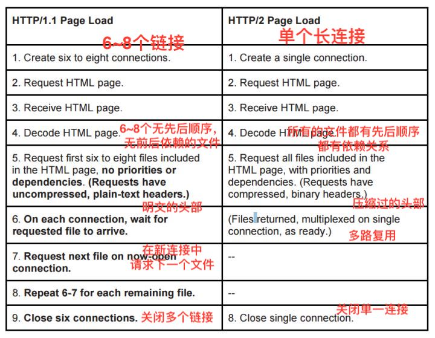
##### 说在最后
为什么说HTTP协议家族就是一个渣男？是因为他没有负上责任。HTTP1.1性能上比HTTP1.0更好，因为他用长连接解决了原始问题，但是只能单路使用，容易造成head line of blocking，而HTTP2.0比HTTP1.1还更好，他解决了多路复用的问题。这都是因为HTTP无状态的设计，带来的问题解决。HTTP也只有无状态设计才能处理大量事务。

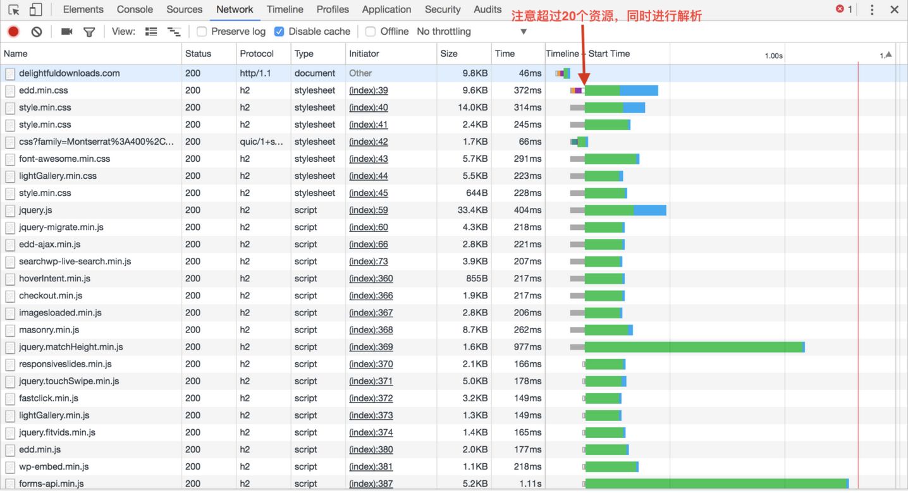

下一篇，将了解HTTPS，http+ssl+tls<br>

**参考连接**<br>
* [http2.0](https://www.cnblogs.com/Leo_wl/p/5763001.html)
* [HTTP/2.0 相比1.0有哪些重大改进？](https://www.zhihu.com/question/34074946/answer/108588042)
* [HTTP---HTTP2.0新特性](https://juejin.im/post/5a4dfb2ef265da43305ee2d0)
* [览器允许的并发请求资源数是有限制的-分析](https://blog.csdn.net/yishouwangnian/article/details/52788626?utm_source=blogxgwz8)

-------------------------------------------------------------------

## QUIC协议"城会玩" UDP也是我的主场
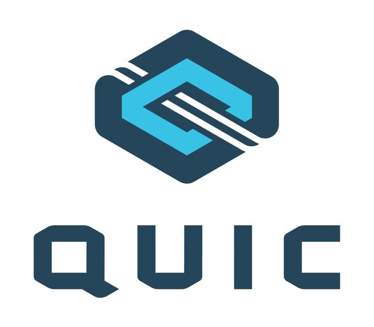

HTTP2.0虽然大大增加了并发性，但是还有问题。为什么呢？我们从底层TCP继续看，因为HTTP2.0也是基于TCP协议的，TCP协议在处理包时是有严格的顺序的。其中一个包遇到问题，TCP连接需要等待这个包完成重传之后才能继续进行。虽然，HTTP2.0通过多个stream，使得逻辑上一个TCP连接上的并行内容，并行多路数据的传输，然而中间并没有关联的数据。一前一后，前面stream2的帧没有收到，后面的stream1的帧也会因此阻塞。所以，HTTP2.0基于TCP实现还是要看TCP的可靠工作。贴近TCP报文设计，但还是得遵循TCP的传输规则，丢包还是要重传，响应还是按顺序来响应。<br>
这就给UDP表现的机会了。
#### 自定义连接机制 UDP报文简单，自定义成为可能
一条TCP连接是由四元组标识(源IP、源端口、目的IP、目的端口)，这个在网络通信是socket的参数。一旦一个元素发生变化时，就需要断开重连，重新连接。在移动互联网的情况下，当手机信号不稳定或者在WIFI和移动网络切换时，都会导致重连，从而进行再次的三次握手🤝，导致一定的时延。<br>
TCP也没有办法啊，TCP要可靠呀，断了就重连呀。但是基于UDP就不同，QUIC自己的逻辑里面维护连接的机制，不再以四元组标识，而是 **以一个64位的随机数作为ID来标识(聪明)**，而且UDP是无链接的，所以当IP或者端口变化的时候，只要ID不变，就不需要重新建立连接。<br>
所以UDP接收包，只需要检测ID匹配就行，匹配了就交给自己的应用，不匹配就继续放回数据链路继续吓一跳。<br>
#### 自定义重传机制 我用UDP，爱咋地就咋地
TCP为了保证可靠性，通过使用序号和应答机制，来解决顺序问题和丢包问题。<br>
任何一个序号的包发过去，都要在一定的时间内得到应答，否则一旦超时，就会重发这个序号的包。那怎么样才算超时？UDP怎样超时？TCP有 **自适应重传算法**，通过采样往返时间RTT不断调整。但是这个超时的采样存在不准确，例如，发一个包，序号100，发现没有返回，再发一个包100，过一阵返回ACK101。这个时候客户端知道这个包肯定收到了，但是往返时间怎么算？ACK到达时间减去后一个100发送的时间吗？时间算断了，减去前一个100发送的时间呢？时间算长了。<br>


QUIC也有序列号，递增，比TCP的序列号高级。任何一个序列号的包只发送一次，下次要是在发送就➕1。例如，发一个包100，没返回，再发送就101，如果返回ACK100，就是对第一个包的响应，如果返回ACK101，就是对第二个包的响应，RTT计算就相对准确。<br>
但是这里就有一个问题了，怎么知道包100和包101发送的是同样的内容呢？QUIC定义了一个offset概念。QUIC既然是面向连接的，就像TCP一样，是一个数据流，发送的数据在这个数据流里面有个偏移量offset，可以通过offset查看数据发送到哪里，这样只要这个offset包没有来，就要重发，如果来了，按照offset拼接，还是能够拼成一个流<br>

#### 无阻塞的多路复用
有了自定义的连接和重传机制，就可以解决多路复用问题。为什么？和HTTP2.0一样，同一条QUIC连接上可以创建多个stream，来发送多个HTTP请求。但是QUIC是基于UDP的，一个连接上的多个stream之间没有依赖。这样，加入stream2丢了一个UDP包，后面跟着stream3的一个UDP包，虽然stream2的那个包需要重传，但是stream3的包不需要等待，也可以直接发给用户(通过stream2应答，告诉对端需要重传)<br>
#### 自定义流量控制
TCP流量控制是通过滑动窗口协议。 **QUIC的流量控制也是通过window_update**，来告诉对端他可以接受的字节数。但是QUIC的窗口是适应自己的多路复用机制的，不但在一个连接上控制窗口，还在一个连接中的每个stream控制窗口。<br>
还记得吗？在TCP协议中，接收端的窗口的起始点是下一个要接收并且ACK的包。即便后来的包都到了，放在缓存里面，窗口也不能右移，因为TCP的ACK机制是基于序列号的累计应答，一旦ACK了一个系列号，就说明前面的都到了，所以只要前面的没到，后面的到了也不能ACK，就会导致后面的到了，也有可能超时重传，浪费带宽。<br>
而QUIC的ACK是基于offset的，每个offset的包来了，进了缓存，就可以应答，应答后就不会重发，中间的空挡会等待到来或者重发即可，而窗口的起始位置为当前收到的最大的offset，从这个offset到当前的stream所能容纳的最大缓存，是真正的窗口大小。


另外还有整个连接的窗口，需要对于所有的stream的窗口做一个统计。<br>


## dhcp

### 1. concepts
https://www.bilibili.com/video/BV1Gd4y1n7Xz/?spm_id_from=333.337.search-card.all.click&vd_source=8215bf938da2fb524fa6ffc652bb3c53

#### 1.1 什么是dhcp协议
DHCP(动态主机配置协议)是一个网络协议,用于自动分配网络配置信息给网络设备,使其能够连接和通信在IP网络.这些配置信息包括IP地址/子网掩码/默认网关/DNS服务器等.

DHCP的工作过程通常被称为DORA过程(Discover, Offer, Request, Acknowledge):

1. **发现(Discover)**:客户端发送DHCP发现消息,寻找可用的DHCP服务器.这个消息是一个广播消息,会被网络中的所有设备接收.

2. **提供(Offer)**:DHCP服务器接收到发现消息后,会向客户端发送DHCP提供消息,提供一个可用的IP地址和其他网络配置信息.

3. **请求(Request)**:客户端接收到提供消息后,会向DHCP服务器发送DHCP请求消息,请求使用提供的IP地址和其他网络配置信息.

4. **应答(Acknowledge)**:DHCP服务器接收到请求消息后,会向客户端发送DHCP应答消息,确认客户端可以使用提供的网络配置信息.

通过这个过程,客户端可以自动获取到网络配置信息,无需手动配置.

### 2. quiz


## 攻击方式

### CSRF/XSRF

#### 基本概念和攻击原理

* CSRF（Cross-site request forgery），中文名称：**跨站请求伪造**，也被称为：one click attack/session riding，缩写为：CSRF/XSRF

* CSRF攻击可以理解为：攻击者盗用了你的身份，以你的名义发送恶意请求。CSRF能够做的事情包括：以你名义发送邮件，发消息，盗取你的账号，甚至于购买商品，虚拟货币转账......造成的问题包括：个人隐私泄露以及财产安全

* CSRF攻击的思想：

  

  * 从上图可以看出，要完成一次CSRF攻击，受害者必须依次完成两个步骤：
    1. **登录受信任网站A，并在本地生成Cookie**
    2. **在不登出A的情况下，访问危险网站B**
  * 看到这里，你也许会说：“如果我不满足以上两个条件中的一个，我就不会受到CSRF的攻击”。是的，确实如此，但你不能保证以下情况不会发生：
    	1. 你不能保证你登录了一个网站后，不再打开一个tab页面并访问另外的网站
     	2. 你不能保证你关闭浏览器了后，你本地的Cookie立刻过期，你上次的会话已经结束（事实上，关闭浏览器不能结束一个会话，但大多数人都会错误的认为关闭浏览器就等于退出登录/结束会话了......）
     	3. 上图中所谓的攻击网站，可能是一个存在其他漏洞的可信任的经常被人访问的网站

#### 示例1

* 银行网站A，它以GET请求来完成银行转账的操作，如：http://www.mybank.com/Transfer.php?toBankId=11&money=1000

* 危险网站B，它里面有一段HTML的代码如下

  ```http
  
  ```

* 首先，你登录了银行网站A，然后访问危险网站B，噢，这时你会发现你的银行账户少了1000块......为什么会这样呢？
  * 原因是银行网站A违反了HTTP规范，使用GET请求更新资源
  * 在访问危险网站B的之前，你已经登录了银行网站A，而B中的以GET的方式请求第三方资源（这里的第三方就是指银行网站了，原本这是一个合法的请求，但这里被不法分子利用了）
  * 所以你的浏览器会**带上你的银行网站A的Cookie发出GET请求**，去获取资源“http://www.mybank.com/Transfer.php?toBankId=11&money=1000”，结果银行网站服务器收到请求后，认为这是一个更新资源操作（转账操作），所以就立刻进行转账操作......

#### 示例2

* 为了杜绝上面的问题，银行决定改用POST请求完成转账操作

* 银行网站A的WEB表单如下：

  ```http
  <form action="Transfer.php" method="POST">
      <p>ToBankId: <input type="text" name="toBankId" /></p>
      <p>Money: <input type="text" name="money" /></p>
      <p><input type="submit" value="Transfer" /></p>
  </form>
  ```

* 后台处理页面Transfer.php如下：

  ```php
  <?php
      session_start();
      if (isset($_REQUEST['toBankId'] &&　isset($_REQUEST['money']))
      {
      	buy_stocks($_REQUEST['toBankId'],　$_REQUEST['money']);
      }
  ?>
  ```

* 危险网站B，仍然只是包含那句HTML代码
* 和示例1中的操作一样，你首先登录了银行网站A，然后访问危险网站B，结果.....和示例1一样，你再次没了1000块～T_T，这次事故的原因是：
  * 银行后台使用了\$\_REQUEST去获取请求的数据，而\$\_REQUEST既可以获取GET请求的数据，也可以获取POST请求的数据，这就造成了**在后台处理程序无法区分这到底是GET请求的数据还是POST请求的数据**
  * 在PHP中，可以使用\$\_GET和​\$\_POST分别获取GET请求和POST请求的数据。**在JAVA中，用于获取请求数据request一样存在不能区分GET请求数据和POST数据的问题**

#### 示例3

* 经过前面2个惨痛的教训，银行决定把获取请求数据的方法也改了，改用\$\_POST，只获取POST请求的数据，后台处理页面Transfer.php代码如下：

  ```php
  <?php
      session_start();
      if (isset($_POST['toBankId'] &&　isset($_POST['money']))
      {
      	buy_stocks($_POST['toBankId'],　$_POST['money']);
      }
  ?>
  ```

* 然而，危险网站B与时俱进，它改了一下代码：

  ```http
  <html>
  　　<head>
  　　　　<script type="text/javascript">
  　　　　　　function steal()
  　　　　　　{
            　　　　 iframe = document.frames["steal"];
  　　     　　      iframe.document.Submit("transfer");
  　　　　　　}
  　　　　</script>
  　　</head>
  
  　　<body onload="steal()">
  　　　　<iframe name="steal" display="none">
  　　　　　　<form method="POST" name="transfer"　action="http://www.myBank.com/Transfer.php">
  　　　　　　　　<input type="hidden" name="toBankId" value="11">
  　　　　　　　　<input type="hidden" name="money" value="1000">
  　　　　　　</form>
  　　　　</iframe>
  　　</body>
  </html>
  ```

* 如果用户仍是继续上面的操作，很不幸，结果将会是再次不见1000块......因为这里**危险网站B暗地里发送了POST请求到银行**!

#### 总结

* 总结一下上面3个例子，CSRF主要的攻击模式基本上是以上的3种，其中以第1,2种最为严重，因为触发条件很简单，一个就可以了，而第3种比较麻烦，需要使用JavaScript，所以使用的机会会比前面的少很多，但无论是哪种情况，只要触发了CSRF攻击，后果都有可能很严重
* 理解上面的3种攻击模式，其实可以看出，**CSRF攻击是源于WEB的隐式身份验证机制**！WEB的身份验证机制虽然可以保证一个请求是来自于某个用户的浏览器，但却**无法保证该请求是用户批准发送的**！

#### CSRF防御

* CSRF的防御可以**从服务端和客户端两方面着手**，防御效果是**从服务端着手效果比较好**，现在一般的CSRF防御也都在服务端进行

* 服务端的CSRF方式方法很多样，但总的思想都是一致的，就是**在客户端页面增加伪随机数**

* Cookie Hashing(所有表单都包含同一个伪随机值)：这可能是最简单的解决方案了，因为攻击者不能获得第三方的Cookie(理论上)，所以表单中的数据也就构造失败了

  ```php
  <?php
      //构造加密的Cookie信息
      $value = “DefenseSCRF”;
      setcookie(”cookie”, $value, time()+3600);
  ?>
  ```

  在表单里增加Hash值，以认证这确实是用户发送的请求

  ```php
  <?php
      $hash = md5($_COOKIE['cookie']);
  ?>
  <form method=”POST” action=”transfer.php”>
      <input type=”text” name=”toBankId”>
      <input type=”text” name=”money”>
      <input type=”hidden” name=”hash” value=”<?=$hash;?>”>
      <input type=”submit” name=”submit” value=”Submit”>
  </form>
  ```

   然后在服务器端进行Hash值验证

  ```php
   <?php
   	if(isset($_POST['check'])) {
   		$hash = md5($_COOKIE['cookie']);
   		if($_POST['check'] == $hash) {
   			doJob();
   		} else {
   		//...
   		}
   	} else {
   	//...
   	}
  ?>
  ```

  这个方法已经可以杜绝99%的CSRF攻击了，那还有1%呢....**由于用户的Cookie很容易由于网站的XSS漏洞而被盗取**，这就另外的1%。一般的攻击者看到有需要算Hash值，基本都会放弃了，某些除外，所以如果需要100%的杜绝，这个不是最好的方法

1. 检查 Referer 首部字段

   * Referer 首部字段位于 HTTP 报文中，**用于标识请求来源的地址**。**检查这个首部字段并要求请求来源的地址在同一个域名下**，可以极大的防止 CSRF 攻击

   * 这种办法简单易行，工作量低，仅需要在关键访问处增加一步校验。但这种办法也有其局限性，因其完全依赖浏览器发送正确的 Referer 字段。虽然 HTTP 协议对此字段的内容有明确的规定，但并无法保证来访的浏览器的具体实现，亦无法保证浏览器没有安全漏洞影响到此字段。并且也存在攻击者攻击某些浏览器，篡改其 Referer 字段的可能。

2. 添加校验 Token
   * 在访问敏感数据请求时，要求用户浏览器提供不保存在 Cookie 中，并且**使用攻击者无法伪造的数据作为校验**。例如**服务器生成随机数并附加在表单中，并要求客户端传回这个随机数**

3. 输入验证码
   * 因为 CSRF 攻击是在用户无意识的情况下发生的，所以要求用户输入验证码可以让用户知道自己正在做的操作

# [跨域问题](https://segmentfault.com/a/1190000017579464)

## 同源策略

* 同源策略 (Same-Origin Policy) 最早由 Netscape 公司提出,，所谓同源就是要求域名，协议，端口相同。**非同源的脚本不能访问或者操作其他域的页面对象**(如DOM等)
* 作为著名的安全策略，虽然它只是一个规范，并不强制要求， 但现在所有支持 javaScript 的浏览器都会使用这个策略。 以至于该策略成为浏览器最核心最基本的安全功能，如果缺少了同源策略，web的安全将无从谈起。并且，**浏览器不是阻止请求的发送，而是对请求的拦截**

* 同源策略要求三同, 即: 同域, 同协议, 同端口.
  - 同域即host相同，顶级域名，一级域名，二级域名， 三级域名等必须相同，且域名不能与 ip 对应;
  - 同协议要求， http与https协议必须保持一致;
  - 同端口要求，端口号必须相同

## 同源策略带来的问题

* 同源策略下的web世界，域的壁垒高筑， 从而保证各个网页相互独立, 互相之间不能直接访问， iframe，ajax 均受其限制，而script标签不受此限制

* iframe限制
  * 可以访问同域资源，可读写
  * 访问跨域页面时，只读

* Ajax限制
  * Ajax 的限制比 iframe 限制更严
* 同域资源可读写
  * **跨域请求会直接被浏览器拦截**(chrome下跨域请求不会发起，其他浏览器一般是可发送跨域请求，但响应被浏览器拦截)

* Script限制
  * script并无跨域限制，这是因为script标签引入的文件不能够被客户端的 js 获取到，不会影响到原页面的安全，因此script标签引入的文件没必要遵循浏览器的同源策略
  * 相反, ajax 加载的文件内容可被客户端 js 获取到，引入的文件内容可能会泄漏或者影响原页面安全，故，ajax必须遵循同源策略

## 跨域方法

* 使用代理

* JSONP

* postMassage

* CORS跨域访问

* flash URLLoder

* WebSocket

  * 在WebSocket出现之前, 很多网站为了实现实时推送技术, 通常采用的方案是轮询(Polling)和Comet技术，Comet又可细分为两种实现方式，一种是长轮询机制，一种称为流技术，这两种方式实际上是对轮询技术的改进，这些方案带来很明显的缺点，需要由浏览器对服务器发出HTTP request，大量消耗服务器带宽和资源。面对这种状况，HTML5定义了WebSocket协议，能更好的节省服务器资源和带宽并实现真正意义上的实时推送
  * WebSocket 本质上是一个基于TCP的协议，它的目标是在一个单独的持久链接上提供**全双工**(full-duplex)，**双向通信**，以基于事件的方式，赋予浏览器实时通信能力。既然是双向通信，就意味着服务器端和客户端可以同时发送并响应请求，而不再像HTTP的请求和响应(同源策略对 web sockets 不适用)

  * **原理**: 为了建立一个WebSocket连接，客户端浏览器首先要向服务器发起一个HTTP请求，这个请求和通常的HTTP请求不同，包含了一些附加头信息，其中附加头信息”**Upgrade: WebSocket**”表明这是一个申请协议升级的HTTP请求，服务器端解析这些附加的头信息然后产生应答信息返回给客户端，客户端和服务器端的WebSocket连接就建立起来了，双方就可以通过这个连接通道自由的传递信息，并且这个连接会持续存在直到客户端或者服务器端的某一方主动的关闭连接

# [服务发现](https://www.jianshu.com/p/1bf9a46efe7a)

* 假设我们写的代码会调用 REST API 或者 Thrift API 的服务。为了完成一次请求，代码需要知道**服务实例的网络位置**（IP 地址和端口）

* 运行在物理硬件上的传统应用中，服务实例的网络位置是相对固定的，代码能从一个偶尔更新的配置文件中读取网络位置

* 对于基于云端的、现代化的微服务应用而言，这却是一大难题。将容器应用部署到集群时，**其服务地址是由集群系统动态分配的**。那么，当我们需要访问这个服务时，如何确定它的地址呢？这时就需要服务发现（Service Discovery）了

* 服务发现有两大模式：**客户端发现模式和服务端发现模式**

  

## 客户端发现模式

* 使用客户端发现模式时，**客户端决定相应服务实例的网络位置**，**并且对请求实现负载均衡**。**客户端查询服务注册表，后者是一个可用服务实例的数据库；然后使用负载均衡算法从中选择一个实例，并发出请求**

* 服务实例的网络位置在启动时被记录到服务注册表，等实例终止时被删除。服务实例的注册信息通常使用心跳机制来定期刷新

* 客户端发现模式优缺点兼有

  - 这一模式相对直接，除了服务注册外，其它部分无需变动。此外，由于客户端知晓可用的服务实例，能针对特定应用实现智能负载均衡，比如使用哈希一致性
  - 这种模式的一大**缺点**就是**客户端与服务注册绑定**，要**针对服务端用到的每个编程语言和框架，实现客户端的服务发现逻辑**

  

## 服务端发现模式

* 客户端**通过负载均衡器向某个服务提出请求**，**负载均衡器查询服务注册表**，并将请求转发到可用的服务实例

* Kubernetes 和 Marathon 这样的部署环境会在**每个集群上运行一个代理**，**将代理用作服务端发现的负载均衡器**。客户端使用主机 IP 地址和分配的端口通过代理将请求路由出去，向服务发送请求。**代理将请求透明地转发到集群中可用的服务实例**

* 服务端发现模式兼具优缺点
  * 它最大的优点是**客户端无需关注发现的细节**，只需要简单地向负载均衡器发送请求，这减少了编程语言框架需要完成的发现逻辑。并且如上文所述，某些部署环境免费提供这一功能
  * 这种模式也有缺点。**除非负载均衡器由部署环境提供，否则会成为一个需要配置和管理的高可用系统组件**

  

# 微服务部署

​	在项目迭代的过程中，不可避免需要”上线“。上线对应着部署，或者重新部署；部署对应着修改；修改则意味着风险

​	目前有很多用于部署的技术，有的简单，有的复杂；有的得停机，有的不需要停机即可完成部署

## 蓝绿部署(Blue/Green Deployment)

* **蓝绿部署无需停机，并且风险较小**
  1. 部署版本1的应用（一开始的状态），所有外部请求的流量都打到这个版本上
  2. 部署版本2的应用，版本2的代码与版本1不同(新功能、Bug修复等)
  3. 将流量从版本1切换到版本2
  4. 如版本2测试正常，就删除版本1正在使用的资源（例如实例），从此正式用版本2

* 从过程不难发现，在部署的过程中，我们的应用始终在线。并且，新版本上线的过程中，并没有修改老版本的任何内容，在部署期间，老版本的状态不受影响。这样风险很小，并且，只要老版本的资源不被删除，理论上，我们**可以在任何时间回滚到老版本**

## 滚动发布(Rolling Update)

* 滚动发布，一般是**取出一个或者多个服务器停止服务**，执行更新，并重新将其投入使用。周而复始，直到集群中所有的实例都更新成新版本
* 这种部署方式相对于蓝绿部署，**更加节约资源**——**它不需要运行两个集群、两倍的实例数**。我们可以部分部署，例如每次只取出集群的20%进行升级
* 这种方式也有很多缺点，例如：
  1. 没有一个确定OK的环境。使用蓝绿部署，我们能够清晰地知道老版本是OK的，而使用滚动发布，我们无法确定
  2. 修改了现有的环境
  3. 如果需要回滚，很困难。举个例子，在某一次发布中，我们需要更新100个实例，每次更新10个实例，每次部署需要5分钟。当滚动发布到第80个实例时，发现了问题，需要回滚。此时，脾气不好的程序猿很可能想掀桌子，因为回滚是一个痛苦，并且漫长的过程
  4. 有的时候，我们还可能对系统进行动态伸缩，如果部署期间，系统自动扩容/缩容了，我们还需判断到底哪个节点使用的是哪个代码。尽管有一些自动化的运维工具，但是依然令人心惊胆战
* 并不是说滚动发布不好，滚动发布也有它非常合适的场景

## 灰度发布/金丝雀部署

* 灰度发布是指在黑与白之间，能够**平滑过渡**的一种发布方式。AB test就是一种灰度发布方式，**让一部分用户继续用A，一部分用户开始用B，如果用户对B没有什么反对意见，那么逐步扩大范围，把所有用户都迁移到B上面来**。灰度发布可以保证整体系统的稳定，在初始灰度的时候就可以发现、调整问题，以保证其影响度

* 很多人把灰度发布与蓝绿部署混为一谈，笔者认为，与灰度发布最类似的应该是金丝雀部署

* “金丝雀部署”是**增量发布**的一种类型，它的执行方式是在原有软件生产版本可用的情况下，同时部署一个新的版本。同时运行同一个软件产品的多个版本需要软件针对配置和完美自动化部署进行特别设计。

* 我们来看一下金丝雀部署的步骤：
  1. 准备好部署各个阶段的工件，包括：构建工件，测试脚本，配置文件和部署清单文件
  2. 从负载均衡列表中移除掉“金丝雀”服务器
  3. 升级“金丝雀”应用（排掉原有流量并进行部署）
  4. 对应用进行自动化测试
  5. 将“金丝雀”服务器重新添加到负载均衡列表中（连通性和健康检查）
  6. 如果“金丝雀”在线使用测试成功，升级剩余的其他服务器（否则就回滚）

* 灰度发布中，常常按照用户设置路由权重，例如90%的用户维持使用老版本，10%的用户尝鲜新版本。不同版本应用共存，经常与A/B测试一起使用，用于测试选择多种方案。灰度发布比较典型的例子，是阿里云那个“新版本”，点击“进入新版本”，我们就成了金丝雀

## 总结

1. 蓝绿部署：不停止老版本，额外搞一套新版本，等测试发现新版本OK后，删除老版本
2. 滚动发布：按批次停止老版本实例，启动新版本实例
3. 灰度发布/金丝雀部署：不停止老版本，额外搞一套新版本，常常按照用户设置路由权重，例如90%的用户维持使用老版本，10%的用户尝鲜新版本。不同版本应用共存，经常与A/B测试一起使用，用于测试选择多种方案

# 服务降级和熔断

* 服务降级是解决系统资源不足和海量任务请求之间的矛盾
  * 在暴增的流量请求下，对一些非核心流程业务、非关键业务，进行有策略的放弃，以此来释放系统资源，保证核心业务的正常运行，尽量避免这种系统资源分配的不平衡，打破二八策略，让更多的机器资源，承载主要的业务请求。服务降级不是一个常态策略，而是应对非正常情况下的应急策略。服务降级的结果，通常是对一些业务请求返回一个统一的结果，可以理解为是一种failover快速失败的策略。一般通过配置中心配置开关实现开启降级
* 熔断模式保护的是业务系统不被外部大流量或者下游系统的异常而拖垮
  * 如果开启了熔断，订单服务可以在下由调用出现部分异常时，调节流量请求，比如出现10%失败后，减少50%的流量请求，如果继续出现50%异常，则减少80%的流量请求；相应地，在检测的下游服务正常后，首先恢复30%的流量，然后是50%的流量，接下来是全部流量

# 常见容错机制

## failover：失效转移

* Fail-Over的含义为“失效转移”，是一种**备份操作模式**，当主要组件异常时，其**功能转移到备份组件**。其要点在于**有主有备**，且主故障时备可启用，并设置为主。如Mysql的双Master模式，当正在使用的Master出现故障时，可以拿备Master做主使用

## failfast：快速失败

* 从字面含义看就是“快速失败”，**尽可能的发现系统中的错误，使系统能够按照事先设定好的错误的流程执行**，对应的方式是“fault-tolerant（错误容忍）”。以JAVA集合（Collection）的快速失败为例，当多个线程对同一个集合的内容进行操作时，就可能会产生fail-fast事件。例如：当某一个线程A通过iterator去遍历某集合的过程中，若该集合的内容被其他线程所改变了；那么线程A访问集合时，就会**抛出**ConcurrentModificationException**异常**（发现错误执行设定好的错误的流程），产生fail-fast事件。

## failback：失效自动恢复

* Fail-over之后的自动恢复，在簇网络系统（有两台或多台服务器互联的网络）中，由于要某台服务器进行维修，**需要网络资源和服务暂时重定向到备用系统**。在此之后**将网络资源和服务器恢复为由原始主机提供的过程**，称为自动恢复

## failsafe：失效安全

* Fail-Safe的含义为“失效安全”，即使**在故障的情况下也不会造成伤害或者尽量减少伤害**。维基百科上一个形象的例子是红绿灯的“冲突监测模块”当监测到错误或者冲突的信号时会将十字路口的红绿灯变为闪烁错误模式，而不是全部显示为绿灯

# 高并发系统限流

* 限流一般需要结合容量规划和压测来进行。当外部请求接近或者达到系统的最大阈值时，触发限流，采取其他的手段进行降级，保护系统不被压垮。**常见的降级策略包括延迟处理、拒绝服务、随机拒绝**等

## 固定窗口限流/计数法

* 算法原理：
  * 将时间划分为固定的窗口大小，例如1s
  * 在窗口时间内，每来一个请求，对计数器+1
  * 当计数器达到设定限制后，该窗口时间内的之后的请求都被丢弃处理
  * 该窗口时间结束后，计数器清零，重新开始计数

* 算法缺陷

  * **临界问题**：假设限流阀值为5个请求，单位时间窗口是1s,如果我们在单位时间内的前0.8-1s和1-1.2s，分别并发5个请求。虽然都没有超过阀值，但是如果算0.8-1.2s,则并发数高达10，已经**超过单位时间1s不超过5阀值**的定义

    

## 滑动窗口限流/计数法

* 滑动窗口限流**解决固定窗口临界值**的问题。它将单位时间周期分为n个小周期，分别记录每个小周期内接口的访问次数，并且根据时间滑动删除过期的小周期

* 算法原理：

  * 将时间划分为细粒度的时间区间，每个区间维持一个计数器，对每个区间每进入一个请求则将计数器+1

  * 多个区间组成一个单位时间窗口，每流逝一个小的时间区间，则抛弃一个旧的时间区间，纳入一个新的时间区间

  * 若当前组成的单位时间窗口中，所有时间区间的计数器总和超过限制数量，则本窗口后续请求都被丢弃

    

  * 假设我们1s内的限流阀值还是5个请求，0.8\~1.0s内（比如0.9s的时候）来了5个请求，落在黄色格子里。时间过了1.0s这个点之后，又来5个请求，落在紫色格子里。如果**是固定窗口算法，是不会被限流的**，但是**滑动窗口的话，每过一个小周期，它会右移一个小格**。过了1.0s这个点后，会右移一小格，当前的单位时间段是0.2~1.2s，这个区域的请求已经超过限定的5了，已触发限流啦，实际上，紫色格子的请求都被拒绝

* 当滑动窗口的小区间划分的越多，那么滑动窗口的滚动就越平滑，限流的统计就会越精确

* 缺点：滑动窗口算法虽然解决了**固定窗口的临界问题**，但是一旦到达限流后，请求都会直接暴力被拒绝。这样会损失一部分请求，这其实对于产品来说，并不太友好

## 漏桶算法

* 漏桶算法面对限流，就更加的柔性，不存在直接的粗暴拒绝

* 原理

  * 它的原理很简单，可以认为就是**注水漏水**的过程。**往漏桶中以任意速率流入水，以固定的速率流出水。当水超过桶的容量时，会被溢出，也就是被丢弃。因为桶容量是不变的，保证了整体的速率**

  

* 流入的水滴，可以看作是访问系统的请求，这个流入速率是不确定的

* 桶的容量一般表示系统所能处理的请求数

* 如果桶的容量满了，就达到限流的阀值，就会丢弃水滴（拒绝请求）

* 流出的水滴，是恒定速率的，对应服务按照固定的速率处理请求

* 缺点

  * **无法应对突发流量**：在正常流量的时候，系统按照固定的速率处理请求，是我们想要的。但是**面对突发流量**的时候，漏桶算法还是循规蹈矩地处理请求，这就不是我们想看到的啦。流量变突发时，我们肯定**希望系统尽量快点处理请求**，提升用户体验嘛

## 令牌桶算法

* 面对**突发流量**的时候，我们可以使用令牌桶算法限流

* **令牌桶算法原理**：
  * 有一个令牌管理员，**根据限流大小，定速往令牌桶里放令牌**
  * 如果令牌数量满了，超过令牌桶容量的限制，那就丢弃
  * 系统在接受到一个用户请求时，都会先去令牌桶要一个令牌。如果拿到令牌，那么就处理这个请求的业务逻辑
  * 如果拿不到令牌，就直接拒绝这个请求

  

* 如果令牌发放的策略正确，这个系统即不会被拖垮，也能提高机器的利用率。Guava的RateLimiter限流组件，就是基于**令牌桶算法**实现的
