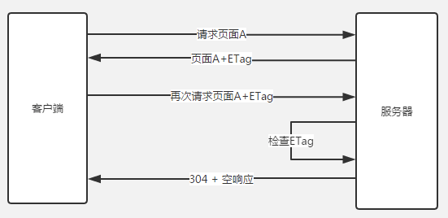

## notDone

### 浏览器的数据库
存储的数据可能是从服务端获取到的数据，也可能是在多个页面中需要频繁使用到的数据<br>
* cookie: 一个cookie不超过4k，每个网站不超过20个cookie，所有网站cookie总和不超过300个
* localStorage:5M，除非手动清除，否则一直存在
* sessionStorage:5M，不可以跨标签访问，页面关闭就清理
* indexedDB:浏览器端数据库，无限容量，除非手动清除，否则一直存在

#### Storage:localStorage、sessionStorage
* 大小:官方建议5M存储空间
* 类型:只能操作字符串，在存储之前应该使用JSON.stringfy()方法先进行一步安全转换字符串，取值时在用JSON.parse()方法再转换一次
* 存储的内通:数字，图片，json，样式，脚本...
* ⚠️数据时明文存储，毫无隐私性可言，绝对不能用于存储敏感信息
* 区别:sessionStorage临时存储在sesssion中，浏览器关闭，数据随之小事，localStorage将数据存储在本地，理论上一直有
*
另，不同浏览器无法共享localStorage和sessionStorage中的信息。同一浏览器的相同域名和端口的不同页面📃间可以共享相同localStorage，但是不同页面间无法共享sessionStorage的信息<br>

```js
// 保存数据
localStorage.setItem( key， value );
sessionStorage.setItem( key， value );
// 读取数据
localStorage.getItem( key );
sessionStorage.getItem( key );
// 删除单个数据
localStorage.removeItem( key ); 
sessionStorage.removeItem( key );
// 删除全部数据
localStorage.clear( ); 
sessionStorage.clear( );
// 获取索引的key
localStorage.key( index ); 
sessionStorage.key( index );
```
##### 监听Storage事件
可以通过监听window对象的storage事件并指定其事件处理函数，当页面中对localStorage或sessionStorage进行修改时，会触发对应的处理函数
```js
window.addEventListener('storage'，function(e){
   console.log('key='+e.key+'，oldValue='+e.oldValue+'，newValue='+e.newValue);
})
/***
* 触发事件的时间对象（e 参数值）有几个属性：
* key : 键值。
* oldValue : 被修改前的值。
* newValue : 被修改后的值。
* url : 页面url。
* storageArea : 被修改的 storage 对象。
***/
```
#### indexedDB
[张鑫旭博客indexedDB可以了解了解](https://www.zhangxinxu.com/wordpress/2017/07/html5-indexeddb-js-example/)

**1⃣️打开数据库**<br>
```js
var DBOpenRequest = window.indexedDB.open(dbName，version);
```
打开数据库的结果是，有可能触发4种事件<br>
* success，error，upgradeneeded第一次打开该数据库，或者数据库版本发生变化，blocked上一次数据库连接还未关闭

第一次打开数据库时，会先触发upgradeneeded事件，然后触发success事件
```js
var openRequest = indexedDB.open("test"，1);
var db;
// open返回一个对象，回调函数会定义在这个对象之上

openRequest.onupgradeneeded = function(e) {
    console.log("Upgrading...");
}
// 回调函数接受一个事件对象event作为参数
 
openRequest.onsuccess = function(e) {
    console.log("Success!");
    db = e.target.result; // target.result属性就指向打开的indexedDB数据库
}
 
openRequest.onerror = function(e) {
    console.log("Error");
    console.dir(e);
}
```
**2⃣️创建一个数据库存储对象**<br>
```js
var objectStore = db.createObjectStore(dbName， { 
        keyPath: 'id'，
        autoIncrement: true
    });
    // objectStore是一个重要对象，可以理解为存储的对象
    // objectStore.add()可以向数据库添加数据，objectStore.delete()删除数据，objectStore.clear()可以为空，objectStore.put()可以替换数据

    objectStore.createIndex('id'， 'id'， {
        unique: true    
    });
    // objectStore创建数据库的主键和普通字段
    objectStore.createIndex('name'， 'name');
    objectStore.createIndex('begin'， 'begin');
    objectStore.createIndex('end'， 'end');
    objectStore.createIndex('person'， 'person');
    objectStore.createIndex('remark'， 'remark');
```
**3⃣向indexedDB添加数据**<br>
数据库的操作都是基于事务(transaction)来进行，无论是添加编辑还是删除数据库，都要先建立一个事务(transaction)，才能继续下面的操作<br>

```js
// 新建一个事务
var transaction = db.transaction('project'， "readwrite");
// 打开存储对象
var objectStore = transaction.objectStore('project');
// 添加到数据对象中
objectStore.add(newItem);
newItem={
  "name": "第一个项目"，
  "begin": "2017-07-16"，
  "end": "2057-07-16"，
  "person": "张鑫旭"，
  "remark": "测试测试"
}
```
**4⃣️indexedDB数据库的获取**<br>
indexedDB数据库的获取使用Cursor APIs和Key Range APIs。也就是使用“游标API”和“范围API”，具体使用可以去看文档<br>
游标🌰

```js
var objectStore = db.transaction(dbName).objectStore(dbName);
objectStore.openCursor().onsuccess = function(event) {
    var cursor = event.target.result;
    if (cursor) {
        // cursor.value就是数据对象
        // 游标没有遍历完，继续
        cursor.continue();
    } else {
        // 如果全部遍历完毕...
    }
}
```
例如查询范围
```js
// 确定打开的游标的主键范围
var keyRangeValue = IDBKeyRange.bound(4， 10);
// 打开对应范围的游标
var objectStore = db.transaction(dbName).objectStore(dbName);
objectStore.openCursor(keyRangeValue).onsuccess = function(event) {
    var cursor = event.target.result;
    // ...
}
```
其中，有bound()， only()， lowerBound()和upperBound()这几个方法，意思就是方法名字面意思，“范围内”，“仅仅是”，“小于某值”和“大于某值”。<br>

方法最后还支持两个布尔值参数，例如：
```js
IDBKeyRange.bound(4， 10， true， true)
```
取范围3-9，也就是true的时候，不能与边界相等<br>

好了，到这里，localStorage是键值永久保存在本地，sessionStorage是键值临时保存存储在session，关掉浏览器就没了，indexedDB能永久存储支持数据结构比较复杂的存储。

#### localStorage，sessionStorage和cookie的区别
共同点：都是保存在浏览器端、且同源的<br>
区别：
* cookie数据始终在同源的http请求中携带（即使不需要），即cookie在浏览器和服务器间来回传递，而sessionStorage和localStorage不会自动把数据发送给服务器，仅在本地保存。cookie数据还有路径（path）的概念，可以限制cookie只属于某个路径下

* 存储大小限制也不同，cookie数据不能超过4K，同时因为每次http请求都会携带cookie、所以cookie只适合保存很小的数据，如会话标识。sessionStorage和localStorage虽然也有存储大小的限制，但比cookie大得多，可以达到5M或更大

* 数据有效期不同，sessionStorage：仅在当前浏览器窗口关闭之前有效；localStorage：始终有效，窗口或浏览器关闭也一直保存，因此用作持久数据；cookie：只在设置的cookie过期时间之前有效，即使窗口关闭或浏览器关闭

* 作用域不同，sessionStorage不在不同的浏览器窗口中共享，即使是同一个页面；localstorage在所有同源窗口中都是共享的；cookie也是在所有同源窗口中都是共享的

* web Storage支持事件通知机制，可以将数据更新的通知发送给监听者

* web Storage的api接口使用更方便

通过缓存机制，实现离线开发，也是可能的。通过缓存机制，实现负载均衡也是可能的。后面会持续讲到CDN的，这节只是讲了静态资源的缓存，后面会持续讲解。<br>


# split-------------------------------

为了提高这段关于HTTP缓存机制的表达清晰度和结构性，我会对内容进行重新组织和补充，以确保易于理解并且逻辑流畅。同时，也会确保技术细节准确无误。以下是修改后的内容：

---

## 缓存总览：从性能优化的角度看缓存（Cache-Control）


### 引言
在HTTP协议中，**缓存**是一项至关重要的技术，它通过减少资源的重复加载，提高了网页的加载速度和用户体验。浏览器为了提高性能，会根据返回的HTTP响应头来决定是否使用本地缓存资源，而不向服务器重新请求。缓存的工作原理分为**强缓存**和**协商缓存**两种主要机制。

### 缓存的作用
缓存的核心目的是：
- **重用已获取的资源**，减少延迟和网络阻塞，进而减少加载时间。
- **提高网页响应速度**，使得Web站点更加流畅和高效。

对于静态资源（如图片、CSS、JS等），通常我们关注以下两点：
1. **静态资源的加载速度**：确保快速获取所需资源。
2. **页面渲染速度**：资源加载速度直接影响页面渲染的速度。

#### 浏览器缓存机制：强缓存与协商缓存
浏览器的缓存策略主要分为两种：
1. **强缓存**（通过 `Cache-Control` 和 `Expires` 实现）
2. **协商缓存**（通过 `Last-Modified` 和 `ETag` 实现）

这两种机制的目的都是减少网络请求和提升页面加载速度。

### 浏览器缓存机制详解

#### 强缓存（无需发请求）
强缓存是指浏览器在缓存有效的情况下，直接从本地读取缓存资源，而不向服务器发起请求。强缓存的判断依据是响应头中的 `Cache-Control` 和 `Expires`。

- **Expires**：这是HTTP 1.0引入的缓存控制字段，用于指定缓存资源的过期时间。该字段使用绝对时间表示，例如：
  ```http
  expires: Tue, 18 Feb 2020 01:18:41 GMT
  ```
  如果缓存时间未到，浏览器将直接从缓存中读取资源，而不会向服务器发送请求。

- **Cache-Control**：这是HTTP 1.1引入的缓存控制字段，优先级高于 `Expires`，并且支持相对时间设置。例如：
  ```http
  cache-control: max-age=31536000
  ```
  `max-age` 指定资源在多少秒内视为“新鲜的”。`Cache-Control` 提供了更多控制缓存的方式，常见的指令有：
  - `max-age`: 指定资源最大可缓存的时间。
  - `no-cache`: 强制在使用缓存前向服务器验证缓存的有效性。
  - `no-store`: 不缓存请求或响应的任何内容。
  - `private`: 仅允许客户端（用户的浏览器）缓存，不允许中间代理缓存。
  - `public`: 允许任何缓存代理缓存资源。

##### Cache-Control 指令详解

| 指令 | 参数 | 说明 |
|------|------|------|
| `no-cache` | 无 | 强制向服务器验证缓存 |
| `no-store` | 无 | 不缓存请求或响应内容 |
| `max-age` | 秒数 | 设置缓存的最大生存时间 |
| `private` | 无 | 仅允许单一用户缓存响应 |
| `public` | 无 | 允许所有缓存代理缓存响应 |
| `must-revalidate` | 无 | 缓存过期后，必须向源服务器验证 |
| `s-maxage` | 秒数 | 用于公共缓存服务器，指定缓存过期时间 |

**注意**：`no-cache` 并不表示不缓存，而是表示缓存内容必须在使用前与服务器进行验证。

#### 协商缓存（发请求但可能不返回数据）
如果强缓存未命中，浏览器会向服务器发送请求，使用 `Last-Modified` 和 `ETag` 等头信息来进行协商缓存验证。如果资源没有更新，服务器会返回 `304 Not Modified`，让浏览器继续使用本地缓存资源，而无需重新下载。

##### Last-Modified 和 If-Modified-Since
- **Last-Modified**：表示资源的最后修改时间。服务器返回的资源包含该字段，表示该资源的最后修改时间。
- **If-Modified-Since**：浏览器请求时会带上该字段，询问服务器自指定时间以来资源是否被修改。若资源未修改，服务器返回 `304 Not Modified`，浏览器继续使用本地缓存。

问题：由于某些浏览器可能修改缓存文件的本地时间，`Last-Modified` 的准确性可能受到影响。

##### ETag 和 If-None-Match
为了避免 `Last-Modified` 时间戳不准确的情况，HTTP 1.1 引入了 **ETag**（实体标签）。ETag 是资源的唯一标识符，当资源发生变化时，ETag 会随之变化。浏览器在请求时会带上 `If-None-Match` 字段，服务器会检查 `ETag` 是否匹配：
- 如果匹配，返回 `304 Not Modified`；
- 如果不匹配，返回新的资源。

ETag 相比 `Last-Modified` 更精确，因为它可以确保即使修改时间相同，资源内容发生变化时，ETag 也会更新。

### 强缓存与协商缓存的区别

| 特性               | 强缓存                             | 协商缓存                         |
|------------------|----------------------------------|--------------------------------|
| 缓存方式            | 直接使用本地缓存，无需与服务器交互           | 发送请求到服务器，通过 `Last-Modified` 或 `ETag` 检查资源是否有更新 |
| 响应状态码          | 如果缓存有效，直接使用缓存；无需服务器交互      | 如果资源未修改，服务器返回 `304 Not Modified` |
| 适用场景            | 静态资源（如图片、CSS、JS 等），无需频繁变动的资源 | 动态内容或资源可能频繁更新时（如用户数据） |

### 缓存策略的优化
通过合理配置缓存策略，网站的性能可以得到显著提升。以下是一些常见的优化技巧：

1. **合理使用 Cache-Control**：对于静态资源（如图片、CSS、JS），可以设置长时间的缓存（例如，1年 `max-age=31536000`），而对于动态资源，则可以设置短时间缓存或不缓存。
2. **使用版本号或哈希**：为静态资源添加版本号或哈希值（如 `style.v1.css`），这样即使缓存时间很长，只要文件内容变化，资源的URL就会变化，从而避免缓存问题。
3. **启用浏览器缓存**：通过 `Cache-Control`、`Expires` 等字段，减少每次访问时对相同资源的请求。

### 总结
HTTP缓存机制对于提升Web应用的性能至关重要。通过合理配置**强缓存**和**协商缓存**，可以有效减少重复请求，提升资源加载速度和页面渲染速度。理解和运用 `Cache-Control`、`Expires`、`Last-Modified`、`ETag` 等缓存控制头，能够帮助开发者优化用户体验和减少服务器负担。

---

通过这种结构调整，内容变得更加有条理，容易理解，并且补充了优化策略和总结部分，帮助读者更好地把握HTTP缓存的使用方法和技巧。

----
###### xx

## 缓存总览:从性能优化的角度看缓存 Cache-Control


前面的状态码304说可以直接从本地获取资源，因为返回304代表资源未曾改变，浏览器直接使用本地缓存。我们知道HTTP是渣男，从来不负责任，不保存什么状态，也不会负责记录之前的请求和响应内容。<br>
那浏览器就不能依赖HTTP这个请求来做，浏览器就自己来做缓存。根据响应回来的信息，做记录📝，就是缓存，没错了，接下来就要讲讲这个缓存机制<br>
#### 缓存的作用 重用已获取的资源，减少延迟与网络阻塞，进而减少显示某个资源所用的时间
借助HTTP缓存，Web站点变得具有响应性<br>
其实我们对于页面静态资源的要求就两点
* 静态资源的加载速度
* 页面渲染速度

页面渲染速度建立在资源加载速度之上，但不同类型的加载顺序和实际也会对其产生影响，所以缓存的可操作空间非常大。<br>
缓存的作用很明显，但是对于浏览器缓存机制，是不是也会有区分呢？也就是说，对于缓存机制也会有不同，进而提升性能呢？对，没错。路由器有路由器的策略，让转发的速度可以根据路由策略而控制，性能提高。贪心算法有贪心策略，让性能不至于降低特别多。当然浏览器也会有自己的缓存策略，让自己的性能也不会至于降低。但凡涉及优化性能都会有一个策略。<br>

### 浏览器缓存机制:强缓存、协商缓存
良好的缓存策略可以降低资源的重复加载提高网页的整体加载速度，通常浏览器缓存策略分为两种:一种是强缓存，一种是协商缓存<br>

##### 基本原理
* 浏览器在加载资源的时候，根据请求头的expires和cache-control判断是否命中强缓存，则直接从缓存读取资源，不会发请求到服务器(什么是强缓存？为什么不用发请求？)
* 如果 **没有命中强缓存，浏览器一定会发送一个请求到服务器**，通过last-modified和etag验证资源是否命中协商缓存，如果命中，服务器会将这个请求返回，但是不会返回这个资源的额数据，依然是从缓存中读取资源(304)(协商发送了请求，返回304)
* 如果前面两者都没有命中，直接从服务器加载资源

为什么强缓存没有发送请求呢？

#### 强缓存 Expires与Cache-Control
Expires是http1.0提出的一个表示资源过期时间的header，描述的是一个绝对时间，由服务器返回。这个在前面谈到的实体报文首部字段有论述。Expires受限于本地时间，如果修改了本地时间，可能会造成缓存失效。<br>

```
expires: Tue， 18 Feb 2020 01:18:41 GMT
```
这就是服务器返回正文报文首部字段的expires。是服务器的预计失效时间<br>

Cache-Control出现于HTTP/1.1，优先级高于Expires，表示相对时间

```
cache-control: must-revalidate， max-age=31536000
```
咦？must-revalidate，什么鬼？这时候我们不如先了解一下cache-control整个指令的意义。<br>

##### 通过指定cache-control指令，就能操作缓存的工作机制
指令的参数是可选的，多个指令之间通过"，"分隔。首部字段Cache-Control指令可用于请求以及响应时。(是个通用首部字段)<br>
```
cache-control: private，must-revalidate， max-age=31536000
```

cache-control指令一览表<br>

缓存请求指令<br>

指令|参数|说明
|--|--|--|
no-cache|无|强制向源服务器再验证
no-store|无|不缓存请求或响应的任何内容
max-age=s|必须|响应的最大Age值
max-stale=s|可省略|接收已过期的响应
min-fresh=s|必须|期望在指定时间内的响应仍有效
no-transform|无|代理不可更改媒体类型
only-if-cached|无|从缓存获取资源
cache-extension|-|新指令标记(token)

缓存响应指令<br>

指令|参数|说明
|--|--|--|
public|无|可向任意方提供响应的缓存
private|可省略|仅向特定用户返回响应
no-cache|可省略|缓存前必须先确认其有效性
no-store|无|不缓存请求或响应式的任何内容
no-transform|无|代理不可更改媒体类型
must-revalidate|无|可缓存但必须再向源服务器进行确认
proxy-revalidate|无|要求中间缓存服务器对缓存的响应有效性再进行确认
max-age=s|必须|响应的最大Age值
s-maxage=s|必须|公共缓存服务器响应的最大Age值
cache-extension|-|新指令标记(token)

* 对于no-cache我有话说，no-cache，emmm，并不是说不会缓存到数据到本地，而是可以存储在本地缓存区中。只是与原始服务器进行新鲜度再验证之前，缓存不能将其提供给客户端使用。因此上面的表单中也说到，强制向源服务器再验证。<br>
* public，可以被多用户共享，包括终端，CDN等中间代理服务器。<br>
* private，只能被终端浏览器缓存，私有的，不允许中继缓存服务器进行缓存<br>

以上就是强缓存，其实就是通过cache-control的缓存指令，设立缓存策略，这个强缓存就是将缓存保存再本地，强制计算时间是否过期，要是没有就在本地取资源。<br>

#### 协商缓存 Last-Modified，If-Modified-Since和Etag，If-None-Match管理
前面提高过增强校验，在返回206的状态下，验证文件是否过期。其实这也是协商缓存的一部分。当浏览器对某个资源没有命中强缓存，也就是，时间过期，就会发送一个请求到服务器，验证协商的缓存是否命中，如果命中，返回304，Not Modified。所以协商缓存，重点在协商。<br>

##### Last-Modified、If-Modified-Since
Last-Modified表示本地文件最后修改日期，浏览器会在request header加上If-Modified-Since(上次返回Last-Modified的值)，询问服务器在该日期后资源是否有更新，有更新就将新的资源发送回来，没有，就继续用本地缓存文件。但是， **如果在本地打开缓存文件，就会造成Last-Modified被修改，所以为了避免这种情况，HTTP/1.1出现Etag**<br>
##### ETag、If-None-Match
ETag就是资源的唯一标识，就像个指纹，资源变化就会导致ETag变化，跟最后修改时间没有关系，ETag可以保证每一个资源唯一。但是如果你打开了资源，修改了，也会导致ETag改变。<br>
If-None-Match的header会将上次返回的Etag发送给服务器，询问该资源的Etag是否有更新，有变动就会发送新的资源回来<br>
那么手动更改缓存文件，导致Last-Modified修改，就会让客户端认为这个文件已经被修改了看，就重新GET。<br> TODO:



ETag的优先级比Last-Modified更高<br>

具体为什么要用ETag
* 一方面，一些文件可能会周期性修改，而他的内容并不改变，这时候我们不希望ETag认为这个文件被修改了，而重新GET
* 修改频繁，而If-Modified-Since只能检查到的粒度是s级，这种修改没有办法判断啦
* 某些服务器不能精确得到文件的最后修改时间


