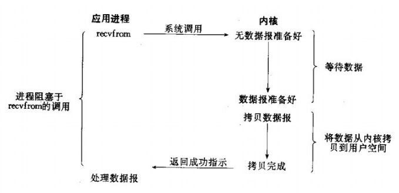
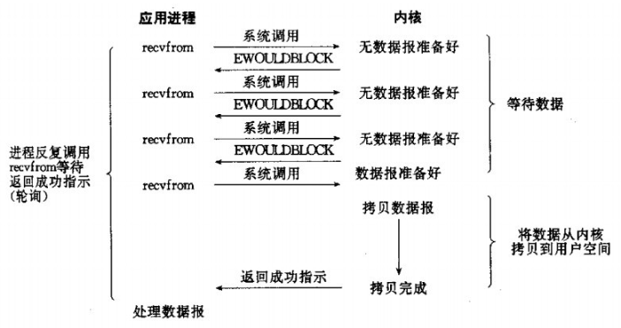
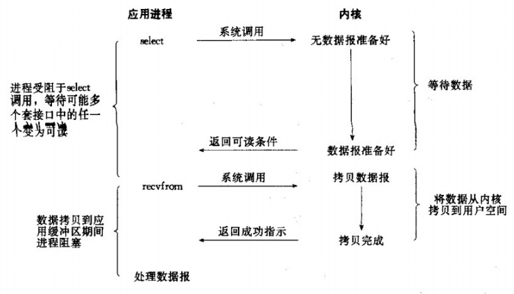
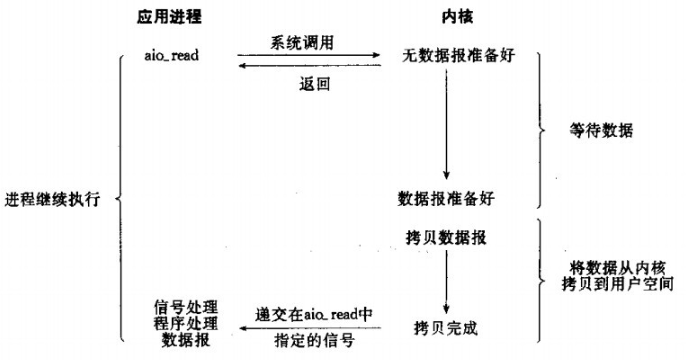
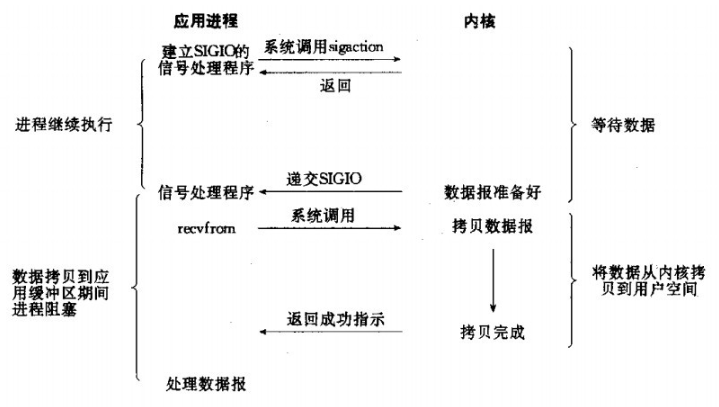
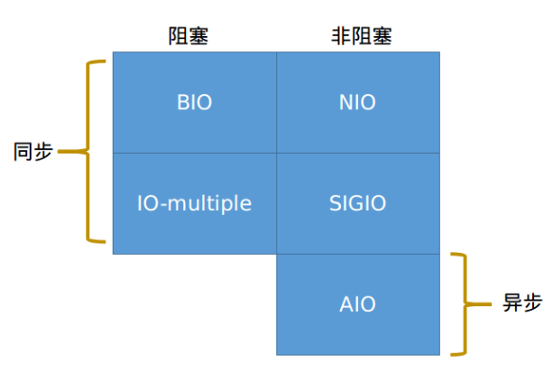

## io模型

### 1. concepts

#### 1.1 什么是IO模型？有哪些常见的IO模型？

IO模型是描述输入/输出操作如何进行的一种模型。在网络编程中，常见的IO模型有以下四种：

阻塞IO模型：在这种模型中，IO操作会阻塞调用线程，直到操作完成。例如，当线程执行一个读操作时，它会被阻塞，直到数据可用并已读入内存。

非阻塞IO模型：在这种模型中，IO操作不会阻塞调用线程。如果数据不可用，操作会立即返回一个错误。

IO复用模型：在这种模型中，线程可以同时等待多个IO操作。当任何一个IO操作完成时，线程就可以处理这个操作。这种模型可以让线程在等待一个IO操作的同时，处理其他的IO操作。

异步IO模型：在这种模型中，线程启动一个IO操作，然后继续执行其他任务。当IO操作完成时，线程会收到一个通知。

信号驱动IO模型：在这种模型中，线程可以请求在IO操作完成时接收一个信号。当收到这个信号时，线程就可以处理IO操作。

### 2.1 阻塞IO-BIO

> PS: `read()`一般是指本地读取数据，通过硬盘文件；`recvfrom()`一般是指从`socket`接收数据，通过网络中的`socket`文件；

- ***文字说明***
  1. `application`向`kernel`发起`system call`的`read()/recvfrom()`请求
  2. `kernel`如果准备好了，就从`kernel space`拷贝数据到`user space`
  3. 拷贝完成时，则返回ok。
  4. 此时`application`继续。

- ***适用情况***
  - 简单易用，是本地IO的首选

- ***不足***
  - 如果是网络IO的话，要么就是空等，要么就是每一个线程开一个`socket()`。前者耗费时间，后者耗费资源

### 2.2 非阻塞IO-NIO

- ***文字说明***
  1. `application`向`kernel`发起`system call`的`read()/recvfrom()`请求
  2. `kernel`如果没有准备好，就返回`EWOULDBLOCK`这个错误码。
  3. 继续回到`application`，该干嘛干嘛，然后再次发起`read()/recvfrom()`请求
  4. `kernel`如果准备好了，就从`kernel space`拷贝数据到`user space`
  5. 拷贝完成时，则返回ok
  6. 此时`application`继续。

- ***适用情况***
  - 网络IO情况。通过反复发起`system call`，如果没准备好，我就继续该干嘛干嘛，但是在数据拷贝的过程中，进程还是阻塞的。

- ***不足***
  - `system call`是比较耗费`cpu`的操作，如果频繁地发起`system call`也不是一个明智之举。
 

### 2.3 IO复用-(select/ poll/ epoll)

- ***文字说明***
  1. `application`向`kernel`发起`system call`的`select()`请求，向`kernel`传入若干个`file descriptor`和操作目的(read, write)，这些一般被打包为`fd_set`数据。
  2. `kernel`同时检测若干个文件，当其中一个或多个`file descriptor`就绪，返回可执行的。
  3. `application`收到准备就绪的`file descriptor`后，对他们发起发起`system call`的`read()/recvfrom()`请求
  4. `kernel`这时候准备好了，就从`kernel space`拷贝数据到`user space`
  5. 拷贝完成时，则返回ok
  6. 此时`application`继续。

- ***适用情况***
  - 优化了非阻塞IO大量发起`system call`的问题，其核心思想在于通过一次发起大量IO请求，优先处理已经准备好的。
  - IO复用还是阻塞的

- ***不足***

  - `fd_set`受限于系统设定的`FD_SETSIZE`大小
  - 如果`fd_set`数目很大，需要轮询所有fd找出就绪的fd,这里的性能也很大。

### 2.4 异步IO-(AIO)

- ***文字说明***
  1. `application`向`kernel`发起`system call`的`aio_read()`请求，`kernel`立马返回。
  2. `application`继续运行，而`kernel`则会一直等待数据准备。
  3. `kernel`准备好数据时，`kernel`不需要让`application`再次发次请求，直接将数据从`kernel space`拷贝到`user space`
  4. 当拷贝完成时，`kernel`向`application`发送完成信号。
- ***适用情况***
  - 理论上，性能比之前的都要好。`application`可以完全不用
- ***不足***
  - 太复杂了，比如网络框架`netty 5.0`被废弃的原因就在于引入AIO提高效率，但变得非常复杂，而性能没有得到太明显优化。

### 2.5 信号驱动IO-SIGIO

- ***特别说明***

  ​	这种IO模型相对复杂，一般不使用，相关的资料也比较少。如果有感兴趣的可以点击这里查看[Signal-Driven I/O for Sockets](http://www.masterraghu.com/subjects/np/introduction/unix_network_programming_v1.3/ch25lev1sec2.html#ch25lev1sec2)

### 3. 总结

- ***阻塞与非阻塞的区分***

  ​	两者区别在于，非阻塞IO会不断发生system call。

- ***同步和异步的区分***

  ​	两者区别在于，从`kernel space`拷贝到`user space`时，进程是否还在执行。哪怕是NIO，知道数据就绪后，也是等待数据拷贝完成后，再执行下一步；而AIO则是不管`kernel space`拷贝完成没都继续进行，`kernel space`拷贝完成才告诉`application`