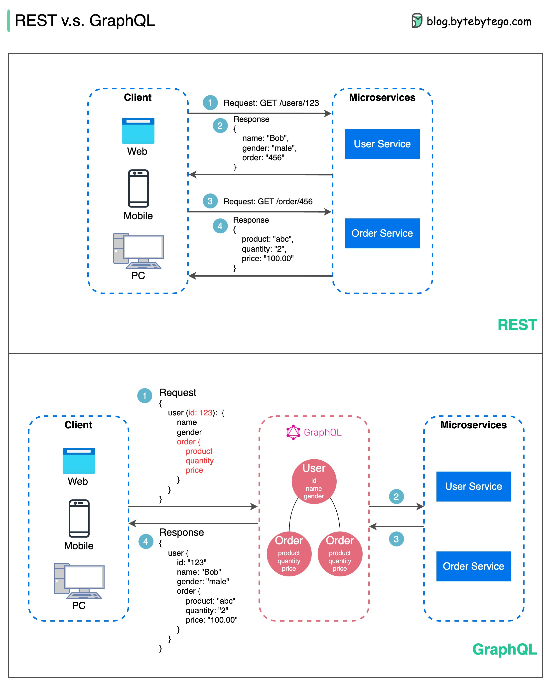
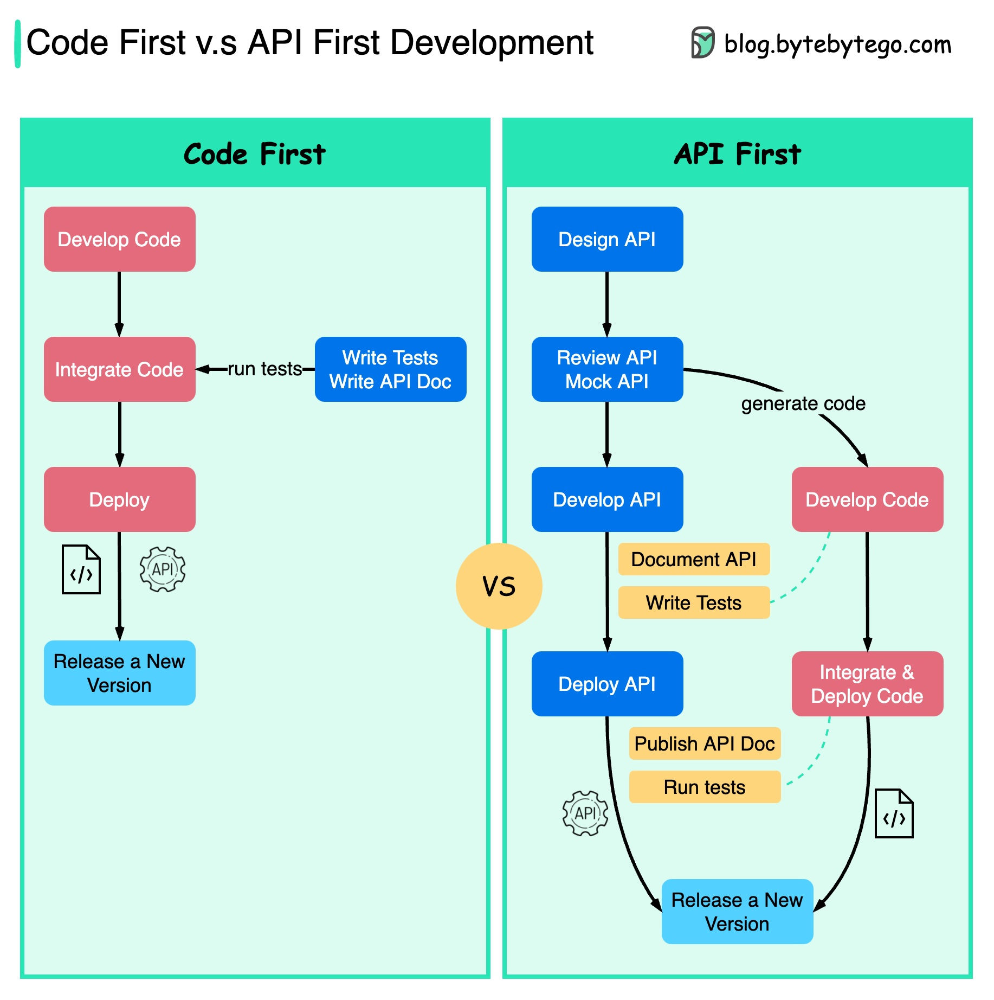

## 通信协议

通过提供一种标准的方法来设计和构建 API，它们确保了效率、可靠性和与其他系统的易集成。以下是最常用的风格：

  

- SOAP：

  成熟、全面、基于 XML
  
  最适合企业应用

- RESTful：

  流行、易于实现、HTTP 方法
  
  适用于 Web 服务

- GraphQL：

  查询语言，请求特定数据
  
  减少网络开销，响应更快

- gRPC：

  现代、高性能、Protocol Buffers
  
  适用于微服务架构

- WebSocket：

  实时、双向、持久连接
  
  适用于低延迟数据交换

- Webhook：

  事件驱动、HTTP 回调、异步
  
  在事件发生时通知系统

### REST API vs. GraphQL

在 API 设计方面，REST 和 GraphQL 各有优缺点。

下图展示了 REST 和 GraphQL 的快速对比。

  

REST

- 使用标准的 HTTP 方法，如 GET、POST、PUT、DELETE 进行 CRUD 操作。
- 当你需要在不同服务/应用之间提供简单、统一的接口时效果很好。
- 缓存策略易于实现。
- 缺点是可能需要多次往返以从不同的端点汇总相关数据。

GraphQL

- 提供一个单一端点，客户端可以查询所需的精确数据。
- 客户端指定嵌套查询中所需的确切字段，服务器返回仅包含这些字段的优化负载。
- 支持修改数据的 Mutations 和实时通知的 Subscriptions。
- 非常适合从多个来源聚合数据，并且适用于快速变化的前端需求。
- 然而，它将复杂性转移到客户端，如果没有适当的保护，可能会允许滥用查询。
- 缓存策略可能比 REST 更复杂。

在 REST 和 GraphQL 之间选择最佳方案取决于应用程序和开发团队的具体需求。GraphQL 适合复杂或频繁变化的前端需求，而 REST 适用于需要简单和一致契约的应用程序。

没有一种 API 方法是万能的。仔细评估需求和权衡利弊对于选择合适的风格非常重要。REST 和 GraphQL 都是暴露数据和支持现代应用的有效选项。

### gRPC 是如何工作的？

RPC（远程过程调用）之所以称为“远程”，是因为它在微服务架构下，服务部署在不同服务器时，启用远程服务之间的通信。从用户的角度来看，它就像一个本地函数调用。

下图展示了 gRPC 的整体数据流。

  

步骤 1：客户端发出 REST 调用。请求体通常是 JSON 格式。

步骤 2 - 4：订单服务（gRPC 客户端）接收 REST 调用，进行转换，并向支付服务发出 RPC 调用。gRPC 将客户端存根编码为二进制格式并发送到低级传输层。

步骤 5：gRPC 通过 HTTP2 在网络上传输数据包。由于二进制编码和网络优化，gRPC 被认为比 JSON 快 5 倍。

步骤 6 - 8：支付服务（gRPC 服务器）从网络接收数据包，解码并调用服务器应用程序。

步骤 9 - 11：结果从服务器应用程序返回，进行编码并发送到传输层。

步骤 12 - 14：订单服务接收数据包，解码并将结果发送给客户端应用程序。

### 什么是 Webhook？

下图展示了轮询和 Webhook 的对比。

  

假设我们运行一个电子商务网站。客户端通过 API 网关向订单服务发送订单，订单服务将其发送到支付服务进行支付交易。支付服务然后与外部支付服务提供商（PSP）通信以完成交易。

有两种方式处理与外部 PSP 的通信。

**1. 短轮询**

在向 PSP 发送支付请求后，支付服务不断向 PSP 询问支付状态。经过几轮后，PSP 最终返回状态。

短轮询有两个缺点：
* 不断轮询状态需要支付服务的资源。
* 外部服务直接与支付服务通信，带来安全漏洞。

**2. Webhook**

我们可以向外部服务注册一个 Webhook。这意味着：当你有请求更新时，请在某个 URL 回调我。当 PSP 完成处理时，它将调用 HTTP 请求以更新支付状态。

这样，编程范式发生了变化，支付服务不再需要浪费资源轮询支付状态。

如果 PSP 从未回调怎么办？我们可以设置一个每小时检查支付状态的后台作业。

Webhook 通常被称为反向 API 或推送 API，因为服务器向客户端发送 HTTP 请求。使用 Webhook 时需要注意三点：

1. 我们需要为外部服务设计一个合适的 API 进行调用。
2. 我们需要在 API 网关中设置适当的规则以确保安全。
3. 我们需要在外部服务中注册正确的 URL。

### 如何提高 API 性能？

下图展示了提高 API 性能的五个常见技巧。

  

分页

当结果集很大时，这是一个常见的优化。结果流式返回客户端，以提高服务响应速度。

异步日志记录

同步日志记录每次调用都要处理磁盘，可能会减慢系统速度。异步日志记录首先将日志发送到无锁缓冲区并立即返回。日志将定期刷新到磁盘。这显著减少了 I/O 开销。

缓存

我们可以将频繁访问的数据存储到缓存中。客户端可以先查询缓存，而不是直接访问数据库。如果缓存未命中，客户端可以从数据库查询。像 Redis 这样的缓存将数据存储在内存中，因此数据访问速度比数据库快得多。

负载压缩

请求和响应可以使用 gzip 等进行压缩，以便传输的数据大小更小。这加快了上传和下载速度。

连接池

访问资源时，我们通常需要从数据库加载数据。打开和关闭数据库连接会增加显著的开销。因此，我们应该通过一组打开的连接连接到数据库。连接池负责管理连接的生命周期。

### HTTP 1.0 -> HTTP 1.1 -> HTTP 2.0 -> HTTP 3.0 (QUIC)

每一代 HTTP 解决了什么问题？

下图展示了关键特性。

  

- HTTP 1.0 于 1996 年定稿并完整记录。每次请求同一服务器都需要单独的 TCP 连接。

- HTTP 1.1 于 1997 年发布。一个 TCP 连接可以保持打开以供重用（持久连接），但它没有解决 HOL（队头阻塞）问题。

  队头阻塞 - 当浏览器中允许的并行请求数量用完时，后续请求需要等待前面的请求完成。

- HTTP 2.0 于 2015 年发布。它通过请求多路复用解决了 HOL 问题，消除了应用层的 HOL 阻塞，但在传输（TCP）层仍然存在 HOL。

  如图所示，HTTP 2.0 引入了 HTTP “流”的概念：一种允许在同一 TCP 连接上多路复用不同 HTTP 交换的抽象。每个流不需要按顺序发送。

- HTTP 3.0 的第一个草案于 2020 年发布。它是 HTTP 2.0 的拟议继任者。它使用 QUIC 而不是 TCP 作为底层传输协议，从而消除了传输层的 HOL 阻塞。

QUIC 基于 UDP。它在传输层引入了流作为一等公民。QUIC 流共享同一个 QUIC 连接，因此创建新流不需要额外的握手和慢启动，但 QUIC 流独立传输，在大多数情况下，一个流的丢包不会影响其他流。

### SOAP vs REST vs GraphQL vs RPC

下图展示了 API 时间线和 API 风格的比较。

随着时间的推移，不同的 API 架构风格被发布。每种风格都有其标准化数据交换的模式。

你可以在图中查看每种风格的用例。

  

### 代码优先 vs. API 优先

下图展示了代码优先开发和 API 优先开发的区别。为什么我们要考虑 API 优先设计？

  

- 微服务增加了系统复杂性，我们有不同的服务来提供系统的不同功能。虽然这种架构促进了解耦和职责分离，但我们需要处理服务之间的各种通信。

在编写代码之前，最好先考虑系统的复杂性，并仔细定义服务的边界。

- 不同的功能团队需要使用相同的语言，专门的功能团队只负责自己的组件和服务。建议通过 API 设计让组织使用相同的语言。

我们可以模拟请求和响应来验证 API 设计，然后再编写代码。

- 提高软件质量和开发人员生产力。由于在项目开始时解决了大部分不确定性，整体开发过程更加顺利，软件质量大大提高。

开发人员也对这个过程感到满意，因为他们可以专注于功能开发，而不是协商突然的变化。

项目生命周期结束时出现意外的可能性减少了。

由于我们首先设计了 API，因此在开发代码时可以设计测试。在某种程度上，我们在使用 API 优先开发时也有 TDD（测试驱动设计）。

### HTTP 状态码

  

HTTP 的响应码分为五类：

信息性（100-199）
成功（200-299）
重定向（300-399）
客户端错误（400-499）
服务器错误（500-599）

### API 网关的作用是什么？

下图展示了详细信息。

  

步骤 1 - 客户端向 API 网关发送 HTTP 请求。

步骤 2 - API 网关解析并验证 HTTP 请求中的属性。

步骤 3 - API 网关执行允许列表/拒绝列表检查。

步骤 4 - API 网关与身份提供者通信进行身份验证和授权。

步骤 5 - 对请求应用速率限制规则。如果超过限制，请求将被拒绝。

步骤 6 和 7 - 现在请求已经通过基本检查，API 网关通过路径匹配找到相关服务进行路由。

步骤 8 - API 网关将请求转换为适当的协议并发送到后端微服务。

步骤 9-12：API 网关可以正确处理错误，并在错误恢复时间较长时处理故障（断路）。它还可以利用 ELK（Elastic-Logstash-Kibana）堆栈进行日志记录和监控。有时我们会在 API 网关中缓存数据。

### 如何设计有效且安全的 API？

下图展示了购物车示例中的典型 API 设计。

  

请注意，API 设计不仅仅是 URL 路径设计。大多数时候，我们需要选择合适的资源名称、标识符和路径模式。同样重要的是设计合适的 HTTP 头字段或在 API 网关中设计有效的速率限制规则。

### TCP/IP 封装

数据是如何通过网络发送的？为什么我们需要 OSI 模型中的这么多层？

下图展示了数据在通过网络传输时的封装和解封装过程。

  

步骤 1：当设备 A 通过 HTTP 协议向设备 B 发送数据时，首先在应用层添加 HTTP 头。

步骤 2：然后将 TCP 或 UDP 头添加到数据中。在传输层将其封装为 TCP 段。头包含源端口、目标端口和序列号。

步骤 3：然后在网络层将段封装为 IP 头。IP 头包含源/目标 IP 地址。

步骤 4：在数据链路层添加 MAC 头，包含源/目标 MAC 地址。

步骤 5：封装的帧被发送到物理层，并以二进制位的形式通过网络发送。

步骤 6-10：当设备 B 从网络接收位时，它执行解封装过程，这是封装过程的反向处理。头逐层移除，最终设备 B 可以读取数据。

我们需要网络模型中的层，因为每一层都专注于自己的职责。每一层可以依赖头进行处理指令，而不需要知道上一层数据的含义。

### 为什么 Nginx 被称为“反向”代理？

下图展示了正向代理和反向代理的区别。

  

正向代理是位于用户设备和互联网之间的服务器。

正向代理常用于：

1. 保护客户端
2. 绕过浏览限制
3. 阻止访问某些内容

反向代理是接受客户端请求，将请求转发到 Web 服务器，并将结果返回给客户端的服务器，就像代理服务器处理请求一样。

反向代理适用于：

1. 保护服务器
2. 负载均衡
3. 缓存静态内容
4. 加密和解密 SSL 通信

### 常见的负载均衡算法有哪些？

下图展示了 6 种常见的算法。

  

- 静态算法

1. 轮询

    客户端请求按顺序发送到不同的服务实例。服务通常需要是无状态的。

2. 粘性轮询

    这是轮询算法的改进。如果 Alice 的第一个请求发送到服务 A，后续请求也发送到服务 A。

3. 加权轮询

    管理员可以为每个服务指定权重。权重较高的服务处理的请求比其他服务多。

4. 哈希

    该算法对传入请求的 IP 或 URL 应用哈希函数。请求根据哈希函数结果路由到相关实例。

- 动态算法

5. 最少连接

    新请求发送到并发连接最少的服务实例。

6. 最少响应时间

    新请求发送到响应时间最快的服务实例。

### URL、URI、URN - 你知道它们的区别吗？

下图展示了 URL、URI 和 URN 的比较。

  

- URI

URI 代表统一资源标识符。它标识 Web 上的逻辑或物理资源。URL 和 URN 是 URI 的子类型。URL 定位资源，而 URN 命名资源。

URI 由以下部分组成：
scheme:[//authority]path[?query][#fragment]

- URL

URL 代表统一资源定位符，是 HTTP 的关键概念。它是 Web 上唯一资源的地址。它可以与其他协议一起使用，如 FTP 和 JDBC。

- URN

URN 代表统一资源名称。它使用 urn 方案。URN 不能用于定位资源。图中给出的简单示例由命名空间和命名空间特定字符串组成。

如果你想了解更多详细信息，建议阅读 [W3C 的解释](https://www.w3.org/TR/uri-clarification/)。