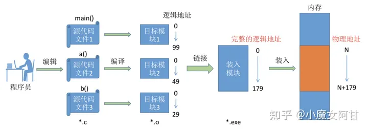

## 操作系统发展史

### 1. introduction
  * 裸机时代
    主要是人工操作,程序员将对应用程序和数据的已穿孔的纸带(或卡片)装入输入机,然后启动输入机把程序和数据输入计算机内存,接着通过控制台开关启动程序针对数据运行;计算完毕,打印机输出计算结果;用户取走结果并卸下纸带(或卡片)后,才让下一个用户上机.
  * 单道批处理系统
    特点是一次只能运行一个进程,只有运行完毕后才能将下一个进程加载到内存里面,所以进程的数据都是直接放在物理内存上的,因此CPU是直接操作内存的物理地址,这个时候不存在虚拟逻辑地址,因为一次只能运行一个程序.
  * 多道批处理系统
    到后来发展出了多道程序系统,它要求在计算机中存在着多个进程,处理器需要在多个进程间进行切换,当一道程序因I/O请求而暂停运行时,CPU便立即转去运行另一道程序.
    问题来了,这么多进程,内存不够用怎么办,各个进程同时运行时内存地址互相覆盖怎么办?
    这时候就出现问题了,链接器在链接一个可执行文件的时候,总是默认程序的起始地址为0x0,但物理内存上只有一个0x0的地址呀?也许你会说:"没关系,我们可以在程序装入内存的时候再次动态改变它的地址."好吧我忍了.但如果我的物理内存大小只有1G,而现在某一个程序需要超过1G的空间怎么办呢?你还能用刚才那句话解释吗?
    操作系统的发展,包括后面的分时系统,其实都是在解决协调各个环节速度不匹配的矛盾.

* 静态链接 在程序运行之前,先将各目标模块及它们所需的库函数链接成一个完整的可执行文件(装入模块),即得到完整的逻辑地址,之后不再拆开.

* 装入时动态链接 运行前边装入边链接的链接方式.

* 运行时动态链接 运行时该目标模块时,才对它进行链接,用不到的模块不需要装入内存.其优点是便于修改和更新,便于实现对目标模块的共享.

可以看到运行时动态链接,不需要一次性将模块全部装入内存,可以等到运行时需要的时候再动态的连接进去,这样一来就就提供了内存不够用的问题的解决思路,还可以这样,用到了再链接进去.