## 内存

### 1. 什么是内存

* 为什么要有内存?
  CPU比磁盘速度快太多,因此内存的主要作用就是缓和CPU与硬盘之间的速度矛盾.不然cpu会一直等待磁盘传数据处理，浪费cpu性能。
  而现在而言，内存相比cpu也是太慢了，因此靠近cpu的还有一个寄存器，也可以叫缓存，缓存比内存速度 更快。

* 为什么内存比硬盘快?
  内存的速度之所以比硬盘的速度快(不是快一点,而是快很多),是因为它们的存储原理和读取方式不一样.
  * 硬盘是机械结构,通过磁头的转动读取数据.一般情况下台式机的硬盘为每分钟 7200 转,而笔记本的硬盘为每分钟 5400 转.
  * 而内存是没有机械结构的,内存是通过电存取数据的.

* 为了使用内存，操作系统需要提供什么能力？
  1. 操作系统负责**内存空间的分配与回收**
  2. 操作系统需要提供某种技术从逻辑上**对内存空间进行扩充**
  3. 操作系统需要提供**地址转换功能**,负责程序的逻辑地址与物理地址的转换
  4. 操作系统需要提供**内存保护功能**.保证各进程在各自存储空间内运行,互不干扰

### 2. 内存运行的基本原理

#### 2.1 指令的工作原理
计算机指令的工作原理基于计算机的基本工作流程,即取指/译码/执行/写回.以下是这个过程的详细描述:

取指(Fetch):计算机从内存中获取指令.这个过程由程序计数器(PC)控制,程序计数器保存了下一条要执行的指令的内存地址.

译码(Decode):计算机解析或译码指令,确定要执行的操作(例如,加法/乘法/加载/存储等)以及操作的操作数.

执行(Execute):计算机执行指令,进行相应的运算或者操作.

写回(Write Back):如果指令执行的结果需要保存,那么结果将被写回到内存或者寄存器中.

这个过程在计算机中不断重复,使得计算机可以执行一系列的指令,完成各种各样的任务.

#### 2.2 逻辑地址vs物理地址
逻辑地址和物理地址是计算机内存管理中的两个重要概念.

- **逻辑地址**:也被称为虚拟地址,是程序生成的地址.当程序需要访问内存时,它会生成一个逻辑地址.这个地址是相对于程序的,不依赖于实际的物理内存布局.逻辑地址的使用使得每个程序都可以认为自己独占了全部的内存空间,这极大地简化了程序的编写.

- **物理地址**:是实际内存硬件的地址.物理地址是内存条上每个字节的唯一标识,它决定了数据在内存中的实际位置.

在程序运行时,操作系统和硬件会将程序的逻辑地址转换为物理地址,这个过程被称为地址转换或地址映射.地址转换的具体方式取决于操作系统和硬件的设计,常见的方法包括分段/分页和段页式等.

通过使用逻辑地址和物理地址,操作系统可以实现内存保护/虚拟内存和动态加载等功能.

#### 2.3 程序运行
编辑:编辑源代码
编译:由编译程序将用户源代码编译成若干个目标模块(把高级语言翻译为机器语言)
链接:由链接程序将编译后形成的一组目标模块,以及所需库函数链接在一起,形成一个完整的装入模块
装入(装载):由装入程序将装入模块装入内存运行.

#### 2.4 内存的链接方式
##### 2.4.1 静态链接
静态链接 在程序运行之前,先将各目标模块及它们所需的库函数链接成一个完整的可执行文件(装入模块),即得到完整的逻辑地址,之后不再拆开.
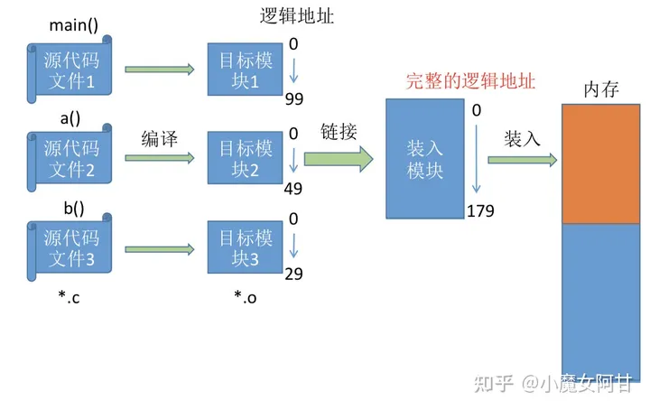

##### 2.4.2 装入时动态链接
运行前边装入边链接的链接方式.
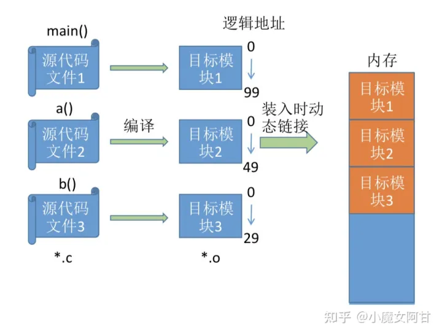

##### 2.4.3 运行时动态链接
运行时该目标模块时,才对它进行链接,用不到的模块不需要装入内存.其优点是便于修改和更新,便于实现对目标模块的共享.

可以看到运行时动态链接,不需要一次性将模块全部装入内存,可以等到运行时需要的时候再动态的连接进去,这样一来就就提供了内存不够用的问题的解决思路,还可以这样,用到了再链接进去.

#### 2.5 内存的装入方式
##### 2.5.1 什么是内存的装入

内存的装入是指将程序或数据从磁盘加载到内存中的过程.这是程序运行的一个重要步骤,因为CPU只能直接访问内存中的数据,不能直接访问磁盘中的数据.

在装入过程中,操作系统通常会进行以下操作:

1. 分配内存:操作系统会为程序分配足够的内存空间.这个空间通常包括代码段(用于存放程序的指令)/数据段(用于存放程序的全局变量)和堆栈段(用于存放局部变量和函数调用的信息).

2. 加载程序:操作系统会将程序的代码和数据从磁盘读取到内存中.

3. 重定位:如果程序不能被加载到它预期的内存地址,操作系统会进行重定位,修改程序的地址信息,使得程序可以在实际加载的地址上正确运行.

4. 启动程序:操作系统会将CPU的控制权交给程序,开始执行程序的指令.

请注意,以上描述的是一种简化的装入过程.在实际的操作系统中,装入过程可能会更复杂,包括动态链接/虚拟内存管理等操作.

##### 2.5.1 绝对装入
在编译时,如果知道程序将放到内存中的哪个位置,编译程序将产生绝对地址的目标代码.装入程序按照装入模块中的地址,将程序和数据装入内存.
*(只适用于单道程序环境)

##### 2.5.2 可重定位装入(静态装入)
又称可重定位装入.编译/链接后的装入模块的地址都是从0开始的,指令中使用的地址/数据存放的地址都是相对于起始地址而言的逻辑地址.可根据内存的当前情况,将装入模块装入到内存的适当位置.装入时对地址进行"重定位",将逻辑地址变换为物理地址(地址变换是在装入时一次完成的). 静态重定位的特点是在一个作业装入内存时,必须分配其要求的全部内存空间,如果没有足够的内存,就不能装入该作业. 作业一旦进入内存后,在运行期间就不能再移动,也不能再申请内存空间.

##### 2.5.3 动态运行时装入(动态装入)
又称动态运行时装入.编译/链接后的装入模块的地址都是从0开始的.装入程序把装入模块装入内存后,并不会立即把逻辑地址转换为物理地址,而是把地址转换推迟到程序真正要执行 时才进行.因此装入内存后所有的地址依然是逻辑地址.这种方式需要一个重定位寄存器的支持.

*采用动态重定位时允许程序在内存中发生移动

#### 2.6 交换

设计思想:内存空间紧张时,系统将内存中某些进程暂时换出外存,把外存中某些已具备运行条件的进程换入内存(进程在内存与磁盘间动态调度).

暂时换出外存等待的进程状态为挂起状态(挂起态,suspend),挂起态又可以进一步细分为就绪挂起/阻塞挂起两种状态
>1:具有对换功能的操作系统中,通常把磁盘空间分为文件区和对换区两部分.
文件区主要用于存放文件,主要追求存储空间的利用率,因此对文件区空间的管理采用离散分配方式;对换区空间只占磁盘空间的小部分,被换出的进程数据就存放在对换区.由于对换的速度直接影响到系统的整体速度,因此对换区空间的管理 主要追求换入换出速度,因此通常对换区采用连续分配方式(学过文件管理章节 后即可理解).总之,对换区的I/O速度比文件区的更快.

#### ques
1. 内存覆盖和内存交换的本质区别是什么?

2. 应该什么时候发生内存交换?
    交换通常在许多进程运行且内存吃紧时进行,而系统负荷降低就暂停.例如:在 发现许多进程运行时经常发生缺页,就说明内存紧张,此时可以换出一些进程; 如果缺页率明显下降,就可以暂停换出.

3. 应该换出那些进程?
    可优先换出阻塞进程;可换出优先级低的进程;为了防止优先级低的进程在被调 入内存后很快又被换出,有的系统还会考虑进程在内存的驻留时间...(注意:PCB 会常驻内存,不会被换出外存)

### 内存分配管理
#### 1. 连续分配
连续分配:指为用户进程分配的必须是一个连续的内存空间
在单一连续分配方式中,内存被分为系统区和用户区.
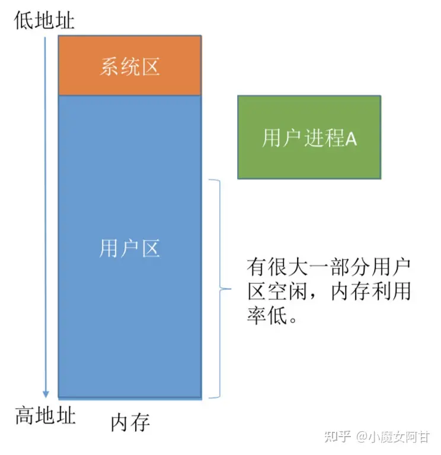
系统区通常位于内存的低地址部分,用于存放操作系统相关数据;用户区用于存放用户进程相关数据.内存中只能有一道用户程序,用户程序独占整个用户区空间.

优点:实现简单;无外部碎片;可以采用覆盖技术扩充内存;不一定需要采取内存保护
缺点:只能用于单用户/单任务的操作系统中;有内部碎片;存储器利用率极低.

#### 2. 固定分区分配
整个用户空间划分为若干个固定大小(相等或不相等)的分区,在每个分区中只装入一道作业,这样就形成了最早的/最简单的一种可运行多道程序的内存管理方式.
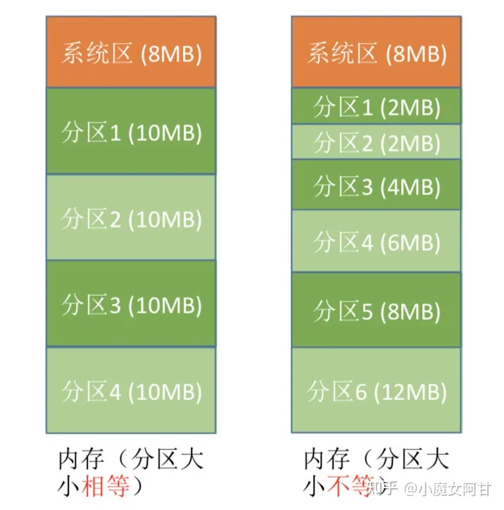

分区大小相等:缺乏灵活性,但是很适合用于用一台计 算机控制多个相同对象的场合
分区大小不等:增加了灵活性,可以满足不同大小的进程需求.根据常在系统中运行的作业大小情况进行划分

实现方式:
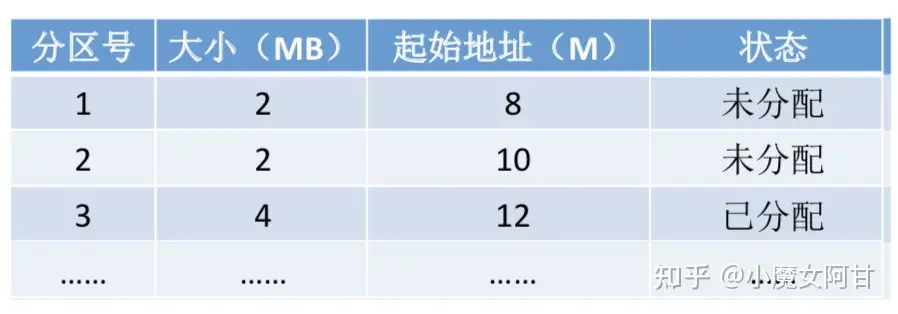
操作系统需要建立一个数据结构__分区说明表,来实现各个分区的分配与回 收.每个表项对应一个分区,通常按分区大小排列.每个表项包括对应分区的大小/起始地址/状态(是否已分配)

优点:实现简单,无外部碎片.
缺点:a. 当用户程序太大时,可能所有的分区都不能满足需求,此时不得不采 用覆盖技术来解决,但这又会降低性能;b. 会产生内部碎片,内存利用率低.

#### 3. 动态分区分配
动态分区分配又称为可变分区分配.这种分配方式不会预先划分内存分区,而是在进程装入内存时, 根据进程的大小动态地建立分区,并使分区的大小正好适合进程的需要.因此系统分区的大小和数目是可变的.
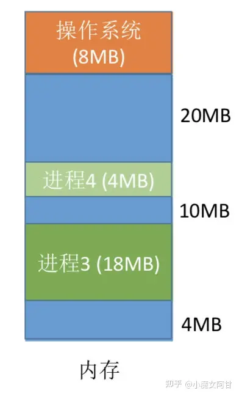
四种分配算法:
##### 3.1 首次适应算法
算法思想:每次都从低地址开始查找,找到第一个能满足大小的空闲分区.如何实现:空闲分区以地址递增的次序排列.每次分配内存时顺序查找空闲分区链(或空闲分区表),找到大小能满足要求的第一个空闲分区

##### 3.2 最佳适应算法

算法思想:由于动态分区分配是一种连续分配方式,为各进程分配的空间必须是连续的一整片区域.因此为了保证当"大进程"到来时能有连续的大片空间,可以尽可能多地留下大片的空闲区,即,优先使用更小的空闲区.

如何实现:空闲分区按容量递增次序链接.每次分配内存时顺序查找空闲分区链(或空闲分区表),找到大小能满足要求的第一个空闲分区.

缺点:每次都选最小的分区进行分配,会留下越来越多的/很小的/难以利用的内存块.因此这种方法会产生很多的外部碎片.

##### 3.3 最坏适应算法

又称 最大适应算法(Largest Fit) 算法思想:为了解决最佳适应算法的问题__即留下太多难以利用的小碎片,可以在每次分配时 优先使用最大的连续空闲区,这样分配后剩余的空闲区就不会太小,更方便使用. 如何实现:空闲分区按容量递减次序链接.每次分配内存时顺序查找空闲分区链(或空闲分区 表),找到大小能满足要求的第一个空闲分区.

缺点:每次都选最大的分区进行分配,虽然可以让分配后留下的 空闲区更大,更可用,但是这种方式会导致较大的连续空闲区被 迅速用完.如果之后有"大进程"到达,就没有内存分区可用了.

##### 3.4 近适应算法

算法思想:首次适应算法每次都从链头开始查找的.这可能会导致低地址部分出现很多小的空闲分区,而每次分配查找时,都要经过这些分区,因此也增加了查找的开销.如果每次都从上次查找结束的位置开始检索,就能解决上述问题.

如何实现:空闲分区以地址递增的顺序排列(可排成一个循环链表).每次分配内存时从上次查找结束的位置开始查找空闲分区链(或空闲分区表),找到大小能满足要求的第一个空闲分区

动态分区分配没有内部碎片,但是有外部碎片.可以通过紧凑(拼凑,Compaction)技术来解决外部碎片.

### 非连续分配管理方式
#### 1. 分页存储
* 什么是分页存储
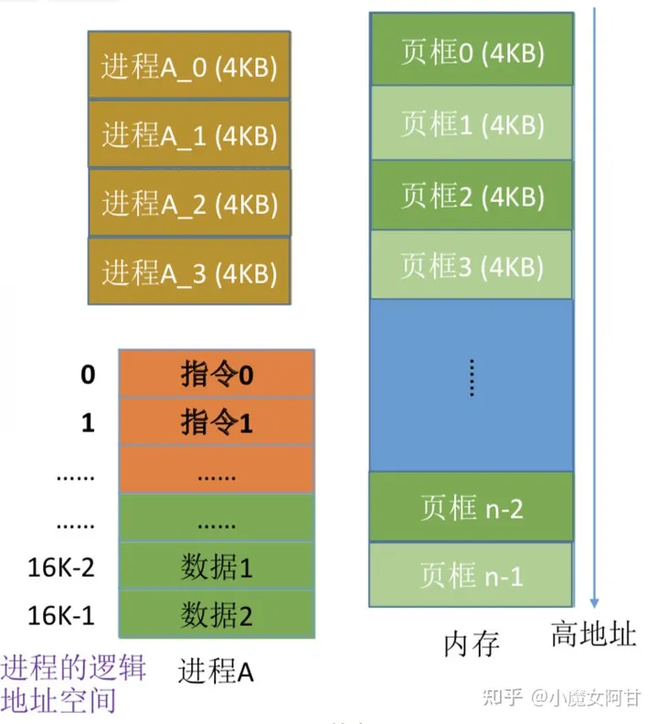
将内存空间分为一个个大小相等的分区(比如:每个分区 4KB),每个分区就是一个"页框"(页框=页帧=内存块=物理块=物理页面).每个页框有一个编号,即"页框号"(页框 号=页帧号=内存块号=物理块号=物理页号),页框号从0开始.

将进程的逻辑地址空间也分为与页框大小相等的一个个部分, 每个部分称为一个"页"或"页面" .每个页面也有一个编号, 即"页号",页号也是从0开始.

操作系统以页框为单位为各个进程分配内存空间.进程的每个页面分别放入一个页框中.也就是说,进程的页面与内存的页框有一一对应的关系.各个页面不必连续存放,可以放到不相邻的各个页框中.

(注:进程的最后一个页面可能没有一个页框那么大.也就是说,分页存储有可能产生内部碎片,因此页框不能太大,否则 进程的逻辑 可能产生过大的内部碎片造成浪费)

* 页表
    为了能知道进程的每个页面在内存中存放的位置,操作系统要为每个进程建立一张页表.页表通常存在PCB(进程控制块)中.
    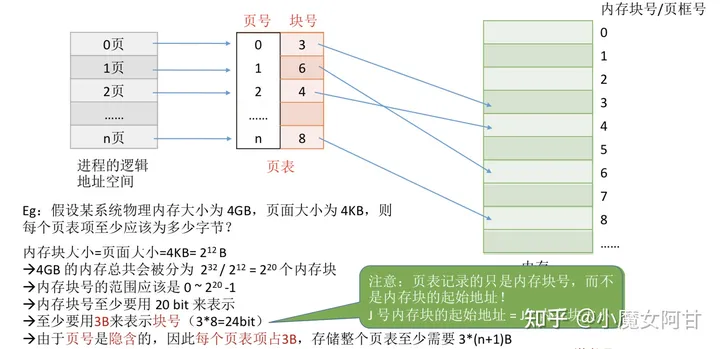

* 分页-分页之后的地址转换
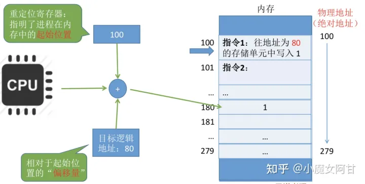
页号 = 逻辑地址 / 页面长度 (取除法的整数部分)

页内偏移量 = 逻辑地址 % 页面长度(取除法的余数部分)

* 如何找到所有分区(页框,内存块)以及相关的页表

* 两级页表
    * 单极页表有什么问题?
        * 所有页表项必须连续存放,页表过大时需要很大的连续空间
        * 在一段时间内并非所有页面都用得到,因此没必要让整个页表常驻内存将长长的页表再分页
    * 什么是两级页表?
      * 将长长的页表再分页
      * 逻辑地址结构: (一级页号,二级页号,页内偏移量)
        
        > 要能根据逻辑地址位数/页面大小/页表项大小 确定多级页表的逻辑地址结构
      * 注意几个术语: 页目录表/外层页表/顶级页表
    * 如何实现地址变换?
      * 按照地址结构将逻辑地址拆分成三部分
      * 从PCB 中读出页目录表始址,根据一级页号查页目录表,找到下一级页表在内存中的存放位置
      * 根据二级页号查表,找到最终想访问的内存块号
      * 结合页内偏移量得到物理地址
    * trivial
      * 多级页表中,各级页表的大小不能超过一个页面.若两级页表不够,可以分更多级
      * 多级页表的访存次数(假设没有快表机构)   级页表访问一个辑地址需要 N+1次访存

#### 2. 分段存储
  * 什么分段存储
    * 将地址空间按程序自身的逻辑关系划分为若干个段,每段从0开始指址
    * 每个段在内存中占据连续空间,但各段之间可以不相邻
    * 逻辑地址结构: (段号,段内地址)
  * 段表
    * 记录逻辑段到实际存储地址的映射关系
    * 梅个段对应一个段表项.各段表项长度相同,由段号<隐含) /段长/基址组成
  * 地址变换
    * 1. 由逻辑地址得到段号/段内地址
    * 2. 段号与段表寄存器中的段长度比较,检查是否越界
    * 3. 由段表始址/段号找到对应段表项
    * 4. 根抓段表中记录的段长,检查段内地址是否越界
    * 5. 由段表中的"基址+段内地址"得到最终的物理地划
    * 6. 访问目标单元
  * 分段 VS 分页
    * 分页对用户不可见,分段对用户可见
    * 分页的地址空间是一维的,分段的地址空间是二维的
    * 分段更容易实现信息的共享和保护 <纯代码/可重入代码可以共享)
    * 分页(单级页表)/分段访问一个逻辑地址都需要两次访存,分段存储中也可以引入快表机构

##### 分段和分页的优缺点

页是信息的物理单位.分页的主要目的是为了实现离散分配,提高内存利用率.分页仅仅是系统管理上的需要,完全是系统行为,对用户是不可见的.

段是信息的逻辑单位.分页的主要目的是更好地满足用户需求.一个段通常包含着一组属于一个逻辑模块的信息.分段对用户是可见的,用户编程时需要显式地给出段名.

页的大小固定且由系统决定.段的长度却不固定,决定于用户编写的程序.

分页的用户进程地址空间是一维的,程序员只需给出一个记忆符即可表示一个地址.

分段的用户进程地址空间是二维的,程序员在标识一个地址时,既要给出段名,也要给出段内地址.

分段比分页更容易实现信息的共享和保护.不能被修改的代码称为纯代码或可重入代码(不属于临界资源),这样的代码是可以共享的.可修改的代码是不能共享的
* 访问一个逻辑地址需要几次访存?
    分页(单级页表):第一次访存__查内存中的页表,第二次访存__访问目标内存单元.总共两次访存
    分段:第一次访存__查内存中的段表,第二次访存__访问目标内存单元.总共两次访存
    与分页系统类似,分段系统中也可以引入快表机构,将近期访问过的段表项放到快表中,这样可以少一次访问,加快地址变换速度.

#### 3. 段页式管理
  
  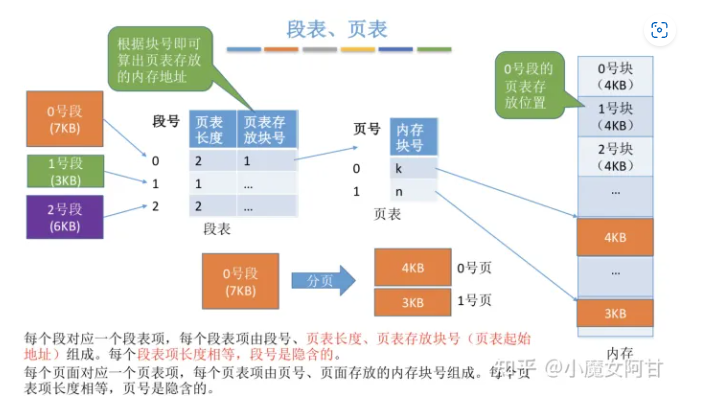
  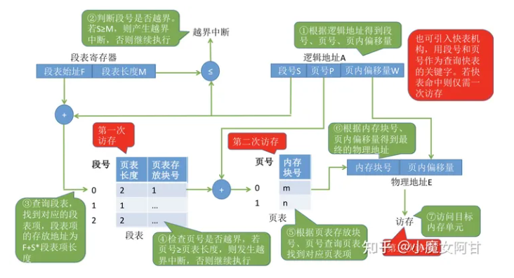
  * 分段 + 分页
    * 将地址空间按照程序自身的逻辑关系划分为若干个段,在将各段分为大小相等的页面
    * 将内存空间分为与页面大小相等的一个个内存块,系统以块为单位为进程分配内存
    * 逻辑地址结构: (段号,页号,页内偏移量)
  * 段表/页表
    * 每个段对应一个段表项.各段表项长度相同,由段号(隐含) /页表长度/页表存放地址 组成
    * 每个页对应一个页表项.各页表项长度相同,由页号(隐含) /页面存放的内存块号 组成
  * 地址变换
    * 1.由逻辑地址得到段号/页号/页内偏移量
    * 2.段号与段表寄存器中的段长度比较,检查是否越界
    * 3.由段表始址/段号找到对应段表项
    * 4.根据段表中记录的页表长度,检查页号是否越界
    * 5.由段表中的页表地址/页号得到查询页表,找到相应页表项
    * 6由页面存放的内存块号/页内偏移量得到最终的物理地址
    * 7.访问目标单元
  * 访问一个逻辑地址所需访存次数
    * 第一次一一查段表/第二次一一查页表/第三次一一访问目标单元
    * 可引入快表机构,以段号和页号为关键字查询快表,即可直接找到最终的目标页面存放位置.引入快表后仅需一次访存

### 虚拟内存

  * 传统存储管理方式的特征/缺点
    * 一次性: 作业数据必须一次全部调入内存
    * 驻留性: 作业数据在整个运行期间都会常驻内存
  * 局部性原理
    * 时间局部性: 现在访问的指令/数据在不久后很可能会被再次访问
    * 空间局部性:现在访问的内存单元周围的内存空间,很可能在不久后会被访问
    * 高速缓存技术: 使用频繁的数据放到更高速的存储器中
  * 虚拟内存的定义和特征
    * 程序不需全部装入即可运行,运行时根据需要动态调入数据,若内存不够,还需换出一些数据
    * 特征
      * 多次性:无需在作业运行时一次性全部装入内存,而是允许被分成多次调入内存.
      * 对换性:无需在作业运行时一直常驻内存,而是允许在作业运行过程中,将作业换入/换出.
      * 虚拟性: 从逻辑上扩充了内存的容量,使用户看到的内存容量,远大于实际的容量
  * 如何实现虑拟内存技术
    * 访问的信息不在内存时,由操作系统负责将所需信息从外存调入内存(请求调页功能)
    * 内存空间不够时,将内存中暂时用不到的信息换出到外存(页面置换功能)
  * 虚拟内存的实现
    * 请求分页式存储管理
    * 请求分段存储管理
    * 请求段页式存储管理
  * trivial
    * 易混知识点: 虚拟内存的最大容量是由计算机的地址结构(CPU寻址范围)确定的
    * 虚拟内存的实际容量 = min(内存和外存容量之和,CPU寻址范围 )

#### 请求分页管理方式
请求分页存储管理与基本分页存储管理的主要区别:

请求调页:在程序执行过程中,当所访问的信息不在内存时,由操作系统负责将所需信息从外存调入内存,然后继续执行程序.
页面置换:若内存空间不够,由操作系统负责将内存中暂时用不到的信息换出到外存.

  * 页表机制
    * 在基本分页的基础上增加了几个表项
    * 状态位: 表示页面是否已在内存中
    * 访问字段: 记录最近被访问过几次,或记录上次访问的时间,供置换算法选择换出页面时参考
    * 修改位:表示页面调入内存后是否被修改过,只有修改过的页面才需在置换时写回外存
    * 外存地址: 页面在外存中存放的位置
  * 缺页中断机构
    * 找到页表项后检查页面是否已在内存,若没在内存,产生缺页中断
    * 缺页中断处理中,需要将目标页面调入内存,有必要时还要换出页面
    * 缺页中断属于内中断,属于内中断中的"故障",即可能被系统修复的异常
    * 一条指令在执行过程中可能产生多次缺页中断
  * 地址变换机构 (重点关注与基本分页不同的地方)
    * 找到页表项是需要检查页面是否在内存中
    * 若页面不再内存中,需要请求调页
    * 若内存空间不够,还需换出页面
    * 页面调入内存后,需要修改相应页表项

缺页中断是因为当前执行的指令想要访问的目标页面未调入内存而产生的,因此属于内中断一条指令在执行期间,可能产生多次缺页中断.(如:copy A to B,即将逻辑地址A中的数据复制到 逻辑地址B,而A/B属于不同的页面,则有可能产生两次中断)

### 页面置换算法

|                        | 算法规则                                                                                                                           | 优缺点                                        |
| ---------------------- | ---------------------------------------------------------------------------------------------------------------------------------- | --------------------------------------------- |
| OPT                    | 优先淘汰最长时间内不会被访问的页面                                                                                                 | 性能最好:缺页率最小,但无法实现                |
| FIFO                   | 优先淘汰最先进入内存的页面                                                                                                         | 实现简单:但性能很差,可能出现Belady异常        |
| LRU                    | 优先淘汰最近最久没访问的页面                                                                                                       | 性能很好:但需要硬件支持,算法开销大            |
| CLOCK (NRU)            | 循环扫描各页面第一轮淘汰访问位=0的,并将扫描过的页面访问位改为1.若第一轮没选中,则进行第二轮扫描                                     | 实现简单,算法开销小:但未考虑页面是否被修改过. |
| 改进型CLOCK(改进型NRU) | 若用(访问位,修改位)的形式表述,则第一轮:淘汰 (0,0)第二轮:淘汰 (0,1),并将扫描过的页面访问位都置为0第三轮:淘汰 (0,0)第四轮:淘汰 (0,1) | 算法开销较小,性能也不错                       |
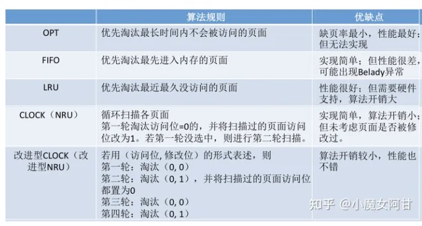

### 页面分配策略
  * 驻留集
    * 指请求分页存储管理中给进程分配的内存块的集合
  * 页面分配/置换策略
    * 固定分配 VS 可变分配: 区别在于进程运行期间驻留集大小是否可变
    * 局部置换 VS 全局置换: 区别在于发生缺页时是否只能从进程自己的页面中选择一个换出
    * 固定分配局部置换: 进程运行前就分配一定数量物理块,缺页时只能换出进程自己的某一页
    * 可变分配全局置换: 只要缺页就分配新物理块,可能来自空闲物理块,也可能需换出别的进程页面
    * 可变分配局部置换: 频繁缺页的进程.多分配一些物理块;缺页率很低的进程,回收一些物理块.直到缺页率合适
  * 何时调入页面
    * 预调页策略:一般用于进程运行前
    * 请求调页策略:进程运行时,发现缺页再调页
  * 从何处调页
    * 对换区一采用连续存储方式,速度更快;文件区一一采用离散存储方式,速度更慢.
    * 对换区足够大:运行将数据从文件区复制到对换区,之后所有的页面调入/调出都是在内存与对换区之间进行
    * 对换区不够大: 不会修改的数据每次都从文件区调入;会修改的数据调出到对换区,需要时再从对换区调入
    * UNIX方式: 第一次使用的页面都从文件区调入;调出的页面都写回对换区,再次使用时从对换区调入
  * 抖动(颠) 现参
    * 页面频繁换入换出的现象 主要原因是分配给进程的物理块不够
  * 工作集
    * 在某段时间间隔里,进程实际访问页面的集合.驻留集大小一般不能小于工作集大小
