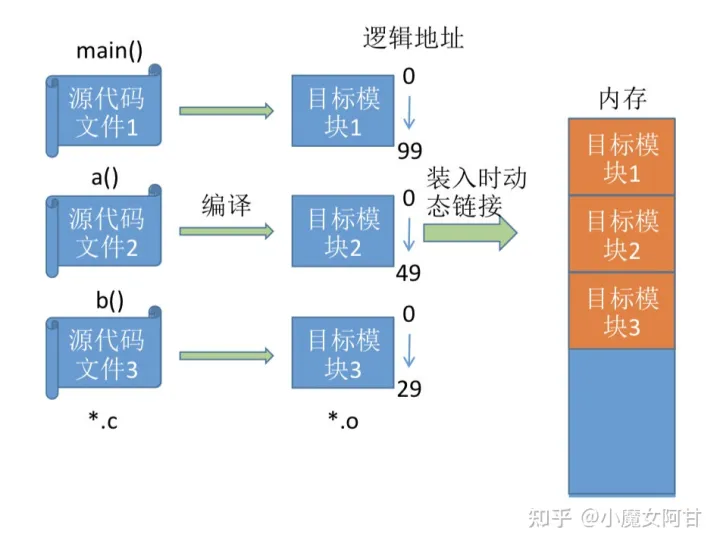
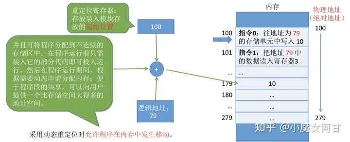

## 2. 内存的链接方式

内存的链接方式主要有三种：静态链接、装入时动态链接和运行时动态链接。

### 2.1 静态链接

静态链接是在程序运行之前，将各目标模块及它们所需的库函数链接成一个完整的可执行文件（装入模块），即得到完整的逻辑地址，之后不再拆开。这种方式的优点是执行效率高，因为所有的模块都已经链接好了，缺点是浪费内存空间，因为即使程序只使用了部分模块，整个可执行文件也会被全部装入内存。

### 2.2 装入时动态链接

装入时动态链接是在程序运行时，边装入边链接的链接方式。这种方式的优点是可以节省内存空间，因为只有在程序需要使用某个模块时，才会将该模块装入内存并进行链接，缺点是会增加程序的启动时间，因为在程序启动时需要进行链接操作。

### 2.3 运行时动态链接

运行时动态链接是在程序运行时，需要用到哪个模块才对它进行链接，用不到的模块不需要装入内存。这种方式的优点是可以进一步节省内存空间，因为只有在程序需要使用某个模块时，才会将该模块装入内存并进行链接，缺点是会增加程序的运行时开销，因为在程序运行时需要进行链接操作。

运行时动态链接的实现需要操作系统的支持，通常是通过动态链接库（DLL）来实现的。在 Windows 系统中，DLL 是一种可执行文件，它包含了一些可以被多个程序共享的代码和数据。当程序需要使用 DLL 中的函数或数据时，操作系统会将 DLL 加载到内存中，并将程序的调用重定向到 DLL 中的相应函数或数据。

### 总结

三种内存链接方式各有优缺点，选择哪种方式取决于程序的需求和运行环境。静态链接适用于对执行效率要求高、内存资源充足的场景；装入时动态链接适用于对启动时间要求不高、内存资源有限的场景；运行时动态链接适用于对内存资源要求极高、程序运行时需要动态加载模块的场景。

## 2.5 内存的装入方式

### 2.5.1 什么是内存的装入

内存的装入是指将程序或数据从磁盘加载到内存中的过程。这是程序运行的一个重要步骤，因为 CPU 只能直接访问内存中的数据，不能直接访问磁盘中的数据。

在装入过程中，操作系统通常会进行以下操作：

1. **分配内存**：操作系统会为程序分配足够的内存空间。这个空间通常包括代码段（用于存放程序的指令）、数据段（用于存放程序的全局变量）和堆栈段（用于存放局部变量和函数调用的信息）。
2. **加载程序**：操作系统会将程序的代码和数据从磁盘读取到内存中。
3. **重定位**：如果程序不能被加载到它预期的内存地址，操作系统会进行重定位，修改程序的地址信息，使得程序可以在实际加载的地址上正确运行。
4. **启动程序**：操作系统会将 CPU 的控制权交给程序，开始执行程序的指令。

请注意，以上描述的是一种简化的装入过程。在实际的操作系统中，装入过程可能会更复杂，包括动态链接、虚拟内存管理等操作。

### 2.5.2 绝对装入

在编译时，如果知道程序将放到内存中的哪个位置，编译程序将产生绝对地址的目标代码。装入程序按照装入模块中的地址，将程序和数据装入内存。这种方式只适用于单道程序环境。

### 2.5.3 可重定位装入（静态装入）

又称可重定位装入。编译、链接后的装入模块的地址都是从 0 开始的，指令中使用的地址、数据存放的地址都是相对于起始地址而言的逻辑地址。可根据内存的当前情况，将装入模块装入到内存的适当位置。装入时对地址进行“重定位”，将逻辑地址变换为物理地址（地址变换是在装入时一次完成的）。静态重定位的特点是在一个作业装入内存时，必须分配其要求的全部内存空间，如果没有足够的内存，就不能装入该作业。作业一旦进入内存后，在运行期间就不能再移动，也不能再申请内存空间。

### 2.5.4 动态运行时装入（动态装入）

又称动态运行时装入。编译、链接后的装入模块的地址都是从 0 开始的。装入程序把装入模块装入内存后，并不会立即把逻辑地址转换为物理地址，而是把地址转换推迟到程序真正要执行时才进行。因此装入内存后所有的地址依然是逻辑地址。这种方式需要一个重定位寄存器的支持。采用动态重定位时允许程序在内存中发生移动。

#### 总结

内存的装入方式主要有绝对装入、可重定位装入和动态运行时装入。不同的装入方式适用于不同的环境和需求。绝对装入适用于单道程序环境，可重定位装入和动态运行时装入则适用于多道程序环境，其中动态运行时装入更加灵活，允许程序在内存中移动。

