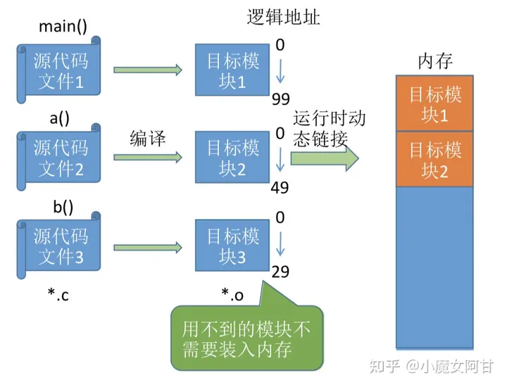

#### 2.4 内存的链接方式
##### 2.4.1 静态链接
静态链接 在程序运行之前，先将各目标模块及它们所需的库函数链接成一个完整的可执行文件(装入模块)，即得到完整的逻辑地址，之后不再拆开。

##### 2.4.2 装入时动态链接
运行前边装入边链接的链接方式。

##### 2.4.3 运行时动态链接
运行时该目标模块时，才对它进行链接，用不到的模块不需要装入内存。其优点是便于修改和更新，便于实现对目标模块的共享。

可以看到运行时动态链接，不需要一次性将模块全部装入内存，可以等到运行时需要的时候再动态的连接进去，这样一来就就提供了内存不够用的问题的解决思路，还可以这样，用到了再链接进去。
