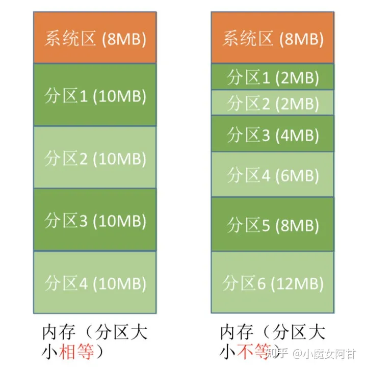
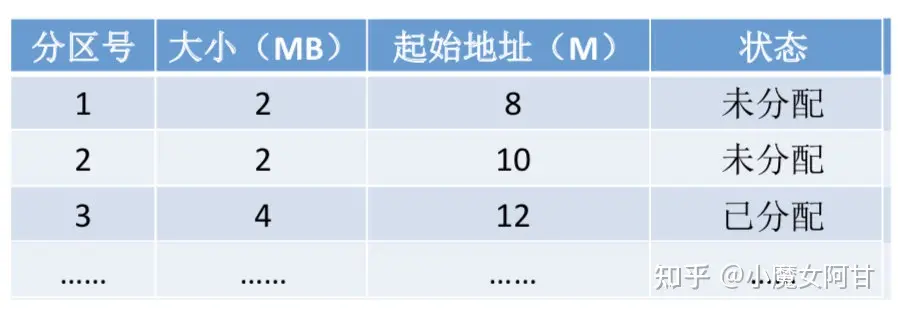
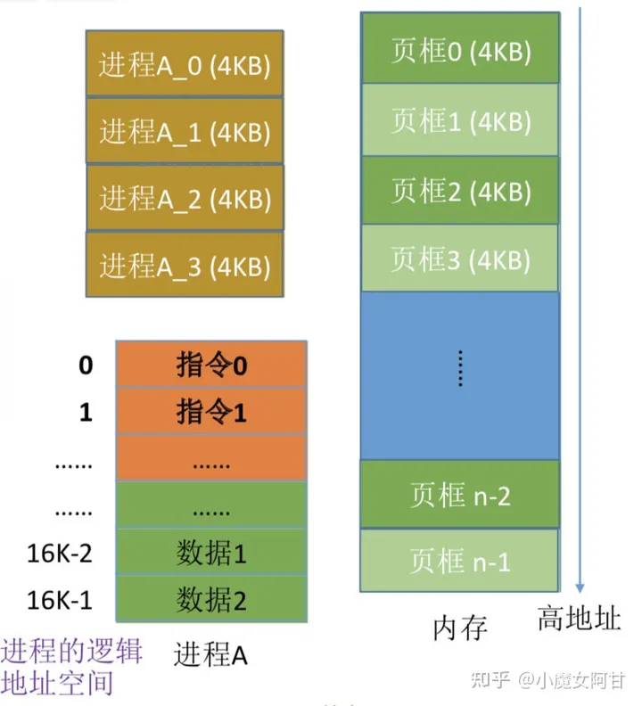
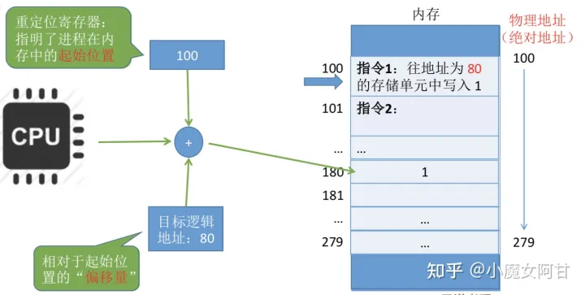
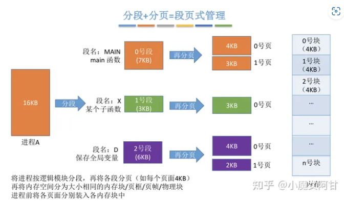
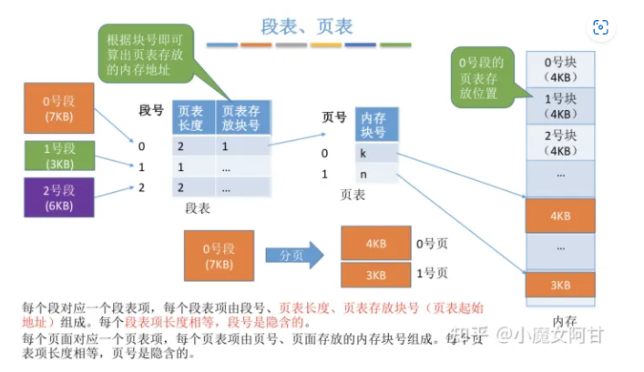
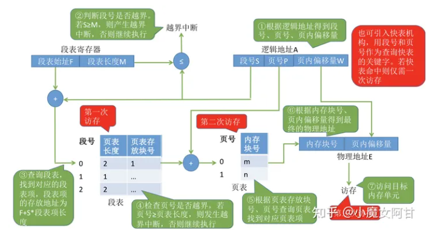
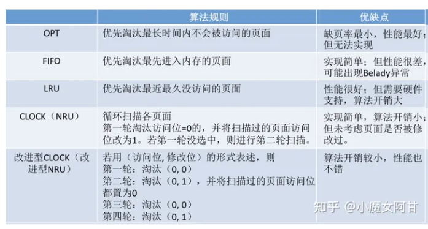

#### 2.7 内存分配管理
##### 2.7.1 连续分配
连续分配:指为用户进程分配的必须是一个连续的内存空间
在单一连续分配方式中，内存被分为系统区和用户区。

系统区通常位于内存的低地址部分，用于存放操作系统相关数据;用户区用于存放用户进程相关数据。内存中只能有一道用户程序，用户程序独占整个用户区空间。

优点:实现简单;无外部碎片;可以采用覆盖技术扩充内存;不一定需要采取内存保护
缺点:只能用于单用户/单任务的操作系统中;有内部碎片;存储器利用率极低。

##### 2.7.2 固定分区分配
整个用户空间划分为若干个固定大小(相等或不相等)的分区，在每个分区中只装入一道作业，这样就形成了最早的/最简单的一种可运行多道程序的内存管理方式。


分区大小相等:缺乏灵活性，但是很适合用于用一台计 算机控制多个相同对象的场合
分区大小不等:增加了灵活性，可以满足不同大小的进程需求。根据常在系统中运行的作业大小情况进行划分

实现方式:

操作系统需要建立一个数据结构__分区说明表，来实现各个分区的分配与回 收。每个表项对应一个分区，通常按分区大小排列。每个表项包括对应分区的大小/起始地址/状态(是否已分配)

优点:实现简单，无外部碎片。
缺点:a. 当用户程序太大时，可能所有的分区都不能满足需求，此时不得不采 用覆盖技术来解决，但这又会降低性能;b. 会产生内部碎片，内存利用率低。

##### 2.7.3 动态分区分配
动态分区分配又称为可变分区分配。这种分配方式不会预先划分内存分区，而是在进程装入内存时， 根据进程的大小动态地建立分区，并使分区的大小正好适合进程的需要。因此系统分区的大小和数目是可变的。

四种分配算法:
###### 2.7.3.1 首次适应算法
算法思想:每次都从低地址开始查找，找到第一个能满足大小的空闲分区。如何实现:空闲分区以地址递增的次序排列。每次分配内存时顺序查找空闲分区链(或空闲分区表)，找到大小能满足要求的第一个空闲分区


###### 2.7.3.2 最佳适应算法

算法思想:由于动态分区分配是一种连续分配方式，为各进程分配的空间必须是连续的一整片区域。因此为了保证当"大进程"到来时能有连续的大片空间，可以尽可能多地留下大片的空闲区，即，优先使用更小的空闲区。

如何实现:空闲分区按容量递增次序链接。每次分配内存时顺序查找空闲分区链(或空闲分区表)，找到大小能满足要求的第一个空闲分区。

缺点:每次都选最小的分区进行分配，会留下越来越多的/很小的/难以利用的内存块。因此这种方法会产生很多的外部碎片。

###### 2.7.3.3 最坏适应算法

又称 最大适应算法(Largest Fit) 算法思想:为了解决最佳适应算法的问题__即留下太多难以利用的小碎片，可以在每次分配时 优先使用最大的连续空闲区，这样分配后剩余的空闲区就不会太小，更方便使用。 如何实现:空闲分区按容量递减次序链接。每次分配内存时顺序查找空闲分区链(或空闲分区 表)，找到大小能满足要求的第一个空闲分区。

缺点:每次都选最大的分区进行分配，虽然可以让分配后留下的 空闲区更大，更可用，但是这种方式会导致较大的连续空闲区被 迅速用完。如果之后有"大进程"到达，就没有内存分区可用了。


###### 2.7.3.4 近适应算法

算法思想:首次适应算法每次都从链头开始查找的。这可能会导致低地址部分出现很多小的空闲分区，而每次分配查找时，都要经过这些分区，因此也增加了查找的开销。如果每次都从上次查找结束的位置开始检索，就能解决上述问题。

如何实现:空闲分区以地址递增的顺序排列(可排成一个循环链表).每次分配内存时从上次查找结束的位置开始查找空闲分区链(或空闲分区表)，找到大小能满足要求的第一个空闲分区


动态分区分配没有内部碎片，但是有外部碎片。可以通过紧凑(拼凑，Compaction)技术来解决外部碎片。

##### 2.7.4 非连续分配管理方式
###### 2.7.4.1 分页存储
* 什么是分页存储

将内存空间分为一个个大小相等的分区(比如:每个分区 4KB)，每个分区就是一个"页框"(页框=页帧=内存块=物理块=物理页面).每个页框有一个编号，即"页框号"(页框 号=页帧号=内存块号=物理块号=物理页号)，页框号从0开始。

将进程的逻辑地址空间也分为与页框大小相等的一个个部分， 每个部分称为一个"页"或"页面" .每个页面也有一个编号， 即"页号"，页号也是从0开始。

操作系统以页框为单位为各个进程分配内存空间。进程的每个页面分别放入一个页框中。也就是说，进程的页面与内存的页框有一一对应的关系。各个页面不必连续存放，可以放到不相邻的各个页框中。

(注:进程的最后一个页面可能没有一个页框那么大。也就是说，分页存储有可能产生内部碎片，因此页框不能太大，否则 进程的逻辑 可能产生过大的内部碎片造成浪费)

* 页表
    为了能知道进程的每个页面在内存中存放的位置，操作系统要为每个进程建立一张页表。页表通常存在PCB(进程控制块)中。
    

* 分页-分页之后的地址转换

页号 = 逻辑地址 / 页面长度 (取除法的整数部分)

页内偏移量 = 逻辑地址 % 页面长度(取除法的余数部分)


* 如何找到所有分区(页框，内存块)以及相关的页表


* 两级页表
    * 单极页表有什么问题？
        * 所有页表项必须连续存放，页表过大时需要很大的连续空间
        * 在一段时间内并非所有页面都用得到，因此没必要让整个页表常驻内存将长长的页表再分页
    * 什么是两级页表？
      * 将长长的页表再分页
      * 逻辑地址结构: (一级页号，二级页号，页内偏移量)
        
        > 要能根据逻辑地址位数/页面大小/页表项大小 确定多级页表的逻辑地址结构
      * 注意几个术语: 页目录表/外层页表/顶级页表
    * 如何实现地址变换？
      * 按照地址结构将逻辑地址拆分成三部分
      * 从PCB 中读出页目录表始址，根据一级页号查页目录表，找到下一级页表在内存中的存放位置
      * 根据二级页号查表，找到最终想访问的内存块号
      * 结合页内偏移量得到物理地址
    * trivial
      * 多级页表中，各级页表的大小不能超过一个页面。若两级页表不够，可以分更多级
      * 多级页表的访存次数(假设没有快表机构)   级页表访问一个辑地址需要 N+1次访存

###### 2.7.4.2 分段存储
  * 什么分段存储
    * 将地址空间按程序自身的逻辑关系划分为若干个段，每段从0开始指址
    * 每个段在内存中占据连续空间，但各段之间可以不相邻
    * 逻辑地址结构: (段号，段内地址)
  * 段表
    * 记录逻辑段到实际存储地址的映射关系
    * 梅个段对应一个段表项。各段表项长度相同，由段号<隐含) /段长/基址组成
  * 地址变换
    * 1. 由逻辑地址得到段号/段内地址
    * 2. 段号与段表寄存器中的段长度比较，检查是否越界
    * 3. 由段表始址/段号找到对应段表项
    * 4. 根抓段表中记录的段长，检查段内地址是否越界
    * 5. 由段表中的"基址+段内地址"得到最终的物理地划
    * 6. 访问目标单元
  * 分段 VS 分页
    * 分页对用户不可见，分段对用户可见
    * 分页的地址空间是一维的，分段的地址空间是二维的
    * 分段更容易实现信息的共享和保护 <纯代码/可重入代码可以共享)
    * 分页(单级页表)/分段访问一个逻辑地址都需要两次访存，分段存储中也可以引入快表机构

* **分段和分页的优缺点**

页是信息的物理单位。分页的主要目的是为了实现离散分配，提高内存利用率。分页仅仅是系统管理上的需要，完全是系统行为，对用户是不可见的。

段是信息的逻辑单位。分页的主要目的是更好地满足用户需求。一个段通常包含着一组属于一个逻辑模块的信息。分段对用户是可见的，用户编程时需要显式地给出段名。

页的大小固定且由系统决定。段的长度却不固定，决定于用户编写的程序。

分页的用户进程地址空间是一维的，程序员只需给出一个记忆符即可表示一个地址。

分段的用户进程地址空间是二维的，程序员在标识一个地址时，既要给出段名，也要给出段内地址。

分段比分页更容易实现信息的共享和保护。不能被修改的代码称为纯代码或可重入代码(不属于临界资源)，这样的代码是可以共享的。可修改的代码是不能共享的
* 访问一个逻辑地址需要几次访存？
    分页(单级页表):第一次访存__查内存中的页表，第二次访存__访问目标内存单元。总共两次访存
    分段:第一次访存__查内存中的段表，第二次访存__访问目标内存单元。总共两次访存
    与分页系统类似，分段系统中也可以引入快表机构，将近期访问过的段表项放到快表中，这样可以少一次访问，加快地址变换速度。


###### 2.7.4.3. 段页式管理
  
  
  
  * 分段 + 分页
    * 将地址空间按照程序自身的逻辑关系划分为若干个段，在将各段分为大小相等的页面
    * 将内存空间分为与页面大小相等的一个个内存块，系统以块为单位为进程分配内存
    * 逻辑地址结构: (段号，页号，页内偏移量)
  * 段表/页表
    * 每个段对应一个段表项。各段表项长度相同，由段号(隐含) /页表长度/页表存放地址 组成
    * 每个页对应一个页表项。各页表项长度相同，由页号(隐含) /页面存放的内存块号 组成
  * 地址变换
    * 1.由逻辑地址得到段号/页号/页内偏移量
    * 2.段号与段表寄存器中的段长度比较，检查是否越界
    * 3.由段表始址/段号找到对应段表项
    * 4.根据段表中记录的页表长度，检查页号是否越界
    * 5.由段表中的页表地址/页号得到查询页表，找到相应页表项
    * 6由页面存放的内存块号/页内偏移量得到最终的物理地址
    * 7.访问目标单元
  * 访问一个逻辑地址所需访存次数
    * 第一次一一查段表/第二次一一查页表/第三次一一访问目标单元
    * 可引入快表机构，以段号和页号为关键字查询快表，即可直接找到最终的目标页面存放位置。引入快表后仅需一次访存


# 分页系统地址映射

内存管理单元（MMU）管理着地址空间和物理内存的转换，其中的页表（Page table）存储着页（程序地址空间）和页框（物理内存空间）的映射表。

一个虚拟地址分成两个部分，一部分存储页面号，一部分存储偏移量。

下图的页表存放着 16 个页，这 16 个页需要用 4 个比特位来进行索引定位。例如对于虚拟地址（0010 000000000100），前 4 位是存储页面号 2，读取表项内容为（110 1），页表项最后一位表示是否存在于内存中，1 表示存在。后 12 位存储偏移量。这个页对应的页框的地址为 （110 000000000100）。

<div align="center">  </div><br>


# 页面置换算法

在程序运行过程中，如果要访问的页面不在内存中，就发生缺页中断从而将该页调入内存中。此时如果内存已无空闲空间，系统必须从内存中调出一个页面到磁盘对换区中来腾出空间。

页面置换算法和缓存淘汰策略类似，可以将内存看成磁盘的缓存。在缓存系统中，缓存的大小有限，当有新的缓存到达时，需要淘汰一部分已经存在的缓存，这样才有空间存放新的缓存数据。

页面置换算法的主要目标是使页面置换频率最低（也可以说缺页率最低）。

## 1. 最佳

> OPT, Optimal replacement algorithm

所选择的被换出的页面将是最长时间内不再被访问，通常可以保证获得最低的缺页率。

是一种理论上的算法，因为无法知道一个页面多长时间不再被访问。

举例：一个系统为某进程分配了三个物理块，并有如下页面引用序列：

```html
7，0，1，2，0，3，0，4，2，3，0，3，2，1，2，0，1，7，0，1
```

开始运行时，先将 7, 0, 1 三个页面装入内存。当进程要访问页面 2 时，产生缺页中断，会将页面 7 换出，因为页面 7 再次被访问的时间最长。

## 2. 最近最久未使用

> LRU, Least Recently Used

虽然无法知道将来要使用的页面情况，但是可以知道过去使用页面的情况。LRU 将最近最久未使用的页面换出。

为了实现 LRU，需要在内存中维护一个所有页面的链表。当一个页面被访问时，将这个页面移到链表表头。这样就能保证链表表尾的页面是最近最久未访问的。

因为每次访问都需要更新链表，因此这种方式实现的 LRU 代价很高。

```html
4，7，0，7，1，0，1，2，1，2，6
```

<div align="center">  </div><br>
## 3. 最近未使用

> NRU, Not Recently Used

每个页面都有两个状态位：R 与 M，当页面被访问时设置页面的 R=1，当页面被修改时设置 M=1。其中 R 位会定时被清零。可以将页面分成以下四类：

- R=0，M=0
- R=0，M=1
- R=1，M=0
- R=1，M=1

当发生缺页中断时，NRU 算法随机地从类编号最小的非空类中挑选一个页面将它换出。

NRU 优先换出已经被修改的脏页面（R=0，M=1），而不是被频繁使用的干净页面（R=1，M=0）。

## 4. 先进先出

> FIFO, First In First Out

选择换出的页面是最先进入的页面。

该算法会将那些经常被访问的页面换出，导致缺页率升高。

## 5. 第二次机会算法

FIFO 算法可能会把经常使用的页面置换出去，为了避免这一问题，对该算法做一个简单的修改：

当页面被访问 (读或写) 时设置该页面的 R 位为 1。需要替换的时候，检查最老页面的 R 位。如果 R 位是 0，那么这个页面既老又没有被使用，可以立刻置换掉；如果是 1，就将 R 位清 0，并把该页面放到链表的尾端，修改它的装入时间使它就像刚装入的一样，然后继续从链表的头部开始搜索。

<div align="center">  </div><br>

## 6. 时钟

> Clock

第二次机会算法需要在链表中移动页面，降低了效率。时钟算法使用环形链表将页面连接起来，再使用一个指针指向最老的页面。

<div align="center">  </div><br>


# 分段

虚拟内存采用的是分页技术，也就是将地址空间划分成固定大小的页，每一页再与内存进行映射。

下图为一个编译器在编译过程中建立的多个表，有 4 个表是动态增长的，如果使用分页系统的一维地址空间，动态增长的特点会导致覆盖问题的出现。

<div align="center">  </div><br>

分段的做法是把每个表分成段，一个段构成一个独立的地址空间。每个段的长度可以不同，并且可以动态增长。

<div align="center">  </div><br>

# 段页式

程序的地址空间划分成多个拥有独立地址空间的段，每个段上的地址空间划分成大小相同的页。这样既拥有分段系统的共享和保护，又拥有分页系统的虚拟内存功能。

# 分页与分段的比较

- 对程序员的透明性：分页透明，但是分段需要程序员显式划分每个段。

- 地址空间的维度：分页是一维地址空间，分段是二维的。

- 大小是否可以改变：页的大小不可变，段的大小可以动态改变。

- 出现的原因：分页主要用于实现虚拟内存，从而获得更大的地址空间；分段主要是为了使程序和数据可以被划分为逻辑上独立的地址空间并且有助于共享和保护。


### 请求分页管理方式
请求分页存储管理与基本分页存储管理的主要区别:

请求调页:在程序执行过程中，当所访问的信息不在内存时，由操作系统负责将所需信息从外存调入内存，然后继续执行程序。
页面置换:若内存空间不够，由操作系统负责将内存中暂时用不到的信息换出到外存。

  * 页表机制
    * 在基本分页的基础上增加了几个表项
    * 状态位: 表示页面是否已在内存中
    * 访问字段: 记录最近被访问过几次，或记录上次访问的时间，供置换算法选择换出页面时参考
    * 修改位:表示页面调入内存后是否被修改过，只有修改过的页面才需在置换时写回外存
    * 外存地址: 页面在外存中存放的位置
  * 缺页中断机构
    * 找到页表项后检查页面是否已在内存，若没在内存，产生缺页中断
    * 缺页中断处理中，需要将目标页面调入内存，有必要时还要换出页面
    * 缺页中断属于内中断，属于内中断中的"故障"，即可能被系统修复的异常
    * 一条指令在执行过程中可能产生多次缺页中断
  * 地址变换机构 (重点关注与基本分页不同的地方)
    * 找到页表项是需要检查页面是否在内存中
    * 若页面不再内存中，需要请求调页
    * 若内存空间不够，还需换出页面
    * 页面调入内存后，需要修改相应页表项

缺页中断是因为当前执行的指令想要访问的目标页面未调入内存而产生的，因此属于内中断一条指令在执行期间，可能产生多次缺页中断。(如:copy A to B，即将逻辑地址A中的数据复制到 逻辑地址B，而A/B属于不同的页面，则有可能产生两次中断)


### 页面置换算法


|                        | 算法规则                                                                                                                           | 优缺点                                        |
| ---------------------- | ---------------------------------------------------------------------------------------------------------------------------------- | --------------------------------------------- |
| OPT                    | 优先淘汰最长时间内不会被访问的页面                                                                                                 | 性能最好:缺页率最小，但无法实现                |
| FIFO                   | 优先淘汰最先进入内存的页面                                                                                                         | 实现简单:但性能很差，可能出现Belady异常        |
| LRU                    | 优先淘汰最近最久没访问的页面                                                                                                       | 性能很好:但需要硬件支持，算法开销大            |
| CLOCK (NRU)            | 循环扫描各页面第一轮淘汰访问位=0的，并将扫描过的页面访问位改为1.若第一轮没选中，则进行第二轮扫描                                     | 实现简单，算法开销小:但未考虑页面是否被修改过。 |
| 改进型CLOCK(改进型NRU) | 若用(访问位，修改位)的形式表述，则第一轮:淘汰 (0，0)第二轮:淘汰 (0，1)，并将扫描过的页面访问位都置为0第三轮:淘汰 (0，0)第四轮:淘汰 (0，1) | 算法开销较小，性能也不错                       |


### 页面分配策略
  * 驻留集
    * 指请求分页存储管理中给进程分配的内存块的集合
  * 页面分配/置换策略
    * 固定分配 VS 可变分配: 区别在于进程运行期间驻留集大小是否可变
    * 局部置换 VS 全局置换: 区别在于发生缺页时是否只能从进程自己的页面中选择一个换出
    * 固定分配局部置换: 进程运行前就分配一定数量物理块，缺页时只能换出进程自己的某一页
    * 可变分配全局置换: 只要缺页就分配新物理块，可能来自空闲物理块，也可能需换出别的进程页面
    * 可变分配局部置换: 频繁缺页的进程。多分配一些物理块;缺页率很低的进程，回收一些物理块。直到缺页率合适
  * 何时调入页面
    * 预调页策略:一般用于进程运行前
    * 请求调页策略:进程运行时，发现缺页再调页
  * 从何处调页
    * 对换区一采用连续存储方式，速度更快;文件区一一采用离散存储方式，速度更慢。
    * 对换区足够大:运行将数据从文件区复制到对换区，之后所有的页面调入/调出都是在内存与对换区之间进行
    * 对换区不够大: 不会修改的数据每次都从文件区调入;会修改的数据调出到对换区，需要时再从对换区调入
    * UNIX方式: 第一次使用的页面都从文件区调入;调出的页面都写回对换区，再次使用时从对换区调入
  * 抖动(颠) 现参
    * 页面频繁换入换出的现象 主要原因是分配给进程的物理块不够
  * 工作集
    * 在某段时间间隔里，进程实际访问页面的集合。驻留集大小一般不能小于工作集大小


#### (24)在执行malloc申请内存的时候,操作系统是怎么做的?/内存分配的原理说一下/malloc函数底层是怎么实现的?/进程是怎么分配内存的?
https://blog.csdn.net/yusiguyuan/article/details/39496057

从操作系统层面上看,malloc是通过两个系统调用来实现的: brk和mmap
* brk是将进程数据段(.data)的最高地址指针向高处移动,这一步可以扩大进程在运行时的堆大小
* mmap是在进程的虚拟地址空间中寻找一块空闲的虚拟内存,这一步可以获得一块可以操作的堆内存.

通常,分配的内存小于128k时,使用brk调用来获得虚拟内存,大于128k时就使用mmap来获得虚拟内存.

进程先通过这两个系统调用获取或者扩大进程的虚拟内存,获得相应的虚拟地址,在访问这些虚拟地址的时候,通过缺页中断,让内核分配相应的物理内存,这样内存分配才算完成.

#### (17) 内核空间和用户空间是怎样区分的
在Linux中虚拟地址空间范围为0到4G,最高的1G地址(0xC0000000到0xFFFFFFFF)供内核使用,称为内核空间,低的3G空间(0x00000000到0xBFFFFFFF)供各个进程使用,就是用户空间.

内核空间中存放的是内核代码和数据,而进程的用户空间中存放的是用户程序的代码和数据.


#### (6) 操作系统的内存管理说一下
https://www.cnblogs.com/peterYong/p/6556619.html

https://zhuanlan.zhihu.com/p/141602175

操作系统的内存管理包括物理内存管理和虚拟内存管理
* 物理内存管理包括交换与覆盖,分页管理,分段管理和段页式管理等;
* 虚拟内存管理包括虚拟内存的概念,页面置换算法,页面分配策略等;

(面试官这样问的时候,其实是希望你能讲讲虚拟内存)

但是实际中更常见的是进程加线程的结合方式,并不是非此即彼的.


#### (22)虚拟内存的了解
https://www.cnblogs.com/Przz/p/6876988.html

在运行一个进程的时候,它所需要的内存空间可能大于系统的物理内存容量.通常一个进程会有4G的空间,但是物理内存并没有这么大,所以这些空间都是虚拟内存,它的地址都是逻辑地址,每次在访问的时候都需要映射成物理地址.
当进程访问某个逻辑地址的时候,会去查看页表,如果页表中没有相应的物理地址,说明内存中没有这页的数据,发生缺页异常,这时候进程需要把数据从磁盘拷贝到物理内存中.如果物理内存已经满了,就需要覆盖已有的页,如果这个页曾经被修改过,那么还要把它写回磁盘.

#### 分段分页机制
* 讲讲你对Linux内存的了解?
* Linux内存的页表的作用是什么?
* Linux内核地址空间的布局,内核地址空间是如何访问物理内存的?
* https://blog.csdn.net/zzxiaozhao/article/details/102527023
    * https://www.tutorialspoint.com/operating_system/index.htm

#### 就这样到了内存抽象的年代 现代分区存储管理内存紧缩
为了解决直接操作内存带来的各种问题，引入了地址空间(Address Space)(其实就是让每个进程能够自己干自己的事情，不受干扰)，允许每个进程拥有自己的地址。所以同时在硬件上引入了两个寄存器，基址寄存器(base register)和界址寄存器(limit register)， **第一个寄存器保存进程的开始地址，第二个寄存器保存上界，防止内存溢出。**

##### 内存紧凑 将各个占用分区向内存一端移动，然后将各个空闲分区合并成为一个空闲分区
一种方案是通过 **紧凑技术(Memory Compaction)**解决，通过移动进程在内存中的地址，使得这些外部碎片空间被填满。还有一些讨巧的方案，比如内存整理软件，原理就是申请一块超大的内存，将所有进程置换出内存，然后再释放这块内存，从而使得重新加载进程，使得外部碎片被消除。这也是为什么运行完内存整理回狂读硬盘的原因。另外，使用紧凑技术回非常消耗CPU资源，一个2G的CPU每10ns可以处理4bytes，因此多一个2G的内存进行一次紧凑可能需要好几秒的CPU时间。<br>

* 程序大小受限: 1. 指空间增长效率低下(由于磁盘操作耗时，交换出去再找一片更大的空间来增长程序空间的做法效率非常低) 2. 空间增长存在天花板限制(单一程序不能超过物理内存空间)

上面的理论都是基于进程所占的内存空间是固定的这个假设，但实际情况下， **进程往往回动态增长**，因此创建进程时分配的内存就是这个问题了，如果分配多了，就会产生内部碎片，浪费了内存，而分配少了会造成内存溢出。那么怎么解决呢？ <br>
##### 动态分区 动态增长，按程序初始要求分配或在执行过程中通过系统调用进行分配或改变分区大小
一个解决方案是在进程创建的时候，比进程实际需要的多分配一点内存空间用于进程的增长。
* 一种是**直接多分配一点内存空间用于进程在内存中的增长** 
* 一种是直接分配多一点内存空间用于进程在内存中的增长
* 一种是将增长区分为数据段和栈(用于存放返回地址和局部变量)

当预留空间不够满足增长时，OS首先会看相邻的内存是否空闲，如果空闲则自动分配， **如果不空闲，就将整个进程移到足够容纳增长的空间内存中**，如果不存在这样的内存空间，则会将闲置的进程置换出去(也就是交出资源)<br>

当允许进程动态增长时，OS必须对内存进行更有效的管理，OS使用如下两种方法之一得知内存的使用情况1. 位图 2. 链表<br>
* 位图，将内存划分为多个大小相等的块，比如一个32K的内存1K一块就可以划分为32块，则需要32位(4字节)来表示其使用情况，使用位图将已经使用的块标为1，未使用的标为0。
* 链表，将内存按使用和未使用分为多个段进行链接🔗<br>


使用链表中的P表示进程，从0-2是进程，H表示空闲，3-4表示是空闲<br>

位图表示内存简单明了，但 **一个问题是当分配内存时必须在内存中搜索🔍大量的连续0的空间，这就十分消耗资源的操作** 。相比之下，使用链表进行此操作将会更胜一筹。为什么呢？直接查链表这个段就可以了，而不用连续的0。 更有一些OS会使用双向链表，因为当进程销毁时，邻接的往往是空内存或是另外的进程。使用双向链表使得链表之间的融合变得更加容易。<br>

利用链表管理内存的情况下，创建进程时分配什么样的空闲空间也是一个问题。当然，操作系统会有如下几个算法来对进程创建时的空间进行分配
* 临近适应算法(Next fit) -- 从当前位置开始，搜索第一个能满足进程要求的内存空间
* 最佳适应算法(Best fit) -- 搜索🔍整个链表，找到能满足进程要求最小内存的内存空间
* 最大适应算法(Worst Fit) --  找到当前内存中最大的空闲空间
* 首次适应算法(First fit) --  从链表的第一个开始，找到第一个能满足进程要求的内存空间

#### 虚拟内存(Virtual Memory) 在磁盘中找一些来用
虚拟内存是现在OS最普遍使用的一种技术。前面所讲的抽象满足了多进程的要求，但很多情况下，现有内存无法满足仅仅一个大进程的内存要求例如(游戏🎮，都是10G+级别)。早期OS曾使用(overlays)来解决这个问题，将一个程序分为多个块，基本思想是先将块0加入内存，块0执行完，将块1加入内存。依次往复，所以费力又费时。聪明的程序员就想到了虚拟内存。<br>

虚拟内存的基本思想是，将物理主存扩大到便宜、大容量的磁盘上，即将磁盘空间看作主存空间的一部分。 **也就是在内存容量不足时将不经常访问的内存空间中的数据写入硬盘，以增加“账面上”可用内存容量的手段**。虚拟内存的优点在于除了让程序员感觉到内存增大了，还让程序员感觉到内存速度也增快了。但是如果硬盘与主存之间谁交换过于频繁，处理速度就会下降，表面上就像卡住了，这现象称为抖动(Thrushing)。(造成死机💀的主要原因之一就是抖动)。<br>


如上图可以看出，虚拟内存实际上可以比物理内存大。当访问虚拟内存时，会访问MMU(内存管理单元)区匹配对应的物理地址如图中的0，1，2(也就是说，其实虚拟内存提供的是地址)，而如果虚拟内存的页📃并不存在于物理内存中，就会产生缺页中断，从磁盘中取得缺的页放入内存，如果内存已满，还会根据某种算法将磁盘中的页换出。<br>


上图表示在多道编程环境下，无法将程序总是加到固定的内存地址上，也就是无法使用静态地址翻译，所以进程存的都是相对地址，这个时候，如果直接使用物理内存会怎样？用了别的进程在用的地址造成崩溃。这时候就需要地址翻译器也就是MMR，内存管理单元。在程序加载完毕之后才能计算物理地址，这就叫做动态地址翻译。<br>

介绍完分区，我们明白，分区内存管理在交换技术方面，存在着缺陷，因为分区技术为进程分配的空间是连续的，使用的地址都是物理地址，如果允许讲一个进程分散到许多不连续的空间，就可以 **避免内存紧凑，减少碎片。** 基于这一思想，通过引入进程的 **逻辑地址**，把进程地址空间与实际存储空间分离，增加存储管理的灵活性。地址空间和存储空间两个基本概念的定义
* 地址空间: 将源程序经过编译后得到的目标程序，存在于它所限定的地址范围内，这个范围称为地址空间。**地址空间是逻辑地址的集合**
* 存储空间: 指主存中一系列存储信息的物理单元的集合，这些单元的编号称为物理地址。**存储空间是物理地址的集合**

根据分配时所采用的基本单位不同，可以将离散分配的管理方式分为以下三种
分页存储管理，分段存储管理和段页式存储管理。<br>

#### 分页内存管理 解决交换系统存在的缺陷
将程序的逻辑地址空间划分为 **固定大小的页Page**。也就是我们讲的虚拟内存划分。而物理内存也划分为 **同样大小的页框(Page frame)**。程序加载时，可将任意一页放入内存中任意一个页框，这些页框不必连续，从而实现了离散分配。(这就区别了分区)。该方法 **需要CPU的硬件支持，来实现逻辑地址和物理地址之间的映射**。 在分页式存储管理方式中地址结构由两部分构成，前一部分是页号，后一部分是页内地址(位偏移量)


这个分页的方法解决了
* 空间浪费碎片化问题: 由于虚拟内存空间和物理内存空间按照某种规定的大小进行分配(页📃)，然后按照页进行内存分配，这就克服了外部碎片问题
* 解决程序大小受限问题: 程序增长有限是因为一个程序需要全部加载到内存才能运行，因此解决的办法是使得一个程序无须全部加载就可以运行。使用分页也可以解决这个问题，只需将当前需要的页面放在内存里，其他暂时不用的页面放在磁盘上，这样一个程序同时占用内存和磁盘，其增长空间就大大增加了。而且，分页之后，如果一个程序需要更多的空间，给其分配一个新页就可以了(无须将程序倒出倒进，从而提高了空间的增长效率)

⚠️但是这里有一个缺点: 要求程序全部装入内存，没有足够的内存，程序就不能执行<br>

虚拟地址的构成，对于32位寻址系统，如果页面大小是4KB，则页面号占20位，页内偏移值占12位<br>

###### 分页系统的核心是页面的翻译，即从虚拟页面到物理页面的映射(Mapping)
```c
if(虚拟页面非法、不在内存中或被保护)
{
    陷入到操作系统错误服务程序
}
else
{
    将虚拟页面号转换为物理页面号
    根据物理页面号产生最终物理地址
}
```
这个翻译过程就是由内存管理单元(MMU)完成，MMU接收CPU发出的虚拟地址，将其翻译为物理地址后发送给内存。内存管理单元按照该物理地址进行相应访问后读出或写入相关数据<br>


那么这个翻译是怎么实现的？查页表，对于每个程序，内存管理单元MMU都为其保存一个页表，该页表中存放的是虚拟页面到物理页面的映射。每当为一个虚拟页面📃寻找到一个物理页面之后，就在页表里增加一条记录来保留该映射关系。当然，随着虚拟页面进出物理内存，页表的内容也会不断更新变化。(逻辑页号，页内偏移地址->查进程页表，得物理页号->物理地址)。这个过程通常由处理器的硬件直接完成，不需要软件参与。通常，操作系统只需在进程切换时，把进程页表的首地址装入处理器特定的寄存器中即可。一般来说，页表存储在主存之中。这样处理器每访问一个在内存中的操作数，就要访问两次内存 **1.用来查找页表将操作数的逻辑地址变换为物理地址；2.完成真正的读写操作**<br>
这样做时间上耗费严重。为缩短查找时间，可以将页表从内存装入CPU内部的 **关联存储器**中，实现按内容查找(hash表的方法)。(任务都在CPU中完成，缩短时间)<br>


**页表的根本功能是提供从虚拟页面到物理页面的映射**。 因此，页表的记录📝条数与虚拟页面数相同，此外，内存管理单元(MMU)依赖于页表来进行一切与页面有关的管理活动，这些活动包括判断某一页面号是否在内存中，页面是否受到保护，页面是否非法空间等等。<br>

页表的一个记录所包括的内容


##### 页式管理的数据结构 OS为进程中所有的页分配页框
在页式系统中进程建立时，OS为进程中所有的页分配页框。当进程撤销时，收回所有分配给它的页框。在程序的运行期间，如果允许进程动态地申请空间，操作系统还要为进程申请的空间分配物理页框。OS为了完成这些功能必须记录系统内存中实际的页框使用情况。操作系统还要在进程切换时，正确地切换两个不同的进程地址空间到物理内存空间的映射。 **(保留进程的状态)**。这就要求操作系统要记录每个进程页表的相关信息。为了上述功能的完成，一个页式系统中，一般要采用如下的数据结构<br>

**进程页表:** 完成逻辑页号(本进程的地址空间)到物理页面号(实际内存空间，也叫块号)的映射(每个进程都有一个页表，描述该进程占用的物理页面以及逻辑排列顺序)


**物理页面表:** 整个系统有一个物理页面表，描述物理内存空间的分配使用状况，其数据结构可以采用位图和空闲页链表


如果该页面已经被分配，则对应比特位置为1，否置为0<br>

**请求表:** 整个系统有一个请求表，描述系统内各个进程页表的位置和大小，用于地址转换也可以结合到各个进程PCB(进程控制块)


##### 分页式内存管理的优缺点
优点: 
1. 分页系统不会产生外部碎片，一个进程占用的内存空间可以不是连续的，并且一个进程的虚拟页面在不需要的时候可以放在磁盘中。<br>
2. 分页系统可以共享小的地址，即页面共享。只需要在对应给定页面的页表项里做一个相关的记录即可<br>

缺点:
1. 页表超大，占用了大量的内存空间<br>

##### 缺页中断处理 CPU发出的虚拟地址对应的页面不在物理内存，就将产生一个缺页中断，而缺页中断服务程序负责将需要的虚拟页面找到并加载到内存


#### 页面置换算法 如果缺页中断
如果发生了缺页中断，就需要从磁盘上将需要的页面调入内存。如果内存没有多余的空间，就需要在现有的页面中选择一个页面进行替换。使用不同的页面置换算法，页面更换的顺序也会各不相同。如果挑选的页面是之后很快又要被访问的页面，那么系统将很快再次产生缺页中断，因为磁盘访问速度远远低于内存当问速度，缺页中断的代价是非常大的。因此，挑选哪个页面进行置换不是随随便便的事情，而是有要求的。<br>

##### 页面置换时挑选页面的目标主要在于降低随后发生缺页中断的次数或频率
挑选的页面应当时随后相当长时间内不会被访问的页面，最好是再也不会被访问的页面。如果可能，最好选择一个没有修改过的页面，这样替换时就无须将被替换页面的内容写回磁盘，从而进一步加快缺页中断的响应速度。<br>
##### 随机更换算法 随机的效果相当差 公平
在需要替换页面的时候，产生一个随机页面号，从而替换与该页面号对应的物理页面。遗憾的时，随机选出的被替换的页面不太可能是随后相当长时间内不会被访问的页面。也就是说，这种算法难以保证最小化随后的缺页中断次数。

##### 先进先出(FIFO)算法 有点无脑，但是比随机的好 公平
更换最早进入内存的页面，其实现机制是使用链表将所有在内存中的页面按照进入时间的早晚链接起来，然后每次置换链表头上的页面就行了，而新加进来的页面则挂在链表的末端<br>


优点简单容易，缺点是如果最先加载进来的页面是经常被访问的页面，那么就可能造成被访问的页面📃替换到磁盘上，导致很快就需要再次发生缺页中断，从而降低效率。<br>

##### 第二次机会算法(Second chance) FIFO改进，重生 公平
FIFO只考虑💭进入内存的时间，不关心一个页面被访问的频率，从而有可能造成替换掉一个被经常访问的页面而造成效率低下。那么可以对FIFO进行改进。<br>
**在使用FIFO更换一个页面时，需要看一下该页面是否在最近被访问过，如果没有被访问过，则替换该页面。反之，如果最近被访问过(通过检查其访问位的取值)，则不替换该页面，而是将该页面挂到链表末端，并将该页面进入内存的时间设置为当前时间，并将其访问位清零。** 这样，对于最近被访问的页面来说，相当于重生！<br>


优点公平简单，容易实现。但是每次移动到链表末端需要耗费时间。此外，页面的访问位只在页面替换进行扫描时才可能清零，所以其时间局域性体现不好，访问位为1的页面可能很久以前被访问过了，时间分辨粒度太粗，从而影响页面替换的效果<br>

##### 时钟算法(Time) 改善第二次机会算法 循环队列结构 公平
时钟⏲️算法: 将页面排成一个时钟的形状，该时钟有一个针臂，每次需要更换页面时，我们从针臂所指的页面开始检查。如果当前页面的访问位为0，即从上次检查到这次，该页面没有被访问过，将该页面替换。反之，将其访问位清0⃣️，并顺时针移动指针到下一个页面。重复这个步骤，知道找到下一个访问位为0⃣️的页面。<br>

例如下图所示的一个时钟，指针指向的页面是F，因此第一个被考虑替换的页面是F。如果页面F的访问位为0，F将被替换。如果F的访问位为1，则F的访问位清零，指针移动到页面G。


**时钟⏲️算法使用的是索引(整数指针)。** 可以直接使用页表，使用页表的好处就是无需额外空间，更大的好处是页面的访问位会定期自动清零，这样将使得时钟算法的时间分辨力度较第二次机会算法高，从而取得更好的页面替换效果<br>

缺点(怎么还有缺点？！)，过于公平，没有考虑💭到不同页面调用频率的不同，有可能换出不应该或不能换出的页面，还可能造成无限循环♻️。<br>

##### 最优更换算法 最优就没有了，只能留个理想，替换一个再也不会被访问的页面进行替换

##### NRU(最近未被使用)算法 最近一段时间内没有被访问过的页面进行替换
基于程序访问的时空局域性。因为根据时空局域性原理，一个最近没有被访问的页面在随后的时间里也不太可能被访问，而NRU的实现方式就是利用页面的访问和修改位<br>
每个页面都有一个访问位和一个修改位，凡是对页面进行读写操作时，访问位被设置为1。当进程对页面进行读写操作时，修改位设置为1.根据这两个位的状态来对页面进行分类的话，可以分成以下四种页面类型


有了这个分类，NRU算法就按照这四类页面的顺序依次寻找可以替换的页面📃。如果所有页面皆被访问和修改过，那也只能从中替换掉一个页面，因此NRU算法总是会终结的。<br>

这种分类很笼统，带有随机性，所以可能替换的并不是最近没有被使用的页面

##### LRU(最近最少使用算法) 不仅考虑最近是否用过，还要考虑最近使用的频率
基于过去的数据预测未来，如果一个页面被访问的频率低，那么以后很可能也用不到<br>
LRU算法的实现必须以某种方式记录每个页面被访问的次数，这是个相当大的工作量。最简单的方式就是在页表的记录项里增加一个计数域，一个页面被访问一次，这个计数器的值就增加1。于是，当需要更换页面时，只需要找到计数域值最小的页面替换即可，该页面即是最近最少使用的页面。另一种简单实现方式就是用一个链表将所有页面链接起来，最近被使用的页面在链表头，最近未被使用的放在链表尾。在每次页面访问时对这个链表进行更新，使其保持最近被使用的页面在链表头。[LRU缓存策略算法实现](../Algorithm/singleLinkOper/singleLinkOper.cpp)<br>

LRU考虑💭周到，但是实现成本高(需要分辨出不同页面中哪个页面最近最少使用)，时间代价大，每次页面访问都需要更新记录。<br>

##### 工作集算法 由于不阔能精确地确定哪个页面最近最少使用，那就干脆不花这个力气，只维持少量的信息使得我们选出的替换页面不太可能是马上又会使用的页面即可 就是一个容器
工作集信息就是少量的信息。什么意思呢？工作集概念来源于程序访问的时空局限性，即在一段时间内，程序访问的页面将局限在一组页面集合上。例如，最近K次访问均发生在某m个页面上，那么m就是参数为k时的工作集。我们用w(k,t)来表示在时间t时k次访问所涉及的页面数量<br>


随着K的增长，w(k,t)的值也随之增长，但是当K增长到某个数值之后，w(k,t)的值将增长极其缓慢甚至接近停滞，并维持一段时间的稳定。<br>

如图，如果一个程序在内存里面的页面数与其工作集大小相等或者超过工作集，则该程序可在一段时间内不会发生缺页中断。如果其在内存的页面数小于工作集，则发生缺页中断的频率将增加，甚至发生内存抖动<br>

因此， **工作集的算法目标是维持当前的工作集的页面在物理内存里面。每次页面更换时，寻找一个不属于当前工作集的页面替换即可。**<br>
这样我们再寻找页面时只需要将页面分离为两大类即可；当前工作集内页面和当前工作集外页面。如此，只需要找到一个非当前工作集的页面，将其替换即可。<br>
优点: 实现简单，只需要在页表的每个记录增加一个虚拟时间域即可。而且，这个时间域不是每次发生访问都需要更新，而是在需要更换页面时，页面更换算法对其进行修改，因此时间成本也不大。<br>
缺点: 每次扫描页面进行替换时，有可能需要扫描整个页表。然而并不是所有页面都在内存中，因此扫描过程中的一大部分时间将是无用功。另外，由于其数据结构是线性的，会造成每次都按同样的顺序进行扫描(不公平)

##### 工作集时钟算法 结合工作集和时钟算法 商业系统采用
使用工作集算法的原理，但是将页面的扫描顺序按照时钟的形式组织起来。这样每次需要替换页面时，从指针指向的页面开始扫描，从而达到更加公平的状态。而且，按时钟组织得到页面只是在内存里面的页面，而在内存外的页面不会放在时钟圈(就减少无用功)，从而提高实现效率<br>

#### 分段式内存管理 分页系统无法解决的缺点:一个进程只能占有一个虚拟地址空间
在此种限制下，一个程序的大小至多只能和虚拟空间一样大，其所有内容都必须从这个共同的虚拟空间内分配。<br>

分段内存管理就是 **将一个程序按照逻辑单元分成多个程序段，每一个段使用自己单独的虚拟地址空间。** 对于编译器来说，我们可以给其5个段，占用5个虚拟地址空间


如此，一个段占用一个虚拟地址空间，不会发生空间增长时碰撞到另一个段的问题，从而避免因空间不够而造成编译失败的情况。如果某个数据结构对空间的需求超过整个虚拟空间所能提供的空间，则编译失败。不过这种概率非常非常低。<br>

就像每个进程拥有一个二维的地址空间。每个进程的每一段都可以不连续地存放在内存的不同分区中。所以因为直接是一个二维的地址空间，所以这些段根本不需要连续。而这个又能回到根本，动态分区管理方法<br>
* 为某个段分配物理内存时，可以采用首先适配方法，下次适配方法以及最佳适配法等
* 在回收某个段所占用的空间时，要注意将回收的空间与其相邻的空间合并
* 程序通过分段划分多个模块，如代码段、数据段、共享段

> 如图，这样的段可以分别编写与编译
> 可以针对不同类型的段采取不同的保护
> 可以按段为单位来进行共享，包括通过动态链接进行代码共享

##### 段式管理的数据结构
为了实现段式管理，操作系统需要如下数据结构来实现进程的地址空间到物理内存空间的映射，并跟踪物理内存的使用情况，以便在装入新的段的时候，合理地分配内存空间。<br>
* 进程段表: 描述组成进程地址空间的各段，可以是指向系统段表中表项的索引。每段都有段基址(段内地址)


* 系统段表:系统所有占用段(已经分配的段)
* 空闲段表:内存中多有空闲段，可以结合到系统段表中

##### 段式管理的地址变换


在段式管理系统中，整个进程的地址空间是二维的，即其逻辑地址由段号和段哪地址两部分组成。为了完成进程逻辑地址到物理地址的映射，处理器会查找内存中的段表，由段号得到段的首地址，加上段内地址，得到实际的物理地址。这个过程也是由处理器的硬件直接完成的，OS只需在进程切换时，将进程段表的首地址装入处理器的特定寄存器当中。这个寄存器一般被称作 **段表地址寄存器。**<br>

这样做的优点: 可以分别编写和编译源程序的一个文件，并且可以针对不同类型的段采取不同的保护，也可以按段为单位来进行共享。<br>
总的来说，段式存储管理的优点是: **没有内部碎片，外部碎片可以通过内存紧缩来消除；** 便于实现内存共享<br>
缺点与页式存储管理的缺点相同，进程必须全部装入内存。<br>
那有什么解决方法？分页呗，这问题不又回去了吗？不，这次的分页不是前面提到的直接程序进程进行分页，而是对程序里面的段进行分页，于是就形成了所谓的段页式内存管理模式。<br>

#### 段页式内存管理
段页式管理就是将程序分为多个逻辑段，在每个段里面又进行分页，即将分段和分页组🈴️起来使用。这样做的目的就是想同时获得分段和分页的好处，但又避免了单独分段和单独分页的缺陷。<br>

如果我们将每个段看做一个单独的程序，则逻辑分段就相当于同时加载多个程序。<br>


二维数组即视感。<br>
如果需要，次级页表又可以再分为两个或者多个层次，形成层次更为丰富的段页式层次结构。<br>
最后来看看这个计算机内存管理发展历史<br>


虚拟内存只是如何映射到物理内存的?了解分页内存管理吗?