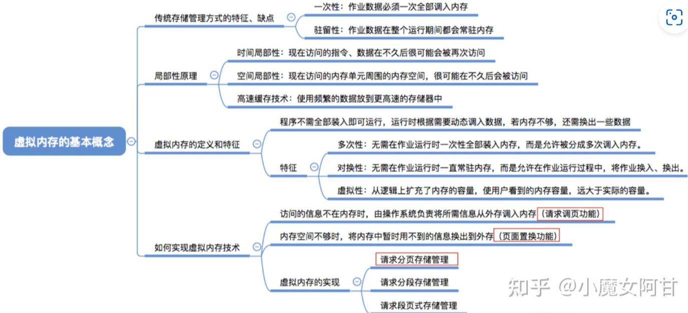

#### 2.8 虚拟内存

  * 传统存储管理方式的特征/缺点
    * 一次性: 作业数据必须一次全部调入内存
    * 驻留性: 作业数据在整个运行期间都会常驻内存
  * 局部性原理
    * 时间局部性: 现在访问的指令/数据在不久后很可能会被再次访问
    * 空间局部性:现在访问的内存单元周围的内存空间，很可能在不久后会被访问
    * 高速缓存技术: 使用频繁的数据放到更高速的存储器中
  * 虚拟内存的定义和特征
    * 程序不需全部装入即可运行，运行时根据需要动态调入数据，若内存不够，还需换出一些数据
    * 特征
      * 多次性:无需在作业运行时一次性全部装入内存，而是允许被分成多次调入内存。
      * 对换性:无需在作业运行时一直常驻内存，而是允许在作业运行过程中，将作业换入/换出。
      * 虚拟性: 从逻辑上扩充了内存的容量，使用户看到的内存容量，远大于实际的容量
  * 如何实现虑拟内存技术
    * 访问的信息不在内存时，由操作系统负责将所需信息从外存调入内存(请求调页功能)
    * 内存空间不够时，将内存中暂时用不到的信息换出到外存(页面置换功能)
  * 虚拟内存的实现
    * 请求分页式存储管理
    * 请求分段存储管理
    * 请求段页式存储管理
  * trivial
    * 易混知识点: 虚拟内存的最大容量是由计算机的地址结构(CPU寻址范围)确定的
    * 虚拟内存的实际容量 = min(内存和外存容量之和，CPU寻址范围 )

#### 2.11 虚拟内存

虚拟内存是操作系统中的一种内存管理技术，它通过将物理内存和磁盘空间结合起来，为每个进程提供一个比实际物理内存更大的虚拟地址空间。虚拟内存的主要目的是提高内存的利用率和系统的并发性能。虚拟内存的实现通常包括以下几个步骤：

1. **地址空间管理**：操作系统为每个进程分配一个独立的虚拟地址空间，通过页表等机制将虚拟地址映射到物理地址。

2. **内存分配与回收**：操作系统根据进程的需求动态分配和回收内存，确保内存的高效利用。

3. **页面置换**：当物理内存不足时，操作系统将部分不常用的页面换出到磁盘，以腾出空间给当前需要的页面。

4. **内存保护**：虚拟内存技术本身就提供了内存保护的功能，确保每个进程只能访问自己的内存空间。

# 虚拟内存

虚拟内存的目的是为了让物理内存扩充成更大的逻辑内存，从而让程序获得更多的可用内存。

为了更好的管理内存，操作系统将内存抽象成地址空间。每个程序拥有自己的地址空间，这个地址空间被分割成多个块，每一块称为一页。这些页被映射到物理内存，但不需要映射到连续的物理内存，也不需要所有页都必须在物理内存中。当程序引用到不在物理内存中的页时，由硬件执行必要的映射，将缺失的部分装入物理内存并重新执行失败的指令。

从上面的描述中可以看出，虚拟内存允许程序不用将地址空间中的每一页都映射到物理内存，也就是说一个程序不需要全部调入内存就可以运行，这使得有限的内存运行大程序成为可能。例如有一台计算机可以产生 16 位地址，那么一个程序的地址空间范围是 0\~64K。该计算机只有 32KB 的物理内存，虚拟内存技术允许该计算机运行一个 64K 大小的程序。

  
 
