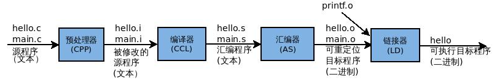

## 编译过程与原理

### 1. 编译过程 - 编译器在做什么？

如果想要机器按照我们的设想执行我们的命令，我们需要一个能够跟机器沟通的方式，而这种方式也就是==机器语言(第一代计算机语言)==，一堆`01`构成的指令。我们需要事先设计好指令集到机器上，比如说规定好从某寄存器阅读值的指令为什么。

可这种方式面临的第一个问题就是，不同机器之间指令集不一致，比如说DSP和ARM在实现加法上，可能就会出现不同寄存器的调用方法。那很显然就会设想出一种统一的语言，即==汇编语言(第二代计算机语言)==。而汇编实现的只是将`01`等机器码指令使用一个统一的命名，如`ADD`而已。令所有机器指令集可与汇编语言转换即可。

汇编语言仍存在很多问题，主要表现为阅读性极差、开发难度大、开发周期长、移植问题没有彻底解决。因此也就出现了==高级语言(第三代语言)==，在汇编语言的基础上实现了抽象，避免了繁琐寄存器的操作。

那源代码(高级语言)是如何让计算机理解的呢？其步骤是？

* 如果源代码在操作系统上：源代码生成汇编代码，再通过汇编和链接方式形成可执行文件，然后通过加载器加载到操作系统执行。
* 如果源代码在虚拟机(解释器)上：源代码生成中间代码(人可以直接理解的，而汇编则认为人无法理解)，如字节码等。

在Linux系统下，可用以下指令完成源程序到目标程序的转化：

> gcc -o hello hello.c main.c

gcc 编译器驱动程序读取源文件hello.c和main.c，经过预处理、编译、汇编、链接（分别使用预处理器、编译器、汇编器、链接器，这四个程序构成了编译系统）四个步骤，将其翻译成可执行目标程序hello。如下图所示： 



#### 1.1 预处理

预处理器(CPP)根据源程序中以字符”#”开头的命令，修改源程序，得到另一个源程序，常以.i作为文件扩展名。修改主要包括#include、#define和条件编译三个方面。

> gcc -o main.i -E main.c

预处理只是对源文件进行了扩展，得到的仍然是C语言源程序。

#### 1.2 编译

编译程序所要作得工作就是通过词法分析和语法分析，在确认所有的指令都符合语法规则之后，将其翻译成等价的中间代码表示或汇编代码。

编译器(CCL)将经过预处理器处理得到的文本文件hello.i和main.i翻译成hello.s与main.s，其中包含了汇编语言程序，汇编语言程序以一种标准的文本格式确切描述一条低级机器语言指令。 
 运行以下命令进行编译：

> gcc -S main.i hello.i

##### 1.2.1 编译过程


#### 1.3 汇编

汇编器(AS)将hello.s和main.s翻译成机器语言指令，并打包成可重定位目标程序，一般以.o为文件扩展名。可重定位目标程序是二进制文件，它的字节编码是机器语言指令而不是字符。 
 运行以下指令可得到重定位目标程序main.o和hello.o：

> gcc -c main.s hello.s

用文本编辑器打开main.o和hello.o发现文件是乱码，因为此时已经是二进制文件。

#### 1.4 链接

链接程序(LD）将main.o和hello.o以及一些其他必要的目标文件组合起来，创建可执行目标文件。

> gcc -o hello main.o hello.o

得到可执行程序hello. 
 在终端运行./hello，程序加载并运行.

根据开发人员指定的同库函数的链接方式的不同，链接处理可分为两种： 

* 静态链接 
  在这种链接方式下，函数的代码将从其所在的静态链接库中被拷贝到最终的可执行程序中。这样该程序在被执行时这些代码将被装入到该进程的虚拟地址空间中。静态链接库实际上是一个目标文件的集合，其中的每个文件含有库中的一个或者一组相关函数的代码。 
* 动态链接 
  在此种方式下，函数的代码被放到称作是动态链接库或共享对象的某个目标文件中。链接程序此时所作的只是在最终的可执行程序中记录下共享对象的名字以及其它少量的登记信息。在此可执行文件被执行时，动态链接库的全部内容将被映射到运行时相应进程的虚地址空间。动态链接程序将根据可执行程序中记录的信息找到相应的函数代码。 
   对于可执行文件中的函数调用，可分别采用动态链接或静态链接的方法。使用动态链接能够使最终的可执行文件比较短小，并且当共享对象被多个进程使用时能节约一些内存，因为在内存中只需要保存一份此共享对象的代码。但并不是使用动态链接就一定比使用静态链接要优越。在某些情况下动态链接可能带来一些性能上损害。

[动态链接](https://kshttps0.wiz.cn/ks/note/view/2336be1c-7b66-490d-91e0-240081977c3d/e730f0ac-0a19-4994-8f7f-1355d3c86eec/#动态链接)
[动态库的编译](https://kshttps0.wiz.cn/ks/note/view/2336be1c-7b66-490d-91e0-240081977c3d/e730f0ac-0a19-4994-8f7f-1355d3c86eec/#动态库的编译)


#### 编译链接和载入

* 编译：将预处理生成的文件，经过**语法分析、词法分析、语义分析、以及优化后编译成若干个目标模块**。可以理解为将高级语言翻译为计算机可以理解的二进制代码，即机器语言
* 链接：由链接程序将编译后形成的**一组目标模块**以及他们所需要的**库函数**链接在一起，形成一个完整的**载入模型**。链接主要解决**模块间的相互引用问题**，分为**地址和空间分配**，**符号解析**和**重定位**几个步骤。**在编译阶段生成目标文件时，会暂时搁置这些外部引用**，而这些外部引用就是在链接时确定的，链接器在链接时，会**根据符号名称去相应模块中寻找对应的符号**，**待符号确定后，链接器会重写之前哪些未确定的符号的地址**，这个过程就是重定位
* 载入：由载入程序将载入模块载入内存

#### 动态链接和静态链接的区别

* 静态链接以一组可重定位目标文件为输入，文件由各种不同的代码和数据节组成，通过符号解析和重定位生成一个完全链接的可以加载和运行的可执行文件
* 静态链接有一些明显的缺点，**一是如果需要更新一个库，需要重新编译和链接库文件**。二是对于一些标准的函数，**如果将这些代码复制到每个程序运行的文本段中，会对存储器的资源造成很大的浪费**
* 共享库就是为解决静态链接问题而生，共享库是一个目标模块。在运行时，可以加载到任意存储器地址，并和一个在存储器中的程序链接起来。这个过程称为动态链接。共享库在unix下通常使用.so后缀，window下为dll
* 共享库使用两种方式共享，一是一个库只有一个so文件，**所有引用该库的执行程序共享这个文件的代码和数据**。**二是一个共享库的.text节的一个副本可以被不同的进程共享**
* 注意在整个程序的链接过程中，**链接器只是拷贝了一些重定位和符号信息**。**在程序加载（execve）时才会解析so文件中代码和数据的引用**

#### 动态库和静态库的创建与使用

* 库的名字由 lib+name+后缀，静态库的后缀为.a 动态库的后缀为.so 

* 动态库的创建步骤

  * 将.c文件全部编译为.o文件

  * 在Shell下输入命令，创建动态库：

    ```shell
    gcc -shared –fPIC –o libname.so sourcefile.c
    -shared 该选项指定生成动态连接库（让连接器生成T类型的导出符号表，有时候也生成弱连接W类型的导出符号），不用该标志外部程序无法连接。相当于一个可执行文件
    -fPIC：表示编译为位置独立的代码，不用此选项的话编译后的代码是位置相关的所以动态载入时是通过代码拷贝的方式来满足不同进程的需要，而不能达到真正代码段共享的目的
    ```

  * 使用动态库

    ```shell
    gcc -o file file.c -L. -lname
    -L.：表示要链接的库在当前目录中
    ```

  * **动态链接时、执行时搜索路径顺序**

    * 编译目标代码时，`-L`指定的动态库搜索路径
    * 环境变量`LD_LIBRARY_PATH`指定的动态库搜索路径
    * 配置文件`/etc/ld.so.conf`中指定的动态库搜索路径
    * 默认的动态库搜索路径`/lib`，`/usr/lib`

* 静态库的创建步骤

  * 将.c文件全部编译为.o文件

  * 在Shell下输入命令，创建静态库： 

    ```shell
    ar rcs libname.a 目标文件1 目标文件2...
    ```

* 使用静态库

  ```shell
   gcc  -o file file.c –L. -lname 
   # -L 为静态库路径 
   # -l 为是链接到库的名字（可以简写库的名字）
  ```

* **静态库链接时搜索路径顺序**

  * ld会去找GCC命令中的参数`-L`

  * 再找gcc的环境变量`LIBRARY_PATH`
  * 再找内定目录 `/lib`，`/usr/lib`， `/usr/local/lib` 这是当初compile gcc时写在程序内的

#### gcc和g++的异同

* 均属于the GNU Compiler Collection，gcc是鼻祖，后来才有了g++

  ```c++
  g++ == gcc -xc++ -lstdc++ -shared-libgcc	// gcc后面两项都是链接选项，表示g++要相比gcc链接其他库函数
  ```

* 不同

  * **g++会自动链接C++标准库**，比如algorithm，string，vector等

  * gcc会根据文件后缀(.c,.cpp)自动识别是C文件还是C++文件，g++均认为是C++文件

  * gcc编译C文件少很多宏定义，gcc编译C++会多一些宏定义

    ```c
    #define __GXX_WEAK__ 1
    #define __cplusplus 1
    #define __DEPRECATED 1
    #define __GNUG__ 4
    #define __EXCEPTIONS 1
    #define __private_extern__ extern
    ```

