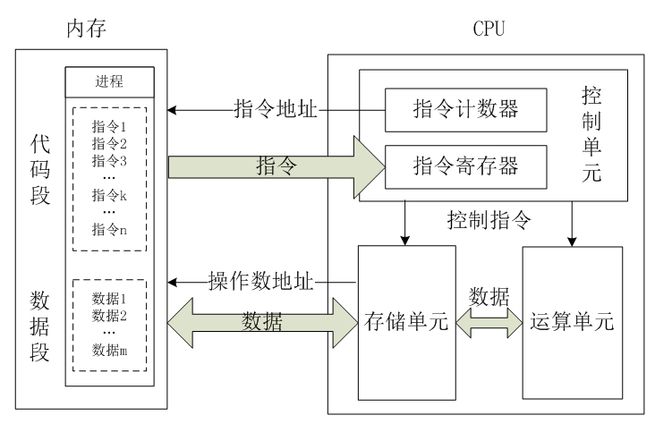

## CPU工作原理

### 1. 导言

* ***CPU是什么以及做什么，结构是怎么样的？***
* ***CPU的指令集有哪些？一条指令是怎么运行的？***
* ***CPU流水线架构是什么***

本文从以上关键问题出发，首先明白CPU是什么，以及其组成；然后了解其基本工作原理；再关注一下为了性能提升而设计的流水线架构。

### 2. CPU基本概念

#### 2.1 ***CPU是什么？做什么？***

* CPU也叫做中央处理器，是一台计算机的运算核心和控制核心。CPU会从内存读取出运行的指令，然后根据这些指令去运行，做运算做控制等。过程可以分为以下几个关键阶段：

  `取码->译码->执行->写回、标记指令完成`

  

  

#### 2.2 ***CPU的结构是怎么样的？***

* ***CPU的主要三大单元模块***

  * 控制单元：

    * 程序计数器
    * 指令寄存器
    * 指令译码器
    * 操作控制器

    它根据用户预先编好的程序，依次从存储器中取出各条指令，放在指令寄存器IR中，通过指令译码(分析)确定应该进行什么操作，然后通过操作控制器OC，按确定的时序，向相应的部件发出微操作控制信号。操作控制器OC中主要包括节拍脉冲发生器、控制矩阵、时钟脉冲发生器、复位电路和启停电路等控制逻辑。

  * 存储单元

    包括CPU片内缓存和寄存器组，是CPU中暂时存放数据的地方，里面保存着那些等待处理的数据，或已经处理过的数据，CPU访问寄存器所用的时间要比访问内存的时间短。采用寄存器，可以减少CPU访问内存的次数，从而提高了CPU的工作速度。

  * 运算单元

    根据控制单元传过来的指令去执行算数（加减乘除等等）和逻辑运算（与或非等等）运算。

* ***其他需要了解的子模块***

  * **时钟**

    CPU本质上是电路，而电路就有同步和异步电路之路，简单来说同步电路都是用统一哥时钟；异步电路有多个时钟；

    而目前商用CPU基本都是同步电路，也就有一个统一的时钟。

    * ***时钟有什么用呢？***

      > 为什么 CPU 需要时钟才能工作？ - 刘一墨的回答 - 知乎
      > https://www.zhihu.com/question/21981280/answer/2659095195

      简单来说，数值的上升沿读入，其他时间保持，就是寄存器。因为有了寄存器，保证了逻辑运算的时候，输入的1和0是稳定的，不是变化的。这就是时钟的基本作用。

  * **中断**

    上面的讨论其实只是限于CPU执行一段给定的程序的，可如果我这时候鼠标动了一下，我希望CPU能够立刻响应我这一个操作，CPU是怎么处理的呢？

    * ***中断寄存器如何工作的***

      中断寄存器应该是在控制单元的，在执行完指令之后，CPU会去查看中断寄存器的操作，然后跳转到中断处理程序。

      > 这个问题有点难找到官方回答，以下是个人推测可能的实现。
      >
      > 以鼠标为例子，会有配套的驱动程序，然后鼠标运动的时候，会产生一个信号，这个信号会写到中断寄存器，包括中断信号标记置1，以及中断信号类型等两个主要数据。
      >
      > CPU执行完指令周期之后，会首先看中断信号标记是否为1，然后根据中断信号类型，去执行相关由驱动程序决定的**中断程序**。
      >
      > 当然在执行**中断程序**的时候，会保存之前的上下文。在完成中断程序之后，再恢复上下文，然后继续执行。

    * ***软件也能产生中断***

      因为中断本质上中断寄存器某个针脚为1了，而硬件等外设可以直接触发他，那我能不能写一个程序，然后把这个寄存器置为1呢？这种通过软件模拟硬件中断的方式，叫做软件中断。

    * ***软件中断有那些***

      笼统地可以分为两类，主动的和被动的。主动的如信号，甚至乎printf也是，因为printf是让外设显示文字的，而外设相关的大多都是中断。

      被动的如异常、内存越界等等

    * ***多个中断同时产生会怎么样？***

      > 这个问题有点难找到官方回答，以下是个人推测可能的实现。
      >
      > 会有一个缓存空间，存储并发的中断，根据中断优先级先执行，所以如果电脑卡的时候，经常会感受到输入一段文字了，但是显示器过一会才显示，这就是因为输入的中断比显示的中断优先处理。

### 3. CPU的指令集

#### 3.1 ***CPU的指令集有哪些***

* ***RISC-精简指令集***

  * **优点：**
    * 结构简单，易于设计
    * 便于实现流水线架构

* ***CISC-复杂指令集***

  * **优点：**
    * 指令丰富、功能超大 一条指令往往顶得上很多条RISC指令

  * **缺点：**
    * 不便于流水线

* **总结：**

  因为大部分时候都是80%的时间跑20%的指令，因此RISC是有一定道理的，而且RISC流水线也便于设计，在下面一节会具体展开。但是毕竟CISC一条指令能顶很多条CISC指令，甚至乎有一些硬件的优化。RISC再做优化，也不太可能再从精简入手，还是优化硬件，再添加指令嘛。所以两者有融合的趋势。所以不需要太在意了。

#### 3.2 ***常见指令***

* ***指令有那些***

  * 常见指令

    就是算数、比较、跳转、移位、访问存储器等等

  * 复杂运算指令

    浮点运算、并行计算等等

  * 多媒体应用

    视频编解码等等。

* ***总结***

  也是大概了解以下就行了。

  

### ==4. CPU的流水线架构==

> 待完成

