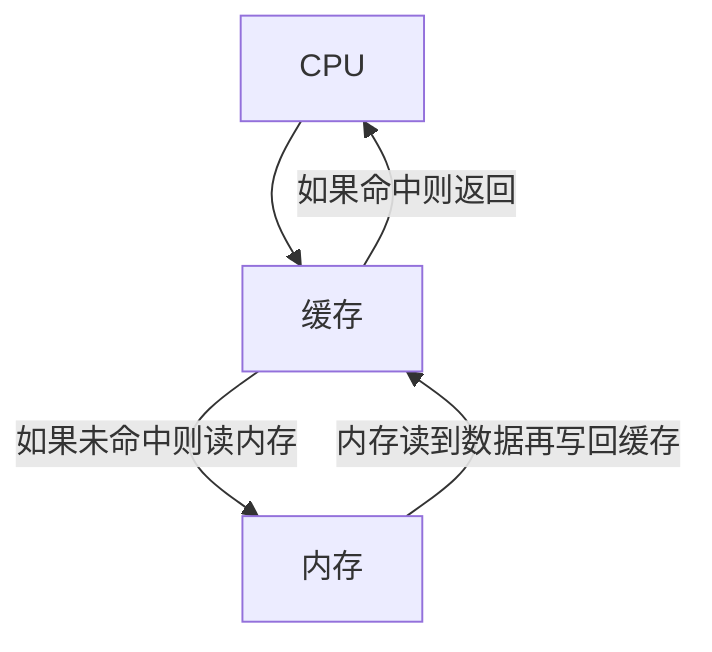

## 缓存

缓存技术是计算机系统中用于提高数据访问速度的关键组件。本文将从缓存的定义、组成、工作原理以及如何提高缓存命中率等方面进行详细阐述，旨在帮助读者深入理解缓存的作用和原理。

### 1. 缓存概述

缓存是一种使用SRAM技术的存储器，其主要作用是缓解CPU与内存之间工作频率差异导致的性能瓶颈。通过牺牲一定的存储容量，缓存大幅提升了数据的IO读写速度。

#### 存储技术对比

- **SRAM（静态随机存取存储器）**：主要用于缓存，由六个晶体管组成，读写速度快，容量小，成本高，且断电后数据丢失。
- **DRAM（动态随机存取存储器）**：主要用于内存，由一个二极管和一个电容构成，读写速度较快，容量较大，成本相对较低，同样断电后数据丢失。
- **ROM（只读存储器）**：主要用于硬盘，读写速度最慢，容量最大，成本最低，断电后数据不丢失。

### 2. 缓存的组成与设计

缓存系统通常采用分级设计，包括L1、L2和L3缓存。

#### L1缓存

- **指令缓存（I-Cache）**：存储指令代码。
- **数据缓存（D-Cache）**：存储数据。

#### L2缓存

- **统一缓存**：不区分指令和数据。

#### L3缓存

- **多核心共享**：由多个核心共享使用。

#### 分级设计的原因

L1缓存采用分离设计，以减少取指令单元和取数据单元的竞争。L2缓存采用统一设计，以提高缓存利用率，避免数据缓存满而指令缓存空的情况。

#### L3缓存的共享机制

L3缓存早期位于CPU芯片外，称为片外缓存。随着集成技术的发展，L3缓存被集成到芯片内部，减少了传输距离，提高了传输效率。

### 3. 缓存工作原理

缓存工作的基本原理基于时间局部性和空间局部性两个核心概念。时间局部性指一个数据被访问后，近期可能再次被访问。空间局部性指一个数据被访问后，其附近的数据也可能被访问。基于这两个原则，CPU在首次访问数据时，会将数据及其附近的数据一起保存到缓存中，以提高后续访问速度。

#### CPU、缓存和内存的工作流程

#### 内存地址到缓存地址的映射

CPU根据内存地址访问数据，通过映射关系将内存地址转换为缓存地址。映射方式包括直接映射、全相联映射、组相联映射等。

### 4. MESI协议

MESI协议是一种用于多处理器系统中的缓存一致性协议，包括Modified、Exclusive、Shared和Invalid四个状态。

#### MESI协议的工作原理

- **M(修改)**：本地处理器已修改缓存行，是脏行，内容与内存不一致。
- **E(专有)**：缓存行内容与内存一致，其他处理器没有此数据。
- **S(共享)**：缓存行内容与内存一致，可能其他处理器也有此缓存行的拷贝。
- **I(无效)**：缓存行失效，不能使用。

MESI协议确保当一个处理器修改了缓存行中的数据时，其他所有处理器的缓存行中的相同数据都会被更新或标记为无效，以保持数据一致性。

### 5. 缓存优化策略

提高缓存命中率是缓存管理的关键目标。

#### CPU缓存优化

- **代码优化**：编写符合时间局部性和空间局部性原则的代码，如按行优先遍历二维数组。
- **多进程任务**：考虑绑定核心以优化缓存使用。

#### 应用层面缓存优化（以Redis为例）

- **合理选择缓存对象**：选择高频访问、低频写入的数据。
- **更新策略**：采用LRU等算法更新缓存。
- **预热**：在系统启动初期加载可能需要的数据。
- **小缓存粒度**：避免大粒度缓存导致的低命中率和数据失效问题。
- **扩容**：采用分布式缓存解决单机缓存容量限制。

### 6. 总结

缓存技术通过减少CPU与内存之间的速度差异，显著提高了系统的数据处理速度。理解缓存的工作原理和优化策略对于设计高性能计算机系统至关重要。

### line-----------------------------------------
# 磁盘结构与调度算法

磁盘作为计算机系统中用于存储数据的硬件设备，其结构和调度算法对数据存取效率有着重要影响。本文将详细介绍磁盘的结构组成以及磁盘调度算法的原理和优化方法。

## 磁盘结构

磁盘是由多个精密部件组成的存储设备，其结构对于理解磁盘操作至关重要。

- **盘面（Platter）**：磁盘由多个盘面组成，类似于唱片的结构。
- **磁道（Track）**：盘面上的圆形带状区域，每个盘面可以有多个磁道。
- **扇区（Track Sector）**：磁道上的一个弧段，是最小的物理存储单位，通常有512 bytes和4 K两种大小。
- **磁头（Head）**：非常接近盘面，负责将盘面上的磁场转换为电信号（读取）或将电信号转换为盘面的磁场（写入）。
- **制动手臂（Actuator Arm）**：用于在磁道之间移动磁头，以访问不同的磁道。
- **主轴（Spindle）**：使整个盘面转动，从而移动到需要读取或写入的扇区。

## 磁盘调度算法

磁盘调度算法的目标是减少磁盘的平均寻道时间，提高数据存取效率。以下是几种常见的磁盘调度算法：

### 1. 先来先服务（FCFS, First Come First Served）

按照磁盘请求的顺序进行调度，这是一种最简单的调度策略。

- **优点**：公平且易于实现。
- **缺点**：未对寻道进行优化，可能导致平均寻道时间较长。

### 2. 最短寻道时间优先（SSTF, Shortest Seek Time First）

优先调度与当前磁头所在磁道距离最近的磁道，以减少寻道时间。

- **优点**：平均寻道时间较低。
- **缺点**：可能导致饥饿现象，即远端磁道的请求可能长时间得不到服务。

### 3. 电梯算法（SCAN）

电梯算法，也称为扫描算法，模拟电梯运行方式，在一个方向上顺序处理请求，直到该方向上没有更多请求，然后改变方向。

- **优点**：解决了SSTF的饥饿问题，确保所有请求最终都会被处理。
- **缺点**：在某些情况下可能不如SSTF高效，特别是在请求分布不均匀的情况下。

## 磁盘调度算法的优化

为了进一步提高磁盘调度算法的效率，可以考虑以下优化策略：

- **请求合并**：将多个小的磁盘请求合并为一个大的请求，减少寻道次数。
- **请求排序**：根据请求的位置对请求进行排序，以减少寻道距离。
- **动态调整**：根据实时数据访问模式动态调整调度策略。

## 总结

磁盘结构和调度算法是影响磁盘性能的关键因素。了解这些原理和策略有助于我们设计更高效的存储系统。随着技术的发展，新的磁盘调度算法和优化技术也在不断涌现，以适应日益增长的数据存储和访问需求。

### line ----------------------------------------------------------

原子变量（Atomic Variables）是指在多线程环境下，对其操作是原子性的，即不可分割的。这意味着当一个线程在修改原子变量时，其他线程不能同时进行修改，这样可以避免竞态条件和数据不一致的问题。原子变量的实现原理通常依赖于硬件支持的原子指令和编译器内存屏障（Memory Barrier）的合理使用。

以下是原子变量实现的一些关键点：

### 1. 硬件支持的原子指令

现代处理器提供了一些原子指令，这些指令可以保证某些操作的原子性。例如：

- **CMPXCHG**：比较并交换指令，用于实现原子的比较和设置操作。
- **XCHG**：交换指令，用于实现简单的原子交换操作。
- **LOCK**：一个前缀，用于在x86架构上确保紧随其后的指令是原子执行的。
- **Load-Acquire** 和 **Store-Release**：这些指令分别确保数据的加载和存储操作对其他处理器可见，它们是实现原子操作的一部分。

### 2. 内存屏障（Memory Barrier）

内存屏障（也称为内存栅栏）是一种CPU指令，它确保屏障之前的所有操作完成后才执行屏障之后的操作。内存屏障可以防止编译器和处理器对指令重排序。

- **Load Barrier**：加载屏障，确保所有在屏障前的读操作完成后，才执行屏障后的读操作。
- **Store Barrier**：存储屏障，确保所有在屏障前的写操作完成后，才执行屏障后的写操作。
- **Full Barrier**：全屏障，同时具有加载屏障和存储屏障的功能。

### 3. 原子操作的实现

原子操作通常通过组合上述硬件支持的原子指令和内存屏障来实现。以下是一些常见的原子操作及其实现原理：

- **原子读/写**：直接通过处理器的原子指令来保证读/写操作的原子性。
- **原子比较并设置（CAS）**：使用CMPXCHG指令实现，它允许只有一个线程能成功地将变量更新为新值，如果值匹配，则替换为新值，否则不做更改。
- **原子增加/减少**：可以通过XCHG指令或者ADD指令配合LOCK前缀来实现。
- **原子交换（Swap）**：通过XCHG指令实现，直接交换两个值。

### 4. 避免伪共享

在多核处理器系统中，多个核心可能共享同一缓存行。如果原子变量频繁地被不同的核心访问和修改，就可能发生伪共享（False Sharing），这会导致缓存一致性流量增加，降低性能。为了避免伪共享，可以在原子变量周围添加填充（Padding），使得每个核心访问的变量在不同的缓存行中。

### 5. 平台无关性

为了实现跨平台的原子操作，一些编程语言和库提供了平台无关的原子操作接口。例如，C++11标准库中的`std::atomic`，Java中的`java.util.concurrent.atomic`包，它们在底层会根据不同的平台和处理器架构选择合适的原子指令和内存屏障。

总结来说，原子变量的实现依赖于硬件提供的原子指令和内存屏障，通过这些机制来保证在多线程环境中的操作是安全的、不可分割的。
