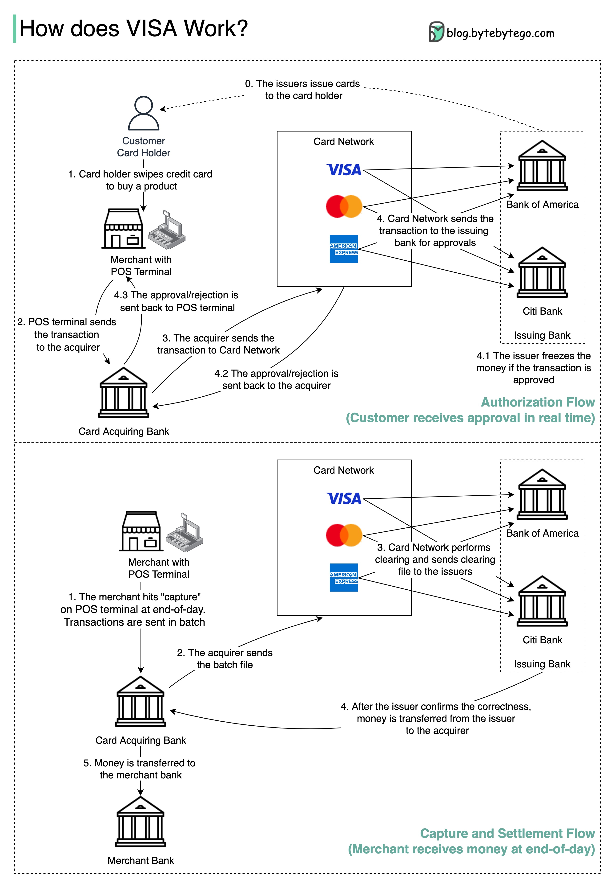

## 支付系统

### 如何学习支付系统？

  

### 为什么信用卡被称为“银行中最赚钱的产品”？VISA/Mastercard 如何赚钱？

下图展示了信用卡支付流程的经济学。

  

1.&nbsp;&nbsp;持卡人支付商家 $100 购买产品。

2.&nbsp;商家通过使用信用卡获得更高的销售额，需要补偿发卡行和卡网络提供支付服务。收单行与商家设定一个费用，称为“商户折扣费”。

3 - 4. 收单行保留 $0.25 作为收单加价，$1.75 支付给发卡行作为交换费。商户折扣费应覆盖交换费。

  交换费由卡网络设定，因为每个发卡行与每个商家单独协商费用效率较低。

5.&nbsp;&nbsp;卡网络与每个银行设定网络评估和费用，每月支付卡网络的服务费用。例如，VISA 对每次刷卡收取 0.11% 的评估费，加上 $0.0195 的使用费。

6.&nbsp;&nbsp;持卡人支付发卡行的服务费用。

为什么发卡行需要补偿？

- 即使持卡人未能支付给发卡行，发卡行也会支付给商家。
- 发卡行在持卡人支付之前支付给商家。
- 发卡行还有其他运营成本，包括管理客户账户、提供账单、欺诈检测、风险管理、清算与结算等。

### 当我们在商店刷信用卡时，VISA 如何工作？

  

VISA、Mastercard 和 American Express 作为卡网络，负责资金的清算和结算。收单行和发卡行可以是不同的银行，通常也是不同的。如果银行之间没有中介逐笔结算交易，每个银行都必须与所有其他银行结算交易。这非常低效。

下图展示了 VISA 在信用卡支付过程中的角色。涉及两个流程。当客户刷信用卡时发生授权流程。当商家在一天结束时想要收款时发生捕获和结算流程。

- 授权流程

步骤 0：发卡行向其客户发放信用卡。

步骤 1：持卡人想要购买产品，并在商店的销售点（POS）终端刷信用卡。

步骤 2：POS 终端将交易发送给提供 POS 终端的收单行。

步骤 3 和 4：收单行将交易发送给卡网络（也称为卡方案）。卡网络将交易发送给发卡行进行批准。

步骤 4.1、4.2 和 4.3：如果交易被批准，发卡行冻结资金。批准或拒绝信息返回给收单行以及 POS 终端。

- 捕获和结算流程

步骤 1 和 2：商家在一天结束时想要收款，因此在 POS 终端上点击“捕获”。交易以批处理方式发送给收单行。收单行将包含交易的批处理文件发送给卡网络。

步骤 3：卡网络对从不同收单行收集的交易进行清算，并将清算文件发送给不同的发卡行。

步骤 4：发卡行确认清算文件的正确性，并将资金转移给相关的收单行。

步骤 5：收单行然后将资金转移给商家的银行。

步骤 4：卡网络清算来自不同收单行的交易。清算是一个相互抵消交易的过程，从而减少总交易数量。

在此过程中，卡网络承担与每个银行沟通的负担，并因此获得服务费用。

### 世界各地的支付系统系列（第 1 部分）：印度的统一支付接口（UPI）

什么是 UPI？UPI 是由印度国家支付公司开发的即时实时支付系统。

它目前占印度数字零售交易的 60%。

UPI = 支付标记语言 + 互操作支付标准

  

