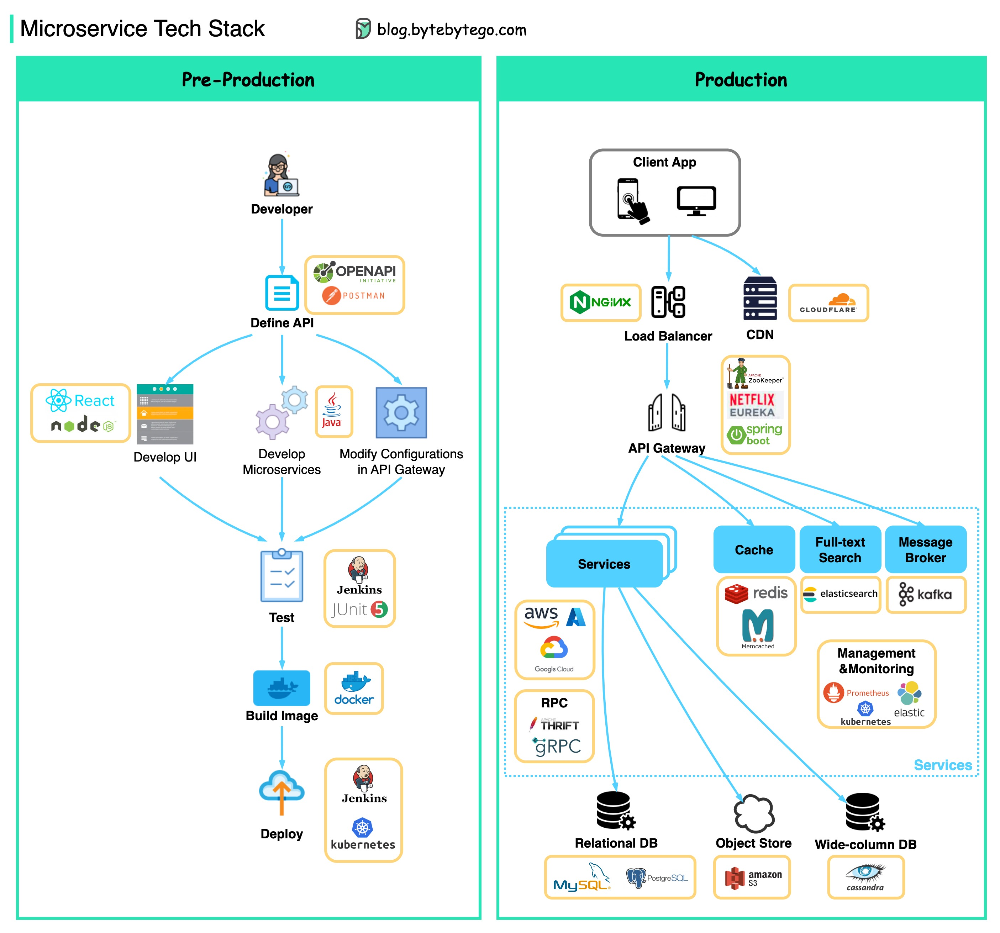
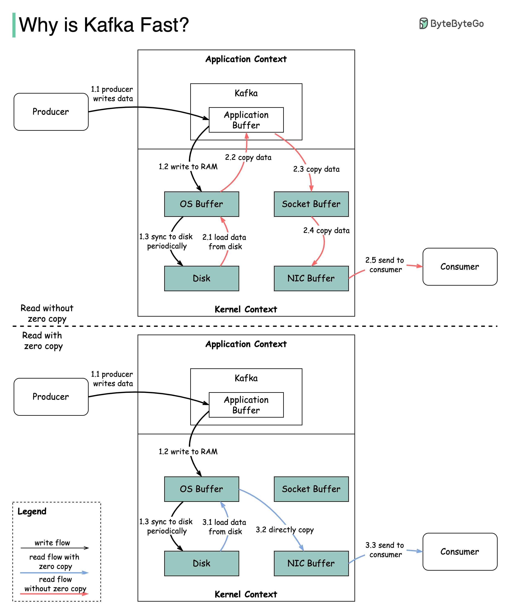

## 微服务架构

### 典型的微服务架构是什么样的？

  

下图展示了一个典型的微服务架构。

- 负载均衡器：分配传入的流量到多个后端服务。
- CDN（内容分发网络）：CDN 是一组地理上分布的服务器，保存静态内容以加快交付速度。客户端首先在 CDN 中查找内容，然后再访问后端服务。
- API 网关：处理传入请求并将其路由到相关服务。它与身份提供者和服务发现进行通信。
- 身份提供者：处理用户的身份验证和授权。
- 服务注册与发现：微服务的注册和发现发生在这个组件中，API 网关在这个组件中查找相关服务进行通信。
- 管理：负责监控服务的组件。
- 微服务：微服务在不同的领域中设计和部署。每个领域都有自己的数据库。API 网关通过 REST API 或其他协议与微服务通信，同一领域内的微服务通过 RPC（远程过程调用）相互通信。

微服务的优点：

- 可以快速设计、部署和水平扩展。
- 每个领域可以由专门的团队独立维护。
- 每个领域的业务需求可以定制和更好地支持。

### 微服务最佳实践

一图胜千言：开发微服务的 9 个最佳实践。

  

开发微服务时，我们需要遵循以下最佳实践：

1. 为每个微服务使用独立的数据存储
2. 保持代码在相似的成熟度水平
3. 为每个微服务单独构建
4. 为每个微服务分配单一职责
5. 部署到容器中
6. 设计无状态服务
7. 采用领域驱动设计
8. 设计微前端
9. 编排微服务

### 微服务常用的技术栈是什么？

下图展示了微服务技术栈，包括开发阶段和生产阶段。

  

▶️ 预生产阶段

- 定义 API：建立前端和后端之间的契约。我们可以使用 Postman 或 OpenAPI 来实现。
- 开发：Node.js 或 React 是前端开发的热门选择，Java/Python/Go 是后端开发的热门选择。此外，我们需要根据 API 定义更改 API 网关中的配置。
- 持续集成：使用 JUnit 和 Jenkins 进行自动化测试。代码打包成 Docker 镜像并作为微服务部署。

▶️ 生产阶段

- 负载均衡器：NGinx 是常见的选择。Cloudflare 提供 CDN（内容分发网络）。
- API 网关：我们可以使用 Spring Boot 作为网关，并使用 Eureka/Zookeeper 进行服务发现。
- 微服务部署在云上。我们可以选择 AWS、Microsoft Azure 或 Google GCP。
- 缓存和全文搜索：Redis 是缓存键值对的常见选择。Elasticsearch 用于全文搜索。
- 通信：服务之间的通信可以使用消息基础设施 Kafka 或 RPC。
- 持久化：我们可以使用 MySQL 或 PostgreSQL 作为关系数据库，使用 Amazon S3 作为对象存储。如果需要，还可以使用 Cassandra 作为宽列存储。
- 管理与监控：管理众多微服务的常用运维工具包括 Prometheus、Elastic Stack 和 Kubernetes。

### 为什么 Kafka 快

Kafka 的性能得益于许多设计决策。在本文中，我们将重点讨论两个最重要的设计决策。

  

1. 第一个是 Kafka 对顺序 I/O 的依赖。
2. 第二个设计选择是 Kafka 的效率：零拷贝原则。

图示说明了数据在生产者和消费者之间的传输方式，以及零拷贝的含义。

- 步骤 1.1 - 1.3：生产者将数据写入磁盘
- 步骤 2：消费者读取数据，无零拷贝

2.1 数据从磁盘加载到操作系统缓存

2.2 数据从操作系统缓存复制到 Kafka 应用程序

2.3 Kafka 应用程序将数据复制到套接字缓冲区

2.4 数据从套接字缓冲区复制到网卡

2.5 网卡将数据发送给消费者

- 步骤 3：消费者读取数据，使用零拷贝

3.1 数据从磁盘加载到操作系统缓存

3.2 操作系统缓存通过 sendfile() 命令直接将数据复制到网卡

3.3 网卡将数据发送给消费者

零拷贝是一种在应用程序上下文和内核上下文之间节省多次数据复制的捷径。