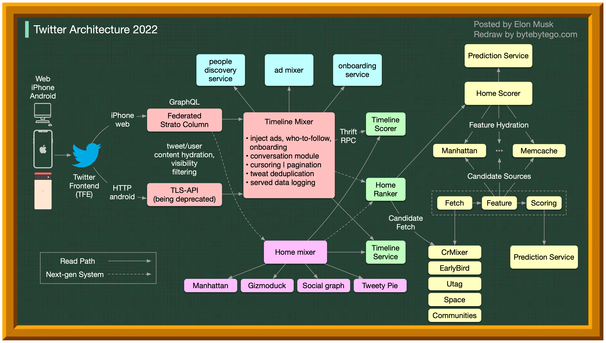

## 系统设计

### 1. 导语

系统设计通常需要考虑以下四个关键要素：

1. **场景（Scenario）**
   - 明确系统的 QPS（每秒请求数，特别是峰值时间的请求数）。这与我们设计的系统规模和架构密切相关。如果请求频率非常低，一个 Web 服务器可能就足够了；如果请求频率很高，则需要构建一个 Web 服务器集群，并且需要考虑部分服务器宕机时如何保持系统的可靠性。

2. **服务（Service）**
   - 根据任务需求，细分主要功能模块。明确每个模块的职责和边界，以便于系统的开发、维护和扩展。

3. **存储（Storage）**
   - 选择合适的存储结构和数据库。根据数据的特性和访问模式，选择关系型数据库、NoSQL 数据库或其他存储解决方案，以满足系统的性能和扩展需求。

4. **扩展性（Scale）**
   - 从优化的角度出发，添加新的功能以提升系统性能。
   - 从维护的角度出发，确保系统能够应对更大的流量和容灾需求。常见的扩展性措施包括：
     - **缓存（Cache）**：使用缓存技术减少数据库访问次数，提高系统响应速度。
     - **消息队列（Kafka 等）**：使用消息队列实现异步处理，提升系统的吞吐量和可靠性。
     - **负载均衡（Load Balancing）**：使用负载均衡技术分发请求，确保系统的高可用性和稳定性。

### 2. 具体场景设计

#### 2.1 Netflix 的技术栈

本文基于对 Netflix 工程博客和开源项目的研究。如果您发现任何不准确之处，请随时告知我们。


* **移动端和网页端**：
    Netflix 采用 Swift 和 Kotlin 构建原生移动应用程序。对于其网页应用程序，使用 React。
* **前端/服务器通信**：
    Netflix 使用 GraphQL。
* **后端服务**：
    Netflix 依赖 ZUUL、Eureka、Spring Boot 框架等技术。
* **数据库**：
    Netflix 使用 EV cache、Cassandra、CockroachDB 等数据库。
* **消息传递/流处理**：
    Netflix 使用 Apache Kafka 和 Flink 进行消息传递和流处理。
* **视频存储**：
    Netflix 使用 S3 和 Open Connect 进行视频存储。
* **数据处理**：
    Netflix 使用 Flink 和 Spark 进行数据处理，并使用 Tableau 进行可视化。Redshift 用于处理结构化数据仓库信息。
* **CI/CD**：
    Netflix 使用 JIRA、Confluence、PagerDuty、Jenkins、Gradle、Chaos Monkey、Spinnaker、Atlas 等工具进行 CI/CD 过程。

#### 2.2 Twitter 架构

是的，这是真实的 Twitter 架构。由 Elon Musk 发布，并由我们重新绘制以提高可读性。
  


#### 2.3 Airbnb 微服务架构的演变

Airbnb 的微服务架构经历了三个主要阶段。


* **单体架构（2008 - 2017）**
    Airbnb 起初是一个简单的市场平台，连接房东和房客。这个平台是基于 Ruby on Rails 构建的单体应用。
    **挑战**：   
      - 团队所有权混乱 + 无人维护的代码
      - 部署速度慢

* **微服务架构（2017 - 2020）**
    微服务架构旨在解决上述挑战。在微服务架构中，关键服务包括：
    - 数据获取服务
    - 业务逻辑数据服务
    - 写入工作流服务
    - UI 聚合服务
    - 每个服务都有一个负责的团队
    **挑战**：
      - 数百个服务和依赖关系难以管理

* **微 + 宏服务架构（2020 - 至今）**
    这是 Airbnb 目前正在使用的架构。微服务和宏服务的混合模型侧重于 API 的统一。

#### 2.4 如何设计 Stack Overflow 网站？

如果你的答案是本地服务器和单体架构（如下图所示），你可能会在面试中失败，但这实际上是它的构建方式！


**人们认为它应该是什么样子**
    面试官可能期望如下图所示的上半部分。
  - 使用微服务将系统分解为小组件。
  - 每个服务都有自己的数据库。大量使用缓存。
  - 服务是分片的。
  - 服务通过消息队列异步通信。
  - 服务使用事件溯源和 CQRS 实现。
  - 展示分布式系统的知识，如最终一致性、CAP 定理等。

**实际情况**
    Stack Overflow 仅使用 9 台本地 Web 服务器处理所有流量，并且是单体架构！它有自己的服务器，不运行在云上。
    这与我们现在的流行观念相反。

#### 2.5 为什么 Amazon Prime Video 监控从无服务器架构迁移到单体架构？如何节省 90% 的成本？
下图显示了迁移前后的架构对比。
  

Prime Video 服务需要监控数千个直播流的质量。监控工具自动实时分析流并识别质量问题，如块损坏、视频冻结和同步问题。这是确保客户满意度的重要过程。

监控过程分为三个步骤：媒体转换器、缺陷检测器和实时通知。

* **旧架构的问题**
    旧架构基于 Amazon Lambda，非常适合快速构建服务。然而，在大规模运行时，它并不具有成本效益。最昂贵的两个操作是：
  1. 编排工作流 - AWS 步骤函数按状态转换收费，而编排每秒执行多个状态转换。
  2. 分布式组件之间的数据传递 - 中间数据存储在 Amazon S3 中，以便下一阶段下载。当数据量很大时，下载成本很高。

* **单体架构节省 90% 成本**
    单体架构旨在解决成本问题。仍然有三个组件，但媒体转换器和缺陷检测器部署在同一进程中，节省了通过网络传递数据的成本。令人惊讶的是，这种部署架构的变化导致了 90% 的成本节省！

    这是一个有趣且独特的案例研究，因为微服务已成为技术行业的流行选择。我们需要更多关于架构演变的讨论，并更诚实地讨论其优缺点。将组件分解为分布式微服务是有成本的。

* **Amazon 领导者的观点**
    Amazon CTO Werner Vogels：“构建**可演化的软件系统**是一种策略，而不是宗教。以开放的心态重新审视你的架构是必须的。”
    前 Amazon 副总裁 Adrian Cockcroft：“Prime Video 团队遵循了一条我称之为**无服务器优先**的路径……我不提倡**仅无服务器**。”

#### 2.6 Disney Hotstar 如何在比赛期间捕获 50 亿个表情符号？

LinkedIn 采用了类似的设计，每秒流传输一百万个点赞。


  1. 客户端通过标准 HTTP 请求发送表情符号。可以将 Golang 服务视为典型的 Web 服务器。选择 Golang 是因为它支持并发性好。Golang 中的线程是轻量级的。
  2. 由于写入量非常大，使用 Kafka（消息队列）作为缓冲区。
  3. 表情符号数据由名为 Spark 的流处理服务聚合。它每 2 秒聚合一次数据，这个间隔是可配置的。需要在间隔时间上做出权衡。较短的间隔意味着表情符号更快地传递给其他客户端，但也意味着需要更多的计算资源。
  4. 聚合的数据写入另一个 Kafka。
  5. PubSub 消费者从 Kafka 中拉取聚合的表情符号数据。
  6. 表情符号通过 PubSub 基础设施实时传递给其他客户端。PubSub 基础设施很有趣。Hotstar 考虑了以下协议：Socketio、NATS、MQTT 和 gRPC，最终选择了 MQTT。


#### 2.7 Discord 如何存储万亿条消息

下图显示了 Discord 消息存储的演变：
 


MongoDB ➡️ Cassandra ➡️ ScyllaDB

2015 年，Discord 的第一个版本建立在单个 MongoDB 副本之上。到 2015 年 11 月，MongoDB 存储了 1 亿条消息，RAM 无法再容纳数据和索引，延迟变得不可预测。消息存储需要迁移到另一个数据库。选择了 Cassandra。

2017 年，Discord 拥有 12 个 Cassandra 节点，存储了数十亿条消息。

到 2022 年初，Discord 拥有 177 个节点，存储了数万亿条消息。此时，延迟变得不可预测，维护操作变得过于昂贵。

问题的原因有几个：

- Cassandra 使用 LSM 树作为内部数据结构。读取比写入更昂贵。服务器上可能有许多并发读取，导致热点问题。
- 维护集群（如压缩 SSTables）会影响性能。
- 垃圾收集暂停会导致显著的延迟峰值。

ScyllaDB 是一个兼容 Cassandra 的数据库，用 C++ 编写。Discord 重新设计了其架构，采用了单体 API、用 Rust 编写的数据服务和基于 ScyllaDB 的存储。

在 ScyllaDB 中，p99 读取延迟为 15 毫秒，而在 Cassandra 中为 40-125 毫秒。p99 写入延迟为 5 毫秒，而在 Cassandra 中为 5-70 毫秒。

#### 2.8 视频直播如何在 YouTube、TikTok live 或 Twitch 上工作？

直播与常规流媒体不同，因为视频内容是通过互联网实时发送的，通常延迟只有几秒钟。

下图解释了实现这一目标的幕后工作。
  


1. 捕获原始视频数据：
    原始视频数据由麦克风和摄像头捕获。数据发送到服务器端。

2. 压缩和编码视频数据：
    视频数据被压缩和编码。例如，压缩算法将背景和其他视频元素分离。压缩后，视频被编码为 H.264 等标准。此步骤后，视频数据的大小大大减小。

3. 将编码数据分割成小段：
    编码数据被分割成较小的段，通常以秒为单位，因此下载或流传输所需的时间大大减少。

4. 将分段数据发送到流媒体服务器：
    流媒体服务器需要支持不同的设备和网络条件。这称为“自适应比特率流”。这意味着我们需要在步骤 2 和 3 中生成多个不同比特率的文件。

5. 将直播数据推送到由 CDN 支持的边缘服务器：
    数百万观众可以从附近的边缘服务器观看视频。CDN 显著降低了数据传输延迟。

6. 观众设备解码和解压视频数据：
    观众设备解码和解压视频数据，并在视频播放器中播放视频。

7.  如果需要存储视频以供重播：
    如果需要存储视频以供重播，编码数据会发送到存储服务器，观众可以稍后请求重播。

    标准的直播协议包括：
    - RTMP（实时消息传递协议）：最初由 Macromedia 开发，用于在 Flash 播放器和服务器之间传输数据。现在用于通过互联网流传输视频数据。请注意，视频会议应用程序如 Skype 使用 RTC（实时通信）协议以降低延迟。
    - HLS（HTTP 实时流）：需要 H.264 或 H.265 编码。Apple 设备仅接受 HLS 格式。
    - DASH（动态自适应流传输）：DASH 不支持 Apple 设备。
    - HLS 和 DASH 都支持自适应比特率流。


## 如何理解 mvc 架构?

### 1. concepts

#### 1.1 什么是 mvc 架构

MVC（Model-View-Controller）是一种软件架构模式，广泛应用于开发用户界面应用程序。它将应用程序分为三个主要部分：模型（Model）、视图（View）和控制器（Controller）。这种分离有助于组织代码，提高可维护性和可扩展性。

- **模型（Model）**
  模型是应用程序的核心部分，负责处理应用程序的数据逻辑。模型直接管理数据、逻辑和规则。它通常与数据库交互，执行数据的创建、读取、更新和删除（CRUD）操作。

主要职责：

- 处理和管理数据。
- 执行业务逻辑。
- 与数据库或其他数据源交互。

* **视图（View）**
  视图是用户界面部分，负责显示数据。视图从模型中获取数据，并将其呈现给用户。视图不包含任何业务逻辑，只负责数据的展示。

主要职责：

- 显示数据。
- 提供用户交互界面。

* **控制器（Controller）**
  控制器是应用程序的中介部分，负责处理用户输入。控制器从视图接收输入，处理这些输入并更新模型或视图。控制器将用户的动作转换为对模型的操作，并决定哪个视图来显示数据。

主要职责：

- 处理用户输入。
- 调用模型更新数据。
- 选择视图来显示数据。

* **MVC 工作流程**

1. 用户通过视图与应用程序交互（例如，点击按钮、输入数据）。
2. 控制器接收用户输入，并调用模型来处理数据。
3. 模型更新数据后，通知视图数据已更新。
4. 视图从模型获取最新数据，并将其呈现给用户。

#### 1.2 mvc 架构有什么好处？

mvc 是实现解耦的一种手段，所以 mvc 的好处就是解耦的好处，如分离关注点，提升可维护性，提升扩展性，提上可测试性等等。

#### 1.3 qt 是怎么体现 mvc 架构的？

#### qt 中的 mvc 分别是通过哪些类来体现的

在 Qt 中,MVC(Model-View-Controller)架构是通过以下几类主要的类来体现的:

1. 模型(Model):Qt 提供了`QAbstractItemModel`类作为所有模型类的基类.你可以通过继承`QAbstractItemModel`或其子类(如`QStandardItemModel`/`QSortFilterProxyModel`等)来创建自己的模型类.

2. 视图(View):Qt 提供了多种视图类,如`QListView`/`QTableView`/`QTreeView`等,它们都继承自`QAbstractItemView`类.这些视图类可以用来显示模型中的数据.

3. 控制器(Controller):在 Qt 中,控制器的功能通常由视图类和模型类共同实现.例如,视图类会处理用户的输入事件,并将这些事件转化为对模型的操作.此外,Qt 还提供了`QItemSelectionModel`类来管理用户在视图中的选择.

以下是一个简单的例子,展示了如何在 Qt 中使用 MVC 架构:

```cpp
// 创建模型
QStandardItemModel *model = new QStandardItemModel(5, 3);
for (int row = 0; row < 5; ++row) {
    for (int column = 0; column < 3; ++column) {
        QStandardItem *item = new QStandardItem(QString("row %0, column %1").arg(row).arg(column));
        model->setItem(row, column, item);
    }
}

// 创建视图
QTableView *view = new QTableView;
view->setModel(model);

// 创建选择模型
QItemSelectionModel *selectionModel = view->selectionModel();
connect(selectionModel, &QItemSelectionModel::selectionChanged,
        this, &MainWindow::updateSelection);

// ...

void MainWindow::updateSelection(const QItemSelection &selected, const QItemSelection &deselected)
{
    // handle selection changes
}
```

在这个例子中,我们首先创建了一个`QStandardItemModel`模型和一个`QTableView`视图,并将模型设置到视图中.然后,我们获取了视图的`QItemSelectionModel`,并连接了其`selectionChanged`信号,以便在用户的选择改变时更新界面.


将应用程序划分为三种组件,模型 - 视图 - 控制器(MVC)设计定义它们之间的相互作用.[[2\]](https://zh.wikipedia.org/wiki/MVC#cite_note-posa-2)

- **模型(Model)**

  ​	用于封装与应用程序的业务逻辑相关的数据以及对数据的处理方法." Model  "有对数据直接访问的权力,例如对数据库的访问."Model"不依赖"View"和"Controller",也就是说, Model  不关心它会被如何显示或是如何被操作.但是 Model 中数据的变化一般会通过一种刷新机制被公布.为了实现这种机制,那些用于监视此 Model 的 View 必须事先在此 Model 上注册,从而,View 可以了解在数据 Model 上发生的改变.(比如:[观察者模式](https://zh.wikipedia.org/wiki/观察者模式)([软件设计模式](https://zh.wikipedia.org/wiki/软件设计模式)))

- **视图(View)**

  ​	能够实现数据有目的的显示(理论上,这不是必需的).在 View 中一般没有程序上的逻辑.为了实现 View 上的刷新功能,View 需要访问它监视的数据模型(Model),因此应该事先在被它监视的数据那里注册.

- **控制器(Controller)**

  ​	起到不同层面间的组织作用,用于控制应用程序的流程.它处理事件并作出响应."事件"包括用户的行为和数据 Model 上的改变.

MVC模式在概念上强调 Model, View, Controller 的分离,各个模块也遵循着由 Controller  来处理消息,Model 掌管数据源,View 负责数据显示的职责分离原则,因此在实现上,MVC 模式的 Framework 通常会将 MVC  三个部分分离实现:

- Model 负责数据访问,较现代的 Framework 都会建议使用独立的数据对象 (DTO, POCO, POJO 等)  来替代弱类型的集合对象.数据访问的代码会使用 Data Access 的代码或是 ORM-based Framework,也可以进一步使用  Repository Pattern 与 Unit of Works Pattern 来切割数据源的相依性.
- View 负责显示数据,这个部分多为前端应用,而 Controller 会有一个机制将处理的结果 (可能是 Model,  集合或是状态等) 交给 View,然后由 View 来决定怎么显示.例如 Spring Framework 使用 JSP  或相应技术,ASP.NET MVC 则使用 Razor 处理数据的显示.
- Controller 负责处理消息,较高端的 Framework 会有一个默认的实现来作为 Controller 的基础,例如  Spring 的 DispatcherServlet 或是 ASP.NET MVC 的 Controller 等,在职责分离原则的基础上,每个  Controller 负责的部分不同,因此会将各个 Controller 切割成不同的文件以利维护.

### MVC, MVP, MVVM, MVVM-C, and VIPER
These architecture patterns are among the most commonly used in app development, whether on iOS or Android platforms. Developers have introduced them to overcome the limitations of earlier patterns. So, how do they differ? 

<p>
  
</p>

- MVC, the oldest pattern, dates back almost 50 years 
- Every pattern has a "view" (V) responsible for displaying content and receiving user input 
- Most patterns include a "model" (M) to manage business data 
- "Controller," "presenter," and "view-model" are translators that mediate between the view and the model ("entity" in the VIPER pattern)
