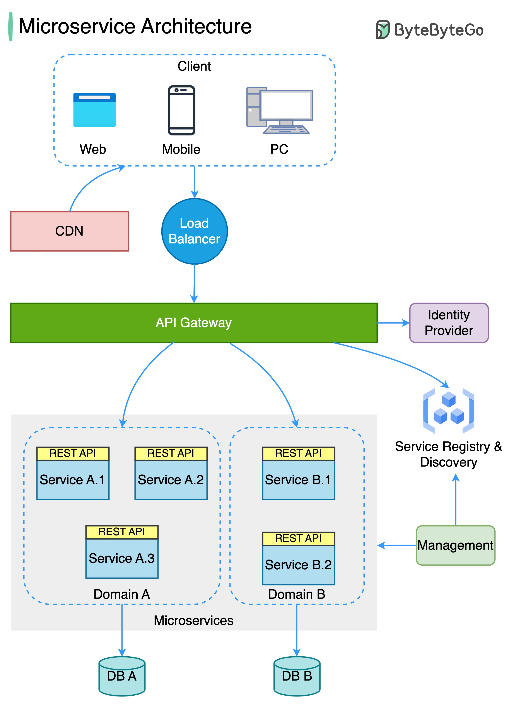
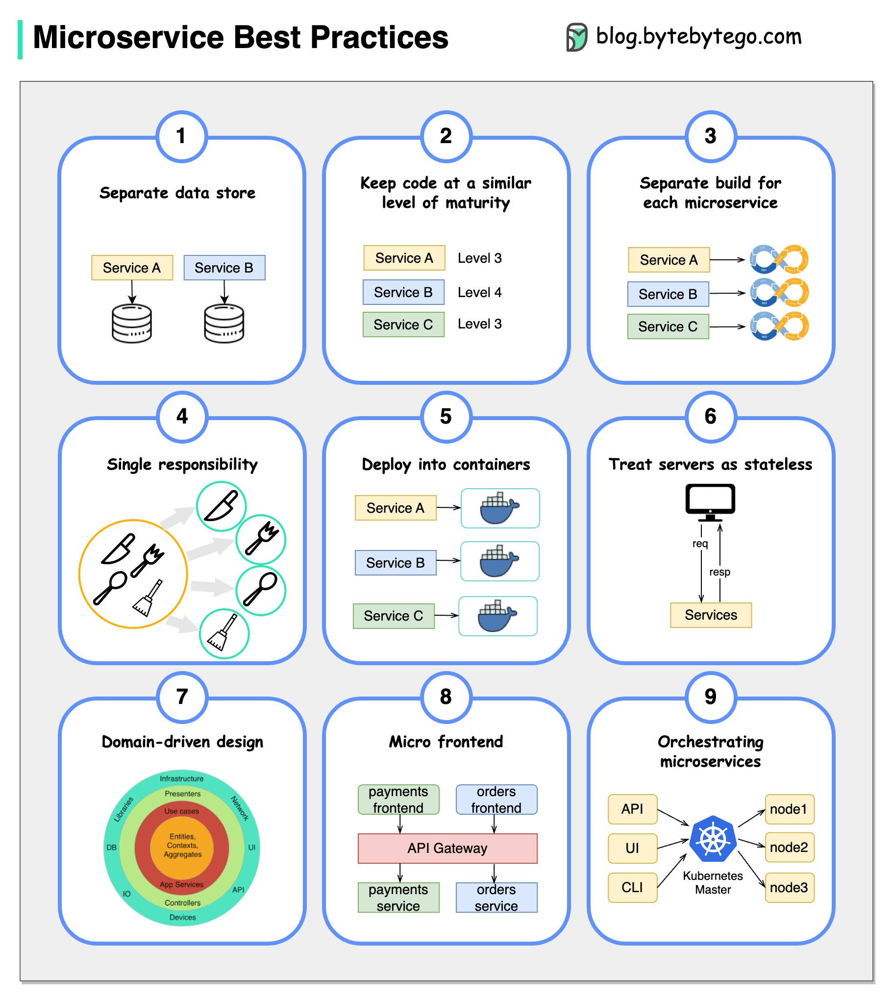

# N 层架构

N 层架构将应用程序分为逻辑层和物理层。层是一种分离职责和管理依赖关系的方法。每一层都有特定的职责。较高层可以使用较低层的服务，但反之则不行。


层是物理上分离的，运行在不同的机器上。一层可以直接调用另一层，或者使用异步消息传递。尽管每一层可能托管在自己的层中，但这不是必须的。多个层可以托管在同一层中。物理上分离层可以提高可扩展性和弹性，但也增加了额外的网络通信延迟。

N 层架构可以分为两种类型：

- 在封闭层架构中，一层只能调用紧接其下的一层。
- 在开放层架构中，一层可以调用其下的任何一层。

封闭层架构限制了层之间的依赖关系。然而，如果一层只是将请求传递给下一层，可能会产生不必要的网络流量。

## N 层架构的类型

让我们看看一些 N 层架构的例子：

### 3 层架构

3 层架构广泛使用，包含以下不同的层：

- **表示层**：处理用户与应用程序的交互。
- **业务逻辑层**：接受来自应用层的数据，根据业务逻辑进行验证并将其传递给数据层。
- **数据访问层**：接收来自业务层的数据，并在数据库上执行必要的操作。

### 2 层架构

在这种架构中，表示层运行在客户端，并与数据存储通信。没有业务逻辑层或客户端和服务器之间的中间层。

### 单层或 1 层架构

这是最简单的一种，相当于在个人计算机上运行应用程序。应用程序运行所需的所有组件都在单个应用程序或服务器上。

## 优点

以下是使用 N 层架构的一些优点：

- 可以提高可用性。
- 更好的安全性，因为层可以充当防火墙。
- 独立的层允许我们根据需要进行扩展。
- 提高维护性，因为不同的人可以管理不同的层。

## 缺点

以下是 N 层架构的一些缺点：

- 增加了系统的整体复杂性。
- 随着层数的增加，网络延迟增加。
- 成本高，因为每一层都有自己的硬件成本。
- 难以管理网络安全。

# 消息代理

消息代理是一种软件，使应用程序、系统和服务能够相互通信和交换信息。消息代理通过在正式消息传递协议之间翻译消息来实现这一点。这使得相互依赖的服务可以直接“对话”，即使它们是用不同的语言编写的或在不同的平台上实现的。


消息代理可以验证、存储、路由和传递消息到适当的目的地。它们充当其他应用程序之间的中介，使发送者可以在不知道接收者位置、是否活跃或数量的情况下发送消息。这促进了系统内进程和服务的解耦。

## 模型

消息代理提供两种基本的消息分发模式或消息传递风格：

- **[点对点消息传递](https://karanpratapsingh.com/courses/system-design/message-queues)**：这是消息队列中使用的分发模式，消息的发送者和接收者之间是一对一的关系。
- **[发布-订阅消息传递](https://karanpratapsingh.com/courses/system-design/publish-subscribe)**：在这种消息分发模式中，通常称为“发布-订阅”模式，消息的生产者将消息发布到一个主题，多个消息消费者订阅他们想要接收消息的主题。

_我们将在后续教程中详细讨论这些消息传递模式。_

## 消息代理 vs 事件流

消息代理可以支持两种或更多的消息传递模式，包括消息队列和发布-订阅，而事件流平台仅提供发布-订阅风格的分发模式。事件流平台设计用于处理高容量的消息，易于扩展。它们能够将记录流排序到称为“主题”的类别中，并将其存储一段预定的时间。然而，与消息代理不同，事件流平台不能保证消息传递或跟踪哪些消费者已经接收了消息。

事件流平台提供比消息代理更高的可扩展性，但在确保故障容忍（如消息重发）方面的功能较少，消息路由和队列功能也更有限。

## 消息代理 vs 企业服务总线 (ESB)

[企业服务总线 (ESB)](https://karanpratapsingh.com/courses/system-design/enterprise-service-bus) 基础设施复杂，集成困难且维护成本高。在生产环境中出现问题时，排查问题也很困难，扩展不易，更新繁琐。

而消息代理是 ESB 的“轻量级”替代方案，提供类似的功能，即服务间通信机制，但成本更低。它们非常适合在 [微服务架构](https://karanpratapsingh.com/courses/system-design/monoliths-microservices#microservices) 中使用，随着 ESB 的失宠，微服务架构变得越来越普遍。

## 示例

以下是一些常用的消息代理：

- [NATS](https://nats.io)
- [Apache Kafka](https://kafka.apache.org)
- [RabbitMQ](https://www.rabbitmq.com)
- [ActiveMQ](https://activemq.apache.org)

# 消息队列

消息队列是一种服务间通信形式，促进异步通信。它异步接收来自生产者的消息并将其发送给消费者。

队列用于在大规模分布式系统中有效管理请求。在处理负载较小和数据库较小的小型系统中，写入速度可以预测得很快。然而，在更复杂和大型的系统中，写入可能需要几乎不可预测的时间。


## 工作原理

消息存储在队列中，直到它们被处理和删除。每条消息只由一个消费者处理一次。其工作原理如下：

- 生产者将任务发布到队列，然后通知用户任务状态。
- 消费者从队列中取出任务，处理它，然后发出任务完成的信号。

## 优点

让我们讨论使用消息队列的一些优点：

- **可扩展性**：消息队列使我们可以精确地扩展所需的部分。当工作负载高峰时，我们的应用程序的多个实例可以将所有请求添加到队列中，而不会发生冲突的风险。
- **解耦**：消息队列消除了组件之间的依赖关系，显著简化了解耦应用程序的实现。
- **性能**：消息队列支持异步通信，这意味着生产者和消费者与队列交互，而不是彼此交互。生产者可以将请求添加到队列中，而无需等待它们被处理。
- **可靠性**：队列使我们的数据持久化，并减少了系统不同部分离线时发生的错误。

## 特性

现在，让我们讨论消息队列的一些期望特性：

### 推送或拉取传递

大多数消息队列提供推送和拉取两种选项来检索消息。拉取意味着不断查询队列以获取新消息。推送意味着当有消息可用时，消费者会收到通知。我们还可以使用长轮询，让拉取等待指定时间以等待新消息到达。

### 先进先出 (FIFO) 队列

在这些队列中，最早（或第一个）进入的条目，有时称为队列的“头”，最先被处理。

### 调度或延迟传递

许多消息队列支持为消息设置特定的传递时间。如果我们需要为所有消息设置一个通用的延迟，可以设置一个延迟队列。

### 至少一次传递

消息队列可以存储消息的多个副本以实现冗余和高可用性，并在通信失败或错误时重新发送消息，以确保它们至少被传递一次。

### 精确一次传递

当不能容忍重复时，FIFO（先进先出）消息队列将确保每条消息只被传递一次（且仅一次），通过自动过滤重复消息。

### 死信队列

死信队列是其他队列可以发送无法成功处理的消息的队列。这使得可以将它们放在一边进行进一步检查，而不会阻塞队列处理或在可能永远无法成功消费的消息上花费 CPU 周期。

### 排序

大多数消息队列提供尽力而为的排序，确保消息按发送顺序传递，并且每条消息至少被传递一次。

### 毒丸消息

毒丸消息是可以接收但无法处理的特殊消息。它们是一种机制，用于通知消费者结束其工作，使其不再等待新输入，类似于在客户端/服务器模型中关闭套接字。

### 安全性

消息队列将对尝试访问队列的应用程序进行身份验证，这使我们能够在网络上传输消息以及在队列本身中加密消息。

### 任务队列

任务队列接收任务及其相关数据，运行它们，然后传递结果。它们可以支持调度，并可用于在后台运行计算密集型作业。

## 背压

如果队列开始显著增长，队列大小可能会超过内存，导致缓存未命中、磁盘读取和性能下降。背压可以通过限制队列大小来帮助，保持高吞吐率和队列中作业的良好响应时间。一旦队列填满，客户端会收到服务器忙或 HTTP 503 状态码，提示稍后重试。客户端可以稍后重试请求，可能使用[指数退避](https://en.wikipedia.org/wiki/Exponential_backoff)策略。

## 示例

以下是一些广泛使用的消息队列：

- [Amazon SQS](https://aws.amazon.com/sqs)
- [RabbitMQ](https://www.rabbitmq.com)
- [ActiveMQ](https://activemq.apache.org)
- [ZeroMQ](https://zeromq.org)

# 发布-订阅

与消息队列类似，发布-订阅也是一种服务间通信形式，促进异步通信。在发布-订阅模型中，发布到主题的任何消息都会立即推送给该主题的所有订阅者。


消息主题的订阅者通常执行不同的功能，可以并行地对消息做不同的处理。发布者不需要知道谁在使用它广播的信息，订阅者也不需要知道消息的来源。这种消息传递风格与消息队列有所不同，消息队列中的组件通常知道它发送消息的目的地。

## 工作原理

与消息队列不同，消息主题几乎不进行排队，立即将消息推送给所有订阅者。其工作原理如下：

- 消息主题提供一种轻量级机制，用于广播异步事件通知，并提供端点，使软件组件能够连接到主题以发送和接收这些消息。
- 要广播消息，称为发布者的组件只需将消息推送到主题。
- 所有订阅该主题的组件（称为订阅者）将接收每条广播的消息。

## 优点

让我们讨论使用发布-订阅的一些优点：

- **消除轮询**：消息主题允许即时、基于推送的传递，消除了消息消费者定期检查或“轮询”新信息和更新的需要。这促进了更快的响应时间，并减少了延迟，这在不能容忍延迟的系统中特别有问题。
- **动态目标**：发布-订阅使服务的发现更容易、更自然且更不容易出错。发布者只需将消息发布到主题，而不是维护一个可以发送消息的对等体列表。然后，任何感兴趣的方将其端点订阅到主题，并开始接收这些消息。订阅者可以更改、升级、增加或消失，系统会动态调整。
- **解耦和独立扩展**：发布者和订阅者是解耦的，彼此独立工作，这使我们能够独立开发和扩展它们。
- **简化通信**：发布-订阅模型通过移除所有点对点连接并用单个连接到消息主题替代，减少了复杂性，消息主题将管理订阅并决定哪些消息应传递到哪些端点。

## 特性

现在，让我们讨论发布-订阅的一些期望特性：

### 推送传递

发布-订阅消息传递在消息发布到消息主题时立即推送异步事件通知。订阅者在有消息可用时会收到通知。

### 多种传递协议

在发布-订阅模型中，主题通常可以连接到多种类型的端点，如消息队列、无服务器函数、HTTP 服务器等。

### 扇出

当消息发送到主题，然后复制并推送到多个端点时，就会发生这种情况。扇出提供异步事件通知，从而允许并行处理。

### 过滤

此功能使订阅者能够创建消息过滤策略，以便只接收感兴趣的通知，而不是接收发布到主题的每条消息。

### 持久性

发布-订阅消息服务通常提供非常高的持久性，并通过在多个服务器上存储相同消息的副本，至少一次传递。

### 安全性

消息主题对尝试发布内容的应用程序进行身份验证，这使我们能够使用加密端点并在网络上传输消息时加密消息。

## 示例

以下是一些常用的发布-订阅技术：

- [Amazon SNS](https://aws.amazon.com/sns)
- [Google Pub/Sub](https://cloud.google.com/pubsub)

# 企业服务总线 (ESB)

企业服务总线 (ESB) 是一种架构模式，其中一个集中化的软件组件执行应用程序之间的集成。它执行数据模型的转换、处理连接、执行消息路由、转换通信协议，并可能管理多个请求的组合。ESB 可以将这些集成和转换作为服务接口提供，以供新应用程序重用。


## 优点

理论上，集中化的 ESB 提供了标准化和显著简化企业内服务之间通信、消息传递和集成的潜力。以下是使用 ESB 的一些优点：

- **提高开发人员生产力**：使开发人员能够将新技术集成到应用程序的一部分，而无需触及应用程序的其他部分。
- **更简单、更具成本效益的可扩展性**：组件可以独立于其他组件进行扩展。
- **更高的弹性**：一个组件的故障不会影响其他组件，每个微服务可以遵循自己的可用性要求，而不会影响系统中其他组件的可用性。

## 缺点

虽然 ESB 在许多组织中成功部署，但在许多其他组织中，ESB 被视为瓶颈。以下是使用 ESB 的一些缺点：

- 对一个集成进行更改或增强可能会破坏使用相同集成的其他集成。
- 单点故障可能会导致所有通信中断。
- ESB 的更新通常会影响现有集成，因此执行任何更新都需要进行大量测试。
- ESB 是集中管理的，这使得跨团队协作具有挑战性。
- 高配置和维护复杂性。

## 示例

以下是一些广泛使用的企业服务总线 (ESB) 技术：

- [Azure Service Bus](https://azure.microsoft.com/en-in/services/service-bus)
- [IBM App Connect](https://www.ibm.com/in-en/cloud/app-connect)
- [Apache Camel](https://camel.apache.org)
- [Fuse ESB](https://www.redhat.com/en/technologies/jboss-middleware/fuse)

# 单体和微服务

## 单体

单体是一个自包含且独立的应用程序。它作为一个单元构建，不仅负责特定任务，还可以执行满足业务需求所需的每一步。


### 优点

以下是单体的一些优点：

- 开发或调试简单。
- 快速且可靠的通信。
- 易于监控和测试。
- 支持 ACID 事务。

### 缺点

单体的一些常见缺点是：

- 随着代码库的增长，维护变得困难。
- 应用程序紧密耦合，难以扩展。
- 需要承诺使用特定的技术栈。
- 每次更新时，整个应用程序都需要重新部署。
- 可靠性降低，因为一个错误可能导致整个系统崩溃。
- 难以扩展或采用新技术。

## 模块化单体

模块化单体是一种方法，我们构建和部署一个单一的应用程序（这是单体部分），但我们以一种将代码分解为独立模块的方式构建它，每个模块对应应用程序所需的功能。

这种方法减少了模块之间的依赖性，使我们可以在不影响其他模块的情况下增强或更改一个模块。如果做得好，从长远来看，这可以非常有益，因为它减少了随着系统增长而维护单体的复杂性。

## 微服务

微服务架构由一组小型的、自主的服务组成，每个服务都是自包含的，并且应该在一个有界上下文中实现单一的业务能力。有界上下文是业务逻辑的自然划分，提供了一个明确的边界，域模型存在于其中。


每个服务都有一个独立的代码库，可以由一个小型开发团队管理。服务可以独立部署，团队可以在不重新构建和重新部署整个应用程序的情况下更新现有服务。

服务负责持久化自己的数据或外部状态（每个服务一个数据库）。这与传统模型不同，传统模型中一个单独的数据层处理数据持久化。

### 特点

微服务架构风格具有以下特点：

- **松耦合**：服务应该是松耦合的，以便它们可以独立部署和扩展。这将导致开发团队的去中心化，从而使他们能够在最小的约束和操作依赖下更快地开发和部署。
- **小而专注**：这是关于范围和职责，而不是大小，服务应该专注于特定问题。基本上，“它做一件事，并且做得很好”。理想情况下，它们可以独立于底层架构。
- **为业务构建**：微服务架构通常围绕业务能力和优先级组织。
- **弹性和容错**：服务应该设计为在发生故障或错误时仍能正常工作。在独立可部署服务的环境中，容错性至关重要。
- **高度可维护**：服务应该易于维护和测试，因为无法维护的服务将被重写。

### 优点

以下是微服务架构的一些优点：

- 松耦合的服务。
- 服务可以独立部署。
- 对多个开发团队高度敏捷。
- 提高容错性和数据隔离。
- 更好的可扩展性，因为每个服务可以独立扩展。
- 消除了对特定技术栈的长期承诺。

### 缺点

微服务架构带来了自己的一些挑战：

- 分布式系统的复杂性。
- 测试更困难。
- 维护成本高（单独的服务器、数据库等）。
- 服务间通信有其自身的挑战。
- 数据完整性和一致性。
- 网络拥塞和延迟。

### 最佳实践

让我们讨论一些微服务的最佳实践：

- 围绕业务领域建模服务。
- 服务应该具有松耦合和高功能内聚。
- 隔离故障并使用弹性策略防止服务内的故障蔓延。
- 服务应该仅通过设计良好的 API 进行通信。避免泄露实现细节。
- 数据存储应该是私有的，由拥有数据的服务管理。
- 避免服务之间的耦合。耦合的原因包括共享数据库模式和刚性通信协议。
- 去中心化一切。各个团队负责设计和构建服务。避免共享代码或数据模式。
- 使用[断路器](https://karanpratapsingh.com/courses/system-design/circuit-breaker)快速失败以实现容错。
- 确保 API 更改向后兼容。

### 陷阱

以下是微服务架构的一些常见陷阱：

- 服务边界不是基于业务领域。
- 低估构建分布式系统的难度。
- 共享数据库或服务之间的共同依赖。
- 缺乏业务对齐。
- 缺乏明确的所有权。
- 缺乏幂等性。
- 尝试做所有事情[ACID 而不是 BASE](https://karanpratapsingh.com/courses/system-design/acid-and-base-consistency-models)。
- 缺乏容错设计可能导致级联故障。

## 警惕分布式单体

分布式单体是一个系统，它看起来像微服务架构，但在内部像单体应用程序一样紧密耦合。采用微服务架构有很多优点。但在构建过程中，我们很可能最终得到一个分布式单体。

如果我们的微服务符合以下任何一项，它们只是一个分布式单体：

- 需要低延迟通信。
- 服务不易扩展。
- 服务之间存在依赖关系。
- 共享相同的资源，如数据库。
- 系统紧密耦合。

构建微服务架构的主要原因之一是为了实现可扩展性。因此，微服务应该具有松耦合的服务，使每个服务都能独立运行。分布式单体架构剥夺了这一点，导致大多数组件相互依赖，增加了设计复杂性。

## 微服务与面向服务架构 (SOA)

你可能在互联网上看到过_面向服务架构 (SOA)_，有时甚至与微服务互换使用，但它们是不同的，两者之间的主要区别在于_范围_。

面向服务架构 (SOA) 定义了一种通过服务接口使软件组件可重用的方法。这些接口利用通用通信标准，专注于最大化应用服务的可重用性，而微服务则构建为各种最小独立服务单元，专注于团队自主性和解耦。

## 为什么你不需要微服务


所以，你可能会想，单体看起来一开始就是个坏主意，为什么还会有人使用它？

嗯，这取决于情况。虽然每种方法都有其优缺点，但在构建新系统时建议从单体开始。重要的是要理解，微服务不是万能的，它们解决的是组织问题。微服务架构不仅仅是关于技术，它还涉及到你的组织优先级和团队。

在决定转向微服务架构之前，你需要问自己一些问题，例如：

- _“团队是否太大，无法在共享代码库上有效工作？”_
- _“团队是否被其他团队阻碍？”_
- _“微服务是否为我们带来了明确的业务价值？”_
- _“我的业务是否成熟到可以使用微服务？”_
- _“我们当前的架构是否因通信开销而限制了我们？”_

如果你的应用程序不需要分解成微服务，那么你不需要这样做。并不是所有的应用程序都必须分解成微服务。

我们经常从像 Netflix 这样的公司及其使用微服务的方式中汲取灵感，但我们忽略了我们不是 Netflix。他们经历了许多迭代和模型，才有了一个市场就绪的解决方案，当他们识别并解决了他们试图解决的问题时，这种架构才对他们来说是可接受的。

这就是为什么深入了解你的业务_是否真的_需要微服务是至关重要的。我想说的是，微服务是复杂问题的解决方案，如果你的业务没有复杂问题，你就不需要它们。

# 事件驱动架构 (EDA)

事件驱动架构 (EDA) 是一种使用事件在系统内进行通信的方法。通常，利用消息代理异步发布和消费事件。发布者不知道谁在消费事件，消费者也不知道彼此。事件驱动架构只是实现系统内服务之间松耦合的一种方式。

## 什么是事件？

事件是表示系统中状态变化的数据点。它不指定应该发生什么以及变化应该如何修改系统，它只通知系统特定的状态变化。当用户执行某个操作时，他们会触发一个事件。

## 组件

事件驱动架构有三个关键组件：

- **事件生产者**：向路由器发布事件。
- **事件路由器**：过滤并将事件推送给消费者。
- **事件消费者**：使用事件来反映系统中的变化。


_注意：图中的点表示系统中的不同事件。_

## 模式

有几种实现事件驱动架构的方法，使用哪种方法取决于用例，但以下是一些常见示例：

- [Sagas](https://karanpratapsingh.com/courses/system-design/distributed-transactions#sagas)
- [发布-订阅](https://karanpratapsingh.com/courses/system-design/publish-subscribe)
- [事件溯源](https://karanpratapsingh.com/courses/system-design/event-sourcing)
- [命令和查询职责分离 (CQRS)](https://karanpratapsingh.com/courses/system-design/command-and-query-responsibility-segregation)

_注意：每种方法都单独讨论。_

## 优点

让我们讨论一些优点：

- 解耦生产者和消费者。
- 高度可扩展和分布式。
- 易于添加新消费者。
- 提高敏捷性。

## 挑战

以下是事件驱动架构的一些挑战：

- 保证交付。
- 错误处理困难。
- 事件驱动系统通常很复杂。
- 精确一次、有序处理事件。

## 用例

以下是一些事件驱动架构有益的常见用例：

- 元数据和指标。
- 服务器和安全日志。
- 集成异构系统。
- 扇出和并行处理。

## 示例

以下是一些广泛使用的实现事件驱动架构的技术：

- [NATS](https://nats.io)
- [Apache Kafka](https://kafka.apache.org)
- [Amazon EventBridge](https://aws.amazon.com/eventbridge)
- [Amazon SNS](https://aws.amazon.com/sns)
- [Google PubSub](https://cloud.google.com/pubsub)

# 事件溯源

与其在域中仅存储数据的当前状态，不如使用仅追加存储来记录对该数据采取的完整操作系列。存储充当记录系统，可用于实现域对象的物化。


这可以简化复杂域中的任务，避免需要同步数据模型和业务域，同时提高性能、可扩展性和响应能力。它还可以为事务数据提供一致性，并维护完整的审计记录和历史记录，从而支持补偿操作。

## 事件溯源 vs 事件驱动架构 (EDA)

事件溯源常常与[事件驱动架构 (EDA)](https://karanpratapsingh.com/courses/system-design/event-driven-architecture)混淆。事件驱动架构是关于使用事件在服务边界之间进行通信。通常，利用消息代理在其他边界内异步发布和消费事件。

而事件溯源是关于使用事件作为状态，这是一种不同的数据存储方法。与存储当前状态不同，我们将存储事件。此外，事件溯源是实现事件驱动架构的几种模式之一。

## 优点

让我们讨论使用事件溯源的一些优点：

- 非常适合实时数据报告。
- 对于故障安全性非常好，可以从事件存储中重新构建数据。
- 极其灵活，可以存储任何类型的消息。
- 是实现高合规系统审计日志功能的首选方式。

## 缺点

以下是事件溯源的一些缺点：

- 需要极其高效的网络基础设施。
- 需要可靠的方式来控制消息格式，如模式注册表。
- 不同的事件将包含不同的负载。

# 命令和查询职责分离 (CQRS)

命令查询职责分离 (CQRS) 是一种将系统操作分为命令和查询的架构模式。它最早由[Greg Young](https://twitter.com/gregyoung)描述。

在 CQRS 中，_命令_ 是执行特定任务的指令，是改变某些东西的意图，不返回值，只返回成功或失败的指示。而_查询_ 是请求信息，不改变系统状态或引起任何副作用。


CQRS 的核心原则是命令和查询的分离。它们在系统中执行根本不同的角色，分离它们意味着可以根据需要优化每个角色，这对分布式系统非常有利。

## CQRS 与事件溯源

CQRS 模式通常与事件溯源模式一起使用。基于 CQRS 的系统使用单独的读写数据模型，每个模型都针对相关任务进行优化，通常位于物理上分离的存储中。

当与事件溯源模式一起使用时，事件存储是写模型，是信息的官方来源。基于 CQRS 的系统的读模型提供数据的物化视图，通常是高度非规范化的视图。

## 优点

让我们讨论一些 CQRS 的优点：

- 允许独立扩展读写工作负载。
- 更容易进行扩展、优化和架构更改。
- 更接近业务逻辑，松耦合。
- 应用程序在查询时可以避免复杂的连接。
- 系统行为之间有明确的边界。

## 缺点

以下是 CQRS 的一些缺点：

- 应用程序设计更复杂。
- 可能会发生消息失败或重复消息。
- 处理最终一致性是一个挑战。
- 增加了系统维护工作。

## 使用场景

以下是一些 CQRS 有帮助的场景：

- 数据读取性能需要与数据写入性能分开微调。
- 系统预计会随着时间的推移而演变，可能包含多个版本的模型，或者业务规则经常变化。
- 与其他系统集成，特别是与事件溯源结合使用时，一个子系统的临时故障不应影响其他子系统的可用性。
- 更好的安全性，确保只有正确的域实体在数据上执行写操作。

# API 网关

API 网关是一个 API 管理工具，位于客户端和一组后端服务之间。它是系统的单一入口，封装了内部系统架构，并提供了针对每个客户端定制的 API。它还具有其他职责，如身份验证、监控、负载均衡、缓存、限流、日志记录等。


## 为什么需要 API 网关？

微服务提供的 API 的粒度通常与客户端需要的不同。微服务通常提供细粒度的 API，这意味着客户端需要与多个服务交互。因此，API 网关可以为所有客户端提供一个单一入口，并附加一些功能和更好的管理。

## 功能

以下是 API 网关的一些期望功能：

- 身份验证和授权
- [服务发现](https://karanpratapsingh.com/courses/system-design/service-discovery)
- [反向代理](https://karanpratapsingh.com/courses/system-design/proxy#reverse-proxy)
- [缓存](https://karanpratapsingh.com/courses/system-design/caching)
- 安全性
- 重试和[断路器](https://karanpratapsingh.com/courses/system-design/circuit-breaker)
- [负载均衡](https://karanpratapsingh.com/courses/system-design/load-balancing)
- 日志记录、追踪
- API 组合
- [速率限制](https://karanpratapsingh.com/courses/system-design/rate-limiting)和限流
- 版本管理
- 路由
- IP 白名单或黑名单

## 优点

让我们看看使用 API 网关的一些优点：

- 封装 API 的内部结构。
- 提供 API 的集中视图。
- 简化客户端代码。
- 监控、分析、追踪等功能。

## 缺点

以下是 API 网关的一些可能缺点：

- 可能成为单点故障。
- 可能影响性能。
- 如果没有适当扩展，可能成为瓶颈。
- 配置可能具有挑战性。

## 前端后端 (BFF) 模式

在前端后端 (BFF) 模式中，我们为特定的前端应用程序或接口创建单独的后端服务。当我们想避免为多个接口定制单个后端时，这种模式非常有用。该模式最早由[Sam Newman](https://samnewman.io)描述。

有时，微服务返回给前端的数据输出格式或过滤方式并不完全符合前端的需求。为了解决这个问题，前端需要一些逻辑来重新格式化数据，因此我们可以使用 BFF 将部分逻辑转移到中间层。


前端后端模式的主要功能是从适当的服务获取所需数据，格式化数据，并将其发送到前端。

_[GraphQL](https://karanpratapsingh.com/courses/system-design/rest-graphql-grpc#graphql) 作为前端后端 (BFF) 表现非常出色。_

### 何时使用这种模式？

当以下情况时，我们应考虑使用前端后端 (BFF) 模式：

- 维护一个共享或通用的后端服务需要大量开发工作。
- 我们希望根据特定客户端的需求优化后端。
- 为了适应多个接口，对通用后端进行定制。

## 示例

以下是一些广泛使用的网关技术：

- [Amazon API Gateway](https://aws.amazon.com/api-gateway)
- [Apigee API Gateway](https://cloud.google.com/apigee)
- [Azure API Gateway](https://azure.microsoft.com/en-in/services/api-management)
- [Kong API Gateway](https://konghq.com/kong)

# REST、GraphQL、gRPC

良好的 API 设计始终是任何系统的重要组成部分。但选择合适的 API 技术也很重要。因此，在本教程中，我们将简要讨论不同的 API 技术，如 REST、GraphQL 和 gRPC。

## 什么是 API？

在讨论 API 技术之前，让我们首先了解什么是 API。

API 代表应用程序编程接口。它是一组用于构建和集成应用程序软件的定义和协议。有时被称为信息提供者和信息用户之间的合同，建立了生产者需要提供的内容和消费者需要的内容。

换句话说，如果你想与计算机或系统交互以检索信息或执行功能，API 帮助你向系统传达你的需求，以便它可以理解并完成请求。

## REST

[REST API](https://www.ics.uci.edu/~fielding/pubs/dissertation/rest_arch_style.htm)（也称为 RESTful API）是一种符合 REST 架构风格约束并允许与 RESTful Web 服务交互的应用程序编程接口。REST 代表表述性状态转移，由[Roy Fielding](https://roy.gbiv.com) 于 2000 年首次引入。

_在 REST API 中，基本单元是资源。_

### 概念

让我们讨论一些 RESTful API 的概念。

**约束**

为了使 API 被认为是 _RESTful_，它必须符合这些架构约束：

- **统一接口**：与给定服务器交互的方式应统一。
- **客户端-服务器**：通过 HTTP 管理的客户端-服务器架构。
- **无状态**：在请求之间，服务器上不应存储客户端上下文。
- **可缓存**：每个响应应包括响应是否可缓存以及客户端可以缓存响应的持续时间。
- **分层系统**：应用程序架构需要由多个层组成。
- **按需代码**：返回可执行代码以支持应用程序的一部分。_（可选）_

**HTTP 动词**

HTTP 定义了一组请求方法，以指示对给定资源执行的所需操作。尽管它们也可以是名词，但这些请求方法有时被称为 _HTTP 动词_。每个动词实现不同的语义，但它们共享一些常见特性。

以下是一些常用的 HTTP 动词：

- **GET**：请求指定资源的表示。
- **HEAD**：响应与 [`GET`](command:_github.copilot.openSymbolFromReferences?%5B%22%22%2C%5B%7B%22uri%22%3A%7B%22scheme%22%3A%22file%22%2C%22authority%22%3A%22%22%2C%22path%22%3A%22%2Fhome%2Fmarco%2FgitRepo%2FcodeRepo%2F1_notes%2F6_%E8%AE%BE%E8%AE%A1%E6%A8%A1%E5%BC%8F%2F2_frameworkDesign%2F2_serverDesign%2Fxxx.md%22%2C%22query%22%3A%22%22%2C%22fragment%22%3A%22%22%7D%2C%22pos%22%3A%7B%22line%22%3A667%2C%22character%22%3A4%7D%7D%5D%2C%2219bf27a4-d0ea-4f9a-9208-609c608f97fe%22%5D "Go to definition") 请求相同，但没有响应体。
- **POST**：将实体提交到指定资源，通常会导致服务器上的状态变化或副作用。
- **PUT**：用请求负载替换目标资源的所有当前表示。
- **DELETE**：删除指定资源。
- **PATCH**：对资源应用部分修改。

**HTTP 响应代码**

[HTTP 响应状态代码](https://en.wikipedia.org/wiki/List_of_HTTP_status_codes) 指示特定 HTTP 请求是否已成功完成。

标准定义了五个类：

- 1xx - 信息响应。
- 2xx - 成功响应。
- 3xx - 重定向响应。
- 4xx - 客户端错误响应。
- 5xx - 服务器错误响应。

例如，HTTP 200 表示请求成功。

### 优点

让我们讨论一些 REST API 的优点：

- 简单易懂。
- 灵活且可移植。
- 良好的缓存支持。
- 客户端和服务器解耦。

### 缺点

让我们讨论一些 REST API 的缺点：

- 数据过度获取。
- 有时需要多次往返服务器。

### 使用场景

REST API 几乎被普遍使用，是设计 API 的默认标准。总体而言，REST API 非常灵活，几乎适用于所有场景。

### 示例

以下是一个操作 **用户** 资源的 REST API 示例用法。

| URI           | HTTP 方法 | 描述               |
| ------------- | ---------- | ------------------ |
| /users        | GET        | 获取所有用户       |
| /users/\{id\} | GET        | 根据 ID 获取用户   |
| /users        | POST       | 添加新用户         |
| /users/\{id\} | PATCH      | 根据 ID 更新用户   |
| /users/\{id\} | DELETE     | 根据 ID 删除用户   |

_关于 REST API 还有很多需要学习的内容，我强烈推荐查看 [Hypermedia as the Engine of Application State (HATEOAS)](https://en.wikipedia.org/wiki/HATEOAS)。_

## GraphQL

[GraphQL](https://graphql.org) 是一种查询语言和服务器端运行时，用于 API，优先考虑让客户端只获取他们请求的数据，不多也不少。它由 [Facebook](https://engineering.fb.com) 开发，并在 2015 年开源。

GraphQL 旨在使 API 快速、灵活且对开发者友好。此外，GraphQL 使 API 维护者可以灵活地添加或弃用字段，而不会影响现有查询。开发者可以使用他们喜欢的任何方法构建 API，而 GraphQL 规范将确保它们以可预测的方式对客户端工作。

_在 GraphQL 中，基本单元是查询。_

### 概念

让我们简要讨论一些 GraphQL 的关键概念：

**模式**

GraphQL 模式描述了客户端连接到 GraphQL 服务器后可以使用的功能。

**查询**

查询是客户端发出的请求。它可以包含查询的字段和参数。查询的操作类型也可以是 [mutation](https://graphql.org/learn/queries/#mutations)，它提供了一种修改服务器端数据的方法。

**解析器**

解析器是一组为 GraphQL 查询生成响应的函数。简单来说，解析器充当 GraphQL 查询处理器。

### 优点

让我们讨论一下 GraphQL 的一些优点：

- 消除数据的过度获取。
- 强类型的模式。
- 支持代码生成。
- 负载优化。

### 缺点

让我们讨论一下 GraphQL 的一些缺点：

- 将复杂性转移到服务器端。
- 缓存变得困难。
- 版本控制不明确。
- N+1 问题。

### 使用场景

在以下场景中，GraphQL 显得尤为重要：

- 减少应用带宽使用，因为我们可以在单个查询中查询多个资源。
- 为复杂系统快速原型设计。
- 当我们处理图状数据模型时。

### 示例

以下是定义 [`User`](command:_github.copilot.openSymbolFromReferences?%5B%22%22%2C%5B%7B%22uri%22%3A%7B%22scheme%22%3A%22file%22%2C%22authority%22%3A%22%22%2C%22path%22%3A%22%2Fhome%2Fmarco%2FgitRepo%2FcodeRepo%2F1_notes%2F6_%E8%AE%BE%E8%AE%A1%E6%A8%A1%E5%BC%8F%2F2_frameworkDesign%2F2_serverDesign%2Fxxx.md%22%2C%22query%22%3A%22%22%2C%22fragment%22%3A%22%22%7D%2C%22pos%22%3A%7B%22line%22%3A775%2C%22character%22%3A40%7D%7D%5D%2C%2245da983f-c7d7-45e8-ab6e-f1b61fe638b0%22%5D "Go to definition") 类型和 [`Query`](command:_github.copilot.openSymbolFromReferences?%5B%22%22%2C%5B%7B%22uri%22%3A%7B%22scheme%22%3A%22file%22%2C%22authority%22%3A%22%22%2C%22path%22%3A%22%2Fhome%2Fmarco%2FgitRepo%2FcodeRepo%2F1_notes%2F6_%E8%AE%BE%E8%AE%A1%E6%A8%A1%E5%BC%8F%2F2_frameworkDesign%2F2_serverDesign%2Fxxx.md%22%2C%22query%22%3A%22%22%2C%22fragment%22%3A%22%22%7D%2C%22pos%22%3A%7B%22line%22%3A775%2C%22character%22%3A58%7D%7D%5D%2C%2245da983f-c7d7-45e8-ab6e-f1b61fe638b0%22%5D "Go to definition") 类型的 GraphQL 模式。

```graphql
type Query {
  getUser: User
}

type User {
  id: ID
  name: String
  city: String
  state: String
}
```

使用上述模式，客户端可以轻松请求所需的字段，而无需获取整个资源或猜测 API 可能返回的内容。

```graphql
{
  getUser {
    id
    name
    city
  }
}
```

这将给客户端以下响应。

```json
{
  "getUser": {
    "id": 123,
    "name": "Karan",
    "city": "San Francisco"
  }
}
```

_了解更多关于 GraphQL 的信息，请访问 [graphql.org](https://graphql.org)。_

## gRPC

[gRPC](https://grpc.io) 是一个现代开源高性能的 [远程过程调用 (RPC)](https://en.wikipedia.org/wiki/Remote_procedure_call) 框架，可以在任何环境中运行。它可以高效地连接数据中心内外的服务，并支持可插拔的负载均衡、跟踪、健康检查、认证等功能。

### 概念

让我们讨论一些 gRPC 的关键概念。

**协议缓冲**

协议缓冲提供了一种语言和平台中立的可扩展机制，用于以向前和向后兼容的方式序列化结构化数据。它类似于 JSON，但更小更快，并且生成本地语言绑定。

**服务定义**

像许多 RPC 系统一样，gRPC 基于定义服务并指定可以远程调用的方法及其参数和返回类型的想法。gRPC 使用协议缓冲作为 [接口定义语言 (IDL)](https://en.wikipedia.org/wiki/Interface_description_language) 来描述服务接口和负载消息的结构。

### 优点

让我们讨论一下 gRPC 的一些优点：

- 轻量且高效。
- 高性能。
- 内置代码生成支持。
- 双向流。

### 缺点

让我们讨论一下 gRPC 的一些缺点：

- 相对于 REST 和 GraphQL 较新。
- 浏览器支持有限。
- 学习曲线陡峭。
- 不易于人类阅读。

### 使用场景

以下是一些 gRPC 的良好使用场景：

- 通过双向流进行实时通信。
- 微服务中高效的服务间通信。
- 低延迟和高吞吐量通信。
- 多语言环境。

### 示例

以下是一个在 `*.proto` 文件中定义的 gRPC 服务的基本示例。使用此定义，我们可以轻松地用我们选择的编程语言生成 [`HelloService`](command:_github.copilot.openSymbolFromReferences?%5B%22%22%2C%5B%7B%22uri%22%3A%7B%22scheme%22%3A%22file%22%2C%22authority%22%3A%22%22%2C%22path%22%3A%22%2Fhome%2Fmarco%2FgitRepo%2FcodeRepo%2F1_notes%2F6_%E8%AE%BE%E8%AE%A1%E6%A8%A1%E5%BC%8F%2F2_frameworkDesign%2F2_serverDesign%2Fxxx.md%22%2C%22query%22%3A%22%22%2C%22fragment%22%3A%22%22%7D%2C%22pos%22%3A%7B%22line%22%3A861%2C%22character%22%3A126%7D%7D%5D%2C%2245da983f-c7d7-45e8-ab6e-f1b61fe638b0%22%5D "Go to definition") 服务的代码。

```protobuf
service HelloService {
  rpc SayHello (HelloRequest) returns (HelloResponse);
}

message HelloRequest {
  string greeting = 1;
}

message HelloResponse {
  string reply = 1;
}
```

## REST vs GraphQL vs gRPC

现在我们知道这些 API 设计技术是如何工作的，让我们根据以下参数进行比较：

- 它会导致紧密耦合吗？
- API 的“聊天性”（获取所需信息的不同 API 调用）如何？
- 性能如何？
- 集成的复杂性如何？
- 缓存效果如何？
- 内置工具和代码生成？
- API 的可发现性如何？
- API 版本控制的难易程度？

| 类型    | 耦合性 | 聊天性   | 性能       | 复杂性     | 缓存     | 代码生成 | 可发现性       | 版本控制   |
| ------- | ------ | -------- | ---------- | ---------- | ------- | ------- | ------------- | ---------- |
| REST    | 低     | 高       | 良好       | 中等       | 很好     | 差       | 良好          | 容易       |
| GraphQL | 中等   | 低       | 良好       | 高         | 自定义   | 良好     | 良好          | 自定义     |
| gRPC    | 高     | 中等     | 很好       | 低         | 自定义   | 很好     | 差            | 困难       |

### 哪种 API 技术更好？

答案是没有一种是最好的。没有银弹，因为每种技术都有其优点和缺点。用户只关心以一致的方式使用我们的 API，因此在设计 API 时，请确保关注你的领域和需求。

# 长轮询、WebSockets、服务器发送事件 (SSE)

Web 应用程序最初是围绕客户端-服务器模型开发的，其中 Web 客户端始终是事务的发起者，如从服务器请求数据。因此，没有机制让服务器独立于客户端请求发送或推送数据。让我们讨论一些解决这个问题的方法。

## 长轮询

HTTP 长轮询是一种用于尽快将信息推送到客户端的技术。因此，服务器不必等待客户端发送请求。

在长轮询中，服务器在收到客户端请求后不会关闭连接。相反，服务器仅在有新消息可用或达到超时阈值时才响应。


一旦客户端收到响应，它会立即向服务器发送新请求，以建立新的挂起连接以向客户端发送数据，并重复此操作。通过这种方法，服务器模拟了实时服务器推送功能。

### 工作原理

让我们了解长轮询的工作原理：

1. 客户端发出初始请求并等待响应。
2. 服务器接收请求并延迟发送任何内容，直到有更新可用。
3. 一旦有更新可用，响应将发送给客户端。
4. 客户端收到响应后，立即或在某个定义的间隔后发出新请求，以再次建立连接。

### 优点

以下是长轮询的一些优点：

- 易于实现，适用于小型项目。
- 几乎普遍支持。

### 缺点

长轮询的一个主要缺点是它通常不具备可扩展性。以下是其他一些原因：

- 每次都会创建一个新连接，这对服务器来说可能很耗费资源。
- 对于多个请求，可靠的消息排序可能是一个问题。
- 增加延迟，因为服务器需要等待新请求。

## WebSockets

WebSocket 提供了在单个 TCP 连接上的全双工通信通道。它是客户端和服务器之间的持久连接，双方可以随时开始发送数据。

客户端通过称为 WebSocket 握手的过程建立 WebSocket 连接。如果过程成功，则服务器和客户端可以随时双向交换数据。WebSocket 协议通过提供一种标准化方式，使服务器无需请求即可向客户端发送内容，并允许在保持连接打开的同时来回传递消息，从而实现实时数据传输。


### 工作原理

让我们了解 WebSockets 的工作原理：

1. 客户端通过发送请求启动 WebSocket 握手过程。
2. 请求还包含一个 [HTTP 升级](https://en.wikipedia.org/wiki/HTTP/1.1_Upgrade_header) 头，允许请求切换到 WebSocket 协议 (`ws://`)。
3. 服务器向客户端发送响应，确认 WebSocket 握手请求。
4. 一旦客户端收到成功的握手响应，将打开 WebSocket 连接。
5. 现在客户端和服务器可以开始双向发送数据，实现实时通信。
6. 一旦服务器或客户端决定关闭连接，连接将关闭。

### 优点

以下是 WebSockets 的一些优点：

- 全双工异步消息传递。
- 更好的基于源的安全模型。
- 对客户端和服务器来说都很轻量。

### 缺点

让我们讨论一些 WebSockets 的缺点：

- 终止的连接不会自动恢复。
- 较旧的浏览器不支持 WebSockets（变得不太相关）。

# 长轮询、WebSockets、服务器发送事件 (SSE)

Web 应用程序最初是围绕客户端-服务器模型开发的，其中 Web 客户端始终是事务的发起者，例如从服务器请求数据。因此，服务器没有机制可以独立于客户端请求向客户端发送或推送数据。让我们讨论一些克服这个问题的方法。

## 长轮询

HTTP 长轮询是一种用于尽快将信息推送到客户端的技术。因此，服务器不必等待客户端发送请求。

在长轮询中，服务器在收到客户端的请求后不会立即关闭连接。相反，服务器仅在有新消息可用或达到超时阈值时才响应。


一旦客户端收到响应，它会立即向服务器发送新请求，以建立新的待处理连接以向客户端发送数据，并重复此操作。通过这种方法，服务器模拟了实时服务器推送功能。

### 工作原理

让我们了解长轮询的工作原理：

1. 客户端发出初始请求并等待响应。
2. 服务器接收请求并延迟发送任何内容，直到有更新可用。
3. 一旦有更新可用，响应将发送给客户端。
4. 客户端收到响应后，立即或在某个定义的间隔后发出新请求，以再次建立连接。

### 优点

以下是长轮询的一些优点：

- 易于实现，适用于小型项目。
- 几乎普遍支持。

### 缺点

长轮询的一个主要缺点是它通常不具有可扩展性。以下是其他一些原因：

- 每次都会创建一个新连接，这对服务器来说可能是高强度的。
- 对于多个请求，可靠的消息排序可能是一个问题。
- 增加延迟，因为服务器需要等待新请求。

## WebSockets

WebSocket 通过单个 TCP 连接提供全双工通信通道。它是客户端和服务器之间的持久连接，双方可以随时开始发送数据。

客户端通过称为 WebSocket 握手的过程建立 WebSocket 连接。如果过程成功，则服务器和客户端可以随时双向交换数据。WebSocket 协议使客户端和服务器之间的通信具有较低的开销，促进了实时数据的传输。


这是通过提供一种标准化的方法，使服务器无需请求即可向客户端发送内容，并允许在保持连接打开的同时来回传递消息来实现的。

### 工作原理

让我们了解 WebSockets 的工作原理：

1. 客户端通过发送请求启动 WebSocket 握手过程。
2. 请求还包含一个 [HTTP Upgrade](https://en.wikipedia.org/wiki/HTTP/1.1_Upgrade_header) 头，允许请求切换到 WebSocket 协议 (`ws://`)。
3. 服务器向客户端发送响应，确认 WebSocket 握手请求。
4. 一旦客户端收到成功的握手响应，将打开 WebSocket 连接。
5. 现在客户端和服务器可以开始双向发送数据，实现实时通信。
6. 一旦服务器或客户端决定关闭连接，连接将关闭。

### 优点

以下是 WebSockets 的一些优点：

- 全双工异步消息传递。
- 更好的基于源的安全模型。
- 对客户端和服务器来说都很轻量。

### 缺点

让我们讨论一些 WebSockets 的缺点：

- 终止的连接不会自动恢复。
- 较旧的浏览器不支持 WebSockets（变得越来越不相关）。

## 服务器发送事件 (SSE)

服务器发送事件 (SSE) 是一种在客户端和服务器之间建立长期通信的方法，使服务器能够主动向客户端推送数据。


它是单向的，这意味着一旦客户端发送请求，它只能接收响应，而不能通过同一连接发送新请求。

### 工作原理

让我们了解服务器发送事件的工作原理：

1. 客户端向服务器发出请求。
2. 客户端和服务器之间的连接建立并保持打开状态。
3. 服务器在有新数据可用时向客户端发送响应或事件。

### 优点

- 对客户端和服务器来说实现和使用都很简单。
- 大多数浏览器都支持。
- 不会遇到防火墙问题。

### 缺点

- 单向特性可能会受到限制。
- 对最大打开连接数的限制。
- 不支持二进制数据。

## 微服务架构

### 典型的微服务架构是什么样的？

<p>
  
</p>

下图展示了一个典型的微服务架构。

- 负载均衡器：分配传入的流量到多个后端服务。
- CDN（内容分发网络）：CDN 是一组地理上分布的服务器，保存静态内容以加快交付速度。客户端首先在 CDN 中查找内容，然后再访问后端服务。
- API 网关：处理传入请求并将其路由到相关服务。它与身份提供者和服务发现进行通信。
- 身份提供者：处理用户的身份验证和授权。
- 服务注册与发现：微服务的注册和发现发生在这个组件中，API 网关在这个组件中查找相关服务进行通信。
- 管理：负责监控服务的组件。
- 微服务：微服务在不同的领域中设计和部署。每个领域都有自己的数据库。API 网关通过 REST API 或其他协议与微服务通信，同一领域内的微服务通过 RPC（远程过程调用）相互通信。

微服务的优点：

- 可以快速设计、部署和水平扩展。
- 每个领域可以由专门的团队独立维护。
- 每个领域的业务需求可以定制和更好地支持。

### 微服务最佳实践

一图胜千言：开发微服务的 9 个最佳实践。

<p>
  
</p>

开发微服务时，我们需要遵循以下最佳实践：

1. 为每个微服务使用独立的数据存储
2. 保持代码在相似的成熟度水平
3. 为每个微服务单独构建
4. 为每个微服务分配单一职责
5. 部署到容器中
6. 设计无状态服务
7. 采用领域驱动设计
8. 设计微前端
9. 编排微服务

### 微服务常用的技术栈是什么？

下图展示了微服务技术栈，包括开发阶段和生产阶段。

<p>
  
</p>

▶️ 预生产阶段

- 定义 API：建立前端和后端之间的契约。我们可以使用 Postman 或 OpenAPI 来实现。
- 开发：Node.js 或 React 是前端开发的热门选择，Java/Python/Go 是后端开发的热门选择。此外，我们需要根据 API 定义更改 API 网关中的配置。
- 持续集成：使用 JUnit 和 Jenkins 进行自动化测试。代码打包成 Docker 镜像并作为微服务部署。

▶️ 生产阶段

- 负载均衡器：NGinx 是常见的选择。Cloudflare 提供 CDN（内容分发网络）。
- API 网关：我们可以使用 Spring Boot 作为网关，并使用 Eureka/Zookeeper 进行服务发现。
- 微服务部署在云上。我们可以选择 AWS、Microsoft Azure 或 Google GCP。
- 缓存和全文搜索：Redis 是缓存键值对的常见选择。Elasticsearch 用于全文搜索。
- 通信：服务之间的通信可以使用消息基础设施 Kafka 或 RPC。
- 持久化：我们可以使用 MySQL 或 PostgreSQL 作为关系数据库，使用 Amazon S3 作为对象存储。如果需要，还可以使用 Cassandra 作为宽列存储。
- 管理与监控：管理众多微服务的常用运维工具包括 Prometheus、Elastic Stack 和 Kubernetes。

### 为什么 Kafka 快

Kafka 的性能得益于许多设计决策。在本文中，我们将重点讨论两个最重要的设计决策。

<p>
  
</p>

1. 第一个是 Kafka 对顺序 I/O 的依赖。
2. 第二个设计选择是 Kafka 的效率：零拷贝原则。

图示说明了数据在生产者和消费者之间的传输方式，以及零拷贝的含义。

- 步骤 1.1 - 1.3：生产者将数据写入磁盘
- 步骤 2：消费者读取数据，无零拷贝

2.1 数据从磁盘加载到操作系统缓存

2.2 数据从操作系统缓存复制到 Kafka 应用程序

2.3 Kafka 应用程序将数据复制到套接字缓冲区

2.4 数据从套接字缓冲区复制到网卡

2.5 网卡将数据发送给消费者

- 步骤 3：消费者读取数据，使用零拷贝

3.1 数据从磁盘加载到操作系统缓存

3.2 操作系统缓存通过 sendfile() 命令直接将数据复制到网卡

3.3 网卡将数据发送给消费者

零拷贝是一种在应用程序上下文和内核上下文之间节省多次数据复制的捷径。

