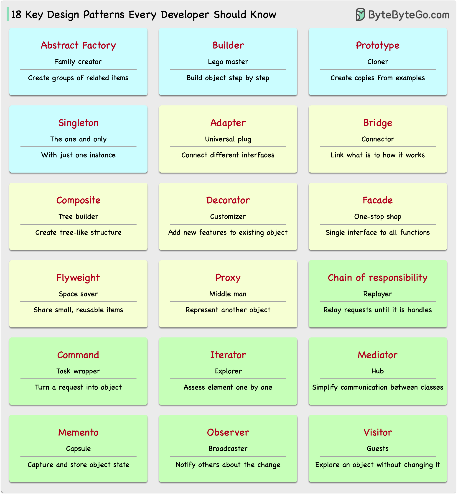

## Architecture patterns

### MVC, MVP, MVVM, MVVM-C, and VIPER
These architecture patterns are among the most commonly used in app development, whether on iOS or Android platforms. Developers have introduced them to overcome the limitations of earlier patterns. So, how do they differ? 

  

- MVC, the oldest pattern, dates back almost 50 years 
- Every pattern has a "view" (V) responsible for displaying content and receiving user input 
- Most patterns include a "model" (M) to manage business data 
- "Controller," "presenter," and "view-model" are translators that mediate between the view and the model ("entity" in the VIPER pattern)

### 18 Key Design Patterns Every Developer Should Know

Patterns are reusable solutions to common design problems, resulting in a smoother, more efficient development process. They serve as blueprints for building better software structures. These are some of the most popular patterns: 

  

- Abstract Factory: Family Creator - Makes groups of related items. 
- Builder: Lego Master - Builds objects step by step, keeping creation and appearance separate. 
- Prototype: Clone Maker - Creates copies of fully prepared examples. 
- Singleton: One and Only - A special class with just one instance. 
- Adapter: Universal Plug - Connects things with different interfaces. 
- Bridge: Function Connector - Links how an object works to what it does. 
- Composite: Tree Builder - Forms tree-like structures of simple and complex parts. 
- Decorator: Customizer - Adds features to objects without changing their core. 
- Facade: One-Stop-Shop - Represents a whole system with a single, simplified interface. 
- Flyweight: Space Saver - Shares small, reusable items efficiently. 
- Proxy: Stand-In Actor - Represents another object, controlling access or actions. 
- Chain of Responsibility: Request Relay - Passes a request through a chain of objects until handled. 
- Command: Task Wrapper - Turns a request into an object, ready for action. 
- Iterator: Collection Explorer - Accesses elements in a collection one by one. 
- Mediator: Communication Hub - Simplifies interactions between different classes. 
- Memento: Time Capsule - Captures and restores an object's state. 
- Observer: News Broadcaster - Notifies classes about changes in other objects. 
- Visitor: Skillful Guest - Adds new operations to a class without altering it.

# 大型工程中常见的模式

- 责任链模式
- P-IMPL 模式
- 桥接模式
- MVC 模式

* 大话设计模式
  * 本书并没有局限于那种分布式框架，而是着重讲解分布式整体架构设计理念和基础知识。
    **作者水平非常高，本书广度非常大**（诚然并不是很深，要在一本书里将那么多知识深度讲解也是不可能的），深入浅出，大家不用担心晦涩难懂（在这里更加推荐英文基础好的话直接读英文原版）。

1/如何实现断点续传,如何提高上传速

**30. 代理类**

例子：实现二维数组类：
    
    template<class T>
    class Array2D{
    public:
        Array2D(int dim1, int dim2);
        class Array1D{
        public:
            T& operator;
            const T& operator const;
        };
        Array1D operator;
        const Array1D operator const;
    };
    Array2D<int> data(10, 20);
    cout << data[3][6] //这里面的[][]运算符是通过两次重载实现的

例子：代理类区分[]操作符的读写：

采用延迟计算方法，修改operator[]让他返回一个（代理字符的）proxy对象而不是字符对象本身，并且判断之后这个代理字符怎么被使用，从而判断是读还是写操作
    
    class String{
    public:
        class CharProxy{
        public:
            CharProxy(String& str, int index);
            CharProxy& operator=(const CharProxy& rhs);
            CharProxy& operator=(char c);
            operator char() const;
        private:
            String& theString;
            int charIndex;
        };
        const CharProxy operator const;//对于const的Strings
        CharProxy operator;            //对于non-const的Strings
    
        friend class CharProxy;
    private:
        RCPtr<StringValue> value;
    };
