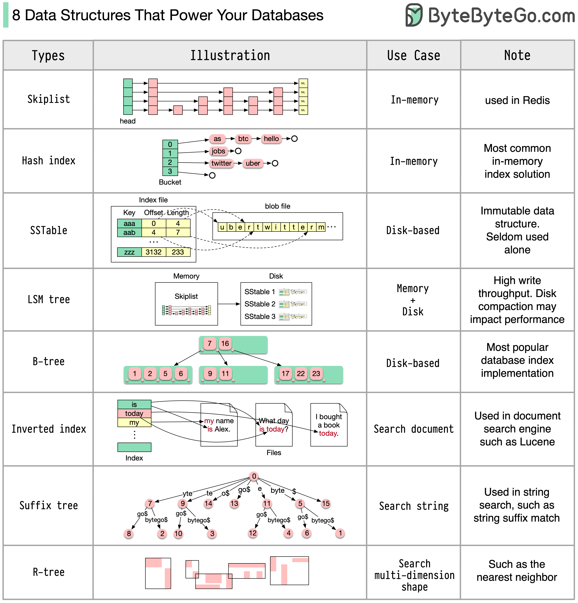
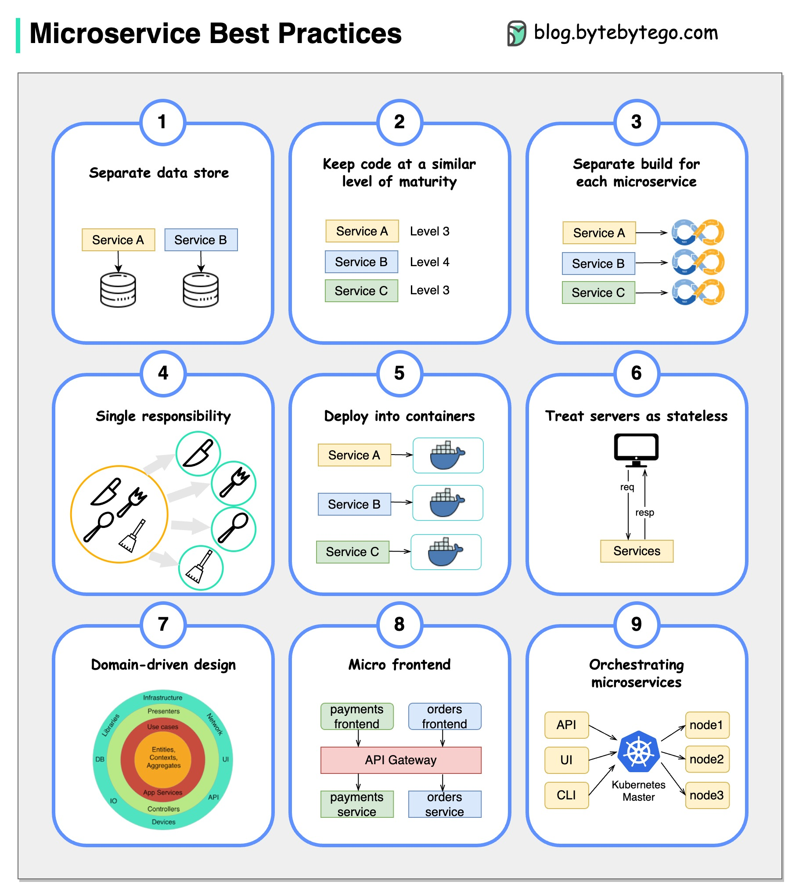
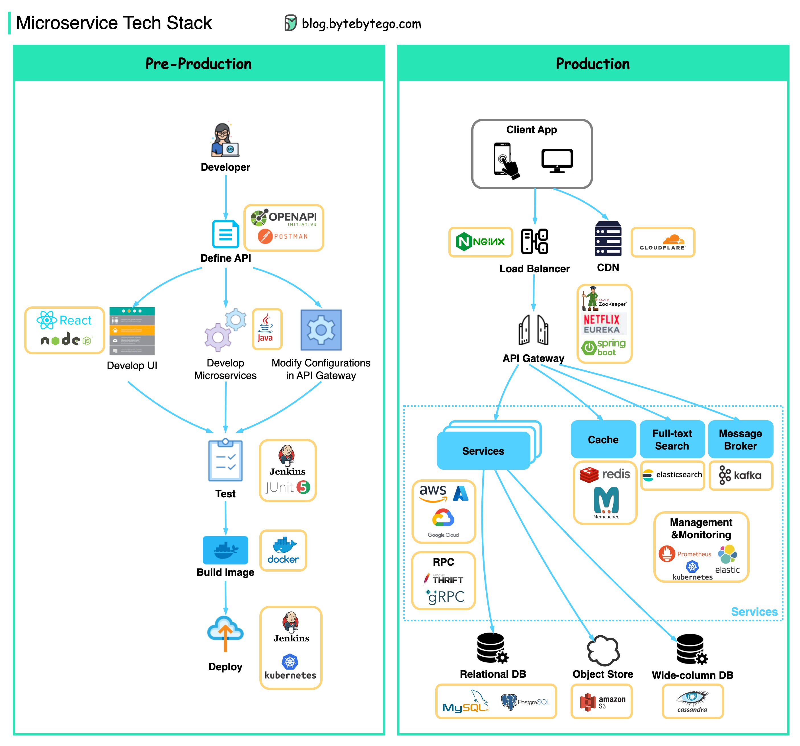

# System Design 101

# Table of Contents
- [System Design 101](#system-design-101)
- [Table of Contents](#table-of-contents)
  - [Communication protocols](#communication-protocols)
    - [REST API vs. GraphQL](#rest-api-vs-graphql)
    - [How does gRPC work?](#how-does-grpc-work)
    - [What is a webhook?](#what-is-a-webhook)
    - [How to improve API performance?](#how-to-improve-api-performance)
    - [HTTP 1.0 -\> HTTP 1.1 -\> HTTP 2.0 -\> HTTP 3.0 (QUIC)](#http-10---http-11---http-20---http-30-quic)
    - [SOAP vs REST vs GraphQL vs RPC](#soap-vs-rest-vs-graphql-vs-rpc)
    - [Code First vs. API First](#code-first-vs-api-first)
    - [HTTP status codes](#http-status-codes)
    - [What does API gateway do?](#what-does-api-gateway-do)
    - [How do we design effective and safe APIs?](#how-do-we-design-effective-and-safe-apis)
    - [TCP/IP encapsulation](#tcpip-encapsulation)
    - [Why is Nginx called a “reverse” proxy?](#why-is-nginx-called-a-reverse-proxy)
    - [What are the common load-balancing algorithms?](#what-are-the-common-load-balancing-algorithms)
    - [URL, URI, URN - Do you know the differences?](#url-uri-urn---do-you-know-the-differences)
  - [Architecture patterns](#architecture-patterns)
    - [MVC, MVP, MVVM, MVVM-C, and VIPER](#mvc-mvp-mvvm-mvvm-c-and-viper)
    - [18 Key Design Patterns Every Developer Should Know](#18-key-design-patterns-every-developer-should-know)
  - [Database](#database)
    - [A nice cheat sheet of different databases in cloud services](#a-nice-cheat-sheet-of-different-databases-in-cloud-services)
    - [8 Data Structures That Power Your Databases](#8-data-structures-that-power-your-databases)
    - [How is an SQL statement executed in the database?](#how-is-an-sql-statement-executed-in-the-database)
    - [CAP theorem](#cap-theorem)
    - [Types of Memory and Storage](#types-of-memory-and-storage)
    - [Visualizing a SQL query](#visualizing-a-sql-query)
    - [SQL language](#sql-language)
  - [Cache](#cache)
    - [Data is cached everywhere](#data-is-cached-everywhere)
    - [Why is Redis so fast?](#why-is-redis-so-fast)
    - [How can Redis be used?](#how-can-redis-be-used)
    - [Top caching strategies](#top-caching-strategies)
  - [Microservice architecture](#microservice-architecture)
    - [What does a typical microservice architecture look like?](#what-does-a-typical-microservice-architecture-look-like)
    - [Microservice Best Practices](#microservice-best-practices)
    - [What tech stack is commonly used for microservices?](#what-tech-stack-is-commonly-used-for-microservices)
    - [Why is Kafka fast](#why-is-kafka-fast)
  - [Payment systems](#payment-systems)
    - [How to learn payment systems?](#how-to-learn-payment-systems)
    - [Why is the credit card called “the most profitable product in banks”? How does VISA/Mastercard make money?](#why-is-the-credit-card-called-the-most-profitable-product-in-banks-how-does-visamastercard-make-money)
    - [How does VISA work when we swipe a credit card at a merchant’s shop?](#how-does-visa-work-when-we-swipe-a-credit-card-at-a-merchants-shop)
    - [Payment Systems Around The World Series (Part 1): Unified Payments Interface (UPI) in India](#payment-systems-around-the-world-series-part-1-unified-payments-interface-upi-in-india)
  - [DevOps](#devops)
    - [DevOps vs. SRE vs. Platform Engineering. What is the difference?](#devops-vs-sre-vs-platform-engineering-what-is-the-difference)
    - [What is k8s (Kubernetes)?](#what-is-k8s-kubernetes)
    - [Docker vs. Kubernetes. Which one should we use?](#docker-vs-kubernetes-which-one-should-we-use)
    - [How does Docker work?](#how-does-docker-work)
  - [GIT](#git)
    - [How Git Commands work](#how-git-commands-work)
    - [How does Git Work?](#how-does-git-work)
    - [Git merge vs. Git rebase](#git-merge-vs-git-rebase)
  - [Cloud Services](#cloud-services)
    - [A nice cheat sheet of different cloud services (2023 edition)](#a-nice-cheat-sheet-of-different-cloud-services-2023-edition)
    - [What is cloud native?](#what-is-cloud-native)
  - [Developer productivity tools](#developer-productivity-tools)
    - [Visualize JSON files](#visualize-json-files)
    - [Automatically turn code into architecture diagrams](#automatically-turn-code-into-architecture-diagrams)

## Communication protocols

As a result, they ensure efficiency, reliability, and ease of integration with other systems by providing a standard approach to designing and building APIs. Here are the most used styles:

  

- SOAP: 

  Mature, comprehensive, XML-based
  
  Best for enterprise applications 

- RESTful: 

  Popular, easy-to-implement, HTTP methods 

  Ideal for web services 

- GraphQL: 

  Query language, request specific data 

  Reduces network overhead, faster responses 

- gRPC: 

  Modern, high-performance, Protocol Buffers 

  Suitable for microservices architectures 

- WebSocket: 

  Real-time, bidirectional, persistent connections 

  Perfect for low-latency data exchange 

- Webhook: 

  Event-driven, HTTP callbacks, asynchronous 

  Notifies systems when events occur

### REST API vs. GraphQL

When it comes to API design, REST and GraphQL each have their own strengths and weaknesses.

The diagram below shows a quick comparison between REST and GraphQL.

  

REST

- Uses standard HTTP methods like GET, POST, PUT, DELETE for CRUD operations.
- Works well when you need simple, uniform interfaces between separate services/applications.
- Caching strategies are straightforward to implement.
- The downside is it may require multiple roundtrips to assemble related data from separate endpoints.

GraphQL

- Provides a single endpoint for clients to query for precisely the data they need.
- Clients specify the exact fields required in nested queries, and the server returns optimized payloads containing just those fields.
- Supports Mutations for modifying data and Subscriptions for real-time notifications.
- Great for aggregating data from multiple sources and works well with rapidly evolving frontend requirements.
- However, it shifts complexity to the client side and can allow abusive queries if not properly safeguarded
- Caching strategies can be more complicated than REST.

The best choice between REST and GraphQL depends on the specific requirements of the application and development team. GraphQL is a good fit for complex or frequently changing frontend needs, while REST suits applications where simple and consistent contracts are preferred.

Neither API approach is a silver bullet. Carefully evaluating requirements and tradeoffs is important to pick the right style. Both REST and GraphQL are valid options for exposing data and powering modern applications.

### How does gRPC work?

RPC (Remote Procedure Call) is called “**remote**” because it enables communications between remote services when services are deployed to different servers under microservice architecture. From the user’s point of view, it acts like a local function call.

The diagram below illustrates the overall data flow for **gRPC**.

  

Step 1: A REST call is made from the client. The request body is usually in JSON format.

Steps 2 - 4: The order service (gRPC client) receives the REST call, transforms it, and makes an RPC call to the payment service. gRPC encodes the **client stub** into a binary format and sends it to the low-level transport layer.

Step 5: gRPC sends the packets over the network via HTTP2. Because of binary encoding and network optimizations, gRPC is said to be 5X faster than JSON.

Steps 6 - 8: The payment service (gRPC server) receives the packets from the network, decodes them, and invokes the server application.

Steps 9 - 11: The result is returned from the server application, and gets encoded and sent to the transport layer.

Steps 12 - 14: The order service receives the packets, decodes them, and sends the result to the client application.

### What is a webhook?

The diagram below shows a comparison between polling and Webhook. 

  

Assume we run an eCommerce website. The clients send orders to the order service via the API gateway, which goes to the payment service for payment transactions. The payment service then talks to an external payment service provider (PSP) to complete the transactions. 

There are two ways to handle communications with the external PSP. 

**1. Short polling** 

After sending the payment request to the PSP, the payment service keeps asking the PSP about the payment status. After several rounds, the PSP finally returns with the status. 

Short polling has two drawbacks: 
* Constant polling of the status requires resources from the payment service. 
* The External service communicates directly with the payment service, creating security vulnerabilities. 

**2. Webhook** 

We can register a webhook with the external service. It means: call me back at a certain URL when you have updates on the request. When the PSP has completed the processing, it will invoke the HTTP request to update the payment status.

In this way, the programming paradigm is changed, and the payment service doesn’t need to waste resources to poll the payment status anymore.

What if the PSP never calls back? We can set up a housekeeping job to check payment status every hour.

Webhooks are often referred to as reverse APIs or push APIs because the server sends HTTP requests to the client. We need to pay attention to 3 things when using a webhook:

1. We need to design a proper API for the external service to call.
2. We need to set up proper rules in the API gateway for security reasons.
3. We need to register the correct URL at the external service.

### How to improve API performance?

The diagram below shows 5 common tricks to improve API performance.

  

Pagination

This is a common optimization when the size of the result is large. The results are streaming back to the client to improve the service responsiveness.

Asynchronous Logging

Synchronous logging deals with the disk for every call and can slow down the system. Asynchronous logging sends logs to a lock-free buffer first and immediately returns. The logs will be flushed to the disk periodically. This significantly reduces the I/O overhead.

Caching

We can store frequently accessed data into a cache. The client can query the cache first instead of visiting the database directly. If there is a cache miss, the client can query from the database. Caches like Redis store data in memory, so the data access is much faster than the database.

Payload Compression

The requests and responses can be compressed using gzip etc so that the transmitted data size is much smaller. This speeds up the upload and download.

Connection Pool

When accessing resources, we often need to load data from the database. Opening the closing db connections adds significant overhead. So we should connect to the db via a pool of open connections. The connection pool is responsible for managing the connection lifecycle.

### HTTP 1.0 -> HTTP 1.1 -> HTTP 2.0 -> HTTP 3.0 (QUIC)

What problem does each generation of HTTP solve?

The diagram below illustrates the key features.

  

- HTTP 1.0 was finalized and fully documented in 1996. Every request to the same server requires a separate TCP connection.

- HTTP 1.1 was published in 1997. A TCP connection can be left open for reuse (persistent connection), but it doesn’t solve the HOL (head-of-line) blocking issue. 

  HOL blocking - when the number of allowed parallel requests in the browser is used up, subsequent requests need to wait for the former ones to complete.

- HTTP 2.0 was published in 2015. It addresses HOL issue through request multiplexing, which eliminates HOL blocking at the application layer, but HOL still exists at the transport (TCP) layer.

  As you can see in the diagram, HTTP 2.0 introduced the concept of HTTP “streams”: an abstraction that allows multiplexing different HTTP exchanges onto the same TCP connection. Each stream doesn’t need to be sent in order.

- HTTP 3.0 first draft was published in 2020. It is the proposed successor to HTTP 2.0. It uses QUIC instead of TCP for the underlying transport protocol, thus removing HOL blocking in the transport layer. 

QUIC is based on UDP. It introduces streams as first-class citizens at the transport layer. QUIC streams share the same QUIC connection, so no additional handshakes and slow starts are required to create new ones, but QUIC streams are delivered independently such that in most cases packet loss affecting one stream doesn't affect others.

### SOAP vs REST vs GraphQL vs RPC

The diagram below illustrates the API timeline and API styles comparison.

Over time, different API architectural styles are released. Each of them has its own patterns of standardizing data exchange. 

You can check out the use cases of each style in the diagram.

  

### Code First vs. API First 

The diagram below shows the differences between code-first development and API-first development. Why do we want to consider API first design?

  

- Microservices increase system complexity and we have separate services to serve different functions of the system. While this kind of architecture facilitates decoupling and segregation of duty, we need to handle the various communications among services. 

It is better to think through the system's complexity before writing the code and carefully defining the boundaries of the services.

- Separate functional teams need to speak the same language and the dedicated functional teams are only responsible for their own components and services. It is recommended that the organization speak the same language via API design. 

We can mock requests and responses to validate the API design before writing code.

- Improve software quality and developer productivity Since we have ironed out most of the uncertainties when the project starts, the overall development process is smoother, and the software quality is greatly improved. 

Developers are happy about the process as well because they can focus on functional development instead of negotiating sudden changes.

The possibility of having surprises toward the end of the project lifecycle is reduced.

Because we have designed the API first, the tests can be designed while the code is being developed. In a way, we also have TDD (Test Driven Design) when using API first development.

### HTTP status codes

  

The response codes for HTTP are divided into five categories: 

Informational (100-199) 
Success (200-299) 
Redirection (300-399) 
Client Error (400-499) 
Server Error (500-599) 

### What does API gateway do? 

The diagram below shows the details. 

  

Step 1 - The client sends an HTTP request to the API gateway. 

Step 2 - The API gateway parses and validates the attributes in the HTTP request. 

Step 3 - The API gateway performs allow-list/deny-list checks. 

Step 4 - The API gateway talks to an identity provider for authentication and authorization. 

Step 5 - The rate limiting rules are applied to the request. If it is over the limit, the request is rejected. 

Steps 6 and 7 - Now that the request has passed basic checks, the API gateway finds the relevant service to route to by path matching. 

Step 8 - The API gateway transforms the request into the appropriate protocol and sends it to backend microservices. 

Steps 9-12: The API gateway can handle errors properly, and deals with faults if the error takes a longer time to recover (circuit break). It can also leverage ELK (Elastic-Logstash-Kibana) stack for logging and monitoring. We sometimes cache data in the API gateway. 

### How do we design effective and safe APIs?

The diagram below shows typical API designs with a shopping cart example. 

  

Note that API design is not just URL path design. Most of the time, we need to choose the proper resource names, identifiers, and path patterns. It is equally important to design proper HTTP header fields or to design effective rate-limiting rules within the API gateway. 

### TCP/IP encapsulation 

How is data sent over the network? Why do we need so many layers in the OSI model?

The diagram below shows how data is encapsulated and de-encapsulated when transmitting over the network.

  

Step 1: When Device A sends data to Device B over the network via the HTTP protocol, it is first added an HTTP header at the application layer.

Step 2: Then a TCP or a UDP header is added to the data. It is encapsulated into TCP segments at the transport layer. The header contains the source port, destination port, and sequence number.

Step 3: The segments are then encapsulated with an IP header at the network layer. The IP header contains the source/destination IP addresses.

Step 4: The IP datagram is added a MAC header at the data link layer, with source/destination MAC addresses.

Step 5: The encapsulated frames are sent to the physical layer and sent over the network in binary bits.

Steps 6-10: When Device B receives the bits from the network, it performs the de-encapsulation process, which is a reverse processing of the encapsulation process. The headers are removed layer by layer, and eventually, Device B can read the data.

We need layers in the network model because each layer focuses on its own responsibilities. Each layer can rely on the headers for processing instructions and does not need to know the meaning of the data from the last layer.

### Why is Nginx called a “reverse” proxy?

The diagram below shows the differences between a 𝐟𝐨𝐫𝐰𝐚𝐫𝐝 𝐩𝐫𝐨𝐱𝐲 and a 𝐫𝐞𝐯𝐞𝐫𝐬𝐞 𝐩𝐫𝐨𝐱𝐲.

  

A forward proxy is a server that sits between user devices and the internet.

A forward proxy is commonly used for: 

1. Protecting clients
2. Circumventing browsing restrictions
3. Blocking access to certain content

A reverse proxy is a server that accepts a request from the client, forwards the request to web servers, and returns the results to the client as if the proxy server had processed the request.

A reverse proxy is good for:

1. Protecting servers
2. Load balancing
3. Caching static contents
4. Encrypting and decrypting SSL communications

### What are the common load-balancing algorithms?

The diagram below shows 6 common algorithms. 

  

- Static Algorithms 

1. Round robin

    The client requests are sent to different service instances in sequential order. The services are usually required to be stateless. 

3. Sticky round-robin

    This is an improvement of the round-robin algorithm. If Alice’s first request goes to service A, the following requests go to service A as well. 

4. Weighted round-robin

    The admin can specify the weight for each service. The ones with a higher weight handle more requests than others. 

6. Hash

    This algorithm applies a hash function on the incoming requests’ IP or URL. The requests are routed to relevant instances based on the hash function result. 

- Dynamic Algorithms

5. Least connections

    A new request is sent to the service instance with the least concurrent connections. 

7. Least response time

    A new request is sent to the service instance with the fastest response time.

### URL, URI, URN - Do you know the differences? 

The diagram below shows a comparison of URL, URI, and URN. 

  

- URI 

URI stands for Uniform Resource Identifier. It identifies a logical or physical resource on the web. URL and URN are subtypes of URI. URL locates a resource, while URN names a resource. 

A URI is composed of the following parts: 
scheme:[//authority]path[?query][#fragment] 

- URL 

URL stands for Uniform Resource Locator, the key concept of HTTP. It is the address of a unique resource on the web. It can be used with other protocols like FTP and JDBC. 

- URN 

URN stands for Uniform Resource Name. It uses the urn scheme. URNs cannot be used to locate a resource. A simple example given in the diagram is composed of a namespace and a namespace-specific string. 

If you would like to learn more detail on the subject, I would recommend [W3C’s clarification](https://www.w3.org/TR/uri-clarification/).

## Database

### A nice cheat sheet of different databases in cloud services

  

Choosing the right database for your project is a complex task. Many database options, each suited to distinct use cases, can quickly lead to decision fatigue. 

We hope this cheat sheet provides high-level direction to pinpoint the right service that aligns with your project's needs and avoid potential pitfalls. 

Note: Google has limited documentation for their database use cases. Even though we did our best to look at what was available and arrived at the best option, some of the entries may need to be more accurate. 

### 8 Data Structures That Power Your Databases

The answer will vary depending on your use case. Data can be indexed in memory or on disk. Similarly, data formats vary, such as numbers, strings, geographic coordinates, etc. The system might be write-heavy or read-heavy. All of these factors affect your choice of database index format. 

  

The following are some of the most popular data structures used for indexing data: 

- Skiplist: a common in-memory index type. Used in Redis 
- Hash index: a very common implementation of the “Map” data structure (or “Collection”) 
- SSTable: immutable on-disk “Map” implementation 
- LSM tree: Skiplist + SSTable. High write throughput 
- B-tree: disk-based solution. Consistent read/write performance 
- Inverted index: used for document indexing. Used in Lucene 
- Suffix tree: for string pattern search 
- R-tree: multi-dimension search, such as finding the nearest neighbor 

### How is an SQL statement executed in the database?

The diagram below shows the process. Note that the architectures for different databases are different, the diagram demonstrates some common designs.

  

Step 1 - A SQL statement is sent to the database via a transport layer protocol (e.g.TCP).

Step 2 - The SQL statement is sent to the command parser, where it goes through syntactic and semantic analysis, and a query tree is generated afterward.

Step 3 - The query tree is sent to the optimizer. The optimizer creates an execution plan. 

Step 4 - The execution plan is sent to the executor. The executor retrieves data from the execution.

Step 5 - Access methods provide the data fetching logic required for execution, retrieving data from the storage engine. 

Step 6 - Access methods decide whether the SQL statement is read-only. If the query is read-only (SELECT statement), it is passed to the buffer manager for further processing. The buffer manager looks for the data in the cache or data files.

Step 7 - If the statement is an UPDATE or INSERT, it is passed to the transaction manager for further processing.

Step 8 - During a transaction, the data is in lock mode. This is guaranteed by the lock manager. It also ensures the transaction’s ACID properties. 

###  CAP theorem

The CAP theorem is one of the most famous terms in computer science, but I bet different developers have different understandings. Let’s examine what it is and why it can be confusing. 

  

CAP theorem states that a distributed system can't provide more than two of these three guarantees simultaneously.

**Consistency**: consistency means all clients see the same data at the same time no matter which node they connect to.

**Availability**: availability means any client that requests data gets a response even if some of the nodes are down.

**Partition Tolerance**: a partition indicates a communication break between two nodes. Partition tolerance means the system continues to operate despite network partitions. 

The “2 of 3” formulation can be useful, **but this simplification could be misleading**.

1. Picking a database is not easy. Justifying our choice purely based on the CAP theorem is not enough. For example, companies don't choose Cassandra for chat applications simply because it is an AP system. There is a list of good characteristics that make Cassandra a desirable option for storing chat messages. We need to dig deeper.

2. “CAP prohibits only a tiny part of the design space: perfect availability and consistency in the presence of partitions, which are rare”. Quoted from the paper: CAP Twelve Years Later: How the “Rules” Have Changed.

3. The theorem is about 100% availability and consistency. A more realistic discussion would be the trade-offs between latency and consistency when there is no network partition. See PACELC theorem for more details.

**Is the CAP theorem actually useful?**

I think it is still useful as it opens our minds to a set of tradeoff discussions, but it is only part of the story. We need to dig deeper when picking the right database.

### Types of Memory and Storage

  

### Visualizing a SQL query

  

SQL statements are executed by the database system in several steps, including: 

- Parsing the SQL statement and checking its validity 
- Transforming the SQL into an internal representation, such as relational algebra 
- Optimizing the internal representation and creating an execution plan that utilizes index information 
- Executing the plan and returning the results 

The execution of SQL is highly complex and involves many considerations, such as: 

- The use of indexes and caches 
- The order of table joins 
- Concurrency control 
- Transaction management 

### SQL language 

In 1986, SQL (Structured Query Language) became a standard. Over the next 40 years, it became the dominant language for relational database management systems. Reading the latest standard (ANSI SQL 2016) can be time-consuming. How can I learn it? 

  

There are 5 components of the SQL language: 

- DDL: data definition language, such as CREATE, ALTER, DROP 
- DQL: data query language, such as SELECT 
- DML: data manipulation language, such as INSERT, UPDATE, DELETE 
- DCL: data control language, such as GRANT, REVOKE 
- TCL: transaction control language, such as COMMIT, ROLLBACK 

For a backend engineer, you may need to know most of it. As a data analyst, you may need to have a good understanding of DQL. Select the topics that are most relevant to you. 

## Cache

### Data is cached everywhere

This diagram illustrates where we cache data in a typical architecture.

  

There are **multiple layers** along the flow.

1. Client apps: HTTP responses can be cached by the browser. We request data over HTTP for the first time, and it is returned with an expiry policy in the HTTP header; we request data again, and the client app tries to retrieve the data from the browser cache first.
2. CDN: CDN caches static web resources. The clients can retrieve data from a CDN node nearby.
3. Load Balancer: The load Balancer can cache resources as well.
4. Messaging infra: Message brokers store messages on disk first, and then consumers retrieve them at their own pace. Depending on the retention policy, the data is cached in Kafka clusters for a period of time.
5. Services: There are multiple layers of cache in a service. If the data is not cached in the CPU cache, the service will try to retrieve the data from memory. Sometimes the service has a second-level cache to store data on disk.
6. Distributed Cache: Distributed cache like Redis holds key-value pairs for multiple services in memory. It provides much better read/write performance than the database.
7. Full-text Search: we sometimes need to use full-text searches like Elastic Search for document search or log search. A copy of data is indexed in the search engine as well.
8. Database: Even in the database, we have different levels of caches:
- WAL(Write-ahead Log): data is written to WAL first before building the B tree index
- Bufferpool: A memory area allocated to cache query results
- Materialized View: Pre-compute query results and store them in the database tables for better query performance
- Transaction log: record all the transactions and database updates
- Replication Log: used to record the replication state in a database cluster

### Why is Redis so fast? 

There are 3 main reasons as shown in the diagram below.

  

1. Redis is a RAM-based data store. RAM access is at least 1000 times faster than random disk access.
2. Redis leverages IO multiplexing and single-threaded execution loop for execution efficiency.
3. Redis leverages several efficient lower-level data structures.

Question: Another popular in-memory store is Memcached. Do you know the differences between Redis and Memcached?

You might have noticed the style of this diagram is different from my previous posts. Please let me know which one you prefer.

### How can Redis be used?

  

There is more to Redis than just caching. 

Redis can be used in a variety of scenarios as shown in the diagram. 

- Session 

  We can use Redis to share user session data among different services. 

- Cache 

  We can use Redis to cache objects or pages, especially for hotspot data. 

- Distributed lock 

  We can use a Redis string to acquire locks among distributed services. 

- Counter 

  We can count how many likes or how many reads for articles. 

- Rate limiter 

  We can apply a rate limiter for certain user IPs. 

- Global ID generator 

  We can use Redis Int for global ID. 

- Shopping cart 

  We can use Redis Hash to represent key-value pairs in a shopping cart. 

- Calculate user retention 

  We can use Bitmap to represent the user login daily and calculate user retention. 

- Message queue 

  We can use List for a message queue. 

- Ranking 

  We can use ZSet to sort the articles. 

### Top caching strategies

Designing large-scale systems usually requires careful consideration of caching. 
Below are five caching strategies that are frequently utilized. 

  

## Microservice architecture

### What does a typical microservice architecture look like? 

  

The diagram below shows a typical microservice architecture. 

- Load Balancer: This distributes incoming traffic across multiple backend services. 
- CDN (Content Delivery Network): CDN is a group of geographically distributed servers that hold static content for faster delivery. The clients look for content in CDN first, then progress  to backend services.
- API Gateway: This handles incoming requests and routes them to the relevant services. It talks to the identity provider and service discovery.
- Identity Provider: This handles authentication and authorization for users. 
- Service Registry & Discovery: Microservice registration and discovery happen in this component, and the API gateway looks for relevant services in this component to talk to. 
- Management: This component is responsible for monitoring the services.
- Microservices: Microservices are designed and deployed in different domains. Each domain has its own database. The API gateway talks to the microservices via REST API or other protocols, and the microservices within the same domain talk to each other using RPC (Remote Procedure Call).

Benefits of microservices:

- They can be quickly designed, deployed, and horizontally scaled.
- Each domain can be independently maintained by a dedicated team.
- Business requirements can be customized in each domain and better supported, as a result.

### Microservice Best Practices

A picture is worth a thousand words: 9 best practices for developing microservices.

  

 
When we develop microservices, we need to follow the following best practices: 

1. Use separate data storage for each microservice 
2. Keep code at a similar level of maturity 
3. Separate build for each microservice 
4. Assign each microservice with a single responsibility 
5. Deploy into containers 
6. Design stateless services 
7. Adopt domain-driven design
8. Design micro frontend 
9. Orchestrating microservices 

### What tech stack is commonly used for microservices?

Below you will find a diagram showing the microservice tech stack, both for the development phase and for production.

  

▶️ 𝐏𝐫𝐞-𝐏𝐫𝐨𝐝𝐮𝐜𝐭𝐢𝐨𝐧

- Define API - This establishes a contract between frontend and backend. We can use Postman or OpenAPI for this.
- Development - Node.js or react is popular for frontend development, and java/python/go for backend development. Also, we need to change the configurations in the API gateway according to API definitions.
- Continuous Integration - JUnit and Jenkins for automated testing. The code is packaged into a Docker image and deployed as microservices.

▶️ 𝐏𝐫𝐨𝐝𝐮𝐜𝐭𝐢𝐨𝐧

- NGinx is a common choice for load balancers. Cloudflare provides CDN (Content Delivery Network). 
- API Gateway - We can use spring boot for the gateway, and use Eureka/Zookeeper for service discovery.
- The microservices are deployed on clouds. We have options among AWS, Microsoft Azure, or Google GCP.
Cache and Full-text Search - Redis is a common choice for caching key-value pairs. Elasticsearch is used for full-text search.
- Communications - For services to talk to each other, we can use messaging infra Kafka or RPC.
- Persistence - We can use MySQL or PostgreSQL for a relational database, and Amazon S3 for object store. We can also use Cassandra for the wide-column store if necessary.
- Management & Monitoring - To manage so many microservices, the common Ops tools include Prometheus, Elastic Stack, and Kubernetes.

### Why is Kafka fast

There are many design decisions that contributed to Kafka’s performance. In this post, we’ll focus on two. We think these two carried the most weight.

  

1. The first one is Kafka’s reliance on Sequential I/O.
2. The second design choice that gives Kafka its performance advantage is its focus on efficiency: zero copy principle.
 
The diagram illustrates how the data is transmitted between producer and consumer, and what zero-copy means.
 
- Step 1.1 - 1.3: Producer writes data to the disk 
- Step 2: Consumer reads data without zero-copy

2.1 The data is loaded from disk to OS cache

2.2 The data is copied from OS cache to Kafka application

2.3 Kafka application copies the data into the socket buffer 

2.4 The data is copied from socket buffer to network card

2.5 The network card sends data out to the consumer

 
- Step 3: Consumer reads data with zero-copy

3.1: The data is loaded from disk to OS cache
3.2 OS cache directly copies the data to the network card via sendfile() command
3.3 The network card sends data out to the consumer
 
Zero copy is a shortcut to save the multiple data copies between application context and kernel context.

## Payment systems

### How to learn payment systems?

  

###  Why is the credit card called “the most profitable product in banks”? How does VISA/Mastercard make money? 

The diagram below shows the economics of the credit card payment flow.

  

1.&nbsp;&nbsp;The cardholder pays a merchant $100 to buy a product.

2.&nbsp;The merchant benefits from the use of the credit card with higher sales volume and needs to compensate the issuer and the card network for providing the payment service. The acquiring bank sets a fee with the merchant, called the “merchant discount fee.”

3 - 4. The acquiring bank keeps $0.25 as the acquiring markup, and $1.75 is paid to the issuing bank as the interchange fee. The merchant discount fee should cover the interchange fee. 

  The interchange fee is set by the card network because it is less efficient for each issuing bank to negotiate fees with each merchant.

5.&nbsp;&nbsp;The card network sets up the network assessments and fees with each bank, which pays the card network for its services every month. For example, VISA charges a 0.11% assessment, plus a $0.0195 usage fee, for every swipe.

6.&nbsp;&nbsp;The cardholder pays the issuing bank for its services.

Why should the issuing bank be compensated?

- The issuer pays the merchant even if the cardholder fails to pay the issuer. 
- The issuer pays the merchant before the cardholder pays the issuer.
- The issuer has other operating costs, including managing customer accounts, providing statements, fraud detection, risk management, clearing & settlement, etc. 

### How does VISA work when we swipe a credit card at a merchant’s shop?

  

VISA, Mastercard, and American Express act as card networks for the clearing and settling of funds. The card acquiring bank and the card issuing bank can be – and often are – different. If banks were to settle transactions one by one without an intermediary, each bank would have to settle the transactions with all the other banks. This is quite inefficient.   
 
The diagram below shows VISA’s role in the credit card payment process. There are two flows involved. Authorization flow happens when the customer swipes the credit card. Capture and settlement flow happens when the merchant wants to get the money at the end of the day.
 
- Authorization Flow

Step 0: The card issuing bank issues credit cards to its customers. 
 
Step 1: The cardholder wants to buy a product and swipes the credit card at the Point of Sale (POS) terminal in the merchant’s shop.
 
Step 2: The POS terminal sends the transaction to the acquiring bank, which has provided the POS terminal.
 
Steps 3 and 4: The acquiring bank sends the transaction to the card network, also called the card scheme. The card network sends the transaction to the issuing bank for approval.
 
Steps 4.1, 4.2 and 4.3: The issuing bank freezes the money if the transaction is approved. The approval or rejection is sent back to the acquirer, as well as the POS terminal. 
 
- Capture and Settlement Flow

Steps 1 and 2: The merchant wants to collect the money at the end of the day, so they hit ”capture” on the POS terminal. The transactions are sent to the acquirer in batch. The acquirer sends the batch file with transactions to the card network.
 
Step 3: The card network performs clearing for the transactions collected from different acquirers, and sends the clearing files to different issuing banks.
 
Step 4: The issuing banks confirm the correctness of the clearing files, and transfer money to the relevant acquiring banks.
 
Step 5: The acquiring bank then transfers money to the merchant’s bank. 
 
Step 4: The card network clears up the transactions from different acquiring banks. Clearing is a process in which mutual offset transactions are netted, so the number of total transactions is reduced.
 
In the process, the card network takes on the burden of talking to each bank and receives service fees in return.

### Payment Systems Around The World Series (Part 1): Unified Payments Interface (UPI) in India

What’s UPI? UPI is an instant real-time payment system developed by the National Payments Corporation of India.

It accounts for 60% of digital retail transactions in India today.

UPI = payment markup language + standard for interoperable payments

  

