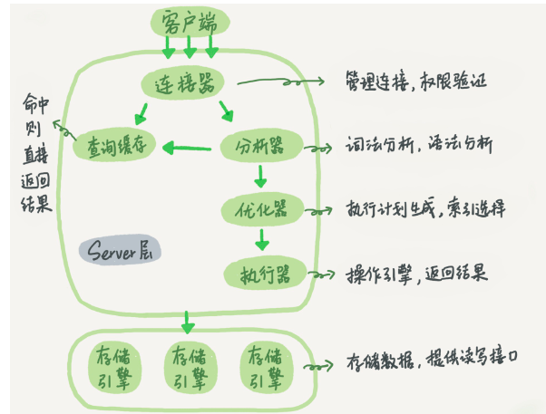

mysql可以分为server层和存储引擎两部分

Server层包括连接器、查询缓存、分析器、优化器、执行器等，涵盖MySQL的大多数核心服务
功能，以及所有的内置函数（如日期、时间、数学和加密函数等），所有跨存储引擎的功能都在
这一层实现，比如存储过程、触发器、视图等。

而存储引擎层负责数据的存储和提取。其架构模式是插件式的，支持InnoDB、MyISAM、
Memory等多个存储引擎。现在最常用的存储引擎是InnoDB，它从MySQL 5.5.5版本开始成为了
默认存储引擎。

### 连接器

mysql -h$ip -P$port -u$user -p

建立连接的过程通常是比较复杂的，所以我建议你在使用中要尽量减少建立连接的动作，也就是
尽量使用长连接。

但是全部使用长连接后，你可能会发现，有些时候MySQL占用内存涨得特别快，这是因为
MySQL在执行过程中临时使用的内存是管理在连接对象里面的。这些资源会在连接断开的时候
才释放。所以如果长连接累积下来，可能导致内存占用太大，被系统强行杀掉（OOM），从现
象看就是MySQL异常重启了。
怎么解决这个问题呢？你可以考虑以下两种方案。
1.  定期断开长连接。使用一段时间，或者程序里面判断执行过一个占用内存的大查询后，断开
连接，之后要查询再重连。
2.  如果你用的是MySQL 5.7或更新版本，可以在每次执行一个比较大的操作后，通过执行
mysql_reset_connection来重新初始化连接资源。这个过程不需要重连和重新做权限验证，
但是会将连接恢复到刚刚创建完时的状态。

### 查询缓存

查询缓存的失效非常频繁，只要有对一个表的更新，这个表上所有的查询缓存都会被清空。因此
很可能你费劲地把结果存起来，还没使用呢，就被一个更新全清空了。对于更新压力大的数据库
来说，查询缓存的命中率会非常低。除非你的业务就是有一张静态表，很长时间才会更新一次。
比如，一个系统配置表，那这张表上的查询才适合使用查询缓存。
好在MySQL也提供了这种“按需使用”的方式。你可以将参数query_cache_type设置成
DEMAND，这样对于默认的SQL语句都不使用查询缓存。而对于你确定要使用查询缓存的语
句，可以用SQL_CACHE显式指定，像下面这个语句一样：

mysql> select SQL_CACHE * from T where ID=10

需要注意的是，MySQL 8.0版本直接将查询缓存的整块功能删掉了，也就是说8.0开始彻底没有
这个功能了

### 分析器

因此
需要对SQL语句做解析。
分析器先会做“词法分析”。你输入的是由多个字符串和空格组成的一条SQL语句，MySQL需要识
别出里面的字符串分别是什么，代表什么。
MySQL从你输入的"select"这个关键字识别出来，这是一个查询语句。它也要把字符串“T”识别
成“表名T”，把字符串“ID”识别成“列ID”。

### 优化器
mysql> select * from t1 join t2 using(ID)  where t1.c=10 and t2.d=20;

既可以先从表t1里面取出c=10的记录的ID值，再根据ID值关联到表t2，再判断t2里面d的值是
否等于20。
也可以先从表t2里面取出d=20的记录的ID值，再根据ID值关联到t1，再判断t1里面c的值是否
等于10。
这两种执行方法的逻辑结果是一样的，但是执行的效率会有不同，而优化器的作用就是决定选择
使用哪一个方案。
优化器阶段完成后，这个语句的执行方案就确定下来了，然后进入执行器阶段。如果你还有一些
疑问，比如优化器是怎么选择索引的，有没有可能选择错等等，没关系，我会在后面的文章中单
独展开说明优化器的内容

### 执行器

MySQL通过分析器知道了你要做什么，通过优化器知道了该怎么做，于是就进入了执行器阶
段，开始执行语句。
开始执行的时候，要先判断一下你对这个表T有没有执行查询的权限，如果没有，就会返回没有
权限的错误，如下所示。

### quiz
我给你留一个问题吧，如果表T中没有字段k，而你执行了这个语句 select * from T where k=1, 那
肯定是会报“不存在这个列”的错误： “Unknown column ‘k’ in ‘where clause’”。你觉得这个错误是
在我们上面提到的哪个阶段报出来的呢

---

### unorganized
mysql> create table T(ID int primary key, c int);

mysql> update T set c=c+1 where ID=2;

你执行语句前要先连接数据库，这是连接器的工作。
前面我们说过，在一个表上有更新的时候，跟这个表有关的查询缓存会失效，所以这条语句就会
把表T上所有缓存结果都清空。这也就是我们一般不建议使用查询缓存的原因。
接下来，分析器会通过词法和语法解析知道这是一条更新语句。优化器决定要使用ID这个索引。
然后，执行器负责具体执行，找到这一行，然后更新。
与查询流程不一样的是，更新流程还涉及两个重要的日志模块，它们正是我们今天要讨论的主
角：redo log（重做日志）和 binlog（归档日志）。如果接触MySQL，那这两个词肯定是绕不过
的，我后面的内容里也会不断地和你强调。不过话说回来，redo log和binlog在设计上有很多有
意思的地方，这些设计思路也可以用到你自己的程序里

### redo log

### bin log

### 附录

show processlist