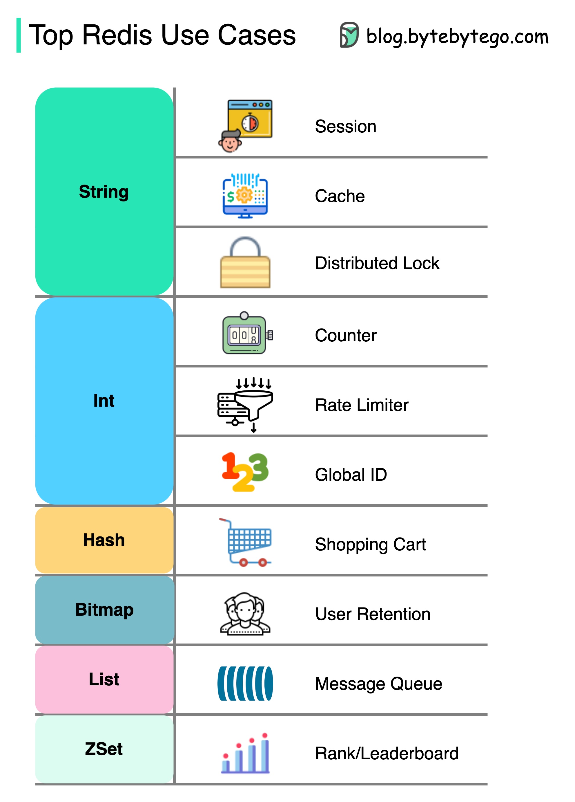

## 缓存

### 数据无处不在地被缓存

下图展示了在典型架构中我们在哪里缓存数据。

  

在数据流的过程中有**多个层次**的缓存。

1. 客户端应用：HTTP 响应可以被浏览器缓存。我们第一次通过 HTTP 请求数据时，数据会在 HTTP 头中返回一个过期策略；再次请求数据时，客户端应用会首先尝试从浏览器缓存中获取数据。
2. CDN：CDN 缓存静态网页资源。客户端可以从附近的 CDN 节点获取数据。
3. 负载均衡器：负载均衡器也可以缓存资源。
4. 消息基础设施：消息代理首先将消息存储在磁盘上，然后消费者可以按自己的节奏检索它们。根据保留策略，数据会在 Kafka 集群中缓存一段时间。
5. 服务：服务中有多层缓存。如果数据不在 CPU 缓存中，服务会尝试从内存中检索数据。有时服务还有一个二级缓存，将数据存储在磁盘上。
6. 分布式缓存：像 Redis 这样的分布式缓存以键值对的形式在内存中为多个服务提供缓存。它提供了比数据库更好的读写性能。
7. 全文搜索：有时我们需要使用全文搜索引擎，如 Elastic Search，用于文档搜索或日志搜索。数据的副本也会被索引到搜索引擎中。
8. 数据库：即使在数据库中，我们也有不同层次的缓存：
   - WAL（预写日志）：数据在构建 B 树索引之前首先写入 WAL
   - 缓冲池：分配用于缓存查询结果的内存区域
   - 物化视图：预计算查询结果并将其存储在数据库表中以提高查询性能
   - 事务日志：记录所有事务和数据库更新
   - 复制日志：用于记录数据库集群中的复制状态

### 为什么 Redis 如此快速？

下图展示了 Redis 快速的三个主要原因。

  

1. Redis 是基于 RAM 的数据存储。RAM 访问至少比随机磁盘访问快 1000 倍。
2. Redis 利用 IO 多路复用和单线程执行循环来提高执行效率。
3. Redis 利用了一些高效的低级数据结构。

问题：另一个流行的内存存储是 Memcached。你知道 Redis 和 Memcached 之间的区别吗？

你可能注意到这张图的风格与我之前的帖子不同。请告诉我你更喜欢哪一种。

### Redis 可以如何使用？

  

Redis 不仅仅用于缓存。

Redis 可以在多种场景中使用，如图所示。

- 会话

  我们可以使用 Redis 在不同服务之间共享用户会话数据。

- 缓存

  我们可以使用 Redis 缓存对象或页面，特别是热点数据。

- 分布式锁

  我们可以使用 Redis 字符串在分布式服务之间获取锁。

- 计数器

  我们可以统计文章的点赞数或阅读数。

- 速率限制器

  我们可以对某些用户 IP 应用速率限制。

- 全局 ID 生成器

  我们可以使用 Redis 整数生成全局 ID。

- 购物车

  我们可以使用 Redis 哈希表示购物车中的键值对。

- 计算用户留存率

  我们可以使用位图表示用户每日登录情况并计算用户留存率。

- 消息队列

  我们可以使用列表作为消息队列。

- 排名

  我们可以使用有序集合对文章进行排序。

### 顶级缓存策略

设计大规模系统通常需要仔细考虑缓存。
以下是五种常用的缓存策略。

  

# 缓存

## 缓存和内存

像计算机的内存一样，缓存是一种紧凑、高性能的内存，按层次存储数据，从一级开始，依次递进。它们被标记为 L1、L2、L3 等。缓存也会在请求时写入，例如当有更新并且需要将新内容保存到缓存中，替换之前保存的旧内容时。

无论是读取还是写入缓存，都是一次一个块。每个块也有一个标签，包含数据在缓存中存储的位置。当从缓存中请求数据时，会通过标签在一级（L1）内存中进行搜索。如果没有找到正确的数据，会在 L2 中继续搜索。

如果在 L2 中也没有找到数据，会继续在 L3、L4 等级中搜索，直到找到数据，然后读取并加载。如果在缓存中根本找不到数据，那么它会被写入缓存，以便下次快速检索。

## 缓存命中和缓存未命中

### 缓存命中

缓存命中描述了成功从缓存中提供内容的情况。标签在内存中快速搜索，当找到并读取数据时，就被认为是缓存命中。

**冷缓存、温缓存和热缓存**

缓存命中也可以描述为冷、温或热。在这些情况下，数据读取的速度有所不同。

热缓存是指数据以最快的速度从内存中读取。当数据从 L1 中检索时会发生这种情况。

冷缓存是数据读取的最慢速度，尽管如此，它仍然是成功的，因此仍被认为是缓存命中。数据只是被找到在内存层次结构的较低级别，如 L3 或更低。

温缓存用于描述在 L2 或 L3 中找到的数据。它不如热缓存快，但仍比冷缓存快。通常，称缓存为温缓存是为了表示它比热缓存慢，更接近冷缓存。

### 缓存未命中

缓存未命中指的是在内存中搜索数据但未找到的情况。当这种情况发生时，内容会被传输并写入缓存。

## 缓存失效

缓存失效是计算机系统将缓存条目声明为无效并删除或替换它们的过程。如果数据被修改，它应该在缓存中失效，否则可能会导致应用程序行为不一致。有三种类型的缓存系统：

### 写直达缓存

数据同时写入缓存和相应的数据库。

**优点**：快速检索，缓存和存储之间的数据完全一致。

**缺点**：写操作的延迟较高。

### 写绕过缓存

写操作直接写入数据库或永久存储，绕过缓存。

**优点**：可能减少延迟。

**缺点**：增加缓存未命中，因为在缓存未命中时，缓存系统必须从数据库读取信息。因此，在应用程序快速写入和重新读取信息的情况下，这可能导致更高的读取延迟。读取发生在较慢的后端存储上，体验更高的延迟。

### 写回缓存

写操作仅在缓存层完成，并在写入缓存完成后立即确认。然后缓存异步地将此写入同步到数据库。

**优点**：这将导致写密集型应用程序的延迟减少和高吞吐量。

**缺点**：如果缓存层崩溃，存在数据丢失的风险。我们可以通过在缓存中有多个副本确认写入来改善这一点。

## 驱逐策略

以下是一些最常见的缓存驱逐策略：

- **先进先出（FIFO）**：缓存首先驱逐最早访问的块，而不考虑它之前被访问的频率或次数。
- **后进先出（LIFO）**：缓存首先驱逐最近访问的块，而不考虑它之前被访问的频率或次数。
- **最近最少使用（LRU）**：首先丢弃最近最少使用的项目。
- **最近最多使用（MRU）**：与 LRU 相反，首先丢弃最近最多使用的项目。
- **最不常使用（LFU）**：计算项目的使用频率。最不常使用的项目首先被丢弃。
- **随机替换（RR）**：随机选择一个候选项目并丢弃它以在必要时腾出空间。

## 分布式缓存

分布式缓存是一个系统，它将多个网络计算机的随机存取内存（RAM）汇集到一个单一的内存数据存储中，用作数据缓存，以提供快速访问数据。虽然大多数缓存传统上位于一个物理服务器或硬件组件中，但分布式缓存可以通过链接多个计算机来超越单个计算机的内存限制。

## 全局缓存

顾名思义，我们将有一个所有应用节点共享的单一缓存。当在全局缓存中找不到请求的数据时，缓存有责任从底层数据存储中找出缺失的数据。

## 用例

缓存可以有许多现实世界的用例，例如：

- 数据库缓存
- 内容分发网络（CDN）
- 域名系统（DNS）缓存
- API 缓存

**什么时候不使用缓存？**

我们还来看一些不应该使用缓存的场景：

- 当访问缓存所需的时间与访问主数据存储所需的时间一样长时，缓存没有帮助。
- 当请求的重复率低（更高的随机性）时，缓存效果不佳，因为缓存性能来自重复的内存访问模式。
- 当数据频繁变化时，缓存没有帮助，因为缓存版本会不同步，每次都必须访问主数据存储。

_重要的是要注意，缓存不应作为永久数据存储使用。它们几乎总是实现于易失性内存中，因为它更快，因此应被视为临时的。_

## 优点

以下是缓存的一些优点：

- 提高性能
- 减少延迟
- 减轻数据库负载
- 降低网络成本
- 增加读取吞吐量

## 示例

以下是一些常用的缓存技术：

- [Redis](https://redis.io)
- [Memcached](https://memcached.org)
- [Amazon Elasticache](https://aws.amazon.com/elasticache)
- [Aerospike](https://aerospike.com)